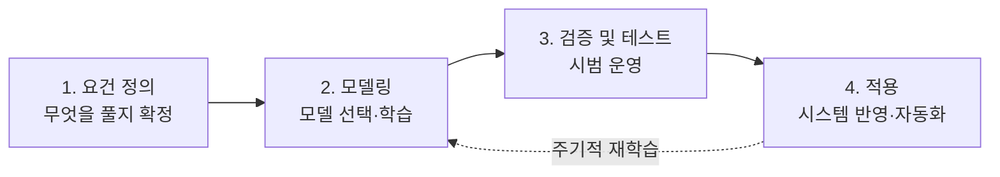
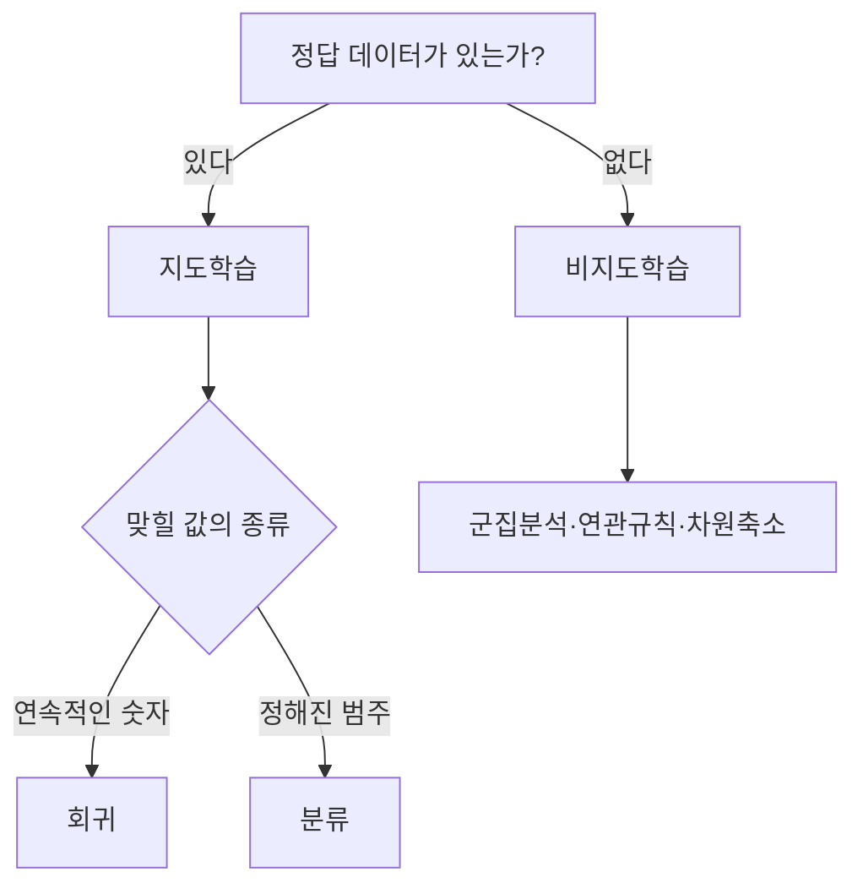
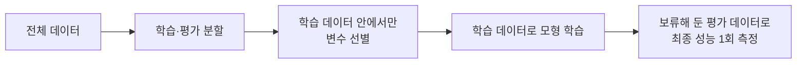

<Callout type="info">
  **이번 문서의 목표:** 주어진 상황을 보고 분류·회귀·군집 중 어떤 문제인지 판별하고, 그에 맞는 알고리즘을 고르며, 학습·검증·평가 데이터 분할과 교차검증 방식을 구별하고, 파라미터와 하이퍼파라미터를 정확히 나눌 수 있게 된다.
</Callout>

## 1. 왜 "모형 설계"라는 단계가 따로 있는가

데이터를 다 다듬고 나면 곧장 알고리즘을 돌리고 싶어집니다. 그런데 실제 프로젝트에서 가장 흔한 실패는 알고리즘이 나빠서가 아니라, **애초에 잘못된 문제를 풀었거나 성능을 잘못 쟀기 때문에** 생깁니다.

예를 들어 "고객 이탈을 예측해 달라"는 요청을 받았다고 합시다. 이 한 문장 안에는 답이 정해지지 않은 질문이 최소 세 개 숨어 있습니다.

- 이탈할지 **안 할지**(예 또는 아니오)를 맞히는 문제인가, 아니면 **며칠 뒤에** 이탈하는지 날짜를 맞히는 문제인가?
- 정답(이탈 여부)이 기록된 과거 데이터가 있는가, 없는가?
- 만든 모형이 "잘 맞는다"는 것을 **무엇으로** 증명할 것인가?

첫 번째 질문의 답이 문제 유형(분류인가 회귀인가)을 정하고, 두 번째 답이 지도학습인지 비지도학습인지를 정하며, 세 번째 답이 데이터 분할과 검증 방식을 정합니다. 이 세 가지를 정하는 일이 바로 **분석 모형 설계**(model design)입니다.

> **쉽게 말하면:** 모형 설계는 "무엇을 맞힐 것인가, 무엇으로 맞힐 것인가, 잘 맞혔는지 어떻게 확인할 것인가"를 미리 못 박아 두는 단계입니다.

**비유:** 요리에 비유하면 알고리즘은 조리 도구이고, 모형 설계는 "무슨 요리를 만들 것인지, 손님이 몇 명인지, 맛을 누가 어떻게 평가할 것인지"를 정하는 일입니다. 도구가 아무리 좋아도 만들 요리를 안 정하면 아무것도 나오지 않습니다.

시험에서 3과목(빅데이터 모델링)의 첫 항목 이름이 그대로 **분석모형 설계**입니다. 즉 이 편의 내용은 과목 이름에 직접 걸려 있는 출제 범위입니다.

## 2. 분석 모형 구축 절차 — 4단계 암기

기출에서 순서를 뒤섞어 놓고 고르게 하는 전형적인 암기 문항이 나옵니다. 네 단계와 각 단계의 세부 활동을 함께 외워야 합니다.

| 단계 | 하는 일 | 세부 활동 |
|------|---------|-----------|
| 1. 요건 정의 | 풀어야 할 문제를 확정 | 분석 대상(요건) 도출, 수행 방안 설계, 최종 요건 확정 |
| 2. 모델링 | 실제 모형을 만듦 | 모델 선택, 데이터 탐색, 유의 변수 도출, 모델링, 성능 평가 |
| 3. 검증 및 테스트 | 실제 환경 비슷하게 시험 | 시범 운영(파일럿), 운영 데이터로 성능 재확인 |
| 4. 적용 | 현업에 붙이고 유지 | 시스템 적용 및 자동화, 주기적 모델링 재수행 |

여기서 놓치기 쉬운 두 가지를 짚어 둡니다.

- **성능 평가는 2단계 모델링 안에 들어 있습니다.** "성능 평가는 4단계 적용에서 한다"는 식의 보기가 함정으로 나옵니다.
- **4단계에서 끝이 아닙니다.** 시간이 지나면 고객 행동이 바뀌어 모형이 낡습니다(모형 노후화). 그래서 **주기적으로 모델링을 재수행**한다는 문장이 4단계 설명에 반드시 붙습니다.

**비유:** 요건 정의는 설계도 그리기, 모델링은 건물 짓기, 검증 및 테스트는 준공 검사, 적용은 입주 후 정기 점검입니다. 점검 없이 입주만 하면 몇 년 뒤 건물이 무너집니다.

## 3. 문제 유형 식별 — 분류·회귀·군집

모든 설계의 출발점은 "이건 어떤 종류의 문제인가"입니다. 판별 기준은 딱 두 개입니다. **정답(레이블)이 있는가**, 그리고 **맞혀야 할 값이 숫자인가 범주인가**.

- **지도학습**(supervised learning): 문제와 정답이 짝지어진 데이터로 학습합니다. 정답을 **레이블**(label) 또는 **타깃**(target)이라고 부릅니다.
  - **회귀**(regression): 연속적인 **숫자값**을 예측합니다. 예를 들어 집값, 내일 기온, 다음 달 매출.
  - **분류**(classification): 정해진 **범주**(category)를 예측하고, 각 범주에 속할 **확률**을 함께 제시합니다. 예를 들어 스팸 메일 여부, 암 진단 결과, 동물 종류.
- **비지도학습**(unsupervised learning): 정답 없이 데이터 자체의 구조와 패턴을 찾습니다.
  - **군집분석**(clustering): 비슷한 데이터끼리 자동으로 묶습니다.
  - **연관규칙**(association rule): 같이 나타나는 패턴을 찾습니다. 예를 들어 마트 상품 진열, 영상 추천.

> **쉽게 말하면:** 정답지가 있으면 지도학습, 없으면 비지도학습. 정답이 숫자면 회귀, 이름표면 분류.

### 헷갈리기 쉬운 경계 사례

시험은 딱 떨어지는 예시 대신 애매한 상황을 줍니다. 판별 연습을 해 봅니다.

| 상황 | 유형 | 이유 |
|------|------|------|
| 고객이 다음 달 이탈할지 여부를 예측 | 분류 | 이탈·유지라는 두 범주 중 하나 |
| 고객이 다음 달 쓸 금액을 예측 | 회귀 | 금액은 연속적인 숫자 |
| 고객 만족도를 1–5점 등급으로 예측 | 분류(서열형) | 다섯 개 범주 중 하나. 간격이 균등하다고 볼 근거가 없음 |
| 정답 없이 고객을 비슷한 무리로 나눔 | 군집 | 나눌 무리의 정답이 미리 없음 |
| 신용등급이 매겨진 과거 자료로 새 고객 등급 예측 | 분류 | 정답 등급이 이미 존재 |
| 상품 A를 산 사람이 B도 사는지 규칙 발견 | 연관규칙 | 예측 대상 변수가 따로 없음 |

**자주 틀리는 점:** "1점부터 5점까지 예측"이라는 말만 보고 회귀로 고르는 실수가 흔합니다. 별점처럼 **순서는 있지만 간격이 같다고 보장할 수 없는 값**은 기본적으로 분류(서열형 분류) 문제로 봅니다. 반대로 "확률을 예측한다"는 표현이 나오면, 확률 자체는 0과 1 사이 연속값이지만 최종 목적이 범주 판정이면 **분류**입니다. 로지스틱 회귀가 이름에 회귀가 붙어 있으면서도 분류 기법인 이유가 여기에 있습니다.

## 4. 목적에 맞는 알고리즘 고르기 — 매핑표

기출 단골은 "다음 중 회귀에 사용할 수 없는 기법은?" 또는 "분류와 회귀 모두에 쓸 수 있는 것은?"입니다. 아래 표를 **세 칸으로 통째 암기**하는 것이 가장 빠릅니다.

| 용도 | 대표 기법 |
|------|-----------|
| 회귀 전용 | 선형회귀, 라쏘(Lasso), 릿지(Ridge), 엘라스틱넷(Elastic Net) |
| 분류 전용 | 로지스틱 회귀(logistic regression), 나이브 베이즈(Naive Bayes) |
| 분류·회귀 모두 가능 | 의사결정나무, 서포트벡터머신(SVM), KNN, 랜덤포레스트, 그래디언트 부스팅, XGBoost, LightGBM, CatBoost, 인공신경망 |
| 비지도(군집) | K-means, 계층적 군집, DBSCAN |

각 기법의 원리·장단점은 18편(지도학습)과 19편(비지도학습)에서 본격적으로 다룹니다. 여기서는 **어떤 상황에서 무엇을 고르는가**라는 선택 기준만 정리합니다.

| 상황·요구 | 우선 고려할 알고리즘 | 이유 |
|-----------|---------------------|------|
| 결과를 사람에게 설명해야 함(대출 거절 사유 등) | 의사결정나무, 로지스틱 회귀 | 규칙과 계수로 근거를 말할 수 있음 |
| 변수 간 관계가 복잡하고 성능이 최우선 | 랜덤포레스트, 부스팅 계열 | 비선형 관계를 잘 잡음, 대신 해석이 어려움 |
| 데이터가 적고 차원이 높음 | SVM | 경계 근처 데이터만 사용해 소표본에 비교적 강함 |
| 별도 학습 없이 즉시 예측 | KNN | 미리 만드는 모델이 없는 게으른 학습(lazy learning) |
| 정답 레이블이 아예 없음 | K-means, 계층적 군집, DBSCAN | 비지도 방식 |
| 변수가 너무 많아 골라내야 함 | 라쏘(Lasso) | 계수를 0으로 만들어 변수 선택 효과 |

**자주 틀리는 점:** "정확도가 가장 높은 알고리즘을 항상 고른다"는 보기는 오답입니다. 실제 선택 기준에는 **해석 가능성, 학습·예측 속도, 데이터 크기, 운영 환경**이 함께 들어갑니다. 대출 심사처럼 사유 설명이 법으로 요구되는 영역에서는 성능이 조금 낮아도 해석 가능한 모형을 고릅니다.

## 5. 데이터 분할 — 학습·검증·평가

### 왜 나누는가

모형을 학습시킨 그 데이터로 성능을 재면 어떻게 될까요? 당연히 잘 나옵니다. 이미 본 문제니까요. 이건 **자기가 낸 문제를 자기가 푸는 것**과 같아서 아무 의미가 없습니다.

> **쉽게 말하면:** 데이터를 나누는 이유는 "처음 보는 문제도 풀 수 있는가"를 확인하기 위해서입니다.

여기서 목표가 되는 성능을 **일반화 성능**(generalization performance)이라고 부릅니다. 새로운 데이터에 대해서도 모형이 얼마나 잘 동작하는지를 나타내는 성능입니다.

### 세 덩어리의 역할 — 공부·모의고사·수능 비유

| 구분 | 영어 이름 | 역할 | 수험 생활 비유 |
|------|-----------|------|----------------|
| 학습 데이터 | Train data | 모형이 규칙(파라미터)을 배우는 데 사용 | 문제집 풀며 **공부**하기 |
| 검증 데이터 | Validation data | 하이퍼파라미터 조정과 모델 선택에 사용 | **모의고사** 보고 공부법 고치기 |
| 평가 데이터 | Test data | 최종 모형의 성능을 객관적으로 한 번 측정 | **수능** 한 번 보고 끝 |

이 비유가 강력한 이유는 규칙까지 그대로 설명해 주기 때문입니다.

- 모의고사(검증)를 여러 번 보면서 공부 방법을 고치는 것은 정상입니다. 그래서 검증 데이터는 **여러 번 반복해서** 봅니다.
- 수능(평가)은 **딱 한 번**입니다. 수능 문제를 미리 보고 공부하면 그 점수는 실력을 의미하지 않습니다. 그래서 평가 데이터는 **모든 선택이 끝난 뒤 마지막에 한 번만** 씁니다.

비율은 상황에 따라 다르지만 6:2:2 또는 7:2:1이 흔히 쓰입니다. 손으로 계산해 봅니다. 전체 관측치가 1,000건이고 6:2:2로 나눈다고 하면,

$$
\text{학습} = 1000 \times 0.6 = 600
$$

$$
\text{검증} = 1000 \times 0.2 = 200
$$

$$
\text{평가} = 1000 \times 0.2 = 200
$$

- 1000: 전체 관측치 수(건)
- 0.6, 0.2, 0.2: 각 덩어리에 배정할 비율

즉 600건으로 학습하고, 200건으로 여러 설정을 비교해 하나를 고르고, 남은 200건으로 최종 점수를 한 번 보고합니다.

### 데이터 누수(Data Leakage) — 최근 회차 단골

**데이터 누수**(Data Leakage, 정보 유출)는 **검증이나 평가에 써야 할 데이터의 정보가 학습 과정에 스며들어 성능이 실제보다 좋게 왜곡되는 현상**입니다.

> **쉽게 말하면:** 수능 문제지가 미리 유출된 상태로 본 시험 점수와 같습니다. 점수는 높지만 실력은 아닙니다.

가장 자주 나오는 누수 시나리오는 **순서를 잘못 잡은 전처리와 변수 선택**입니다.

- 잘못된 순서: 전체 데이터로 표준화(평균·표준편차 계산) → 그 다음 학습·평가로 분할
- 올바른 순서: 먼저 분할 → 학습 데이터만으로 평균·표준편차 계산 → 그 값을 검증·평가 데이터에 그대로 적용

두 번째 시나리오는 **변수 선별**입니다. 유전자 자료 1만 2천 개 변수 중 질병 여부와 상관이 높은 200개를 고르는 상황을 생각해 봅니다. 전체 데이터를 다 보고 200개를 고른 뒤 분할하면, 그 200개는 이미 평가 데이터의 정답을 참고해서 뽑힌 것입니다. 실제 기출에서 정답으로 요구하는 순서는 이렇습니다.

**자주 틀리는 점:** 결측치 대치도 마찬가지입니다. 전체 데이터의 평균으로 결측치를 채운 뒤 분할하면 평가 데이터의 값이 학습에 섞여 들어갑니다. 결측치 처리 자체는 11편에서 다루지만, **분할이 먼저이고 전처리가 나중**이라는 순서는 이 편의 핵심입니다.

## 6. 교차검증 — 다섯 가지 방식 비교

### 왜 필요한가

한 번만 나눠서 성능을 재면, **운 좋게 쉬운 문제만 평가에 몰린 경우**에도 성능이 좋게 나옵니다. 반대로 운이 나쁘면 좋은 모형이 나쁘게 평가됩니다. 이 우연을 줄이려고 **여러 번 나눠 여러 번 평가하고 평균**을 내는 방법이 **교차검증**(cross validation)입니다.

> **쉽게 말하면:** 모의고사를 한 번만 보고 실력을 판단하지 않고, 여러 번 보고 평균을 내는 것입니다.

| 방식 | 방법 | 반복 횟수 | 특징 |
|------|------|-----------|------|
| 홀드아웃(Holdout) | 학습·검증·평가로 한 번만 분할 | 1회 | 가장 간단하고 빠름. 분할 운에 좌우됨 |
| K겹(K-fold) | 데이터를 K개 묶음으로 나눠 번갈아 검증 | K회 | 모든 관측치가 정확히 한 번씩 검증에 쓰임 |
| LOOCV | 관측치 1개만 검증, 나머지 전부 학습 | 관측치 수만큼 | 데이터가 아주 적을 때. 계산량이 매우 큼 |
| 층화추출(Stratified) | 각 묶음의 범주 비율을 전체와 같게 유지 | 결합해서 사용 | 불균형 데이터에 필수. K겹과 결합해 사용 |
| 부트스트랩(Bootstrap) | 복원추출로 표본을 만들고 뽑히지 않은 것으로 평가 | 지정한 횟수 | 중복 허용 추출. 회차마다 검증 대상이 달라짐 |

여기서 용어 두 개를 그 자리에서 풀어 둡니다.

- **복원추출**(sampling with replacement): 뽑은 것을 다시 넣고 또 뽑는 방식이라 같은 데이터가 여러 번 뽑힐 수 있습니다. 부트스트랩이 이 방식입니다.
- **층화**(stratified, 계층화): 전체에서 A범주가 90퍼센트, B범주가 10퍼센트라면 각 묶음에서도 그 비율을 90 대 10으로 맞추는 것입니다.

### K겹 교차검증 손계산

관측치 600개를 K가 6인 K겹 교차검증으로 평가한다고 합시다. 한 묶음(fold, 폴드)의 크기는

$$
\frac{600}{6} = 100
$$

- 600: 전체 관측치 수
- 6: 나눌 묶음의 개수 K

각 회차에서 **검증에 쓰는 묶음은 1개, 학습에 쓰는 묶음은 나머지 5개**입니다. 즉 학습 데이터는

$$
100 \times (6 - 1) = 500
$$

- 100: 한 묶음의 관측치 수
- 6 - 1: 검증용 1묶음을 뺀 나머지 묶음 수

정리하면 회차마다 **학습 500건, 검증 100건이고 이 과정을 총 6회 반복**합니다. 그래서 정확도 값도 **6개** 나옵니다. 여섯 회차의 정확도가 각각 0.82, 0.86, 0.80, 0.84, 0.88, 0.84였다면 먼저 모두 더합니다.

$$
0.82 + 0.86 + 0.80 + 0.84 + 0.88 + 0.84 = 5.04
$$

그 다음 회차 수로 나눕니다.

$$
\frac{5.04}{6} = 0.84
$$

- 5.04: 여섯 회차 정확도의 합
- 6: 회차 수 K

최종으로 보고하는 교차검증 성능은 **0.84**입니다. 이렇게 **회차 수와 성능 값의 개수가 반드시 같다**는 점이 계산 문항에서 실수를 걸러내는 지점입니다. K가 6인데 성능 값을 5개만 세어 5로 나누면 답이 달라집니다.

**자주 틀리는 점:** "K겹에서 각 회차는 K-1개 묶음으로 검증하고 1개로 학습한다"처럼 **학습과 검증을 맞바꾼 서술**이 오답 보기로 자주 나옵니다. 검증이 1개, 학습이 K-1개입니다.

### LOOCV의 반복 횟수

**LOOCV**(Leave One Out Cross Validation, 하나만 남기는 교차검증)는 관측치 1개를 검증용으로 두고 나머지 전부로 학습하는 과정을 **관측치 개수만큼** 반복합니다. 관측치가 3,000개면 3,000번 학습합니다. K겹에서 K를 관측치 수와 같게 놓은 극단적인 경우라고 이해하면 정확합니다.

**자주 틀리는 점:** LOOCV는 데이터를 최대한 활용하지만 계산량이 엄청나게 큽니다. "대용량 데이터에 가장 적합한 검증법"이라는 보기는 오답입니다. 오히려 **데이터가 매우 적을 때** 쓰는 방법입니다.

## 7. 파라미터와 하이퍼파라미터 — 기출 단골

이 구분은 거의 매 회차 나옵니다. 갈리는 기준은 **값이 정해지는 시점과 주체** 두 가지뿐입니다.

| 구분 | 파라미터(매개변수) | 하이퍼파라미터(초매개변수) |
|------|-------------------|---------------------------|
| 누가 정하나 | 데이터가 정함(학습으로 추정) | 사람이 정함(또는 탐색으로 선택) |
| 언제 정해지나 | 학습 도중·학습 결과로 | 학습을 시작하기 전에 |
| 예시 | 회귀계수, 신경망의 연결 가중치, 편향(bias) | 의사결정나무의 최대 깊이, 학습률, K겹의 K, KNN의 K, 드롭아웃 비율 |
| 저장 위치 비유 | 학습이 끝난 모델 파일 안 | 설정 파일 안 |

> **쉽게 말하면:** 하이퍼파라미터는 **오븐의 온도 다이얼**, 파라미터는 **구워진 빵의 상태**입니다. 다이얼은 사람이 굽기 전에 돌리고, 빵의 상태는 굽는 동안 저절로 결정됩니다.

**자주 틀리는 점 세 가지:**

- "선형회귀의 **회귀계수**는 분석가가 미리 정하는 하이퍼파라미터다" — 오답입니다. 회귀계수는 데이터로 추정되는 파라미터입니다.
- "**드롭아웃 비율**은 학습으로 추정되는 가중치다" — 오답입니다. 드롭아웃 비율은 사람이 설정하거나 검증으로 고르는 규제 하이퍼파라미터입니다.
- "**학습률**은 학습 중에 자동으로 계산되는 값이다" — 오답입니다. 학습률은 하이퍼파라미터이며, 스케줄러가 학습 중 조정하더라도 **초기값과 조정 규칙은 사람이 정합니다**.

### 하이퍼파라미터 탐색 방법 세 가지

| 방법 | 원리 | 장단점 |
|------|------|--------|
| 그리드 서치(Grid Search, 격자 탐색) | 후보값을 축마다 정해 두고 **모든 조합**을 빠짐없이 시도 | 확실하지만 축이 늘수록 시도 횟수가 곱으로 폭증 |
| 랜덤 서치(Random Search, 무작위 탐색) | 정해진 범위에서 조합을 **임의로** 뽑아 시도 | 같은 예산으로 중요한 축의 값을 더 다양하게 훑음 |
| 베이지안 최적화(Bayesian Optimization) | 지금까지의 결과로 성능에 대한 **확률모형**을 세우고 다음 시도 지점을 고름 | 적은 시도로 좋은 조합을 찾을 가능성이 높음 |

그리드 서치의 시도 횟수를 손으로 계산해 봅니다. 학습률 후보 3개, 최대 깊이 후보 4개를 모두 시도하면

$$
3 \times 4 = 12
$$

- 3: 학습률 후보의 개수
- 4: 최대 깊이 후보의 개수

조합이 12개입니다. 여기에 5겹 교차검증을 붙이면 실제 학습 횟수는

$$
12 \times 5 = 60
$$

- 12: 하이퍼파라미터 조합 수
- 5: 교차검증 회차 수 K

즉 **60번 학습**해야 합니다. 축을 하나만 더 추가해 후보 3개를 넣으면 조합이 36개, 학습은 180번으로 뜁니다. 이것이 "축이 늘수록 곱으로 증가한다"는 말의 실제 의미입니다.

**자주 틀리는 점:** "수동 조정은 분석가의 경험을 쓰므로 자동 탐색보다 **항상** 좋은 조합을 찾는다"는 보기는 오답입니다. 보기에 **항상, 반드시, 결코** 같은 단정어가 들어가면 거의 오답이라는 것이 이 시험의 일반 규칙이기도 합니다.

또 하나, **격자 탐색은 옵티마이저가 아닙니다.** 모멘텀(Momentum), 아담(Adam), 알엠에스프롭(RMSProp)은 학습 중 기울기로 가중치를 갱신하는 최적화 알고리즘이고, 격자 탐색은 **학습 바깥에서 설정값을 고르는 절차**입니다. 이 둘을 섞어 놓은 보기가 실제로 출제됐습니다.

## 8. 피처 엔지니어링 — 개념 수준

**피처**(feature, 특징·특성)는 모형의 입력으로 쓰이는 변수를 말합니다. **피처 엔지니어링**(feature engineering)은 이 입력 변수를 **모형이 잘 배울 수 있는 형태로 만들거나 골라내는 작업** 전체를 가리킵니다.

> **쉽게 말하면:** 같은 재료라도 통째로 넣느냐 썰어서 넣느냐에 따라 요리 맛이 달라지듯, 같은 데이터라도 어떻게 가공해 넣느냐가 성능을 크게 좌우합니다.

| 갈래 | 내용 | 간단한 예 |
|------|------|-----------|
| 파생변수 생성 | 기존 변수를 조합해 새 변수를 만듦 | 키와 몸무게로 체질량지수, 날짜로 주말 여부 |
| 변수 변환 | 분포를 대칭에 가깝게 만듦 | 소득에 로그 변환 |
| 스케일링 | 변수의 크기 범위를 맞춤 | 표준화, 정규화 |
| 인코딩 | 범주형을 숫자로 바꿈 | 원-핫 인코딩, 라벨 인코딩 |
| 변수 선택 | 필요한 변수만 남김 | 전진선택, 후진제거, 라쏘 |
| 차원축소 | 변수 수 자체를 줄임 | 주성분분석(PCA) |

각 기법의 계산과 주의점은 **12편(스케일링·인코딩·변환)** 과 **19편(차원축소)** 에서 자세히 다루므로 여기서는 이름과 목적만 잡고 넘어갑니다.

설계 관점에서 반드시 기억할 것은 딱 하나입니다. **피처 엔지니어링의 기준값은 학습 데이터에서만 뽑는다.** 표준화의 평균과 표준편차, 인코딩의 범주 목록, 결측 대치의 대푯값 모두 학습 데이터에서 계산해 검증·평가 데이터에 적용합니다. 이 원칙을 어기는 순간 5절에서 배운 데이터 누수가 발생합니다.

## 9. 평가지표는 어디서 다루나

모형을 만들었으면 "얼마나 잘 맞히나"를 재야 합니다. 이 편에서는 **어떤 데이터로 재는가**(분할·교차검증)까지만 다뤘고, **무엇으로 재는가**(지표)는 다음처럼 나뉩니다.

- **분류 모형 평가**: 혼동행렬, 정확도·정밀도·재현율·F1 점수·특이도, ROC 곡선과 AUC → **20편**
- **회귀·군집 모형 평가**: 평균제곱오차(MSE), 평균제곱근오차(RMSE), 평균절대오차(MAE), 결정계수, 실루엣 계수, 과적합과 규제 → **21편**

지금 단계에서 알아 둘 것은 **문제 유형이 지표를 결정한다**는 사실입니다. 분류 문제에 평균제곱오차를 쓰거나 회귀 문제에 정확도를 쓰는 보기는 그 자체로 오답입니다.

## 10. 시험에서 어떻게 물어보나

3과목 분석모형 설계 영역의 출제 패턴은 크게 다섯 가지로 정리됩니다.

**유형 1 — 절차 순서 맞추기.** 요건 정의·모델링·검증 및 테스트·적용의 순서를 뒤섞어 제시합니다. 함정은 "성능 평가"를 적용 단계에 붙여 놓는 보기, 그리고 "적용 후에는 모형을 다시 손대지 않는다"는 보기입니다. 후자는 주기적 재학습을 부정하므로 오답입니다.

**유형 2 — 알고리즘 분류.** "다음 중 회귀에 사용할 수 없는 것은" 형태입니다. 함정은 **로지스틱 회귀**입니다. 이름에 회귀가 들어 있어 회귀 기법으로 착각하기 쉽지만 분류 전용입니다. 반대로 **의사결정나무·SVM·KNN·랜덤포레스트**를 "분류 전용"으로 몰아넣은 보기도 오답입니다. 이들은 회귀도 가능합니다.

**유형 3 — 데이터 분할과 누수.** 대표적으로 "검증용 자료는 무엇에 쓰이는가"를 묻고, **학습 데이터 성능으로 설정값을 고른다**는 보기를 오답으로 심어 둡니다. 학습 성능은 모형을 복잡하게 할수록 계속 좋아지므로 선택 기준이 될 수 없습니다. 또 변수 선별과 분할의 순서를 묻는 문항에서는 **분할이 먼저**가 정답입니다.

**유형 4 — 교차검증 계산.** 관측치 수와 K를 주고 회차별 학습·검증 건수를 묻거나, 조건(묶음 수, 범주 비율 유지, 모든 관측치 1회 검증)을 나열하고 해당하는 방식을 고르게 합니다. 조건에 **범주 비율 유지**가 있으면 답은 층화 K겹입니다. **복원추출**이 있으면 부트스트랩입니다.

**유형 5 — 파라미터 대 하이퍼파라미터.** 목록을 주고 성격이 다른 하나를 고르게 합니다. 회귀계수와 신경망 가중치는 파라미터, 최대 깊이·학습률·드롭아웃 비율·K는 하이퍼파라미터입니다. 탐색 기법을 짝짓는 문항에서는 **격자 탐색을 옵티마이저에 섞어 놓은 보기**와 **항상이라는 단정어가 붙은 보기**를 먼저 의심하세요.

## 핵심 정리

- 분석 모형 구축 절차는 **요건 정의 → 모델링 → 검증 및 테스트 → 적용**이며, 성능 평가는 모델링 단계 안에 있고 적용 후에는 주기적으로 재학습한다.
- 정답이 있으면 지도학습(숫자면 회귀, 범주면 분류), 없으면 비지도학습(군집·연관규칙)이다. 로지스틱 회귀는 이름과 달리 **분류 전용**이고, 의사결정나무·SVM·KNN·랜덤포레스트는 분류와 회귀 모두 가능하다.
- 학습(공부)·검증(모의고사)·평가(수능) 데이터는 역할이 다르며, 평가 데이터는 모든 선택이 끝난 뒤 **한 번만** 쓴다. 전처리·변수 선별은 **분할 이후 학습 데이터 안에서만** 수행해야 데이터 누수를 막는다.
- 교차검증에서 K겹은 각 회차마다 **검증 1묶음, 학습 K-1묶음**이며 총 K회 반복한다. 층화는 범주 비율 유지, 부트스트랩은 복원추출, LOOCV는 관측치 수만큼 반복이 핵심 키워드다.
- 파라미터는 **데이터가 학습으로 정하는 값**(회귀계수, 가중치), 하이퍼파라미터는 **사람이 학습 전에 정하는 값**(최대 깊이, 학습률, K, 드롭아웃 비율)이다. 탐색은 그리드 서치, 랜덤 서치, 베이지안 최적화 순으로 효율이 좋아진다.

## 마무리 복습

<Quiz
  questionNumber={1}
  question="분석 모형 구축 절차를 순서대로 바르게 나열한 것은?"
  options={['요건 정의 → 모델링 → 검증 및 테스트 → 적용', '모델링 → 요건 정의 → 적용 → 검증 및 테스트', '요건 정의 → 검증 및 테스트 → 모델링 → 적용', '적용 → 모델링 → 요건 정의 → 검증 및 테스트']}
  correctAnswer={1}
  explanation="분석 모형 구축은 요건 정의(분석 대상 도출과 최종 요건 확정), 모델링(모델 선택·데이터 탐색·유의 변수 도출·성능 평가), 검증 및 테스트(시범 운영), 적용(시스템 반영·자동화와 주기적 재모델링) 순서로 진행한다. 성능 평가는 모델링 단계 안에 포함된다는 점도 함께 기억해야 한다."
  optionExplanations={['요건 정의로 시작해 적용으로 끝나는 표준 순서로 옳다.', '모델링이 요건 정의보다 앞설 수 없다. 무엇을 풀지 정해야 모형을 만든다.', '검증 및 테스트는 모델링이 끝난 뒤에 수행하므로 순서가 뒤집혔다.', '적용은 마지막 단계이므로 맨 앞에 올 수 없다.']}
/>

<Quiz
  questionNumber={2}
  question="다음 중 회귀 문제에는 사용할 수 없고 분류 문제에만 사용하는 기법으로 짝지어진 것은?"
  options={['선형회귀와 릿지', '로지스틱 회귀와 나이브 베이즈', '의사결정나무와 랜덤포레스트', 'KNN과 서포트벡터머신']}
  correctAnswer={2}
  explanation="로지스틱 회귀는 이름에 회귀가 들어 있지만 범주를 예측하는 분류 전용 기법이고, 나이브 베이즈도 분류 전용이다. 선형회귀와 릿지는 회귀 전용이며, 의사결정나무·랜덤포레스트·KNN·SVM은 분류와 회귀 모두에 사용할 수 있다."
  optionExplanations={['선형회귀와 릿지는 반대로 회귀 전용 기법이다.', '두 기법 모두 범주를 예측하는 분류 전용이므로 옳다.', '의사결정나무와 랜덤포레스트는 회귀에도 사용할 수 있다.', 'KNN과 SVM 역시 회귀 버전이 존재하여 둘 다 가능하다.']}
/>

<Quiz
  questionNumber={3}
  question="관측치 800개를 K가 8인 K겹 교차검증으로 평가할 때, 각 회차의 학습 데이터와 검증 데이터 건수 및 총 반복 횟수로 옳은 것은?"
  options={['학습 100건, 검증 700건, 8회 반복', '학습 700건, 검증 100건, 8회 반복', '학습 700건, 검증 100건, 1회 반복', '학습 400건, 검증 400건, 2회 반복']}
  correctAnswer={2}
  explanation="한 묶음의 크기는 800÷8=100건이다. 각 회차에서 검증에 쓰는 묶음은 1개(100건)이고 학습에는 나머지 7묶음(700건)을 쓴다. 이 과정을 묶음 개수만큼인 8회 반복한다. 학습과 검증의 묶음 수를 바꿔 서술한 보기가 대표적인 함정이다."
  optionExplanations={['학습과 검증의 건수를 서로 맞바꾼 전형적인 오답이다.', '학습 7묶음 700건, 검증 1묶음 100건, 총 8회 반복이 맞다.', '건수는 맞지만 K겹은 K회 반복하므로 1회 반복은 홀드아웃 설명이다.', '절반씩 나눠 2회 반복하는 것은 K가 2인 경우이며 문제 조건과 다르다.']}
/>

<Quiz
  questionNumber={4}
  question="다음 조건을 모두 만족하는 검증 방법은? (가) 데이터를 5개 묶음으로 나눈다 (나) 각 묶음의 범주 비율을 전체와 같게 유지한다 (다) 모든 관측치가 정확히 한 번씩 검증에 사용된다"
  options={['홀드아웃 검증', '층화 5겹 교차검증', 'LOOCV', '부트스트랩 검증']}
  correctAnswer={2}
  explanation="묶음 수 5, 범주 비율 보존, 모든 관측치 1회 검증이라는 세 조건을 동시에 만족하는 것은 층화 5겹 교차검증이다. 홀드아웃은 반복이 1회이고, LOOCV는 반복이 관측치 수만큼이며, 부트스트랩은 복원추출이라 검증 대상과 횟수가 회차마다 달라진다."
  optionExplanations={['홀드아웃은 한 번만 분할하므로 5개 묶음과 반복 조건을 만족하지 않는다.', '세 조건을 모두 만족하는 유일한 방식이므로 정답이다.', 'LOOCV는 관측치 개수만큼 반복하므로 묶음 수 5와 맞지 않는다.', '부트스트랩은 복원추출이므로 모든 관측치가 정확히 한 번씩 검증된다는 조건이 성립하지 않는다.']}
/>

<Quiz
  questionNumber={5}
  question="파라미터와 하이퍼파라미터의 구별에 대한 설명으로 옳지 않은 것은?"
  options={['신경망의 연결 가중치는 학습 과정에서 갱신되는 파라미터다', '의사결정나무의 최대 깊이와 경사하강법의 학습률은 하이퍼파라미터다', '드롭아웃 비율은 사람이 설정하거나 검증으로 고르는 하이퍼파라미터다', '선형회귀의 회귀계수는 분석가가 학습 전에 직접 정하는 하이퍼파라미터다']}
  correctAnswer={4}
  explanation="회귀계수는 데이터로부터 추정되는 파라미터이지 사람이 미리 정하는 하이퍼파라미터가 아니다. 두 개념은 값이 결정되는 시점(학습 전인가 학습 중인가)과 주체(사람인가 데이터인가)로 갈린다."
  optionExplanations={['연결 가중치는 학습으로 갱신되는 대표적인 파라미터이므로 옳다.', '최대 깊이와 학습률은 학습 전에 사람이 정하는 하이퍼파라미터이므로 옳다.', '드롭아웃 비율은 규제 하이퍼파라미터이므로 옳은 설명이다.', '회귀계수는 데이터로 추정되는 파라미터이므로 이 설명이 틀렸다.']}
/>

<Quiz
  questionNumber={6}
  question="학습률 후보 4개와 최대 깊이 후보 5개를 정해 모든 조합을 5겹 교차검증으로 평가할 때, 수행되는 총 학습 횟수는?"
  options={['20회', '25회', '100회', '125회']}
  correctAnswer={3}
  explanation="조합 수는 4×5=20개이고, 각 조합마다 5겹 교차검증으로 5번 학습하므로 20×5=100회다. 20회는 교차검증을 빠뜨린 값이고 25회와 125회는 후보 수를 잘못 곱한 값이다."
  optionExplanations={['20회는 조합 수만 센 값으로 교차검증 반복이 빠졌다.', '25회는 5×5로 잘못 계산한 값이다.', '조합 20개에 교차검증 5회를 곱한 100회가 맞다.', '125회는 5의 세제곱으로 문제 조건과 무관한 값이다.']}
/>

<Quiz
  questionNumber={7}
  question="유전자 자료 1만 2천 개 변수 중 질병 여부와 상관이 높은 200개만 남겨 분류모형을 만들고 일반화 성능을 편향 없이 보고하려 한다. 가장 적절한 수행 순서는?"
  options={['전체 자료로 200개 변수를 고른 뒤 학습·평가로 분할하고 학습·성능 산출', '학습·평가로 먼저 분할하고 학습 자료 안에서만 변수를 고른 뒤 학습하고 평가 자료로 성능 산출', '평가 자료로 변수를 고른 뒤 학습 자료로 학습하고 평가 자료로 성능 산출', '전체 자료로 학습과 성능 산출을 모두 수행한 뒤 마지막에 분할']}
  correctAnswer={2}
  explanation="변수 선별도 자료를 들여다보는 학습 과정의 일부이므로, 평가 자료의 정보가 선별에 쓰이면 데이터 누수가 발생해 성능이 실제보다 좋게 나온다. 먼저 분할하고 학습 자료 안에서만 선별한 뒤, 보류해 둔 평가 자료로 마지막에 한 번 성능을 산출해야 한다."
  optionExplanations={['전체 자료로 변수를 고르면 평가 자료의 정답 정보가 선별에 새어 들어가 누수가 발생한다.', '분할이 먼저이고 선별은 학습 자료 안에서만 하는 이 순서가 옳다.', '평가 자료로 변수를 고르는 것은 가장 직접적인 데이터 누수다.', '분할 없이 전체로 성능을 내면 일반화 성능이 아니라 학습 성능을 보고하는 셈이다.']}
/>

<Quiz
  questionNumber={8}
  question="하이퍼파라미터 탐색 기법에 대한 설명으로 옳지 않은 것은?"
  options={['격자 탐색은 후보값의 모든 조합을 시도하므로 축이 늘수록 시도 횟수가 곱으로 증가한다', '무작위 탐색은 같은 예산에서 중요한 축의 값을 더 다양하게 훑을 수 있다', '베이지안 최적화는 지금까지의 결과로 확률모형을 세워 다음 시도 지점을 정한다', '격자 탐색은 학습 중 기울기로 가중치를 갱신하는 최적화 알고리즘의 하나다']}
  correctAnswer={4}
  explanation="격자 탐색은 학습 바깥에서 하이퍼파라미터 조합을 고르는 절차이지 가중치를 갱신하는 옵티마이저가 아니다. 기울기로 가중치를 갱신하는 것은 모멘텀, 아담, 알엠에스프롭 같은 경사하강법 계열이다."
  optionExplanations={['모든 조합을 시도하므로 축이 늘면 곱으로 증가한다는 설명은 옳다.', '무작위 탐색의 대표적인 장점을 정확히 설명했다.', '베이지안 최적화의 원리를 정확히 설명했다.', '격자 탐색은 옵티마이저가 아니라 설정값 탐색 절차이므로 이 설명이 틀렸다.']}
/>

## 참고 자료

- [한국데이터산업진흥원 - 빅데이터분석기사 자격시험 안내](https://www.dataq.or.kr/www/sub/a_07.do)
- [코리아IT아카데미 - 빅데이터 분석기사 과목별 세부 항목](https://www.koreaisacademy.com/2025/cer/datascience/bigdata.asp)
- [Statistics Playbook - 빅데이터분석기사 완전 가이드](https://statisticsplaybook.com/big-data-analysis-engineer-guide/)
- [SQLDpass - 빅데이터분석기사 필기 기출·복원](https://www.sqldpass.com/past-exams?cert=BIGDATA_ANALYST)
