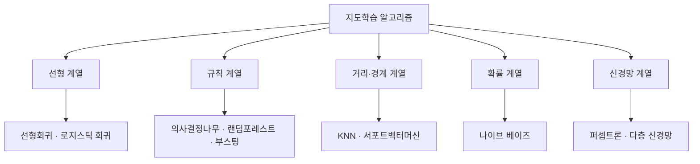
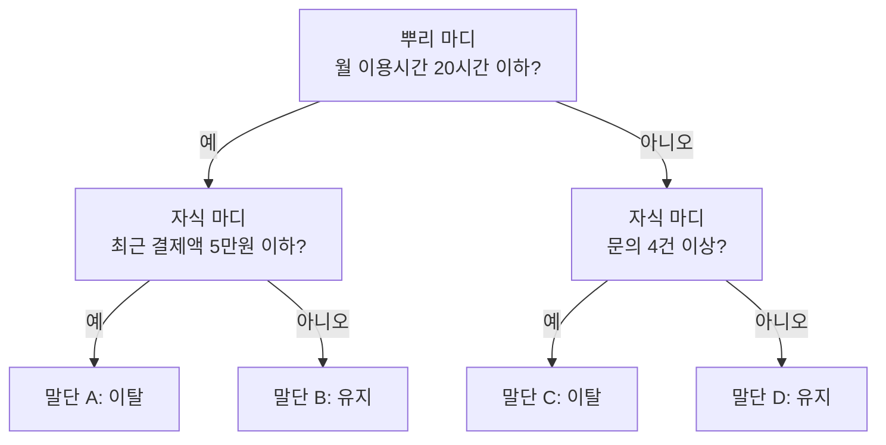

<Callout type="info">
  **이번 문서의 목표:** 필기에 출제되는 지도학습 알고리즘의 작동 원리를 손계산으로 확인하고, 각 알고리즘의 장단점과 보기 함정을 구분해 "옳지 않은 것을 고르시오" 유형을 안정적으로 풀 수 있게 된다.
</Callout>

## 1. 지도학습이라는 큰 그림

**지도학습**(supervised learning, 감독학습)은 **문제와 정답이 짝지어진 데이터**로 규칙을 배우는 방식입니다. 정답에 해당하는 값을 **레이블**(label, 이름표) 또는 **타깃**(target, 목표값)이라고 부릅니다.

> **쉽게 말하면:** 정답지가 붙은 문제집으로 공부하는 것이 지도학습입니다.

맞혀야 할 정답이 **연속적인 숫자**면 **회귀**(regression), **정해진 범주**면 **분류**(classification)입니다. 이 구분과 알고리즘 선택 기준은 17편에서 다뤘으므로, 이 편은 **각 알고리즘이 실제로 어떻게 작동하는지**에 집중합니다.

이 다섯 갈래는 "무엇을 근거로 예측하는가"가 서로 다릅니다. 선형 계열은 **가중치의 합**, 규칙 계열은 **질문의 연쇄**, 거리 계열은 **가까움**, 확률 계열은 **조건부 확률**, 신경망은 **여러 층의 비선형 변환**으로 예측합니다. 이 차이를 기억해 두면 각 알고리즘의 장단점이 저절로 따라옵니다.

## 2. 로지스틱 회귀 — 오즈와 로짓

### 왜 필요한가

합격 여부(1 또는 0)를 예측한다고 합시다. 선형회귀 직선을 그대로 쓰면 예측값이 1.7이나 -0.3처럼 **확률로 볼 수 없는 값**이 나옵니다. 확률은 0 이상 1 이하여야 하는데 직선은 위아래로 무한히 뻗기 때문입니다.

> **쉽게 말하면:** 로지스틱 회귀는 직선의 결과를 "0과 1 사이로 눌러 담는" 장치를 붙여 분류에 쓸 수 있게 만든 회귀입니다.

### 오즈 — 확률을 비율로 바꾸기

**오즈**(odds, 승산)는 **어떤 사건이 일어날 확률을 일어나지 않을 확률로 나눈 값**입니다.

$$
\text{오즈} = \frac{p}{1 - p}
$$

- $p$ (피): 사건이 일어날 확률. 0 이상 1 이하
- $1 - p$: 사건이 일어나지 않을 확률

확률이 0.6이면 오즈는 이렇게 계산됩니다.

$$
\frac{0.6}{1 - 0.6} = \frac{0.6}{0.4} = 1.5
$$

**말로 해석하면** "일어날 가능성이 일어나지 않을 가능성의 1.5배"입니다. 경마나 스포츠 도박의 배당률이 바로 이 오즈입니다.

여기서 중요한 성질이 나옵니다. 확률은 0에서 1까지만 움직이지만, **오즈는 0에서 무한대까지** 움직입니다. 확률이 0.99면 오즈는 99, 확률이 0.999면 오즈는 999입니다. 범위가 한쪽으로 열린 셈입니다.

### 로짓 — 오즈에 로그를 씌우기

오즈는 위로는 열렸지만 아래로는 0에서 막혀 있습니다. 여기에 자연로그를 씌우면 아래쪽도 열립니다. 이것이 **로짓**(logit, 로그 오즈)입니다.

$$
\text{로짓} = \ln\left(\frac{p}{1-p}\right)
$$

- $\ln$ (로그 자연, natural log): 밑이 $e$(약 2.718)인 로그
- 분수 $p / (1-p)$: 앞에서 구한 오즈

확률 0.6의 로짓을 구해 봅니다. 오즈가 1.5였으므로,

$$
\ln(1.5) \approx 0.405
$$

이제 범위를 정리하면 이렇게 됩니다.

| 척도 | 범위 | 확률 0.5일 때 값 |
|------|------|------------------|
| 확률 $p$ | 0 이상 1 이하 | 0.5 |
| 오즈 | 0 이상 무한대 | 1 |
| 로짓(로그 오즈) | 음의 무한대에서 양의 무한대 | 0 |

**핵심:** 로짓은 직선이 갈 수 있는 범위와 정확히 같아졌습니다. 그래서 로지스틱 회귀는 **확률이 아니라 로짓을 직선으로 모형화**합니다.

$$
\ln\left(\frac{p}{1-p}\right) = \beta_0 + \beta_1 x_1 + \beta_2 x_2
$$

- $\beta_0$ (베타 제로): 절편. 모든 설명변수가 0일 때의 로그 오즈
- $\beta_1, \beta_2$ (베타 원, 베타 투): 각 설명변수의 회귀계수
- $x_1, x_2$: 설명변수

이 식을 $p$에 대해 풀면 **시그모이드 함수**(sigmoid function, S자 곡선)가 나옵니다.

$$
p = \frac{1}{1 + e^{-(\beta_0 + \beta_1 x_1)}}
$$

- $e$ (자연상수): 약 2.718
- 지수 부분의 값이 커지면 $p$는 1에 가까워지고, 작아지면 0에 가까워집니다

### 계수 해석 — 기출 최다 출제 지점

구독 해지 확률 $p$에 대해 다음 모형이 얻어졌다고 합시다.

$$
\ln\left(\frac{p}{1-p}\right) = -1.2 + 0.7 x_1 - 0.4 x_2
$$

- $x_1$: 월 문의 횟수
- $x_2$: 월 이용 일수

해석은 **두 단계**로 합니다.

**1단계, 로짓 척도에서:** 다른 변수가 같을 때 월 문의 횟수가 1회 늘면 **로그 오즈가 0.7만큼 더해집니다.** 덧셈 변화입니다.

**2단계, 오즈 척도로 되돌리면:** 로그를 벗기면 덧셈이 곱셈이 됩니다.

$$
e^{0.7} \approx 2.01
$$

즉 문의 횟수가 1회 늘면 해지의 **오즈가 약 2.0배**가 됩니다.

반대 방향도 봅니다. 이용 일수의 계수는 -0.4이므로

$$
e^{-0.4} \approx 0.67
$$

이용 일수가 하루 늘면 해지 오즈가 약 0.67배, 곧 **약 33퍼센트 줄어듭니다.**

> **쉽게 말하면:** 계수는 로짓에는 더해지고, 오즈에는 곱해집니다. 부호가 양수면 오즈 증가, 음수면 오즈 감소입니다.

**자주 틀리는 점 세 가지:**

- "문의 횟수가 1회 늘면 **확률이 0.7만큼** 커진다" — 오답입니다. 0.7이 더해지는 것은 확률이 아니라 **로그 오즈**입니다.
- "이용 일수가 1일 늘면 오즈에 **0.4가 곱해진다**" — 오답입니다. 곱해지는 값은 계수 자체가 아니라 e의 계수 제곱인 0.67입니다.
- "상수항 -1.2는 문의 횟수가 **1회일 때**의 로그 오즈다" — 오답입니다. 절편은 모든 설명변수가 **0일 때**의 로그 오즈입니다.

### 오즈비 손계산

**오즈비**(odds ratio, OR)는 두 집단의 오즈를 나눈 값입니다. 알림을 받은 집단 150명 중 90명이 구매하고, 알림을 받지 않은 집단 200명 중 50명이 구매했다고 합시다.

알림 집단의 오즈는

$$
\frac{90}{150 - 90} = \frac{90}{60} = 1.5
$$

비알림 집단의 오즈는

$$
\frac{50}{200 - 50} = \frac{50}{150} = \frac{1}{3}
$$

오즈비는

$$
1.5 \div \frac{1}{3} = 1.5 \times 3 = 4.5
$$

**말로 해석하면** "알림을 받으면 구매의 오즈가 4.5배가 된다"입니다. 확률이 4.5배라는 뜻이 아니라는 점이 함정입니다.

**추가 출제 포인트:** 로지스틱 회귀는 설명변수 자체가 정규분포를 따를 것을 요구하지 않습니다. 또 계수 추정에 최소제곱법(OLS)이 아니라 **최대우도추정법**(Maximum Likelihood Estimation, 가능도를 최대로 만드는 값을 찾는 방법)을 씁니다. "OLS만으로 구한다"는 보기는 오답입니다.

## 3. 의사결정나무 — 질문을 이어 붙이는 모형

### 원리와 구조 용어

**의사결정나무**(decision tree)는 **데이터를 특정 기준으로 반복해 둘 이상으로 나누어 나무 구조를 만들고**, 그 규칙으로 분류나 회귀를 수행하는 기법입니다.

> **쉽게 말하면:** 스무고개입니다. "월 이용시간이 20시간을 넘나요?" 같은 질문을 던져 가며 답을 좁혀 갑니다.

| 용어 | 뜻 |
|------|-----|
| 뿌리 마디(root node) | 맨 위, 전체 데이터가 모여 있는 출발점 |
| 자식 마디(child node) | 분할로 생긴 아래쪽 마디 |
| 말단 마디(terminal node, leaf) | 더 나누지 않고 예측값을 내는 마디 |
| 깊이(depth) | 뿌리에서 말단까지의 단계 수 |
| 가지(branch) | 마디를 잇는 선, 곧 하나의 규칙 경로 |

예측은 규칙을 따라 내려가면 끝납니다. 이용시간 32시간, 결제액 3만원, 문의 5건인 고객은 32시간이 20시간을 넘으므로 오른쪽으로 가고, 문의 5건이 4건 이상이므로 **말단 C**로 분류됩니다.

### 분리 기준 — 무엇을 보고 나눌지 정하는가

나무는 나눌 때마다 "어느 질문이 가장 좋은가"를 판단해야 합니다. 기준은 **자식 마디가 얼마나 순수해졌는가**입니다.

**순수도**(purity)는 한 마디 안의 데이터가 얼마나 한 범주로 몰려 있는지를 뜻합니다. 반대말이 **불순도**(impurity)입니다. 100퍼센트 한 범주면 불순도 0, 반반씩 섞여 있으면 불순도가 최대입니다.

| 문제 유형 | 사용하는 분리 기준 |
|-----------|-------------------|
| 분류 | 지니 불순도(지니지수), 엔트로피 기반 정보이득, 카이제곱 통계량 |
| 회귀 | 분산 감소, F 통계량(분산비) |

알고리즘별로도 다릅니다. **CART**는 지니지수를 쓰며 항상 **두 갈래**로 나눕니다(이진 분할). **C4.5** 계열은 정보이득비, **CHAID**는 카이제곱 통계량을 씁니다.

### 지니 불순도 손계산 — 중간 단계 전부

**지니 불순도**(Gini impurity)의 공식입니다.

$$
G = 1 - \sum_{i=1}^{k} p_i^2
$$

- $G$: 지니 불순도. 0에 가까울수록 순수
- $\sum$ (시그마, 모두 더하라는 기호)
- $p_i$: $i$번째 범주에 속한 데이터의 비율
- $k$: 범주의 개수

**부모 마디를 계산합니다.** 데이터 10개가 이탈 6개, 유지 4개로 섞여 있다고 합시다.

먼저 비율을 구합니다.

$$
p_{\text{이탈}} = \frac{6}{10} = 0.6
$$

$$
p_{\text{유지}} = \frac{4}{10} = 0.4
$$

각 비율을 제곱합니다.

$$
0.6^2 = 0.36
$$

$$
0.4^2 = 0.16
$$

제곱을 더합니다.

$$
0.36 + 0.16 = 0.52
$$

1에서 뺍니다.

$$
G_{\text{부모}} = 1 - 0.52 = 0.48
$$

**부모 마디의 지니 불순도는 0.48입니다.** 범주가 두 개일 때 지니의 최댓값은 반반일 때의 0.5이므로, 0.48은 거의 최대에 가깝게 섞여 있다는 뜻입니다.

**이제 분할해 봅니다.** "결제액 5만원 이하"라는 질문으로 나눴더니 이렇게 갈렸습니다.

- 왼쪽 자식: 5개(이탈 5, 유지 0)
- 오른쪽 자식: 5개(이탈 1, 유지 4)

왼쪽 자식의 지니는

$$
1 - (1.0^2 + 0.0^2) = 1 - 1 = 0
$$

완전히 순수합니다. 오른쪽 자식의 비율은

$$
p_{\text{이탈}} = \frac{1}{5} = 0.2
$$

$$
p_{\text{유지}} = \frac{4}{5} = 0.8
$$

제곱해서 더하면

$$
0.2^2 + 0.8^2 = 0.04 + 0.64 = 0.68
$$

따라서 오른쪽 자식의 지니는

$$
1 - 0.68 = 0.32
$$

**자식 전체의 불순도는 데이터 개수로 가중평균**합니다. 양쪽 모두 5개씩이므로 가중치는 각각 0.5입니다.

$$
G_{\text{자식}} = 0.5 \times 0 + 0.5 \times 0.32 = 0.16
$$

**불순도 감소량**(지니 이득)은

$$
0.48 - 0.16 = 0.32
$$

**말로 해석하면** 이 질문 하나로 불순도가 0.48에서 0.16으로 떨어졌고, 감소폭 0.32만큼 데이터가 깔끔해졌습니다. 나무는 가능한 모든 질문 후보에 대해 이 감소량을 계산하고 **가장 크게 줄이는 질문**을 고릅니다.

### 엔트로피 손계산

**엔트로피**(entropy, 무질서도)는 정보이론에서 온 불순도 측정치입니다.

$$
H = -\sum_{i=1}^{k} p_i \log_2 p_i
$$

- $H$: 엔트로피. 단위는 비트(bit)
- $\log_2$ (로그 이): 밑이 2인 로그
- 앞의 음수 부호: 로그값이 음수라 부호를 뒤집어 양수로 만듦

같은 6 대 4 데이터로 계산합니다. 필요한 로그값은 $\log_2 0.6 \approx -0.737$, $\log_2 0.4 \approx -1.322$입니다.

$$
H = -\left(0.6 \times (-0.737) + 0.4 \times (-1.322)\right)
$$

괄호 안을 먼저 계산합니다.

$$
0.6 \times (-0.737) = -0.442
$$

$$
0.4 \times (-1.322) = -0.529
$$

$$
-0.442 + (-0.529) = -0.971
$$

부호를 뒤집습니다.

$$
H = 0.971
$$

**말로 해석하면** 엔트로피 0.971은 최댓값 1(완전히 반반)에 가까우므로 이 마디는 매우 어수선합니다. 분할 뒤 엔트로피가 줄어든 양을 **정보이득**(Information Gain)이라고 부릅니다.

| 지표 | 두 범주일 때 최댓값 | 최댓값이 나오는 상황 | 최솟값 |
|------|--------------------|---------------------|--------|
| 지니 불순도 | 0.5 | 5 대 5로 반반 | 0 (완전 순수) |
| 엔트로피 | 1 | 5 대 5로 반반 | 0 (완전 순수) |

두 지표는 값의 크기만 다를 뿐 **커질수록 어수선하다**는 방향이 같습니다. 실무에서 어느 쪽을 써도 나무 모양은 대체로 비슷하게 나옵니다.

**자주 틀리는 점:** "지니지수가 클수록 순수하다"는 보기는 오답입니다. **지니와 엔트로피는 모두 불순도** 지표이므로 작을수록 순수합니다. 이름에 순수도라는 말이 붙어 있어도 값의 방향은 불순도라는 점을 기억하세요.

### 가지치기와 정지 규칙

나무를 끝까지 자라게 두면 말단마다 데이터가 한두 개씩만 남을 때까지 나뉩니다. 이러면 학습 데이터는 100퍼센트 맞히지만 새 데이터에서는 형편없어집니다. 이것이 **과대적합**(overfitting, 과적합)입니다.

**가지치기**(pruning)는 **다 자란 나무의 일부 마디를 잘라 내어 과대적합을 줄이고 예측 안정성을 높이는 절차**입니다.

> **쉽게 말하면:** 웃자란 나뭇가지를 잘라 나무 모양을 단정하게 다듬는 일입니다.

가지를 아예 자라지 못하게 막는 **정지 규칙**(stopping rule)도 함께 씁니다. 대표적인 조건입니다.

- 마디의 데이터 수가 정한 값보다 적으면 더 나누지 않는다
- 나무 깊이가 정한 최대 깊이에 도달하면 멈춘다
- 불순도 감소량이 정한 값보다 작으면 멈춘다
- 마디가 이미 완전히 순수하면 멈춘다

**자주 틀리는 점:** "가지치기는 예측 정확도를 학습 데이터에서 높이기 위한 절차"라는 보기는 오답입니다. 가지치기를 하면 **학습 데이터 성능은 오히려 떨어지고** 대신 검증·평가 데이터 성능이 올라갑니다. 목적은 일반화입니다.

### 장단점

| 장점 | 단점 |
|------|------|
| 규칙을 그림으로 보여 줄 수 있어 해석이 쉬움 | 데이터가 조금만 바뀌어도 나무 모양이 크게 달라짐(불안정) |
| 변수 스케일을 맞추지 않아도 됨 | 혼자 쓰면 과적합이 잘 일어남 |
| 범주형과 수치형을 함께 다룸 | 경계가 축에 평행한 계단 모양이라 대각선 경계에 약함 |

## 4. 앙상블 — 여러 모형을 합치기

### 왜 필요한가

의사결정나무 하나는 불안정합니다. 그런데 **여러 개를 만들어 결과를 모으면** 개별 나무의 실수가 서로 상쇄됩니다. 이것이 **앙상블**(ensemble, 합주)입니다.

> **쉽게 말하면:** 한 사람의 판단보다 여러 사람의 투표가 대체로 더 정확합니다.

### 배깅과 부스팅 비교표 — 기출 핵심

| 구분 | 배깅(Bagging) | 부스팅(Boosting) |
|------|---------------|------------------|
| 이름의 뜻 | Bootstrap Aggregating(복원추출 후 집계) | 약한 것을 밀어 올린다 |
| 학습 방식 | 여러 모형을 **병렬로 동시에** 독립 학습 | 앞 모형의 오류를 보고 **순차적으로** 다음 모형 학습 |
| 데이터 사용 | 복원추출로 서로 다른 표본 생성 | 틀린 데이터에 더 큰 가중치를 주어 다시 학습 |
| 결합 방법 | 분류는 다수결, 회귀는 평균 | 각 모형 성능에 따른 가중치를 곱해 합산 |
| 주로 줄이는 것 | **분산**(variance) | **편향**(bias) |
| 대표 기법 | 랜덤포레스트 | AdaBoost, 그래디언트 부스팅, XGBoost, LightGBM |
| 이상치에 대한 반응 | 상대적으로 덜 민감 | 틀린 것을 계속 물고 늘어져 민감 |

**배깅은 분산 감소, 부스팅은 편향 감소.** 이 한 줄이 이 절의 핵심이며 거의 매 회차 출제됩니다.

**세 번째 방식인 스태킹**(Stacking, 쌓기)도 알아 둡니다. 서로 **다른 종류의 모형** 여러 개를 학습시킨 뒤, 그 예측값들을 **입력으로 삼는 새로운 모형**(메타 모형)을 하나 더 학습시켜 최종 예측을 냅니다. 비유하자면 여러 전문가의 의견을 모아 **최종 결정을 내리는 심판을 따로 두는** 방식입니다.

| 앙상블 | 결합 구조 | 한 줄 특징 |
|--------|-----------|-----------|
| 배깅 | 병렬 · 다수결·평균 | 같은 종류 모형을 여러 표본으로 |
| 부스팅 | 직렬 · 가중 합 | 앞의 실수를 다음이 보완 |
| 스태킹 | 2단 구조 · 메타 모형 | 서로 다른 모형의 예측을 다시 학습 |

**자주 틀리는 점:** "부스팅은 구성 학습기를 서로 참조하지 않고 동시에 독립적으로 학습시킨다" — 오답입니다. 그건 **배깅**의 특징입니다. 부스팅은 순차적입니다. 반대로 "배깅은 이전 모형의 오차를 순서대로 보정한다"도 뒤집힌 서술로 오답입니다.

또 하나, 그래디언트 부스팅을 묘사한 문장을 알아보는 문항이 나옵니다. "**매 단계의 약한 학습기가 현재 앙상블의 잔차를 적합하고, 예측값이 학습률만큼 순차적으로 더해진다**"라는 서술이 나오면 답은 부스팅 계열입니다.

### 랜덤포레스트

**랜덤포레스트**(Random Forest, 무작위 숲)는 **배깅에 의사결정나무를 사용하되, 무작위성을 한 겹 더 넣은** 기법입니다. 두 가지 무작위성이 핵심입니다.

1. **데이터 무작위성:** 각 나무는 복원추출로 만든 부분 표본으로 학습합니다. 그래서 나무마다 학습 데이터 구성이 다릅니다.
2. **변수 무작위성:** 각 분할 지점에서 **전체 변수 중 일부만** 후보로 삼습니다. 이렇게 하면 강한 변수 하나가 모든 나무를 지배하는 일이 줄어 **나무 사이의 상관이 낮아집니다.**

최종 예측은 분류면 개별 나무의 판정을 모은 **다수결**, 회귀면 **평균**입니다.

**자주 틀리는 점:** "랜덤포레스트의 개별 나무는 학습자료 전체와 모든 설명변수를 그대로 사용한다"는 보기는 오답입니다. 그렇게 하면 나무들이 전부 똑같아져서 앙상블의 의미가 사라집니다.

## 5. 편향-분산 트레이드오프

모형의 예측 오차는 크게 세 조각으로 나뉩니다.

- **편향**(bias, 치우침): 모형이 너무 단순해서 진짜 관계를 못 따라가 생기는 오차. 과녁의 중심에서 **일관되게 벗어난** 상태
- **분산**(variance, 흩어짐): 학습 데이터가 조금만 바뀌어도 예측이 크게 흔들려 생기는 오차. 과녁 위에 **넓게 퍼진** 상태
- **줄일 수 없는 오차**(irreducible error): 데이터 자체의 잡음

> **쉽게 말하면:** 편향은 "늘 같은 방향으로 빗나감", 분산은 "쏠 때마다 딴 데로 감"입니다.

| 상태 | 편향 | 분산 | 증상 | 대표 상황 |
|------|------|------|------|-----------|
| 과소적합(underfitting) | 높음 | 낮음 | 학습·검증 성능이 모두 나쁨 | 너무 단순한 모형 |
| 과대적합(overfitting) | 낮음 | 높음 | 학습은 좋은데 검증이 나쁨 | 깊이 제한 없는 나무 |
| 이상적 | 낮음 | 낮음 | 학습·검증이 모두 좋음 | 적절히 규제된 모형 |

모형을 복잡하게 만들수록 편향은 줄지만 분산이 늘고, 단순하게 만들수록 반대가 됩니다. 둘을 동시에 줄이기 어려워 **트레이드오프**(trade-off, 맞바꿈)라고 부릅니다. 시험에서 "바람직한 편향-분산 특성"을 물으면 답은 **저편향·저분산**입니다.

이 개념이 앙상블과 이어집니다. **배깅은 분산이 큰 모형(깊은 나무)을 여럿 평균 내어 분산을 낮추고, 부스팅은 편향이 큰 모형(얕은 나무)을 이어 붙여 편향을 낮춥니다.** 두 방식이 왜 서로 다른 약점을 겨냥하는지가 여기서 설명됩니다.

## 6. KNN — 가까운 이웃에게 물어보기

### 원리

**KNN**(K-Nearest Neighbors, K 최근접 이웃)은 **예측하려는 점에서 가장 가까운 K개의 이웃을 찾아 그들의 답을 따르는** 방법입니다. 분류면 이웃들의 **다수결**, 회귀면 이웃들의 **평균**을 씁니다.

> **쉽게 말하면:** 처음 간 동네에서 맛집을 고를 때 근처 사람 다섯 명에게 물어보고 가장 많이 나온 집으로 가는 것입니다.

KNN은 **게으른 학습**(lazy learning)이라고 불립니다. 학습 단계에서 모형을 미리 만들어 두지 않고 **데이터를 통째로 저장해 뒀다가 예측 요청이 올 때 계산**하기 때문입니다. 그래서 학습은 빠르고 예측은 느립니다.

거리는 보통 **유클리드 거리**(Euclidean distance, 직선 거리)를 씁니다. 점 (1, 2)와 점 (4, 6) 사이 거리를 손으로 계산해 봅니다.

$$
d = \sqrt{(4-1)^2 + (6-2)^2}
$$

괄호 안을 먼저 계산합니다.

$$
(4-1)^2 = 3^2 = 9
$$

$$
(6-2)^2 = 4^2 = 16
$$

더한 뒤 제곱근을 씌웁니다.

$$
d = \sqrt{9 + 16} = \sqrt{25} = 5
$$

거리와 유사도의 여러 종류(맨해튼 거리, 코사인 유사도 등)는 19편에서 자세히 다룹니다.

### K를 어떻게 고르나

| K가 작을 때(예를 들어 1) | K가 클 때(예를 들어 전체의 절반) |
|--------------------------|----------------------------------|
| 바로 옆 점 하나에 좌우됨 | 멀리 있는 점까지 투표에 참여 |
| 잡음과 이상치에 매우 민감 | 경계가 뭉개져 세밀한 패턴을 놓침 |
| 분산이 큼, 과대적합 경향 | 편향이 큼, 과소적합 경향 |

K는 사람이 정하는 **하이퍼파라미터**이며, 보통 검증 데이터나 교차검증으로 고릅니다. 실무 요령으로 **이진 분류에서는 K를 홀수로 잡습니다.** 짝수면 다수결이 동점이 될 수 있기 때문입니다.

### 스케일링이 반드시 필요한 이유

KNN은 **거리로만** 판단하므로, 단위가 큰 변수가 거리 계산을 독점해 버립니다. 연봉(단위 만원, 3000에서 8000)과 근속연수(1에서 10)를 함께 쓴다고 합시다.

- 연봉 차이 1000만원은 거리 계산에서 1000의 기여
- 근속연수 차이 5년은 거리 계산에서 5의 기여

$$
1000^2 = 1{,}000{,}000
$$

$$
5^2 = 25
$$

제곱해서 더하면 근속연수의 기여는 사실상 사라집니다. 그래서 **KNN 전에는 표준화나 정규화로 스케일을 맞추는 것이 필수**입니다. 스케일링 방법 자체는 12편에서 다룹니다.

**자주 틀리는 점:** "의사결정나무도 KNN처럼 스케일링이 필수다"는 오답입니다. 나무는 각 변수를 따로 놓고 기준값을 정하므로 단위 차이의 영향을 받지 않습니다. **거리 기반(KNN, SVM, K-means)은 스케일링 필수, 규칙 기반(나무 계열)은 불필요**로 묶어 외우세요.

## 7. SVM — 가장 넓은 길을 찾기

### 마진과 서포트 벡터

**서포트벡터머신**(Support Vector Machine, SVM)은 **두 범주를 가장 잘 가르는 경계선을 찾되, 경계와 가장 가까운 데이터까지의 거리가 최대가 되도록** 경계를 정하는 방법입니다.

- **초평면**(hyperplane): 데이터를 가르는 경계. 2차원이면 직선, 3차원이면 평면, 그 이상이면 초평면
- **마진**(margin, 여백): 초평면과 가장 가까운 데이터 사이의 거리
- **서포트 벡터**(support vector, 지지 벡터): 경계에 가장 가까이 붙어 마진을 결정하는 데이터 점들

> **쉽게 말하면:** 두 마을 사이에 길을 낼 때 **가장 넓게 낼 수 있는 자리**를 고르는 것입니다. 길 폭을 정하는 건 길가에 가장 가까이 선 집 몇 채뿐입니다.

마진을 최대로 하는 이유는 **잡음에 강해지기 때문**입니다. 경계가 한쪽 데이터에 딱 붙어 있으면 새 데이터가 조금만 흔들려도 반대쪽으로 넘어갑니다. 여유를 크게 두면 그럴 확률이 줄어듭니다.

**중요한 성질:** SVM의 경계는 **서포트 벡터만으로 결정됩니다.** 경계에서 멀리 떨어진 데이터는 아무리 많이 있어도, 심지어 지워 버려도 경계가 그대로입니다. 이 성질 덕분에 데이터가 적고 변수가 많은 상황에서도 비교적 잘 작동합니다.

### 하드 마진과 소프트 마진

| 구분 | 하드 마진(hard margin) | 소프트 마진(soft margin) |
|------|------------------------|--------------------------|
| 오분류 허용 | 허용하지 않음 | 일정 수준 허용 |
| 이상치 | 이상치 하나로 경계가 크게 망가짐 | 이상치를 넘겨 버릴 수 있음 |
| 전제 | 완벽히 선형 분리가 가능해야 함 | 겹쳐 있어도 사용 가능 |
| 실무 사용 | 거의 없음 | 대부분 이쪽을 사용 |

소프트 마진은 "몇 개쯤은 틀려도 좋으니 대신 길을 넓게 내자"는 타협이며, 얼마나 봐줄지는 규제 하이퍼파라미터로 조절합니다.

### 커널 트릭

데이터가 직선 하나로는 도저히 나뉘지 않는 경우가 있습니다. 예를 들어 가운데에 한 범주가 원형으로 모여 있고 바깥을 다른 범주가 둘러싼 모양입니다.

**커널 트릭**(kernel trick)은 이 문제를 **차원을 올려서** 해결합니다. 데이터를 더 높은 차원의 공간으로 보내면 그곳에서는 평면 하나로 갈라지는 경우가 많습니다. 여기서 핵심은 **실제로 좌표를 전부 변환하지 않고, 고차원 공간에서의 내적만 계산해서** 같은 효과를 낸다는 점입니다. 그래서 "트릭"입니다.

> **쉽게 말하면:** 종이 위에 그려진 원 안팎을 직선으로 나눌 수는 없지만, 종이 가운데를 위로 들어 올려 3차원으로 만들면 가위 하나로 싹둑 자를 수 있습니다.

대표적인 커널은 **RBF 커널**(Radial Basis Function, 방사 기저 함수, 가우시안 커널이라고도 함), 다항식 커널, 선형 커널입니다.

**회귀에도 쓸 수 있습니다.** 회귀용 SVM은 초평면 주변에 허용 오차 구간을 두고, 그 여백 안에 관측치가 최대한 많이 들어오도록 경계를 만듭니다.

**자주 틀리는 점:** "커널 트릭은 모든 데이터를 고차원으로 명시적으로 변환한 뒤 계산한다"는 보기는 오답입니다. 명시적 변환을 **하지 않는 것**이 트릭의 핵심입니다.

## 8. 나이브 베이즈 — 확률로 분류하기

**나이브 베이즈**(Naive Bayes)는 **베이즈 정리**(Bayes' theorem)를 이용해 각 범주에 속할 확률을 계산하고, 확률이 가장 큰 범주로 분류하는 기법입니다.

$$
P(C \mid X) = \frac{P(X \mid C) \, P(C)}{P(X)}
$$

- $P(C \mid X)$: 특징 $X$가 관측됐을 때 범주 $C$일 확률(사후확률)
- $P(X \mid C)$: 범주 $C$에서 특징 $X$가 나타날 확률(우도)
- $P(C)$: 범주 $C$의 사전확률
- $P(X)$: 특징 $X$가 나타날 전체 확률. 범주 비교에서는 공통이라 생략 가능

이름에 붙은 **나이브**(naive, 순진한)는 **모든 특징이 서로 조건부 독립**이라고 가정한다는 뜻입니다. 즉 "스팸 메일에서 무료라는 단어와 클릭이라는 단어가 서로 아무 관계 없이 등장한다"고 가정합니다.

> **쉽게 말하면:** 현실에서는 말이 안 되는 순진한 가정을 일부러 깔고 계산을 단순화한 모형입니다.

**자주 틀리는 점:** 이 가정은 현실에서 거의 성립하지 않지만, 그럼에도 **스팸 필터나 문서 분류에서 성능이 꽤 좋습니다.** 그래서 "독립 가정이 깨지면 절대 쓸 수 없다"는 보기는 오답입니다. 계산이 매우 빠르고 데이터가 적어도 작동한다는 것이 장점이며, 나이브 베이즈는 **분류 전용**이라는 점도 함께 기억하세요.

## 9. 인공신경망 기초

### 퍼셉트론과 XOR 문제

**인공신경망**(Artificial Neural Network, ANN)은 **사람의 뇌에서 신호를 전달하는 뉴런의 구조를 흉내 낸 모형**입니다. 가장 단순한 형태가 **퍼셉트론**(perceptron)입니다.

퍼셉트론 하나가 하는 일은 세 단계뿐입니다.

1. 입력에 가중치를 곱해 모두 더하고 편향을 더한다
2. 그 결과를 활성화 함수에 넣는다
3. 나온 값을 출력한다

$$
z = w_1 x_1 + w_2 x_2 + b
$$

- $z$: 가중합. 활성화 함수에 들어갈 값
- $w_1, w_2$ (더블유): 가중치(weight). 학습으로 정해지는 **파라미터**
- $x_1, x_2$: 입력값
- $b$ (비): 편향(bias). 역시 학습으로 정해지는 파라미터

**단층 퍼셉트론의 한계**가 유명한 **XOR 문제**입니다. XOR(배타적 논리합)는 두 입력이 서로 다를 때만 1을 내는 규칙인데, 이 네 점을 직선 하나로는 절대 가를 수 없습니다. 이 한계는 **은닉층을 쌓은 다층 퍼셉트론**(Multi-Layer Perceptron)으로 해결됐고, 층을 여러 겹 쌓은 형태가 **딥러닝**(deep learning)입니다.

### 활성화 함수

**활성화 함수**(activation function)는 **신경망에 비선형성을 부여해 복잡한 패턴을 학습할 수 있게 하는 함수**입니다.

> **쉽게 말하면:** 활성화 함수가 없으면 층을 아무리 쌓아도 결국 직선 하나와 같아집니다. 비선형을 넣어야 층을 쌓는 의미가 생깁니다.

| 함수 | 출력 범위 | 주로 쓰는 자리 | 특징 |
|------|-----------|----------------|------|
| 시그모이드(Sigmoid) | 0에서 1 | 이진 분류의 출력층 | 확률처럼 해석 가능. 기울기 소실 문제 |
| ReLU(렐루) | 0에서 무한대 | 은닉층 | 계산이 빠르고 기울기 소실이 적음 |
| 하이퍼볼릭 탄젠트(Tanh) | -1에서 1 | 은닉층 | 0을 중심으로 대칭 |
| 소프트맥스(Softmax) | 0에서 1, 전부 더하면 1 | **다중 분류**의 출력층 | 여러 범주의 확률을 한꺼번에 출력 |

**ReLU**(Rectified Linear Unit, 정류 선형 유닛)의 정의는 간단합니다. **입력이 양수면 그대로 통과시키고, 0 이하면 0을 출력합니다.**

### 순전파 손계산

**순전파**(forward propagation)는 입력에서 출력 방향으로 값을 흘려보내며 계산하는 과정입니다. 은닉층의 두 값이 $h_1 = 0.4$, $h_2 = 0.7$이고, 출력층 가중치가 각각 2와 -1이며 편향이 0.1인 경우를 계산합니다.

먼저 각 항을 구합니다.

$$
0.4 \times 2 = 0.8
$$

$$
0.7 \times (-1) = -0.7
$$

이제 편향까지 모두 더합니다.

$$
z = 0.8 + (-0.7) + 0.1 = 0.2
$$

**선형 조합 출력값은 0.2입니다.** 여기에 활성화 함수를 씌우면 최종 출력이 나옵니다.

- ReLU를 쓰면 0.2가 양수이므로 그대로 **0.2**
- 시그모이드를 쓰면

$$
\frac{1}{1 + e^{-0.2}} = \frac{1}{1 + 0.8187} \approx 0.55
$$

**말로 해석하면** 시그모이드를 쓴 경우 이 관측치가 양성 범주일 확률이 약 55퍼센트라는 뜻이며, 임계값 0.5를 기준으로 삼으면 양성으로 분류됩니다.

반대 예도 계산해 봅니다. 입력이 $x_1 = 2$, $x_2 = 3$이고 가중치가 $w_1 = 0.5$, $w_2 = -1$, 편향이 $b = 1$이라면

$$
0.5 \times 2 = 1.0
$$

$$
(-1) \times 3 = -3.0
$$

$$
z = 1.0 + (-3.0) + 1 = -1.0
$$

$z$가 음수이므로 **ReLU 출력은 0**입니다.

### dying ReLU 문제

방금 본 것처럼 ReLU는 입력이 음수면 출력이 0입니다. 그런데 **음수 구간에서는 기울기도 0**입니다. 학습은 기울기를 타고 가중치를 고치는 과정이므로, 기울기가 0이면 그 뉴런은 **갱신 신호를 전혀 받지 못합니다.**

한 뉴런의 입력이 학습 내내 큰 음수 영역에 머물면 그 뉴런은 영영 깨어나지 못하고 죽은 상태가 됩니다. 이것이 **dying ReLU**(죽은 렐루) 현상입니다.

> **쉽게 말하면:** 스위치가 꺼진 방에 불을 켜라는 신호조차 들어오지 않는 상태입니다.

해결책으로는 음수 구간에 작은 기울기를 남겨 두는 **Leaky ReLU**(리키 렐루) 같은 변형, 적절한 초기화, 학습률 조정이 쓰입니다.

**자주 틀리는 점:** "dying ReLU는 ReLU가 음수 입력을 그대로 출력해 발산하는 현상"이라는 보기는 오답입니다. ReLU는 음수 입력을 **그대로 출력하지 않고 0으로** 만듭니다. 발산이 아니라 정지입니다.

### 옵티마이저와 과적합 방지 기법

**옵티마이저**(optimizer, 최적화 알고리즘)는 **손실함수의 기울기를 이용해 학습 도중 가중치를 갱신하는 방법**입니다. SGD(확률적 경사하강법), 모멘텀(Momentum), 아다그라드(Adagrad), 알엠에스프롭(RMSProp), 아담(Adam) 등이 있습니다.

**학습률**(learning rate)은 기울기에 곱해져 한 번의 갱신 폭을 정하는 하이퍼파라미터입니다. **너무 크면 최소점을 지나쳐 진동하거나 손실이 발산하고, 너무 작으면 수렴이 매우 느립니다.** "작게만 잡으면 항상 전역 최소점에 도달한다"는 보기는 오답입니다.

| 기법 | 무엇을 하나 | 왜 하나 |
|------|-------------|---------|
| 드롭아웃(Dropout) | 학습 시 일부 뉴런을 무작위로 비활성화 | 특정 뉴런 의존을 줄여 과적합 방지 |
| 조기 종료(Early Stopping) | 검증 성능이 더 개선되지 않으면 학습 중단 | 과적합이 시작되는 지점에서 멈춤 |
| 가중치 규제(L1, L2) | 손실함수에 가중치 크기에 비례하는 벌점 추가 | 모형 복잡도 억제 |
| 배치 정규화 | 배치 단위로 값의 분포를 정규화 | 학습 안정화와 속도 향상 |
| 데이터 증강 | 회전·반전 등 변형으로 학습 데이터를 늘림 | 데이터 부족으로 인한 과적합 완화 |
| 스케줄러 | 학습 중 학습률을 동적으로 조정 | 초반엔 크게, 후반엔 세밀하게 |

**자주 틀리는 점 두 가지:**

- "학습 오차는 작고 검증 오차가 큰 상태를 고치려면 **가중치 절대값을 크게 키운다**" — 오답입니다. 이건 과대적합 상태이고, 가중치를 키우면 잡음까지 더 정교하게 맞춰 악화됩니다. 규제는 반대로 가중치를 **억누르는** 방향입니다.
- "은닉층 활성화 함수를 **ReLU로 선택하기만 하면** 과적합이 방지된다" — 오답입니다. ReLU는 비선형성과 최적화 효율을 주지만 모형 복잡도를 직접 제한하지 않습니다. 과적합을 직접 겨냥하는 것은 드롭아웃·조기 종료·규제입니다.
- **드롭아웃 비율은 하이퍼파라미터**이지 학습으로 추정되는 가중치가 아닙니다.

### 특화된 신경망 구조 — 이름과 핵심 키워드만

기본 다층 퍼셉트론 외에, 다루는 데이터 형태에 맞춰 구조를 바꾼 신경망들이 있습니다. 필기에서는 구조를 직접 설계시키지 않고 **이름과 핵심 키워드를 짝짓는 형태**로만 나오므로, 아래 표 하나로 충분합니다.

| 구조 | 주로 다루는 데이터 | 핵심 키워드 |
|------|---------------------|-------------|
| CNN(합성곱 신경망) | 이미지·영상 | 필터(커널)로 훑으며 **특징 지도**(feature map)를 뽑는 합성곱 연산 |
| LSTM(장단기 기억 신경망) | 순서가 있는 시계열·문장 | 과거 정보를 오래 남길지 잊을지 조절하는 **망각 게이트**(forget gate) |
| 트랜스포머(Transformer) | 문장·순서형 데이터 | 입력의 어느 부분에 더 집중할지 가중치를 매기는 **어텐션**(attention) |
| GAN(생성적 적대 신경망) | 새로운 이미지·데이터 생성 | 가짜를 만드는 **생성자**와 진짜·가짜를 가리는 **판별자**가 서로 경쟁 |

**CNN 출력 크기 계산**은 드물게 숫자로도 나옵니다. 입력 한 변의 길이를 $n$, 필터 크기를 $f$, 이동 간격을 스트라이드 $s$, 여백을 패딩 $p$라 하면 출력 한 변의 길이는 다음과 같습니다.

$$
\text{출력 크기} = \left\lfloor \frac{n - f + 2p}{s} \right\rfloor + 1
$$

예를 들어 입력이 9×9, 필터가 3×3, 스트라이드 2, 패딩 없음이면 (9-3+0)/2에 1을 더한 4가 되어 출력은 4×4입니다.

**자주 틀리는 점:** 이 네 구조를 서로 바꿔치기한 보기가 오답의 전형입니다. "합성곱으로 이미지의 지역 특징을 뽑는다"는 CNN 설명인데 트랜스포머 자리에 놓거나, "망각 게이트로 과거 정보를 조절한다"는 LSTM 설명인데 GAN 자리에 놓는 식입니다. **키워드 하나만 정확히 기억해도** 짝짓기 문제는 풀립니다: 합성곱은 CNN, 게이트는 LSTM, 어텐션은 트랜스포머, 생성자·판별자는 GAN.

**전이학습**(transfer learning)도 이름과 개념을 짝짓는 형태로 나옵니다. 대량의 일반 이미지로 미리 학습해 둔 신경망의 일부 층(가중치)을 가져와, 소량의 새로운 자료(예: 특정 농작물 질병 사진)로 **마저 다듬어(fine-tuning) 재사용**하는 전략입니다. 처음부터 새로 학습하는 것보다 필요한 자료와 시간이 훨씬 적게 듭니다. 강화학습(보상으로 학습)이나 준지도학습(레이블 있는 자료와 없는 자료를 함께 사용)과 혼동한 보기가 오답으로 나오므로, **"이미 학습된 가중치를 재사용한다"는 문구가 보이면 전이학습**이라고 판단하면 됩니다.

## 10. 알고리즘 총정리표

| 알고리즘 | 분류 | 회귀 | 스케일링 | 해석 | 한 줄 핵심 |
|----------|------|------|----------|------|-----------|
| 로지스틱 회귀 | 가능 | 불가 | 권장 | 쉬움 | 로짓을 직선으로. 계수는 로그 오즈 변화 |
| 의사결정나무 | 가능 | 가능 | 불필요 | 매우 쉬움 | 불순도를 가장 많이 줄이는 질문을 고름 |
| 랜덤포레스트 | 가능 | 가능 | 불필요 | 어려움 | 배깅 + 변수 무작위성으로 분산 감소 |
| 부스팅 계열 | 가능 | 가능 | 불필요 | 어려움 | 순차적으로 오류를 보완해 편향 감소 |
| KNN | 가능 | 가능 | **필수** | 보통 | 가까운 K개의 다수결·평균. 게으른 학습 |
| SVM | 가능 | 가능 | **필수** | 어려움 | 마진 최대화. 서포트 벡터만이 경계를 정함 |
| 나이브 베이즈 | 가능 | 불가 | 불필요 | 보통 | 조건부 독립 가정으로 계산을 단순화 |
| 인공신경망 | 가능 | 가능 | **필수** | 매우 어려움 | 층을 쌓고 활성화 함수로 비선형성 부여 |

## 11. 시험에서 어떻게 물어보나

**유형 1 — 로지스틱 회귀 계수 해석.** 로짓 식을 주고 해석을 고르게 합니다. 오답 보기는 거의 정해져 있습니다. 계수를 **확률 변화**로 읽은 보기, e의 계수 제곱 대신 **계수 자체를 곱한** 보기, 절편을 "변수가 1일 때"로 잘못 읽은 보기입니다. 계수 부호가 음수인 경우 "오즈가 감소한다"까지 정확히 판단해야 합니다. 오즈비를 직접 계산시키는 문항도 나오므로 분모가 **전체가 아니라 반대 사건의 수**라는 점을 조심하세요.

**유형 2 — 의사결정나무 분리 기준과 가지치기.** 분리 기준으로 지니지수·엔트로피 기반 정보이득·카이제곱·분산 감소가 맞고, **상태 전이 확률**처럼 다른 계열의 개념을 끼워 넣은 보기가 오답입니다. 가지치기의 목적은 **과적합 완화와 분산 감소**이지 학습 정확도 향상이 아닙니다. 나무 구조를 글로 서술하고 특정 고객이 어느 말단으로 가는지 따라가게 하는 문항도 자주 나오는데, **경계값의 이하·초과를 정확히 읽는 것**이 승부처입니다.

**유형 3 — 배깅과 부스팅 구분.** "배깅은 병렬로 학습해 주로 분산을 줄이고, 부스팅은 순차적으로 오류를 보완해 주로 편향을 줄인다"가 정답 문장의 표준형입니다. 둘의 설명을 서로 맞바꿔 놓은 보기가 가장 흔한 함정입니다. 랜덤포레스트 문항에서는 "개별 나무가 전체 자료와 전체 변수를 쓴다"가 대표 오답입니다.

**유형 4 — SVM과 KNN.** SVM은 마진·서포트 벡터·커널 트릭 세 단어를 중심으로 나옵니다. "직선으로 나눌 수 없는 데이터를 비선형 경계로 분리하는 핵심 원리"를 물으면 답은 **커널로 고차원 특징공간의 내적을 암묵적으로 계산하는 것**입니다. KNN은 K 선택의 효과와 스케일링 필요성이 주로 출제됩니다.

**유형 5 — 신경망.** 은닉값과 가중치를 주고 **순전파 출력값을 계산**시키는 문항, ReLU를 통과한 출력을 묻는 문항, dying ReLU 현상을 알아보는 문항, 과적합 대응책 중 **적절하지 않은 것**을 고르는 문항이 반복됩니다. 계산 문항은 곱셈 후 덧셈, 편향 더하기, 활성화 함수 적용의 세 단계를 순서대로만 하면 반드시 맞힐 수 있는 점수원입니다.

## 핵심 정리

- 로지스틱 회귀는 확률이 아니라 **로짓**(로그 오즈)을 직선으로 모형화한다. 계수는 로짓에는 더해지고 오즈에는 e의 계수 제곱만큼 **곱해진다.** 분류 전용이며 최대우도추정법으로 계수를 구한다.
- 의사결정나무는 **불순도를 가장 많이 줄이는 분할**을 고른다. 지니 불순도는 1에서 각 비율의 제곱합을 뺀 값이며 6 대 4 분포에서 0.48, 엔트로피는 0.971이다. 지니와 엔트로피 모두 **작을수록 순수**하고, 가지치기의 목적은 과적합 완화다.
- 앙상블에서 **배깅은 병렬 학습으로 분산을 줄이고 부스팅은 순차 학습으로 편향을 줄인다.** 랜덤포레스트는 배깅에 변수 무작위성을 더한 것이고, 스태킹은 여러 모형의 예측을 메타 모형이 다시 학습한다.
- 거리 기반인 **KNN과 SVM은 스케일링이 필수**이고 규칙 기반인 나무 계열은 불필요하다. SVM의 경계는 서포트 벡터만으로 결정되며, 커널 트릭은 명시적 변환 없이 고차원 내적만 계산한다.
- 신경망의 가중치·편향은 **파라미터**, 학습률·드롭아웃 비율은 **하이퍼파라미터**다. ReLU는 음수 구간에서 출력과 기울기가 모두 0이라 뉴런이 갇히는 dying ReLU가 생기며, 과적합은 드롭아웃·조기 종료·가중치 규제로 막는다.
- 특화 신경망은 키워드 하나로 구분한다. **CNN은 합성곱으로 뽑는 특징 지도, LSTM은 과거 정보를 조절하는 망각 게이트, 트랜스포머는 집중할 부분에 가중치를 매기는 어텐션, GAN은 생성자와 판별자의 경쟁**이 핵심이다.

## 마무리 복습

<Quiz
  questionNumber={1}
  question="이탈 확률 p에 대해 로짓 모형이 다음과 같이 얻어졌다. 로그 오즈 = -1.2 + 0.7 × (월 문의 횟수) - 0.4 × (월 이용 일수). 이에 대한 해석으로 가장 적절한 것은?"
  options={['월 문의 횟수가 1회 늘면 이탈 확률이 0.7만큼 커진다', '다른 변수가 일정할 때 월 문의 횟수가 1회 늘면 이탈의 오즈가 약 2.0배가 된다', '다른 변수가 일정할 때 월 이용 일수가 1일 늘면 이탈의 오즈에 0.4가 곱해진다', '상수항 -1.2는 월 문의 횟수가 1회일 때의 로그 오즈를 뜻한다']}
  correctAnswer={2}
  explanation="로짓 척도에서 계수는 설명변수 1단위 증가에 따른 로그 오즈의 덧셈 변화다. 오즈 척도로 되돌리면 계수만큼 더해지는 것이 아니라 e의 계수 제곱만큼 곱해진다. 계수 0.7이므로 e의 0.7제곱인 약 2.0배가 된다."
  optionExplanations={['0.7이 더해지는 것은 확률이 아니라 로그 오즈이므로 틀렸다.', '오즈에 e의 0.7제곱인 약 2.0이 곱해지므로 옳은 해석이다.', '곱해지는 값은 계수 0.4가 아니라 e의 마이너스 0.4제곱인 약 0.67이다.', '절편은 모든 설명변수가 0일 때의 로그 오즈이지 1일 때가 아니다.']}
/>

<Quiz
  questionNumber={2}
  question="어떤 마디에 관측치 10개가 A범주 6개, B범주 4개로 들어 있다. 이 마디의 지니 불순도는?"
  options={['0.24', '0.48', '0.52', '0.96']}
  correctAnswer={2}
  explanation="비율은 0.6과 0.4이고 제곱하면 0.36과 0.16이다. 합이 0.52이므로 지니 불순도는 1에서 0.52를 뺀 0.48이다. 0.52는 제곱합 자체를 답으로 고른 오답이며, 두 범주일 때 지니의 최댓값이 0.5라는 점에서 0.96은 애초에 불가능한 값이다."
  optionExplanations={['0.24는 0.48의 절반으로 어떤 단계에서도 나오지 않는 값이다.', '1에서 제곱합 0.52를 뺀 0.48이 정답이다.', '0.52는 비율 제곱의 합이며 여기서 1을 빼야 지니가 된다.', '두 범주에서 지니의 최댓값은 0.5이므로 0.96은 나올 수 없다.']}
/>

<Quiz
  questionNumber={3}
  question="배깅과 부스팅의 차이를 가장 올바르게 설명한 것은?"
  options={['배깅은 이전 모형의 오차를 순서대로 보정하고 부스팅은 독립 모형을 병렬 결합한다', '배깅과 부스팅은 모두 학습 데이터 재사용이 금지된다', '배깅은 병렬 학습한 모형을 결합해 주로 분산을 줄이고 부스팅은 순차적으로 오류를 보완해 주로 편향을 줄인다', '배깅은 회귀에만 쓰이고 부스팅은 분류에만 쓰인다']}
  correctAnswer={3}
  explanation="배깅은 복원추출로 만든 서로 다른 표본으로 모형을 병렬 학습해 결합하므로 분산이 줄고, 부스팅은 앞 단계의 오류에 가중치를 주어 순차적으로 보완하므로 편향이 줄어든다. 두 방식의 설명을 서로 맞바꿔 놓은 보기가 대표적인 함정이다."
  optionExplanations={['배깅과 부스팅의 설명이 서로 뒤바뀐 서술이다.', '배깅은 복원추출로 데이터를 반복 사용하므로 재사용 금지라는 말 자체가 틀렸다.', '병렬과 분산 감소, 순차와 편향 감소의 대응이 정확하므로 옳다.', '두 방식 모두 분류와 회귀에 사용할 수 있다.']}
/>

<Quiz
  questionNumber={4}
  question="원래 입력 공간에서 직선으로 나눌 수 없는 두 클래스를 SVM이 비선형 경계로 분리할 때 사용하는 핵심 원리는?"
  options={['커널로 고차원 특징공간의 내적을 암묵적으로 계산한다', '모든 데이터를 고차원으로 명시적으로 변환한 뒤 좌표를 저장한다', '이상치를 전부 제거해 선형 분리가 가능하게 만든다', '경계에서 먼 데이터에 더 큰 가중치를 주어 경계를 휘게 한다']}
  correctAnswer={1}
  explanation="커널 트릭은 데이터를 실제로 모두 변환하지 않고도 고차원 특징공간에서의 내적을 계산해 비선형 분리 경계를 학습하게 하는 방법이다. 명시적 변환을 피하는 것이 트릭의 핵심이며, SVM의 경계는 경계에서 먼 데이터가 아니라 가까운 서포트 벡터가 결정한다."
  optionExplanations={['고차원 내적만 계산해 변환 효과를 얻는 커널 트릭의 정확한 설명이다.', '명시적 변환을 하지 않는 것이 커널 트릭의 핵심이므로 틀렸다.', '이상치 제거는 소프트 마진이나 전처리의 문제이지 비선형 분리 원리가 아니다.', 'SVM의 경계는 가까운 서포트 벡터가 결정하며 먼 데이터는 영향을 주지 않는다.']}
/>

<Quiz
  questionNumber={5}
  question="은닉값이 각각 0.4와 0.7이고 출력 가중치가 각각 2와 -1이며 편향이 0.1일 때, 활성화 함수를 적용하기 전 선형 조합 출력값은?"
  options={['0.2', '0.8', '1.0', '1.2']}
  correctAnswer={1}
  explanation="0.4×2=0.8, 0.7×(-1)=-0.7이고 여기에 편향 0.1을 더하면 0.8-0.7+0.1=0.2다. 0.8은 첫 항만 계산한 값이고 1.0은 편향을 잘못 더한 값이며 1.2는 부호를 무시하고 모두 더한 값에 가깝다."
  optionExplanations={['0.8에서 0.7을 빼고 0.1을 더한 0.2가 정답이다.', '0.8은 첫 번째 항만 계산하고 멈춘 값이다.', '1.0은 두 번째 항의 음수 부호를 반영하지 않은 결과다.', '1.2는 모든 항을 부호 없이 더한 값으로 계산 과정이 틀렸다.']}
/>

<Quiz
  questionNumber={6}
  question="ReLU 활성화 함수를 쓰는 어떤 뉴런의 입력이 학습 내내 큰 음수 영역에 머물러 출력과 기울기가 계속 0이 되었다. 이 현상에 대한 설명으로 옳은 것은?"
  options={['ReLU가 음수 입력을 그대로 출력해 값이 발산한 것이다', '음수 구간의 0 기울기 때문에 뉴런이 갱신되지 않는 dying ReLU 현상이다', '출력이 1로 포화되어 기울기가 사라지는 시그모이드의 포화 현상이다', '학습률이 지나치게 작아 생긴 일시적인 수렴 지연이다']}
  correctAnswer={2}
  explanation="ReLU는 입력이 음수일 때 출력이 0이고 미분값도 0이므로, 입력이 계속 음수에 머무는 뉴런은 갱신 신호를 받지 못해 비활성 상태에 갇힌다. 이를 dying ReLU라고 한다. Leaky ReLU처럼 음수 구간에 작은 기울기를 남기는 변형으로 완화한다."
  optionExplanations={['ReLU는 음수 입력을 0으로 만들지 그대로 출력하지 않는다.', '음수 구간의 기울기 0으로 뉴런이 갱신되지 않는 dying ReLU가 맞다.', '포화로 인한 기울기 소실은 시그모이드 계열의 문제이며 상황 설명과 다르다.', '학습률이 작아 느린 것과 기울기가 정확히 0이 되는 것은 다른 현상이다.']}
/>

<Quiz
  questionNumber={7}
  question="학습 자료에서는 오차가 매우 작지만 검증 자료에서는 오차가 큰 신경망 모형을 개선하려 한다. 조치로 적절하지 않은 것은?"
  options={['학습 자료를 더 정확히 맞추도록 가중치의 절대값을 가능한 한 크게 키운다', '검증 오차가 다시 커지기 시작하는 시점에서 학습 반복을 중단한다', '학습 과정에서 은닉 노드 일부를 무작위로 비활성화한다', '손실함수에 가중치 크기에 비례하는 벌점 항을 더한다']}
  correctAnswer={1}
  explanation="학습 오차만 작고 검증 오차가 큰 상태는 과대적합이다. 가중치의 절대값을 키우면 학습 자료의 잡음까지 더 정교하게 맞추게 되어 과대적합이 심해진다. 조기 종료, 드롭아웃, 가중치 규제는 모두 과대적합을 줄이는 올바른 조치다."
  optionExplanations={['가중치를 키우면 과대적합이 악화되므로 적절하지 않은 조치다.', '조기 종료로 과대적합이 시작되는 시점에서 멈추는 올바른 조치다.', '드롭아웃은 특정 노드 의존을 줄이는 과적합 방지 기법이다.', '가중치 크기에 벌점을 주는 규제는 모형 복잡도를 억제하는 올바른 조치다.']}
/>

<Quiz
  questionNumber={8}
  question="다음 알고리즘 설명 중 옳지 않은 것은?"
  options={['KNN은 거리로 판단하므로 변수 스케일을 맞추는 전처리가 필요하다', '나이브 베이즈는 모든 특징이 서로 조건부 독립이라고 가정한다', '의사결정나무는 변수의 단위가 달라도 스케일링 없이 사용할 수 있다', '랜덤포레스트의 개별 나무는 학습자료 전체와 모든 설명변수를 그대로 사용해 학습된다']}
  correctAnswer={4}
  explanation="랜덤포레스트의 개별 나무는 복원추출로 만든 부분 표본으로 학습되고, 각 분할 지점에서도 전체 변수 중 일부만 후보로 삼아 나무 사이의 상관을 낮춘다. 자료와 변수를 모두 그대로 쓰면 나무들이 서로 같아져 앙상블의 효과가 사라진다."
  optionExplanations={['KNN은 거리 기반이라 스케일링이 필수이므로 옳은 설명이다.', '조건부 독립 가정은 나이브 베이즈의 이름이 유래한 핵심 가정이므로 옳다.', '나무는 변수별로 기준값을 정하므로 단위 차이의 영향을 받지 않아 옳다.', '개별 나무는 부분 표본과 일부 변수만 사용하므로 이 설명이 틀렸다.']}
/>

## 참고 자료

- [한국데이터산업진흥원 - 빅데이터분석기사 자격시험 안내](https://www.dataq.or.kr/www/sub/a_07.do)
- [코리아IT아카데미 - 빅데이터 분석기사 과목별 세부 항목](https://www.koreaisacademy.com/2025/cer/datascience/bigdata.asp)
- [SQLDpass - 빅데이터분석기사 필기 기출·복원](https://www.sqldpass.com/past-exams?cert=BIGDATA_ANALYST)
- [Statistics Playbook - 빅데이터분석기사 완전 가이드](https://statisticsplaybook.com/big-data-analysis-engineer-guide/)
