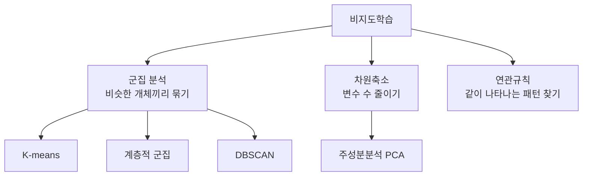
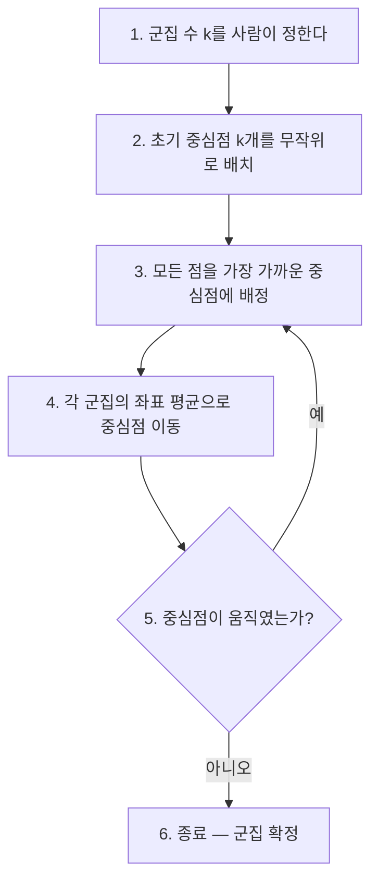
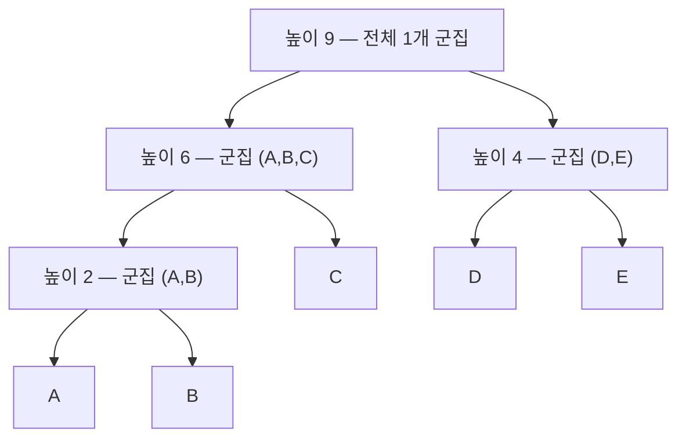
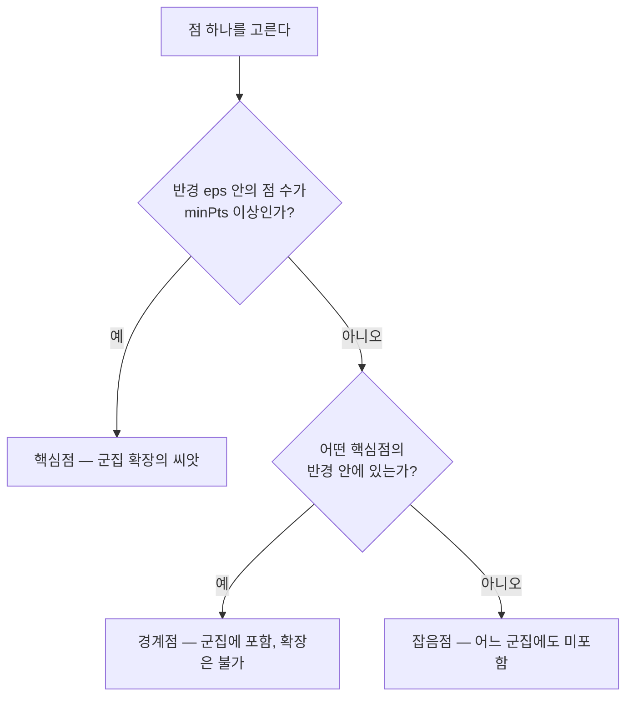

<Callout type="info">
  **이번 문서의 목표:** 두 점의 좌표만 주어져도 유클리드·맨해튼·민코프스키 거리와 코사인·자카드 유사도를 손으로 계산할 수 있고, K-means·계층적 군집·DBSCAN의 차이를 한 문장씩 설명하며, 고유값 표를 보고 설명분산비율을 즉시 계산할 수 있게 된다.
</Callout>

## 왜 정답이 없는 학습이 필요한가

18편에서 다룬 지도학습(supervised learning, 감독학습)은 항상 **정답표**가 있었습니다. 이 메일은 스팸이다, 이 환자는 양성이다 하는 레이블(label, 정답 표지)이 붙은 데이터를 보고 규칙을 배웠습니다.

그런데 현실의 데이터 대부분에는 정답이 없습니다. 편의점 본사가 가진 것은 "고객 30만 명이 무엇을 언제 얼마나 샀는가" 하는 기록뿐입니다. 이 고객이 "알뜰형 고객"인지 "충동구매형 고객"인지 아무도 미리 적어두지 않았습니다. 그런데도 마케팅팀은 고객을 몇 개 유형으로 나누어 서로 다른 쿠폰을 보내고 싶어 합니다.

> **쉽게 말하면:** 비지도학습(unsupervised learning, 비감독학습)은 **정답지가 없는 시험지를 받고, 비슷한 답끼리 모아 스스로 채점 기준을 만들어내는 일**입니다.

정답이 없으니 "맞았다·틀렸다"를 말할 수 없습니다. 대신 **비슷한 것끼리 잘 모였는가**만 따집니다. 그래서 비지도학습의 출발점은 알고리즘이 아니라 "비슷하다"를 숫자로 정의하는 일, 즉 **거리**(distance)와 **유사도**(similarity)입니다. 시험에서 계산 문제가 가장 많이 나오는 지점도 정확히 여기입니다.

지도학습과 비지도학습의 구분 자체는 05편에서 개념 지도로 정리했습니다. 이 편은 그 중 **군집·차원축소·연관규칙**을 계산 수준까지 내려가 다룹니다.

## 1. 거리와 유사도 — "비슷하다"를 숫자로 만들기

### 왜 거리부터인가

군집(cluster, 클러스터)이란 "가까운 것끼리 모은 덩어리"입니다. 그런데 **가깝다**는 말은 사람의 감각일 뿐, 컴퓨터에게는 아무 의미가 없습니다. 컴퓨터에게 가깝다를 알려주려면 두 데이터 사이의 **거리를 계산하는 공식**을 정해줘야 합니다. 이 공식을 무엇으로 정하느냐에 따라 같은 데이터에서도 완전히 다른 군집이 나옵니다.

> **쉽게 말하면:** 거리 함수는 컴퓨터에게 쥐어주는 **자**(尺, 측정 도구)입니다. 줄자를 쓰느냐 걸음 수를 세느냐에 따라 "가장 가까운 집"이 달라집니다.

이제부터 아래 두 점을 계속 사용합니다.

- 점 $A = (1,\ 2)$ — 예를 들어 고객 A의 (방문 횟수, 구매 금액 십만 원 단위)
- 점 $B = (4,\ 6)$ — 고객 B의 같은 두 값

두 좌표의 차이는 다음과 같습니다.

- 첫 번째 축의 차이: $4 - 1 = 3$
- 두 번째 축의 차이: $6 - 2 = 4$

이 **3과 4**라는 두 숫자를 어떻게 하나로 합치느냐가 거리 공식의 전부입니다.

### 유클리드 거리 — 자로 잰 직선 길이

**유클리드 거리**(Euclidean distance, 유클리디안 거리)는 우리가 일상에서 "거리"라고 부르는 바로 그것입니다. 두 점을 직선으로 이었을 때의 길이이며, 피타고라스 정리를 그대로 쓴 값입니다.

$$
d_{\text{유클리드}}(A, B) = \sqrt{\sum_{i=1}^{n} (a_i - b_i)^2}
$$

- $d$ (디, distance) — 거리를 뜻하는 기호
- $a_i,\ b_i$ (에이 아이, 비 아이) — 점 A와 점 B의 $i$번째 좌표값
- $n$ (엔) — 변수(축)의 개수. 위 예시는 2차원이므로 $n = 2$
- $\sum$ (시그마) — "모두 더하라"는 기호
- $\sqrt{\ }$ (루트) — 제곱근. 제곱해서 그 값이 되는 수

대입해 봅니다. 먼저 각 차이를 제곱해 더합니다.

$$
(4-1)^2 + (6-2)^2 = 3^2 + 4^2 = 9 + 16 = 25
$$

그다음 제곱근을 씌웁니다.

$$
d_{\text{유클리드}}(A, B) = \sqrt{25} = 5
$$

**해석:** 두 고객은 2차원 평면 위에서 직선으로 5만큼 떨어져 있습니다. 이 5라는 숫자 자체에는 단위가 없고, **다른 고객 쌍의 거리와 비교할 때만 의미**가 생깁니다. 다른 고객 쌍의 거리가 12라면, A와 B가 그 쌍보다 훨씬 비슷하다는 뜻입니다.

### 맨해튼 거리 — 골목을 돌아가는 길이

**맨해튼 거리**(Manhattan distance, 시가지 거리)는 대각선으로 가로지르지 못하고 **축을 따라서만 이동**할 때의 총 이동량입니다. 미국 맨해튼처럼 도로가 바둑판이면 건물을 뚫고 대각선으로 갈 수 없으니, 가로로 3블록 + 세로로 4블록을 걸어야 한다는 데서 붙은 이름입니다. **L1 거리**(엘원 거리)라고도 부릅니다.

$$
d_{\text{맨해튼}}(A, B) = \sum_{i=1}^{n} |a_i - b_i|
$$

- $|\ |$ (절댓값 기호) — 부호를 떼고 크기만 취하라는 뜻. $|-3| = 3$

대입합니다.

$$
d_{\text{맨해튼}}(A, B) = |4-1| + |6-2| = 3 + 4 = 7
$$

**해석:** 같은 두 점인데 유클리드로는 5, 맨해튼으로는 7이 나왔습니다. 맨해튼 거리는 대각선 지름길을 인정하지 않으므로 **항상 유클리드 거리보다 크거나 같습니다.** 시험에서 "같은 두 점의 두 거리 중 어느 쪽이 큰가"를 묻는다면 답은 맨해튼입니다.

### 민코프스키 거리 — 둘을 한 식으로 묶은 일반형

앞의 두 식을 나란히 놓고 보면 닮았습니다. 제곱하고 루트를 씌우느냐, 절댓값을 그대로 더하느냐의 차이뿐입니다. **민코프스키 거리**(Minkowski distance)는 그 "제곱"의 지수를 $p$라는 값으로 열어둔 **일반형 공식**입니다.

$$
d_{\text{민코프스키}}(A, B) = \left( \sum_{i=1}^{n} |a_i - b_i|^{p} \right)^{1/p}
$$

- $p$ (피) — 차수(order). 사용자가 정하는 양수
- $p = 1$이면 맨해튼 거리, $p = 2$이면 유클리드 거리가 됩니다
- $p$를 무한대로 키우면 가장 큰 축 차이 하나만 남는 **체비쇼프 거리**(Chebyshev distance)가 됩니다

$p = 3$으로 직접 계산해 봅니다. 먼저 각 차이의 세제곱을 더합니다.

$$
|4-1|^3 + |6-2|^3 = 3^3 + 4^3 = 27 + 64 = 91
$$

그다음 세제곱근을 씌웁니다.

$$
d_{\text{민코프스키}}(A, B) = 91^{1/3} \approx 4.50
$$

**해석:** $p$가 커질수록 값이 작아지고(7 → 5 → 4.50), **차이가 가장 큰 축**의 비중이 커집니다. $p=3$에서는 $4^3 = 64$가 전체 91의 70퍼센트를 넘게 차지합니다. 즉 $p$는 "가장 두드러진 차이를 얼마나 크게 볼 것인가"를 조절하는 손잡이입니다.

> **자주 틀리는 점:** 시험에서 "민코프스키 거리에서 $p=2$일 때는 무엇인가"를 자주 묻습니다. 답은 유클리드입니다. $p=1$을 유클리드로 착각하는 오답이 단골 보기로 나옵니다. **1은 한 방향씩 걷는 맨해튼, 2는 제곱의 유클리드**로 외우세요.

### 코사인 유사도 — 크기 말고 방향만 본다

거리 공식들은 모두 **크기 차이**에 민감합니다. 그런데 그게 곤란한 상황이 있습니다.

문서 두 개를 비교한다고 합시다. 문서 1은 A4 한 장, 문서 2는 A4 열 장인데 둘 다 "축구, 선수, 경기" 이야기만 합니다. 단어 등장 횟수를 좌표로 쓰면 문서 2의 좌표는 문서 1의 약 10배가 되어, 유클리드 거리로는 매우 멀게 나옵니다. 하지만 **주제는 같습니다.**

> **쉽게 말하면:** 코사인 유사도는 두 화살표의 **길이는 무시하고 가리키는 방향만** 비교하는 척도입니다.

**코사인 유사도**(cosine similarity)는 두 벡터가 이루는 각도의 코사인 값입니다.

$$
\text{cos-sim}(A, B) = \frac{\sum_{i=1}^{n} a_i b_i}{\sqrt{\sum a_i^2} \times \sqrt{\sum b_i^2}}
$$

- 분자 $\sum a_i b_i$ — 두 벡터의 **내적**(inner product, 대응하는 좌표끼리 곱해서 모두 더한 값)
- 분모의 두 루트 — 각 벡터의 **길이**(norm, 노름). 원점에서 그 점까지의 유클리드 거리
- 결과 범위는 좌표가 모두 0 이상일 때 0부터 1까지. 1이면 방향이 완전히 같고, 0이면 직각(전혀 무관)입니다

같은 두 점 $A=(1,2)$, $B=(4,6)$으로 계산합니다. 먼저 내적입니다.

$$
1 \times 4 + 2 \times 6 = 4 + 12 = 16
$$

다음으로 각 벡터의 길이입니다.

$$
\|A\| = \sqrt{1^2 + 2^2} = \sqrt{5} \approx 2.236
$$

$$
\|B\| = \sqrt{4^2 + 6^2} = \sqrt{16+36} = \sqrt{52} \approx 7.211
$$

분모를 곱합니다.

$$
2.236 \times 7.211 \approx 16.124
$$

마지막으로 나눕니다.

$$
\text{cos-sim}(A, B) = \frac{16}{16.124} \approx 0.992
$$

**해석:** 유클리드 거리로는 5만큼 떨어졌던 두 점이, 방향만 보면 유사도 약 0.992로 거의 같은 방향입니다. 실제로 $B$는 $A$를 약 3.6배 늘인 것에 가깝기 때문입니다. **크기가 문제되지 않는 비교**(문서·상품평·사용자 취향 벡터)에서는 코사인이 표준입니다.

한 가지만 더 정리합니다. **코사인 거리**(cosine distance)는 유사도를 거리로 뒤집은 값이며 다음과 같이 정의합니다.

$$
d_{\text{코사인}} = 1 - \text{cos-sim} = 1 - 0.992 = 0.008
$$

### 자카드 유사도 — 있다·없다만 있는 데이터용

좌표값이 숫자가 아니라 **집합**일 때가 있습니다. 장바구니에 무엇이 담겼는지, 사용자가 어떤 태그를 눌렀는지 같은 데이터입니다. 이때는 **자카드 유사도**(Jaccard similarity, 자카드 계수)를 씁니다.

$$
J(A, B) = \frac{|A \cap B|}{|A \cup B|}
$$

- $A \cap B$ (교집합) — 양쪽 모두에 들어 있는 원소
- $A \cup B$ (합집합) — 양쪽 중 어느 하나에라도 들어 있는 원소 전체
- $|\ \ |$ — 원소의 개수

고객 두 명의 장바구니를 봅시다.

- 고객 A의 장바구니: 우유, 빵, 계란, 커피
- 고객 B의 장바구니: 빵, 계란, 커피, 주스, 시리얼

교집합을 셉니다. 양쪽에 다 있는 것은 빵, 계란, 커피 세 개입니다.

$$
|A \cap B| = 3
$$

합집합을 셉니다. 우유, 빵, 계란, 커피, 주스, 시리얼로 여섯 개입니다.

$$
|A \cup B| = 6
$$

나눕니다.

$$
J(A, B) = \frac{3}{6} = 0.5
$$

**해석:** 두 고객의 장바구니는 절반이 겹칩니다. 자카드는 **둘 다 사지 않은 상품**은 아예 세지 않는 것이 핵심입니다. 편의점에 상품이 3천 개 있어도 "둘 다 안 산 2994개"는 분모에 넣지 않습니다. 그래서 **희소한 데이터**(대부분이 0인 데이터)에서 특히 유용합니다.

> **자주 틀리는 점:** 자카드 유사도의 분모를 "전체 상품 수"로 잡는 실수가 잦습니다. 분모는 **합집합**이지 전체가 아닙니다.

### 거리·유사도 비교표

| 척도 | 계산 방식 | 예시값(A, B) | 값이 크면 | 주로 쓰는 데이터 |
|------|-----------|--------------|-----------|------------------|
| 유클리드 거리 | 차이 제곱합의 제곱근 | 5 | 멀다(다르다) | 일반 수치형 |
| 맨해튼 거리 | 차이 절댓값의 합 | 7 | 멀다(다르다) | 격자 구조, 이상치에 덜 민감 |
| 민코프스키 거리 | 차수 `p`로 일반화 | 4.50 (`p`=3) | 멀다(다르다) | `p` 조절이 필요할 때 |
| 코사인 유사도 | 내적을 길이 곱으로 나눔 | 0.992 | 비슷하다 | 문서, 고차원 희소 벡터 |
| 자카드 유사도 | 교집합을 합집합으로 나눔 | 0.5 | 비슷하다 | 이진(있다–없다) 집합 |

> **자주 틀리는 점:** 거리는 클수록 다르고 유사도는 클수록 같습니다. 보기에 "유클리드 거리가 클수록 두 개체는 유사하다"가 나오면 즉시 오답입니다.

한 가지 실무 함정도 기억하세요. 거리 계산은 **변수의 단위에 그대로 끌려다닙니다.** 연 소득(원 단위, 수천만)과 방문 횟수(0에서 30)를 그대로 넣으면 소득 차이가 거리를 100퍼센트 지배합니다. 그래서 군집 전에 표준화·정규화를 하는 것이 원칙입니다. 스케일링 방법 자체는 12편에서 다룹니다.

## 2. K-means 군집 — 중심점을 옮겨가며 수렴시키기

### 왜 필요한가

고객 3만 명을 세 유형으로 나누라는 요청을 받았다고 합시다. 모든 고객 쌍의 거리를 다 계산하면 약 4억 5천만 번의 계산이 필요합니다. 훨씬 값싼 방법이 필요합니다.

> **쉽게 말하면:** K-means는 **깃발 `k`개를 아무 데나 꽂고, 각자 가장 가까운 깃발 아래 모이게 한 뒤, 모인 사람들의 한가운데로 깃발을 옮기는 일을 깃발이 안 움직일 때까지 반복**하는 방법입니다.

**K-means**(케이 민즈, K-평균 군집)는 군집의 중심(centroid, 센트로이드, 무게중심)을 반복해서 갱신하는 알고리즘입니다. 이름의 `means`가 **평균**인 이유는, 중심을 그 군집에 속한 점들의 **좌표 평균**으로 잡기 때문입니다.

### 알고리즘 절차

3번과 4번을 번갈아 반복하는 것이 전부입니다. 3번은 **배정 단계**(assignment step), 4번은 **갱신 단계**(update step)라고 부릅니다.

### 손으로 한 바퀴 돌려보기

데이터 네 점을 씁니다.

- $P_1 = (1, 1)$, $P_2 = (2, 1)$, $P_3 = (4, 3)$, $P_4 = (5, 4)$

`k`는 2로 정하고, 초기 중심을 $C_1 = (1,1)$, $C_2 = (5,4)$로 잡습니다.

**배정 단계.** 각 점에서 두 중심까지의 유클리드 거리를 계산합니다.

$P_2 = (2,1)$에서 $C_1$까지의 거리는 다음과 같습니다.

$$
\sqrt{(2-1)^2 + (1-1)^2} = \sqrt{1 + 0} = 1
$$

$P_2$에서 $C_2$까지의 거리입니다.

$$
\sqrt{(2-5)^2 + (1-4)^2} = \sqrt{9 + 9} = \sqrt{18} \approx 4.24
$$

1이 4.24보다 작으므로 $P_2$는 $C_1$ 쪽입니다. 같은 방식으로 $P_3 = (4,3)$을 봅니다.

$$
\sqrt{(4-1)^2 + (3-1)^2} = \sqrt{9+4} = \sqrt{13} \approx 3.61
$$

$$
\sqrt{(4-5)^2 + (3-4)^2} = \sqrt{1+1} = \sqrt{2} \approx 1.41
$$

$P_3$은 $C_2$ 쪽입니다. 결과적으로 군집 1에는 $P_1, P_2$, 군집 2에는 $P_3, P_4$가 모였습니다.

**갱신 단계.** 각 군집의 좌표 평균을 새 중심으로 삼습니다. 군집 1의 새 중심입니다.

$$
C_1' = \left( \frac{1+2}{2},\ \frac{1+1}{2} \right) = (1.5,\ 1)
$$

군집 2의 새 중심입니다.

$$
C_2' = \left( \frac{4+5}{2},\ \frac{3+4}{2} \right) = (4.5,\ 3.5)
$$

**두 번째 반복.** 새 중심으로 다시 배정하면 $P_1, P_2$는 여전히 $C_1'$에, $P_3, P_4$는 여전히 $C_2'$에 가깝습니다. 배정이 바뀌지 않았으므로 중심도 더 이상 움직이지 않습니다. **수렴 완료**입니다.

**해석:** 두 번의 반복으로 "저소비 소규모 고객군"과 "고소비 대규모 고객군"이 갈렸습니다. 실제 데이터에서는 수십 번 반복하지만 논리는 완전히 같습니다.

### K-means의 약점과 시험 함정

- **`k`를 사람이 먼저 정해야 합니다.** 이것이 최대 약점입니다.
- **초기 중심에 따라 결과가 달라집니다.** 운 나쁘게 초기 중심을 잡으면 엉뚱한 군집에 갇힙니다. 그래서 실무에서는 초기값을 여러 번 바꿔 돌리거나 `k-means++`라는 똑똑한 초기화를 씁니다.
- **평균을 쓰므로 이상치(outlier)에 매우 약합니다.** 극단값 하나가 중심을 통째로 끌고 갑니다. 이 약점을 보완해 평균 대신 실제 데이터 점 하나를 중심으로 쓰는 변형이 **K-medoids**(케이 메도이드)입니다.
- **원형에 가까운 덩어리만 잘 찾습니다.** 초승달 모양이나 고리 모양 군집은 제대로 못 나눕니다.

## 3. 계층적 군집 — 나무를 그려놓고 나중에 자르기

### 왜 필요한가

K-means는 `k`를 먼저 정해야 합니다. 그런데 "우리 고객이 몇 유형인지 모르겠다"가 오히려 흔한 상황입니다.

> **쉽게 말하면:** 계층적 군집은 **모든 가능한 묶음 순서를 나무 그림 한 장으로 미리 그려두고, 몇 개로 나눌지는 나중에 가위로 자르는 높이만 정해서 결정**하는 방법입니다.

**계층적 군집**(hierarchical clustering, 위계적 군집)은 두 방향이 있습니다.

- **병합형**(agglomerative, 상향식) — 모든 점을 각자 하나의 군집으로 두고, 가장 가까운 둘을 계속 합쳐 나갑니다. 시험에 나오는 것은 거의 이쪽입니다.
- **분할형**(divisive, 하향식) — 전체를 한 덩어리로 두고 계속 쪼갭니다.

### 덴드로그램 읽는 법

병합 과정을 기록한 나무 그림을 **덴드로그램**(dendrogram, 수형도)이라고 합니다. 가로축은 개체, 세로축은 **병합이 일어난 높이**(합쳐질 때의 거리)입니다.

읽는 규칙은 하나입니다. **높이 h에서 수평선을 그었을 때, 그 선과 만나는 세로 가지의 개수가 그 높이에서의 군집 수입니다.**

위 그림에서 확인해 봅시다.

- 높이 5에서 자르면 — 만나는 가지는 `(A,B,C)` 덩어리와 `(D,E)` 덩어리 두 개이므로 **군집 2개**
- 높이 3에서 자르면 — `(A,B)`, `C`, `(D,E)` 세 개이므로 **군집 3개**
- 높이 1에서 자르면 — 아직 아무것도 안 합쳐졌으므로 **군집 5개**

**낮게 자를수록 군집이 많아지고, 높게 자를수록 적어집니다.** 시험에서 "높이 7에서 잘랐더니 절단선과 만나는 가지가 4개다. 군집 수는?"이라고 물으면 답은 그대로 **4개**입니다. 가지 개수를 세는 것 외에 다른 계산은 없습니다.

또 하나 자주 나오는 판단 기준이 있습니다. **세로로 길게 이어지는 구간**(그 높이 범위 동안 아무 병합도 일어나지 않은 구간) 안에서 자르는 것이 안정적인 군집 수라는 원칙입니다. 병합이 뜸한 구간이라는 것은 "그 정도 거리에서는 더 합칠 만큼 가까운 덩어리가 없었다"는 뜻이기 때문입니다.

### 연결법 — 군집과 군집의 거리를 어떻게 재는가

점과 점 사이의 거리는 앞에서 정의했습니다. 그런데 병합형 군집은 **덩어리와 덩어리** 사이의 거리가 필요합니다. 덩어리 안에는 점이 여러 개인데, 그중 무엇을 대표로 쓸까요? 이 규칙을 **연결법**(linkage, 링키지)이라고 하며, 무엇을 고르느냐에 따라 나무 모양이 달라집니다.

| 연결법 | 두 군집 사이 거리 정의 | 특징 | 약점 |
|--------|------------------------|------|------|
| 단일 연결법(single linkage, 최단 연결) | 두 군집 점 쌍 중 **가장 가까운** 쌍의 거리 | 길쭉하거나 굽은 모양도 잘 이어 붙임 | 사슬 효과(chaining) – 점 하나가 다리 역할을 해 엉뚱한 덩어리끼리 붙음 |
| 완전 연결법(complete linkage, 최장 연결) | 점 쌍 중 **가장 먼** 쌍의 거리 | 조밀하고 비슷한 크기의 군집을 만듦 | 이상치 하나에 크게 흔들림 |
| 평균 연결법(average linkage) | 모든 점 쌍 거리의 **평균** | 단일과 완전의 절충, 무난함 | 계산량이 많음 |
| 와드 연결법(Ward linkage, 워드) | 합쳤을 때 **군집 내 오차제곱합(SSE) 증가량**이 최소가 되도록 | 크기가 고른 조밀한 군집, 실무 기본값 | 유클리드 거리 전제, 구형 군집 가정 |

> **자주 틀리는 점:** 단일 연결법은 "가장 가까운 점 쌍", 완전 연결법은 "가장 먼 점 쌍"입니다. 이름만 보면 완전이 더 좋아 보이지만 **좋고 나쁨의 문제가 아니라 만들어지는 군집 모양의 차이**입니다. 그리고 와드 연결법은 거리를 직접 재는 것이 아니라 **분산(오차제곱합)의 증가량을 최소화**한다는 점에서 다른 셋과 성격이 다릅니다. 여기서 나온 오차제곱합(SSE, Sum of Squared Errors)은 군집 평가지표이기도 하며 자세한 내용은 21편에서 다룹니다.

## 4. DBSCAN — 밀도로 군집을 찾고 잡음을 걸러낸다

### 왜 필요한가

택시 승하차 좌표를 군집화한다고 합시다. 번화가에는 점이 빽빽하고, 외곽 도로에는 점이 드문드문 흩어져 있습니다. K-means에 `k`를 3으로 주면, 외곽에 홀로 찍힌 점 하나까지 억지로 어느 군집에 넣어버립니다. 그런데 그 점은 그냥 **잡음**입니다.

> **쉽게 말하면:** DBSCAN은 **"내 주변 반경 안에 친구가 몇 명 이상 있으면 나는 번화가 사람이다"라는 규칙 하나로 덩어리를 키워가고, 친구가 없는 사람은 잡음으로 남겨두는** 방법입니다.

**DBSCAN**(Density-Based Spatial Clustering of Applications with Noise, 밀도 기반 공간 군집화)은 이름 그대로 **밀도**(density, 점이 얼마나 빽빽한가)를 기준으로 삼습니다.

### 두 개의 하이퍼파라미터

- `eps` (엡실론, $\varepsilon$) — 이웃으로 인정할 **반경**. 이 거리 안에 있으면 이웃입니다.
- `minPts` (민 포인츠) — 그 반경 안에 최소 몇 개의 점이 있어야 "빽빽하다"고 볼지의 **기준 개수**. 보통 자기 자신을 포함해서 셉니다.

이 두 값만 정하면 **군집 수는 알고리즘이 알아서 결정합니다.** 이것이 K-means와 갈리는 결정적 차이이고, 시험에서 가장 많이 나오는 포인트입니다.

### 점의 세 가지 신분

`eps = 1.5`, `minPts = 4`라고 가정하고 각 점을 분류해 봅니다.

- **핵심점**(core point, 코어 포인트) — 반경 `eps` 안의 점 개수가 `minPts` 이상인 점. 예를 들어 반경 안에 자기 포함 6개가 있으면 6은 4 이상이므로 핵심점입니다. 군집을 **키워나가는 씨앗** 역할을 합니다.
- **경계점**(border point, 보더 포인트) — 반경 안의 점 개수는 `minPts`에 못 미치지만(예: 2개), **어떤 핵심점의 반경 안에는 들어 있는** 점. 군집에는 포함되지만 군집을 더 키우지는 못합니다. 군집의 **가장자리**입니다.
- **잡음점**(noise point, 이상점) — 핵심점도 경계점도 아닌 점. 어느 군집에도 속하지 않고 **버려집니다.**

**해석:** DBSCAN은 잡음을 **명시적으로 걸러낼 수 있는 유일한 대표 군집 기법**입니다. K-means와 계층적 군집은 모든 점을 반드시 어딘가에 배정합니다. 또한 밀도로 이어 붙이므로 **초승달·고리 같은 임의 모양 군집**도 잘 찾아냅니다.

약점도 분명합니다. 밀도가 지역마다 크게 다르면(도심은 빽빽, 외곽은 성김) 하나의 `eps` 값으로는 둘 다 만족시킬 수 없습니다. 또 차원이 아주 높아지면 모든 점이 비슷하게 멀어져 밀도 개념이 흐려집니다.

### 세 기법 비교표

| 항목 | 계층적 군집 | K-means | DBSCAN |
|------|-------------|---------|--------|
| 군집 수 지정 | 불필요 – 나중에 절단 높이로 결정 | 필요 – `k`를 미리 입력 | 불필요 – 밀도로 자동 결정 |
| 필요한 입력값 | 연결법, 거리 척도 | `k` | `eps`, `minPts` |
| 군집 형성 방식 | 가까운 것부터 합치거나 쪼갬 | `k`개 중심점 기준 배정·이동 | 밀도 조건으로 이어 붙임 |
| 잘 찾는 모양 | 연결법에 따라 다양 | 원형·구형 덩어리 | 임의 모양 |
| 잡음 처리 | 모든 점을 배정 | 모든 점을 배정 | 잡음점으로 분리 배제 |
| 이상치 민감도 | 연결법에 따라 다름 | 매우 민감(평균 사용) | 강함(잡음으로 뺌) |
| 대용량 데이터 | 느림 – 모든 쌍 거리 필요 | 빠름 | 중간 |

## 5. 군집 수를 정하는 법 — 엘보우 기법

`k`를 정해야 하는 K-means에서 가장 실용적인 방법이 **엘보우 기법**(elbow method, 팔꿈치 기법)입니다.

> **쉽게 말하면:** `k`를 1, 2, 3, ... 으로 늘려가며 오차를 그려보면 처음엔 뚝 떨어지다가 어느 순간부터 완만해지는데, **꺾이는 팔꿈치 지점**이 적당한 `k`입니다.

세로축에는 보통 **군집 내 오차제곱합**(SSE, Sum of Squared Errors)을 놓습니다. 각 점이 자기 군집 중심에서 얼마나 떨어져 있는지를 제곱해 모두 더한 값입니다. `k`를 늘리면 SSE는 **반드시 줄어듭니다.** 극단적으로 `k`를 데이터 개수만큼 늘리면 모든 점이 자기 자신의 중심이 되어 SSE는 0이 됩니다. 그러니 "SSE가 가장 작은 `k`"를 고르면 안 됩니다.

`k`별 SSE가 다음과 같다고 합시다.

| `k` | 1 | 2 | 3 | 4 | 5 |
|-----|---|---|---|---|---|
| SSE | 500 | 220 | 90 | 78 | 70 |

감소량을 봅니다.

- 1에서 2로: 500 − 220 = 280 감소
- 2에서 3으로: 220 − 90 = 130 감소
- 3에서 4로: 90 − 78 = **12 감소**
- 4에서 5로: 78 − 70 = 8 감소

3까지는 크게 줄다가 4부터 거의 안 줄어듭니다. 따라서 팔꿈치는 `k = 3`이며, 이때가 "군집을 더 쪼개도 얻는 게 별로 없는" 지점입니다.

**스크리 플롯**(scree plot, 스크리 도표)은 같은 원리의 그래프를 주성분분석에서 부를 때 쓰는 이름입니다. 세로축이 SSE 대신 고유값이 될 뿐, **급격히 꺾이는 지점을 고른다**는 판단은 동일합니다. 그래서 두 이름이 사실상 같은 그림으로 시험에 나옵니다.

군집 품질을 숫자 하나로 재는 **실루엣 계수**(silhouette coefficient)도 군집 수 결정에 쓰이지만, 군집 평가지표이므로 21편에서 다룹니다.

## 6. 차원축소와 주성분분석(PCA)

### 왜 필요한가

설비 센서 30개에서 값을 받는다고 합시다. 변수 30개를 그대로 쓰면 그림으로 볼 수도 없고, 서로 비슷한 센서끼리 정보가 중복되며, 앞서 본 대로 고차원에서는 거리 개념 자체가 흐려집니다. 이를 **차원의 저주**(curse of dimensionality)라고 부릅니다.

> **쉽게 말하면:** 주성분분석은 **여러 방향에서 물체 사진을 찍어보고, 물체의 생김새 차이가 가장 잘 드러나는 각도 하나를 골라 그 그림자만 남기는** 일입니다.

**주성분분석**(PCA, Principal Component Analysis)은 원래 변수들의 **선형결합**(가중합)으로 새로운 축을 만들되, **분산이 가장 커지는 방향**부터 차례대로 뽑는 기법입니다. 분산이 크다는 것은 그 방향으로 데이터가 넓게 퍼져 있다는 뜻이고, 넓게 퍼져 있어야 개체 간 차이를 구별할 수 있기 때문입니다.

계산은 **공분산행렬**(covariance matrix) 또는 상관행렬의 **고유값 분해**(eigen decomposition)로 이루어집니다. 여기서 두 용어만 짚고 갑니다.

- **고유벡터**(eigenvector, 아이겐벡터) — 주성분이 가리키는 **방향**
- **고유값**(eigenvalue, 아이겐밸류, $\lambda$ 람다) — 그 방향이 갖는 **분산의 크기**

주성분들은 서로 **직교**(orthogonal, 90도로 만남)하도록 만들어지고, 제1주성분(PC1)이 가장 큰 분산을 갖습니다.

### 설명분산비율 손계산

시험 단골 계산입니다. 고유값이 다음과 같이 주어졌다고 합시다.

- PC1 고유값 4.0, PC2 고유값 2.0, PC3 고유값 1.0, PC4 고유값 1.0

**설명분산비율**(explained variance ratio, 기여율)은 "그 주성분의 고유값 ÷ 전체 고유값 합"입니다. 먼저 합을 구합니다.

$$
4.0 + 2.0 + 1.0 + 1.0 = 8.0
$$

PC2의 설명분산비율입니다.

$$
\frac{2.0}{8.0} = 0.25
$$

즉 PC2 하나가 전체 분산의 **25퍼센트**를 설명합니다. PC1도 계산해 봅니다.

$$
\frac{4.0}{8.0} = 0.50
$$

두 주성분을 함께 쓸 때의 **누적 기여율**(cumulative proportion)입니다.

$$
0.50 + 0.25 = 0.75
$$

**해석:** 변수 4개를 2개로 줄여도 원래 정보(분산)의 **75퍼센트**를 지킬 수 있습니다. 실무에서는 누적 기여율 80퍼센트 또는 90퍼센트를 넘는 지점까지 주성분을 남기거나, 스크리 플롯의 꺾이는 지점에서 자릅니다. 주성분을 전부(여기서는 4개) 쓰면 누적 기여율은 당연히 100퍼센트가 됩니다.

### 시험에 반복해서 나오는 PCA 함정

- **무상관과 독립은 다릅니다.** 주성분 점수들은 서로 **선형 상관이 0**(무상관)이 되도록 만들어집니다. 하지만 "따라서 통계적으로 완전히 독립이다"는 **틀린 진술**입니다. 무상관은 직선 관계가 없다는 뜻일 뿐이고, 곡선 형태의 의존 관계는 남아 있을 수 있습니다. 데이터가 다변량 정규분포일 때만 무상관이 독립을 함의합니다. 보기에 "반드시", "무조건", "완전 독립"이라는 단어가 붙으면 거의 오답입니다.
- **PCA는 변수 선택이 아니라 변수 생성입니다.** 원래 변수 중 몇 개를 골라내는 것이 아니라, 모든 변수를 섞어 **새 축을 만듭니다.** 그래서 만들어진 주성분은 현업 용어로 해석하기 어렵습니다.
- **PCA는 비지도 기법입니다.** 종속변수(정답)를 전혀 쓰지 않습니다. 종속변수를 써서 집단이 가장 잘 갈리는 축을 찾는 것은 **판별분석**(LDA)입니다.
- **음수가 나오지 않도록 제약을 거는 것은 PCA가 아닙니다.** 그것은 **비음수 행렬분해**(NMF)의 특징입니다.
- **단위에 민감합니다.** 값의 범위가 큰 변수가 분산을 독차지하므로, 단위가 제각각이면 표준화 후 상관행렬 기준으로 PCA를 합니다.

차원축소 계열 기법 이름도 보기로 자주 등장합니다. **다차원척도법**(MDS), **요인분석**(factor analysis), **특이값분해**(SVD), **t-SNE**(티스니) 등이 함께 묶여 나옵니다.

## 7. 연관규칙 분석 — 같이 팔리는 것 찾기

### 왜 필요한가

마트가 알고 싶은 것은 "맥주를 산 사람이 기저귀도 사는가"입니다. 정답 레이블이 없는 거래 기록뿐이므로 이 역시 **비지도학습**입니다. 흔히 **장바구니 분석**(market basket analysis)이라고 부릅니다.

> **쉽게 말하면:** 연관규칙은 **"A를 사면 B도 산다"는 문장을 얼마나 흔한지·얼마나 확실한지·평소보다 몇 배인지 세 숫자로 채점**하는 기법입니다.

거래 10건 중 다음과 같다고 합시다.

- 빵(A)이 들어간 거래: 6건
- 우유(B)가 들어간 거래: 5건
- 빵과 우유가 **함께** 들어간 거래: 4건

**지지도**(support)는 전체 거래 중 A와 B가 함께 나타난 비율입니다.

$$
\text{지지도}(A \rightarrow B) = \frac{4}{10} = 0.4
$$

**신뢰도**(confidence)는 A를 산 거래 중 B도 산 비율, 즉 조건부확률입니다.

$$
\text{신뢰도}(A \rightarrow B) = \frac{4}{6} \approx 0.667
$$

**향상도**(lift)는 신뢰도를 "그냥 B를 살 확률"과 비교한 배수입니다. 먼저 B의 평소 구매 비율을 구합니다.

$$
P(B) = \frac{5}{10} = 0.5
$$

이제 나눕니다.

$$
\text{향상도}(A \rightarrow B) = \frac{0.667}{0.5} \approx 1.33
$$

**해석:** 향상도 1.33은 "빵을 산 사람이 우유를 살 가능성은 평소보다 약 1.33배 높다"는 뜻입니다. 향상도를 읽는 기준은 세 가지뿐입니다.

- 향상도가 1보다 크면 — **양의 연관**. 함께 살 가능성이 평소보다 높습니다.
- 향상도가 1이면 — **무관**. A를 사든 말든 B 구매 확률이 그대로입니다.
- 향상도가 1보다 작으면 — **음의 연관**. A를 사면 오히려 B를 덜 삽니다.

> **자주 틀리는 점:** 신뢰도만 보고 좋은 규칙이라고 판단하는 것이 대표 함정입니다. 만약 B(우유)가 전체 거래의 95퍼센트에 들어 있다면, A와 아무 관계가 없어도 신뢰도는 0.95 근처가 나옵니다. 그래서 **B의 기본 발생률을 반영하는 향상도를 반드시 함께 봐야** 합니다. 또 하나, 지지도와 신뢰도는 방향에 따라 다릅니다. 신뢰도 $A \rightarrow B$와 $B \rightarrow A$는 분모가 달라 값이 다르지만, **향상도는 두 방향이 같습니다.**

## 8. 시계열 분석 기초 — 정상성과 ARIMA

**시계열 자료**(time series)는 시간 순서를 갖고 관측된 자료입니다. 오늘 값이 어제 값과 무관하지 않다는 점이 지금까지 본 자료와 다릅니다.

**정상성**(stationarity)은 시간이 지나도 **평균과 분산이 일정하게 유지되는 성질**입니다. 추세가 있어 평균이 계속 오르거나, 변동 폭이 시간에 따라 커지고 작아지면 정상성이 깨진 것입니다. 대부분의 시계열 분석 기법은 정상성을 전제로 하므로, 원 자료가 정상이 아니면 **먼저 정상 상태로 바꾼 뒤** 분석합니다.

가장 흔한 정상화 방법이 **차분**(differencing)입니다. 현재 시점 값에서 바로 이전 시점 값을 빼서 추세를 제거합니다. 계절성이 있으면 한 주기 전 값을 빼는 **계절차분**을 씁니다.

**ARIMA**(AutoRegressive Integrated Moving Average, 자기회귀누적이동평균)는 이 절차를 하나의 모형으로 묶은 것입니다. 표기는 $ARIMA(p, d, q)$로, 세 숫자가 각각 다른 요소를 나타냅니다.

| 기호 | 의미 |
|------|------|
| $p$ | 자기회귀(AR) 차수 — 과거 몇 시점의 값을 참고하는가 |
| $d$ | 차분(I, Integrated) 차수 — 정상화를 위해 몇 번 차분했는가 |
| $q$ | 이동평균(MA) 차수 — 과거 몇 시점의 오차를 참고하는가 |

계절 주기가 있으면 계절 자기회귀·차분·이동평균 구조를 더한 **SARIMA**로 확장합니다.

**자주 틀리는 점:** "원 자료가 비정상이면 ARIMA를 절대 쓸 수 없다"는 진술이 오답으로 나옵니다. ARIMA의 I(차분)가 바로 비정상 계열을 정상으로 바꾸는 장치이므로, 비정상이라는 이유만으로 적용이 배제되지 않습니다. 반대로 "차분 없이도 추세가 있는 계열에 곧바로 적용할 수 있다"는 진술도 정상성 확인 없이 넘어가는 오답입니다.

## 9. 시험에서 어떻게 물어보나

이 편에서 나오는 문제는 유형이 매우 정형화되어 있습니다.

**유형 1 — 거리·유사도 계산.** 두 점의 좌표를 주고 유클리드나 맨해튼 거리를 묻습니다. 값 자체는 쉬우니 보기에 **다른 척도로 계산한 값**을 섞어 놓습니다. $A=(1,2)$, $B=(4,6)$ 문제에 5(유클리드)와 7(맨해튼)이 나란히 보기로 나오는 식입니다. 문제가 무슨 거리를 물었는지 먼저 확인하세요.

**유형 2 — 알고리즘 선택.** "군집 개수를 미리 알 수 없고 임의 모양 군집과 잡음이 섞여 있다"는 상황을 주고 적절한 알고리즘을 고르게 합니다. 이 조건이 나오면 답은 거의 항상 **DBSCAN**입니다. 보기에는 K-평균, K-메도이드가 함께 나옵니다. 두 기법 모두 `k`를 입력해야 하므로 오답입니다.

**유형 3 — 덴드로그램 절단.** "높이 7에서 잘랐더니 절단선과 만나는 독립 가지가 4개다. 군집 수는?" 답은 그대로 **4개**입니다. 계산이 필요 없는데도 뭔가 계산하려다 틀리는 문제입니다.

**유형 4 — PCA 고유값 계산.** 고유값 표를 주고 특정 주성분의 설명분산비율이나 누적 기여율을 묻습니다. **전체 고유값 합으로 나눈다**는 것만 기억하면 끝입니다. 오답 보기로는 고유값 자체(2.0), 다른 주성분의 비율(50퍼센트), 누적값(75퍼센트)이 함께 나옵니다.

**유형 5 — PCA 서술형 함정.** 네 개 보기 중 틀린 것을 고르게 합니다. 앞서 정리한 대로 "**주성분은 반드시 통계적으로 독립이다**"와 "**음수가 나오지 않도록 제약을 건다**"가 대표 오답입니다. 반대로 "직교한다", "PC1이 분산이 가장 크다", "모두 쓰면 100퍼센트 설명한다", "스크리 도표의 꺾이는 지점으로 개수를 정한다"는 모두 옳은 설명입니다.

**유형 6 — 연관규칙 해석.** 신뢰도가 높은 규칙을 제시하고 "이 규칙은 유용한가"를 묻습니다. B가 원래 매우 흔한 상품이면 신뢰도만으로는 판단할 수 없다는 점, 즉 **향상도를 함께 봐야 한다**는 결론이 정답 방향입니다.

**유형 7 — 지도·비지도 구분.** 군집화와 연관규칙 탐색이 비지도학습에 해당하는지를 묻습니다. 정답 레이블 사용 여부가 유일한 기준입니다.

## 핵심 정리

- 군집의 출발점은 알고리즘이 아니라 거리 정의다. 유클리드는 차이 제곱합의 제곱근, 맨해튼은 차이 절댓값의 합이며 같은 두 점에서 맨해튼이 항상 더 크거나 같다. 민코프스키는 차수 `p`로 둘을 묶은 일반형으로 `p`가 1이면 맨해튼, 2면 유클리드다.
- 코사인 유사도는 크기를 무시하고 방향만 비교하며 문서·희소 벡터에 쓰고, 자카드 유사도는 교집합을 합집합으로 나누어 "있다–없다" 데이터에 쓴다. 거리는 클수록 다르고 유사도는 클수록 비슷하다는 방향을 혼동하지 않는다.
- K-means는 `k`를 입력받아 배정과 중심 갱신을 반복하며 평균을 쓰므로 이상치에 약하고 원형 군집만 잘 찾는다. 계층적 군집은 덴드로그램을 그려놓고 절단 높이로 군집 수를 나중에 정하며, 절단선과 만나는 가지 수가 곧 군집 수다. DBSCAN은 `eps`와 `minPts`만으로 군집 수를 자동 결정하고 핵심점·경계점·잡음점을 구분해 잡음을 배제한다.
- PCA는 분산이 큰 직교 방향을 순서대로 뽑는 변수 생성 기법이며, 설명분산비율은 해당 고유값을 전체 고유값 합으로 나눈 값이다. 고유값 4.0, 2.0, 1.0, 1.0에서 PC2는 25퍼센트를 설명한다. 주성분은 무상관이지만 반드시 통계적으로 독립인 것은 아니다.
- 연관규칙의 지지도는 함께 나타난 비율, 신뢰도는 A를 산 거래 중 B의 비율, 향상도는 신뢰도를 B의 평소 비율로 나눈 배수다. 향상도가 1보다 커야 의미 있는 양의 연관이며, 흔한 상품은 신뢰도만으로 판단하면 안 된다.
- 시계열은 평균·분산이 시간에 따라 일정한 **정상성**을 전제로 분석하며, 추세가 있으면 **차분**으로 정상화한다. **ARIMA**의 p, d, q는 각각 자기회귀, 차분 차수, 이동평균이고, 계절 주기가 있으면 SARIMA로 확장한다.

## 마무리 복습

<Quiz
  questionNumber={1}
  question="두 점 A(1, 2)와 B(4, 6) 사이의 맨해튼 거리로 옳은 것은?"
  options={['① 5', '② 7', '③ 12', '④ 25']}
  correctAnswer={2}
  explanation="맨해튼 거리는 각 축 차이의 절댓값을 모두 더한 값이다. 첫째 축 차이가 3, 둘째 축 차이가 4이므로 3 더하기 4는 7이다. 5는 같은 두 점의 유클리드 거리이므로 문제가 어떤 척도를 물었는지 반드시 확인해야 한다."
  optionExplanations={['5는 유클리드 거리다. 차이를 제곱해 더한 25에 제곱근을 씌운 값으로, 맨해튼 거리가 아니다.', '정답이다. 절댓값 차이 3과 4를 그대로 더해 7이 된다.', '12는 두 좌표를 곱해 더한 내적 16이나 다른 계산과도 맞지 않는 값이다.', '25는 제곱합 단계에서 멈춘 값이며, 유클리드 거리는 여기에 제곱근을 씌워야 한다.']}
/>

<Quiz
  questionNumber={2}
  question="민코프스키 거리에서 차수 p의 값과 대응하는 거리의 연결로 옳은 것은?"
  options={['① p가 1이면 유클리드 거리, p가 2이면 맨해튼 거리', '② p가 1이면 맨해튼 거리, p가 2이면 유클리드 거리', '③ p가 1이면 코사인 거리, p가 2이면 자카드 거리', '④ p 값과 무관하게 항상 유클리드 거리와 같다']}
  correctAnswer={2}
  explanation="민코프스키 거리는 차이의 절댓값을 p제곱해 더한 뒤 p제곱근을 씌우는 일반형이다. p가 1이면 절댓값을 그대로 더하는 맨해튼 거리, p가 2이면 제곱합의 제곱근인 유클리드 거리가 된다."
  optionExplanations={['1과 2를 뒤바꾼 대표적인 오답 보기다. 1이 맨해튼, 2가 유클리드다.', '정답이다. 지수 1은 절댓값 합, 지수 2는 제곱합의 제곱근이 된다.', '코사인과 자카드는 민코프스키 계열이 아니라 각각 방향 기반, 집합 기반 유사도다.', 'p가 달라지면 값이 달라지므로 항상 같다는 진술은 틀렸다.']}
/>

<Quiz
  questionNumber={3}
  question="군집 개수를 미리 알 수 없고 임의 모양의 군집과 잡음 지점이 섞여 있는 좌표 데이터를 군집화하려 한다. 가장 적절한 알고리즘은?"
  options={['① K-평균 군집', '② DBSCAN', '③ K-메도이드 군집', '④ 선형회귀']}
  correctAnswer={2}
  explanation="DBSCAN은 반경 eps와 최소 이웃 수 minPts라는 밀도 조건만 정하면 군집 개수가 데이터의 밀도 구조에서 자동으로 결정되고, 어느 군집에도 속하지 않는 점은 잡음으로 분리된다. 임의 모양 군집도 밀도로 이어 붙여 찾아낸다."
  optionExplanations={['K-평균은 군집 수 k를 사람이 미리 입력해야 하고 모든 점을 어느 군집엔가 배정하므로 잡음을 남기지 못한다.', '정답이다. 군집 수 자동 결정, 임의 모양 탐지, 잡음 분리라는 세 조건을 모두 만족한다.', 'K-메도이드도 군집 수를 미리 지정해야 하므로 조건에 맞지 않는다. 이상치에 강하다는 장점만 다르다.', '선형회귀는 정답이 있는 연속값을 예측하는 지도학습 기법으로 군집화 도구가 아니다.']}
/>

<Quiz
  questionNumber={4}
  question="계층적 군집의 덴드로그램을 높이 7에서 수평으로 잘랐더니 서로 분리된 세로 가지 4개가 절단선과 만났다. 이 절단 기준에서의 군집 수는?"
  options={['① 2개', '② 3개', '③ 4개', '④ 7개']}
  correctAnswer={3}
  explanation="덴드로그램에서 특정 높이의 군집 수는 수평 절단선과 교차하는 독립 가지의 개수와 같다. 따라서 4개다. 절단 높이인 7은 군집 수와 아무 관계가 없다."
  optionExplanations={['2개는 더 높은 위치에서 잘랐을 때 나오는 결과이며 문제의 조건과 다르다.', '3개 역시 가지 수가 3일 때의 답이므로 주어진 조건과 맞지 않는다.', '정답이다. 절단선과 만난 가지가 4개이므로 군집 수도 4개다.', '7은 절단 높이일 뿐이며 군집 수로 해석하면 안 된다.']}
/>

<Quiz
  questionNumber={5}
  question="주성분분석 결과 고유값이 PC1은 4.0, PC2는 2.0, PC3은 1.0, PC4는 1.0이었다. PC2 하나가 설명하는 분산의 비율은?"
  options={['① 20퍼센트', '② 25퍼센트', '③ 50퍼센트', '④ 75퍼센트']}
  correctAnswer={2}
  explanation="설명분산비율은 해당 주성분의 고유값을 전체 고유값 합으로 나눈 값이다. 전체 합은 4.0 더하기 2.0 더하기 1.0 더하기 1.0으로 8.0이고, 2.0을 8.0으로 나누면 0.25이므로 25퍼센트다."
  optionExplanations={['20퍼센트는 분모를 잘못 잡았을 때 나오는 값으로 전체 합 8.0과 맞지 않는다.', '정답이다. 2.0을 8.0으로 나눈 0.25가 PC2의 설명분산비율이다.', '50퍼센트는 PC1의 설명분산비율로, 4.0을 8.0으로 나눈 값이다.', '75퍼센트는 PC1과 PC2를 합한 누적 기여율이며 PC2 단독 비율이 아니다.']}
/>

<Quiz
  questionNumber={6}
  question="주성분분석에 대한 설명으로 옳지 않은 것은?"
  options={['① 서로 다른 주성분 축은 직교하도록 정해진다', '② 제1주성분은 분산이 가장 큰 방향을 나타낸다', '③ 축이 직교하므로 데이터 분포와 관계없이 주성분들은 반드시 통계적으로 독립이다', '④ 유지할 주성분 수는 누적 기여율이나 스크리 도표의 꺾이는 지점으로 정한다']}
  correctAnswer={3}
  explanation="주성분 점수는 서로 선형 상관이 0인 무상관 관계지만, 직교와 무상관만으로 임의의 분포에서 통계적 독립까지 보장되지는 않는다. 무상관이 독립을 함의하는 것은 다변량 정규분포 같은 특수한 경우뿐이므로 반드시 독립이라고 단정한 진술은 틀렸다."
  optionExplanations={['주성분 축은 서로 직교하도록 구성되므로 옳은 설명이다.', '제1주성분은 정의상 분산이 최대가 되는 방향이므로 옳은 설명이다.', '정답으로 골라야 할 틀린 설명이다. 무상관과 통계적 독립은 다른 개념이다.', '누적 기여율 기준과 스크리 도표의 꺾이는 지점은 모두 표준적인 주성분 개수 결정법이므로 옳은 설명이다.']}
/>

<Quiz
  questionNumber={7}
  question="거래 10건 중 빵이 포함된 거래가 6건, 우유가 포함된 거래가 5건, 두 상품이 함께 포함된 거래가 4건이다. 규칙 빵에서 우유로 가는 향상도의 값으로 가장 가까운 것은?"
  options={['① 0.40', '② 0.67', '③ 1.33', '④ 2.00']}
  correctAnswer={3}
  explanation="신뢰도는 4를 6으로 나눈 약 0.667이고 우유의 평소 구매 비율은 5를 10으로 나눈 0.5다. 향상도는 신뢰도를 그 비율로 나눈 값이므로 0.667 나누기 0.5로 약 1.33이 된다. 1보다 크므로 양의 연관이다."
  optionExplanations={['0.40은 지지도다. 함께 나타난 4건을 전체 10건으로 나눈 값이다.', '0.67은 신뢰도다. 아직 우유의 평소 구매 비율로 나누지 않은 중간 단계 값이다.', '정답이다. 0.667을 0.5로 나눈 약 1.33이며 평소보다 약 1.33배 높다는 뜻이다.', '2.00은 어느 단계의 계산 결과와도 일치하지 않는 값이다.']}
/>

<Quiz
  questionNumber={8}
  question="DBSCAN에서 점의 유형에 대한 설명으로 옳지 않은 것은?"
  options={['① 핵심점은 반경 eps 안의 점 개수가 minPts 이상인 점이다', '② 경계점은 스스로 밀도 조건을 만족하지 못하지만 어떤 핵심점의 반경 안에 있는 점이다', '③ 잡음점은 어느 군집에도 속하지 않고 배제된다', '④ 경계점은 자신을 씨앗으로 삼아 군집을 더 확장할 수 있다']}
  correctAnswer={4}
  explanation="군집을 확장하는 씨앗 역할은 핵심점만 할 수 있다. 경계점은 군집에 포함되기는 하지만 밀도 조건을 스스로 만족하지 못하므로 자신을 기준으로 군집을 더 넓히지 못한다."
  optionExplanations={['핵심점의 정의 그대로이므로 옳은 설명이다.', '경계점의 정의 그대로이므로 옳은 설명이다.', 'DBSCAN이 잡음을 명시적으로 배제한다는 점은 K-평균과 구별되는 핵심 특징이므로 옳은 설명이다.', '정답으로 골라야 할 틀린 설명이다. 확장 권한은 핵심점에만 있다.']}
/>

## 참고 자료

- [한국데이터산업진흥원 - 빅데이터분석기사 자격시험 안내](https://www.dataq.or.kr/www/sub/a_07.do)
- [Statistics Playbook - 빅데이터분석기사 완전 가이드](https://statisticsplaybook.com/big-data-analysis-engineer-guide/)
- [SQLDpass - 빅데이터분석기사 필기 기출·복원](https://www.sqldpass.com/past-exams?cert=BIGDATA_ANALYST)
- [Inflearn 가이드 - 빅데이터분석기사 어떻게 준비해야 할까?](https://www.inflearn.com/pages/bigdata-analysis-engineer-guide)
