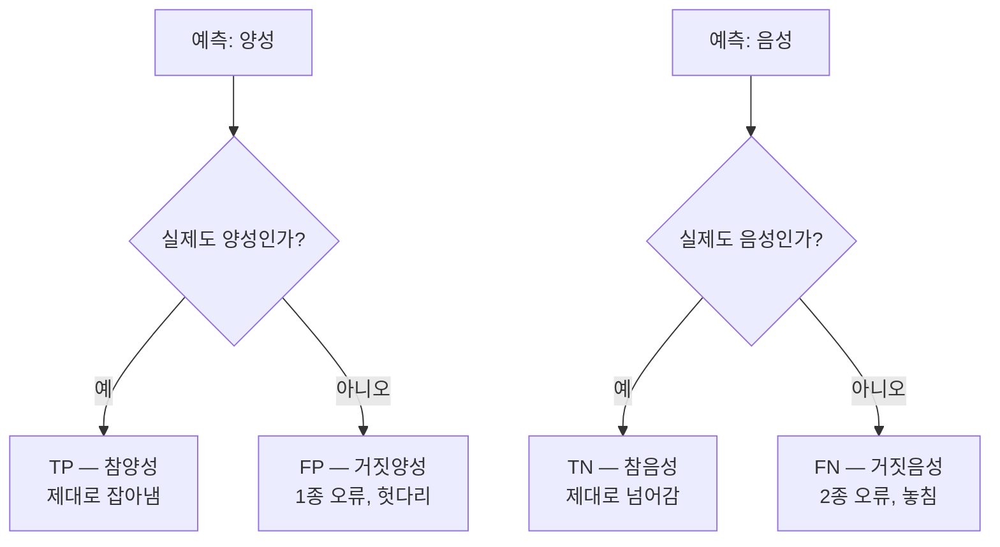
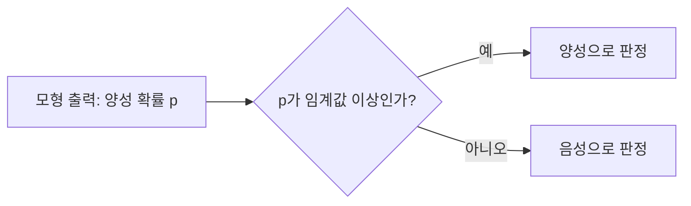

<Callout type="info">
  **이번 문서의 목표:** TP·FN·FP·TN 네 숫자만 보면 정확도·정밀도·재현율·특이도·F1을 중간 단계까지 손으로 계산할 수 있고, 불균형 데이터에서 어떤 지표를 골라야 하는지 근거를 대며 설명할 수 있게 된다.
</Callout>

## 왜 정확도 하나로는 부족한가

18편에서 만든 분류 모형이 완성되었다고 합시다. 다음 질문은 하나입니다. **이 모형은 쓸 만한가?**

가장 먼저 떠오르는 답은 "맞힌 비율을 보자"입니다. 그런데 실제 사례를 하나 보겠습니다. 어떤 병원이 희귀 질환 진단 모형을 만들었습니다. 검사받은 1000명 중 실제 환자는 80명입니다. 이 모형은 정확도 **92퍼센트**를 기록했습니다. 훌륭해 보입니다.

그런데 이 모형이 실제로 한 일은 이것뿐이었습니다. **모든 사람에게 "정상"이라고 대답하기.** 1000명 중 920명이 정상이니 920명을 맞혔고, 정확도는 0.92가 됩니다. 환자는 단 한 명도 찾지 못했는데도 말입니다.

> **쉽게 말하면:** 분류 모형 평가는 "몇 개 맞혔나"가 아니라 "**어떤 종류의 실수를 얼마나 했나**"를 나누어 보는 일입니다.

그래서 분류 평가는 지표 하나가 아니라 **네 칸짜리 표**에서 출발합니다. 회귀 모형과 군집 모형의 평가지표는 21편에서 따로 다룹니다.

## 1. 혼동행렬 — 네 칸으로 모든 것이 결정된다

### 정의와 네 칸의 이름

**혼동행렬**(confusion matrix, 정오분류표, 오분류표)은 **실제 정답**과 **모형의 예측**을 교차시켜 만든 표입니다. 이진 분류(둘 중 하나를 고르는 분류)에서는 칸이 네 개 나옵니다.

먼저 용어를 정리합니다. 분류 문제에서는 **우리가 찾아내고 싶은 쪽**을 **양성**(Positive, 포지티브), 나머지를 **음성**(Negative, 네거티브)이라고 부릅니다. 질병 진단이면 환자가 양성, 스팸 필터면 스팸이 양성입니다. 좋고 나쁨과는 무관한 이름표일 뿐입니다.

네 칸의 이름은 **앞글자 두 개를 그대로 읽으면** 뜻이 나옵니다.

- **TP**(True Positive, 참양성) — 양성이라고 예측했고 **그 예측이 맞았다**. 실제도 양성.
- **FP**(False Positive, 거짓양성) — 양성이라고 예측했는데 **틀렸다**. 실제는 음성. 통계에서 말하는 **1종 오류**(Type I error)이며, 흔히 **헛다리·거짓 경보**입니다.
- **FN**(False Negative, 거짓음성) — 음성이라고 예측했는데 **틀렸다**. 실제는 양성. **2종 오류**(Type II error)이며, **놓친 것**입니다.
- **TN**(True Negative, 참음성) — 음성이라고 예측했고 맞았다. 실제도 음성.

> **쉽게 말하면:** 앞글자 T와 F는 "**예측이 맞았느냐**", 뒷글자 P와 N은 "**모형이 뭐라고 예측했느냐**"입니다. 그래서 FN은 "음성이라고 말했는데 틀렸다"이고, 뒤집으면 실제는 양성이라는 뜻이 됩니다.

이 읽는 법 하나면 네 칸을 외울 필요가 없습니다. 시험에서 "FN은 실제값이 무엇이고 예측값이 무엇인가"를 묻는 문제가 매 회차 나오는데, 이 규칙으로 즉시 풉니다.

### 이 편에서 계속 쓸 숫자

희귀 질환 진단 모형을 1000명에게 적용한 결과가 다음과 같다고 합시다.

| 구분 | 실제 양성(환자) | 실제 음성(정상) | 행 합계 |
|------|-----------------|-----------------|---------|
| 예측 양성 | TP = 68 | FP = 17 | 85 |
| 예측 음성 | FN = 12 | TN = 903 | 915 |
| 열 합계 | 80 | 920 | 1000 |

표를 읽는 방법부터 확인합니다.

- **세로로 더하면 실제 인원**입니다. 실제 환자는 68 더하기 12로 80명, 실제 정상은 17 더하기 903으로 920명입니다.
- **가로로 더하면 모형의 판정 건수**입니다. 모형이 환자라고 부른 사람은 68 더하기 17로 85명입니다.
- 전체는 68 더하기 12 더하기 17 더하기 903으로 1000명입니다.

이 네 숫자만으로 모든 지표가 나옵니다. **분자와 분모를 어디서 가져오느냐**가 지표의 차이 전부입니다.

## 2. 다섯 지표를 손으로 계산하기

### 정확도 — 전체 중 맞힌 비율

**정확도**(Accuracy, 어큐러시)는 전체 중에서 제대로 맞힌 비율입니다. 가장 직관적인 지표입니다.

$$
\text{정확도} = \frac{TP + TN}{TP + FN + FP + TN}
$$

- 분자 — 맞힌 경우 두 칸(참양성과 참음성)의 합
- 분모 — 전체 건수

대입합니다. 먼저 분자입니다.

$$
68 + 903 = 971
$$

분모입니다.

$$
68 + 12 + 17 + 903 = 1000
$$

나눕니다.

$$
\text{정확도} = \frac{971}{1000} = 0.971
$$

**해석:** 1000명 중 971명의 판정이 맞았습니다. 약 **97.1퍼센트**입니다. 좋아 보이지만, 조금 뒤에 이 숫자가 왜 위험한지 다시 봅니다.

### 정밀도 — 양성이라 말한 것 중 진짜 비율

**정밀도**(Precision, 프리시전)는 모형이 **양성이라고 판정한 것 중에서** 실제로 양성이었던 비율입니다. 분모가 **모형의 판정 건수**라는 점이 핵심입니다.

$$
\text{정밀도} = \frac{TP}{TP + FP}
$$

- 분자 $TP$ — 양성이라 판정했고 맞은 건수
- 분모 $TP + FP$ — 양성이라 판정한 **전체** 건수(맞은 것 + 헛다리)

대입합니다. 먼저 분모입니다.

$$
68 + 17 = 85
$$

나눕니다.

$$
\text{정밀도} = \frac{68}{85} = 0.8
$$

**해석:** 모형이 "환자입니다"라고 부른 85명 중 **80퍼센트**인 68명만 진짜 환자였습니다. 나머지 17명은 멀쩡한데 정밀 검사를 받으러 가는 셈입니다. 정밀도는 **거짓 경보를 얼마나 안 울리는가**를 재는 지표입니다.

> **생활 비유:** 정밀도가 낮은 화재감지기는 툭하면 울립니다. 요리만 해도 울리니 나중에는 아무도 믿지 않습니다.

### 재현율 — 실제 양성 중 찾아낸 비율

**재현율**(Recall, 리콜)은 **실제 양성 중에서** 모형이 찾아낸 비율입니다. **민감도**(Sensitivity, 센시티비티), **참양성률**(TPR, True Positive Rate)이라고도 부르며 세 이름은 완전히 같은 값입니다.

$$
\text{재현율} = \frac{TP}{TP + FN}
$$

- 분자 $TP$ — 제대로 찾아낸 양성
- 분모 $TP + FN$ — 실제 양성 **전체**(찾은 것 + 놓친 것)

대입합니다. 먼저 분모입니다.

$$
68 + 12 = 80
$$

나눕니다.

$$
\text{재현율} = \frac{68}{80} = 0.85
$$

**해석:** 실제 환자 80명 중 68명, 즉 **85퍼센트**를 찾아냈습니다. 12명은 환자인데 정상 판정을 받고 집으로 돌아갔습니다. 재현율은 **놓친 것을 얼마나 줄였는가**를 재는 지표입니다.

> **자주 틀리는 점:** 정밀도와 재현율은 **분자가 똑같이 TP이고 분모만 다릅니다.** 정밀도의 분모는 **세로가 아니라 가로**, 즉 모형이 양성이라 부른 전체이고, 재현율의 분모는 실제 양성 전체입니다. 헷갈리면 "정밀도는 **내 말이 얼마나 맞았나**, 재현율은 **있는 걸 얼마나 건졌나**"로 구분하세요.

### 특이도 — 실제 음성 중 제대로 걸러낸 비율

**특이도**(Specificity, 스페시피시티)는 재현율의 음성 버전입니다. **실제 음성 중에서** 음성이라고 제대로 판정한 비율입니다.

$$
\text{특이도} = \frac{TN}{TN + FP}
$$

- 분자 $TN$ — 제대로 음성 판정한 건수
- 분모 $TN + FP$ — 실제 음성 **전체**

대입합니다. 먼저 분모입니다.

$$
903 + 17 = 920
$$

나눕니다.

$$
\text{특이도} = \frac{903}{920} \approx 0.9815
$$

**해석:** 실제 정상 920명 중 약 **98.15퍼센트**를 정상으로 걸러냈습니다. 나머지 약 1.85퍼센트가 헛다리를 짚힌 사람들입니다.

여기서 하나가 파생됩니다. **거짓양성률**(FPR, False Positive Rate)은 실제 음성 중 잘못 양성 판정된 비율이며 다음과 같습니다.

$$
FPR = 1 - \text{특이도} = 1 - 0.9815 = 0.0185
$$

이 값이 곧 뒤에 나올 ROC 곡선의 **가로축**입니다.

### F1 점수 — 정밀도와 재현율을 하나로

정밀도와 재현율은 서로 밀고 당깁니다. 둘을 하나의 숫자로 요약하고 싶을 때 쓰는 것이 **F1 점수**(F1-score, 에프원 스코어)이며, 두 값의 **조화평균**(harmonic mean)으로 정의합니다.

$$
F1 = \frac{2 \times \text{정밀도} \times \text{재현율}}{\text{정밀도} + \text{재현율}}
$$

대입합니다. 먼저 분자입니다.

$$
2 \times 0.8 \times 0.85 = 1.36
$$

분모입니다.

$$
0.8 + 0.85 = 1.65
$$

나눕니다.

$$
F1 = \frac{1.36}{1.65} \approx 0.824
$$

**해석:** 정밀도 0.8과 재현율 0.85를 요약하면 약 **0.824**입니다. 두 값의 산술평균인 0.825보다 아주 조금 낮습니다. 두 값이 비슷할 때 조화평균과 산술평균은 거의 차이가 없습니다.

### 왜 하필 조화평균인가

이 질문이 F1의 전부입니다. 극단적인 모형을 하나 상상해 봅시다. 이 모형은 **가장 확신하는 한 명에게만** 양성 판정을 내리고 그 한 명이 맞았습니다. 실제 환자는 80명입니다.

- 정밀도 = 1을 1로 나눈 **1.0** (양성이라 부른 한 명이 진짜 환자였으니 100퍼센트)
- 재현율 = 1을 80으로 나눈 약 **0.0125** (80명 중 1명만 찾았으니 사실상 무용지물)

**산술평균**으로 요약하면 이렇습니다.

$$
\frac{1.0 + 0.0125}{2} = 0.506
$$

절반 이상의 점수를 받습니다. 쓸모없는 모형인데도 말입니다. 이번엔 **조화평균**입니다. 분자를 먼저 구합니다.

$$
2 \times 1.0 \times 0.0125 = 0.025
$$

분모입니다.

$$
1.0 + 0.0125 = 1.0125
$$

나눕니다.

$$
F1 = \frac{0.025}{1.0125} \approx 0.0247
$$

**해석:** 조화평균은 약 0.025로 **바닥에 붙습니다.** 조화평균은 두 값 중 **작은 쪽에 강하게 끌려가는** 성질이 있어서, 한쪽만 좋고 다른 쪽이 나쁜 모형을 봐주지 않습니다. 그래서 "정밀도와 재현율을 **둘 다** 잘해야 한다"는 요구를 숫자 하나로 표현하려고 조화평균을 쓰는 것입니다.

> **자주 틀리는 점:** 시험 단골 오답이 "**F1 점수는 정밀도와 재현율의 산술평균이다**"입니다. 반드시 조화평균이며, 2를 곱하는 이유는 조화평균의 정의식에서 나옵니다. 또 하나, F1 계산에는 **정확도와 특이도가 절대 들어가지 않습니다.** 정밀도 0.80, 재현율 0.50, 정확도 0.86, 특이도 0.92를 모두 주고 F1을 묻는 문제가 나오는데, 필요한 것은 앞의 두 개뿐이고 답은 다음과 같습니다.

$$
F1 = \frac{2 \times 0.80 \times 0.50}{0.80 + 0.50} = \frac{0.80}{1.30} \approx 0.62
$$

### 계산 결과 요약표

| 지표 | 공식 | 우리 예시의 계산 | 값 |
|------|------|------------------|-----|
| 정확도(Accuracy) | (TP + TN) ÷ 전체 | (68 + 903) ÷ 1000 | 0.971 |
| 정밀도(Precision) | TP ÷ (TP + FP) | 68 ÷ 85 | 0.800 |
| 재현율(Recall, 민감도) | TP ÷ (TP + FN) | 68 ÷ 80 | 0.850 |
| 특이도(Specificity) | TN ÷ (TN + FP) | 903 ÷ 920 | 0.9815 |
| 거짓양성률(FPR) | 1 – 특이도 | 1 – 0.9815 | 0.0185 |
| F1 점수 | 정밀도와 재현율의 조화평균 | 1.36 ÷ 1.65 | 0.824 |

## 3. 정확도의 역설 — 불균형 데이터의 함정

### 왜 문제가 되는가

앞에서 정확도 0.971이라는 좋은 숫자를 얻었습니다. 그런데 이 데이터는 **불균형**(imbalanced)입니다. 음성이 920명, 양성이 80명으로 약 11.5대 1입니다.

이번엔 아무 학습도 하지 않고 **모든 사람에게 정상이라고 대답하는** 모형을 만들어 보겠습니다. 이 모형의 혼동행렬은 다음과 같습니다.

| 구분 | 실제 양성 | 실제 음성 |
|------|-----------|-----------|
| 예측 양성 | TP = 0 | FP = 0 |
| 예측 음성 | FN = 80 | TN = 920 |

정확도를 계산합니다.

$$
\text{정확도} = \frac{0 + 920}{1000} = 0.92
$$

**해석:** 아무것도 학습하지 않은 모형이 정확도 **92퍼센트**를 받습니다. 반면 재현율은 다음과 같습니다.

$$
\text{재현율} = \frac{0}{0 + 80} = 0
$$

환자를 한 명도 찾지 못했다는 사실이 재현율에서만 드러납니다. 이렇게 **불균형 데이터에서 정확도가 실력과 무관하게 높게 나오는 현상**을 **정확도의 역설**(accuracy paradox)이라고 부릅니다.

> **쉽게 말하면:** 반 전체가 대부분 합격하는 시험에서 "전원 합격"이라고 찍으면 적중률이 높게 나오는 것과 같습니다. 적중률이 높다고 예측 실력이 있는 것은 아닙니다.

### 그래서 어떻게 하는가

- **평가지표를 바꿉니다.** 정확도 대신 F1 점수, ROC-AUC, 정밀도-재현율 곡선을 봅니다. 특히 양성이 매우 드물면 정밀도와 재현율 중심으로 봅니다.
- **데이터를 조정합니다.** 다수 범주를 줄이는 **과소표집**(under-sampling, 언더샘플링), 소수 범주를 늘리는 **과대표집**(over-sampling, 오버샘플링), 소수 범주의 합성 데이터를 만드는 **SMOTE**(Synthetic Minority Over-sampling Technique)가 대표적입니다.
- **클래스 가중치를 조정합니다.** 소수 범주를 틀렸을 때의 벌점을 크게 줍니다.

> **자주 틀리는 점:** "앙상블 기법을 쓰면 클래스 불균형이 자동으로 해소된다"는 **틀린 진술**입니다. 앙상블은 성능을 올릴 뿐 불균형 자체를 다루지 않습니다. 불균형은 표본추출·합성 데이터·가중치 조정처럼 **별도의 처리**가 필요합니다.

## 4. 임계값과 정밀도-재현율 트레이드오프

### 임계값이란 무엇인가

분류 모형은 대개 "환자다·아니다"를 바로 뱉지 않습니다. **양성일 확률**을 0과 1 사이 숫자로 내놓습니다. 이 확률을 판정으로 바꾸려면 기준선이 필요한데, 이 기준선을 **임계값**(threshold, 스레숄드, 기준값·절단값)이라고 합니다. 보통 기본값은 0.5입니다.

> **쉽게 말하면:** 임계값은 **의심의 문턱 높이**입니다. 문턱을 낮추면 조금만 의심스러워도 환자로 분류하고, 높이면 아주 확실할 때만 환자로 분류합니다.

### 임계값을 움직이면 무슨 일이 일어나는가

같은 모형, 같은 데이터인데 임계값만 바꾼 결과를 봅시다.

| 임계값 | TP | FP | FN | 정밀도 | 재현율 |
|--------|----|----|----|--------|--------|
| 0.2 (낮음) | 76 | 90 | 4 | 0.458 | 0.950 |
| 0.5 (기본) | 68 | 17 | 12 | 0.800 | 0.850 |
| 0.8 (높음) | 45 | 3 | 35 | 0.938 | 0.563 |

읽어 봅시다.

- **임계값을 낮추면** 양성 판정이 늘어납니다. 놓치는 환자(FN)가 줄어 **재현율이 올라가고**, 헛다리(FP)가 늘어 **정밀도가 떨어집니다.**
- **임계값을 높이면** 양성 판정이 줄어듭니다. 확실한 것만 부르니 **정밀도가 올라가고**, 놓치는 환자가 늘어 **재현율이 떨어집니다.**

이 밀고 당김을 **정밀도-재현율 트레이드오프**(precision-recall trade-off)라고 합니다. **모형을 바꾸지 않아도 임계값만으로 두 지표가 반대 방향으로 움직인다**는 것이 핵심입니다.

극단으로 밀어보면 성질이 더 분명해집니다. 임계값을 0으로 낮추면 확률이 0 이상인 모든 사람이 양성 판정을 받습니다. 그러면 놓치는 환자가 없으니 재현율은 다음과 같습니다.

$$
\text{재현율} = \frac{TP}{TP + 0} = 1
$$

동시에 음성을 하나도 음성으로 부르지 않았으므로 TN은 0이고 특이도는 다음과 같습니다.

$$
\text{특이도} = \frac{0}{0 + FP} = 0
$$

따라서 민감도에서 특이도를 뺀 값은 1이 됩니다. 이 상황을 그대로 묻는 기출 문제가 있으니 논리를 기억해 두세요.

## 5. ROC 곡선과 AUC

### 왜 필요한가

임계값 하나를 고른 뒤 지표를 재면, 그 지표는 **그 임계값에서의 성적**일 뿐입니다. 임계값 선택과 무관하게 모형 자체의 실력을 보고 싶다면, **모든 임계값을 다 훑어본 결과**를 그림 하나로 모아야 합니다.

> **쉽게 말하면:** ROC 곡선은 **문턱 높이를 1에서 0까지 서서히 낮추면서, 잘 잡은 정도와 헛다리 짚은 정도가 어떻게 함께 늘어나는지를 그린 궤적**입니다.

**ROC 곡선**(Receiver Operating Characteristic curve, 수신자 조작 특성 곡선)의 두 축은 다음과 같습니다.

- **가로축** — **거짓양성률**(FPR, False Positive Rate) = 1 − 특이도. 실제 음성을 잘못 양성이라 부른 비율입니다.
- **세로축** — **참양성률**(TPR, True Positive Rate) = 재현율 = 민감도. 실제 양성을 제대로 잡은 비율입니다.

> **자주 틀리는 점:** 축을 뒤집어 놓은 보기가 자주 나옵니다. **세로가 참양성률, 가로가 거짓양성률**입니다. 그리고 가로축은 특이도가 아니라 **1에서 특이도를 뺀 값**입니다.

곡선이 **왼쪽 위 구석**에 가까울수록 좋습니다. 헛다리(가로)는 거의 없이 잘 잡아내기(세로)만 한다는 뜻이기 때문입니다. 반대로 **왼쪽 아래에서 오른쪽 위로 가는 대각선**은 동전 던지기와 같은 무작위 예측을 뜻합니다.

### AUC와 그 확률적 해석

**AUC**(Area Under the Curve, 곡선 아래 면적)는 ROC 곡선 아래의 넓이입니다. 0과 1 사이 값이며 클수록 좋습니다.

- AUC가 0.5 — 무작위 추측 수준. 아무 판별력이 없습니다.
- AUC가 1.0 — 완벽한 판별.
- AUC가 0.5 미만 — 예측을 반대로 뒤집으면 더 낫다는 뜻이므로, 보통 레이블이나 부호가 뒤집힌 실수를 의심합니다.

AUC에는 아주 유용한 **확률적 해석**이 있습니다.

> **AUC는 임의로 뽑은 양성 하나가, 임의로 뽑은 음성 하나보다 더 높은 점수를 받을 확률이다.**

즉 AUC는 "정답을 얼마나 맞혔나"가 아니라 **"양성을 음성보다 위쪽에 잘 세워놓았나" 하는 순위 판별력**을 재는 값입니다. 임계값을 어디로 잡든 순위 자체는 바뀌지 않으므로, AUC는 **임계값과 무관한 지표**가 됩니다.

이 해석을 그대로 계산에 씁니다. 동점이 없는 양성-음성 표본쌍을 100개 뽑아 점수를 비교했더니 다음과 같았다고 합시다.

- 모형 A: 100쌍 중 52쌍에서 양성 쪽 점수가 더 높았다
- 모형 B: 100쌍 중 81쌍에서 양성 쪽 점수가 더 높았다

경험적 AUC는 그 비율 그대로입니다. 모형 A입니다.

$$
AUC_A = \frac{52}{100} = 0.52
$$

모형 B입니다.

$$
AUC_B = \frac{81}{100} = 0.81
$$

**해석:** 모형 A의 0.52는 우연 수준인 0.5와 거의 다르지 않으므로 판별력이 사실상 없습니다. 모형 B의 0.81은 양성을 음성보다 위에 세우는 능력이 뚜렷합니다. 같은 평가 표본에서 잰 값이라면 **B가 더 나은 모형**이라고 말할 수 있습니다.

> **자주 틀리는 점:** AUC를 "정확도"로 읽으면 안 됩니다. AUC 0.81은 "81퍼센트를 맞혔다"가 아니라 "임의의 양성이 임의의 음성보다 높은 점수를 받을 확률이 81퍼센트"입니다. 또 AUC 비교는 **같은 평가 표본**에서 잰 값끼리만 의미가 있습니다.

## 6. 다중 분류의 평균 — 매크로와 마이크로

지금까지는 양성·음성 두 범주였습니다. 범주가 셋 이상이면 각 범주를 한 번씩 양성으로 놓고 지표를 계산한 뒤, 이를 하나로 **평균**해야 합니다. 방법이 두 가지입니다.

- **매크로 평균**(macro average, 거시 평균) — 범주별 지표를 각각 구한 뒤 **단순 산술평균**을 냅니다. 범주 크기와 무관하게 **모든 범주를 똑같이 한 표씩** 취급합니다.
- **마이크로 평균**(micro average, 미시 평균) — 범주별 TP·FP·FN을 **먼저 전부 합친 뒤** 지표를 한 번만 계산합니다. 건수가 많은 범주가 자연히 더 큰 영향을 줍니다.

세 범주 문제로 계산해 봅니다.

| 범주 | TP | FP | FN | 범주별 정밀도 |
|------|----|----|----|---------------|
| A(다수 범주) | 40 | 10 | 10 | 40 ÷ 50 = 0.800 |
| B(중간 범주) | 30 | 20 | 10 | 30 ÷ 50 = 0.600 |
| C(소수 범주) | 5 | 10 | 20 | 5 ÷ 15 ≈ 0.333 |

**매크로 정밀도**는 세 값의 산술평균입니다. 먼저 더합니다.

$$
0.800 + 0.600 + 0.333 = 1.733
$$

3으로 나눕니다.

$$
\text{매크로 정밀도} = \frac{1.733}{3} \approx 0.578
$$

**마이크로 정밀도**는 TP와 FP를 각각 다 더한 뒤 한 번만 계산합니다. TP 합계입니다.

$$
40 + 30 + 5 = 75
$$

FP 합계입니다.

$$
10 + 20 + 10 = 40
$$

나눕니다.

$$
\text{마이크로 정밀도} = \frac{75}{75 + 40} = \frac{75}{115} \approx 0.652
$$

**해석:** 매크로는 약 0.578, 마이크로는 약 0.652로 꽤 차이가 납니다. 소수 범주 C의 정밀도가 0.333으로 나쁜데, 매크로는 C에게도 3분의 1의 발언권을 주므로 점수가 내려갑니다. 마이크로는 건수가 많은 A의 성적에 끌려 올라갑니다.

따라서 **소수 범주의 성능이 중요한 문제라면 매크로 평균을 봐야 합니다.** 마이크로만 보면 소수 범주를 통째로 못 맞혀도 점수가 잘 나옵니다. 참고로 단일 레이블 다중 분류에서는 전체 FP 합과 FN 합이 같아지므로 **마이크로 정밀도와 마이크로 재현율, 마이크로 F1이 모두 같은 값**이 됩니다. 위 예시에서도 FN 합계가 10 더하기 10 더하기 20으로 40이어서 FP 합계와 같습니다.

## 7. 어떤 지표를 골라야 하는가

지표 선택은 **어떤 실수가 더 비싼가**로 결정됩니다. 이것이 이 편에서 가장 실전적인 부분입니다.

| 상황 | 더 비싼 실수 | 우선할 지표 | 이유 |
|------|--------------|-------------|------|
| 암 진단, 화재 감지, 부정 거래 탐지 | 거짓음성(FN, 놓침) | 재현율(민감도) | 놓치면 생명·거액 손실. 헛다리는 재검사로 수습 가능 |
| 스팸 필터, 고객 차단, 광고 발송 | 거짓양성(FP, 헛다리) | 정밀도 | 중요 메일이 스팸함으로 가거나 정상 고객이 차단되면 피해가 큼 |
| 두 실수의 비용이 비슷할 때 | 둘 다 | F1 점수 | 정밀도와 재현율을 함께 요약 |
| 범주 비율이 심하게 치우칠 때 | – | F1, ROC-AUC, 정밀도-재현율 곡선 | 정확도는 정확도의 역설로 왜곡됨 |
| 임계값을 아직 못 정했을 때 | – | ROC-AUC | 임계값과 무관한 순위 판별력을 봄 |
| 소수 범주가 중요한 다중 분류 | – | 매크로 평균 | 모든 범주에 동일한 비중을 줌 |

> **자주 틀리는 점:** "거짓음성을 줄이는 것이 목표"라는 문장이 나오면 답은 **재현율**입니다. FN이 재현율의 분모에 직접 들어가 있기 때문입니다. 반대로 "거짓양성을 줄이는 것이 목표"이면 **정밀도**입니다. 문제의 상황 문장에서 FN인지 FP인지만 골라내면 지표가 자동으로 정해집니다.

## 8. 시험에서 어떻게 물어보나

**유형 1 — 혼동행렬 칸 이름 연결.** "행은 실제, 열은 예측인 혼동행렬에서 셀 의미의 연결로 옳지 않은 것은?" 같은 형태입니다. **앞글자는 예측이 맞았는지, 뒷글자는 무엇으로 예측했는지**라는 규칙만 붙들면 풀립니다. 문제에서 행과 열이 뒤집혀 제시되기도 하니 표의 축 설명을 먼저 읽으세요.

**유형 2 — 공식 대응 찾기.** "정밀도 = TP ÷ (TP + FP)", "재현율 = TP ÷ (TP + FN)", "특이도 = TN ÷ (TN + FP)"를 나열하고 틀린 것을 고르게 합니다. 오답은 거의 항상 **F1을 산술평균으로 써놓은 보기**입니다.

**유형 3 — 숫자를 주고 계산.** 정밀도와 재현율(때로는 정확도·특이도까지)을 주고 F1을 묻습니다. 필요한 것은 정밀도와 재현율뿐이며, 정확도·특이도는 **버리라고 넣어둔 미끼**입니다.

**유형 4 — 임계값 극단 상황.** "기준값을 0으로 낮추면 민감도와 특이도는?"이라는 문제입니다. 모두 양성 판정 → 민감도 1, 특이도 0, 차이는 1입니다.

**유형 5 — 혼동행렬에 없는 것 고르기.** TP, FP, TN, FN 중 아닌 것을 고르게 하는데 보기에 **VIF**(분산팽창요인, 회귀의 다중공선성 진단량)나 SSE 같은 다른 영역의 지표를 섞어 놓습니다.

**유형 6 — AUC 해석.** 두 모형의 AUC를 주고 옳은 해석을 고르게 하거나, 양성-음성 표본쌍 비교 결과를 주고 경험적 AUC를 계산하게 합니다. ROC의 축(세로 TPR, 가로 FPR)을 함께 묻는 보기가 딸려 나옵니다.

**유형 7 — 불균형 데이터 대응.** "정확도만 보면 안 되고 F1과 ROC-AUC를 함께 봐야 한다"는 취지의 보기가 정답 방향이며, "앙상블로 불균형이 자동 해소된다"가 대표 오답입니다.

## 핵심 정리

- 혼동행렬 네 칸의 이름은 앞글자가 예측의 적중 여부(T, F), 뒷글자가 모형의 예측(P, N)이다. FP는 1종 오류인 헛다리, FN은 2종 오류인 놓침이며 이 둘 중 무엇이 더 비싼가가 지표 선택을 결정한다.
- 정밀도와 재현율은 분자가 똑같이 TP이고 분모만 다르다. 정밀도는 양성이라 판정한 전체(TP + FP)로, 재현율은 실제 양성 전체(TP + FN)로 나눈다. TP 68, FN 12, FP 17, TN 903에서는 정밀도 0.8, 재현율 0.85, 특이도 약 0.9815, 정확도 0.971이 나온다.
- F1은 정밀도와 재현율의 조화평균이며 산술평균이 아니다. 위 예시에서 1.36을 1.65로 나눈 약 0.824다. 조화평균은 작은 쪽에 강하게 끌려가므로 한쪽만 좋은 모형에 높은 점수를 주지 않는다.
- 불균형 데이터에서 정확도는 정확도의 역설로 부풀려진다. 양성이 8퍼센트인 데이터에서 전원 음성이라 답해도 정확도 0.92가 나오지만 재현율은 0이다. 이때는 F1, ROC-AUC, 정밀도-재현율 곡선을 본다.
- ROC 곡선은 세로축이 참양성률(재현율), 가로축이 거짓양성률(1 − 특이도)이다. AUC는 임의의 양성이 임의의 음성보다 높은 점수를 받을 확률이며 0.5가 우연 수준이고 임계값과 무관하다. 다중 분류에서 소수 범주가 중요하면 매크로 평균을 본다.

## 마무리 복습

<Quiz
  questionNumber={1}
  question="혼동행렬이 TP는 68, FN은 12, FP는 17, TN은 903일 때 이 모형의 정밀도로 옳은 것은?"
  options={['① 0.800', '② 0.850', '③ 0.971', '④ 0.9815']}
  correctAnswer={1}
  explanation="정밀도는 양성이라 판정한 전체 중 실제 양성의 비율이므로 TP를 TP와 FP의 합으로 나눈다. 68을 68 더하기 17인 85로 나누면 0.8이다. 나머지 보기는 각각 재현율, 정확도, 특이도의 값이다."
  optionExplanations={['정답이다. 68을 85로 나눈 0.8이 정밀도다.', '0.850은 재현율이다. 분모를 실제 양성 전체인 80으로 잡은 값이다.', '0.971은 정확도다. 맞힌 971건을 전체 1000건으로 나눈 값이다.', '0.9815는 특이도다. 903을 실제 음성 전체인 920으로 나눈 값이다.']}
/>

<Quiz
  questionNumber={2}
  question="혼동행렬의 네 칸에 대한 설명으로 옳지 않은 것은?"
  options={['① TP는 실제도 양성이고 예측도 양성인 건수다', '② FP는 실제는 음성인데 양성으로 예측한 건수이며 1종 오류에 해당한다', '③ FN은 실제는 양성인데 음성으로 예측한 건수이며 놓친 사례다', '④ TN은 실제는 양성인데 음성으로 예측한 건수다']}
  correctAnswer={4}
  explanation="TN은 실제도 음성이고 예측도 음성인 건수다. 실제는 양성인데 음성으로 예측한 것은 FN이다. 앞글자 T와 F는 예측이 맞았는지, 뒷글자 P와 N은 무엇으로 예측했는지를 뜻한다."
  optionExplanations={['TP의 정의 그대로이므로 옳은 설명이다.', 'FP는 거짓 경보이며 1종 오류에 해당하므로 옳은 설명이다.', 'FN은 놓친 사례이며 2종 오류에 해당하므로 옳은 설명이다.', '정답으로 골라야 할 틀린 설명이다. 이 서술은 TN이 아니라 FN을 가리킨다.']}
/>

<Quiz
  questionNumber={3}
  question="분류 모형의 정밀도는 0.80, 재현율은 0.50, 정확도는 0.86, 특이도는 0.92이다. F1 점수의 값과 계산 근거를 올바르게 짝지은 것은?"
  options={['① 약 0.63 – 재현율과 정확도의 조화평균', '② 0.65 – 정밀도와 재현율의 산술평균', '③ 약 0.62 – 정밀도와 재현율의 조화평균', '④ 약 0.65 – 재현율과 특이도의 조화평균']}
  correctAnswer={3}
  explanation="F1은 정밀도와 재현율의 조화평균이므로 2 곱하기 0.80 곱하기 0.50을 0.80 더하기 0.50으로 나눈다. 분자는 0.80, 분모는 1.30이므로 약 0.62다. 정확도와 특이도는 F1 계산에 들어가지 않는 미끼 정보다."
  optionExplanations={['정확도는 F1 계산에 사용하지 않으므로 근거가 틀렸다.', '산술평균 0.65는 F1의 정의가 아니다. F1은 조화평균이다.', '정답이다. 0.80을 1.30으로 나눈 약 0.62이며 근거도 조화평균으로 옳다.', '특이도는 F1 계산에 들어가지 않으므로 근거가 틀렸다.']}
/>

<Quiz
  questionNumber={4}
  question="전체 1000건 중 실제 양성이 80건인 데이터에서, 모든 건을 음성으로 예측하는 모형을 만들었다. 이 모형의 정확도와 재현율로 옳은 것은?"
  options={['① 정확도 0.92, 재현율 0', '② 정확도 0.08, 재현율 1', '③ 정확도 0.92, 재현율 1', '④ 정확도 0.50, 재현율 0.50']}
  correctAnswer={1}
  explanation="모두 음성으로 예측하면 TP는 0, FN은 80, FP는 0, TN은 920이다. 정확도는 920을 1000으로 나눈 0.92이고, 재현율은 0을 80으로 나눈 0이다. 학습을 전혀 하지 않아도 정확도가 높게 나오는 정확도의 역설을 보여주는 사례다."
  optionExplanations={['정답이다. 정확도는 높지만 재현율이 0이라는 점에서 모형이 무용지물임이 드러난다.', '정확도 0.08은 음성과 양성의 비율을 뒤바꾼 계산이며 재현율도 맞지 않는다.', '재현율 1이 되려면 실제 양성을 모두 찾아야 하는데 양성 판정 자체가 없으므로 불가능하다.', '0.50은 어느 계산과도 맞지 않는 값이다.']}
/>

<Quiz
  questionNumber={5}
  question="분류 모형의 판정 임계값을 0.5에서 0.2로 낮추었을 때 일반적으로 나타나는 변화로 가장 적절한 것은?"
  options={['① 재현율이 올라가고 정밀도가 내려간다', '② 재현율과 정밀도가 모두 올라간다', '③ 재현율이 내려가고 정밀도가 올라간다', '④ 재현율과 정밀도가 모두 변하지 않는다']}
  correctAnswer={1}
  explanation="임계값을 낮추면 양성 판정이 늘어난다. 놓치는 양성인 FN이 줄어 재현율이 올라가지만 헛다리인 FP가 늘어 정밀도는 내려간다. 이것이 정밀도와 재현율의 트레이드오프다."
  optionExplanations={['정답이다. 문턱을 낮추면 더 많이 잡되 헛다리도 늘어난다.', '두 지표는 임계값 변화에 대해 반대 방향으로 움직이므로 동시에 올라가기 어렵다.', '이는 임계값을 높였을 때 나타나는 변화다.', '임계값은 판정 결과를 직접 바꾸므로 두 지표도 함께 변한다.']}
/>

<Quiz
  questionNumber={6}
  question="ROC 곡선과 AUC에 대한 설명으로 옳지 않은 것은?"
  options={['① ROC의 세로축은 참양성률이다', '② ROC의 가로축은 거짓양성률이며 1에서 특이도를 뺀 값이다', '③ AUC는 임의의 양성 표본이 임의의 음성 표본보다 높은 점수를 받을 확률로 해석된다', '④ AUC가 0.5이면 판별력이 완벽하다는 뜻이다']}
  correctAnswer={4}
  explanation="AUC가 0.5이면 동전 던지기와 같은 무작위 수준이어서 판별력이 없다는 뜻이다. 완벽한 판별은 AUC가 1.0일 때다."
  optionExplanations={['ROC의 세로축은 참양성률, 즉 재현율이므로 옳은 설명이다.', '가로축은 거짓양성률이며 1에서 특이도를 뺀 값이 맞으므로 옳은 설명이다.', 'AUC의 표준적인 확률적 해석이므로 옳은 설명이다.', '정답으로 골라야 할 틀린 설명이다. 0.5는 우연 수준이고 1.0이 완벽이다.']}
/>

<Quiz
  questionNumber={7}
  question="암 진단 모형에서 실제 환자를 놓치는 거짓음성을 줄이는 것이 가장 중요한 목표일 때 우선적으로 보아야 할 평가지표는?"
  options={['① 정밀도', '② 특이도', '③ 재현율', '④ 정확도']}
  correctAnswer={3}
  explanation="재현율은 실제 양성 중 올바르게 탐지한 비율인 TP를 TP와 FN의 합으로 나눈 값이므로, 거짓음성을 줄이는 목표에 직접 대응한다. 거짓음성이 줄면 분모의 FN이 줄어 재현율이 올라간다."
  optionExplanations={['정밀도는 거짓양성을 줄이는 목표에 대응하는 지표다.', '특이도는 실제 음성을 제대로 걸러내는 능력이며 거짓음성과 직접 관련이 없다.', '정답이다. FN이 분모에 직접 들어 있으므로 놓침을 줄이는 목표와 직결된다.', '정확도는 불균형 데이터에서 왜곡되기 쉬워 놓침을 관리하는 지표로 부적절하다.']}
/>

<Quiz
  questionNumber={8}
  question="세 범주 분류에서 범주별 정밀도가 각각 0.80, 0.60, 0.333일 때 매크로 평균 정밀도로 가장 가까운 값은?"
  options={['① 0.333', '② 0.578', '③ 0.652', '④ 0.800']}
  correctAnswer={2}
  explanation="매크로 평균은 범주별 지표의 단순 산술평균이다. 세 값을 더하면 1.733이고 3으로 나누면 약 0.578이다. 범주 크기와 무관하게 모든 범주에 동일한 비중을 준다는 점이 마이크로 평균과의 차이다."
  optionExplanations={['0.333은 소수 범주 하나의 정밀도일 뿐 평균이 아니다.', '정답이다. 1.733을 3으로 나눈 약 0.578이다.', '0.652는 TP와 FP를 모두 합쳐 한 번에 계산하는 마이크로 평균 정밀도의 값이다.', '0.800은 가장 성적이 좋은 범주 하나의 정밀도다.']}
/>

## 참고 자료

- [한국데이터산업진흥원 - 빅데이터분석기사 자격시험 안내](https://www.dataq.or.kr/www/sub/a_07.do)
- [Statistics Playbook - 빅데이터분석기사 완전 가이드](https://statisticsplaybook.com/big-data-analysis-engineer-guide/)
- [SQLDpass - 빅데이터분석기사 필기 기출·복원](https://www.sqldpass.com/past-exams?cert=BIGDATA_ANALYST)
- [이패스코리아 - 빅데이터분석기사 시험정보](https://www.epasskorea.com/public_html/Examinfo/info_bd.asp?cate_idx=13280110&type=C&link_idx=11112)
