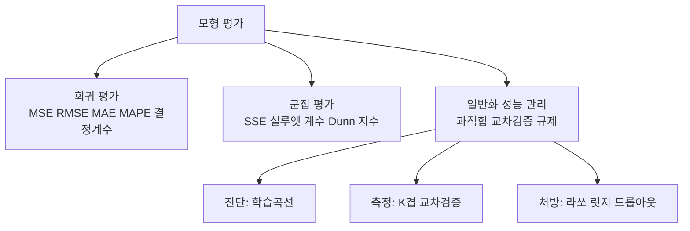
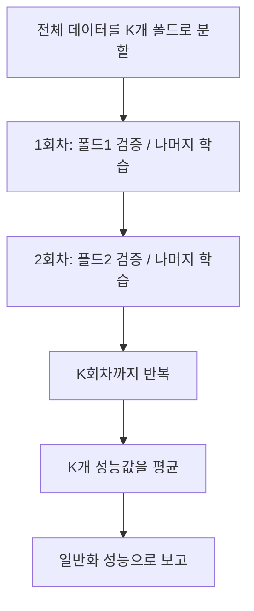
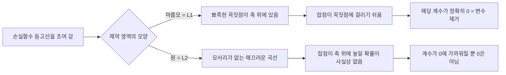

<Callout type="info">
  **이번 문서의 목표:** 회귀 모형의 오차 지표 네 가지와 결정계수를 직접 손으로 계산해 비교할 수 있고, 군집 품질을 실루엣 계수로 판정할 수 있으며, 훈련오차와 검증오차의 조합만 보고 과적합인지 과소적합인지 진단해 라쏘·릿지 같은 규제로 처방을 내릴 수 있게 된다.
</Callout>

## 왜 "평가"를 따로 배우는가

모형을 만들면 컴퓨터는 반드시 숫자를 뱉어 냅니다. 문제는 그 숫자가 **좋은 숫자인지 아닌지를 모형 스스로는 말해 주지 않는다**는 점입니다. 아파트 가격을 예측하는 모형이 "이 집은 4억 3천만 원"이라고 답했을 때, 실제가 4억 5천만 원이었다면 이 모형은 쓸 만한 걸까요, 버려야 할까요? 이 판단을 사람의 감이 아니라 **약속된 숫자 하나로 환산하는 절차**가 모형 평가(model evaluation, 모형 평가)입니다.

앞의 20편에서 다룬 분류(classification, 분류) 모형은 "맞았다 / 틀렸다"로 세면 됐습니다. 정답이 스팸인데 스팸이라고 했으면 맞은 것이니까요. 그런데 회귀(regression, 회귀)는 연속된 숫자를 맞히는 문제라서 **완전히 맞는 경우가 거의 없습니다.** 4억 5천만 원짜리 집을 4억 4999만 원으로 예측해도 "틀렸다"고 세면 모든 예측이 틀린 것이 되어 버립니다. 그래서 회귀는 "맞았나"가 아니라 "**얼마나 빗나갔나**"를 재고, 그 빗나감을 하나의 대푯값으로 요약하는 방식으로 평가합니다.

> **쉽게 말하면:** 분류 평가는 "몇 개 맞혔니"를 세는 일이고, 회귀 평가는 "평균적으로 얼마나 빗나갔니"를 재는 일입니다.

이 편에서 다룰 내용은 크게 세 덩어리입니다.

분류 지표(정확도·정밀도·재현율·F1·ROC·AUC)는 20편에서 다뤘으므로 여기서는 다시 설명하지 않습니다. 거리 계산과 K평균(K-means, 케이 평균) 군집의 원리는 19편에서 다뤘으니, 이 편은 **이미 만들어진 군집이 좋은 군집인지 판정하는 방법**만 봅니다.

## 1. 회귀 평가의 출발점 — 잔차

### 잔차란 무엇인가

모든 회귀 평가지표는 딱 하나의 재료에서 출발합니다. 바로 **잔차**(residual, 레지듀얼)입니다.

$$
e_i = y_i - \hat{y}_i
$$

- $e_i$ (이 아이, i번째 잔차): i번째 데이터에서 실제값과 예측값의 차이
- $y_i$ (와이 아이): i번째 데이터의 **실제값**(actual value, 관측값)
- $\hat{y}_i$ (와이 햇 아이): i번째 데이터에 대한 모형의 **예측값**(predicted value). 모자($\hat{\ }$, hat, 햇) 기호는 "추정한 값"이라는 뜻입니다
- $i$ (아이): 데이터 번호. 1번부터 n번까지

> **쉽게 말하면:** 잔차는 "실제 - 예측", 즉 모형이 빗나간 거리입니다. 양수면 모형이 낮게 봤고(과소예측), 음수면 높게 봤습니다(과대예측).

### 왜 잔차를 그냥 평균 내면 안 되는가

"빗나감의 평균"을 구하려면 잔차를 다 더해서 개수로 나누면 될 것 같습니다. 그런데 이렇게 하면 **+10과 -10이 서로 상쇄되어 0이 되어 버립니다.** 어떤 집은 1억 높게, 어떤 집은 1억 낮게 예측한 엉망인 모형이 "평균 오차 0, 완벽함"으로 보고되는 것이죠.

그래서 잔차의 부호를 없애야 합니다. 부호를 없애는 방법은 두 가지뿐입니다.

1. **제곱한다** → 제곱 계열 지표: MSE, RMSE
2. **절댓값을 씌운다** → 절댓값 계열 지표: MAE, MAPE

이 두 갈래의 차이가 이 절 전체의 핵심이며, 시험에서도 그대로 물어봅니다.

## 2. 회귀 지표 네 가지 완전 손계산

### 공통 예제 데이터

한 중고차 매매 사이트가 차량 5대의 가격(단위: 만원)을 예측했습니다. 실제값과 예측값은 다음과 같습니다.

| 차량 | 실제값 $y$ | 예측값 $\hat{y}$ | 잔차 $y - \hat{y}$ |
|------|-----------|-----------------|-------------------|
| 1호 | 100 | 110 | –10 |
| 2호 | 120 | 115 | +5 |
| 3호 | 150 | 140 | +10 |
| 4호 | 130 | 135 | –5 |
| 5호 | 200 | 150 | +50 |

5호차 하나가 유난히 크게 빗나갔습니다. 이 한 대가 지표마다 얼마나 다르게 반영되는지가 오늘의 관전 포인트입니다.

### 2-1. MSE — 평균제곱오차

**왜 필요한가.** 부호를 없애는 가장 수학적으로 다루기 편한 방법이 제곱입니다. 제곱은 미분(derivative, 기울기 계산)이 매끄러워서 대부분의 회귀 알고리즘이 내부적으로 "이 값을 최소로 만들자"를 목표로 삼습니다.

> **쉽게 말하면:** MSE는 빗나간 거리를 제곱해서 평균 낸 값. 크게 빗나간 예측에 벌점을 몰아줍니다.

**정의.** MSE(Mean Squared Error, 평균제곱오차)는 잔차를 제곱해 평균한 값입니다.

$$
MSE = \frac{1}{n}\sum_{i=1}^{n}(y_i - \hat{y}_i)^2
$$

- $n$ (엔): 데이터 개수. 여기서는 5
- $\sum$ (시그마, 모두 더하라는 기호): $i$가 1부터 $n$까지 뒤의 식을 전부 더하라는 뜻
- $(y_i - \hat{y}_i)^2$: 잔차의 제곱

**계산.** 먼저 잔차를 하나씩 제곱합니다.

$$
(-10)^2 = 100
$$

$$
5^2 = 25
$$

$$
10^2 = 100
$$

$$
(-5)^2 = 25
$$

$$
50^2 = 2500
$$

제곱한 값을 모두 더합니다.

$$
100 + 25 + 100 + 25 + 2500 = 2750
$$

데이터 개수 5로 나눕니다.

$$
MSE = \frac{2750}{5} = 550
$$

**해석.** MSE는 550입니다. 그런데 원래 단위가 "만원"이었으므로 제곱을 거친 550의 단위는 "만원의 제곱"입니다. **550만원이 아닙니다.** 이 값 자체를 실무 보고서에 쓰면 아무도 크기를 가늠하지 못합니다. 여기서 RMSE가 등장할 이유가 생깁니다.

**자주 틀리는 점.** MSE를 "평균 오차"라고 읽으면 안 됩니다. 제곱이 들어간 순간 단위가 달라지므로, 같은 데이터를 쓴 **두 모형끼리 비교할 때만** 의미가 있습니다.

### 2-2. RMSE — 평균제곱근오차

**왜 필요한가.** MSE의 단위 문제를 없애기 위해 제곱근(root, 루트)을 씌웁니다.

> **쉽게 말하면:** RMSE는 MSE에 루트를 씌워 원래 단위로 되돌린 값입니다.

$$
RMSE = \sqrt{\frac{1}{n}\sum_{i=1}^{n}(y_i - \hat{y}_i)^2}
$$

- $\sqrt{\ }$ (루트, 제곱근): 제곱하면 그 값이 되는 수
- 나머지 기호는 MSE와 동일합니다

**계산.** 위에서 구한 MSE에 루트를 씌우면 끝입니다.

$$
RMSE = \sqrt{550} \approx 23.45
$$

계산 감각을 잡아 둡시다. $23^2 = 529$이고 $24^2 = 576$이므로 답은 23과 24 사이입니다. $23.45^2 = 549.9$이므로 약 23.45가 맞습니다.

**해석.** 이 모형은 차량 가격을 **평균적으로 약 23.45만원 정도 빗나가게 예측한다**고 읽습니다. 단위가 만원으로 돌아왔으므로 이제 실무자에게 그대로 보고할 수 있습니다.

**자주 틀리는 점.** RMSE는 항상 MAE보다 크거나 같습니다. 모든 잔차의 크기가 완전히 같을 때만 두 값이 같아지고, 오차 크기가 들쭉날쭉할수록 RMSE가 MAE보다 커집니다. 보기에서 "RMSE가 MAE보다 작을 수 있다"가 나오면 틀린 설명입니다.

### 2-3. MAE — 평균절대오차

**왜 필요한가.** 제곱은 큰 오차를 과장합니다. 오차 10과 오차 50의 차이는 5배인데, 제곱하면 100과 2500으로 25배가 됩니다. "이상치(outlier, 극단값) 한두 개 때문에 지표가 요동치는 게 싫다"면 절댓값을 씁니다.

> **쉽게 말하면:** MAE는 빗나간 거리를 그냥 절댓값으로 평균 낸 값. 모든 오차를 공평하게 셉니다.

$$
MAE = \frac{1}{n}\sum_{i=1}^{n}|y_i - \hat{y}_i|
$$

- $|\ |$ (절댓값 기호): 부호를 떼고 크기만 남기라는 뜻. 절댓값 –10은 10

**계산.** 잔차의 절댓값을 나열합니다.

$$
|-10| = 10
$$

$$
|5| = 5
$$

$$
|10| = 10
$$

$$
|-5| = 5
$$

$$
|50| = 50
$$

모두 더합니다.

$$
10 + 5 + 10 + 5 + 50 = 80
$$

개수로 나눕니다.

$$
MAE = \frac{80}{5} = 16
$$

**해석.** 이 모형은 평균적으로 16만원씩 빗나갑니다. 같은 데이터인데 RMSE는 23.45, MAE는 16으로 **7만원 넘게 차이**가 납니다. 이 간격이 곧 "오차가 균등하지 않고 한쪽에 몰려 있다"는 신호입니다.

### 2-4. MSE와 MAE가 이상치에 반응하는 차이 — 숫자로 확인

이 차이는 시험 단골이므로 직접 계산해 확인합시다. 5호차(잔차 50)를 잠시 빼고 나머지 4대만으로 다시 계산해 봅니다.

제곱합은 $100 + 25 + 100 + 25 = 250$이므로

$$
MSE_{4대} = \frac{250}{4} = 62.5
$$

절댓값 합은 $10 + 5 + 10 + 5 = 30$이므로

$$
MAE_{4대} = \frac{30}{4} = 7.5
$$

이제 비교표를 봅시다.

| 지표 | 5대 전부 | 이상치 제외(4대) | 배율 |
|------|---------|-----------------|------|
| MSE | 550 | 62.5 | 8.8배 |
| MAE | 16 | 7.5 | 약 2.1배 |

이상치 한 개가 들어오자 **MSE는 8.8배, MAE는 2.1배**로 뛰었습니다. 더 극적인 확인은 이것입니다. 전체 제곱합 2750 중 5호차 한 대가 기여한 몫은 2500이므로

$$
\frac{2500}{2750} \approx 0.909
$$

즉 **한 대가 MSE의 약 90.9퍼센트**(90.9%)를 혼자 만들어 냈습니다. 반면 MAE에서 5호차의 몫은 $50 / 80 = 0.625$로 62.5퍼센트에 그칩니다.

> **비유:** MSE는 지각을 분 단위로 벌금 매기되 제곱해서 매기는 선생님입니다. 1분 지각은 1점, 10분 지각은 100점. 그래서 반 평균 벌점은 늦잠 잔 한 명이 다 결정합니다. MAE는 지각한 분만큼만 공평하게 매기는 선생님입니다.

**어느 쪽을 써야 하나.** "큰 실수를 절대 하면 안 되는" 문제(전력 수요 예측, 안전 재고)는 큰 오차에 벌점을 몰아주는 RMSE·MSE가 맞습니다. "이상치가 데이터 오류일 뿐이고 전형적인 오차를 알고 싶은" 문제라면 MAE가 낫습니다.

### 2-5. MAPE — 평균절대백분율오차

**왜 필요한가.** MAE 16만원은 "차 값 100만원짜리를 16만원 틀린 것"과 "차 값 5000만원짜리를 16만원 틀린 것"을 구분하지 못합니다. 앞은 참사고 뒤는 훌륭한 예측인데 말이죠. 그래서 오차를 **실제값 대비 비율**로 바꿉니다.

> **쉽게 말하면:** MAPE는 "몇 퍼센트나 빗나갔는지"의 평균입니다.

$$
MAPE = \frac{100}{n}\sum_{i=1}^{n}\left|\frac{y_i - \hat{y}_i}{y_i}\right|
$$

- 분모의 $y_i$ (와이 아이): 실제값. 예측값이 아니라 **실제값**으로 나눕니다
- 앞의 100: 결과를 백분율(퍼센트)로 만들기 위한 곱셈

**계산.** 각 차량의 오차 비율을 하나씩 구합니다.

$$
\frac{10}{100} = 0.1
$$

$$
\frac{5}{120} \approx 0.04167
$$

$$
\frac{10}{150} \approx 0.06667
$$

$$
\frac{5}{130} \approx 0.03846
$$

$$
\frac{50}{200} = 0.25
$$

모두 더합니다.

$$
0.1 + 0.04167 + 0.06667 + 0.03846 + 0.25 \approx 0.49680
$$

개수 5로 나눕니다.

$$
\frac{0.49680}{5} \approx 0.09936
$$

백분율로 바꿉니다.

$$
0.09936 \times 100 \approx 9.94
$$

**해석.** 이 모형은 평균적으로 약 **9.94퍼센트**(9.94%)씩 빗나갑니다. "평균 10% 오차"라는 표현은 단위를 모르는 경영진에게도 즉시 통합니다. MAPE의 가장 큰 장점이 이 **단위 없는 비교 가능성**입니다. 차 가격 모형과 방문객 수 모형처럼 단위가 전혀 다른 두 모형도 MAPE로는 나란히 비교할 수 있습니다.

**자주 틀리는 점.**
- 분모가 **실제값**입니다. 예측값으로 나누면 틀립니다.
- 실제값에 0이 섞이면 0으로 나누게 되어 계산이 불가능합니다. 판매량이 0인 날이 있는 데이터에는 MAPE를 쓸 수 없습니다.
- MAPE는 **과대예측보다 과소예측에 관대**합니다. 실제 100을 0으로 예측하면 오차율 100%가 상한이지만, 실제 100을 300으로 예측하면 200%까지 갑니다. 즉 비대칭 지표입니다.

### 네 지표 비교표

| 지표 | 부호 제거 방식 | 단위 | 이상치 민감도 | 다른 단위 모형끼리 비교 |
|------|--------------|------|-------------|--------------------|
| MSE(평균제곱오차) | 제곱 | 원단위의 제곱 | 매우 높음 | 불가 |
| RMSE(평균제곱근오차) | 제곱 후 루트 | 원단위 | 높음 | 불가 |
| MAE(평균절대오차) | 절댓값 | 원단위 | 낮음 | 불가 |
| MAPE(평균절대백분율오차) | 절댓값 후 실제값으로 나눔 | 퍼센트 | 낮음 | 가능 |

네 지표 모두 **작을수록 좋은 지표**이며 하한은 0입니다. 0이면 모든 예측이 실제와 정확히 일치한다는 뜻입니다.

## 3. 결정계수와 수정결정계수

### 왜 필요한가

RMSE 23.45가 좋은 값인가요? 답할 수 없습니다. 원본 데이터가 원래 얼마나 들쭉날쭉한지 모르기 때문입니다. 가격이 전부 100만원 근처에 몰려 있는데 23만원씩 틀렸다면 형편없고, 가격이 100만원에서 5000만원까지 퍼져 있는데 23만원씩 틀렸다면 훌륭합니다.

그래서 "**원래 데이터가 가진 변동 중 몇 퍼센트를 모형이 설명했는가**"로 바꾸어 봅니다. 이것이 결정계수입니다.

> **쉽게 말하면:** 결정계수는 "아무 정보 없이 평균으로 찍는 것보다 내 모형이 얼마나 나은가"를 0에서 1 사이 비율로 나타낸 값입니다.

### 세 가지 변동량

먼저 이름부터 잡습니다. 세 약어가 헷갈림의 온상입니다.

| 약어 | 풀이 | 의미 | 식 |
|------|------|------|-----|
| SST | Total Sum of Squares, 총변동 | 실제값이 평균에서 얼마나 흩어져 있는가 | 실제값에서 평균을 뺀 값의 제곱합 |
| SSR | Regression Sum of Squares, 회귀변동 | 그 흩어짐 중 모형이 설명해 낸 몫 | 예측값에서 평균을 뺀 값의 제곱합 |
| SSE | Error Sum of Squares, 잔차변동 | 모형이 설명하지 못하고 남긴 몫 | 실제값에서 예측값을 뺀 값의 제곱합 |

세 값 사이에는 다음 관계가 성립합니다.

$$
SST = SSR + SSE
$$

$$
R^2 = \frac{SSR}{SST} = 1 - \frac{SSE}{SST}
$$

- $R^2$ (알 제곱, 결정계수, coefficient of determination): 모형이 설명한 변동의 비율
- 값의 범위는 보통 0에서 1 사이이며, 1에 가까울수록 설명력이 좋습니다

### 손계산

앞의 중고차 데이터를 그대로 씁니다. 먼저 실제값의 평균을 구합니다.

$$
\bar{y} = \frac{100 + 120 + 150 + 130 + 200}{5} = \frac{700}{5} = 140
$$

- $\bar{y}$ (와이 바, y의 평균): 실제값들의 산술평균

이제 SST를 구합니다. 실제값에서 평균 140을 뺀 편차를 제곱해 더합니다.

$$
(100-140)^2 = 1600
$$

$$
(120-140)^2 = 400
$$

$$
(150-140)^2 = 100
$$

$$
(130-140)^2 = 100
$$

$$
(200-140)^2 = 3600
$$

$$
SST = 1600 + 400 + 100 + 100 + 3600 = 5800
$$

SSE는 이미 구했습니다. 잔차 제곱합이 곧 SSE입니다.

$$
SSE = 2750
$$

이제 결정계수를 계산합니다.

$$
R^2 = 1 - \frac{2750}{5800}
$$

$$
\frac{2750}{5800} \approx 0.4741
$$

$$
R^2 \approx 1 - 0.4741 = 0.5259
$$

**해석.** 이 모형은 중고차 가격이 가진 전체 변동의 약 **52.6퍼센트**(52.6%)를 설명합니다. 나머지 47.4퍼센트는 이 모형이 담지 못한 요인(사고 이력, 색상, 지역 시세 등)이 만들고 있다는 뜻입니다.

**자주 틀리는 점.** 결정계수를 "예측이 52.6% 정확하다"로 읽으면 틀립니다. 정확도(accuracy)가 아니라 **설명한 변동의 비율**입니다.

### 수정결정계수 — 변수를 늘리면 결정계수는 무조건 오른다

여기에 결정계수의 치명적 약점이 있습니다. **설명변수를 아무거나 하나 더 넣으면 결정계수는 절대 떨어지지 않고 오르거나 그대로입니다.** 차량 가격 예측에 "차주의 별자리"를 넣어도 결정계수는 조금이나마 오릅니다. 우연한 잡음까지 모형이 주워 담기 때문입니다.

그래서 변수 개수만큼 벌점을 매긴 지표가 **수정결정계수**(adjusted R-squared, 수정결정계수)입니다.

$$
R^2_{adj} = 1 - \frac{(1-R^2)(n-1)}{n-p-1}
$$

- $n$ (엔): 데이터(관측치) 개수
- $p$ (피): 설명변수(독립변수)의 개수
- 분모의 $n-p-1$: 변수를 늘릴수록 이 값이 작아지고, 분수 전체가 커져서 결과가 깎입니다

**손계산 ①.** 위 예제에서 설명변수가 1개였다고 하면 $n=5$, $p=1$입니다.

$$
R^2_{adj} = 1 - \frac{0.4741 \times 4}{3}
$$

$$
\frac{0.4741 \times 4}{3} = \frac{1.8964}{3} \approx 0.6321
$$

$$
R^2_{adj} \approx 1 - 0.6321 = 0.3679
$$

결정계수 0.5259가 수정결정계수 0.3679로 크게 깎였습니다. 데이터 5개에 변수 1개는 이미 빠듯하다는 경고입니다.

**손계산 ②.** 실무 규모에서의 벌점 효과를 봅시다. 관측치 100개, 변수 3개, 결정계수 0.80인 모형입니다.

$$
R^2_{adj} = 1 - \frac{0.20 \times 99}{96}
$$

$$
\frac{19.8}{96} \approx 0.20625
$$

$$
R^2_{adj} \approx 0.79375
$$

여기에 쓸모없는 변수 10개를 더 넣었더니 결정계수가 0.82로 올랐다고 합시다. 이제 $p=13$입니다.

$$
R^2_{adj} = 1 - \frac{0.18 \times 99}{86}
$$

$$
\frac{17.82}{86} \approx 0.20721
$$

$$
R^2_{adj} \approx 0.79279
$$

**해석.** 결정계수는 0.80에서 0.82로 **올랐는데** 수정결정계수는 0.79375에서 0.79279로 **떨어졌습니다.** 새로 넣은 10개 변수가 벌어들인 설명력보다 벌점이 컸다는 뜻이고, 그 변수들은 빼는 게 맞습니다.

| 구분 | 결정계수 | 수정결정계수 |
|------|---------|-------------|
| 변수를 추가하면 | 항상 증가하거나 유지 | 쓸모없는 변수면 감소 |
| 값의 범위 | 0에서 1 | 음수도 가능 |
| 주 용도 | 모형의 설명력 해석 | 변수 개수가 다른 모형끼리 비교 |

시험 정리: **설명력 해석은 결정계수로, 변수 개수가 다른 모형 비교는 수정결정계수로** 합니다.

## 4. 군집 모형 평가

### 왜 정답 없이 평가하는가

군집(clustering, 클러스터링)은 비지도학습(unsupervised learning, 비지도학습)이라 **정답 레이블이 없습니다.** 채점할 답안지가 없는 시험인 셈이죠. 그래서 군집 평가는 "정답과 얼마나 같은가"가 아니라 다음 두 가지 성질만 봅니다.

- **응집도**(cohesion, 코히전): 같은 군집 안의 점들끼리 얼마나 가까이 뭉쳐 있는가 → 가까울수록 좋음
- **분리도**(separation, 세퍼레이션): 다른 군집끼리 얼마나 멀리 떨어져 있는가 → 멀수록 좋음

> **쉽게 말하면:** 좋은 군집은 "안에서는 끈끈하고, 밖과는 서먹한" 상태입니다.

### 4-1. SSE — 군집 내 제곱합

**정의.** 각 점에서 자기 군집의 중심(centroid, 센트로이드)까지 거리를 제곱해 모두 더한 값입니다. 응집도만 재는 지표이며 K평균 군집이 내부적으로 최소화하려는 목표이기도 합니다.

$$
SSE = \sum_{k=1}^{K}\sum_{x \in C_k} \|x - \mu_k\|^2
$$

- $K$ (대문자 케이): 군집의 개수
- $C_k$ (씨 케이): k번째 군집에 속한 점들의 모임
- $\mu_k$ (뮤 케이): k번째 군집의 중심점
- 이중 기호 $\|\ \|$: 두 점 사이의 유클리드 거리(19편 참고)

**손계산.** 한 군집에 세 점이 있고 중심이 좌표 (2, 2)라고 합시다. 점은 (1, 2), (3, 2), (2, 4)입니다.

$$
(1-2)^2 + (2-2)^2 = 1 + 0 = 1
$$

$$
(3-2)^2 + (2-2)^2 = 1 + 0 = 1
$$

$$
(2-2)^2 + (4-2)^2 = 0 + 4 = 4
$$

$$
SSE = 1 + 1 + 4 = 6
$$

**자주 틀리는 점.** SSE는 군집 수 K를 늘리면 **무조건 줄어듭니다.** 극단적으로 점 개수만큼 군집을 만들면 SSE는 0이 됩니다. 그래서 "SSE가 가장 작은 K가 최적"이라는 보기는 틀린 설명이며, 대신 SSE가 급격히 줄다가 완만해지는 꺾이는 지점을 고르는 **엘보 기법**(elbow method, 팔꿈치 기법)을 씁니다.

### 4-2. 실루엣 계수 — 응집도와 분리도를 동시에

**왜 필요한가.** SSE는 뭉침만 보고 떨어짐을 못 봅니다. 두 성질을 한 숫자에 담은 것이 **실루엣 계수**(silhouette coefficient, 실루엣 계수)입니다.

> **쉽게 말하면:** "내 군집 친구들과의 평균 거리"보다 "가장 가까운 옆 군집과의 평균 거리"가 훨씬 멀면 나는 제자리에 잘 배정된 것입니다.

$$
s(i) = \frac{b(i) - a(i)}{\max\{a(i),\ b(i)\}}
$$

- $s(i)$ (에스 아이): i번째 점의 실루엣 값
- $a(i)$ (에이 아이): i번째 점과 **같은 군집** 안 다른 점들까지의 평균 거리 → 응집도. 작을수록 좋음
- $b(i)$ (비 아이): i번째 점과 **가장 가까운 다른 군집**의 점들까지의 평균 거리 → 분리도. 클수록 좋음
- $\max$ (맥스, 최댓값): 둘 중 큰 값을 고르라는 기호. 결과를 –1에서 1 사이로 묶어 주는 역할

**손계산 ① — 잘 배정된 점.** $a = 2$, $b = 5$인 경우입니다.

$$
s = \frac{5 - 2}{\max\{2,\ 5\}} = \frac{3}{5} = 0.6
$$

**손계산 ② — 경계에 걸친 점.** $a = 4$, $b = 4.5$인 경우입니다.

$$
s = \frac{4.5 - 4}{\max\{4,\ 4.5\}} = \frac{0.5}{4.5} \approx 0.11
$$

**손계산 ③ — 잘못 배정된 점.** $a = 6$, $b = 3$인 경우입니다. 자기 군집보다 옆 군집이 더 가깝습니다.

$$
s = \frac{3 - 6}{\max\{6,\ 3\}} = \frac{-3}{6} = -0.5
$$

**해석표.**

| 실루엣 값 | 상태 |
|----------|------|
| 1에 가까움 | 자기 군집과 매우 가깝고 옆 군집과 멀다. 이상적 |
| 0 근처 | 두 군집의 경계선에 걸쳐 있다. 배정이 애매하다 |
| 음수 | 옆 군집이 더 가깝다. 잘못 배정되었을 가능성이 높다 |

전체 군집 품질은 모든 점의 실루엣 값을 평균한 **평균 실루엣 계수**로 봅니다. 보통 0.5를 넘으면 합리적인 군집 구조로 봅니다.

**자주 틀리는 점.** 실루엣 계수의 범위는 0에서 1이 아니라 **–1에서 1**입니다. 음수가 나올 수 있다는 점을 보기 함정으로 자주 씁니다.

### 4-3. Dunn 지수

**정의.** Dunn 지수(Dunn index, 던 지수)는 "가장 가까운 두 군집 사이의 거리"를 "가장 넓게 퍼진 군집의 지름"으로 나눈 값입니다.

$$
Dunn = \frac{\text{서로 다른 군집 간 최소 거리}}{\text{군집 내 최대 지름}}
$$

- 분자: 군집끼리 얼마나 잘 떨어졌는지 → 클수록 좋음
- 분모: 군집 하나가 얼마나 퍼졌는지 → 작을수록 좋음

**손계산.** 군집 간 최소 거리가 6이고, 가장 퍼진 군집의 지름이 3이라면

$$
Dunn = \frac{6}{3} = 2
$$

분자가 크고 분모가 작을수록 값이 커지므로 **Dunn 지수는 클수록 좋습니다.**

**자주 틀리는 점.** SSE는 작을수록 좋고, 실루엣과 Dunn은 클수록 좋습니다. 이 방향이 뒤섞인 보기가 자주 나옵니다.

| 지표 | 무엇을 보는가 | 좋은 방향 | 범위 |
|------|-------------|----------|------|
| SSE(군집 내 제곱합) | 응집도만 | 작을수록 | 0 이상 |
| 실루엣 계수 | 응집도와 분리도 | 클수록 | –1에서 1 |
| Dunn 지수 | 군집 간 최소거리 대비 군집 내 최대지름 | 클수록 | 0 이상 |

## 5. 과적합과 과소적합

### 왜 훈련 데이터 성적을 믿으면 안 되는가

모형의 목적은 **한 번도 보지 못한 새 데이터를 잘 맞히는 것**입니다. 이를 **일반화 성능**(generalization performance, 일반화 성능)이라고 부릅니다. 그런데 학습에 쓴 데이터로 성적을 재면, 시험 문제를 미리 보고 푼 점수를 실력이라 우기는 꼴이 됩니다.

> **쉽게 말하면:** 과적합은 문제집 답을 통째로 외운 학생, 과소적합은 아예 공부를 안 한 학생입니다. 둘 다 새 시험에서 무너집니다.

### 정의

- **과적합**(overfitting, 과대적합): 모형이 훈련 데이터를 지나치게 학습해 잡음(noise, 노이즈)까지 외워 버려, 새 데이터에서 성능이 떨어지는 상태
- **과소적합**(underfitting, 과소적합): 모형이 너무 단순해서 훈련 데이터의 패턴조차 잡아내지 못한 상태

### 학습곡선 패턴으로 진단하기 — 필수 암기표

훈련오차와 검증오차 두 숫자의 **조합**만 보면 진단이 나옵니다. 시험에서 상황 묘사만 주고 진단명을 고르게 하는 문제가 매 회차 등장합니다.

| 훈련오차 | 검증오차 | 두 오차의 간격 | 진단 | 처방 |
|---------|---------|--------------|------|------|
| 높음 | 높음 | 좁음 | 과소적합(고편향) | 모형 복잡도 증가, 변수 추가, 학습 더 진행 |
| 낮음 | 높음 | 넓고 벌어짐 | 과적합(고분산) | 규제 강화, 데이터 추가, 변수 축소, 조기종료 |
| 낮음 | 낮음 | 좁음 | 적절한 적합 | 현 상태 유지 |
| 높음 | 낮음 | 뒤집힘 | 데이터 분할 오류나 누수 의심 | 분할 절차 재점검 |

특히 신경망 학습에서 **훈련 손실은 계속 내려가는데 검증 손실이 어느 시점부터 다시 올라가며 두 곡선의 간격이 벌어지는** 그림은 과적합의 교과서적 패턴입니다. 반대로 데이터를 아무리 늘려도 두 오차가 **모두 높은 값에서 가깝게 수렴**하면 과소적합입니다.

### 편향-분산 트레이드오프

모형의 총오차는 세 조각으로 나뉩니다.

$$
\text{총 오차} = \text{편향}^2 + \text{분산} + \text{줄일 수 없는 오차}
$$

- **편향**(bias, 바이어스): 모형이 구조적으로 정답에서 벗어난 정도. 모형이 너무 단순할 때 큽니다
- **분산**(variance, 배리언스): 훈련 데이터가 조금만 바뀌어도 모형이 크게 흔들리는 정도. 모형이 너무 복잡할 때 큽니다
- **줄일 수 없는 오차**(irreducible error, 기약 오차): 데이터 자체의 잡음. 어떤 모형으로도 못 줄입니다

> **비유:** 편향은 조준이 빗나간 총(항상 과녁 왼쪽 아래에만 몰림), 분산은 손이 떨리는 총(사방에 흩어짐)입니다. 이상적인 상태는 **저편향·저분산**입니다.

문제는 이 둘이 **서로 반대 방향으로 움직인다**는 점입니다. 모형을 복잡하게 만들면 편향은 줄지만 분산이 늘고, 단순하게 만들면 반대가 됩니다. 총오차가 최소가 되는 중간 지점을 찾는 일이 곧 모형 튜닝(tuning, 조정)입니다.

## 6. 데이터 분할과 교차검증

### 세 덩어리로 나누는 이유

| 데이터 | 영어 | 쓰임 | 비유 |
|--------|------|------|------|
| 학습 데이터 | Train data | 모형의 계수·가중치를 학습 | 교과서로 공부 |
| 검증 데이터 | Validation data | 하이퍼파라미터 조정과 중간 점검 | 모의고사 |
| 평가 데이터 | Test data | 최종 성능을 객관적으로 보고 | 수능 |

**하이퍼파라미터**(hyperparameter, 초매개변수)는 데이터가 학습해 주는 값이 아니라 사람이 미리 정해 주는 설정값입니다. 군집 개수 K, 학습률, 드롭아웃 비율, 규제 강도 등이 여기 속합니다.

**데이터 누수**(data leakage, 데이터 리키지)는 평가에 써야 할 정보가 학습 과정에 새어 들어가 성능이 부풀려지는 현상입니다. 대표적인 사고가 **전체 데이터로 먼저 변수 선별이나 표준화를 한 다음 분할하는 것**입니다. 올바른 순서는 항상 **분할이 먼저, 전처리와 변수 선별은 학습 데이터 안에서만**입니다.

### K겹 교차검증

**왜 필요한가.** 한 번만 잘라서 평가하면, 하필 검증 몫에 쉬운 데이터가 몰려 성능이 운 좋게 잘 나올 수 있습니다. 여러 번 자리를 바꿔 가며 평가해 이 운을 없애자는 것이 교차검증(cross validation, 교차 검증)입니다.

> **쉽게 말하면:** 조를 K개로 나눠 놓고, 매 회차마다 다른 조 하나가 심사위원을 맡고 나머지가 공연하는 방식입니다. 모든 조가 정확히 한 번씩 심사위원이 됩니다.

**핵심 계산.** 관측치 600개를 K가 6인 교차검증에 넣으면 폴드 하나는 100개입니다. 매 회차마다 **학습에 5개 폴드 500개, 검증에 1개 폴드 100개**를 씁니다. 학습과 검증의 폴드 수를 뒤바꾼 보기가 대표적인 함정입니다.

### 검증 방식 비교표

| 방식 | 반복 횟수 | 특징 |
|------|----------|------|
| 홀드아웃 | 1회 | 한 번만 분할. 빠르지만 분할 운에 좌우됨 |
| K겹 교차검증 | K회 | 모든 데이터가 한 번씩 검증에 사용됨 |
| 층화 K겹 | K회 | 각 폴드의 범주 비율을 전체와 같게 유지. 불균형 데이터에 필수 |
| LOOCV | 데이터 개수만큼 | 한 개만 검증으로 남기고 반복. 정확하지만 매우 느림 |
| 부트스트랩 | 지정 횟수 | 복원추출로 표본을 만들어 반복. 같은 데이터가 여러 번 뽑힐 수 있음 |

**LOOCV**(Leave One Out Cross Validation, 하나만 남기는 교차검증)는 데이터가 3000개면 3000번 반복합니다. **부트스트랩**(bootstrap, 부트스트랩)은 중복을 허용하는 **복원추출**이라는 점이 다른 방식과 갈리는 결정적 차이입니다.

## 7. 규제 — 과적합을 막는 처방

### 왜 필요한가

관측치 수에 비해 설명변수를 너무 많이 넣으면 회귀 모형은 반드시 과적합합니다. 그렇다고 변수를 사람이 하나씩 골라 빼기도 어렵습니다. 그래서 "**계수를 크게 키우면 벌점을 물리겠다**"는 조건을 목적함수에 얹습니다. 이것이 **규제**(regularization, 정칙화·규제)입니다.

> **쉽게 말하면:** 모형에게 "정답을 잘 맞히되, 계수를 함부로 키우지는 마라"라는 두 번째 숙제를 동시에 내주는 것입니다.

### 기본 선형회귀와의 비교

일반 선형회귀는 잔차 제곱합만 최소로 만듭니다.

$$
\sum_{i=1}^{n}(y_i - \hat{y}_i)^2 \rightarrow \text{최소화}
$$

라쏘는 여기에 회귀계수 **절댓값**의 합을 벌점으로 더합니다.

$$
\sum_{i=1}^{n}(y_i - \hat{y}_i)^2 + \lambda\sum_{j=1}^{p}|\beta_j| \rightarrow \text{최소화}
$$

릿지는 회귀계수 **제곱**의 합을 벌점으로 더합니다.

$$
\sum_{i=1}^{n}(y_i - \hat{y}_i)^2 + \lambda\sum_{j=1}^{p}\beta_j^2 \rightarrow \text{최소화}
$$

- $\beta_j$ (베타 제이): j번째 설명변수의 회귀계수
- $\lambda$ (람다): 벌점의 세기를 정하는 하이퍼파라미터. 크면 계수를 더 강하게 눌러 모형이 단순해지고, 0이면 규제가 사라져 일반 회귀와 같아집니다

### 세 가지 규제 비교표

| 기법 | 벌점의 형태 | 계수를 정확히 0으로 만드나 | 주 용도 |
|------|-----------|------------------------|---------|
| 라쏘(L1) | 계수 절댓값의 합 | 만든다 | 변수 선택 효과. 변수가 아주 많을 때 |
| 릿지(L2) | 계수 제곱의 합 | 만들지 않고 0에 가깝게만 줄인다 | 다중공선성 완화. 변수를 다 남기고 싶을 때 |
| 엘라스틱넷 | 절댓값 합과 제곱합의 혼합 | 만든다 | 상관 높은 변수 묶음이 많을 때 |

### L1이 계수를 정확히 0으로 만드는 기하학적 이유

여기는 시험에 그림 없이 말로만 나오므로 머릿속에 그림을 심어 둬야 합니다. 계수가 두 개뿐인 모형을 가로축·세로축으로 놓은 평면을 상상합니다.

- **L1(라쏘)의 제약 영역은 마름모**입니다. 절댓값의 합이 일정하다는 조건이 만드는 도형이 마름모이기 때문입니다. 마름모의 **꼭짓점 네 개는 정확히 좌표축 위에 있습니다.** 꼭짓점 위의 점은 한 좌표가 0이라는 뜻입니다.
- **L2(릿지)의 제약 영역은 원**입니다. 제곱의 합이 일정하다는 조건이 만드는 도형이 원입니다. 원에는 뾰족한 지점이 없고 축과는 딱 두 점에서만 스치듯 만납니다.

이제 손실함수의 **등고선**(contour, 같은 오차값을 잇는 타원)을 바깥에서부터 조여 옵니다. 등고선이 제약 영역과 **처음 닿는 점**이 규제된 해입니다.

> **비유:** 마름모는 모서리가 뾰족한 상자입니다. 밖에서 풍선을 눌러 오면 뾰족한 모서리에 먼저 닿습니다. 원은 어디를 눌러도 매끈한 면에 닿습니다. 그 "뾰족한 모서리"가 하필 좌표축 위에 있기 때문에, 라쏘의 해는 어떤 계수를 정확히 0으로 떨어뜨립니다.

계수가 0이 된다는 것은 그 변수가 예측식에서 통째로 사라진다는 뜻이므로, 라쏘는 자동으로 **변수 선택**(feature selection, 변수 선택)을 수행하는 셈입니다.

**자주 틀리는 점.** "릿지도 계수를 0으로 만든다"는 보기는 틀립니다. 릿지는 계수를 0에 한없이 가깝게 줄일 뿐 정확히 0으로는 만들지 않습니다.

### 딥러닝에서 쓰는 과적합 방지 기법

규제는 회귀에만 있는 게 아닙니다. 신경망에서 자주 쓰는 세 가지를 정리합니다.

| 기법 | 무엇을 하나 | 왜 과적합을 막나 |
|------|-----------|----------------|
| 드롭아웃(Dropout) | 학습할 때마다 뉴런 일부를 무작위로 꺼 버림 | 특정 뉴런에만 의존하지 못하게 해 골고루 학습시킴 |
| 조기종료(Early Stopping) | 검증 성능이 더 이상 좋아지지 않으면 학습을 중단 | 검증오차가 다시 올라가기 직전에 멈춤 |
| 데이터 증강(Data Augmentation) | 이미지 회전·좌우반전 등으로 학습 데이터를 늘림 | 데이터가 많아지면 잡음 암기가 어려워짐 |

**드롭아웃 비율은 하이퍼파라미터**입니다. 학습으로 구해지는 가중치가 아니라 사람이 정하거나 검증으로 고르는 설정값이므로, "드롭아웃 비율은 데이터가 추정한 필수 가중치"라는 보기는 틀린 설명입니다.

## 8. 시험에서 어떻게 물어보나

빅데이터분석기사 필기 4과목 "분석모형 평가 및 개선" 영역에서 이 편의 내용은 매 회차 5문항 안팎 나옵니다. 유형은 네 가지로 정리됩니다.

**유형 ① 지표 계산.** 실제값과 예측값을 3~5쌍 주고 MSE, RMSE, MAE 중 하나를 계산시킵니다. 함정은 **지표를 바꿔치기한 보기**입니다. MSE를 묻고 답으로 RMSE 값을 섞어 두거나, MAE 값을 MSE 자리에 놓습니다. 반드시 문제에서 요구한 지표의 이름을 다시 확인하고, 제곱 계열인지 절댓값 계열인지부터 분류하세요.

**유형 ② 지표 성질 비교.** "이상치에 가장 민감한 지표는", "단위가 다른 두 모형을 비교할 때 적절한 지표는", "RMSE와 MAE의 대소 관계로 옳은 것은" 같은 질문입니다. 함정은 "**RMSE는 항상 MAE보다 작다**"처럼 부등호 방향을 뒤집은 보기와, MAPE의 분모를 예측값으로 바꿔 놓은 보기입니다.

**유형 ③ 진단과 처방.** 학습 상황을 글로 묘사하고 진단명을 고르게 합니다. "훈련 손실은 계속 줄지만 검증 손실이 올라간다"면 과적합, "표본을 늘려도 두 오차가 모두 높은 곳에서 만난다"면 과소적합입니다. 함정은 과적합 상황에 "**모형 복잡도를 더 높인다**"를 처방으로 놓는 것입니다. 진단과 처방의 방향이 맞물리는지 항상 확인하세요.

**유형 ④ 절차와 개념 진위.** K겹 교차검증에서 학습·검증 폴드 수, 층화추출과 부트스트랩의 차이, 라쏘와 릿지의 벌점 형태, L1 마름모 꼭짓점 이유 등이 나옵니다. 함정 세 개는 반복해서 나오니 통째로 외워 두세요.

1. K겹에서 **학습이 K–1개, 검증이 1개**입니다. 반대로 서술한 보기가 자주 나옵니다.
2. 부트스트랩만 **복원추출**입니다.
3. 실루엣 계수의 하한은 0이 아니라 **–1**입니다.

또 하나 자주 나오는 진위 문제는 "**변수 개수를 최대한 많이 늘리면 과적합 위험이 사라진다**"입니다. 정반대이므로 항상 오답입니다.

## 핵심 정리

- 회귀 지표는 부호를 없애는 방식으로 갈린다. 제곱 계열(MSE·RMSE)은 이상치에 민감하고, 절댓값 계열(MAE·MAPE)은 둔감하다. RMSE는 항상 MAE 이상이며, MAPE만 단위가 없어 다른 단위의 모형끼리 비교할 수 있다.
- 결정계수는 총변동 중 모형이 설명한 비율이고 변수를 늘리면 무조건 오른다. 변수 개수가 다른 모형을 비교할 때는 벌점을 매긴 수정결정계수를 쓰되, 설명력 해석 자체는 결정계수로 한다.
- 군집 평가에서 SSE는 응집도만 보며 작을수록 좋고 K를 늘리면 계속 줄어든다. 실루엣 계수는 응집도와 분리도를 함께 보며 범위가 –1에서 1이고 클수록 좋다. Dunn 지수도 클수록 좋다.
- 훈련오차와 검증오차의 조합이 진단서다. 둘 다 높고 붙어 있으면 과소적합(고편향), 훈련만 낮고 간격이 벌어지면 과적합(고분산)이며, 목표는 저편향·저분산이다.
- 과적합의 처방은 규제다. 라쏘(L1)는 마름모 제약의 꼭짓점이 축 위에 있어 계수를 정확히 0으로 만들어 변수 선택 효과를 내고, 릿지(L2)는 원 제약이라 0에 가깝게 줄일 뿐이며, 신경망에서는 드롭아웃·조기종료·데이터 증강을 쓴다.

## 마무리 복습

<Quiz
  questionNumber={1}
  question="실제값이 100, 120, 150, 130, 200이고 예측값이 각각 110, 115, 140, 135, 150일 때 평균제곱오차(MSE)는 얼마인가?"
  options={['16', '80', '550', '2750']}
  correctAnswer={3}
  explanation="잔차는 -10, 5, 10, -5, 50이고 제곱하면 100, 25, 100, 25, 2500으로 합이 2750이다. 데이터 개수 5로 나누면 550이다. 16은 MAE 값이고 80은 절댓값 합이며 2750은 나누기 전 제곱합이다."
  optionExplanations={['16은 절댓값 합 80을 5로 나눈 MAE 값이므로 MSE가 아니다.', '80은 잔차 절댓값의 합일 뿐 평균을 내지 않은 값이다.', '제곱합 2750을 데이터 개수 5로 나눈 값이 550이므로 정답이다.', '2750은 제곱합이며 개수로 나누는 단계를 빠뜨린 값이다.']}
/>

<Quiz
  questionNumber={2}
  question="MSE와 MAE의 차이에 대한 설명으로 옳지 않은 것은?"
  options={['MSE는 잔차를 제곱하므로 큰 오차에 더 큰 벌점을 준다', 'MAE는 잔차의 절댓값을 평균하므로 이상치의 영향이 상대적으로 작다', 'MSE의 단위는 원래 값 단위의 제곱이 되어 그대로 해석하기 어렵다', 'RMSE는 같은 데이터에서 MAE보다 항상 작은 값을 가진다']}
  correctAnswer={4}
  explanation="RMSE는 같은 데이터에서 MAE보다 크거나 같으며 모든 잔차 크기가 동일할 때만 같아진다. 예제 데이터에서도 RMSE는 약 23.45로 MAE인 16보다 크다. 나머지 세 설명은 모두 옳다."
  optionExplanations={['제곱이 큰 오차를 과장하는 것은 MSE의 정확한 성질이다.', '절댓값은 오차를 과장하지 않으므로 이상치 영향이 작다는 설명이 옳다.', '제곱을 거치면 단위가 제곱 단위가 되므로 옳은 설명이다.', 'RMSE는 MAE보다 크거나 같으므로 항상 작다는 서술이 틀렸다.']}
/>

<Quiz
  questionNumber={3}
  question="결정계수와 수정결정계수에 대한 설명으로 가장 적절한 것은?"
  options={['결정계수는 설명변수를 추가하면 감소할 수 있다', '수정결정계수는 설명변수 개수에 벌점을 주므로 변수 개수가 다른 모형 비교에 적합하다', '결정계수는 예측이 맞은 비율을 나타내는 정확도 지표다', '수정결정계수는 항상 결정계수보다 크다']}
  correctAnswer={2}
  explanation="수정결정계수는 분모에 변수 개수를 반영해 벌점을 주므로 변수 수가 다른 모형을 비교할 때 사용한다. 결정계수는 변수를 추가하면 감소하지 않고, 정확도가 아니라 설명한 변동의 비율이며, 수정결정계수는 결정계수보다 작거나 같다."
  optionExplanations={['결정계수는 변수를 추가해도 감소하지 않고 증가하거나 유지된다.', '변수 개수 벌점 때문에 서로 다른 변수 수의 모형 비교에 쓰이므로 옳다.', '결정계수는 정확도가 아니라 총변동 중 설명된 변동의 비율이다.', '벌점이 붙으므로 수정결정계수는 결정계수보다 작거나 같다.']}
/>

<Quiz
  questionNumber={4}
  question="어떤 관측치의 군집 내 평균 거리 a가 6이고 가장 가까운 다른 군집까지의 평균 거리 b가 3일 때 실루엣 계수와 그 해석으로 옳은 것은?"
  options={['0.5이며 잘 배정되었다', '-0.5이며 다른 군집이 더 가까워 잘못 배정되었을 가능성이 높다', '0이며 경계에 걸쳐 있다', '2.0이며 매우 이상적인 배정이다']}
  correctAnswer={2}
  explanation="실루엣 계수는 (b-a)를 a와 b 중 큰 값으로 나누므로 (3-6)/6 = -0.5이다. 음수는 자기 군집보다 옆 군집이 더 가깝다는 뜻이며 잘못 배정된 신호다. 실루엣 계수의 범위는 -1에서 1이므로 2.0은 나올 수 없다."
  optionExplanations={['부호를 놓친 값으로 b가 a보다 작으므로 결과는 음수가 되어야 한다.', '(3-6)/6 = -0.5이고 음수는 잘못된 배정을 뜻하므로 정답이다.', '0은 a와 b가 같을 때 나오는 값이며 이 경우에 해당하지 않는다.', '실루엣 계수는 최대 1을 넘을 수 없으므로 2.0은 불가능하다.']}
/>

<Quiz
  questionNumber={5}
  question="학습 표본을 늘려도 훈련오차와 검증오차가 모두 높은 값에서 서로 가깝게 수렴했다. 가장 타당한 진단과 처방의 짝은?"
  options={['과적합이므로 규제 강도를 높인다', '과적합이므로 조기종료를 적용한다', '과소적합이므로 모형 복잡도를 높이거나 변수를 추가한다', '데이터 누수이므로 평가 데이터를 학습에 포함한다']}
  correctAnswer={3}
  explanation="훈련 데이터조차 잘 맞히지 못하면서 검증오차도 비슷하게 높은 것은 모형 표현력이 부족한 고편향 과소적합 패턴이다. 처방은 복잡도를 높이는 방향이다. 규제 강화와 조기종료는 과적합 처방이며 평가 데이터를 학습에 넣는 것은 데이터 누수를 만드는 잘못된 행위다."
  optionExplanations={['두 오차가 함께 높은 상황은 과적합이 아니라 과소적합이다.', '조기종료는 검증오차가 다시 올라가는 과적합 상황의 처방이다.', '두 오차가 모두 높고 가까우면 고편향 과소적합이므로 복잡도를 올리는 것이 맞다.', '평가 데이터를 학습에 넣으면 데이터 누수가 발생해 성능이 왜곡된다.']}
/>

<Quiz
  questionNumber={6}
  question="관측치 600개를 K가 6인 K겹 교차검증으로 평가할 때 각 회차의 진행 방식으로 옳은 것은?"
  options={['학습에 1개 폴드 100개, 검증에 5개 폴드 500개를 사용한다', '학습에 5개 폴드 500개, 검증에 1개 폴드 100개를 사용한다', '매 회차마다 복원추출로 새 표본을 만들어 사용한다', '모든 회차에서 동일한 폴드를 검증에 반복 사용한다']}
  correctAnswer={2}
  explanation="K겹 교차검증의 각 회차는 폴드 1개를 검증에 쓰고 나머지 K-1개로 학습한다. K가 6이고 전체 600개면 폴드당 100개이므로 학습 500개, 검증 100개다. 복원추출은 부트스트랩의 특징이고 동일 폴드를 반복 검증하는 것은 교차검증의 취지에 어긋난다."
  optionExplanations={['학습과 검증의 폴드 수를 서로 뒤바꾼 대표적인 함정 보기다.', '검증 1개 폴드와 학습 5개 폴드가 K겹의 정확한 절차이므로 정답이다.', '복원추출로 표본을 만드는 것은 부트스트랩 방식이다.', 'K겹은 모든 폴드가 정확히 한 번씩 검증 역할을 맡는다.']}
/>

<Quiz
  questionNumber={7}
  question="계수가 두 개인 모형에서 L1 제약 경계는 마름모, L2 제약 경계는 원으로 그려진다. L1에서 계수 하나가 정확히 0이 되기 쉬운 이유로 가장 적절한 것은?"
  options={['L1은 계수의 제곱합만 벌점으로 부과하기 때문이다', '마름모 경계의 꼭짓점이 계수축 위에 있어 손실 등고선의 접점이 축에 걸릴 가능성이 크기 때문이다', 'L1은 학습 전에 주성분분석으로 변수를 모두 제거하기 때문이다', 'L1은 의사결정나무의 변수 중요도로 계수를 대체하기 때문이다']}
  correctAnswer={2}
  explanation="절댓값 합 제약이 만드는 마름모는 좌표축 위에 뾰족한 꼭짓점을 가지므로 손실 등고선과의 접점이 그 꼭짓점에 생기기 쉽고, 축 위의 점은 한 계수가 정확히 0이라는 뜻이다. 제곱합 벌점은 L2의 특징이며 주성분분석이나 나무 중요도는 규제와 무관하다."
  optionExplanations={['제곱합을 벌점으로 쓰는 것은 L1이 아니라 L2 릿지의 특징이다.', '축 위의 꼭짓점에서 접점이 생겨 계수가 0이 되므로 정답이다.', '라쏘는 주성분분석과 아무 관련이 없다.', '나무 기반 중요도는 규제 방식이 아니라 별개의 해석 도구다.']}
/>

<Quiz
  questionNumber={8}
  question="군집 평가지표에 대한 설명으로 옳지 않은 것은?"
  options={['SSE는 군집 수 K를 늘리면 계속 줄어들므로 최소값만으로 K를 정하면 안 된다', '실루엣 계수는 응집도와 분리도를 함께 반영하며 값이 클수록 좋다', 'Dunn 지수는 군집 간 최소 거리를 군집 내 최대 지름으로 나눈 값으로 클수록 좋다', '실루엣 계수는 0에서 1 사이의 값만 가지므로 음수는 나올 수 없다']}
  correctAnswer={4}
  explanation="실루엣 계수의 범위는 -1에서 1이며, 자기 군집보다 이웃 군집이 더 가까우면 음수가 나온다. 이는 잘못 배정된 관측치를 찾아내는 중요한 신호다. 나머지 세 설명은 모두 옳다."
  optionExplanations={['SSE는 K가 커지면 단조 감소하므로 엘보 기법을 쓰는 것이 맞다.', '응집도와 분리도를 함께 보는 것이 실루엣 계수의 정의이므로 옳다.', 'Dunn 지수의 정의와 방향을 정확히 서술했으므로 옳다.', '실루엣 계수는 -1까지 내려갈 수 있으므로 이 설명이 틀렸다.']}
/>

## 참고 자료

- [한국데이터산업진흥원 - 빅데이터분석기사 자격시험 안내](https://www.dataq.or.kr/www/sub/a_07.do)
- [SQLDpass - 빅데이터분석기사 필기 기출·복원](https://www.sqldpass.com/past-exams?cert=BIGDATA_ANALYST)
- [Statistics Playbook - 빅데이터분석기사 완전 가이드](https://statisticsplaybook.com/big-data-analysis-engineer-guide/)
- [코리아IT아카데미 - 빅데이터 분석기사 과목별 세부 항목](https://www.koreaisacademy.com/2025/cer/datascience/bigdata.asp)
