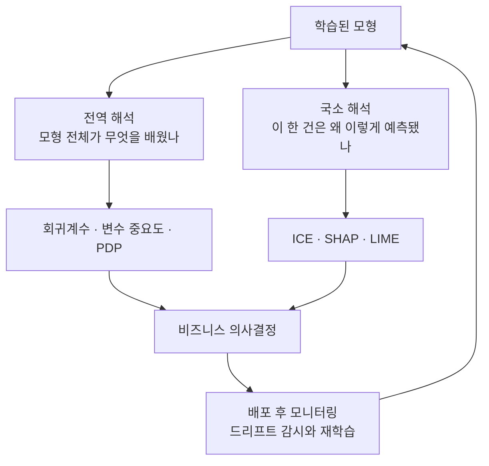
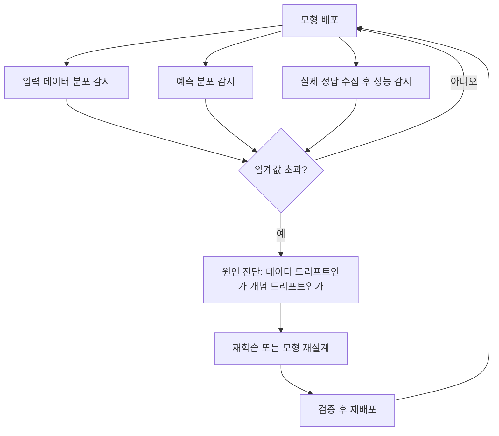

<Callout type="info">
  **이번 문서의 목표:** 회귀계수와 로지스틱 회귀의 오즈비를 직접 계산해 말로 해석할 수 있고, 전역 해석과 국소 해석의 도구(변수 중요도·PDP·SHAP·LIME)를 구분해 쓸 수 있으며, 상관을 인과로 착각하거나 통계적 유의성을 실무적 중요성으로 오해하는 함정을 피해 모형 결과를 실제 의사결정으로 옮길 수 있게 된다.
</Callout>

## 왜 "해석"이 따로 필요한가

21편까지는 모형을 만들고 성능을 재는 이야기였습니다. 그런데 정확도가 아무리 높아도, 회의실에서 다음 질문이 나오면 모형은 멈춰 섭니다.

- "그래서 **왜** 이 고객이 이탈한다는 거죠?"
- "우리가 **무엇을 바꾸면** 이 숫자가 좋아지나요?"

성능 지표는 "얼마나 잘 맞히는가"에만 답합니다. 반면 실무의 의사결정은 "**어떤 변수를 어느 방향으로 건드려야 하는가**"를 요구합니다. 이 간극을 메우는 작업이 모형 해석(model interpretation, 모형 해석)입니다.

> **쉽게 말하면:** 평가는 "이 모형이 쓸 만한가"를 묻고, 해석은 "이 모형이 무엇을 말하고 있는가"를 묻습니다.

빅데이터분석기사 필기 4과목 "분석결과 해석 및 활용"이 통째로 이 주제입니다. 계산이 많지 않은 대신 **말의 정확성**을 묻습니다. 같은 숫자를 두고 어느 문장이 옳고 어느 문장이 과장인지 고르는 문제가 대부분이라, 해석 문장의 어미 하나까지 신경 써서 익혀야 합니다.

## 1. 선형회귀 계수 해석

### 계수는 무엇을 뜻하는가

선형회귀(linear regression, 선형 회귀) 모형은 다음과 같은 모양입니다.

$$
\hat{y} = \beta_0 + \beta_1 x_1 + \beta_2 x_2
$$

- $\hat{y}$ (와이 햇): 모형이 예측한 값
- $\beta_0$ (베타 제로, 절편, intercept): 모든 설명변수가 0일 때의 예측값
- $\beta_1, \beta_2$ (베타 원, 베타 투, 회귀계수, regression coefficient): 각 설명변수가 예측값에 미치는 영향의 크기와 방향
- $x_1, x_2$ (엑스 원, 엑스 투): 설명변수(독립변수)

계수 해석의 표준 문장은 반드시 이 형태로 외웁니다.

> "**다른 변수가 모두 같을 때, 해당 변수가 1단위 증가하면 y는 평균적으로 베타만큼 변한다**"

이 문장에는 세 개의 안전장치가 들어 있습니다. 하나라도 빠지면 틀린 해석이 됩니다.

| 안전장치 | 왜 필요한가 | 빠뜨리면 |
|---------|-----------|---------|
| 다른 변수가 모두 같을 때 | 다중회귀 계수는 나머지 변수를 고정한 상태의 순수 효과이기 때문 | 다른 변수의 영향까지 이 변수 탓으로 돌리게 됨 |
| 1단위 증가하면 | 계수의 크기는 변수의 측정 단위에 묶여 있기 때문 | 단위가 다른 변수끼리 크기를 비교하게 됨 |
| 평균적으로 변한다 | 회귀는 조건부 평균을 추정하기 때문 | 개별 건에서 반드시 그렇게 된다고 단정하게 됨 |

### 작은 예시와 해석

한 카페 체인이 매장별 하루 매출(만원)을 예측하는 모형을 만들었습니다.

$$
\hat{y} = 50 + 0.8 x_1 - 12 x_2
$$

- $x_1$: 하루 유동인구(명)
- $x_2$: 반경 300미터 이내 경쟁 매장 수(개)

해석은 이렇습니다.

- 경쟁 매장 수가 같을 때, 유동인구가 1명 늘면 하루 매출은 평균 **0.8만원 증가**합니다.
- 유동인구가 같을 때, 경쟁 매장이 1개 늘면 하루 매출은 평균 **12만원 감소**합니다.
- 절편 50은 "유동인구 0명, 경쟁 매장 0개인 매장의 매출"인데, 현실에 그런 매장이 없다면 **해석하지 않는 것이 맞습니다.** 절편은 계산상의 기준점일 뿐인 경우가 많습니다.

**자주 틀리는 점.** "경쟁 매장을 없애면 매출이 12만원 오른다"는 인과(causation, 인과) 주장입니다. 회귀계수는 관측 자료에서 나온 **연관**(association, 연관)일 뿐이므로, 실험이나 추가 근거 없이 이렇게 말하면 안 됩니다. 이 구분은 5절에서 다시 다룹니다.

## 2. 로지스틱 회귀와 오즈비 — 손계산

### 왜 오즈를 쓰는가

로지스틱 회귀(logistic regression, 로지스틱 회귀)는 "이탈할까 말까"처럼 **두 범주 중 하나**를 맞히는 모형입니다(18편 참고). 확률은 0에서 1 사이에 갇혀 있어서 직선으로 표현하기 어렵습니다. 그래서 확률을 **오즈**(odds, 승산)로 바꾼 뒤 로그를 씌워 직선을 만듭니다.

> **쉽게 말하면:** 오즈는 "일어날 확률 나누기 일어나지 않을 확률", 즉 도박에서 말하는 배당 비율입니다.

$$
\text{오즈} = \frac{p}{1-p}
$$

- $p$ (피): 사건이 일어날 확률
- $1-p$: 일어나지 않을 확률

확률 0.75라면 오즈는 $0.75 / 0.25 = 3$, 즉 "일어날 가능성이 안 일어날 가능성의 3배"입니다.

로지스틱 회귀 모형은 이 오즈에 로그를 씌운 값을 직선으로 놓습니다.

$$
\ln\left(\frac{p}{1-p}\right) = \beta_0 + \beta_1 x_1
$$

- $\ln$ (엘엔, 자연로그): 밑이 $e$(약 2.71828)인 로그
- 좌변 전체를 **로그오즈**(log odds) 또는 로짓(logit)이라고 부릅니다

계수 $\beta_1$은 "x가 1단위 늘 때 **로그오즈**가 얼마나 변하는가"입니다. 그런데 로그오즈는 사람이 감을 잡기 어렵습니다. 그래서 지수(exponential, 익스포넨셜)를 씌워 원래 오즈의 배율로 되돌립니다. 이것이 **오즈비**(odds ratio, 승산비)입니다.

$$
\text{오즈비} = e^{\beta_1}
$$

### 손계산 — 계수 –0.70의 해석

고객 이탈(1이면 이탈)을 예측하는 로지스틱 회귀에서, "정기상담 이용"(1이면 이용) 변수의 계수가 **–0.70**이고 p값이 0.012로 나왔다고 합시다.

먼저 오즈비를 구합니다.

$$
\text{오즈비} = e^{-0.70}
$$

지수를 손으로 풀어 봅니다. 음수 지수는 역수로 바꿔 계산하면 편합니다.

$$
e^{-0.70} = \frac{1}{e^{0.70}}
$$

$e^{0.70}$의 값을 구합니다. $e^{0.7} \approx 2.0138$입니다.

$$
\frac{1}{2.0138} \approx 0.4966
$$

$$
\text{오즈비} \approx 0.497
$$

오즈가 몇 퍼센트 줄었는지도 계산합니다.

$$
1 - 0.497 = 0.503
$$

$$
0.503 \times 100 = 50.3
$$

**해석.** 다른 변수가 모두 같을 때, 정기상담을 이용한 고객은 이용하지 않은 고객에 비해 **이탈 오즈가 약 0.497배**, 즉 약 50.3퍼센트 낮습니다. p값 0.012는 유의수준 0.05보다 작으므로 이 음의 연관은 통계적으로 유의합니다.

**해석 문장 정답과 오답 비교표.** 시험은 정확히 이 지점을 함정으로 씁니다.

| 문장 | 판정 | 이유 |
|------|------|------|
| 다른 변수가 같을 때 상담 이용은 이탈 로그오즈의 유의한 감소와 연관된다 | 옳음 | 계수 부호와 유의성을 모두 정확히 서술 |
| 상담 이용은 이탈 확률을 정확히 70퍼센트포인트 낮춘다 | 틀림 | 계수는 로그오즈 변화량이지 확률 변화량이 아님 |
| p값이 0.05보다 작으므로 계수 방향은 알 수 없다 | 틀림 | p값은 유의성만 판정하며 방향은 계수 부호가 알려 줌 |
| 계수가 음수이므로 유의성과 무관하게 효과가 확정된다 | 틀림 | 유의하지 않으면 우연일 가능성을 배제할 수 없음 |

### 계수의 부호와 오즈비의 방향

| 계수 $\beta$ | 오즈비 $e^{\beta}$ | 의미 |
|-------------|-------------------|------|
| 양수 | 1보다 큼 | 해당 변수가 커질수록 사건 발생 오즈가 증가 |
| 0 | 정확히 1 | 아무 연관이 없음 |
| 음수 | 0과 1 사이 | 해당 변수가 커질수록 사건 발생 오즈가 감소 |

계수 +0.40인 변수도 계산해 봅시다.

$$
e^{0.40} \approx 1.4918
$$

$$
1.4918 - 1 = 0.4918
$$

즉 오즈가 약 **49.2퍼센트**(49.2%) 증가한다고 읽습니다.

**자주 틀리는 점.** 오즈비 1.5를 "확률이 1.5배"로 읽으면 틀립니다. **오즈**가 1.5배입니다. 확률이 이미 높은 구간에서는 오즈비가 커도 확률 증가폭이 작을 수 있습니다.

## 3. 표준화 계수와 원단위 계수

### 왜 원단위 계수로는 중요도를 비교할 수 없는가

앞의 카페 모형에서 유동인구 계수는 0.8, 경쟁 매장 계수는 –12였습니다. 그러면 경쟁 매장이 15배 더 중요할까요? **아닙니다.** 유동인구는 "명" 단위로 수천까지 움직이지만, 경쟁 매장 수는 0에서 5 정도밖에 움직이지 않습니다. **단위가 다르면 계수 크기 비교는 무의미합니다.**

> **쉽게 말하면:** 계수 크기 비교는 "1미터와 1킬로그램 중 뭐가 더 크냐"를 묻는 것과 같습니다. 자를 통일해야 비교할 수 있습니다.

### 표준화 계수

**표준화 계수**(standardized coefficient, 표준화 회귀계수)는 모든 변수를 평균 0, 표준편차 1로 바꾼 뒤(12편의 표준화 참고) 구한 계수입니다. 실무에서는 다음 근사식으로도 감을 잡습니다.

$$
\beta_{\text{표준화}} \approx \beta \times s_x
$$

- $\beta$ (베타): 원단위 계수
- $s_x$ (에스 엑스): 해당 설명변수의 표준편차

**손계산.** 유동인구의 표준편차가 300명, 경쟁 매장 수의 표준편차가 1.2개라고 합시다.

$$
0.8 \times 300 = 240
$$

$$
12 \times 1.2 = 14.4
$$

**해석.** 표준편차 한 칸만큼 움직였을 때의 영향은 유동인구가 240만원, 경쟁 매장이 14.4만원입니다. 원단위 계수만 보면 경쟁 매장이 압도적으로 커 보였지만, **실제로 변수가 움직이는 폭까지 감안하면 유동인구가 훨씬 큰 영향력**을 가집니다.

| 구분 | 원단위 계수 | 표준화 계수 |
|------|-----------|-----------|
| 읽는 법 | 1단위 증가 시 y의 변화량 | 표준편차 1만큼 증가 시 y의 표준편차 변화 |
| 강점 | 실무 단위 그대로 말할 수 있음 | 변수들 사이의 상대적 영향력 비교 가능 |
| 약점 | 단위가 다르면 크기 비교 불가 | 실무자에게 그대로 보고하기 어려움 |

**자주 틀리는 점.** 표준화 계수도 **인과의 크기**가 아니라 연관의 크기입니다. 또 변수들 사이에 상관이 높으면(다중공선성, 16편 참고) 표준화 계수마저 불안정해집니다.

## 4. 변수 중요도와 그 한계

### 나무 기반 변수 중요도

의사결정나무(decision tree, 의사결정나무)와 랜덤포레스트(random forest, 랜덤 포레스트) 같은 나무 계열 모형은 계수가 없습니다. 대신 **변수 중요도**(feature importance, 변수 중요도)를 제공합니다.

> **쉽게 말하면:** "이 변수로 데이터를 쪼갰을 때 불순도가 얼마나 많이 줄었는지"를 나무 전체에서 합산한 값입니다.

지니지수(Gini index)나 엔트로피(entropy)가 얼마나 감소했는지를 그 변수가 쓰인 모든 분할에서 더해 정규화합니다. 값이 클수록 모형이 그 변수를 많이 활용했다는 뜻입니다.

### 한계 네 가지 — 시험 단골

| 한계 | 내용 |
|------|------|
| 방향을 모른다 | 중요도는 크기만 알려 줄 뿐 "늘면 좋다 나쁘다"의 방향이 없다 |
| 카디널리티 편향 | 고유값이 많은 변수(주민번호, 고객ID 등)가 분할 기회가 많아 부당하게 높게 나온다 |
| 상관 변수 분산 | 서로 상관이 높은 변수 둘이 있으면 중요도가 갈라져 둘 다 낮게 보인다 |
| 인과가 아니다 | 모형이 많이 쓴 변수일 뿐, 그 변수를 바꾸면 결과가 바뀐다는 보장이 없다 |

**카디널리티**(cardinality, 고유값의 개수) 편향은 특히 함정으로 자주 나옵니다. 고객ID처럼 값이 전부 다른 변수를 넣으면 나무가 그것만으로 데이터를 잘게 쪼갤 수 있어 중요도 1위를 차지하지만, 실제로는 아무 의미 없는 과적합의 증거일 뿐입니다.

이 한계를 줄이려고 **순열 중요도**(permutation importance, 순열 중요도)를 씁니다. 한 변수의 값만 무작위로 섞어 놓고 성능이 얼마나 나빠지는지를 재는 방식입니다. 성능 하락이 클수록 그 변수가 실제로 예측에 필요했다는 뜻입니다.

## 5. 전역 해석과 국소 해석

### 두 질문은 다르다

- **전역 해석**(global interpretation, 전역 해석): "이 모형은 전반적으로 무엇을 배웠는가"
- **국소 해석**(local interpretation, 국소 해석): "**이 한 명의 고객**이 왜 이탈로 예측되었는가"

> **비유:** 전역 해석은 학교 전체의 성적 경향을 분석하는 일이고, 국소 해석은 특정 학생 한 명의 성적표에 대해 "네가 이 점수를 받은 이유는 이 과목 때문"이라고 설명하는 일입니다.

| 구분 | 전역 해석 | 국소 해석 |
|------|----------|----------|
| 묻는 질문 | 모형 전체의 경향 | 개별 예측 한 건의 근거 |
| 대표 도구 | 회귀계수, 변수 중요도, PDP | ICE, SHAP, LIME |
| 쓰이는 자리 | 정책 수립, 변수 설계 재검토 | 고객 응대, 대출 거절 사유 고지, 이상 건 검토 |
| 한계 | 개별 예외를 설명하지 못함 | 개별 건만 설명하므로 전체 정책 근거로 쓰면 위험 |

### 네 가지 해석 도구 비교

| 도구 | 풀이 | 전역/국소 | 무엇을 보여 주나 |
|------|------|----------|----------------|
| PDP | Partial Dependence Plot, 부분의존도 그래프 | 전역 | 한 변수를 바꿔 갈 때 예측값의 평균이 어떻게 움직이는지 |
| ICE | Individual Conditional Expectation, 개별조건부기대 | 국소에 가까움 | 관측치 하나하나의 곡선을 각각 그림. PDP는 이 곡선들의 평균 |
| SHAP | SHapley Additive exPlanations, 섀플리 가법 설명 | 둘 다 | 예측값을 각 변수의 기여도로 정확히 쪼갬. 게임이론의 공정 배분 개념 사용 |
| LIME | Local Interpretable Model-agnostic Explanations | 국소 | 관심 있는 한 건의 주변에 단순 모형을 국소적으로 근사해 설명 |

**PDP를 직관으로.** 나이가 이탈에 미치는 영향을 보고 싶다면, 모든 고객의 나이를 강제로 20으로 바꿔 예측한 값을 평균 내고, 다시 21로 바꿔 평균 내고, 이 과정을 반복해 곡선을 그립니다. 그래서 PDP는 **전체의 평균 경향**을 보여 줍니다. 문제는 절반은 오르고 절반은 내리는 경우 평균이 평평해져 "영향 없음"으로 보인다는 점입니다. 이 위험을 잡아 주는 것이 개별 곡선을 다 그리는 ICE입니다.

**SHAP를 직관으로.** 팀 프로젝트에서 성과를 팀원별로 공정하게 나누는 문제를 떠올리세요. 어떤 팀원이 있고 없을 때 성과가 얼마나 달라지는지를 모든 조합에서 따져 평균 기여도를 매기는 방식이 섀플리 값입니다. SHAP은 이 아이디어를 변수에 적용해 "기준 예측값에서 출발해 각 변수가 얼마씩 더하고 빼서 이 예측이 나왔다"를 보여 줍니다.

**LIME을 직관으로.** 복잡한 곡면도 아주 좁은 범위에서는 평면처럼 보입니다. 설명하고 싶은 데이터 한 건 주변에서만 값을 조금씩 흔들어 예측을 모으고, 그 좁은 구역에 단순 선형모형을 맞춰 설명합니다. 그래서 이름에 **국소**(Local)가 들어갑니다.

**자주 틀리는 점.** 이 도구들은 모두 **모형이 무엇을 근거로 삼았는지**를 설명할 뿐, **현실의 인과관계**를 증명하지 않습니다. SHAP 기여도가 크다고 해서 그 변수를 조작하면 결과가 바뀐다고 말할 수 없습니다.

## 6. 상관과 인과 — 해석의 가장 큰 함정

### 상관은 인과가 아니다

여름이면 아이스크림 판매량과 물놀이 사고 건수가 함께 오릅니다. 상관계수를 재면 0.8이 넘게 나옵니다. 그렇다고 아이스크림을 금지하면 사고가 줄어들까요? 당연히 아닙니다. 두 변수를 동시에 밀어 올린 제3의 변수, **기온**이 있기 때문입니다.

> **쉽게 말하면:** 두 숫자가 나란히 움직인다고 해서 한쪽이 다른 쪽을 만든 것은 아닙니다.

이렇게 원인과 결과 양쪽에 동시에 영향을 주어 관계를 왜곡하는 제3의 변수를 **교란변수**(confounding variable, 혼란변수)라고 부릅니다. 교란변수를 모형에 넣지 않으면 계수는 그 변수의 영향까지 뒤집어씁니다.

| 관계 유형 | 설명 | 예시 |
|----------|------|------|
| 인과 | 한쪽이 실제로 다른 쪽을 만든다 | 흡연량 증가가 폐질환 위험을 높인다 |
| 교란 | 제3의 변수가 둘을 동시에 움직인다 | 기온이 아이스크림 판매와 물놀이 사고를 함께 올린다 |
| 역인과 | 원인과 결과의 방향이 반대다 | 병원 방문 횟수가 많아 건강이 나쁜 게 아니라, 건강이 나빠서 자주 간다 |
| 우연 | 표본이 작거나 다중비교로 생긴 허위 상관 | 무의미한 두 시계열이 우연히 함께 움직임 |

인과를 주장하려면 관측 자료만으로는 부족하고 **무작위 통제 실험**(randomized controlled trial), 즉 A/B 테스트 같은 설계가 필요합니다(24편 참고).

### 심슨의 역설 — 숫자로 확인

**심슨의 역설**(Simpson's paradox, 심슨의 역설)은 집단을 나눠 보면 A가 우세한데, 합쳐서 보면 B가 우세해지는 현상입니다. 숫자로 직접 확인합시다.

두 병원의 수술 생존율입니다.

| 구분 | 병원 A 생존/전체 | 병원 A 생존율 | 병원 B 생존/전체 | 병원 B 생존율 |
|------|----------------|-------------|----------------|-------------|
| 경증 환자 | 99 / 100 | 99퍼센트 | 855 / 900 | 95퍼센트 |
| 중증 환자 | 540 / 900 | 60퍼센트 | 50 / 100 | 50퍼센트 |

**부분별로는 병원 A가 두 집단 모두에서 앞섭니다.** 경증에서 99 대 95, 중증에서 60 대 50입니다.

이제 전체를 합산합니다. 병원 A의 생존자는

$$
99 + 540 = 639
$$

$$
\frac{639}{1000} = 0.639
$$

병원 B의 생존자는

$$
855 + 50 = 905
$$

$$
\frac{905}{1000} = 0.905
$$

**전체로 보면 병원 A가 63.9퍼센트, 병원 B가 90.5퍼센트로 순위가 완전히 뒤집힙니다.** 원인은 병원 A가 중증 환자를 900명이나 받았기 때문입니다. 여기서 환자의 중증도가 바로 교란변수입니다.

**시험 포인트.** "집계 수준을 바꾸면 결론이 뒤집힐 수 있으므로, 층별(하위 집단별) 분석을 반드시 확인해야 한다"가 정답 문장의 형태입니다.

## 7. 통계적 유의성과 실무적 중요성

### 두 개념은 완전히 다르다

- **통계적 유의성**(statistical significance, 통계적 유의성): 관측된 차이가 우연으로 보기 어려운가. p값으로 판정합니다(15편 참고)
- **실무적 중요성**(practical significance, 실무적 중요성): 그 차이가 실제로 의미 있을 만큼 큰가. 효과의 크기로 판정합니다

> **쉽게 말하면:** p값은 "이 차이가 진짜인가"를 묻고, 효과크기는 "이 차이가 신경 쓸 만큼 큰가"를 묻습니다.

### 숫자로 확인

버튼 색을 바꾼 A/B 테스트에서 표본이 각 집단 100만 명이었고, 클릭률이 이렇게 나왔습니다.

| 집단 | 클릭률 |
|------|--------|
| 기존 파란 버튼 | 5.00퍼센트 |
| 새 초록 버튼 | 5.02퍼센트 |

차이를 계산합니다.

$$
5.02 - 5.00 = 0.02
$$

표본이 100만 명씩이면 이 정도 차이도 p값이 0.001 아래로 떨어져 **통계적으로 유의**해집니다. 그런데 실무적으로 보면, 개편 비용과 배포 위험을 감수할 만한 크기일까요? 0.02퍼센트포인트 향상은 대개 그렇지 않습니다.

**반대 방향의 함정도 있습니다.** 표본이 30명뿐이라 p값이 0.09로 나온 경우, 유의하지 않다고 해서 **"효과가 없음이 증명되었다"고 말하면 틀립니다.** 정확한 표현은 "현재 자료로는 효과가 있다고 결론 내릴 근거가 부족하다"입니다.

| 상황 | 통계적 유의성 | 실무적 중요성 | 올바른 결론 |
|------|-------------|-------------|-----------|
| 대규모 표본, 미세한 차이 | 있음 | 없음 | 유의하지만 도입 가치는 낮다 |
| 소규모 표본, 큰 차이 | 없음 | 있을 수 있음 | 표본을 늘려 재검증할 가치가 있다 |
| 대규모 표본, 큰 차이 | 있음 | 있음 | 도입을 적극 검토한다 |
| 소규모 표본, 미세한 차이 | 없음 | 없음 | 우선순위에서 제외한다 |

## 8. 모델 배포 후 모니터링

### 왜 배포가 끝이 아닌가

모형은 **학습 당시의 세상**을 배운 결과물입니다. 세상은 계속 바뀌므로, 아무 손도 대지 않아도 모형 성능은 시간이 지나며 조용히 나빠집니다. 이를 모형 노후화(model decay)라고 부르고, 그 원인을 두 가지 드리프트로 나눕니다.

> **쉽게 말하면:** 지도는 그대로인데 도로가 새로 뚫린 상황입니다. 지도를 다시 그리지 않으면 길을 잃습니다.

| 구분 | 영어 | 무엇이 변했나 | 예시 |
|------|------|-------------|------|
| 데이터 드리프트 | Data drift | 입력 변수의 분포 자체가 변함 | 고객 연령대가 젊어져 입력 분포가 이동 |
| 개념 드리프트 | Concept drift | 입력과 출력의 관계가 변함 | 유행이 바뀌어 같은 특성의 고객이 이제는 이탈하지 않음 |

두 드리프트의 결정적 차이는 **관계(개념)가 변했느냐**입니다. 데이터 드리프트는 입력만 이동했고 규칙은 그대로일 수 있지만, 개념 드리프트는 규칙 자체가 달라졌으므로 반드시 재학습이 필요합니다.

### 모니터링 루프

**재학습 주기**를 정하는 방식은 두 갈래입니다.

- **정기 재학습**: 매월, 매분기처럼 일정에 따라 다시 학습. 단순하고 운영이 쉽지만 급변에 늦게 대응합니다.
- **성능 기반 재학습**: 성능 지표가 미리 정한 임계값 아래로 떨어지면 재학습. 반응이 빠르지만 실제 정답(레이블)이 늦게 도착하는 분야에서는 감지가 지연됩니다.

정답 레이블이 몇 달 뒤에야 확인되는 신용 대출 같은 분야에서는 성능 감시만으로는 늦으므로, **입력 분포 감시를 선행 경보로** 함께 씁니다.

## 9. 해석 결과를 의사결정으로 옮길 때의 함정

모형이 옳아도 옮기는 과정에서 틀리는 일이 잦습니다. 실제 실패를 유형화하면 다음과 같습니다.

| 함정 | 내용 | 예방 |
|------|------|------|
| 연관을 인과로 옮김 | "이 변수가 중요하다"를 "이 변수를 바꾸면 결과가 바뀐다"로 확대 | 실험으로 검증한 뒤 정책화 |
| 예측을 처방으로 혼동 | 이탈 예측 모형이 이탈을 막는 방법까지 알려 준다고 착각 | 예측과 처방을 분리해 설계 |
| 국소 설명의 과잉 일반화 | 고객 한 명의 SHAP 결과를 전체 정책 근거로 사용 | 전역 해석으로 교차 확인 |
| 훈련 분포 밖 외삽 | 학습 데이터에 없던 구간까지 예측을 그대로 신뢰 | 적용 범위를 명시하고 벗어나면 경고 |
| 피드백 루프 | 모형 결과가 다시 데이터를 만들어 편향을 강화 | 무작위 노출 구간을 남겨 두고 감시 |
| 지표의 대리 오류 | 진짜 목표 대신 측정하기 쉬운 대리 지표만 최적화 | 목표 지표와 대리 지표의 괴리를 정기 점검 |

### 보고서와 대시보드로 전달할 때

해석은 결국 사람에게 전달되어야 합니다. 전달 단계에서 지켜야 할 원칙은 이렇습니다(자세한 시각화 원칙은 23편 참고).

- **불확실성을 함께 보고합니다.** 점 추정치만 크게 띄우지 말고 신뢰구간이나 예측 오차 범위를 함께 제시합니다.
- **대상에 맞춰 깊이를 조절합니다.** 경영진에게는 의사결정과 직결된 결론과 기대효과를, 실무자에게는 변수 정의와 적용 조건을 함께 줍니다.
- **가정과 한계를 명시합니다.** 학습 기간, 제외한 데이터, 적용 가능한 고객 범위를 빠뜨리면 나중에 오용됩니다.
- **인과가 아닌 것을 인과처럼 쓰지 않습니다.** "관련이 있다"와 "때문이다"를 문장 단위로 구분해 씁니다.
- **축 조작이나 선택적 구간 제시로 인상을 과장하지 않습니다.** 시각화는 자동으로 객관적이지 않습니다.

## 10. 시험에서 어떻게 물어보나

**유형 ① 계수 해석 문장 고르기.** 회귀나 로지스틱 회귀의 계수와 p값을 주고 옳은 해석을 고르게 합니다. 함정은 세 가지입니다. 로그오즈 변화량을 **확률 변화량**으로 바꿔 놓기, "다른 변수가 같을 때"라는 단서를 뺀 문장, p값이 유의한데도 "방향을 알 수 없다"고 하는 문장입니다. 계수 부호는 방향, p값은 유의성이라는 역할 분담을 기억하면 대부분 걸러집니다.

**유형 ② 오즈비 계산과 해석.** 계수를 주고 오즈비를 고르게 하거나, 분할표를 주고 오즈비를 계산시킵니다. 분할표형은 "각 집단의 오즈를 먼저 구하고 나눈다"가 절차입니다. 예를 들어 한 집단이 90 대 60이면 오즈는 1.5, 다른 집단이 50 대 150이면 오즈는 3분의 1이므로 오즈비는 4.5입니다. 오즈와 확률을 뒤바꾼 보기가 함정입니다.

**유형 ③ 해석 도구 매칭.** "개별 예측 한 건의 근거를 설명하는 기법은", "한 변수를 바꿔 갈 때 예측의 평균 변화를 보여 주는 그래프는" 같은 형태입니다. 전역인지 국소인지만 정확히 구분하면 대부분 풀립니다. PDP는 전역·평균, ICE는 개별 곡선, LIME은 국소 근사, SHAP은 기여도 분해로 외웁니다.

**유형 ④ 상관·인과와 유의성 함정.** 상관계수가 높다는 사실만으로 인과를 주장하는 보기, 심슨의 역설 상황을 주고 옳은 결론을 고르는 문제, 대규모 표본에서 미세한 차이가 유의하게 나온 상황의 해석이 반복 출제됩니다. **"유의하다"는 "중요하다"가 아니다**를 문장으로 새겨 두세요.

**유형 ⑤ 배포와 모니터링.** 데이터 드리프트와 개념 드리프트를 구분하게 하거나 재학습 시점을 묻습니다. "입력 분포만 변했나, 입력과 출력의 관계가 변했나"로 판별합니다.

## 핵심 정리

- 선형회귀 계수는 "다른 변수가 같을 때 1단위 증가하면 y가 평균적으로 계수만큼 변한다"로 읽고, 로지스틱 회귀 계수는 로그오즈 변화량이므로 지수를 씌워 오즈비로 바꿔 읽는다. 계수 –0.70이면 오즈비는 약 0.497로 오즈가 약 50.3퍼센트 감소한다.
- 단위가 다른 변수끼리는 원단위 계수 크기를 비교할 수 없다. 상대적 영향력 비교는 표준화 계수로 하고, 나무 기반 변수 중요도는 방향이 없고 카디널리티가 높은 변수에 편향되며 상관 변수 사이에서 중요도가 갈린다는 한계를 함께 기억한다.
- 전역 해석(회귀계수·변수 중요도·PDP)은 모형 전체의 경향을, 국소 해석(ICE·SHAP·LIME)은 개별 예측 한 건의 근거를 설명하며, 어느 쪽도 현실의 인과를 증명하지 않는다.
- 상관은 인과가 아니며 교란변수와 심슨의 역설이 결론을 뒤집을 수 있다. 통계적 유의성은 효과의 존재 여부만 말하므로 효과크기로 실무적 중요성을 따로 판단해야 한다.
- 배포는 끝이 아니라 시작이다. 입력 분포가 변하는 데이터 드리프트와 입력·출력 관계가 변하는 개념 드리프트를 감시해 정기 또는 성능 기반으로 재학습하고, 해석을 의사결정으로 옮길 때는 불확실성과 적용 범위를 함께 전달한다.

## 마무리 복습

<Quiz
  questionNumber={1}
  question="이탈 여부(1은 이탈)를 예측하는 로지스틱 회귀에서 정기상담 이용 변수의 계수가 -0.70이고 p값이 0.012였다. 유의수준 0.05에서 가장 적절한 해석은?"
  options={['다른 변수가 같을 때 상담 이용은 이탈 로그오즈의 유의한 감소와 관련된다', '상담 이용은 이탈 확률을 정확히 70퍼센트포인트 낮춘다', 'p값이 0.05보다 작으므로 계수의 방향은 알 수 없다', '계수가 음수이므로 통계적 유의성과 무관하게 효과가 확정된다']}
  correctAnswer={1}
  explanation="음의 계수는 로그오즈가 감소하는 방향을 뜻하고 p값 0.012는 0.05보다 작아 유의하므로, 다른 변수를 고정한 상태의 유의한 음의 연관으로 해석한다. 계수는 확률 변화량이 아니라 로그오즈 변화량이며 방향은 계수 부호가 알려 준다."
  optionExplanations={['방향은 계수 부호로, 유의성은 p값으로 판정한 정확한 해석이므로 정답이다.', '계수는 로그오즈 변화량이므로 확률을 70퍼센트포인트 낮춘다는 서술은 틀렸다.', 'p값은 유의성만 판정하며 방향은 계수 부호가 이미 알려 주므로 틀렸다.', '유의성 판단 없이 효과를 확정할 수 없으므로 틀렸다.']}
/>

<Quiz
  questionNumber={2}
  question="로지스틱 회귀 계수가 -0.70일 때 오즈비로 가장 가까운 값과 그 해석으로 옳은 것은?"
  options={['약 0.497이며 오즈가 약 50퍼센트 감소한다', '약 2.014이며 오즈가 약 2배 증가한다', '약 -0.70이며 오즈가 0.7만큼 감소한다', '약 0.30이며 오즈가 70퍼센트 감소한다']}
  correctAnswer={1}
  explanation="오즈비는 계수에 지수를 씌운 값이므로 e의 -0.70제곱이며, 이는 e의 0.70제곱인 약 2.0138의 역수로 약 0.497이다. 1에서 0.497을 빼면 0.503이므로 오즈가 약 50퍼센트 감소한다. 2.014는 부호를 반대로 계산한 값이다."
  optionExplanations={['e의 -0.70제곱이 약 0.497이고 오즈 감소율이 약 50퍼센트이므로 정답이다.', '2.014는 지수의 부호를 양수로 잘못 쓴 값이다.', '계수 자체는 오즈비가 아니라 로그오즈 변화량이다.', '0.30은 계수를 1에서 빼는 식으로 잘못 계산한 값이다.']}
/>

<Quiz
  questionNumber={3}
  question="다중회귀에서 유동인구 계수가 0.8이고 경쟁매장수 계수가 -12일 때, 두 변수의 상대적 영향력을 비교하는 방법으로 가장 적절한 것은?"
  options={['계수의 절댓값이 큰 경쟁매장수가 항상 더 중요하다고 본다', '각 변수의 표준편차를 곱한 표준화 계수로 비교한다', '계수의 부호만 보고 음수인 변수를 더 중요하게 본다', 'p값이 더 작은 변수가 언제나 영향력도 더 크다고 본다']}
  correctAnswer={2}
  explanation="원단위 계수의 크기는 변수의 측정 단위에 좌우되므로 단위가 다른 변수끼리 직접 비교할 수 없다. 각 변수의 표준편차를 반영한 표준화 계수로 바꿔야 상대적 영향력을 비교할 수 있다. p값은 유의성 지표이지 영향력 크기 지표가 아니다."
  optionExplanations={['단위가 다르면 계수 크기 비교가 무의미하므로 틀렸다.', '표준편차를 반영해 자를 통일하는 방법이므로 정답이다.', '부호는 방향을 나타낼 뿐 중요도와 무관하다.', 'p값은 유의성만 나타내며 효과의 크기를 뜻하지 않는다.']}
/>

<Quiz
  questionNumber={4}
  question="나무 기반 모형의 변수 중요도에 대한 설명으로 옳지 않은 것은?"
  options={['불순도 감소량을 합산해 계산하므로 모형이 얼마나 그 변수를 활용했는지를 나타낸다', '고유값이 매우 많은 식별자 성격의 변수가 부당하게 높게 나올 수 있다', '서로 상관이 높은 변수들 사이에서는 중요도가 나뉘어 낮게 보일 수 있다', '중요도가 높은 변수는 그 값을 조작하면 결과가 반드시 바뀌는 인과 요인이다']}
  correctAnswer={4}
  explanation="변수 중요도는 모형이 예측에 얼마나 활용했는지를 나타낼 뿐 인과를 보장하지 않는다. 카디널리티 편향과 상관 변수 사이의 중요도 분산은 실제로 존재하는 한계이며, 불순도 감소 합산이라는 계산 방식도 옳은 설명이다."
  optionExplanations={['불순도 감소 합산은 나무 기반 중요도의 정확한 계산 방식이다.', '고유값이 많은 변수의 편향은 잘 알려진 한계이므로 옳다.', '상관 변수 사이의 중요도 분산도 실제 한계이므로 옳다.', '중요도는 인과를 보장하지 않으므로 이 설명이 틀렸다.']}
/>

<Quiz
  questionNumber={5}
  question="개별 예측 한 건이 왜 그렇게 나왔는지를 설명하기 위해 그 데이터 주변에 단순한 대리 모형을 국소적으로 맞추어 근거를 제시하는 기법은?"
  options={['부분의존도 그래프(PDP)', '순열 중요도', 'LIME', '결정계수']}
  correctAnswer={3}
  explanation="LIME은 설명 대상 관측치 주변에서만 값을 흔들어 단순 모형을 국소 근사하는 국소 해석 기법이다. PDP는 전체 평균 경향을 보여 주는 전역 도구이고 순열 중요도는 전역 변수 중요도이며 결정계수는 회귀 설명력 지표다."
  optionExplanations={['PDP는 전체 평균 경향을 보여 주는 전역 해석 도구다.', '순열 중요도는 변수 전체의 중요도를 재는 전역 도구다.', '주변을 국소 근사해 개별 예측을 설명하므로 정답이다.', '결정계수는 해석 도구가 아니라 회귀 설명력 지표다.']}
/>

<Quiz
  questionNumber={6}
  question="병원 A는 경증 100명 중 99명, 중증 900명 중 540명이 생존했고 병원 B는 경증 900명 중 855명, 중증 100명 중 50명이 생존했다. 이 자료에 대한 해석으로 가장 적절한 것은?"
  options={['전체 생존율이 높은 병원 B가 두 환자군 모두에서 더 우수하다', '집단별로는 병원 A가 우세하지만 전체에서는 뒤집히는 심슨의 역설이다', '두 병원의 생존율 차이는 표본 크기와 무관하게 항상 동일하게 유지된다', '중증도는 생존율과 아무 관련이 없는 변수이므로 무시해도 된다']}
  correctAnswer={2}
  explanation="경증에서 99퍼센트 대 95퍼센트, 중증에서 60퍼센트 대 50퍼센트로 병원 A가 모두 앞서지만 전체는 63.9퍼센트 대 90.5퍼센트로 병원 B가 앞선다. 환자 중증도라는 교란변수의 구성비가 다르기 때문이며 이것이 심슨의 역설이다."
  optionExplanations={['병원 B는 두 환자군 각각에서는 병원 A보다 생존율이 낮다.', '집단별 우열과 전체 우열이 뒤집히는 전형적인 심슨의 역설이므로 정답이다.', '집계 수준에 따라 결론이 달라지므로 항상 동일하다는 서술은 틀렸다.', '중증도는 생존율에 크게 영향을 주는 교란변수이므로 무시할 수 없다.']}
/>

<Quiz
  questionNumber={7}
  question="각 집단 100만 명 규모의 A/B 테스트에서 클릭률이 5.00퍼센트와 5.02퍼센트로 나타났고 p값은 0.001 미만이었다. 가장 적절한 결론은?"
  options={['통계적으로 유의하므로 효과 크기와 무관하게 즉시 전면 도입해야 한다', '통계적으로는 유의하지만 효과 크기가 작아 실무적 도입 가치는 별도로 따져야 한다', 'p값이 작으므로 두 집단의 차이가 큰 것이 증명되었다', 'p값이 작다는 것은 인과관계가 성립함을 증명한다']}
  correctAnswer={2}
  explanation="표본이 매우 크면 아주 작은 차이도 통계적으로 유의해진다. 유의성은 차이의 존재를 말할 뿐 크기를 말하지 않으므로, 0.02퍼센트포인트라는 효과 크기와 도입 비용을 함께 따져 실무적 중요성을 판단해야 한다."
  optionExplanations={['효과 크기를 무시한 도입 결정은 비용 대비 효과를 놓치게 된다.', '유의성과 실무적 중요성을 분리해 판단하는 것이 옳으므로 정답이다.', 'p값이 작다는 것은 차이가 크다는 뜻이 아니라 우연으로 보기 어렵다는 뜻이다.', 'p값은 인과를 증명하지 않으며 인과 주장에는 실험 설계가 필요하다.']}
/>

<Quiz
  questionNumber={8}
  question="배포된 모형의 입력 변수 분포는 크게 변하지 않았는데, 같은 특성을 가진 고객의 실제 이탈 여부가 예전과 달라져 성능이 떨어졌다. 이 현상에 해당하는 것은?"
  options={['데이터 드리프트', '개념 드리프트', '데이터 누수', '다중공선성']}
  correctAnswer={2}
  explanation="입력 분포가 아니라 입력과 출력 사이의 관계 자체가 변한 것이므로 개념 드리프트다. 데이터 드리프트는 입력 변수의 분포가 이동한 경우이며, 데이터 누수는 평가 정보가 학습에 섞이는 문제, 다중공선성은 설명변수 간 강한 상관 문제로 모두 다른 개념이다."
  optionExplanations={['데이터 드리프트는 입력 변수의 분포가 변한 경우를 가리킨다.', '입력과 출력의 관계가 변했으므로 개념 드리프트가 정답이다.', '데이터 누수는 평가 정보가 학습 과정에 섞여 성능이 부풀려지는 문제다.', '다중공선성은 설명변수들 사이의 강한 상관으로 계수 추정이 불안정해지는 문제다.']}
/>

## 참고 자료

- [한국데이터산업진흥원 - 빅데이터분석기사 자격시험 안내](https://www.dataq.or.kr/www/sub/a_07.do)
- [SQLDpass - 빅데이터분석기사 필기 기출·복원](https://www.sqldpass.com/past-exams?cert=BIGDATA_ANALYST)
- [Statistics Playbook - 빅데이터분석기사 완전 가이드](https://statisticsplaybook.com/big-data-analysis-engineer-guide/)
- [Inflearn 가이드 - 빅데이터분석기사 어떻게 준비해야 할까?](https://www.inflearn.com/pages/bigdata-analysis-engineer-guide)
