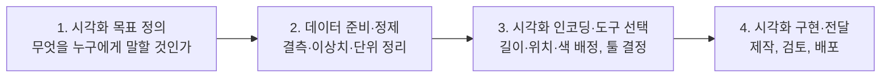
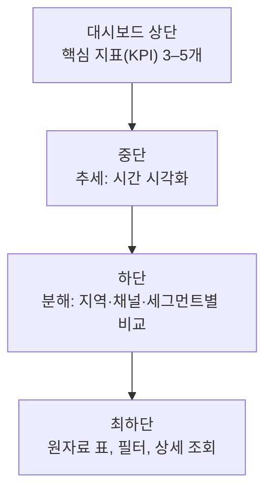

<Callout type="info">
  **이번 문서의 목표:** 이 파일을 다 읽으면 "이 데이터에는 어떤 차트를 써야 하는가"를 시간·분포·관계·비교·공간 다섯 갈래로 즉시 판단하고, 축 절단이나 면적 왜곡 같은 시각적 속임수를 숫자로 계산해 반박하며, 경영진용 보고와 실무자용 보고를 다르게 설계할 수 있게 됩니다.
</Callout>

## 1. 왜 시각화가 시험 과목으로 들어와 있는가

분석은 숫자를 만드는 일이고, 시각화는 그 숫자를 **남의 머릿속으로 옮기는 일**입니다. 모형의 정확도(accuracy)가 아무리 높아도 의사결정자가 그 결과를 이해하지 못하면 프로젝트는 종료됩니다. 그래서 빅데이터분석기사 필기 4과목(빅데이터 결과 해석)은 "분석 모형 평가 및 개선" 다음에 "분석 결과 해석 및 활용"을 두고, 그 안에 시각화를 정식 출제 항목으로 넣어 두었습니다.

> **쉽게 말하면:** 시각화(visualization)는 예쁘게 꾸미는 기술이 아니라, 숫자를 사람의 눈이 즉시 알아보는 형태(길이·위치·색·면적)로 **번역하는 기술**입니다.

번역이라는 비유가 중요합니다. 번역이 잘못되면 원문에 없는 뜻이 생깁니다. 시각화도 마찬가지여서, 같은 데이터로 정반대 인상을 주는 그림을 만들 수 있습니다. 그래서 이 편은 "어떤 차트를 고르는가"와 "어떻게 하면 거짓말하지 않는가"를 한 묶음으로 다룹니다.

모형 계수나 변수 중요도를 **해석하는** 방법 자체는 22편에서 다루었습니다. 여기서는 그렇게 해석된 결과를 **전달하는** 단계에 집중합니다. 히스토그램·박스플롯 같은 탐색 단계의 기본 그래프 읽는 법은 04편과 13편에 있으니, 이 편에서는 그 그래프들이 "어느 분류에 속하고 어떤 자리에서 쓰이는가"를 정리하는 방식으로 이어붙입니다.

## 2. 시각화 절차 — 목표가 먼저, 도구는 나중

기출에서 아주 자주 나오는 순서 문제부터 못 박고 시작합니다. 시각화 프로젝트의 표준 절차는 네 단계입니다.

- **1단계 목표 정의**: "월별 이탈률이 3개월째 오르고 있다는 사실을 경영진에게 알린다"처럼 **한 문장의 메시지**를 먼저 정합니다.
- **2단계 데이터 준비·정제**: 결측치(missing value)를 어떻게 표시할지, 단위를 원으로 할지 백만 원으로 할지, 이상치(outlier)를 뺄지 남길지 정합니다.
- **3단계 인코딩·도구 선택**: **인코딩**(encoding, 부호화)이란 숫자를 어떤 시각 속성에 대응시킬지 정하는 일입니다. 매출을 막대의 **길이**에 대응시킬지, 원의 **면적**에 대응시킬지, 색의 **농도**에 대응시킬지가 모두 인코딩 선택입니다. 도구(Tableau, Power BI, 파이썬 matplotlib 등) 선정은 이 단계에 붙습니다.
- **4단계 구현·전달**: 실제로 그리고, 오독 가능성을 검토하고, 보고서나 대시보드로 내보냅니다.

> **자주 틀리는 점:** 보기에서 "도구 선택"이나 "구현"을 맨 앞에 놓은 순서는 전부 오답입니다. 목적이 정해지지 않은 상태에서 도구부터 고르는 것은, 목적지를 정하지 않고 기차표부터 끊는 것과 같습니다.

## 3. 시각화 다섯 갈래 분류 — 이 표가 기출 단골이다

시험은 "다음 중 비교 시각화에 해당하지 않는 것은?" 같은 방식으로 분류를 직접 묻습니다. 전통적으로 **시간·분포·관계·비교** 네 갈래를 시각화 4대 분류라 부르고, 여기에 지도 위에 얹는 **공간** 시각화를 더해 다섯 갈래로 확장합니다.

| 분류 | 무엇을 보여 주나 | 대표 차트 |
|------|------------------|-----------|
| 시간(Time) 시각화 | 시간 축을 따라 값이 어떻게 변하는가 | 선그래프, 막대그래프, 점(산점) 표현, 누적 영역그래프, 계단식그래프 |
| 분포(Distribution) 시각화 | 값이 어느 구간에 얼마나 몰려 있는가, 전체를 어떻게 나눠 갖는가 | 히스토그램, 박스플롯, 바이올린플롯, 파이차트, 도넛차트, 트리맵, 누적연속그래프 |
| 관계(Relationship) 시각화 | 두 변수 이상이 서로 어떻게 얽혀 있는가 | 산점도, 버블차트, 상관 히트맵(상관행렬 히트맵), 산점도행렬 |
| 비교(Comparison) 시각화 | 여러 대상을 여러 항목에 걸쳐 한눈에 견주면 어떤가 | 히트맵, 레이더차트(방사형차트), 평행좌표그래프, 체르노프페이스, 스타차트(별그래프) |
| 공간(Spatial) 시각화 | 값이 지리적으로 어디에 분포하는가 | 단계구분도(코로플레스), 카토그램, 도트맵, 버블맵, 등치선도 |

각 갈래를 하나씩 뜯어봅니다.

### 3-1. 시간 시각화

시간(time) 시각화는 가로축을 시간으로 두고 값의 흐름을 봅니다.

- **선그래프**(line chart)는 시점별 값을 선으로 이어, 증감의 **방향과 속도**를 읽게 합니다. 연속형 변수의 추세(trend) 파악에 가장 적합합니다.
- **막대그래프**(bar chart)는 시점마다 막대 높이로 값을 세워 **시점 간 크기 비교**를 쉽게 합니다.
- **누적 영역그래프**(stacked area chart)는 구성 항목을 위로 쌓아, **총합의 변화**와 **항목별 비중 변화**를 동시에 보여 줍니다.
- 가로축을 시간으로 둔 **점 표현**(시점별로 점만 찍는 방식)도 엄연한 시간 시각화입니다. 점을 이으면 그대로 선그래프가 됩니다.

> **자주 틀리는 점:** 기출에는 "가로축을 시간으로 둔 점 표현은 흐름을 나타낼 수 없으므로 시간 시각화에 쓸 수 없다"는 보기가 나온 적이 있습니다. **쓸 수 없다는 단정이 오답 표시**입니다. 시각화 문제에서 "반드시", "무조건", "항상", "쓸 수 없다" 같은 절대 표현이 보이면 그 보기를 먼저 의심하세요.

### 3-2. 분포 시각화

분포(distribution) 시각화는 한 변수의 값이 어떻게 퍼져 있는지, 또는 전체가 어떻게 나뉘어 있는지를 봅니다.

- **히스토그램**(histogram)은 값을 구간(bin, 빈)으로 나누고 그 구간의 도수(빈도)를 막대 높이로 세웁니다. 비대칭(왜도)과 봉우리 개수를 보는 데 씁니다.
- **박스플롯**(box plot, 상자그림)은 제1사분위수 $Q_1$ (큐원, 하위 25퍼센트 지점)과 제3사분위수 $Q_3$ (큐쓰리, 상위 25퍼센트 지점)를 양 끝으로 하는 상자와 중앙값 선으로 분포를 요약하고, 사분위범위의 1.5배를 넘는 값을 점으로 따로 찍습니다.
- **바이올린플롯**(violin plot)은 박스플롯에 밀도 곡선을 좌우 대칭으로 붙인 그림입니다. 박스플롯은 봉우리가 두 개인 분포(쌍봉분포)를 감춰 버리지만, 바이올린플롯은 허리가 잘록해지는 모양으로 **봉우리 개수와 비대칭을 한 그림에서** 드러냅니다. 기출에서 "비대칭과 여러 봉우리를 함께 살피기에 가장 적합한 것"을 물으면 답은 바이올린플롯입니다.
- **파이차트**(pie chart, 원그래프)와 **도넛차트**(donut chart)는 전체를 100퍼센트로 두고 부채꼴 각도(면적)로 구성비를 나눕니다. 항목이 대략 5개를 넘어가면 각도 비교가 어려워져 막대그래프가 낫습니다.
- **트리맵**(tree map)은 사각형 면적으로 구성비를 나타내며, 계층 구조(대분류 안의 소분류)를 중첩된 사각형으로 함께 담을 수 있습니다.
- **모자이크플롯**(mosaic plot)은 두 개 이상의 명목형(범주형) 변수의 교차표(contingency table, 분할표)를 사각형 면적으로 시각화합니다. 가로 폭이 한 변수의 비율, 세로 높이가 다른 변수의 조건부 비율에 대응하므로 범주 간 연관을 눈으로 봅니다. 분포와 관계의 성격을 함께 갖고 있어 보기에서 자주 헷갈리게 배치됩니다.

### 3-3. 관계 시각화

관계(relationship) 시각화는 변수와 변수 사이의 얽힘을 봅니다.

- **산점도**(scatter plot)는 두 변수의 순서쌍을 좌표평면에 점으로 찍습니다. 관계 시각화의 기본형입니다.
- **버블차트**(bubble chart)는 산점도에 점의 **크기**로 제3의 변수를 더한 확장형입니다.
- **상관 히트맵**(correlation heatmap, 상관행렬 히트맵)은 모든 변수쌍의 상관계수를 표로 만든 뒤 칸의 색 농도로 값을 나타냅니다. 변수가 20개면 190개의 상관계수를 한 화면에서 훑을 수 있습니다.

> **자주 틀리는 점:** "두 변수 사이의 관계 표현이 주목적이 아닌 것"을 고르는 문제에서 정답은 **단일 변수 히스토그램**입니다. 히스토그램은 변수 하나의 분포를 보는 도구이므로 관계 시각화가 아닙니다.

### 3-4. 비교 시각화

비교(comparison) 시각화는 **여러 대상 × 여러 항목**을 한 화면에서 견줍니다. 학생 5명의 국·영·수·사·과 점수처럼 표가 2차원으로 커질 때 씁니다.

| 기법 | 값을 무엇으로 표현하나 | 한 줄 특징 |
|------|------------------------|------------|
| 히트맵(Heatmap) | 행과 열이 만나는 칸의 **색 농도** | 큰 표를 색 지도로 바꿔 한눈에 훑는다 |
| 레이더차트(Radar chart) | 중심에서 뻗은 축 위, 값의 **크기만큼 떨어진 점** | 점들을 이어 만든 다각형 모양으로 대상을 비교 |
| 스타차트(Star chart, 별그래프) | 레이더차트와 같은 방식의 방사형 표현 | 대상마다 별 모양이 하나씩 생겨 형태를 대조 |
| 평행좌표그래프(Parallel coordinates) | 항목마다 세운 **세로축 위의 위치** | 대상 하나가 선 하나가 되어 여러 축을 가로지른다 |
| 체르노프페이스(Chernoff face) | 눈·코·입 등 **얼굴 부위의 모양·크기** | 사람의 얼굴 인식 능력을 이용해 다변량을 비교 |

> **쉽게 말하면:** 비교 시각화는 "표 하나를 그림 하나로 압축하는" 기법들입니다. 히트맵은 색으로, 레이더차트는 다각형 모양으로, 평행좌표그래프는 선의 기울기 패턴으로, 체르노프페이스는 표정으로 압축합니다.

기출은 이 표의 짝을 **살짝 비틀어** 오답을 만듭니다. 대표적으로 "레이더차트는 각 축 위에 해당 항목의 **개수를 세어** 표시한다"는 보기가 나왔는데, 레이더차트가 축 위에 찍는 것은 개수가 아니라 **값의 크기**이므로 오답입니다. 이런 문제는 각 기법이 "무엇을 무엇으로 바꾸는가"를 한 줄씩 외워 두면 즉시 걸러집니다.

### 3-5. 공간 시각화

공간(spatial) 시각화는 지도를 바탕에 깔고 값을 얹습니다.

| 기법 | 표현 방식 | 대표 용도 |
|------|-----------|-----------|
| 단계구분도(Choropleth map, 코로플레스) | 행정구역을 값의 크기에 따라 **색 농도**로 칠한다 | 지역별 감염률·투표율 등 비율 분포 |
| 카토그램(Cartogram) | 실제 면적 대신 인구수·의석수 비율에 맞춰 **영역의 크기와 모양을 변형** | 인구 대비 왜곡 없는 선거구 표현 |
| 도트맵(Dot map) | 사건 하나마다 **점 하나**를 좌표에 찍는다 | 사건 발생 위치의 밀집도 |
| 버블맵(Bubble map) | 지점 위에 원을 얹어 **원 크기**로 수치를, **색**으로 또 다른 수치를 표현 | 지역별 매출 규모와 이익률을 동시에 |
| 등치선도(Isarithmic map) | 같은 값을 잇는 선으로 면을 나눈다 | 등고선, 등온선 |

기출은 이 다섯 개를 서로 바꿔치기해 묻습니다. "면적 대신 인구 비율로 지도를 변형" → **카토그램**, "지역별 값을 색 농도로" → **단계구분도**, "두 개의 수치형 변수를 지도 위에 동시에" → **버블맵**. 이 세 짝만 확실히 잡아도 공간 시각화 문항은 대부분 처리됩니다.

## 4. 손으로 계산해 보는 시각적 왜곡 — 축 절단

시각화 문제 중 가장 실전적인 것이 **왜곡**(distortion)입니다. 말로만 "축을 자르면 과장된다"고 외우면 보기 앞에서 흔들리므로, 숫자로 한 번 계산해 봅니다.

### 상황

어느 서비스의 2분기 이용자 수와 3분기 이용자 수입니다.

- 2분기: 100만 명
- 3분기: 104만 명

### 1단계 — 실제 증가율 계산

증가율(growth rate)은 증가한 양을 원래 값으로 나눈 비율입니다.

$$
\text{증가율} = \frac{104 - 100}{100}
$$

$$
\text{증가율} = \frac{4}{100} = 0.04
$$

$$
0.04 \times 100 = 4
$$

즉 실제 증가는 **4퍼센트**(4%)입니다.

- 분자 `104 - 100`: 늘어난 양(4만 명)
- 분모 `100`: 비교의 기준이 되는 처음 값(100만 명)

### 2단계 — 세로축을 0부터 시작했을 때의 막대 높이 비

세로축이 0에서 시작하면 막대 높이는 값 그대로입니다.

$$
\frac{104}{100} = 1.04
$$

3분기 막대는 2분기 막대의 **1.04배**입니다. 눈으로 보면 "거의 같네"라는 인상을 줍니다. 실제 증가가 4퍼센트이므로 이 인상이 정확합니다.

### 3단계 — 세로축을 98부터 시작했을 때의 막대 높이 비

이제 누군가 세로축을 98부터 그렸다고 합시다. 막대의 보이는 높이는 값에서 98을 뺀 만큼입니다.

$$
\text{2분기 보이는 높이} = 100 - 98 = 2
$$

$$
\text{3분기 보이는 높이} = 104 - 98 = 6
$$

$$
\frac{6}{2} = 3
$$

### 4단계 — 결과 해석

축을 98에서 자르는 것만으로, 실제로는 1.04배인 차이가 화면에서는 **3배**로 보입니다. 왜곡 배율을 굳이 계산하면 이렇습니다.

$$
\frac{3}{1.04} \approx 2.88
$$

시청자가 받는 인상이 실제보다 약 **2.88배** 부풀려진 셈입니다. 이것이 **축 절단**(axis truncation)이 위험한 이유입니다. 데이터를 하나도 조작하지 않고, 눈금 하나만 바꿔서 "폭발적 성장"이라는 거짓 인상을 만들 수 있습니다.

> **자주 틀리는 점:** 축 절단이 언제나 금지인 것은 아닙니다. 체온이나 주가처럼 값의 범위가 좁고 **미세한 변화 자체가 의미 있는** 선그래프에서는 축을 잘라야 오히려 정보가 보입니다. 금지에 가까운 것은 **길이로 크기를 비교하는 막대그래프**입니다. 막대는 "길이가 곧 값"이라는 약속 위에 서 있으므로 세로축을 0부터 시작해야 합니다. 시험 보기에서는 "막대그래프에서 축을 잘라도 무방하다"가 오답 자리에 자주 놓입니다.

## 5. 그 밖의 왜곡·편향 유형

| 왜곡 유형 | 무슨 짓을 하는가 | 왜 문제인가 | 바로잡는 법 |
|-----------|------------------|-------------|-------------|
| 축 절단 | 세로축을 0이 아닌 값에서 시작 | 작은 차이가 극적으로 보인다 | 막대는 0에서 시작, 자를 경우 명시 |
| 이중 축(Dual axis) | 서로 다른 단위의 두 계열을 좌우 축에 겹쳐 그림 | 축 눈금을 조절해 임의의 상관 인상을 만든다 | 그래프를 위아래로 분리하거나 지수화 후 단일 축 사용 |
| 면적·부피 왜곡 | 값을 원의 **반지름**이나 3차원 부피에 대응 | 값 2배가 면적 4배로 보인다 | 값을 **면적**에 비례시키고 범례에 기준 원 제시 |
| 3차원 파이차트 | 원을 기울여 입체로 그림 | 앞쪽 조각이 원근 때문에 커 보인다 | 평면 파이 또는 막대그래프 사용 |
| 체리피킹(Cherry picking) | 유리한 기간·집단만 골라 보여 줌 | 전체 추세와 반대 결론이 나온다 | 전체 기간 병기, 기준 시점 선정 근거 명시 |
| 부적절한 색상 | 순서 없는 범주에 그러데이션, 순서 있는 값에 무지개색 | 없는 순서가 생기거나 크기 순서가 깨진다 | 범주형은 구분색, 연속형은 단색 농도 |
| 눈금 간격 불균등 | 가로축 시간 간격을 들쭉날쭉하게 | 기울기가 곧 변화 속도라는 약속이 깨진다 | 시간축은 등간격 유지 |

**면적 왜곡**은 손으로 확인해 두면 좋습니다. 값이 2배가 되었다고 원의 반지름 $r$ (알, 반지름)을 2배로 늘리면, 원의 면적은 $\pi r^2$ 이므로 이렇게 됩니다.

$$
\pi (2r)^2 = 4\pi r^2
$$

면적이 **4배**가 되어 시청자는 2배가 아니라 4배로 인식합니다. 그래서 버블차트는 반지름이 아니라 **면적**을 값에 비례시켜야 합니다.

> **쉽게 말하면:** 사람은 길이는 꽤 정확하게, 면적은 부정확하게, 부피는 매우 부정확하게 봅니다. 그래서 정확한 비교가 목적이면 **길이(막대)와 위치(점)** 를 쓰고, 대략적 인상이 목적일 때만 면적과 색을 씁니다.

기출은 이 주제를 "데이터 시각화에 대한 설명으로 옳지 않은 것"이라는 형태로 묻습니다. 함정 보기는 거의 항상 "**그래프로 표현된 수치는 축 범위와 무관하게 항상 객관적으로 해석된다**"류의 문장입니다. 시각화는 인코딩 선택에 따라 인상이 달라지므로 자동으로 객관적이지 않습니다.

## 6. 대상자별 맞춤 보고 — 경영진 vs 실무자

같은 분석 결과라도 받는 사람에 따라 완전히 다른 문서가 나와야 합니다. 경영진은 "그래서 뭘 결정하면 되는가"를 궁금해하고, 실무자는 "그 숫자를 내가 재현하고 운영할 수 있는가"를 궁금해합니다.

| 항목 | 경영진(Executive) 대상 | 실무자(Practitioner) 대상 |
|------|------------------------|---------------------------|
| 핵심 질문 | 무엇을 결정해야 하는가 | 어떻게 동작하고 어떻게 운영하는가 |
| 첫 화면 | 결론과 권고안 먼저(두괄식) | 배경, 데이터 정의, 방법론 순 |
| 지표 | 매출, 비용 절감, 이탈률, 투자 대비 효과(ROI) | 정밀도, 재현율, F1, 평균제곱근오차(RMSE) |
| 그래프 수 | 적게. 화면당 메시지 하나 | 많아도 무방. 진단용 그래프 포함 |
| 불확실성 표현 | 범위와 전제를 간결히 | 신뢰구간, 교차검증 편차까지 |
| 전문용어 | 최소화하고 비즈니스 언어로 환산 | 정확한 기술 용어 유지 |
| 분량·형식 | 1–2장 요약, 발표용 슬라이드 | 상세 보고서, 노트북, 대시보드 |
| 다음 행동 | 승인·예산·일정 결정 | 재학습 주기, 모니터링 지표 설정 |

생활 예시로 바꾸면 이렇습니다. 병원에서 환자에게는 "이 약을 하루 두 번 드시고 2주 뒤 오세요"라고 말하고, 약사에게는 성분명과 용량, 상호작용을 말합니다. 두 문장 모두 참이고 둘 다 필요하지만, 상대를 바꿔서 말하면 아무 일도 일어나지 않습니다.

> **자주 틀리는 점:** "경영진 보고는 정확도가 낮아도 된다"는 뜻이 결코 아닙니다. **담는 정보의 층위**가 다를 뿐, 근거는 부록으로 함께 갑니다. 시험 보기에서 "경영진 보고서에서는 한계와 전제를 생략해도 된다"는 문장은 오답입니다.

## 7. 인포그래픽과 대시보드

### 7-1. 인포그래픽이란

**인포그래픽**(infographic)은 information(정보)과 graphic(그림)을 합친 말로, 정보와 그림 요소를 결합해 전달하려는 내용을 한눈에 이해시키는 **설계물**입니다. 차트 한 개는 인포그래픽이 아닙니다. 차트에 삽화, 짧은 설명 문구, 행동 촉구 문구 같은 여러 요소를 얹고 **의도된 서사**로 엮었을 때 인포그래픽이 됩니다.

| 인포그래픽 유형 | 구성 방식 | 어울리는 주제 |
|-----------------|-----------|----------------|
| 지도형 | 지도 위에 지역별 값을 색·기호로 얹음 | 지역별 인구, 지점별 매출 |
| 도표형 | 여러 항목의 수치를 표 형태 칸에 정리 | 요금제 비교, 사양 정리 |
| 타임라인형 | 사건을 시점 순서로 축 위에 배치 | 20년 연혁, 프로젝트 이력 |
| 스토리텔링형 | 도입–전개–결론을 하나의 서사로 연결 | 캠페인, 사회 문제 고발 |
| 비교형 | 두 대상을 좌우로 갈라 항목마다 맞세움 | 신제품 대 구제품, 전후 비교 |
| 통계수치 강조형 | 핵심 숫자 하나를 크게 앞세움 | 단일 성과 홍보 |
| 흐름도형(프로세스형) | 단계·인과를 화살표로 연결 | 신청 절차 안내 |

기출은 상황을 서술하고 유형을 고르게 합니다. "20년간의 주요 사건을 연도 순서로 한 장에" → **타임라인형**. "도입에서 결론까지 하나의 이야기로 이어 주제를 완결" → **스토리텔링형**. "두 대상의 특징을 항목마다 맞세워 대비" → **비교형**.

> **자주 틀리는 점:** 인포그래픽 관련 함정 보기 두 가지를 기억하세요. 첫째, "완성물을 열람하려면 열람자가 전용 제작 소프트웨어를 반드시 설치해야 한다"는 오답입니다. 산출물은 대개 이미지나 문서로 배포되어 일반 뷰어·브라우저로 열립니다. 둘째, "수치가 들어간 모든 단독 그래프는 반드시 인포그래픽이다"도 오답입니다. 단독 그래프는 넓은 의미의 데이터 시각화이지만, 서사와 복합 요소가 없으면 인포그래픽이라 부르지 않습니다.

### 7-2. 대시보드 구성 원칙

**대시보드**(dashboard)는 자동차 계기판에서 온 말로, 지속적으로 관찰해야 할 지표를 한 화면에 모아 **정기적으로 갱신**되게 만든 화면입니다. 인포그래픽이 한 번 만들어 배포하는 정적 산출물이라면, 대시보드는 계속 살아 움직이는 운영 도구입니다.

구성 원칙은 다음과 같습니다.

- **한 화면 한 메시지**: 스크롤 없이 보이는 첫 화면에 가장 중요한 지표를 둡니다.
- **위에서 아래로 요약에서 상세로**: 큰 숫자 → 추세 → 분해 → 원자료 순서로 내려갑니다.
- **비교 기준 동반**: 숫자만 크게 띄우지 말고 전월 대비, 목표 대비 같은 **기준선**을 함께 둡니다. "매출 8억"보다 "매출 8억, 목표 대비 96퍼센트"가 판단 가능한 정보입니다.
- **일관된 인코딩**: 한 대시보드 안에서 같은 색은 언제나 같은 뜻이어야 합니다. 어떤 차트에서 파랑이 신규 고객인데 옆 차트에서 파랑이 이탈 고객이면 화면 전체가 무너집니다.
- **불필요한 장식 제거**: 격자선, 그림자, 3차원 효과처럼 데이터를 나타내지 않는 잉크는 줄입니다.
- **접근성**: 색만으로 구분하지 말고 모양·라벨을 함께 씁니다. 색각 이상 사용자를 고려해 빨강–초록 대비 단독 사용을 피합니다.

## 8. 시험에서 어떻게 물어보나

4과목 후반부(대략 문항 75번 이후)는 시각화와 결과 활용이 몰려 나오는 구간입니다. 출제 형태는 다섯 가지로 압축됩니다.

**유형 1. 분류 맞추기.** "다음 중 비교 시각화 기법이 아닌 것은?", "관계 표현이 주목적이 아닌 것은?" 처럼 3장의 표를 그대로 묻습니다. 함정은 **경계에 걸친 차트**입니다. 히트맵은 비교 시각화이면서 상관행렬에 쓰이면 관계 시각화이고, 모자이크플롯은 분포이면서 범주 간 관계를 봅니다. 문제에서 "무엇을 보려는가"를 먼저 읽고 판단하세요.

**유형 2. 상황–차트 연결.** "지역별 감염률 분포와 날짜별 확산 과정에 알맞은 시각화 짝은?" 같은 유형입니다. 정답은 **단계구분도 + 시계열 선그래프**입니다. 요령은 문장에서 축이 될 단어를 찾는 것입니다. "지역별"이 보이면 공간, "날짜별·월별"이 보이면 시간, "두 변수의 관계"면 산점도, "구간별 도수"면 히스토그램입니다.

**유형 3. 기법–설명 짝짓기 오류 찾기.** 레이더차트의 "값" 자리에 "개수"를 넣는 식으로 한 단어만 바꿔 놓습니다. 표를 외울 때 **동사와 목적어**까지 함께 외워야 합니다.

**유형 4. 절차 순서.** 목표 정의 → 데이터 준비·정제 → 인코딩·도구 선택 → 구현·전달. 도구나 구현이 앞에 오면 오답입니다.

**유형 5. 옳지 않은 것 고르기(왜곡·인포그래픽).** 절대 표현("항상", "반드시", "무관하게", "쓸 수 없다")이 들어간 보기가 정답(즉 틀린 보기)일 확률이 높습니다. 시각화 영역의 참인 명제는 대부분 조건부이기 때문입니다.

> **시간 관리 팁:** 이 구간은 계산이 없어 문항당 30초 안에 처리 가능합니다. 4과목에서 20문항 중 5–6문항이 여기서 나오므로, 3장의 표만 확실히 잡아 두면 과락 방지에 직접 기여합니다.

## 9. 헷갈리는 짝 정리

| 구분 | A | B | 결정적 차이 |
|------|---|---|-------------|
| 히스토그램 vs 막대그래프 | 히스토그램 | 막대그래프 | 히스토그램은 연속형을 구간으로 나눠 막대가 붙어 있고, 막대그래프는 범주형이라 막대가 떨어져 있다 |
| 박스플롯 vs 바이올린플롯 | 박스플롯 | 바이올린플롯 | 바이올린플롯만 밀도 곡선으로 봉우리 개수를 보여 준다 |
| 단계구분도 vs 카토그램 | 단계구분도 | 카토그램 | 단계구분도는 모양 유지·색만 변경, 카토그램은 면적·모양 자체를 변형 |
| 도트맵 vs 버블맵 | 도트맵 | 버블맵 | 도트맵은 점 하나가 사건 하나, 버블맵은 원 크기가 값의 크기 |
| 트리맵 vs 모자이크플롯 | 트리맵 | 모자이크플롯 | 트리맵은 계층적 구성비, 모자이크플롯은 두 범주 변수의 교차표 |
| 인포그래픽 vs 대시보드 | 인포그래픽 | 대시보드 | 인포그래픽은 일회성 서사 산출물, 대시보드는 정기 갱신되는 모니터링 화면 |
| 레이더차트 vs 평행좌표그래프 | 레이더차트 | 평행좌표그래프 | 축을 방사형으로 두느냐 나란한 세로축으로 두느냐 |

## 핵심 정리

- 시각화 절차는 **목표 정의 → 데이터 준비·정제 → 인코딩·도구 선택 → 구현·전달** 순서이며, 도구가 앞에 오는 보기는 전부 오답입니다.
- 다섯 갈래 분류는 **시간(선·막대·누적영역), 분포(히스토그램·박스·바이올린·파이·트리맵·모자이크), 관계(산점도·버블·상관 히트맵), 비교(히트맵·레이더·평행좌표·체르노프페이스·스타차트), 공간(단계구분도·카토그램·도트맵·버블맵)** 입니다.
- 축을 98에서 자르면 실제 1.04배 차이가 화면상 3배로 보입니다. 막대그래프는 세로축을 0에서 시작해야 하고, 면적은 반지름이 아니라 면적을 값에 비례시켜야 합니다.
- 경영진 보고는 결론·비즈니스 지표 중심의 두괄식, 실무자 보고는 방법론·기술 지표 중심의 상세형으로 갈라 씁니다. 한계와 전제는 어느 쪽에서도 생략하지 않습니다.
- 인포그래픽은 그림·글·서사를 결합한 설계물이고, 모든 차트가 인포그래픽인 것은 아닙니다. 유형은 지도형·도표형·타임라인형·스토리텔링형·비교형·통계수치 강조형으로 나뉩니다.

## 마무리 복습

<Quiz
  questionNumber={1}
  question="시각화 프로젝트의 바람직한 절차 순서로 옳은 것은?"
  options={['① 시각화 구현 → 시각화 목표 정의 → 데이터 준비 → 도구 선택', '② 시각화 목표 정의 → 데이터 준비 및 정제 → 시각화 인코딩 및 도구 선택 → 시각화 구현 및 전달', '③ 데이터 정제 → 시각화 구현 → 시각화 목표 정의 → 도구 선택', '④ 도구 선택 → 시각화 구현 → 데이터 정제 → 시각화 목표 정의']}
  correctAnswer={2}
  explanation="무엇을 누구에게 전달할지 목표를 먼저 정하고, 그 목표에 맞춰 데이터를 정제하며, 값을 어떤 시각 속성에 대응시킬지 인코딩과 도구를 고른 뒤 구현·전달하는 순서가 표준입니다."
  optionExplanations={['구현이 목표 정의보다 앞설 수 없습니다. 목적지 없이 출발하는 순서입니다.', '목표 정의 → 데이터 준비·정제 → 인코딩·도구 선택 → 구현·전달이 표준 절차입니다.', '정제와 구현이 목표 정의보다 앞서 있어 오답입니다.', '도구 선택이 맨 앞에 오면 오답입니다. 도구는 인코딩 결정 이후에 고릅니다.']}
/>

<Quiz
  questionNumber={2}
  question="각 선거구의 실제 면적 대신 인구수나 의석수 비율에 맞춰 지도 영역의 크기와 모양을 변형하여 표현하는 공간 시각화 기법은?"
  options={['① 카토그램(Cartogram)', '② 단계구분도(Choropleth Map)', '③ 도트맵(Dot Map)', '④ 상관행렬 히트맵']}
  correctAnswer={1}
  explanation="지도의 형태 자체를 값에 맞춰 왜곡하는 기법이 카토그램입니다. 인구가 적은데 면적만 넓은 지역이 과대 표현되는 문제를 피할 때 씁니다."
  optionExplanations={['면적과 모양을 값에 비례해 변형하는 기법이 카토그램입니다.', '단계구분도는 경계 모양을 그대로 두고 색 농도만 바꿉니다.', '도트맵은 사건 하나마다 점 하나를 찍는 방식이라 지도 모양을 변형하지 않습니다.', '상관행렬 히트맵은 지도가 아니라 변수쌍의 상관을 색으로 나타내는 관계 시각화입니다.']}
/>

<Quiz
  questionNumber={3}
  question="비교 시각화 기법과 값의 표현 방식을 짝지은 것으로 옳지 않은 것은?"
  options={['① 히트맵 - 행과 열이 만나는 칸의 색 농도로 값의 크기를 나타낸다', '② 레이더차트 - 중심에서 뻗은 각 축 위에 해당 항목의 개수를 세어 표시한다', '③ 평행좌표그래프 - 항목마다 세로축을 나란히 세우고 한 대상의 값을 선 하나로 잇는다', '④ 체르노프페이스 - 얼굴 각 부위의 모양과 크기에 항목값을 대응시킨다']}
  correctAnswer={2}
  explanation="레이더차트는 각 축 위에 항목값의 크기만큼 떨어진 점을 찍고 그 점들을 이어 다각형을 만듭니다. 개수를 센다는 서술이 틀렸습니다."
  optionExplanations={['히트맵은 칸의 색 농도로 값의 크기를 나타내는 것이 맞습니다.', '레이더차트가 축 위에 표시하는 것은 개수가 아니라 값의 크기입니다. 한 단어만 바꿔 놓은 전형적 함정입니다.', '평행좌표그래프의 정확한 설명입니다. 대상 하나가 선 하나가 됩니다.', '체르노프페이스의 정확한 설명입니다. 얼굴 부위에 변수를 대응시킵니다.']}
/>

<Quiz
  questionNumber={4}
  question="한 개의 그림으로 분포의 비대칭과 여러 봉우리 또는 집중 구간을 함께 살피기에 가장 적합한 시각화 도구는?"
  options={['① 파이차트', '② 바이올린플롯', '③ 단계구분도', '④ 카토그램']}
  correctAnswer={2}
  explanation="바이올린플롯은 박스플롯 요약에 밀도 곡선을 붙여, 분포의 비대칭과 봉우리 개수를 한 그림에서 보여 줍니다. 박스플롯만으로는 쌍봉 구조가 감춰집니다."
  optionExplanations={['파이차트는 구성비를 부채꼴로 나눌 뿐 분포의 봉우리 구조를 보여 주지 못합니다.', '밀도 곡선이 붙어 있어 비대칭과 다봉 구조를 동시에 읽을 수 있습니다.', '단계구분도는 지역별 값을 색으로 칠하는 공간 시각화입니다.', '카토그램은 지도 면적을 값에 맞춰 변형하는 공간 시각화입니다.']}
/>

<Quiz
  questionNumber={5}
  question="2분기 100만 명, 3분기 104만 명인 이용자 수를 막대그래프로 그리면서 세로축을 98부터 시작했다. 이때 나타나는 현상으로 옳은 것은?"
  options={['① 보이는 막대 높이의 비가 실제 값의 비인 1.04배와 같아진다', '② 보이는 막대 높이의 비가 3배가 되어 4퍼센트 증가가 과장되어 보인다', '③ 데이터가 바뀌므로 실제 증가율도 3배로 바뀐다', '④ 막대그래프는 축을 어디서 시작하든 인상이 달라지지 않는다']}
  correctAnswer={2}
  explanation="보이는 높이는 100에서 98을 뺀 2와 104에서 98을 뺀 6이므로 6 나누기 2로 3배가 됩니다. 실제 증가율 4퍼센트는 그대로이지만 시각적 인상만 약 2.88배 부풀려집니다."
  optionExplanations={['축을 0에서 시작했을 때에만 높이 비가 값의 비와 같아집니다.', '보이는 높이 2와 6의 비가 3배이므로 과장된 인상이 만들어집니다.', '축을 자르는 것은 표현 방식일 뿐 데이터와 실제 증가율은 변하지 않습니다.', '막대는 길이가 곧 값이라는 약속 위에 있어 축 시작점에 따라 인상이 크게 달라집니다.']}
/>

<Quiz
  questionNumber={6}
  question="지역별 감염률 분포와 한 달간 날짜별 확산 과정에 알맞은 시각화 표현의 연결로 옳은 것은?"
  options={['① 지역별 감염률 분포 - 단계구분도 / 날짜별 확산 과정 - 시계열 선그래프', '② 지역별 감염률 분포 - 선그래프 / 날짜별 확산 과정 - 파이차트', '③ 지역별 감염률 분포 - 히스토그램 / 날짜별 확산 과정 - 카토그램', '④ 지역별 감염률 분포 - 박스플롯 / 날짜별 확산 과정 - 산점도행렬']}
  correctAnswer={1}
  explanation="지역별이라는 말이 나오면 공간 시각화인 단계구분도, 날짜별 변화가 나오면 시간 시각화인 선그래프가 기본 짝입니다."
  optionExplanations={['공간에는 단계구분도, 시간에는 선그래프라는 표준 짝입니다.', '지역 분포를 선그래프로, 시간 변화를 파이차트로 두어 두 짝이 모두 어긋납니다.', '지역 분포를 히스토그램으로, 시간 변화를 카토그램으로 두어 역할이 뒤바뀌었습니다.', '박스플롯과 산점도행렬은 분포와 관계를 보는 도구여서 지역과 시간 표현에 맞지 않습니다.']}
/>

<Quiz
  questionNumber={7}
  question="인포그래픽에 대한 설명으로 옳지 않은 것은?"
  options={['① 정보와 그림 요소를 결합해 내용을 한눈에 이해시키는 것을 목적으로 한다', '② 완성된 산출물을 열람하려면 열람자가 반드시 전용 제작 소프트웨어를 설치해야 한다', '③ 많은 자료를 압축하므로 무엇을 남기고 버릴지 정하는 편집 판단이 필요하다', '④ 사건을 시점 순서로 축 위에 배치하는 타임라인형 같은 유형이 있다']}
  correctAnswer={2}
  explanation="인포그래픽 산출물은 대개 이미지나 문서 형태로 배포되어 일반 뷰어나 웹 브라우저로 열람할 수 있습니다. 제작 도구는 만드는 쪽의 사정이며 열람 조건이 아닙니다."
  optionExplanations={['인포그래픽의 목적을 정확히 기술한 문장입니다.', '열람에 전용 소프트웨어 설치가 반드시 필요하다고 일반화한 것이 틀렸습니다.', '압축 과정에서 편집 판단이 필요하다는 설명은 옳습니다.', '타임라인형은 실제 인포그래픽 유형 중 하나입니다.']}
/>

<Quiz
  questionNumber={8}
  question="경영진 대상 보고와 실무자 대상 보고를 설계하는 원칙으로 옳지 않은 것은?"
  options={['① 경영진 보고는 결론과 권고안을 앞에 두는 두괄식으로 구성한다', '② 실무자 보고에는 정밀도, 재현율, 평균제곱근오차 같은 기술 지표를 상세히 담는다', '③ 경영진 보고에서는 분석의 한계와 전제를 생략해도 무방하다', '④ 경영진 보고는 화면당 메시지를 하나로 줄이고 비즈니스 언어로 환산해 제시한다']}
  correctAnswer={3}
  explanation="대상에 따라 달라지는 것은 정보의 층위와 표현 방식이지 근거의 유무가 아닙니다. 한계와 전제는 간결하게라도 반드시 함께 제시해야 잘못된 의사결정을 막을 수 있습니다."
  optionExplanations={['경영진은 결정이 목적이므로 두괄식이 맞습니다.', '실무자는 재현과 운영이 목적이므로 기술 지표가 필요합니다.', '한계와 전제를 생략하면 과신에 기반한 의사결정을 부르므로 옳지 않습니다.', '메시지를 줄이고 비즈니스 언어로 바꾸는 것은 경영진 보고의 기본 원칙입니다.']}
/>

## 참고 자료

- [한국데이터산업진흥원 - 빅데이터분석기사 자격시험 안내](https://www.dataq.or.kr/www/sub/a_07.do)
- [Statistics Playbook - 빅데이터분석기사 완전 가이드](https://statisticsplaybook.com/big-data-analysis-engineer-guide/)
- [Inflearn 가이드 - 빅데이터분석기사 어떻게 준비해야 할까?](https://www.inflearn.com/pages/bigdata-analysis-engineer-guide)
- [SQLDpass - 빅데이터분석기사 필기 기출·복원](https://www.sqldpass.com/past-exams?cert=BIGDATA_ANALYST)
- [YDDaily - 빅데이터 분석기사 완벽 가이드](https://yddaily.com/%EB%B9%85-%EB%8D%B0%EC%9D%B4%ED%84%B0-%EB%B6%84%EC%84%9D-%EA%B8%B0%EC%82%AC/)
