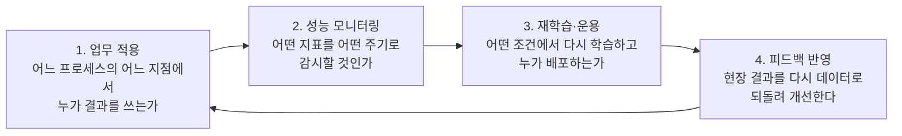

<Callout type="info">
  **이번 문서의 목표:** 이 파일을 다 읽으면 분석 결과를 업무에 태우는 활용계획의 네 축을 설명하고, A/B 테스트가 왜 인과를 말할 수 있는지 손으로 계산해 보이며, 개인정보·가명정보·익명정보를 법적으로 구분하고 비식별 조치 다섯 기법을 예시와 함께 골라낼 수 있게 됩니다.
</Callout>

## 1. 모형을 만든 다음이 진짜 시작이다

분석 프로젝트에서 가장 흔한 실패는 모형 성능이 나빠서가 아니라, **성능 좋은 모형이 아무도 쓰지 않는 보고서 안에서 끝나서** 일어납니다. 4과목(빅데이터 결과 해석)의 마지막 항목이 "분석결과 해석 및 활용"인 이유가 여기 있습니다.

> **쉽게 말하면:** 모형을 만드는 것은 요리를 하는 일이고, 활용계획은 그 요리를 **누가 언제 어떻게 먹을지, 상하면 어떻게 알아챌지** 정하는 일입니다.

그리고 요리에는 위생 규정이 붙습니다. 빅데이터가 다루는 재료는 대부분 사람에 관한 정보이므로, 활용에는 반드시 **법과 윤리**가 따라붙습니다. 이 편은 활용(무엇을 어떻게 쓰는가)과 윤리·법제(무엇을 하면 안 되는가)를 한 묶음으로 다룹니다.

모형 계수 해석과 변수 중요도는 22편, 결과를 그림으로 옮기는 방법은 23편에서 다루었으니, 여기서는 그 결과가 **조직의 의사결정과 시스템으로 흘러 들어가는 단계**부터 시작합니다.

## 2. 분석 결과 활용계획 — 네 개의 기둥

**활용계획**(utilization plan)은 분석이 끝난 뒤가 아니라 기획 단계에서 미리 세워 두는 문서입니다. 네 가지를 반드시 담습니다.

- **업무 적용**(deployment): 결과가 실제 업무 프로세스의 어느 지점에 들어가는지를 정합니다. "이탈 확률 0.7 이상 고객 목록을 매주 월요일 오전 9시에 콜센터 대기열 상단에 자동으로 올린다"처럼 **행동 규칙**까지 적어야 계획입니다.
- **성능 모니터링**(monitoring): 배포 후 정확도·재현율 같은 모형 지표와, 이탈률·매출 같은 사업 지표를 함께 추적합니다. 실제 정답 라벨이 늦게 도착하는 경우(고객이 진짜 이탈했는지는 3개월 뒤에 확정) 입력 분포 변화만 먼저 감시하기도 합니다.
- **재학습·운용**(retraining): 시간이 지나면 데이터의 분포와 사람의 행동이 바뀌어 모형이 낡습니다. 이 현상을 **드리프트**(drift, 표류)라고 합니다. 재학습 주기(예: 분기 1회)와 재학습 촉발 조건(예: 재현율이 기준 대비 10퍼센트 이상 하락)을 미리 정해 둡니다.
- **피드백 반영**(feedback): 현장에서 나온 결과가 다시 학습 데이터가 되어 다음 모형을 좋게 만듭니다. 이 고리가 닫혀야 프로젝트가 살아 있습니다.

> **자주 틀리는 점:** 기출에서 "분석 모델 개발이 완료되면 재학습이나 운용 계획은 수립할 필요가 없다"는 보기가 나옵니다. **오답 표시가 붙는 전형적 문장**입니다. 모형은 만든 순간부터 낡기 시작하므로 운용 계획은 개발 완료 시점에 더욱 필요합니다.

### 활용 영역별로 무엇이 달라지나

| 영역 | 전형적 분석 결과 | 활용 방식 | 성공 여부를 재는 지표 |
|------|------------------|-----------|------------------------|
| 마케팅 | 이탈 확률, 구매 성향, 고객 세분화 | 타깃 쿠폰 발송, 추천 목록 노출, 캠페인 대상 선정 | 전환율, 고객생애가치, 캠페인 투자 대비 효과 |
| 운영 | 수요 예측, 설비 고장 예측, 재고 최적화 | 발주량 자동 산정, 예방 정비 일정 배치 | 재고회전율, 결품률, 다운타임 감소 시간 |
| 정책·공공 | 지역별 위험도, 수요 격차, 부정 탐지 | 예산 배분, 인력 배치, 심사 우선순위 | 사고 감소율, 수혜 도달률, 부정 적발 금액 |
| 금융 | 신용 평점, 이상거래 탐지 | 한도 산정, 거래 차단, 심사 자동화 | 부도율, 오탐률, 심사 처리 시간 |

## 3. A/B 테스트와 실험 설계

### 3-1. 왜 필요한가 — 상관은 인과가 아니다

추천 알고리즘을 새로 바꿨더니 매출이 올랐다고 합시다. 알고리즘 덕분일까요? 같은 기간에 명절이 있었을 수도 있고, 경쟁사가 서비스 장애를 겪었을 수도 있습니다. 이렇게 원인 후보와 결과에 **동시에 영향을 주는 제3의 변수**를 **교란변수**(confounding variable, 혼란변수)라고 합니다.

> **쉽게 말하면:** 아이스크림 판매량과 익사 사고 건수는 함께 오릅니다. 아이스크림이 익사를 부르는 것이 아니라 **여름이라는 교란변수**가 둘을 함께 밀어 올린 것입니다.

관측 데이터만 보면 상관(correlation)은 알 수 있어도 인과(causation)는 알 수 없습니다. 이 벽을 뚫는 표준 도구가 **실험**, 그중에서도 웹·앱 환경의 **A/B 테스트**(A/B test)입니다.

### 3-2. 무작위 배정이 왜 인과를 주는가

**A/B 테스트**는 사용자를 무작위로 두 집단에 나눈 뒤, 한쪽에는 기존안(A, **대조군** control group), 다른 쪽에는 새 안(B, **실험군** treatment group)을 보여 주고 결과를 비교하는 방법입니다.

핵심은 **무작위 배정**(random assignment, 랜덤 배정)입니다. 동전을 던져 집단을 나누면, 나이·성별·소득·기존 구매 이력은 물론 **우리가 측정하지 못한 특성까지** 두 집단에 평균적으로 비슷하게 섞입니다. 두 집단이 처치(treatment) 말고는 통계적으로 구별되지 않으므로, 결과 차이의 원인 후보가 처치 하나만 남습니다.

> **쉽게 말하면:** 무작위 배정은 "다른 조건은 모두 같게 만든다"를 **셀 수 없는 조건까지 한 번에** 달성하는 장치입니다. 사람이 조건을 하나하나 맞추는 방식으로는 모르는 변수를 맞출 수 없습니다.

| 실험 설계 요소 | 뜻 | 잘못하면 생기는 일 |
|----------------|-----|--------------------|
| 무작위 배정 | 사용자를 확률적으로 두 집단에 나눔 | 신규 가입자만 B군에 넣으면 집단 자체가 달라져 비교 불가 |
| 대조군·실험군 | 기존안 집단과 새 안 집단 | 대조군 없이 전후만 비교하면 계절·시장 효과와 섞인다 |
| 사전 정의된 핵심지표 | 실험 전에 딱 하나 정해 두는 성공 지표 | 실험 후 잘 나온 지표를 골라 발표하면 체리피킹이 된다 |
| 표본 크기·기간 | 검출하려는 차이를 잡아낼 만큼의 인원과 기간 | 너무 적으면 진짜 효과도 유의하지 않게 나온다 |
| 유의수준 $\alpha$ (알파) | 효과가 없는데 있다고 결론 낼 확률의 상한, 보통 0.05 | 크게 잡으면 헛발견이 늘어난다 |
| 검정력 | 진짜 효과가 있을 때 그것을 잡아낼 확률, 보통 0.8 | 낮으면 진짜 개선을 놓친다 |
| 무작위 단위 | 사용자 단위인가 세션 단위인가 | 단위를 섞으면 같은 사람이 양쪽을 다 보게 되어 오염된다 |

가설검정 절차 자체(귀무가설·대립가설·p값)는 15편에서 다루었으니, 여기서는 그 절차가 **실험 설계와 어떻게 맞물리는지**만 짚습니다.

### 3-3. 손으로 계산하기 (1) — 전환율 비교와 퍼센트포인트

가상의 실험 결과입니다.

- A군(기존 버튼): 방문자 5,000명 중 구매 250명
- B군(새 버튼): 방문자 5,000명 중 구매 300명

**1단계 — 각 군의 전환율**

$$
p_A = \frac{250}{5000} = 0.05
$$

$$
p_B = \frac{300}{5000} = 0.06
$$

- $p_A$ (피에이): A군의 전환율, 방문자 대비 구매자 비율
- $p_B$ (피비): B군의 전환율

**2단계 — 절대 차이**

$$
0.06 - 0.05 = 0.01
$$

백분율로 바꾸면 5퍼센트에서 6퍼센트로 올랐으니 차이는 **1퍼센트포인트**(1%p)입니다.

**3단계 — 상대적 개선율**

$$
\frac{0.06 - 0.05}{0.05} = \frac{0.01}{0.05} = 0.2
$$

즉 **20퍼센트** 개선입니다.

**4단계 — 해석**

같은 결과를 "1퍼센트포인트 개선"이라고 말하면 사소해 보이고, "20퍼센트 개선"이라고 말하면 극적으로 들립니다. 둘 다 참이지만 청중이 받는 인상은 완전히 다릅니다.

> **자주 틀리는 점:** 퍼센트(%)와 퍼센트포인트(%p)를 섞어 쓰면 곧바로 왜곡입니다. **비율 자체의 차이는 퍼센트포인트**, 그 차이를 원래 값으로 나눈 것은 퍼센트입니다. 보고서에는 두 숫자를 함께 적는 것이 안전합니다.

### 3-4. 손으로 계산하기 (2) — 다중검정 문제

실험 하나에서 지표를 20개 동시에 보고, 각각 유의수준 $\alpha = 0.05$ 로 검정했다고 합시다. 실제로는 **아무 효과도 없는데** 우연히 유의하게 나오는 지표가 하나라도 생길 확률은 얼마일까요?

**1단계 — 지표 하나가 헛발견을 내지 않을 확률**

$$
1 - 0.05 = 0.95
$$

**2단계 — 20개 모두가 헛발견을 내지 않을 확률**

지표들이 서로 독립이라고 가정하면 확률을 곱합니다.

$$
0.95^{20}
$$

중간 단계를 밟아 계산합니다.

$$
0.95^{2} = 0.9025
$$

$$
0.95^{4} = 0.9025^{2} \approx 0.8145
$$

$$
0.95^{8} = 0.8145^{2} \approx 0.6634
$$

$$
0.95^{16} = 0.6634^{2} \approx 0.4401
$$

$$
0.95^{20} = 0.95^{16} \times 0.95^{4} \approx 0.4401 \times 0.8145 \approx 0.3585
$$

**3단계 — 적어도 하나가 헛발견일 확률**

$$
1 - 0.3585 = 0.6415
$$

**4단계 — 해석**

효과가 전혀 없어도 **약 64퍼센트**의 확률로 "유의한 개선 지표"가 최소 하나 튀어나옵니다. 이것이 **다중검정 문제**(multiple testing problem, 다중비교 문제)입니다. 지표를 많이 볼수록 우연한 승리가 반드시 생깁니다.

대응책 하나가 **본페로니 교정**(Bonferroni correction)으로, 지표 수 $m$ 으로 유의수준을 나눠 씁니다.

$$
\frac{0.05}{20} = 0.0025
$$

즉 각 지표는 p값이 0.0025보다 작아야 유의하다고 선언합니다. 더 근본적인 대응은 **핵심지표 하나를 실험 전에 못 박고**, 나머지는 참고용 보조지표로만 보는 것입니다.

### 3-5. 조기 종료의 위험

실험을 돌리는 중간에 매일 결과를 들여다보다가 "지금 유의하네" 하고 멈추는 행위를 **조기 종료**(early stopping) 또는 엿보기(peeking)라고 합니다. 이것도 다중검정의 변형입니다. 매일 한 번씩 검정하면 30일이면 30번 검정하는 셈이고, 앞의 계산과 같은 이유로 헛발견 확률이 크게 부풀어 오릅니다.

> **쉽게 말하면:** 주사위를 6이 나올 때까지 던진 뒤 "봐라, 6이 나왔다"고 말하는 것과 같습니다. 언제 멈출지를 결과를 보고 정하면 확률 계산의 전제가 무너집니다.

올바른 방법은 **표본 크기와 기간을 실험 전에 정해 두고 끝까지 채우는 것**입니다. 중간 확인이 꼭 필요하면 순차검정처럼 그 상황을 전제로 설계된 절차를 씁니다. 실험 기간은 요일 효과를 담기 위해 보통 최소 1주 단위로 잡습니다.

## 4. 개인정보 법·제도 — 데이터 3법

### 4-1. 데이터 3법이 무엇을 바꿨나

**데이터 3법**은 2020년에 함께 개정된 세 법률을 묶어 부르는 말입니다.

| 법률 | 핵심 키워드 | 무엇을 바꿨나 |
|------|-------------|----------------|
| 개인정보 보호법 | 가명정보 개념 도입 | 가명처리한 정보는 통계작성·과학적 연구·공익적 기록보존 목적이면 동의 없이 활용 가능 |
| 정보통신망법 | 개인정보 조항의 이관 | 온라인 개인정보 규정을 개인정보 보호법으로 옮겨 중복 규제 해소 |
| 신용정보법 | 마이데이터, 안전한 금융데이터 활용 | 본인신용정보관리업(마이데이터) 도입, 가명정보의 금융 분야 활용 근거 마련 |

> **자주 틀리는 점:** 공공데이터법이나 전자상거래법처럼 이름이 비슷한 법을 데이터 3법에 끼워 넣는 보기가 나옵니다. 데이터 3법은 **개인정보 보호법·정보통신망법·신용정보법** 셋뿐입니다.

### 4-2. 개인정보·가명정보·익명정보 구분

시험이 가장 좋아하는 표입니다.

| 구분 | 정의 | 재식별 가능성 | 개인정보에 해당하는가 | 동의 없는 활용 |
|------|------|----------------|------------------------|-----------------|
| 개인정보 | 살아 있는 개인에 관한 정보, 또는 다른 정보와 쉽게 결합해 개인을 알아볼 수 있는 정보 | 있음 | 해당함 | 원칙적으로 불가(법정 예외 있음) |
| 가명정보 | 개인정보의 일부를 삭제·대체해 추가 정보 없이는 특정 개인을 알아볼 수 없게 처리한 정보 | 추가 정보(대응표)와 결합하면 있음 | **해당함** | 통계작성·과학적 연구·공익적 기록보존 목적이면 가능 |
| 익명정보 | 시간·비용·기술을 합리적으로 고려해도 다른 정보와 결합해 개인을 알아볼 수 없는 정보 | 없음 | **해당하지 않음** | 자유롭게 가능 |

핵심 암기 문장은 이것입니다. **개인정보 여부는 개인정보 O, 가명정보 O, 익명정보 X.** 가명정보가 여전히 개인정보라는 점이 함정 자리입니다. 회원 이름을 임의 코드로 바꾼 분석 파일은, 그 파일만으로는 개인을 알기 어렵지만 별도 보관된 **대응표**와 합치면 다시 식별되므로 가명정보입니다.

> **자주 틀리는 점:** "적법한 동의가 있어도 식별 가능한 정보는 예외 없이 익명화해야 한다"는 보기는 오답입니다. 적법한 처리 근거와 특정 목적이 있으면 식별 가능한 개인정보의 처리 자체가 항상 금지되는 것은 아닙니다. 시각화 편에서와 마찬가지로 **예외 없이, 무조건, 반드시** 같은 절대 표현이 오답 신호입니다.

### 4-3. 민감정보와 고유식별정보

| 구분 | 무엇인가 | 예시 |
|------|----------|------|
| 민감정보 | 사생활을 현저히 침해할 우려가 있어 별도 동의가 필요한 정보 | 사상·신념, 노동조합·정당의 가입과 탈퇴, 정치적 견해, 건강·성생활 정보, 유전정보, 범죄경력 자료 |
| 고유식별정보 | 법령에 따라 개인에게 부여된 고유한 식별 번호 | 주민등록번호, 여권번호, 운전면허번호, 외국인등록번호 |

두 범주 모두 일반 개인정보보다 강한 보호를 받습니다. 특히 주민등록번호는 원칙적으로 처리가 금지되고, 법령에 근거가 있을 때만 처리할 수 있습니다.

### 4-4. 수집·이용 동의 시 필수 고지 사항

정보주체에게 동의를 받을 때 반드시 알려야 하는 항목은 네 가지입니다.

1. 개인정보의 **수집 및 이용 목적**
2. 수집하려는 개인정보의 **항목**
3. 개인정보의 **보유 및 이용 기간**
4. 동의를 **거부할 권리**가 있다는 사실과, 거부에 따른 불이익이 있는 경우 그 불이익의 내용

수집 원칙은 **목적에 필요한 범위에서 최소한으로, 적법하고 정당하게** 입니다. 목적 달성 후에는 지체 없이 파기합니다.

### 4-5. 마이데이터

**마이데이터**(MyData)는 개인이 자신의 데이터를 직접 관리·통제하고, 본인의 동의에 따라 여러 기관에 흩어져 있는 개인정보를 한곳에 모아 활용할 수 있게 하는 제도이자 서비스입니다. 신용정보법 개정으로 금융 분야에서 먼저 제도화되었습니다.

> **쉽게 말하면:** 은행·카드사·보험사에 나뉘어 있던 내 기록을 내가 열쇠를 쥐고 한 앱으로 불러 모으는 것입니다. 데이터의 통제권을 기업에서 **개인 쪽으로 옮기는** 발상입니다.

## 5. 비식별 조치 기법

개인을 알아볼 수 없게 데이터를 가공하는 절차를 **비식별 조치**(de-identification)라고 합니다. 다섯 가지 기법이 표로 출제됩니다.

| 기법 | 무엇을 하는가 | 예시 |
|------|----------------|------|
| 가명처리(Pseudonymization) | 식별 가능한 값을 다른 값으로 대체하거나 뒤섞음 | 홍길동을 임의 코드 U-10473으로 대체, 휴리스틱 익명화 |
| 총계처리(Aggregation) | 개별 값 대신 합계·평균 등 집계값을 제공 | 개인별 소득 대신 지역별 평균 소득 제공 |
| 데이터 삭제(Data reduction) | 식별 위험이 높은 값이나 열을 제거 | 주민등록번호 열 전체 삭제, 생년월일 중 일 삭제 |
| 데이터 범주화(Data suppression) | 연속형 값을 구간·범주로 묶거나 상한·하한을 설정 | 37세를 30대로, 연봉 3억 이상은 3억 이상으로 표기 |
| 데이터 마스킹(Data masking) | 식별 값의 전부 또는 일부를 다른 문자로 가림 | 홍길동을 `홍**`으로, 전화번호 뒷자리를 `****`로 |

기출은 기법과 예시의 짝을 어긋나게 놓습니다. 대표적인 오답이 "가명처리 – 홍길동을 `홍**`으로 표시"입니다. 별표로 가리는 것은 **마스킹**입니다. 또 "범주화 – 주민등록번호를 해시값으로 변환" 역시 어긋난 짝으로, 해시 대체는 **가명처리** 쪽입니다.

> **자주 틀리는 점:** 총계처리를 두고 "한 번 집계하면 어떤 후속 분석에서도 결과가 항상 동일하게 재현된다"는 보기가 나온 적이 있습니다. 집계는 식별 위험을 낮추는 기법일 뿐 재현성을 보장하는 장치가 아니므로 오답입니다. 게다가 집단을 너무 잘게 나누면 작은 셀에서 다시 개인이 드러날 수 있습니다.

### 프라이버시 보호 모델

비식별 조치가 충분한지 판정하는 기준도 함께 출제됩니다.

| 모델 | 기준 | 막으려는 공격 |
|------|------|----------------|
| k-익명성(k-anonymity) | 나이·성별·지역 같은 준식별자 조합이 같은 사람이 최소 k명 이상 존재 | 준식별자 조합으로 개인을 콕 집어내는 공격 |
| l-다양성(l-diversity) | 같은 준식별자 그룹 안에서 민감정보 값이 최소 l가지 이상 | 그룹 전원의 병명이 같으면 개인을 몰라도 병을 알게 되는 공격 |
| t-근접성(t-closeness) | 그룹 내 민감정보 분포가 전체 분포와 t 이하로 가까움 | 그룹의 분포가 전체와 크게 달라 정보가 새는 공격 |

여기에 없는 이름(예: m-유일성)을 만들어 넣은 보기가 오답 자리에 놓입니다.

## 6. 빅데이터 위기요인 세 가지와 통제방안

| 위기요인 | 무슨 일이 벌어지나 | 통제방안 |
|----------|--------------------|-----------|
| 사생활 침해 | 수집·결합된 정보로 개인의 행동과 위치가 과도하게 드러난다 | 매번 동의를 받는 방식(동의제)에서, 데이터를 쓰는 **사용자에게 책임을 부여**하는 방식(책임제)으로 전환 |
| 책임 원칙 훼손 | 예측 결과만으로 아직 하지 않은 일에 불이익을 주거나, 편향된 결과가 특정 집단을 차별해 피해자가 생긴다 | 결과 기반 책임 원칙을 지키고, 이의제기·구제 절차를 마련 |
| 데이터 오용 | 잘못된 데이터나 잘못된 해석으로 그릇된 인사이트를 얻어 의사결정이 틀어진다 | **알고리즘의 투명성과 접근성**을 보장해 분석 결과를 외부에서 검증할 수 있게 한다 |

> **자주 틀리는 점:** "연결 확대로 활용 가능한 자료가 늘어난다"는 위기요인이 아니라 빅데이터의 **기대효과**입니다. 세 가지 위기요인은 사생활 침해, 책임 원칙 훼손, 데이터 오용으로 고정입니다.

기출은 사례를 주고 유형을 고르게 합니다. "대출 심사 모델이 같은 상환 능력의 지원자 중 특정 지역 거주자에게 지속적으로 불리한 결과를 냈다" → 편향된 결과로 특정 집단이 피해를 보고 그 책임이 문제 되므로 **책임 원칙의 훼손**입니다.

## 7. 데이터·알고리즘 편향과 공정성

모형은 데이터를 그대로 배웁니다. 데이터가 기울어져 있으면 모형은 그 기울기를 **증폭해서** 되돌려 줍니다.

| 편향 유형 | 어디서 생기나 | 예시 | 대응 |
|-----------|----------------|------|------|
| 표본 편향(Sampling bias) | 학습 데이터가 모집단을 대표하지 못함 | 스마트폰 앱 설문만으로 전 국민 여론을 추정 | 표집 설계 재검토, 집단별 성능 분리 측정 |
| 레이블 편향(Label bias) | 정답 라벨 자체가 과거의 차별을 담고 있음 | 과거 채용 합격 여부를 정답으로 학습해 과거 편향을 재생산 | 라벨 정의 재검토, 대리 지표 사용 여부 점검 |
| 확증 편향(Confirmation bias) | 분석자가 원하는 결론에 맞는 근거만 취함 | 유리한 기간만 잘라 성과를 보고 | 사전 가설 등록, 반대 근거 탐색, 동료 검토 |
| 측정 편향(Measurement bias) | 변수 측정 방식이 집단마다 다름 | 지역별로 검사 횟수가 달라 감염 확인 수가 왜곡 | 측정 절차 표준화, 노출량 보정 |
| 배제 편향(Exclusion bias) | 전처리 과정에서 특정 집단이 통째로 제거됨 | 결측 많은 고령층 행을 일괄 삭제 | 결측 처리 방식 재검토(11편 참고) |

**공정성**(fairness)을 재는 방식도 하나가 아닙니다. 집단별 합격률을 맞추는 기준, 집단별 재현율을 맞추는 기준, 예측 확률의 신뢰도를 맞추는 기준이 서로 충돌할 수 있어 **모든 공정성 기준을 동시에 만족시키는 것은 일반적으로 불가능**합니다. 그래서 어떤 공정성을 택했는지 문서로 남기고, 그 선택의 근거를 밝히는 일이 중요합니다.

> **자주 틀리는 점:** "성능 수치가 높으면 데이터 편향과 한계는 보고하지 않아도 된다"는 보기는 오답입니다. 전체 정확도가 높아도 소수 집단에서만 성능이 무너지는 일이 흔하므로, **집단별로 쪼갠 성능**과 데이터의 한계는 반드시 함께 보고합니다.

## 8. 설명가능성과 규제

**설명가능성**(explainability)은 모형이 왜 그런 결론을 냈는지 사람이 이해할 수 있게 제시하는 능력입니다. 대출 거절, 채용 탈락, 의료 판단처럼 **개인에게 중대한 영향을 주는 결정**에서는 성능만큼 중요해집니다.

- 개인정보 보호법은 완전히 자동화된 결정이 정보주체의 권리·의무에 중대한 영향을 미치는 경우, 정보주체가 그 **설명을 요구하고 거부할 수 있는 권리**를 인정하는 방향으로 강화되어 왔습니다.
- 결정 근거를 제시하는 실무 도구로는 변수 중요도, 부분의존도, SHAP 값 등이 쓰입니다. 이 도구들의 원리는 22편에서 다루었습니다.
- 설명가능성과 성능은 흔히 맞바꿈 관계에 있습니다. 선형회귀·의사결정나무는 설명이 쉽고, 앙상블·딥러닝은 성능이 높지만 설명이 어렵습니다. 규제 영역에서는 **약간의 성능을 포기하고 설명 가능한 모형을 택하는 결정**이 정당화될 수 있습니다.

> **쉽게 말하면:** 설명가능성은 "왜 떨어뜨렸는지 말해 줄 수 있는가"입니다. 말해 줄 수 없는 시스템은 이의를 제기할 수도, 고칠 수도 없습니다.

## 9. 시험에서 어떻게 물어보나

**유형 1. 정보 구분 판정.** 상황을 서술하고 개인정보·가명정보·익명정보 중 무엇인지 고르게 합니다. 판정 기준은 하나입니다. **추가 정보(대응표)와 결합하면 다시 식별되는가.** 결합하면 식별 → 가명정보, 어떤 방법으로도 불가 → 익명정보.

**유형 2. 비식별 기법과 예시 짝짓기.** 다섯 기법의 예시를 한 칸씩 밀어 놓습니다. 별표로 가리면 마스킹, 평균으로 바꾸면 총계처리, 구간으로 묶으면 범주화, 코드·해시로 대체하면 가명처리, 지우면 데이터 삭제. 이 다섯 동사만 붙잡으면 됩니다.

**유형 3. 데이터 3법 분류.** 업무를 나열하고 데이터 3법 대응이 아닌 것을 고르게 합니다. 공공데이터법 관련 업무가 섞여 들어오는 것이 단골 함정입니다.

**유형 4. 위기요인 사례 판정.** 차별·피해자 발생이면 책임 원칙 훼손, 개인 추적·노출이면 사생활 침해, 잘못된 해석으로 인한 오판이면 데이터 오용입니다.

**유형 5. 활용계획과 윤리 보고의 옳지 않은 것 고르기.** 오답 문장은 거의 항상 **무언가를 생략해도 된다는 형태**입니다. "재학습 계획은 필요 없다", "한계는 보고하지 않아도 된다", "예외 없이 익명화해야 한다" 같은 문장이 보이면 우선 의심하세요.

**유형 6. 실험·인과 해석.** "상관이 있으므로 인과가 있다"고 단정한 보기, 대조군 없이 전후만 비교한 설계, 실험 중 좋아 보일 때 멈춘 조기 종료가 오답 자리에 놓입니다.

## 10. 헷갈리는 짝 정리

| 구분 | A | B | 결정적 차이 |
|------|---|---|-------------|
| 가명정보 vs 익명정보 | 가명정보 | 익명정보 | 가명정보는 개인정보에 해당하고 추가 정보로 재식별 가능, 익명정보는 해당하지 않음 |
| 가명처리 vs 마스킹 | 가명처리 | 마스킹 | 가명처리는 다른 값으로 대체·치환, 마스킹은 문자로 가려서 감춤 |
| 총계처리 vs 범주화 | 총계처리 | 범주화 | 총계처리는 여러 사람을 합쳐 집계, 범주화는 한 사람의 값을 구간으로 뭉갬 |
| 민감정보 vs 고유식별정보 | 민감정보 | 고유식별정보 | 민감정보는 내용의 민감성(사상·건강), 고유식별정보는 법정 식별 번호 |
| 퍼센트 vs 퍼센트포인트 | 퍼센트 | 퍼센트포인트 | 원래 값 대비 변화율이 퍼센트, 비율 값 자체의 차이가 퍼센트포인트 |
| 상관 vs 인과 | 상관 | 인과 | 무작위 배정 실험이 있어야 인과를 주장할 수 있음 |
| 사생활 침해 vs 책임 원칙 훼손 | 사생활 침해 | 책임 원칙 훼손 | 노출·추적 문제인가, 예측 결과로 인한 불이익·차별 문제인가 |

## 핵심 정리

- 활용계획은 **업무 적용 – 성능 모니터링 – 재학습·운용 – 피드백 반영**의 순환이며, 개발 완료 후 운용 계획이 필요 없다는 서술은 언제나 오답입니다.
- A/B 테스트가 인과를 말할 수 있는 이유는 **무작위 배정**이 측정하지 못한 변수까지 두 집단에 고르게 섞어 주기 때문입니다. 지표 20개를 유의수준 0.05로 동시에 보면 헛발견 확률이 약 64퍼센트까지 오르므로 핵심지표를 미리 하나로 못 박고 조기 종료를 피합니다.
- 데이터 3법은 **개인정보 보호법(가명정보 도입), 정보통신망법(개인정보 조항 이관), 신용정보법(마이데이터)** 이며, 개인정보 해당 여부는 개인정보 O, 가명정보 O, 익명정보 X입니다.
- 비식별 조치 다섯 기법은 **가명처리·총계처리·데이터 삭제·데이터 범주화·데이터 마스킹**이고, 별표로 가리는 것은 마스킹, 평균으로 바꾸는 것은 총계처리입니다.
- 빅데이터 위기요인은 **사생활 침해·책임 원칙 훼손·데이터 오용** 세 가지이며, 데이터 오용의 통제방안으로는 알고리즘의 투명성과 접근성 보장이 제시됩니다.

## 마무리 복습

<Quiz
  questionNumber={1}
  question="분석 결과 활용계획에 대한 설명으로 옳지 않은 것은?"
  options={['① 분석 결과를 실제 업무 프로세스에 어떻게 적용할지 정의한다', '② 모형의 성능 변화를 지속적으로 모니터링하는 방안을 포함한다', '③ 분석 모델 개발이 완료되면 모형 재학습이나 운용 계획은 수립할 필요가 없다', '④ 현장 피드백을 다시 데이터로 되돌려 다음 모형 개선에 활용한다']}
  correctAnswer={3}
  explanation="데이터 분포와 사용자 행동이 변하면 모형 성능은 시간이 갈수록 떨어집니다. 그래서 재학습 주기와 촉발 조건, 배포 책임자를 정하는 운용 계획은 개발 완료 시점에 오히려 더 필요합니다."
  optionExplanations={['업무 적용 지점을 정의하는 것은 활용계획의 첫 번째 축입니다.', '성능 모니터링은 활용계획의 두 번째 축으로 반드시 포함됩니다.', '모형은 드리프트로 낡아 가므로 재학습과 운용 계획이 필수입니다. 생략해도 된다는 서술이 틀렸습니다.', '피드백 반영은 활용계획의 순환을 닫는 마지막 축입니다.']}
/>

<Quiz
  questionNumber={2}
  question="회원 이름을 임의 코드로 바꾼 분석 파일은 그 파일만으로는 개인을 알아보기 어렵지만, 별도 보관된 대응표와 결합하면 다시 식별할 수 있다. 이에 해당하는 정보와 그 법적 성격으로 옳은 것은?"
  options={['① 익명정보이며 개인정보에 해당하지 않는다', '② 가명정보이며 개인정보에 해당한다', '③ 익명정보이며 개인정보에 해당한다', '④ 가명정보이며 개인정보에 해당하지 않는다']}
  correctAnswer={2}
  explanation="추가 정보와 결합하면 재식별이 가능하도록 처리된 정보는 가명정보이고, 가명정보는 여전히 개인정보에 해당합니다. 재식별 가능성이 제거된 익명정보만 개인정보에서 빠집니다."
  optionExplanations={['대응표로 재식별이 가능하므로 익명정보가 아닙니다.', '가명정보이며 개인정보에 해당한다는 것이 정확한 판정입니다.', '익명정보라는 판정 자체가 틀렸고 개인정보 해당 여부도 어긋납니다.', '가명정보 판정은 맞지만 가명정보는 개인정보에 해당하므로 뒷부분이 틀렸습니다.']}
/>

<Quiz
  questionNumber={3}
  question="비식별 조치 기법과 그 적용 예시의 연결로 옳은 것은?"
  options={['① 가명처리 - 개별 소득 대신 지역별 평균 소득을 제공', '② 총계처리 - 나이 37세를 30대로 표기', '③ 데이터 마스킹 - 이름의 일부 글자를 다른 문자로 가려 표시', '④ 데이터 범주화 - 주민등록번호를 식별 불가능한 해시값으로 변환']}
  correctAnswer={3}
  explanation="식별 가능한 값의 전부 또는 일부를 다른 문자로 덮어 감추는 기법이 데이터 마스킹입니다. 평균 제공은 총계처리, 나이를 구간으로 묶는 것은 범주화, 해시값 대체는 가명처리입니다."
  optionExplanations={['평균으로 대체해 제공하는 것은 총계처리입니다.', '나이를 연령대 구간으로 묶는 것은 데이터 범주화입니다.', '값의 일부를 다른 문자로 가리는 것이 마스킹의 정의입니다.', '해시값으로 대체하는 것은 가명처리 쪽입니다.']}
/>

<Quiz
  questionNumber={4}
  question="A/B 테스트에서 사용자를 무작위로 두 집단에 배정하는 절차가 인과 해석을 가능하게 하는 이유로 가장 적절한 것은?"
  options={['① 표본 크기를 자동으로 늘려 주기 때문이다', '② 측정하지 못한 특성까지 두 집단에 평균적으로 고르게 섞여 처치 외의 차이가 사라지기 때문이다', '③ 유의수준을 0.05보다 작게 만들어 주기 때문이다', '④ 두 집단의 전환율을 항상 같게 만들어 주기 때문이다']}
  correctAnswer={2}
  explanation="무작위 배정은 관측한 변수뿐 아니라 관측하지 못한 변수까지 두 집단에 확률적으로 균등하게 분산시킵니다. 그래서 결과 차이의 설명 후보가 처치 하나만 남고 인과를 말할 수 있습니다."
  optionExplanations={['배정 방식은 표본 크기와 무관합니다. 표본 크기는 설계 단계에서 따로 정합니다.', '관측되지 않은 교란변수까지 균형을 맞추는 것이 무작위 배정의 핵심 효과입니다.', '유의수준은 분석자가 정하는 값이며 배정 방식이 바꾸지 않습니다.', '전환율을 같게 만드는 것이 목적이라면 실험 자체가 성립하지 않습니다.']}
/>

<Quiz
  questionNumber={5}
  question="한 실험에서 서로 독립인 지표 20개를 각각 유의수준 0.05로 검정했다. 실제로는 아무 효과가 없을 때 적어도 하나가 유의하게 나올 확률에 가장 가까운 값은?"
  options={['① 약 5퍼센트', '② 약 20퍼센트', '③ 약 64퍼센트', '④ 약 95퍼센트']}
  correctAnswer={3}
  explanation="지표 하나가 헛발견을 내지 않을 확률이 0.95이므로 20개 모두 무사할 확률은 0.95의 20제곱인 약 0.3585입니다. 1에서 이를 빼면 약 0.6415, 즉 약 64퍼센트가 됩니다."
  optionExplanations={['5퍼센트는 지표를 하나만 볼 때의 값입니다.', '20퍼센트는 계산 근거가 없는 숫자입니다.', '1에서 0.95의 20제곱을 뺀 값이 약 0.64입니다.', '95퍼센트는 지표 하나가 무사할 확률과 혼동한 값입니다.']}
/>

<Quiz
  questionNumber={6}
  question="대출 심사 모델이 동일한 상환 능력을 가진 지원자 중 특정 지역 거주자에게 지속적으로 불리한 결과를 냈다. 이 사례와 가장 직접 관련된 빅데이터 위기요인은?"
  options={['① 책임 원칙의 훼손', '② 데이터 저장 비용의 증가', '③ 데이터 소유권 분쟁', '④ 연결 확대로 활용 가능한 자료가 늘어나는 현상']}
  correctAnswer={1}
  explanation="편향된 분석 결과가 특정 집단을 차별해 피해자가 발생하고 그 결과에 대한 책임이 문제 되는 상황이므로 책임 원칙의 훼손에 해당합니다."
  optionExplanations={['예측 결과로 인한 불이익과 그 책임 문제이므로 책임 원칙의 훼손이 맞습니다.', '저장 비용은 기술·비용 문제이지 빅데이터 3대 위기요인이 아닙니다.', '소유권 분쟁은 별도의 쟁점이며 이 사례가 가리키는 요인이 아닙니다.', '자료가 늘어나는 것은 위기요인이 아니라 빅데이터의 기대효과입니다.']}
/>

<Quiz
  questionNumber={7}
  question="데이터 3법에 해당하는 법률의 조합으로 옳은 것은?"
  options={['① 개인정보 보호법, 정보통신망법, 신용정보법', '② 개인정보 보호법, 공공데이터법, 신용정보법', '③ 정보통신망법, 전자상거래법, 개인정보 보호법', '④ 신용정보법, 공공데이터법, 전자금융거래법']}
  correctAnswer={1}
  explanation="데이터 3법은 개인정보 보호법, 정보통신망법, 신용정보법입니다. 개인정보 보호법은 가명정보 개념을 도입했고, 정보통신망법의 개인정보 조항은 개인정보 보호법으로 이관되었으며, 신용정보법은 마이데이터의 근거가 되었습니다."
  optionExplanations={['세 법률 모두 데이터 3법 개정 묶음에 속합니다.', '공공데이터법은 데이터 3법에 포함되지 않습니다.', '전자상거래법은 데이터 3법과 무관합니다.', '공공데이터법과 전자금융거래법 모두 데이터 3법이 아닙니다.']}
/>

<Quiz
  questionNumber={8}
  question="분석 결과를 보고할 때의 윤리적 원칙으로 옳지 않은 것은?"
  options={['① 전체 성능이 높아도 집단별로 쪼갠 성능을 함께 확인해 보고한다', '② 성능 수치가 충분히 높으면 데이터 편향과 한계는 보고하지 않아도 된다', '③ 개인에게 중대한 영향을 주는 자동화 결정에는 설명 가능한 근거를 함께 제시한다', '④ 실험 전에 핵심지표를 하나로 정해 두고 결과가 좋은 지표만 골라 발표하지 않는다']}
  correctAnswer={2}
  explanation="좋은 성능이 편향을 없애 주지는 않습니다. 전체 정확도가 높아도 소수 집단에서만 성능이 무너지는 일이 흔하므로 데이터의 편향과 한계는 반드시 함께 보고해야 합니다."
  optionExplanations={['집단별 성능 분리 측정은 편향을 발견하는 기본 절차입니다.', '성능이 높다고 편향과 한계가 사라지지 않으므로 숨겨서는 안 됩니다.', '중대한 자동화 결정에 대한 설명 제공은 규제와 윤리 양쪽의 요구입니다.', '사전에 핵심지표를 못 박는 것은 체리피킹을 막는 표준 절차입니다.']}
/>

## 참고 자료

- [한국데이터산업진흥원 - 빅데이터분석기사 자격시험 안내](https://www.dataq.or.kr/www/sub/a_07.do)
- [Statistics Playbook - 빅데이터분석기사 완전 가이드](https://statisticsplaybook.com/big-data-analysis-engineer-guide/)
- [Inflearn 가이드 - 빅데이터분석기사 어떻게 준비해야 할까?](https://www.inflearn.com/pages/bigdata-analysis-engineer-guide)
- [SQLDpass - 빅데이터분석기사 필기 기출·복원](https://www.sqldpass.com/past-exams?cert=BIGDATA_ANALYST)
- [이패스코리아 - 빅데이터분석기사 시험정보](https://www.epasskorea.com/public_html/Examinfo/info_bd.asp?cate_idx=13280110&type=C&link_idx=11112)
- [개인정보보호위원회 개인정보 포털 - 개인정보 보호법 안내](https://www.privacy.go.kr/)
