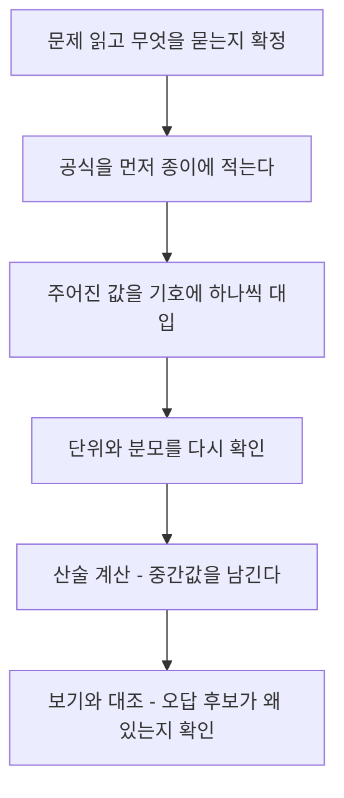

<Callout type="warning">
  **먼저 읽어 주세요.** 이 편의 문제는 실제 기출을 그대로 복제한 것이 아니라, **같은 개념·같은 난이도로 재구성한 문항**입니다. 기출 중 정답이 모호하거나 조건이 부족했던 문항은 조건을 명확히 다듬어 새로 출제했습니다. 그러므로 "이 숫자가 시험에 그대로 나온다"가 아니라 "**이 계산 절차가 시험에 나온다**"로 읽어 주세요.
</Callout>

<Callout type="info">
  **이번 문서의 목표:** 필기에서 계산으로 출제되는 모든 공식을 한자리에 모아 각 기호의 뜻까지 확인하고, 22개 문항을 통해 "공식 확인 → 값 대입 → 산술 계산 → 보기 대조"의 절차를 몸에 익힌다. 특히 **오답 보기가 어떤 잘못된 계산에서 나온 값인지**를 하나하나 확인해, 시험장에서 같은 실수를 반복하지 않게 된다.
</Callout>

## 이 편을 이렇게 쓰세요

계산 문제는 필기에서 **버리면 안 되는 문제**입니다. 개념 문제는 애매한 표현 때문에 헷갈릴 수 있지만, 계산 문제는 공식만 정확히 알면 **정답이 하나로 확정**됩니다. 즉 계산 문제는 이 시험에서 가장 확실하게 점수를 챙길 수 있는 구간입니다.

> **쉽게 말하면:** 개념 문제는 "출제자의 마음"을 읽어야 하지만, 계산 문제는 "산수"만 하면 됩니다. 그래서 계산 문제를 틀리는 건 아깝습니다.

문제를 먼저 풀고 해설을 보는 것도 좋지만, 이 편은 **해설을 읽는 것 자체가 학습**이 되도록 썼습니다. 맞힌 문제도 해설의 "오답 보기가 어디서 나온 값인지"까지 읽어 주세요. 시험장에서 마주칠 함정이 바로 그 값들입니다.

## 1. 공식 요약 — 이 편에 나오는 모든 공식

계산 문제를 풀 때 가장 먼저 하는 일은 **공식을 정확히 떠올리는 것**입니다. 여기서 한 번에 정리합니다. 각 공식 아래에 기호의 뜻을 붙였으니, 기호가 낯설면 반드시 확인하고 넘어가세요.

### 1-1. 기술통계(Descriptive Statistics)

**평균**(mean, 산술평균):

$$
\bar{x} = \frac{1}{n}\sum_{i=1}^{n} x_i
$$

- $\bar{x}$ (엑스바): 표본평균. 자료 전체를 대표하는 중심값입니다.
- $\sum$ (시그마): "모두 더하라"는 기호입니다.
- $n$: 자료의 개수(표본 크기).
- $x_i$: $i$번째 관측값.

**중앙값**(median): 값을 **크기순으로 정렬**한 뒤 한가운데 오는 값. 개수가 짝수면 가운데 두 값의 평균입니다.
**최빈값**(mode): 가장 **자주 나온** 값. 가장 큰 값이 아닙니다.

**불편표본분산**(unbiased sample variance):

$$
s^2 = \frac{1}{n-1}\sum_{i=1}^{n}(x_i - \bar{x})^2
$$

- $s^2$: 표본분산. 자료가 평균에서 얼마나 흩어져 있는지를 나타냅니다.
- $n-1$: **자유도**(degrees of freedom). 표본으로 모집단 분산을 추정할 때 $n$이 아니라 $n-1$로 나눕니다. **필기에서 가장 자주 나오는 함정입니다.**

**표준편차**(standard deviation):

$$
s = \sqrt{s^2}
$$

- 분산에 제곱근(square root)을 씌운 값입니다. 단위가 원자료와 같아져서 해석하기 쉽습니다.

**사분위범위**(IQR, Interquartile Range):

$$
IQR = Q_3 - Q_1
$$

- $Q_1$ (제1사분위수): 아래에서 25퍼센트 지점의 값.
- $Q_3$ (제3사분위수): 아래에서 75퍼센트 지점의 값.
- 상자그림(box plot)에서 상자의 **폭**에 해당하며, 이상치 판정 경계는 `Q1 - 1.5×IQR` 아래와 `Q3 + 1.5×IQR` 위입니다.

**변동계수**(CV, Coefficient of Variation):

$$
CV = \frac{s}{\bar{x}}
$$

- 표준편차를 평균으로 나눈 **상대적** 산포입니다. 단위가 다르거나 평균 규모가 크게 다른 두 집단의 흩어짐을 비교할 때 씁니다. 보통 백분율로 보고합니다.

**왜도**(skewness, 비대칭도) 방향 판단: 평균·중앙값·최빈값의 **순서**로 읽습니다.

| 순서 | 왜도 | 꼬리 방향 | 예시 |
| --- | --- | --- | --- |
| 최빈값 &lt; 중앙값 &lt; 평균 | 양의 왜도(오른쪽 왜도) | 오른쪽으로 긴 꼬리 | 소득, 재산 |
| 평균 &lt; 중앙값 &lt; 최빈값 | 음의 왜도(왼쪽 왜도) | 왼쪽으로 긴 꼬리 | 만점에 몰린 쉬운 시험 |
| 세 값이 거의 같음 | 대칭 | 좌우 대칭 | 성인 키 |

> **쉽게 말하면:** 평균은 극단값에 끌려갑니다. **평균이 중앙값보다 크면 오른쪽에 극단값이 있는 것**이고, 그쪽으로 꼬리가 깁니다.

### 1-2. 확률·분포(Probability and Distributions)

**이항분포**(Binomial Distribution) $B(n, p)$:

$$
E[X] = np
$$

$$
Var[X] = np(1-p)
$$

- $n$: 시행 횟수(고정).
- $p$: 각 시행에서 성공할 확률.
- $E[X]$: 기대값(평균). $Var[X]$: 분산.
- 조건: 시행 횟수가 **고정**, 각 시행이 **독립**, 성공확률이 **일정**.

**기대값**(expected value, 이산형):

$$
E[X] = \sum_i x_i \cdot P(x_i)
$$

- 각 값에 그 값이 나올 **확률을 가중치로 곱해** 더합니다. 단순 산술평균이 아닙니다.

**조건부확률**(conditional probability)과 **베이즈 정리**(Bayes Theorem):

$$
P(A \mid B) = \frac{P(A \cap B)}{P(B)}
$$

$$
P(D \mid +) = \frac{P(+\mid D)\,P(D)}{P(+\mid D)\,P(D) + P(+\mid D^c)\,P(D^c)}
$$

- $P(A \mid B)$: $B$가 일어났다는 조건에서 $A$가 일어날 확률. 세로줄 기호는 "주어졌을 때"로 읽습니다.
- $D$: 질병 보유, $D^c$: 질병 없음, $+$: 검사 양성.
- $P(+\mid D)$: **민감도**(sensitivity). $P(-\mid D^c)$: **특이도**(specificity), 따라서 $P(+\mid D^c) = 1 -$ 특이도.
- 분모는 "양성이 나올 **모든** 경로"의 합입니다. 진짜 환자의 양성과 건강한 사람의 위양성을 **둘 다** 더해야 합니다.

**분포 판별 요령:**

| 상황 | 분포 | 결정적 단서 |
| --- | --- | --- |
| 고정된 $n$번 시행, 복원(또는 매우 큰 모집단) | 이항분포 | 성공확률이 매 시행 동일 |
| 유한 모집단에서 **비복원** 추출 | 초기하분포(Hypergeometric) | 뽑을수록 남은 구성이 바뀜 |
| 단위 시간·단위 면적당 발생 **건수** | 포아송분포(Poisson) | 평균 발생률 람다 하나만 주어짐 |
| 사건과 사건 사이의 **대기 시간** | 지수분포(Exponential) | 연속형 시간 |

포아송분포는 **평균과 분산이 모두 람다로 같습니다.** 이 성질 자체가 자주 출제됩니다.

**표준화**(standardization, z점수):

$$
z = \frac{x - \mu}{\sigma}
$$

- $\mu$ (뮤): 모평균. $\sigma$ (시그마): 모표준편차.
- 의미: "이 값은 평균에서 **표준편차 몇 개만큼** 떨어져 있는가". 단위가 사라지므로 서로 다른 시험 점수를 비교할 수 있습니다.

### 1-3. 추론·검정(Inference and Hypothesis Testing)

**표준오차**(SE, Standard Error):

$$
SE = \frac{\sigma}{\sqrt{n}}
$$

- 표본평균이 표본마다 얼마나 흔들리는지를 나타냅니다. 분모는 $n$이 아니라 $\sqrt{n}$ (루트 $n$)입니다. **여기서 제곱근을 빠뜨리는 실수가 매우 흔합니다.**

**신뢰구간**(confidence interval, 모평균, 대표본):

$$
\bar{x} \pm z_{\alpha/2} \cdot SE
$$

- 95퍼센트 신뢰구간이면 $z_{\alpha/2} = 1.96$, 99퍼센트면 $2.58$을 씁니다.
- 해석: "이 구간에 모평균이 있을 확률이 95퍼센트"가 아니라, "**같은 절차를 반복하면 만들어지는 구간들 중 95퍼센트가 모평균을 포함한다**"입니다.

**t통계량**(t-statistic, 단일표본):

$$
t = \frac{\bar{x} - \mu_0}{s / \sqrt{n}}
$$

- $\mu_0$: 귀무가설이 주장하는 평균값.
- 분자는 "관측된 차이", 분모는 "그 차이가 우연히 생길 만한 크기". 즉 t값은 **차이를 잡음 크기로 나눈 비율**입니다.

**오류의 종류:**

| 구분 | 실제 귀무가설이 참 | 실제 귀무가설이 거짓 |
| --- | --- | --- |
| 귀무가설 기각 | **제1종 오류**(알파) | 옳은 판단(검정력) |
| 귀무가설 기각 못 함 | 옳은 판단 | **제2종 오류**(베타) |

- 제1종 오류: 아무 효과도 없는데 "효과 있다"고 선언. 유의수준 알파가 이 오류의 허용 한도입니다.
- 제2종 오류: 실제로 효과가 있는데 놓침.

**p값**(p-value): 귀무가설이 참이라고 가정했을 때, **관측된 것만큼 또는 그보다 극단적인 결과가 나올 확률**입니다. `p값 &lt; 유의수준`이면 귀무가설을 기각합니다. **p값은 "귀무가설이 참일 확률"이 아닙니다.** 이 오해가 보기로 자주 등장합니다.

### 1-4. 거리와 유사도(Distance and Similarity)

두 점 $A = (a_1, a_2, \ldots, a_k)$와 $B = (b_1, b_2, \ldots, b_k)$에 대해,

**유클리드 거리**(Euclidean distance):

$$
d_E = \sqrt{\sum_{i=1}^{k}(a_i - b_i)^2}
$$

**맨해튼 거리**(Manhattan distance):

$$
d_M = \sum_{i=1}^{k}|a_i - b_i|
$$

**민코프스키 거리**(Minkowski distance):

$$
d_p = \left(\sum_{i=1}^{k}|a_i - b_i|^p\right)^{1/p}
$$

- $p = 1$이면 맨해튼, $p = 2$이면 유클리드가 됩니다. 즉 민코프스키는 두 거리를 아우르는 **일반형**입니다.

**코사인 유사도**(cosine similarity):

$$
\cos\theta = \frac{A \cdot B}{\|A\|\,\|B\|}
$$

- $A \cdot B$: 두 벡터의 **내적**. 성분끼리 곱해서 모두 더합니다.
- $\|A\|$: 벡터 $A$의 **크기**(norm). 각 성분을 제곱해 더한 뒤 제곱근을 씌웁니다.
- 값은 0부터 1 사이(음수 성분이 없을 때). 1이면 방향이 완전히 같습니다. **크기가 아니라 방향만** 봅니다.

> **쉽게 말하면:** 유클리드는 "직선으로 몇 미터", 맨해튼은 "블록을 몇 칸 돌아서", 코사인은 "**어느 쪽을 바라보고 있는가**"입니다.

### 1-5. 분류 평가지표(Classification Metrics)

혼동행렬(confusion matrix)의 네 칸:

| 구분 | 예측 양성 | 예측 음성 |
| --- | --- | --- |
| **실제 양성** | TP(True Positive) | FN(False Negative) |
| **실제 음성** | FP(False Positive) | TN(True Negative) |

$$
\text{정확도(Accuracy)} = \frac{TP + TN}{TP + TN + FP + FN}
$$

$$
\text{정밀도(Precision)} = \frac{TP}{TP + FP}
$$

$$
\text{재현율(Recall)} = \frac{TP}{TP + FN}
$$

$$
\text{특이도(Specificity)} = \frac{TN}{TN + FP}
$$

$$
F_1 = \frac{2 \times \text{정밀도} \times \text{재현율}}{\text{정밀도} + \text{재현율}}
$$

- **분모가 핵심입니다.** 정밀도는 "**예측**해서 양성이라 한 것들" 중에서, 재현율은 "**실제** 양성인 것들" 중에서 맞힌 비율입니다.
- F1은 **조화평균**(harmonic mean)입니다. 산술평균이 아닙니다. 조화평균은 두 값 중 **작은 쪽에 끌려가므로**, 한쪽만 높은 모델을 걸러냅니다.
- **AUC**(Area Under the ROC Curve): ROC 곡선 아래 면적. 0.5는 **무작위 추측 수준**, 1.0은 완벽한 분류입니다. 0.5 미만이면 예측을 뒤집는 게 나은 상태입니다.

### 1-6. 회귀 평가지표(Regression Metrics)

$$
MSE = \frac{1}{n}\sum_{i=1}^{n}(y_i - \hat{y}_i)^2
$$

$$
RMSE = \sqrt{MSE}
$$

$$
MAE = \frac{1}{n}\sum_{i=1}^{n}|y_i - \hat{y}_i|
$$

$$
MAPE = \frac{100}{n}\sum_{i=1}^{n}\left|\frac{y_i - \hat{y}_i}{y_i}\right|
$$

- $y_i$: 실제값, $\hat{y}_i$ (와이햇): 예측값.
- MSE(Mean Squared Error, 평균제곱오차)는 오차를 **제곱**하므로 큰 오차에 민감합니다. 단위는 원자료의 제곱입니다.
- RMSE(Root Mean Squared Error)는 제곱근을 씌워 단위를 원자료와 맞춘 값입니다.
- MAE(Mean Absolute Error, 평균절대오차)는 **절댓값**을 씁니다. 부호를 살려서 더하면 오차가 상쇄돼 0이 나올 수 있습니다.
- MAPE(Mean Absolute Percentage Error)는 오차를 **실제값 대비 비율**로 봅니다. 실제값이 0이면 계산이 불가능합니다.

**제곱합 분해와 결정계수:**

$$
SST = SSR + SSE
$$

$$
R^2 = \frac{SSR}{SST} = 1 - \frac{SSE}{SST}
$$

$$
R^2_{adj} = 1 - (1 - R^2)\frac{n-1}{n-p-1}
$$

- SST(Total Sum of Squares, 총제곱합): 실제값이 평균에서 얼마나 흩어졌는가.
- SSR(Regression Sum of Squares, 회귀제곱합): 그중 모형이 **설명한** 부분.
- SSE(Error Sum of Squares, 잔차제곱합): 모형이 **설명하지 못한** 부분.
- $R^2$: 설명된 비율. 0부터 1 사이입니다.
- $R^2_{adj}$ (수정결정계수): $n$은 표본 크기, $p$는 설명변수 개수. 쓸모없는 변수를 넣으면 **오히려 값이 떨어집니다.** 이 성질이 출제 포인트입니다.

### 1-7. 군집·차원축소·연관규칙

**PCA 설명분산비율**(explained variance ratio):

$$
\text{설명분산비율}_k = \frac{\lambda_k}{\sum_{j} \lambda_j}
$$

- $\lambda_k$ (람다): $k$번째 주성분의 **고윳값**(eigenvalue). 그 주성분이 담고 있는 분산의 크기입니다.
- 분모는 **모든** 고윳값의 합입니다. 누적 설명분산은 앞에서부터 차례로 더해 나갑니다.

**실루엣 계수**(silhouette coefficient):

$$
s(i) = \frac{b(i) - a(i)}{\max\{a(i),\, b(i)\}}
$$

- $a(i)$: 점 $i$가 **자기 군집 안** 다른 점들과의 평균 거리(응집도, 작을수록 좋음).
- $b(i)$: 점 $i$가 **가장 가까운 다른 군집**의 점들과의 평균 거리(분리도, 클수록 좋음).
- 값은 $-1$부터 $1$ 사이. 1에 가까울수록 군집이 잘 나뉜 것입니다. 분모는 두 값 중 **큰 쪽**입니다.

**연관규칙**(association rule) $A \rightarrow B$:

$$
\text{지지도(Support)} = \frac{n(A \cap B)}{N}
$$

$$
\text{신뢰도(Confidence)} = \frac{n(A \cap B)}{n(A)}
$$

$$
\text{향상도(Lift)} = \frac{\text{신뢰도}}{P(B)}
$$

- $N$: 전체 거래 수, $n(A)$: $A$를 포함한 거래 수.
- 지지도의 분모는 **전체 거래**, 신뢰도의 분모는 **A를 포함한 거래**입니다. 이 분모 차이가 출제 포인트입니다.
- 향상도가 1이면 A와 B는 **독립**(관계 없음), 1보다 크면 양의 관계, 1보다 작으면 음의 관계입니다.

## 2. 계산 문제 푸는 순서

시험장에서는 시간이 부족하고 마음이 급합니다. 순서를 미리 정해 두면 실수가 크게 줄어듭니다.

1. **무엇을 묻는지 확정한다.** "분산인가 표준편차인가", "정밀도인가 재현율인가"를 먼저 못 박습니다.
2. **공식을 먼저 적는다.** 값을 보면서 공식을 떠올리면 유도되기 쉽습니다. 값을 보기 전에 공식부터 적으세요.
3. **값을 기호에 대입한다.** $n$, $p$, $\bar{x}$ 각각에 무엇이 들어가는지 문제 옆에 적습니다.
4. **단위와 분모를 확인한다.** 백분율인가 소수인가, 분모가 $n$인가 $n-1$인가, $n$인가 $\sqrt{n}$인가.
5. **중간값을 남기며 계산한다.** 한 번에 계산기로 밀지 말고 단계를 남기면 검산이 쉽습니다.
6. **보기와 대조한다.** 내 답이 보기에 없으면 대개 4번(분모)에서 틀린 것입니다.

### 계산 문제에서 자주 틀리는 함정 다섯 가지

1. **표본분산의 분모는 $n$이 아니라 $n-1$이다.** "표본"이라는 단어가 보이면 자유도를 의심하세요.
2. **표준오차의 분모는 $n$이 아니라 $\sqrt{n}$이다.** 표준편차와 표준오차를 같은 것으로 쓰면 신뢰구간이 통째로 틀립니다.
3. **F1은 조화평균이지 산술평균이 아니다.** 정밀도와 재현율을 더해 2로 나눈 값은 항상 F1보다 큽니다.
4. **정밀도와 재현율은 분모가 다르다.** 정밀도는 `TP+FP`, 재현율은 `TP+FN`입니다. 세로로 보느냐 가로로 보느냐의 차이입니다.
5. **분산과 표준편차를 바꿔 쓴다.** 문제가 분산을 물었는데 제곱근을 씌운 값을 고르거나 그 반대인 경우가 매우 흔합니다.

한 가지 예를 손으로 풀어 보겠습니다. 어떤 점의 응집도 $a = 2$, 분리도 $b = 5$일 때 실루엣 계수는,

$$
s = \frac{5 - 2}{\max\{2,\,5\}} = \frac{3}{5} = 0.6
$$

분모에 $a$인 2를 쓰면 $3 \div 2 = 1.5$가 나오는데, 실루엣 계수는 1을 넘을 수 없으므로 **답이 나온 순간 틀렸다는 걸 알 수 있습니다.** 이렇게 값의 **범위**를 알고 있으면 자기 검산이 됩니다.

## 핵심 정리

- 계산 문제는 정답이 하나로 확정되는 구간이므로 **가장 확실한 득점원**입니다. 공식을 먼저 적고 값을 대입하는 순서를 고정하세요.
- 오답 보기의 대부분은 **분모를 잘못 쓴 값**입니다. $n$ 대 $n-1$, $n$ 대 $\sqrt{n}$, `TP+FP` 대 `TP+FN`, 전체 거래 대 A 포함 거래를 항상 확인하세요.
- 지표에는 **값의 범위**가 있습니다. 상관계수와 실루엣은 $-1$부터 1, 결정계수와 AUC와 각종 분류지표는 0부터 1입니다. 범위를 벗어난 값이 나오면 계산이 틀린 것입니다.
- F1은 **조화평균**, 기대값은 **확률 가중합**, MAE는 **절댓값 평균**입니다. 산술평균으로 대충 계산하면 반드시 함정에 걸립니다.
- 값을 구한 뒤에는 **말로 해석**하는 연습을 하세요. 최근 회차는 "값을 구하라"보다 "이 값이 무엇을 뜻하는가"를 묻는 비중이 커지고 있습니다.

## 마무리 복습

<Quiz
  questionNumber={1}
  question="자료 4, 7, 7, 9, 13, 20의 평균, 중앙값, 최빈값을 옳게 짝지은 것은?"
  options={['평균 10, 중앙값 8, 최빈값 20', '평균 8, 중앙값 8, 최빈값 7', '평균 10, 중앙값 8, 최빈값 7', '평균 10, 중앙값 9, 최빈값 7']}
  correctAnswer={3}
  explanation="평균은 값을 모두 더해 개수로 나눈다. 4+7+7+9+13+20 = 60이고 자료는 6개이므로 60 ÷ 6 = 10이다. 중앙값은 크기순으로 정렬한 뒤 한가운데 값인데, 자료가 짝수 개(6개)이므로 3번째와 4번째 값의 평균을 쓴다. 정렬하면 4, 7, 7, 9, 13, 20이고 3번째는 7, 4번째는 9이므로 (7+9) ÷ 2 = 8이다. 최빈값은 가장 자주 나온 값이므로 두 번 등장한 7이다. 이 문제가 노리는 함정은 두 가지다. 첫째, 개수가 짝수일 때 가운데 두 값을 평균 내지 않고 한쪽만 고르는 실수. 둘째, 최빈값을 가장 큰 값으로 착각하는 실수다. 변형으로 자료 개수가 홀수로 나오면 정렬 후 정확히 가운데 하나가 중앙값이 되고, 모든 값이 한 번씩만 나오면 최빈값은 없다고 답해야 한다."
  optionExplanations={['최빈값 20은 가장 큰 값을 최빈값으로 착각한 값이다. 최빈값은 빈도가 가장 높은 값이므로 두 번 나온 7이다.', '평균 8은 중앙값 8을 평균 자리에 그대로 옮겨 적은 값이다. 합 60을 6으로 나누면 10이다.', '평균 60 ÷ 6 = 10, 중앙값 (7+9) ÷ 2 = 8, 최빈값 7로 모두 맞다.', '중앙값 9는 짝수 개 자료에서 가운데 두 값을 평균 내지 않고 4번째 값만 고른 값이다.']}
/>

<Quiz
  questionNumber={2}
  question="표본 자료 2, 4, 4, 6, 9의 불편표본분산은 얼마인가?"
  options={['5.6', '7', '약 2.65', '28']}
  correctAnswer={2}
  explanation="먼저 평균을 구한다. 2+4+4+6+9 = 25이고 자료는 5개이므로 평균은 25 ÷ 5 = 5다. 각 값에서 평균을 뺀 편차는 순서대로 -3, -1, -1, 1, 4다. 편차를 제곱하면 9, 1, 1, 1, 16이고 이를 모두 더한 편차제곱합은 9+1+1+1+16 = 28이다. 불편표본분산은 편차제곱합을 자유도인 n-1로 나누므로 28 ÷ (5-1) = 28 ÷ 4 = 7이다. 이 문제가 노리는 함정은 명확하다. 표본분산은 n이 아니라 n-1로 나눈다. n으로 나누면 모분산 공식이 되어 값이 작아지고, 이는 모집단 분산을 과소추정하게 만들기 때문에 표본에서는 자유도로 나눈다. 변형으로 표준편차를 물으면 7의 제곱근인 약 2.65를 답해야 하고, 문제에 모집단 전체 자료라는 말이 나오면 그때는 n으로 나눈다."
  optionExplanations={['5.6은 편차제곱합 28을 n-1인 4가 아니라 n인 5로 나눠서 나온 값이다. 표본분산에서 가장 흔한 오계산이다.', '편차제곱합 28을 자유도 4로 나눈 28 ÷ 4 = 7이 불편표본분산이다.', '약 2.65는 분산 7에 제곱근을 씌운 표준편차 값이다. 문제는 분산을 물었으므로 제곱근을 씌우면 안 된다.', '28은 편차제곱합 그대로다. 개수로 나누는 단계를 빠뜨린 값이다.']}
/>

<Quiz
  questionNumber={3}
  question="A집단은 평균 40, 표준편차 6이고 B집단은 평균 250, 표준편차 25다. 두 집단의 상대적 산포를 비교한 설명으로 가장 적절한 것은?"
  options={['두 집단의 변동계수는 각각 6과 25이므로 B집단이 더 흩어져 있다', '표준편차가 25로 더 큰 B집단이 항상 더 흩어져 있다', 'A집단 10퍼센트, B집단 15퍼센트로 B집단의 상대적 산포가 더 크다', 'A집단 15퍼센트, B집단 10퍼센트로 A집단의 상대적 산포가 더 크다']}
  correctAnswer={4}
  explanation="변동계수는 표준편차를 평균으로 나눈 값이다. A집단은 6 ÷ 40 = 0.15이므로 15퍼센트이고, B집단은 25 ÷ 250 = 0.1이므로 10퍼센트다. 따라서 평균 규모를 감안한 상대적 흩어짐은 A집단이 더 크다. 이 문제가 노리는 함정은 표준편차만 보고 비교하는 것이다. 표준편차는 단위와 평균 규모에 그대로 영향을 받으므로, 평균이 250인 집단은 자연히 표준편차도 커지기 마련이다. 그래서 규모가 다른 집단을 비교할 때는 반드시 평균으로 나눠 단위를 없앤 변동계수를 쓴다. 변형으로 단위가 다른 두 변수, 예를 들어 키(센티미터)와 몸무게(킬로그램)의 산포를 비교하라는 문제가 나오면 역시 변동계수가 답이다."
  optionExplanations={['6과 25는 변동계수가 아니라 표준편차 그 자체다. 평균으로 나누는 단계를 빠뜨린 값이다.', '표준편차만으로는 평균 규모가 다른 집단을 비교할 수 없다. 상대 비교에는 변동계수가 필요하다.', '두 값이 서로 뒤바뀐 값이다. 6 ÷ 40이 A집단이고 25 ÷ 250이 B집단이므로 A가 15퍼센트, B가 10퍼센트다.', '6 ÷ 40 = 0.15로 A집단은 15퍼센트, 25 ÷ 250 = 0.10으로 B집단은 10퍼센트이므로 A집단의 상대적 산포가 더 크다.']}
/>

<Quiz
  questionNumber={4}
  question="어떤 자료의 평균이 62, 중앙값이 55, 제1사분위수가 40, 제3사분위수가 76이다. 사분위범위와 분포의 왜도 방향으로 옳은 것은?"
  options={['사분위범위 36이며 오른쪽으로 긴 꼬리를 갖는다', '사분위범위 36이며 왼쪽으로 긴 꼬리를 갖는다', '사분위범위 116이며 오른쪽으로 긴 꼬리를 갖는다', '사분위범위 22이며 좌우가 대칭이다']}
  correctAnswer={1}
  explanation="사분위범위는 제3사분위수에서 제1사분위수를 뺀 값이므로 76 - 40 = 36이다. 왜도 방향은 평균과 중앙값의 대소로 판단한다. 평균 62가 중앙값 55보다 크다는 것은 위쪽에 있는 몇 개의 큰 값이 평균을 끌어올렸다는 뜻이므로, 분포는 오른쪽으로 긴 꼬리를 갖는 양의 왜도다. 이 문제가 노리는 함정은 꼬리 방향을 반대로 읽는 것이다. 평균이 크면 극단값이 오른쪽에 있고 꼬리도 오른쪽으로 길다고 외우면 헷갈리지 않는다. 변형으로 이상치 경계를 물으면 상한은 76 + 1.5 × 36 = 130, 하한은 40 - 1.5 × 36 = -14로 계산한다."
  optionExplanations={['76 - 40 = 36이고 평균 62가 중앙값 55보다 크므로 오른쪽 꼬리가 긴 양의 왜도다.', '꼬리 방향을 반대로 읽은 값이다. 평균이 중앙값보다 크면 꼬리는 오른쪽으로 길다.', '116은 두 사분위수를 빼지 않고 76 + 40으로 더한 값이다. 사분위범위는 차이이므로 빼야 한다.', '22는 평균 62에서 제1사분위수 40을 뺀 엉뚱한 계산이며, 평균과 중앙값이 다르므로 대칭도 아니다.']}
/>

<Quiz
  questionNumber={5}
  question="확률변수 X가 이항분포 B(80, 0.25)를 따를 때 X의 평균과 분산을 옳게 짝지은 것은?"
  options={['평균 20, 분산 20', '평균 20, 분산 15', '평균 20, 분산 60', '평균 20, 분산 약 3.87']}
  correctAnswer={2}
  explanation="이항분포의 평균은 시행 횟수 n과 성공확률 p의 곱이므로 80 × 0.25 = 20이다. 분산은 np(1-p)이므로 먼저 1-p를 구하면 1 - 0.25 = 0.75다. 그다음 80 × 0.25 × 0.75를 계산하는데, 앞의 두 항을 먼저 곱하면 80 × 0.25 = 20이고 여기에 0.75를 곱하면 20 × 0.75 = 15다. 따라서 평균 20, 분산 15다. 이 문제가 노리는 함정은 두 가지다. 첫째, 포아송분포처럼 평균과 분산이 같다고 착각해 분산을 20이라 답하는 것. 이항분포는 1-p를 한 번 더 곱하므로 분산이 평균보다 항상 작다. 둘째, 분산과 표준편차를 헷갈리는 것이다. 변형으로 표준편차를 물으면 15의 제곱근인 약 3.87을 답해야 한다."
  optionExplanations={['분산 20은 평균과 분산이 같다고 본 값이다. 평균과 분산이 같은 것은 포아송분포이고, 이항분포는 1-p를 더 곱하므로 항상 평균보다 작다.', '평균 np = 80 × 0.25 = 20, 분산 np(1-p) = 20 × 0.75 = 15로 모두 맞다.', '분산 60은 p를 곱하지 않고 n(1-p) = 80 × 0.75를 계산한 값이다.', '약 3.87은 분산 15에 제곱근을 씌운 표준편차 값이다. 문제는 분산을 물었다.']}
/>

<Quiz
  questionNumber={6}
  question="어떤 이벤트의 상금은 5000원이 나올 확률 0.1, 1000원이 나올 확률 0.3, 0원이 나올 확률 0.6이다. 상금의 기대값은 얼마인가?"
  options={['2000원', '6000원', '800원', '500원']}
  correctAnswer={3}
  explanation="기대값은 각 값에 그 값이 나올 확률을 가중치로 곱한 뒤 모두 더한다. 5000 × 0.1 = 500이고, 1000 × 0.3 = 300이며, 0 × 0.6 = 0이다. 이 셋을 더하면 500 + 300 + 0 = 800원이다. 확률의 합이 0.1 + 0.3 + 0.6 = 1로 맞는지 먼저 확인하는 습관을 들이면 문제를 잘못 읽는 실수를 막을 수 있다. 이 문제가 노리는 함정은 확률을 무시하고 세 금액을 단순 산술평균하는 것이다. 기대값은 확률 가중평균이지 산술평균이 아니다. 변형으로 참가비가 주어지고 순이익의 기대값을 물으면 기대 상금에서 참가비를 빼면 된다. 예를 들어 참가비가 800원이면 순이익 기대값은 800 - 800 = 0원으로 공정한 게임이 된다."
  optionExplanations={['2000원은 확률을 무시하고 세 금액의 산술평균 (5000+1000+0) ÷ 3을 계산한 값이다.', '6000원은 확률을 곱하지 않고 금액만 모두 더한 값이다.', '5000 × 0.1 + 1000 × 0.3 + 0 × 0.6 = 500 + 300 + 0 = 800원이 기대값이다.', '500원은 첫 번째 항인 5000 × 0.1만 계산하고 나머지 항을 더하지 않은 값이다.']}
/>

<Quiz
  questionNumber={7}
  question="어떤 질병의 유병률은 2퍼센트다. 검사의 민감도는 95퍼센트, 특이도는 90퍼센트다. 검사 결과가 양성인 사람이 실제로 이 질병을 가지고 있을 확률에 가장 가까운 값은?"
  options={['약 95퍼센트', '약 2퍼센트', '약 1.9퍼센트', '약 16.2퍼센트']}
  correctAnswer={4}
  explanation="베이즈 정리로 푼다. 분자는 진짜 환자가 양성이 나올 확률이므로 유병률 0.02에 민감도 0.95를 곱한 0.02 × 0.95 = 0.019다. 분모는 양성이 나오는 모든 경로의 합이다. 첫째 경로는 방금 구한 0.019이고, 둘째 경로는 건강한 사람이 양성으로 잘못 나오는 경우다. 건강한 사람 비율은 1 - 0.02 = 0.98이고 위양성률은 1 - 특이도 = 1 - 0.90 = 0.10이므로 0.98 × 0.10 = 0.098이다. 분모는 0.019 + 0.098 = 0.117이다. 따라서 답은 0.019 ÷ 0.117 = 약 0.162이므로 약 16.2퍼센트다. 이 문제가 노리는 함정은 민감도 95퍼센트를 그대로 답하는 것이다. 민감도는 환자가 주어졌을 때 양성일 확률이고, 문제가 묻는 것은 양성이 주어졌을 때 환자일 확률로 조건이 정반대다. 유병률이 낮으면 건강한 사람 수가 압도적으로 많아서 위양성이 진짜 양성보다 많아지고, 그래서 이 확률이 놀랄 만큼 낮게 나온다. 변형으로 유병률만 바꿔 나오면 유병률이 올라갈수록 이 확률도 올라간다는 관계를 기억하면 된다."
  optionExplanations={['95퍼센트는 민감도를 그대로 옮긴 값이다. 민감도는 환자 중 양성 비율이고 문제는 양성 중 환자 비율을 물었으므로 조건이 반대다.', '약 2퍼센트는 검사 결과를 전혀 반영하지 않고 유병률만 그대로 답한 값이다.', '약 1.9퍼센트는 분자 0.019만 계산하고 분모로 나누는 단계를 빠뜨린 값이다.', '분자 0.02 × 0.95 = 0.019, 분모 0.019 + 0.98 × 0.10 = 0.117이므로 0.019 ÷ 0.117 = 약 0.162, 즉 약 16.2퍼센트다.']}
/>

<Quiz
  questionNumber={8}
  question="불량품 5개가 섞인 20개들이 상자에서 4개를 뽑되 검사한 제품은 상자에 되돌려 놓지 않는다. 불량품 개수에 적용할 분포와 첫 번째로 뽑은 제품이 불량일 확률을 옳게 짝지은 것은?"
  options={['초기하분포, 0.25', '이항분포, 0.25', '초기하분포, 0.2', '포아송분포, 0.25']}
  correctAnswer={1}
  explanation="첫 번째 제품이 불량일 확률은 전체 20개 중 불량 5개이므로 5 ÷ 20 = 0.25다. 분포 판별이 이 문제의 핵심이다. 제품을 되돌려 놓지 않는 비복원추출이므로, 한 개를 뽑을 때마다 남은 상자의 구성이 바뀌고 다음 불량 확률도 달라진다. 즉 각 시행이 독립이 아니고 성공확률이 일정하지 않으므로 이항분포의 조건을 만족하지 못한다. 유한 모집단에서 비복원으로 뽑을 때 성공 개수는 초기하분포를 따른다. 이 문제가 노리는 함정은 4개를 뽑는다는 고정된 횟수만 보고 반사적으로 이항분포를 고르는 것이다. 판별의 열쇠는 시행 횟수가 아니라 되돌려 놓는지 여부다. 변형으로 모집단이 매우 크면 한 개를 빼도 구성이 거의 변하지 않으므로 초기하분포를 이항분포로 근사해도 된다는 설명이 나올 수 있다."
  optionExplanations={['비복원추출이므로 초기하분포이고, 첫 번째가 불량일 확률은 5 ÷ 20 = 0.25다.', '이항분포는 각 시행의 성공확률이 일정해야 하는데, 되돌려 놓지 않으면 확률이 계속 변하므로 조건을 만족하지 못한다.', '분포는 맞지만 0.2는 불량 5개를 25로 나누는 등 분모를 잘못 잡은 값이다. 전체는 20개다.', '포아송분포는 단위 시간이나 단위 면적당 발생 건수를 다루는 분포로, 유한 개수에서 뽑는 이 상황과는 맞지 않는다.']}
/>

<Quiz
  questionNumber={9}
  question="어떤 시험의 평균이 70점, 표준편차가 8점이다. 86점을 받은 학생의 표준화 점수는 얼마인가?"
  options={['16', '0.5', '1.6', '2']}
  correctAnswer={4}
  explanation="표준화 점수는 관측값에서 평균을 뺀 뒤 표준편차로 나눈다. 먼저 분자를 구하면 86 - 70 = 16이다. 그다음 표준편차 8로 나누면 16 ÷ 8 = 2다. 해석하면 이 학생은 평균보다 표준편차 2개만큼 위에 있다는 뜻이다. 정규분포라면 상위 약 2.3퍼센트에 해당하는 위치다. 이 문제가 노리는 함정은 분자만 계산하고 표준편차로 나누는 단계를 빠뜨리는 것이다. 표준화의 목적은 단위를 없애는 것이므로 반드시 표준편차로 나눠야 한다. 변형으로 평균보다 낮은 점수, 예를 들어 62점이 나오면 (62-70) ÷ 8 = -1로 음수가 나오며, 음수 z점수는 평균보다 아래에 있다는 뜻이다. 서로 다른 두 시험의 성적을 비교하라는 문제도 z점수로 바꿔서 비교하면 된다."
  optionExplanations={['16은 분자인 86 - 70만 계산하고 표준편차로 나누지 않은 값이다.', '0.5는 분자와 분모를 뒤집어 8 ÷ 16으로 계산한 값이다.', '1.6은 표준편차 8이 아니라 10으로 나눈 값이다.', '(86 - 70) ÷ 8 = 16 ÷ 8 = 2가 표준화 점수다.']}
/>

<Quiz
  questionNumber={10}
  question="모표준편차가 16인 모집단에서 크기 64인 표본을 뽑았더니 표본평균이 50이었다. 표준오차와 모평균의 95퍼센트 신뢰구간을 옳게 짝지은 것은? (z값 1.96 사용)"
  options={['표준오차 16, 신뢰구간 약 18.6부터 81.4', '표준오차 0.25, 신뢰구간 약 49.5부터 50.5', '표준오차 2, 신뢰구간 약 46.08부터 53.92', '표준오차 2, 신뢰구간 48부터 52']}
  correctAnswer={3}
  explanation="표준오차는 모표준편차를 표본 크기의 제곱근으로 나눈 값이다. 64의 제곱근은 8이므로 16 ÷ 8 = 2다. 신뢰구간은 표본평균에서 z값 곱하기 표준오차만큼을 더하고 뺀 구간이다. 오차한계는 1.96 × 2 = 3.92이므로, 하한은 50 - 3.92 = 46.08이고 상한은 50 + 3.92 = 53.92다. 이 문제가 노리는 함정은 표준편차와 표준오차를 같은 것으로 쓰는 것이다. 표준오차의 분모는 n이 아니라 루트 n이며, 표본이 커질수록 표준오차가 작아지고 신뢰구간도 좁아진다. 또 하나 주의할 점은 z값을 1.96 대신 1이나 2로 어림잡는 것이다. 변형으로 99퍼센트 신뢰구간을 물으면 z값 2.58을 써서 50 ± 2.58 × 2 = 50 ± 5.16으로 계산하며, 신뢰수준이 높아질수록 구간이 넓어진다."
  optionExplanations={['표준오차 16은 모표준편차를 그대로 옮긴 값이다. 루트 n으로 나누는 단계가 빠졌다.', '표준오차 0.25는 루트 n인 8이 아니라 n인 64로 나눈 값이다. 제곱근을 빠뜨린 대표적 오계산이다.', '표준오차 16 ÷ 8 = 2이고 오차한계 1.96 × 2 = 3.92이므로 50 ± 3.92, 즉 46.08부터 53.92다.', '표준오차는 맞지만 z값 1.96 대신 1을 곱해 50 ± 2로 계산한 값이다.']}
/>

<Quiz
  questionNumber={11}
  question="귀무가설이 모평균은 100이라는 주장일 때, 크기 36인 표본에서 표본평균 105, 표본표준편차 12를 얻었다. 단일표본 t통계량은 얼마인가?"
  options={['5', '2.5', '약 0.42', '15']}
  correctAnswer={2}
  explanation="t통계량은 표본평균에서 귀무가설의 평균을 뺀 값을 표준오차로 나눈다. 먼저 분모인 표준오차를 구한다. 36의 제곱근은 6이므로 12 ÷ 6 = 2다. 분자는 105 - 100 = 5다. 따라서 t = 5 ÷ 2 = 2.5다. 이 값은 관측된 차이 5가 표준오차 2개 반만큼 크다는 뜻이다. 자유도 35에서 양측검정 임계값이 약 2.03이므로 유의수준 0.05에서 귀무가설을 기각하게 된다. 이 문제가 노리는 함정은 표준오차 계산에서 제곱근을 빠뜨리는 것이다. 12를 36으로 그냥 나누면 0.333이 되고 t는 15라는 비현실적으로 큰 값이 나온다. 변형으로 두 집단 평균 비교가 나오면 분자가 두 표본평균의 차이가 되고 분모는 두 집단의 표준오차를 합성한 값이 되지만, 차이를 잡음으로 나눈다는 구조는 똑같다."
  optionExplanations={['5는 분자인 105 - 100만 계산하고 표준오차로 나누지 않은 값이다.', '표준오차 12 ÷ 6 = 2이므로 t = (105 - 100) ÷ 2 = 2.5다.', '약 0.42는 차이 5를 표준오차 2가 아니라 표본표준편차 12로 나눈 값이다.', '15는 표준오차를 12 ÷ 36 = 0.333으로 계산해 나온 값으로, 제곱근을 빠뜨린 결과다.']}
/>

<Quiz
  questionNumber={12}
  question="유의수준 0.05로 검정한 결과 p값이 0.03으로 나왔고, 실제로는 귀무가설이 참인 상황이었다. 이 상황에 대한 설명으로 가장 적절한 것은?"
  options={['귀무가설을 기각했으며 이 판단은 제1종 오류에 해당한다', '귀무가설을 기각하지 못했으며 이 판단은 제2종 오류에 해당한다', 'p값이 0.03이므로 귀무가설이 참일 확률은 3퍼센트다', 'p값이 유의수준보다 작으므로 귀무가설을 채택한다']}
  correctAnswer={1}
  explanation="판단 순서는 두 단계다. 첫째, p값 0.03이 유의수준 0.05보다 작으므로 귀무가설을 기각한다. 둘째, 실제로는 귀무가설이 참이었는데 기각했으므로 참인 귀무가설을 잘못 버린 상황이고, 이것이 제1종 오류다. 제2종 오류는 반대로 귀무가설이 거짓인데 기각하지 못한 경우다. 이 문제가 노리는 함정은 p값을 귀무가설이 참일 확률로 오해하는 것이다. p값은 귀무가설이 참이라고 가정했을 때 관측된 것만큼 또는 그보다 극단적인 결과가 나올 확률이지, 가설 자체가 참일 확률이 아니다. 또 하나의 함정은 기각과 채택의 방향을 뒤집는 것으로, p값이 작으면 기각한다는 방향을 확실히 외워야 한다. 변형으로 유의수준을 0.01로 낮추면 0.03은 그보다 크므로 기각하지 못하게 되고, 유의수준을 낮추면 제1종 오류는 줄지만 제2종 오류는 늘어난다는 상충 관계가 함께 출제된다."
  optionExplanations={['p값 0.03 < 0.05이므로 기각하고, 실제 귀무가설이 참인데 기각했으므로 제1종 오류가 맞다.', '기각하지 못한 상황이 아니며, 제2종 오류는 귀무가설이 거짓인데 기각하지 못한 경우를 말한다.', 'p값은 귀무가설이 참일 확률이 아니라, 귀무가설이 참이라는 가정 아래 이만큼 극단적인 결과가 나올 확률이다.', 'p값이 유의수준보다 작으면 채택이 아니라 기각한다. 판단 방향이 반대다.']}
/>

<Quiz
  questionNumber={13}
  question="두 점 A(1, 2)와 B(4, 6) 사이의 유클리드 거리와 맨해튼 거리를 옳게 짝지은 것은?"
  options={['유클리드 5, 맨해튼 25', '유클리드 5, 맨해튼 7', '유클리드 7, 맨해튼 5', '유클리드 25, 맨해튼 7']}
  correctAnswer={2}
  explanation="먼저 좌표별 차이를 구한다. 첫 번째 좌표는 4 - 1 = 3이고 두 번째 좌표는 6 - 2 = 4다. 유클리드 거리는 각 차이를 제곱해 더한 뒤 제곱근을 씌운다. 3의 제곱은 9, 4의 제곱은 16이므로 합은 9 + 16 = 25이고, 25의 제곱근은 5다. 맨해튼 거리는 각 차이의 절댓값을 그냥 더하므로 3 + 4 = 7이다. 유클리드는 대각선으로 가로지르는 직선거리이므로 블록을 돌아가는 맨해튼보다 항상 작거나 같다. 이 문제가 노리는 함정은 유클리드에서 마지막 제곱근을 빠뜨려 25를 답하는 것이다. 변형으로 민코프스키 거리를 p가 3일 때 물으면 3의 세제곱 27과 4의 세제곱 64를 더한 91에 세제곱근을 씌워 약 4.50이 되며, p가 커질수록 값은 가장 큰 좌표 차이인 4에 가까워진다."
  optionExplanations={['맨해튼 25는 제곱합 25를 그대로 옮긴 값이다. 맨해튼은 절댓값 차이를 더하므로 3 + 4 = 7이다.', '유클리드는 9 + 16 = 25의 제곱근인 5, 맨해튼은 3 + 4 = 7로 모두 맞다.', '두 값을 서로 뒤바꾼 값이다. 직선거리인 유클리드가 항상 더 작거나 같다.', '유클리드 25는 제곱합에 제곱근을 씌우는 마지막 단계를 빠뜨린 값이다.']}
/>

<Quiz
  questionNumber={14}
  question="두 벡터 A = (1, 1, 0, 0)과 B = (1, 0, 1, 0)의 코사인 유사도는 얼마인가?"
  options={['1', '0.25', '0.5', '약 0.707']}
  correctAnswer={3}
  explanation="코사인 유사도는 내적을 두 벡터 크기의 곱으로 나눈다. 먼저 내적을 구한다. 성분끼리 곱해서 더하면 1×1 + 1×0 + 0×1 + 0×0 = 1 + 0 + 0 + 0 = 1이다. 다음으로 각 벡터의 크기를 구한다. A의 크기는 1의 제곱 더하기 1의 제곱 더하기 0 더하기 0의 제곱근이므로 2의 제곱근, 즉 약 1.414다. B도 같은 방식으로 2의 제곱근이다. 분모는 두 크기의 곱이므로 2의 제곱근 곱하기 2의 제곱근 = 2다. 따라서 유사도는 1 ÷ 2 = 0.5다. 이 문제가 노리는 함정은 분모에서 제곱근을 씌우지 않고 제곱합끼리 곱해 2 × 2 = 4로 계산하는 것이다. 벡터의 크기는 제곱합이 아니라 제곱합의 제곱근이다. 변형으로 두 벡터가 서로 상수배 관계, 예를 들어 A = (3, 4)와 B = (6, 8)이면 방향이 완전히 같으므로 유사도는 1이 된다. 코사인 유사도는 크기가 아니라 방향만 보기 때문이다."
  optionExplanations={['1은 내적 값 1을 그대로 유사도로 쓴 값이다. 벡터 크기로 나누는 단계가 빠졌다.', '0.25는 분모를 벡터 크기가 아니라 제곱합끼리 곱한 2 × 2 = 4로 계산해 나온 값이다.', '내적 1을 두 크기의 곱인 2로 나눈 1 ÷ 2 = 0.5가 정답이다.', '약 0.707은 분모에 2의 제곱근을 한 번만 쓴 값이다. 두 벡터의 크기를 모두 곱해야 한다.']}
/>

<Quiz
  questionNumber={15}
  question="이진 분류 결과가 TP 40, FN 10, FP 20, TN 130이었다. 이 모델의 정확도는 얼마인가?"
  options={['0.80', '약 0.67', '0.15', '0.85']}
  correctAnswer={4}
  explanation="정확도는 전체 중 맞힌 비율이다. 맞힌 것은 실제 양성을 양성이라 한 TP와 실제 음성을 음성이라 한 TN이므로 40 + 130 = 170이다. 전체는 네 칸을 모두 더한 40 + 10 + 20 + 130 = 200이다. 따라서 정확도는 170 ÷ 200 = 0.85다. 이 문제가 노리는 함정은 다른 지표의 값을 정확도로 착각하는 것이다. 같은 혼동행렬에서 재현율은 0.80, 정밀도는 약 0.67로 모두 다른 값이 나오므로, 어느 지표를 묻는지 먼저 확정해야 한다. 또 하나 기억할 점은 정확도가 불균형 데이터에서 무의미해질 수 있다는 것이다. 실제 양성이 전체의 1퍼센트뿐이라면 모두 음성이라고 찍어도 정확도가 99퍼센트가 나온다. 그래서 최근 회차는 정확도만 보면 안 되는 이유를 묻는 문제를 함께 낸다. 변형으로 오분류율을 물으면 1 - 0.85 = 0.15다."
  optionExplanations={['0.80은 재현율 40 ÷ (40+10)의 값이다. 정확도가 아니다.', '약 0.67은 정밀도 40 ÷ (40+20)의 값이다. 분모에 TN이 들어가지 않았다.', '0.15는 오분류율, 즉 1 - 0.85의 값이다. 문제는 정확도를 물었다.', '(40 + 130) ÷ 200 = 170 ÷ 200 = 0.85가 정확도다.']}
/>

<Quiz
  questionNumber={16}
  question="이진 분류 결과가 TP 40, FN 10, FP 20, TN 130이었다. 이 모델의 정밀도와 재현율을 옳게 짝지은 것은?"
  options={['정밀도 약 0.67, 재현율 0.80', '정밀도 0.80, 재현율 약 0.67', '정밀도 약 0.87, 재현율 0.80', '정밀도 약 0.67, 재현율 약 0.87']}
  correctAnswer={1}
  explanation="정밀도는 양성이라고 예측한 것들 중 실제 양성 비율이므로 분모가 TP + FP다. 40 ÷ (40 + 20) = 40 ÷ 60 = 약 0.67이다. 재현율은 실제 양성인 것들 중 맞힌 비율이므로 분모가 TP + FN이다. 40 ÷ (40 + 10) = 40 ÷ 50 = 0.80이다. 이 문제가 노리는 함정은 두 분모를 바꿔 쓰는 것이다. 혼동행렬에서 정밀도는 예측 양성이라는 세로줄을 보고, 재현율은 실제 양성이라는 가로줄을 본다고 외우면 헷갈리지 않는다. 또 하나의 함정은 특이도 값인 약 0.87을 정밀도 자리에 넣는 것이다. 특이도는 TN ÷ (TN + FP) = 130 ÷ 150이라 완전히 다른 계산이다. 변형으로 어떤 지표를 우선해야 하는지 묻는 문제가 나오면, 암 진단처럼 놓치면 안 되는 상황은 재현율을, 스팸 차단처럼 잘못 걸러내면 곤란한 상황은 정밀도를 우선한다."
  optionExplanations={['정밀도 40 ÷ 60 = 약 0.67, 재현율 40 ÷ 50 = 0.80으로 모두 맞다.', '두 지표의 분모를 서로 바꿔 계산한 값이다. 정밀도의 분모는 TP+FP, 재현율의 분모는 TP+FN이다.', '약 0.87은 특이도 130 ÷ 150의 값이며 정밀도가 아니다.', '재현율 자리에 특이도 값 약 0.87을 넣은 값이다. 재현율의 분모는 TN이 아니라 FN을 포함한다.']}
/>

<Quiz
  questionNumber={17}
  question="어떤 분류 모델의 정밀도가 약 0.667, 재현율이 0.80이다. 이 모델의 F1 점수에 가장 가까운 값은?"
  options={['약 0.733', '약 0.533', '약 0.727', '약 1.467']}
  correctAnswer={3}
  explanation="F1은 정밀도와 재현율의 조화평균이다. 공식은 2 곱하기 정밀도 곱하기 재현율을 정밀도 더하기 재현율로 나눈 것이다. 분자를 먼저 계산하면 2 × 0.667 × 0.80이고, 0.667 × 0.80 = 0.5333이며 여기에 2를 곱하면 1.0667이다. 분모는 0.667 + 0.80 = 1.467이다. 따라서 F1 = 1.0667 ÷ 1.467 = 약 0.727이다. 이 문제가 노리는 함정은 산술평균으로 계산하는 것이다. (0.667 + 0.80) ÷ 2 = 0.733이 나오는데, 조화평균은 항상 산술평균보다 작거나 같으므로 두 값이 다를 수밖에 없다. 조화평균을 쓰는 이유는 한쪽이 극단적으로 낮을 때 F1도 함께 낮아지게 만들기 위해서다. 예를 들어 정밀도 1.0, 재현율 0.01이면 산술평균은 0.505로 그럴듯해 보이지만 F1은 약 0.0198로 형편없는 성능이 그대로 드러난다. 변형으로 재현율에 가중치를 더 주는 F베타 점수가 나올 수 있는데, 베타가 1보다 크면 재현율을 더 중시한다."
  optionExplanations={['약 0.733은 정밀도와 재현율을 산술평균한 값이다. F1은 조화평균이므로 항상 이보다 작거나 같다.', '약 0.533은 정밀도와 재현율을 그냥 곱한 값으로, 2를 곱하고 합으로 나누는 단계가 빠졌다.', '분자 2 × 0.667 × 0.80 = 1.0667, 분모 0.667 + 0.80 = 1.467이므로 F1은 약 0.727이다.', '약 1.467은 분모인 정밀도와 재현율의 합 그 자체다. F1은 0과 1 사이 값이므로 1을 넘을 수 없다.']}
/>

<Quiz
  questionNumber={18}
  question="이진 분류 결과가 TP 40, FN 10, FP 20, TN 130이고 이 모델의 AUC가 0.5로 보고되었다. 특이도 값과 AUC 해석을 옳게 짝지은 것은?"
  options={['특이도 약 0.65이며 AUC 0.5는 매우 우수한 성능이다', '특이도 약 0.87이며 AUC 0.5는 무작위 추측과 다를 바 없는 수준이다', '특이도 약 0.87이며 AUC 0.5는 완벽한 분류를 뜻한다', '특이도 약 0.80이며 AUC 0.5는 무작위 추측과 다를 바 없는 수준이다']}
  correctAnswer={2}
  explanation="특이도는 실제 음성인 것들 중 음성으로 맞힌 비율이므로 TN ÷ (TN + FP)다. 130 ÷ (130 + 20) = 130 ÷ 150 = 약 0.867, 즉 약 0.87이다. AUC는 ROC 곡선 아래 면적으로 0.5가 무작위 추측 수준, 1.0이 완벽한 분류를 뜻한다. 따라서 AUC 0.5는 동전을 던져 찍는 것과 성능이 같다는 뜻이다. 이 문제가 노리는 함정은 두 가지다. 첫째, AUC의 기준선을 0으로 착각해 0.5를 절반쯤 괜찮은 성능이라 읽는 것. 무작위 기준선이 0.5이므로 0.5는 정보가 전혀 없다는 뜻이다. 둘째, 특이도의 분모에 전체 200을 넣어 130 ÷ 200 = 0.65로 계산하는 것이다. 특이도의 분모는 실제 음성 전체인 TN + FP다. 변형으로 특이도와 재현율의 관계를 물으면, 판단 기준값을 낮추면 재현율이 오르고 특이도가 떨어지는 상충 관계가 답이 된다."
  optionExplanations={['특이도 약 0.65는 분모에 실제 음성 150이 아니라 전체 200을 넣은 값이며, AUC 0.5는 우수한 성능이 아니다.', '특이도 130 ÷ 150 = 약 0.87이 맞고, AUC 0.5는 무작위 추측과 같은 수준이라는 해석도 맞다.', '특이도 값은 맞지만 AUC 0.5는 완벽한 분류가 아니라 무작위 수준이다. 완벽한 분류는 1.0이다.', '약 0.80은 특이도가 아니라 재현율 40 ÷ 50의 값이다.']}
/>

<Quiz
  questionNumber={19}
  question="실제값이 10, 20, 30, 40이고 예측값이 각각 12, 18, 33, 37이다. 이 모델의 평균제곱오차와 평균절대오차를 옳게 짝지은 것은?"
  options={['MSE 26, MAE 10', 'MSE 약 2.55, MAE 2.5', 'MSE 6.5, MAE 0', 'MSE 6.5, MAE 2.5']}
  correctAnswer={4}
  explanation="먼저 오차를 구한다. 실제값에서 예측값을 빼면 10-12 = -2, 20-18 = 2, 30-33 = -3, 40-37 = 3이다. 평균제곱오차는 오차를 제곱해 평균을 낸다. 제곱하면 4, 4, 9, 9이고 합은 4+4+9+9 = 26이며 개수 4로 나누면 26 ÷ 4 = 6.5다. 평균절대오차는 오차의 절댓값을 평균 낸다. 절댓값은 2, 2, 3, 3이고 합은 10이며 4로 나누면 10 ÷ 4 = 2.5다. 이 문제가 노리는 가장 큰 함정은 MAE에서 절댓값을 빠뜨리는 것이다. 부호를 살려서 더하면 -2 + 2 - 3 + 3 = 0이 되어 오차가 전혀 없는 완벽한 모델처럼 보인다. 오차를 제곱하거나 절댓값을 씌우는 이유가 바로 이 상쇄를 막기 위해서다. 두 번째 함정은 개수로 나누는 단계를 빠뜨리는 것이다. 변형으로 RMSE를 물으면 6.5의 제곱근인 약 2.55이고, MAPE를 물으면 각 오차를 실제값으로 나눈 0.2, 0.1, 0.1, 0.075의 평균 0.11875에 100을 곱해 약 11.9퍼센트다."
  optionExplanations={['26과 10은 각각 제곱합과 절댓값 합 그대로다. 개수 4로 나누는 단계가 빠졌다.', 'MSE 자리에 약 2.55를 넣은 것은 제곱근을 씌운 RMSE 값이다. MSE는 제곱근을 씌우지 않는다.', 'MAE 0은 절댓값을 씌우지 않고 부호를 살려 더해 오차가 상쇄된 값이다. MAE는 반드시 절댓값을 쓴다.', '제곱합 26 ÷ 4 = 6.5가 MSE이고 절댓값 합 10 ÷ 4 = 2.5가 MAE로 모두 맞다.']}
/>

<Quiz
  questionNumber={20}
  question="표본 크기 20, 설명변수 3개인 회귀모형에서 총제곱합이 200이고 잔차제곱합이 50이다. 결정계수와 수정결정계수를 옳게 짝지은 것은?"
  options={['결정계수 0.75, 수정결정계수 약 0.70', '결정계수 0.25, 수정결정계수 약 0.30', '결정계수 0.75, 수정결정계수 약 0.79', '결정계수 0.75, 수정결정계수 0.75']}
  correctAnswer={1}
  explanation="결정계수는 1에서 잔차제곱합을 총제곱합으로 나눈 값을 뺀다. 50 ÷ 200 = 0.25이므로 1 - 0.25 = 0.75다. 회귀제곱합으로 확인해도 같다. 총제곱합 200에서 잔차제곱합 50을 빼면 회귀제곱합은 150이고 150 ÷ 200 = 0.75다. 수정결정계수는 1에서 (1 - 결정계수)에 (n-1)을 (n-p-1)로 나눈 값을 곱한 것을 뺀다. 1 - 0.75 = 0.25이고, n-1 = 20-1 = 19, n-p-1 = 20-3-1 = 16이므로 19 ÷ 16 = 1.1875다. 곱하면 0.25 × 1.1875 = 0.296875이고 1에서 빼면 1 - 0.296875 = 약 0.703, 즉 약 0.70이다. 이 문제가 노리는 함정은 수정결정계수가 결정계수보다 항상 크다고 착각하는 것이다. 설명변수를 넣으면 결정계수는 무조건 올라가지만 수정결정계수는 그 변수가 값어치를 못 하면 오히려 떨어진다. 그래서 변수 개수가 다른 모형을 비교할 때는 수정결정계수를 본다. 변형으로 설명변수를 하나 더 늘리면 분모 n-p-1이 15로 줄어 값이 더 낮아진다는 것을 계산으로 확인해 보면 좋다."
  optionExplanations={['결정계수 1 - 50 ÷ 200 = 0.75, 수정결정계수 1 - 0.25 × 19 ÷ 16 = 약 0.703으로 모두 맞다.', '0.25는 설명하지 못한 비율인 잔차제곱합 ÷ 총제곱합 값이다. 결정계수는 1에서 이를 뺀 값이다.', '약 0.79는 수정결정계수가 결정계수보다 커진 값으로, 보정 항의 방향을 반대로 적용한 결과다. 수정결정계수는 결정계수보다 크지 않다.', '수정결정계수가 결정계수와 같아지는 것은 설명변수가 없을 때뿐이며, 여기서는 설명변수가 3개이므로 값이 낮아진다.']}
/>

<Quiz
  questionNumber={21}
  question="주성분분석 결과 고윳값이 6, 3, 2, 1로 나왔다. 한편 군집 결과에서 어떤 점의 응집도는 2, 가장 가까운 다른 군집까지의 분리도는 5였다. 제1주성분의 설명분산비율과 그 점의 실루엣 계수를 옳게 짝지은 것은?"
  options={['설명분산비율 0.6, 실루엣 계수 0.6', '설명분산비율 0.5, 실루엣 계수 0.6', '설명분산비율 0.5, 실루엣 계수 1.5', '설명분산비율 0.5, 실루엣 계수 약 0.43']}
  correctAnswer={2}
  explanation="설명분산비율은 해당 고윳값을 모든 고윳값의 합으로 나눈다. 고윳값 합은 6 + 3 + 2 + 1 = 12이므로 제1주성분은 6 ÷ 12 = 0.5, 즉 전체 분산의 50퍼센트를 설명한다. 실루엣 계수는 분리도에서 응집도를 뺀 값을 두 값 중 큰 쪽으로 나눈다. 분자는 5 - 2 = 3이고 분모는 2와 5 중 큰 값인 5이므로 3 ÷ 5 = 0.6이다. 이 문제가 노리는 함정은 두 가지다. 첫째, 설명분산비율의 분모에 모든 고윳값을 넣지 않는 것. 둘째, 실루엣 계수의 분모에 최댓값이 아닌 다른 값을 넣는 것이다. 실루엣 계수는 -1부터 1 사이 값이므로 1.5 같은 값이 나오면 그 자체로 계산이 틀렸다는 신호다. 변형으로 누적 설명분산이 85퍼센트를 넘는 최소 주성분 개수를 물으면, 2개까지는 (6+3) ÷ 12 = 0.75로 부족하고 3개까지 (6+3+2) ÷ 12 = 약 0.917이므로 3개가 답이다."
  optionExplanations={['0.6은 고윳값 합을 12가 아니라 10으로 잘못 잡아 6 ÷ 10으로 계산한 값이다. 고윳값 1을 빠뜨린 결과다.', '6 ÷ 12 = 0.5이고 (5 - 2) ÷ 5 = 0.6으로 모두 맞다.', '1.5는 실루엣 계수의 분모에 최댓값 5가 아니라 응집도 2를 넣어 3 ÷ 2로 계산한 값이다. 실루엣 계수는 1을 넘을 수 없다.', '약 0.43은 분모에 두 값의 합인 7을 넣어 3 ÷ 7로 계산한 값이다. 분모는 합이 아니라 큰 쪽 하나다.']}
/>

<Quiz
  questionNumber={22}
  question="전체 거래 1000건 중 상품 A를 포함한 거래가 200건, 상품 B를 포함한 거래가 400건, A와 B를 함께 포함한 거래가 100건이다. 규칙 A에서 B로 가는 연관규칙의 지지도, 신뢰도, 향상도를 옳게 짝지은 것은?"
  options={['지지도 0.1, 신뢰도 0.25, 향상도 0.625', '지지도 0.2, 신뢰도 0.5, 향상도 1.25', '지지도 0.1, 신뢰도 0.5, 향상도 1.25', '지지도 0.1, 신뢰도 0.5, 향상도 0.8']}
  correctAnswer={3}
  explanation="지지도는 A와 B를 함께 포함한 거래를 전체 거래로 나눈다. 100 ÷ 1000 = 0.1이다. 신뢰도는 A와 B를 함께 포함한 거래를 A를 포함한 거래로 나눈다. 100 ÷ 200 = 0.5다. 향상도는 신뢰도를 B의 전체 발생비율로 나눈다. B의 발생비율은 400 ÷ 1000 = 0.4이므로 향상도는 0.5 ÷ 0.4 = 1.25다. 해석하면 A를 산 사람이 B를 살 확률 50퍼센트는 아무나 B를 살 확률 40퍼센트보다 1.25배 높으므로 약한 양의 관계가 있다는 뜻이다. 이 문제가 노리는 함정은 지지도와 신뢰도의 분모를 헷갈리는 것이다. 지지도의 분모는 전체 거래, 신뢰도의 분모는 조건부의 앞부분인 A를 포함한 거래다. 또 하나의 함정은 향상도를 뒤집어 계산하는 것이다. 향상도 1은 A와 B가 독립이라는 뜻이며, 1보다 작으면 오히려 A를 산 사람이 B를 덜 산다는 음의 관계다. 변형으로 B가 매우 흔한 상품이면 신뢰도가 높아도 향상도가 1에 가까워 쓸모없는 규칙이 된다는 해석 문제가 자주 나온다."
  optionExplanations={['신뢰도 0.25는 분모에 A를 포함한 200이 아니라 B를 포함한 400을 넣은 값이며, 향상도도 그에 따라 잘못 계산되었다.', '지지도 0.2는 A와 B를 함께 포함한 100이 아니라 A를 포함한 200을 분자로 쓴 값으로, A 자체의 지지도다.', '지지도 100 ÷ 1000 = 0.1, 신뢰도 100 ÷ 200 = 0.5, 향상도 0.5 ÷ 0.4 = 1.25로 모두 맞다.', '향상도 0.8은 신뢰도와 B의 발생비율을 뒤집어 0.4 ÷ 0.5로 계산한 값이다.']}
/>

## 참고 자료

- [한국데이터산업진흥원 - 빅데이터분석기사 자격시험 안내](https://www.dataq.or.kr/www/sub/a_07.do)
- [SQLDpass - 빅데이터분석기사 필기 기출·복원](https://www.sqldpass.com/past-exams?cert=BIGDATA_ANALYST)
- [Statistics Playbook - 빅데이터분석기사 완전 가이드](https://statisticsplaybook.com/big-data-analysis-engineer-guide/)
- [Inflearn 가이드 - 빅데이터분석기사 어떻게 준비해야 할까?](https://www.inflearn.com/pages/bigdata-analysis-engineer-guide)
