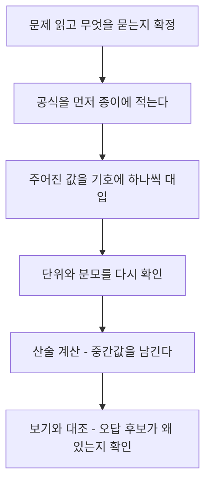

<Callout type="warning">
  **먼저 읽어 주세요.** 이 편의 문제는 실제 기출을 그대로 복제한 것이 아니라, **같은 개념·같은 난이도로 재구성한 문항**입니다. 기출 중 정답이 모호하거나 조건이 부족했던 문항은 조건을 명확히 다듬어 새로 출제했습니다. 그러므로 "이 숫자가 시험에 그대로 나온다"가 아니라 "**이 계산 절차가 시험에 나온다**"로 읽어 주세요.
</Callout>

## 이 편을 이렇게 쓰세요

계산 문제는 필기에서 **버리면 안 되는 문제**입니다. 개념 문제는 애매한 표현 때문에 헷갈릴 수 있지만, 계산 문제는 공식만 정확히 알면 **정답이 하나로 확정**됩니다. 즉 계산 문제는 이 시험에서 가장 확실하게 점수를 챙길 수 있는 구간입니다.

문제를 먼저 풀고 해설을 보는 것도 좋지만, 이 편은 **해설을 읽는 것 자체가 학습**이 되도록 썼습니다. 맞힌 문제도 해설의 "오답 보기가 어디서 나온 값인지"까지 읽어 주세요. 시험장에서 마주칠 함정이 바로 그 값들입니다.

## 1. 공식 요약 — 이 편에 나오는 모든 공식

계산 문제를 풀 때 가장 먼저 하는 일은 **공식을 정확히 떠올리는 것**입니다. 여기서 한 번에 정리합니다. 각 공식 아래에 기호의 뜻을 붙였으니, 기호가 낯설면 반드시 확인하고 넘어가세요.

### 1-1. 기술통계(Descriptive Statistics)

**평균**(mean, 산술평균):

$$
\bar{x} = \frac{1}{n}\sum_{i=1}^{n} x_i
$$

- $\bar{x}$ (엑스바): 표본평균. 자료 전체를 대표하는 중심값입니다.
- $\sum$ (시그마): "모두 더하라"는 기호입니다.
- $n$: 자료의 개수(표본 크기).
- $x_i$: $i$번째 관측값.

**중앙값**(median): 값을 **크기순으로 정렬**한 뒤 한가운데 오는 값. 개수가 짝수면 가운데 두 값의 평균입니다. **최빈값**(mode): 가장 **자주 나온** 값. 가장 큰 값이 아닙니다.

**불편표본분산**(unbiased sample variance):

$$
s^2 = \frac{1}{n-1}\sum_{i=1}^{n}(x_i - \bar{x})^2
$$

- $s^2$: 표본분산. 자료가 평균에서 얼마나 흩어져 있는지를 나타냅니다.
- $n-1$: **자유도**(degrees of freedom). 표본으로 모집단 분산을 추정할 때 $n$이 아니라 $n-1$로 나눕니다. **필기에서 가장 자주 나오는 함정입니다.**

**표준편차**(standard deviation):

$$
s = \sqrt{s^2}
$$

- 분산에 제곱근(square root)을 씌운 값입니다. 단위가 원자료와 같아져서 해석하기 쉽습니다.

**사분위범위**(IQR, Interquartile Range):

$$
IQR = Q_3 - Q_1
$$

- $Q_1$ (제1사분위수): 아래에서 25퍼센트 지점의 값.
- $Q_3$ (제3사분위수): 아래에서 75퍼센트 지점의 값.
- 상자그림(box plot)에서 상자의 **폭**에 해당하며, 이상치 판정 경계는 `Q1 - 1.5×IQR` 아래와 `Q3 + 1.5×IQR` 위입니다.

**변동계수**(CV, Coefficient of Variation):

$$
CV = \frac{s}{\bar{x}}
$$

- 표준편차를 평균으로 나눈 **상대적** 산포입니다. 단위가 다르거나 평균 규모가 크게 다른 두 집단의 흩어짐을 비교할 때 씁니다. 보통 백분율로 보고합니다.

**왜도**(skewness, 비대칭도) 방향 판단: 평균·중앙값·최빈값의 **순서**로 읽습니다.

| 순서 | 왜도 | 꼬리 방향 | 예시 |
| --- | --- | --- | --- |
| 최빈값 &lt; 중앙값 &lt; 평균 | 양의 왜도(오른쪽 왜도) | 오른쪽으로 긴 꼬리 | 소득, 재산 |
| 평균 &lt; 중앙값 &lt; 최빈값 | 음의 왜도(왼쪽 왜도) | 왼쪽으로 긴 꼬리 | 만점에 몰린 쉬운 시험 |
| 세 값이 거의 같음 | 대칭 | 좌우 대칭 | 성인 키 |

### 1-2. 확률·분포(Probability and Distributions)

**이항분포**(Binomial Distribution) $B(n, p)$:

$$
E[X] = np
$$

$$
Var[X] = np(1-p)
$$

- $n$: 시행 횟수(고정).
- $p$: 각 시행에서 성공할 확률.
- $E[X]$: 기대값(평균). $Var[X]$: 분산.
- 조건: 시행 횟수가 **고정**, 각 시행이 **독립**, 성공확률이 **일정**.

**기대값**(expected value, 이산형):

$$
E[X] = \sum_i x_i \cdot P(x_i)
$$

- 각 값에 그 값이 나올 **확률을 가중치로 곱해** 더합니다. 단순 산술평균이 아닙니다.

**조건부확률**(conditional probability)과 **베이즈 정리**(Bayes Theorem):

$$
P(A \mid B) = \frac{P(A \cap B)}{P(B)}
$$

$$
P(D \mid +) = \frac{P(+\mid D)\,P(D)}{P(+\mid D)\,P(D) + P(+\mid D^c)\,P(D^c)}
$$

- $P(A \mid B)$: $B$가 일어났다는 조건에서 $A$가 일어날 확률. 세로줄 기호는 "주어졌을 때"로 읽습니다.
- $D$: 질병 보유, $D^c$: 질병 없음, $+$: 검사 양성.
- $P(+\mid D)$: **민감도**(sensitivity). $P(-\mid D^c)$: **특이도**(specificity), 따라서 $P(+\mid D^c) = 1 -$ 특이도.
- 분모는 "양성이 나올 **모든** 경로"의 합입니다. 진짜 환자의 양성과 건강한 사람의 위양성을 **둘 다** 더해야 합니다.

**분포 판별 요령:**

| 상황 | 분포 | 결정적 단서 |
| --- | --- | --- |
| 고정된 $n$번 시행, 복원(또는 매우 큰 모집단) | 이항분포 | 성공확률이 매 시행 동일 |
| 유한 모집단에서 **비복원** 추출 | 초기하분포(Hypergeometric) | 뽑을수록 남은 구성이 바뀜 |
| 단위 시간·단위 면적당 발생 **건수** | 포아송분포(Poisson) | 평균 발생률 람다 하나만 주어짐 |
| 사건과 사건 사이의 **대기 시간** | 지수분포(Exponential) | 연속형 시간 |

포아송분포는 **평균과 분산이 모두 람다로 같습니다.** 이 성질 자체가 자주 출제됩니다.

**표준화**(standardization, z점수):

$$
z = \frac{x - \mu}{\sigma}
$$

- $\mu$ (뮤): 모평균. $\sigma$ (시그마): 모표준편차.
- 의미: "이 값은 평균에서 **표준편차 몇 개만큼** 떨어져 있는가". 단위가 사라지므로 서로 다른 시험 점수를 비교할 수 있습니다.

### 1-3. 추론·검정(Inference and Hypothesis Testing)

**표준오차**(SE, Standard Error):

$$
SE = \frac{\sigma}{\sqrt{n}}
$$

- 표본평균이 표본마다 얼마나 흔들리는지를 나타냅니다. 분모는 $n$이 아니라 $\sqrt{n}$ (루트 $n$)입니다. **여기서 제곱근을 빠뜨리는 실수가 매우 흔합니다.**

**신뢰구간**(confidence interval, 모평균, 대표본):

$$
\bar{x} \pm z_{\alpha/2} \cdot SE
$$

- 95퍼센트 신뢰구간이면 $z_{\alpha/2} = 1.96$, 99퍼센트면 $2.58$을 씁니다.
- 해석: "이 구간에 모평균이 있을 확률이 95퍼센트"가 아니라, "**같은 절차를 반복하면 만들어지는 구간들 중 95퍼센트가 모평균을 포함한다**"입니다.

**t통계량**(t-statistic, 단일표본):

$$
t = \frac{\bar{x} - \mu_0}{s / \sqrt{n}}
$$

- $\mu_0$: 귀무가설이 주장하는 평균값.
- 분자는 "관측된 차이", 분모는 "그 차이가 우연히 생길 만한 크기". 즉 t값은 **차이를 잡음 크기로 나눈 비율**입니다.

**오류의 종류:**

| 구분 | 실제 귀무가설이 참 | 실제 귀무가설이 거짓 |
| --- | --- | --- |
| 귀무가설 기각 | **제1종 오류**(알파) | 옳은 판단(검정력) |
| 귀무가설 기각 못 함 | 옳은 판단 | **제2종 오류**(베타) |

- 제1종 오류: 아무 효과도 없는데 "효과 있다"고 선언. 유의수준 알파가 이 오류의 허용 한도입니다.
- 제2종 오류: 실제로 효과가 있는데 놓침.

**p값**(p-value): 귀무가설이 참이라고 가정했을 때, **관측된 것만큼 또는 그보다 극단적인 결과가 나올 확률**입니다. `p값 &lt; 유의수준`이면 귀무가설을 기각합니다. **p값은 "귀무가설이 참일 확률"이 아닙니다.** 이 오해가 보기로 자주 등장합니다.

### 1-4. 거리와 유사도(Distance and Similarity)

두 점 $A = (a_1, a_2, \ldots, a_k)$와 $B = (b_1, b_2, \ldots, b_k)$에 대해,

**유클리드 거리**(Euclidean distance):

$$
d_E = \sqrt{\sum_{i=1}^{k}(a_i - b_i)^2}
$$

**맨해튼 거리**(Manhattan distance):

$$
d_M = \sum_{i=1}^{k}|a_i - b_i|
$$

**민코프스키 거리**(Minkowski distance):

$$
d_p = \left(\sum_{i=1}^{k}|a_i - b_i|^p\right)^{1/p}
$$

- $p = 1$이면 맨해튼, $p = 2$이면 유클리드가 됩니다. 즉 민코프스키는 두 거리를 아우르는 **일반형**입니다.

**코사인 유사도**(cosine similarity):

$$
\cos\theta = \frac{A \cdot B}{\|A\|\,\|B\|}
$$

- $A \cdot B$: 두 벡터의 **내적**. 성분끼리 곱해서 모두 더합니다.
- $\|A\|$: 벡터 $A$의 **크기**(norm). 각 성분을 제곱해 더한 뒤 제곱근을 씌웁니다.
- 값은 0부터 1 사이(음수 성분이 없을 때). 1이면 방향이 완전히 같습니다. **크기가 아니라 방향만** 봅니다.

### 1-5. 분류 평가지표(Classification Metrics)

혼동행렬(confusion matrix)의 네 칸:

| 구분 | 예측 양성 | 예측 음성 |
| --- | --- | --- |
| **실제 양성** | TP(True Positive) | FN(False Negative) |
| **실제 음성** | FP(False Positive) | TN(True Negative) |

$$
\text{정확도(Accuracy)} = \frac{TP + TN}{TP + TN + FP + FN}
$$

$$
\text{정밀도(Precision)} = \frac{TP}{TP + FP}
$$

$$
\text{재현율(Recall)} = \frac{TP}{TP + FN}
$$

$$
\text{특이도(Specificity)} = \frac{TN}{TN + FP}
$$

$$
F_1 = \frac{2 \times \text{정밀도} \times \text{재현율}}{\text{정밀도} + \text{재현율}}
$$

- **분모가 핵심입니다.** 정밀도는 "**예측**해서 양성이라 한 것들" 중에서, 재현율은 "**실제** 양성인 것들" 중에서 맞힌 비율입니다.
- F1은 **조화평균**(harmonic mean)입니다. 산술평균이 아닙니다. 조화평균은 두 값 중 **작은 쪽에 끌려가므로**, 한쪽만 높은 모델을 걸러냅니다.
- **AUC**(Area Under the ROC Curve): ROC 곡선 아래 면적. 0.5는 **무작위 추측 수준**, 1.0은 완벽한 분류입니다. 0.5 미만이면 예측을 뒤집는 게 나은 상태입니다.

### 1-6. 회귀 평가지표(Regression Metrics)

$$
MSE = \frac{1}{n}\sum_{i=1}^{n}(y_i - \hat{y}_i)^2
$$

$$
RMSE = \sqrt{MSE}
$$

$$
MAE = \frac{1}{n}\sum_{i=1}^{n}|y_i - \hat{y}_i|
$$

$$
MAPE = \frac{100}{n}\sum_{i=1}^{n}\left|\frac{y_i - \hat{y}_i}{y_i}\right|
$$

- $y_i$: 실제값, $\hat{y}_i$ (와이햇): 예측값.
- MSE(Mean Squared Error, 평균제곱오차)는 오차를 **제곱**하므로 큰 오차에 민감합니다. 단위는 원자료의 제곱입니다.
- RMSE(Root Mean Squared Error)는 제곱근을 씌워 단위를 원자료와 맞춘 값입니다.
- MAE(Mean Absolute Error, 평균절대오차)는 **절댓값**을 씁니다. 부호를 살려서 더하면 오차가 상쇄돼 0이 나올 수 있습니다.
- MAPE(Mean Absolute Percentage Error)는 오차를 **실제값 대비 비율**로 봅니다. 실제값이 0이면 계산이 불가능합니다.

**제곱합 분해와 결정계수:**

$$
SST = SSR + SSE
$$

$$
R^2 = \frac{SSR}{SST} = 1 - \frac{SSE}{SST}
$$

$$
R^2_{adj} = 1 - (1 - R^2)\frac{n-1}{n-p-1}
$$

- SST(Total Sum of Squares, 총제곱합): 실제값이 평균에서 얼마나 흩어졌는가.
- SSR(Regression Sum of Squares, 회귀제곱합): 그중 모형이 **설명한** 부분.
- SSE(Error Sum of Squares, 잔차제곱합): 모형이 **설명하지 못한** 부분.
- $R^2$: 설명된 비율. 0부터 1 사이입니다.
- $R^2_{adj}$ (수정결정계수): $n$은 표본 크기, $p$는 설명변수 개수. 쓸모없는 변수를 넣으면 **오히려 값이 떨어집니다.** 이 성질이 출제 포인트입니다.

### 1-7. 군집·차원축소·연관규칙

**PCA 설명분산비율**(explained variance ratio):

$$
\text{설명분산비율}_k = \frac{\lambda_k}{\sum_{j} \lambda_j}
$$

- $\lambda_k$ (람다): $k$번째 주성분의 **고윳값**(eigenvalue). 그 주성분이 담고 있는 분산의 크기입니다.
- 분모는 **모든** 고윳값의 합입니다. 누적 설명분산은 앞에서부터 차례로 더해 나갑니다.

**실루엣 계수**(silhouette coefficient):

$$
s(i) = \frac{b(i) - a(i)}{\max\{a(i),\, b(i)\}}
$$

- $a(i)$: 점 $i$가 **자기 군집 안** 다른 점들과의 평균 거리(응집도, 작을수록 좋음).
- $b(i)$: 점 $i$가 **가장 가까운 다른 군집**의 점들과의 평균 거리(분리도, 클수록 좋음).
- 값은 $-1$부터 $1$ 사이. 1에 가까울수록 군집이 잘 나뉜 것입니다. 분모는 두 값 중 **큰 쪽**입니다.

**연관규칙**(association rule) $A \rightarrow B$:

$$
\text{지지도(Support)} = \frac{n(A \cap B)}{N}
$$

$$
\text{신뢰도(Confidence)} = \frac{n(A \cap B)}{n(A)}
$$

$$
\text{향상도(Lift)} = \frac{\text{신뢰도}}{P(B)}
$$

- $N$: 전체 거래 수, $n(A)$: $A$를 포함한 거래 수.
- 지지도의 분모는 **전체 거래**, 신뢰도의 분모는 **A를 포함한 거래**입니다. 이 분모 차이가 출제 포인트입니다.
- 향상도가 1이면 A와 B는 **독립**(관계 없음), 1보다 크면 양의 관계, 1보다 작으면 음의 관계입니다.

## 2. 계산 문제 푸는 순서

시험장에서는 시간이 부족하고 마음이 급합니다. 순서를 미리 정해 두면 실수가 크게 줄어듭니다.

```mermaid
graph TD
  A[문제 읽고 무엇을 묻는지 확정] --> B[공식을 먼저 종이에 적는다]
  B --> C[주어진 값을 기호에 하나씩 대입]
  C --> D[단위와 분모를 다시 확인]
  D --> E[산술 계산 - 중간값을 남긴다]
  E --> F[보기와 대조 - 오답 후보가 왜 있는지 확인]
```

1. **무엇을 묻는지 확정한다.** "분산인가 표준편차인가", "정밀도인가 재현율인가"를 먼저 못 박습니다.
2. **공식을 먼저 적는다.** 값을 보면서 공식을 떠올리면 유도되기 쉽습니다. 값을 보기 전에 공식부터 적으세요.
3. **값을 기호에 대입한다.** $n$, $p$, $\bar{x}$ 각각에 무엇이 들어가는지 문제 옆에 적습니다.
4. **단위와 분모를 확인한다.** 백분율인가 소수인가, 분모가 $n$인가 $n-1$인가, $n$인가 $\sqrt{n}$인가.
5. **중간값을 남기며 계산한다.** 한 번에 계산기로 밀지 말고 단계를 남기면 검산이 쉽습니다.
6. **보기와 대조한다.** 내 답이 보기에 없으면 대개 4번(분모)에서 틀린 것입니다.

### 계산 문제에서 자주 틀리는 함정 다섯 가지

1. **표본분산의 분모는 $n$이 아니라 $n-1$이다.** "표본"이라는 단어가 보이면 자유도를 의심하세요.
2. **표준오차의 분모는 $n$이 아니라 $\sqrt{n}$이다.** 표준편차와 표준오차를 같은 것으로 쓰면 신뢰구간이 통째로 틀립니다.
3. **F1은 조화평균이지 산술평균이 아니다.** 정밀도와 재현율을 더해 2로 나눈 값은 항상 F1보다 큽니다.
4. **정밀도와 재현율은 분모가 다르다.** 정밀도는 `TP+FP`, 재현율은 `TP+FN`입니다. 세로로 보느냐 가로로 보느냐의 차이입니다.
5. **분산과 표준편차를 바꿔 쓴다.** 문제가 분산을 물었는데 제곱근을 씌운 값을 고르거나 그 반대인 경우가 매우 흔합니다.

한 가지 예를 손으로 풀어 보겠습니다. 어떤 점의 응집도 $a = 2$, 분리도 $b = 5$일 때 실루엣 계수는,

$$
s = \frac{5 - 2}{\max\{2,\,5\}} = \frac{3}{5} = 0.6
$$

분모에 $a$인 2를 쓰면 $3 \div 2 = 1.5$가 나오는데, 실루엣 계수는 1을 넘을 수 없으므로 **답이 나온 순간 틀렸다는 걸 알 수 있습니다.** 이렇게 값의 **범위**를 알고 있으면 자기 검산이 됩니다.

## 핵심 정리

- 계산 문제는 정답이 하나로 확정되는 구간이므로 **가장 확실한 득점원**입니다. 공식을 먼저 적고 값을 대입하는 순서를 고정하세요.
- 오답 보기의 대부분은 **분모를 잘못 쓴 값**입니다. $n$ 대 $n-1$, $n$ 대 $\sqrt{n}$, `TP+FP` 대 `TP+FN`, 전체 거래 대 A 포함 거래를 항상 확인하세요.
- 지표에는 **값의 범위**가 있습니다. 상관계수와 실루엣은 $-1$부터 1, 결정계수와 AUC와 각종 분류지표는 0부터 1입니다. 범위를 벗어난 값이 나오면 계산이 틀린 것입니다.
- F1은 **조화평균**, 기대값은 **확률 가중합**, MAE는 **절댓값 평균**입니다. 산술평균으로 대충 계산하면 반드시 함정에 걸립니다.
- 값을 구한 뒤에는 **말로 해석**하는 연습을 하세요. 최근 회차는 "값을 구하라"보다 "이 값이 무엇을 뜻하는가"를 묻는 비중이 커지고 있습니다.

## 확인 문제

<Quiz
  questionNumber={1}
  question={"자료 4, 7, 7, 9, 13, 20의 평균, 중앙값, 최빈값을 옳게 짝지은 것은?"}
  options={["평균 10, 중앙값 8, 최빈값 20","평균 8, 중앙값 8, 최빈값 7","평균 10, 중앙값 8, 최빈값 7","평균 10, 중앙값 9, 최빈값 7"]}
  correctAnswer={3}
  explanation={"평균은 값을 모두 더해 개수로 나눈다. 4+7+7+9+13+20 = 60이고 자료는 6개이므로 60 ÷ 6 = 10이다. 중앙값은 크기순으로 정렬한 뒤 한가운데 값인데, 자료가 짝수 개(6개)이므로 3번째와 4번째 값의 평균을 쓴다. 정렬하면 4, 7, 7, 9, 13, 20이고 3번째는 7, 4번째는 9이므로 (7+9) ÷ 2 = 8이다. 최빈값은 가장 자주 나온 값이므로 두 번 등장한 7이다. 이 문제가 노리는 함정은 두 가지다. 첫째, 개수가 짝수일 때 가운데 두 값을 평균 내지 않고 한쪽만 고르는 실수. 둘째, 최빈값을 가장 큰 값으로 착각하는 실수다. 변형으로 자료 개수가 홀수로 나오면 정렬 후 정확히 가운데 하나가 중앙값이 되고, 모든 값이 한 번씩만 나오면 최빈값은 없다고 답해야 한다."}
/>

<Quiz
  questionNumber={2}
  question={"표본 자료 2, 4, 4, 6, 9의 불편표본분산은 얼마인가?"}
  options={["5.6","7","약 2.65","28"]}
  correctAnswer={2}
  explanation={"먼저 평균을 구한다. 2+4+4+6+9 = 25이고 자료는 5개이므로 평균은 25 ÷ 5 = 5다. 각 값에서 평균을 뺀 편차는 순서대로 -3, -1, -1, 1, 4다. 편차를 제곱하면 9, 1, 1, 1, 16이고 이를 모두 더한 편차제곱합은 9+1+1+1+16 = 28이다. 불편표본분산은 편차제곱합을 자유도인 n-1로 나누므로 28 ÷ (5-1) = 28 ÷ 4 = 7이다. 이 문제가 노리는 함정은 명확하다. 표본분산은 n이 아니라 n-1로 나눈다. n으로 나누면 모분산 공식이 되어 값이 작아지고, 이는 모집단 분산을 과소추정하게 만들기 때문에 표본에서는 자유도로 나눈다. 변형으로 표준편차를 물으면 7의 제곱근인 약 2.65를 답해야 하고, 문제에 모집단 전체 자료라는 말이 나오면 그때는 n으로 나눈다."}
/>

<Quiz
  questionNumber={3}
  question={"A집단은 평균 40, 표준편차 6이고 B집단은 평균 250, 표준편차 25다. 두 집단의 상대적 산포를 비교한 설명으로 가장 적절한 것은?"}
  options={["두 집단의 변동계수는 각각 6과 25이므로 B집단이 더 흩어져 있다","표준편차가 25로 더 큰 B집단이 항상 더 흩어져 있다","A집단 10퍼센트, B집단 15퍼센트로 B집단의 상대적 산포가 더 크다","A집단 15퍼센트, B집단 10퍼센트로 A집단의 상대적 산포가 더 크다"]}
  correctAnswer={4}
  explanation={"변동계수는 표준편차를 평균으로 나눈 값이다. A집단은 6 ÷ 40 = 0.15이므로 15퍼센트이고, B집단은 25 ÷ 250 = 0.1이므로 10퍼센트다. 따라서 평균 규모를 감안한 상대적 흩어짐은 A집단이 더 크다. 이 문제가 노리는 함정은 표준편차만 보고 비교하는 것이다. 표준편차는 단위와 평균 규모에 그대로 영향을 받으므로, 평균이 250인 집단은 자연히 표준편차도 커지기 마련이다. 그래서 규모가 다른 집단을 비교할 때는 반드시 평균으로 나눠 단위를 없앤 변동계수를 쓴다. 변형으로 단위가 다른 두 변수, 예를 들어 키(센티미터)와 몸무게(킬로그램)의 산포를 비교하라는 문제가 나오면 역시 변동계수가 답이다."}
/>

## 참고 자료

- [한국데이터산업진흥원 - 빅데이터분석기사 자격시험 안내](https://www.dataq.or.kr/www/sub/a_07.do)
- [SQLDpass - 빅데이터분석기사 필기 기출·복원](https://www.sqldpass.com/past-exams?cert=BIGDATA_ANALYST)
- [Statistics Playbook - 빅데이터분석기사 완전 가이드](https://statisticsplaybook.com/big-data-analysis-engineer-guide/)
- [Inflearn 가이드 - 빅데이터분석기사 어떻게 준비해야 할까?](https://www.inflearn.com/pages/bigdata-analysis-engineer-guide)
