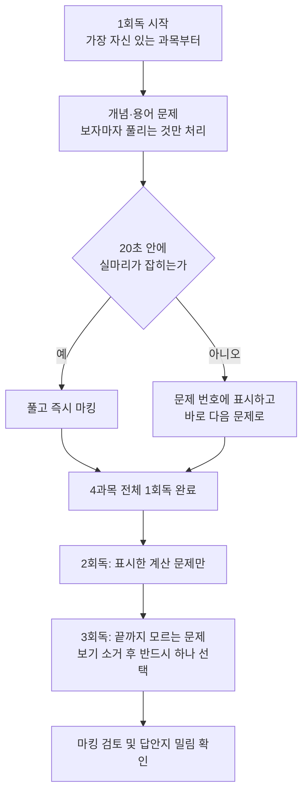

<Callout type="warning">
  **이 편의 문제는 실제 기출을 그대로 복제한 것이 아닙니다.** 공개된 회차의 출제 범위와 유형을 분석해, **같은 개념·같은 난이도**로 새로 재구성한 문항입니다. 원문 기출 중 정답 근거가 모호하거나 조건이 불충분했던 문항은 조건을 명확히 다듬어 다시 만들었습니다. 따라서 이 편의 문항 번호는 실제 시험 문항 번호와 대응하지 않으며, 숫자·상황·보기 배열도 모두 새로 구성한 것입니다.
</Callout>

<Callout type="info">
  **이번 문서의 목표:** "몇 과목에서 몇 문제를 맞혀야 붙는가"를 숫자로 확정하고, 그 목표에 맞는 풀이 순서·시간 배분·오답 관리 방법을 세운 뒤, 4과목 통합 모의 24문항으로 자기 과목별 정답률을 직접 측정할 수 있게 된다.
</Callout>

## 1. 시험 구조 복기 — 합격은 두 개의 관문이다

마지막 편이므로 규칙부터 다시 못 박습니다. 규칙을 흐릿하게 아는 상태로 시험장에 가면 "지금 몇 문제를 맞힌 상태인가"를 판단하지 못해 시간 배분이 무너집니다.

> **쉽게 말하면:** 이 시험은 총점만 높으면 되는 시험이 아니라, **모든 과목이 최소선을 넘고 + 전체 평균선도 넘는** 두 관문을 동시에 통과해야 하는 시험입니다.

| 항목 | 내용 |
|------|------|
| 검정 방법 | 객관식 4지선다(사지선다) |
| 과목 수 | 4과목 (분석 기획 / 탐색 / 모델링 / 결과 해석) |
| 문항 수 | 과목당 20문항, 총 80문항 |
| 시험 시간 | 120분 (문항당 평균 90초) |
| 배점 | 과목당 100점 만점, 문항당 5점 |
| 합격 기준 | 전 과목 **40점 이상** 그리고 전 과목 평균 **60점 이상** |

이 표를 문제 수로 번역하면 이렇게 됩니다. 과목당 20문항에 문항당 5점이므로, **한 문제를 맞히면 그 과목 점수가 5점 오릅니다.**

- **과락 기준 40점** = 40 ÷ 5 = **과목당 8문제 이상**
- **평균 기준 60점** = 4과목 총점 240점 이상 = 240 ÷ 5 = **전체 48문제 이상**

$$
\text{과목 점수} = (\text{그 과목 정답 수}) \times 5
$$

- 그 과목 정답 수: 해당 과목 20문항 중 맞힌 개수
- 5: 문항당 배점(점)

$$
\text{평균 점수} = \frac{\text{전체 정답 수} \times 5}{4}
$$

- 전체 정답 수: 80문항 중 맞힌 총 개수
- 4: 과목 수. 총점을 과목 수로 나눠 평균을 낸다

즉 **모든 과목에서 8문제씩(=32문제) 맞히는 것만으로는 부족**합니다. 32문제는 평균 40점이라 평균 기준에서 떨어집니다. 반대로 한 과목에서 18문제를 맞히고 다른 과목에서 7문제만 맞히면, 총합이 아무리 좋아도 그 과목 35점으로 **과락 탈락**입니다.

> **비유:** 네 과목은 "네 개의 문"이고, 각 문에는 키 재기 막대(8문제)가 세워져 있습니다. 네 문을 모두 통과해야 하고, 그 다음 마지막 관문에서 "네 문에서 통과한 사람 수의 평균"(48문제)을 다시 잽니다. 문 하나만 못 넘어도 뒤 관문은 아예 볼 수 없습니다.

## 2. 목표 점수 설계표 — 50문제를 어디서 가져올 것인가

48문제가 최저선이라면, 목표는 반드시 그보다 위여야 합니다. 시험장에서는 아는 문제도 실수로 놓치고, 예상 밖 신유형이 2~3문항 나오기 때문입니다. **여유분 2문제를 얹은 50문제**를 목표로 잡습니다.

| 과목 | 성격 | 목표 정답 수 | 목표 점수 | 근거 |
|------|------|-------------|-----------|------|
| 1과목 분석 기획 | 암기 영역 | 13 / 20 | 65점 | 계산이 거의 없어 외운 만큼 그대로 나온다. 대신 안 외우면 그대로 떨어진다 |
| 2과목 탐색 | 개념 이해 + 계산 | 12 / 20 | 60점 | 전처리·기술통계는 확보 가능, 확률분포·검정에서 2–3문항 손실을 감수 |
| 3과목 모델링 | 원리 이해 | 12 / 20 | 60점 | 알고리즘 종류가 넓어 만점 설계가 비효율. 빈출 알고리즘 위주로 확보 |
| 4과목 결과 해석 | 지표 계산 + 해석 | 13 / 20 | 65점 | 혼동행렬·회귀지표·교차검증이 반복 출제되어 가장 회수율이 높다 |
| **합계** | – | **50 / 80** | **평균 62.5점** | 과락선 8문제를 모든 과목에서 5문제 이상 상회 |

### 왜 이렇게 배분하는가

배분의 원칙은 "**공부한 시간 대비 문제가 가장 확실하게 늘어나는 과목에 목표를 높게 잡는다**"입니다.

1. **1과목을 13문제로 높게 잡는 이유** — 1과목은 빅데이터 특성(3V), 개인정보·비식별, 데이터 유형, 저장 기술, 분석 방법론처럼 **정답이 딱 떨어지는 암기 항목**이 대부분입니다. 계산이 없어 시간도 적게 듭니다. 외우기만 하면 회수율이 가장 높은 구간입니다.
2. **4과목도 13문제로 높게 잡는 이유** — 4과목의 핵심인 혼동행렬(confusion matrix, 정오분류표)·회귀 평가지표·교차검증(cross validation)은 **매 회차 거의 같은 형태로 반복**됩니다. 공식 대여섯 개만 정확히 외우면 계산 문제를 확정적으로 가져올 수 있습니다.
3. **2·3과목을 12문제로 낮추는 이유** — 2과목의 확률분포·가설검정, 3과목의 딥러닝·시계열·다변량 기법은 **범위가 넓고 신유형이 자주 끼어듭니다.** 여기서 만점을 노리면 시간 대비 손해입니다. 빈출 구간만 확실히 잡고 나머지는 버리는 편이 총점에 유리합니다.

> **자주 틀리는 점:** "평균 60점만 넘기면 되니까 제일 자신 있는 과목을 만점으로 만들자"는 계획은 위험합니다. 한 과목 만점(20문제)을 만드는 데 드는 시간이면, 약한 과목 두 개를 8문제에서 12문제로 끌어올릴 수 있습니다. **평균은 총합으로 만들되, 과락은 개별로 막아야** 합니다.

## 3. 풀이 순서 전략 — 순서대로 풀지 않는다

시험지는 1과목부터 4과목 순으로 인쇄되어 있지만, **그 순서대로 풀어야 할 의무는 없습니다.** 실제로 순서대로 풀다가 2과목 계산 문제에 붙잡혀 4과목을 통째로 날리는 사례가 가장 흔한 실패입니다.

### 규칙 네 가지

1. **자신 있는 과목부터 시작한다.** 초반 10분에 맞은 문제가 쌓이면 심리적 여유가 생기고, 뒤에 남는 어려운 문제에 쓸 수 있는 시간도 정확히 계산됩니다. 보통 1과목(암기) 또는 4과목(지표 계산)으로 시작하는 사람이 많습니다.
2. **계산 문제는 1회독에서 표시하고 넘긴다.** 계산 문제 한 문항이 3~4분을 잡아먹으면, 그 시간에 풀 수 있었을 개념 문제 두세 개를 잃습니다. 배점은 똑같이 5점입니다.
3. **문항당 평균 90초를 몸으로 기억한다.** 120분 = 7200초를 80문항으로 나누면 90초입니다. 마킹·검토용 15분을 미리 빼면 실제로 쓸 수 있는 시간은 105분 = 6300초, 문항당 **약 79초**입니다.
4. **답을 비우지 않는다.** 4지선다이므로 찍어도 기대 정답률이 25퍼센트(0.25)입니다. 보기 두 개를 소거하면 50퍼센트(0.5)까지 오릅니다. 오답 감점이 없으므로 빈칸은 무조건 손해입니다.

| 구간 | 소요 시간 | 하는 일 |
|------|-----------|---------|
| 1회독 | 약 65분 | 80문항 훑으며 즉답 가능 문항만 처리, 나머지는 표시 |
| 2회독 | 약 30분 | 표시한 계산·해석 문항 집중 공략 |
| 3회독 | 약 10분 | 끝내 모르는 문항 보기 소거 후 선택 |
| 마무리 | 약 15분 | 마킹 검토, 답안지 밀림 확인, 빈칸 유무 확인 |

> **자주 틀리는 점:** 마킹을 마지막에 몰아서 하면 시간이 모자랄 때 답안지가 통째로 비게 됩니다. **문제를 푼 즉시 그 문항을 마킹**하고, 마지막 15분은 "새로 마킹"이 아니라 "검토"에만 씁니다.

## 4. 과락 방지 — 1과목이 가장 위험한 이유

과락으로 떨어지는 사람의 압도적 다수가 **1과목(빅데이터 분석 기획)** 에서 무너집니다. 이유는 역설적입니다.

1과목은 계산이 없어 **쉬워 보입니다.** 그래서 공부 순서에서 뒤로 밀립니다. 그런데 1과목은 "이해하면 풀리는" 과목이 아니라 **"외웠는가 안 외웠는가"만 묻는 과목**입니다. 데이터 3법의 각 법률이 무엇을 규율하는지, 총계처리와 범주화가 어떻게 다른지, 분석 성숙도 단계 이름이 무엇인지는 논리로 유추할 수 없습니다. 그 결과 2·3·4과목은 개념 이해로 60점을 넘기면서 1과목만 35점으로 탈락하는 일이 생깁니다.

> **쉽게 말하면:** 2·3·4과목은 "몰라도 반쯤 찍어 맞힐 수 있는" 문제가 섞여 있지만, **1과목은 모르면 정말 모릅니다.**

### 1과목 과락 방지 최소 암기 목록

- **빅데이터 특성 5V**: Volume(양), Velocity(속도), Variety(다양성), Veracity(정확성), Value(가치)
- **DIKW 계층**: 데이터(Data) → 정보(Information) → 지식(Knowledge) → 지혜(Wisdom)
- **암묵지와 형식지**: 암묵지에서 형식지로 = 표출화, 형식지에서 암묵지로 = 내면화
- **가트너 분석 유형 순서**: 묘사 → 진단 → 예측 → 처방
- **개인정보 판단**: 개인정보(해당), 가명정보(해당), 익명정보(해당 안 함)
- **데이터 유형**: 정형은 RDBMS, 반정형은 JSON·XML·HTML, 비정형은 이미지·영상·음성
- **저장 기술**: OLTP는 실시간 거래, OLAP는 의사결정 지원, 데이터 레이크는 원본 그대로 대규모 저장
- **분석 과제 유형 4분면**: 대상과 방법을 모두 알면 최적화, 대상만 알면 솔루션, 방법만 알면 통찰, 둘 다 모르면 발견
- **방법론 대응**: KDD의 데이터 마이닝 = CRISP-DM의 모델링 = SEMMA의 모델링

이 아홉 덩어리만 정확히 외워도 1과목에서 8~10문제는 확보됩니다. 과락선(8문제)을 넘기는 최소 보험입니다.

## 5. 오답 노트 작성법 — 틀린 이유를 네 가지로 분류하라

"틀린 문제를 다시 푼다"는 오답 노트는 효과가 거의 없습니다. 같은 문제를 두 번째 풀면 답을 기억하기 때문입니다. 효과가 있는 오답 노트는 **틀린 이유를 유형으로 분류해, 그 유형에 맞는 처방을 붙이는 것**입니다.

| 분류 | 무엇이 일어났는가 | 처방 |
|------|------------------|------|
| 개념 오류 | 정의 자체를 몰랐거나 반대로 알고 있었다 | 해당 개념이 나오는 본문 편으로 돌아가 정의부터 다시 읽는다 |
| 함정 미인지 | 개념은 알았는데 옳지 않은 것을 고르라는 조건, 항상·무조건 같은 단정어를 놓쳤다 | 문제 지문의 조건어에 동그라미 치는 습관을 만든다 |
| 계산 실수 | 공식은 맞았는데 대입·약분·단위에서 틀렸다 | 공식을 쓰고 값을 대입한 중간 식을 반드시 시험지에 적는다 |
| 시간 부족 | 못 풀어서가 아니라 못 봐서 틀렸다 | 1회독에서 넘기는 기준(20초)을 더 엄격하게 지킨다 |

### 분류별 비중이 알려주는 것

오답 20개를 분류했을 때 비중이 어디에 몰리는지가 **다음 일주일에 무엇을 할지**를 결정합니다.

- **개념 오류가 절반 이상** → 아직 문제 풀 단계가 아닙니다. 본문 편을 다시 읽어야 합니다.
- **함정 미인지가 많다** → 지식은 충분합니다. 문제를 읽는 방법만 교정하면 점수가 바로 오릅니다. 가장 회수율이 좋은 상태입니다.
- **계산 실수가 많다** → 공식은 외웠으니, 손으로 푸는 연습량만 늘리면 됩니다.
- **시간 부족이 많다** → 지식·계산 문제가 아니라 운영 문제입니다. 3절의 풀이 순서를 그대로 적용해 봅니다.

> **자주 틀리는 점:** 오답 노트에 문제 전문을 옮겨 적는 것은 시간 낭비입니다. 적어야 할 것은 **"이 문제가 물어본 개념 한 줄"과 "내가 왜 틀렸는지 한 줄"** 두 줄뿐입니다.

## 6. 회차별 출제 경향 — 4개 회차를 나란히 놓고 본 반복 키워드

공개된 네 회차(2023년 6회, 2023년 7회, 2024년 8회, 2025년 10회)의 문항을 과목별로 나열해 비교하면, **회차가 바뀌어도 같은 개념이 옷만 갈아입고 다시 나온다**는 사실이 뚜렷하게 보입니다. 아래 표는 네 회차 모두 또는 세 회차 이상에서 반복 확인된 키워드만 추린 것입니다.

### 1과목 빅데이터 분석 기획

| 반복 키워드 | 어떤 형태로 나오는가 | 회차 등장 |
|-------------|---------------------|-----------|
| 빅데이터 특성 3V·5V | 특성 이름과 의미를 잘못 연결한 보기 고르기 | 6회, 7회, 8회 |
| 개인정보·비식별 조치 | 가명처리·총계처리·마스킹·범주화의 예시 매칭 | 6회, 7회, 8회, 10회 |
| 정형·반정형·비정형 구분 | JSON·XML을 반정형으로, 영상·음성을 비정형으로 분류 | 7회, 8회, 10회 |
| 빅데이터 플랫폼 계층 | 인프라·수집·저장·분석·서비스 계층 중 어디인지 | 7회, 8회, 10회 |
| 저장 기술 대응 | RDBMS, NoSQL(문서·키값·컬럼), HDFS, 데이터웨어하우스 특성 | 6회, 7회, 8회 |
| 분석 방법론·과제 발굴 | CRISP-DM 단계 순서, 하향식과 상향식, 과제 유형 4분면 | 6회, 7회, 8회, 10회 |
| 조직·성숙도·역량 | 집중·기능·분산 구조, 도입–활용–확산–최적화, 하드/소프트 스킬 | 6회, 7회, 10회 |
| 데이터 품질 차원 | 완전성·유효성·일관성·정확성 판정 | 7회, 8회, 10회 |

### 2과목 빅데이터 탐색

| 반복 키워드 | 어떤 형태로 나오는가 | 회차 등장 |
|-------------|---------------------|-----------|
| 결측치·이상치 처리 | 처리 기법 설명 중 옳지 않은 것, IQR 기준 판정 | 6회, 7회, 8회, 10회 |
| 측정 척도 | 명목–서열–등간–비율 구분과 예시 매칭 | 7회, 8회 |
| 스케일링·변환 | 표준화와 최소–최대 정규화 구분, 로그 변환의 목적 | 6회, 7회, 8회 |
| 클래스 불균형 | 언더·오버샘플링과 SMOTE 설명 중 틀린 것 | 8회, 10회 |
| 상관계수 | 피어슨·스피어만·편상관 중 상황에 맞는 것 고르기 | 7회, 8회, 10회 |
| 분포 형태 해석 | 오른쪽 꼬리 분포에서 평균·중앙값·최빈값 순서 | 8회, 10회 |
| 확률분포 | 이항·포아송·초기하 분포의 적용 조건과 평균·분산 | 6회, 7회, 10회 |
| 표본분산·중심극한정리 | 자유도 `n-1`, 표본평균의 분산이 모분산 나누기 n | 6회, 7회, 8회, 10회 |

### 3과목 빅데이터 모델링

| 반복 키워드 | 어떤 형태로 나오는가 | 회차 등장 |
|-------------|---------------------|-----------|
| 회귀 가정·다중공선성 | 선형성·독립성·등분산성·정규성, VIF로 진단 | 6회, 8회, 10회 |
| 결정계수 | 설명된 변동의 비율, 변수 추가 시 증가, 수정결정계수 | 6회, 8회 |
| 규제 기법 | 라쏘(L1)·릿지(L2)·엘라스틱넷의 벌점 형태 구분 | 7회, 10회 |
| 의사결정나무 | 지니 불순도·엔트로피, 가지치기의 목적 | 6회, 8회, 10회 |
| SVM | 마진 최대화, 서포트 벡터, 커널 트릭 | 8회, 10회 |
| PCA·차원축소 | 주성분의 무상관성, 설명 분산 비율 계산 | 8회, 10회 |
| 군집 | 계층적·K평균·DBSCAN 비교, 덴드로그램 절단 | 6회, 8회, 10회 |
| 앙상블 | 배깅은 병렬 복원추출, 부스팅은 순차 오차 보정 | 6회, 8회, 10회 |
| 신경망 | ReLU 출력 계산, 배치 크기, 기울기 소실 | 6회, 7회, 8회, 10회 |

### 4과목 빅데이터 결과 해석

| 반복 키워드 | 어떤 형태로 나오는가 | 회차 등장 |
|-------------|---------------------|-----------|
| 혼동행렬 지표 | 정밀도·재현율·특이도·정확도 정의식 매칭과 계산 | 6회, 8회, 10회 |
| F1 점수 | 정밀도와 재현율의 조화평균 계산 | 10회 |
| ROC·AUC | AUC의 순위 해석, 두 모델 비교 | 8회, 10회 |
| 회귀 평가지표 | MSE·RMSE·MAE·MAPE 식 중 틀린 것 | 8회 |
| 교차검증 | K겹의 회차 수·검증 크기, 홀드아웃, 층화 K겹 | 6회, 8회, 10회 |
| 과적합 진단·방지 | 학습곡선 해석, 조기 종료·드롭아웃·규제 | 6회, 8회, 10회 |
| 파라미터와 하이퍼파라미터 | 학습률·K는 하이퍼파라미터, 가중치는 파라미터 | 6회, 8회, 10회 |
| 시각화 유형 | 시간·공간·관계·비교·분포 시각화와 인포그래픽 | 6회, 8회, 10회 |
| 분석 결과 활용 | 모니터링·재학습 계획, 비즈니스 기여도 평가 | 6회, 8회 |

> **이 표를 어떻게 쓰는가:** 시험 일주일 전에는 새 개념을 넣지 말고, **위 표의 키워드만 골라 확인**합니다. 네 회차 모두에 등장한 키워드(개인정보·비식별, 결측·이상치, 표본분산, 신경망, 혼동행렬)는 이번 회차에도 나온다고 보고 준비하는 것이 합리적입니다.

## 7. 시험 직전 체크리스트

### 시험 1주 전

- 새 교재·새 강의를 시작하지 않습니다. **아는 것을 확실하게 만드는 기간**입니다.
- 6절의 반복 키워드 표를 기준으로 각 과목 빈출 항목을 하루 한 과목씩 훑습니다.
- 계산 공식은 손으로 다시 씁니다. 눈으로 읽으면 시험장에서 재현되지 않습니다. 최소 확보 공식은 여덟 개입니다.
  - 표본분산: 편차 제곱합을 `n-1`로 나눈다
  - 표준화: 관측값에서 평균을 빼고 표준편차로 나눈다
  - 이상치 경계: 제1사분위수에서 IQR의 1.5배를 뺀 값, 제3사분위수에 1.5배를 더한 값
  - 정밀도: TP를 (TP + FP)로 나눈다
  - 재현율: TP를 (TP + FN)으로 나눈다
  - F1: 정밀도와 재현율의 조화평균
  - RMSE: MSE의 제곱근
  - 향상도: 신뢰도를 결과 항목의 지지도로 나눈다
- 이 편의 모의 24문항을 실제 시간(24문항 기준 약 36분)을 재며 풉니다.

### 시험 전날

- 새 문제를 풀지 않습니다. **틀린 문제만 다시 봅니다.**
- 오답 노트의 "개념 오류" 항목만 소리 내어 읽습니다.
- 준비물을 미리 한 봉투에 담습니다. 신분증, 수험표, 검은색 컴퓨터용 사인펜, 여분 펜, 시계.
- 시험장 위치와 이동 시간을 확인하고, 도착 시각을 입실 마감보다 30분 앞으로 잡습니다.
- 수면 시간을 확보합니다. 밤샘으로 얻는 두세 문제보다 **집중력 저하로 잃는 문제가 더 많습니다.**

### 시험 당일

- 입실 후 첫 5분 동안 아무것도 보지 말고 호흡을 고릅니다.
- 시험지를 받으면 **가장 먼저 자신 있는 과목의 페이지를 펼칩니다.**
- 1회독 목표 시각(시작 후 65분)을 시계에 기억해 둡니다.
- 문제를 풀 때마다 즉시 마킹합니다.
- 종료 15분 전 알림이 오면 새 문제 풀이를 멈추고 **빈칸 채우기와 마킹 검토**로 전환합니다.
- 모르는 문제라도 반드시 하나를 고릅니다. 빈칸은 0퍼센트, 찍기는 25퍼센트입니다.

## 핵심 정리

- 합격은 **과목당 8문제(40점) 이상 + 전체 48문제(평균 60점) 이상**이라는 두 조건을 동시에 만족해야 성립한다. 어느 하나만 충족하면 불합격이다.
- 현실적 목표는 **1과목 13 / 2과목 12 / 3과목 12 / 4과목 13, 합계 50문제(평균 62.5점)** 다. 암기 회수율이 높은 1과목과 공식 반복이 확실한 4과목에 목표를 높게 둔다.
- 풀이는 **자신 있는 과목부터 1회독하고, 20초 안에 실마리가 없으면 표시하고 넘긴다.** 문항당 평균 90초, 마킹 검토 15분을 빼면 약 79초다.
- 과락의 최대 위험은 **1과목**이다. 계산이 없어 쉬워 보이지만 모르면 유추가 불가능한 순수 암기 영역이기 때문이다.
- 오답은 **개념 오류·함정 미인지·계산 실수·시간 부족** 네 가지로 분류해야 다음에 무엇을 할지가 결정된다.
- 네 회차를 비교하면 개인정보·비식별, 결측·이상치, 표본분산, 신경망, 혼동행렬 지표는 **매 회차 반복**된다. 직전 일주일은 이 반복 키워드만 확인한다.

## 마무리 복습

아래 24문항은 4과목 통합 모의고사입니다. **과목당 6문항씩** 균등 배분했으며, 각 문제 첫머리에 과목 표시를 붙였습니다. 과목별로 정답 개수를 세어 보십시오. **한 과목에서 3문제 미만이면 그 과목은 실제 시험에서 과락 위험 구간**입니다(6문항 중 3문제는 20문항 중 10문제에 해당하므로, 3문제 미만은 8문제 확보가 불확실하다는 신호입니다).

권장 풀이 시간은 **36분**(문항당 90초)입니다. 시계를 재고 시작하십시오.

<Quiz
  questionNumber={1}
  question="[1과목] 한 제조기업의 숙련 기술자가 오랜 경험으로 체득한 설비 이상 감지 요령을 문서와 점검 매뉴얼로 정리해 전 직원이 공유하게 했다. 지식 변환 관점에서 이 활동에 해당하는 것은?"
  options={['표출화 - 암묵지가 문서나 매뉴얼 형태의 형식지로 드러나는 과정', '공통화 - 암묵지가 다른 사람의 암묵지로 전달되는 과정', '연결화 - 형식지들이 결합해 더 큰 형식지 체계를 이루는 과정', '내면화 - 형식지를 학습해 개인의 암묵지로 체화하는 과정']}
  correctAnswer={1}
  explanation="암묵지는 개인이 경험으로 체득했지만 겉으로 드러나지 않는 지식이고, 형식지는 문서나 매뉴얼처럼 외부로 표출되어 여러 사람이 공유할 수 있는 지식이다. 문제의 상황은 개인의 경험적 요령(암묵지)을 매뉴얼(형식지)로 바꾼 것이므로 표출화다. 이 문제가 노리는 함정은 표출화와 내면화의 방향을 반대로 외우는 것이다. 화살표 방향을 이름으로 기억하라. 암묵지에서 밖으로 나오면 표출, 형식지가 안으로 들어가면 내면이다. 변형 대비로는 상황 문장에서 시작점이 사람의 머릿속인지 문서인지를 먼저 찾는 습관이 유효하다."
  optionExplanations={['개인의 경험적 요령이라는 암묵지가 매뉴얼이라는 형식지로 바뀌었으므로 표출화가 맞다.', '공통화는 도제식 어깨너머 학습처럼 암묵지가 암묵지로 전달되는 과정을 가리키며 문서화가 없다.', '연결화는 여러 문서·데이터를 조합해 새 문서 체계를 만드는 과정으로 이미 형식지인 것끼리의 결합이다.', '내면화는 매뉴얼을 읽고 익혀 몸에 배게 하는 과정으로 이 문제와는 방향이 정반대다.']}
/>

<Quiz
  questionNumber={2}
  question="[1과목] 이탈 위험이 높은 고객을 식별한 통신사가 그 고객에게 어떤 요금제를 어떤 순서로 제안해야 이탈을 가장 크게 줄일 수 있는지까지 산출했다. 가트너의 비즈니스 분석 유형 중 어디에 해당하는가?"
  options={['묘사분석 - 과거에 무슨 일이 있었는지 파악', '진단분석 - 그 일이 왜 일어났는지 원인 파악', '예측분석 - 앞으로 무슨 일이 일어날지 예상', '처방분석 - 무엇을 해야 하는지 최적 행동 제시']}
  correctAnswer={4}
  explanation="가트너 분석 유형은 묘사, 진단, 예측, 처방 순으로 난이도와 가치가 올라간다. 문제의 상황은 이탈 예측에서 멈추지 않고 어떤 행동을 취해야 하는지까지 산출했으므로 처방분석이다. 이 문제가 노리는 함정은 이탈 위험 식별이라는 표현만 보고 예측분석을 고르는 것이다. 문장 뒤쪽의 어떤 조치를 어떤 순서로라는 부분이 처방을 가리키는 결정적 단서다. 변형 대비법은 문장 끝에 나오는 산출물이 사실인지, 원인인지, 미래값인지, 행동 지침인지를 확인하는 것이다."
  optionExplanations={['묘사분석은 지난달 이탈률이 몇 퍼센트였는지처럼 과거 사실을 요약하는 단계다.', '진단분석은 이탈이 늘어난 원인이 요금 인상인지 품질 문제인지를 밝히는 단계다.', '예측분석은 이 고객이 이탈할 확률이 얼마인지를 산출하는 단계로 여기서 멈추면 처방이 아니다.', '무엇을 해야 하는지 최적 행동까지 제시했으므로 가장 상위 단계인 처방분석이 맞다.']}
/>

<Quiz
  questionNumber={3}
  question="[1과목] 어느 병원이 환자 이름을 임의 코드로 바꾼 분석용 파일을 만들었다. 이 파일만으로는 개인을 알아볼 수 없지만, 별도 금고에 보관한 대응표와 결합하면 다시 식별할 수 있다. 이 정보의 성격에 대한 설명으로 옳은 것은?"
  options={['가명정보이며 여전히 개인정보에 해당해 보호법의 적용을 받는다', '익명정보이므로 개인정보 보호법의 적용을 받지 않는다', '통계 목적이면 어떤 정보든 개인정보에서 완전히 제외된다', '대응표를 삭제하지 않아도 익명정보로 분류할 수 있다']}
  correctAnswer={1}
  explanation="가명정보는 개인정보의 일부를 삭제하거나 대체해 그 자체로는 개인을 알아볼 수 없게 처리했지만, 추가 정보(대응표)와 결합하면 다시 식별할 수 있는 정보다. 따라서 여전히 개인정보에 해당하며 보호법의 적용을 받는다. 반면 익명정보는 다른 정보와 결합해도 개인을 알아볼 수 없어 개인정보에 해당하지 않는다. 이 문제가 노리는 함정은 이름을 지웠으니 익명이라고 단정하는 것이다. 판단 기준은 이름을 지웠는지가 아니라 복원 가능한 추가 정보가 존재하는지다. 변형 문항에서는 통계작성이나 과학적 연구 목적이면 동의 없이 처리할 수 있다는 사실과, 그렇다고 개인정보가 아니게 되는 것은 아니라는 사실을 구분해 물어본다."
  optionExplanations={['재식별 가능한 추가 정보가 존재하므로 가명정보이며 개인정보에 해당한다.', '대응표로 재식별이 가능하므로 익명정보가 아니다. 익명정보는 결합해도 복원되지 않아야 한다.', '통계작성·과학적 연구 목적이면 동의 없이 처리할 수 있을 뿐, 개인정보라는 성격 자체가 사라지지는 않는다.', '대응표가 남아 있는 한 재식별 가능성이 있으므로 익명정보로 분류할 수 없다.']}
/>

<Quiz
  questionNumber={4}
  question="[1과목] 분석 인력을 각 현업 부서에 소속시키되, 전사 차원의 분석 표준과 우선순위 조정은 별도 조직이 담당하도록 설계한 형태에 가장 가까운 조직 구조는?"
  options={['집중구조 - 전사 분석 전담 부서가 모든 분석을 수행', '기능구조 - 현업 부서가 각자 필요한 분석을 자체 수행', '분산구조 - 분석 인력을 현업에 배치하고 전사 조정 기능을 함께 운영', '프로젝트 조직 - 과제 종료와 함께 해체되는 한시 조직']}
  correctAnswer={3}
  explanation="분산구조는 조직의 분석 인력을 부서별로 나누어 배치해 현업 밀착 분석이 가능하게 하면서, 동시에 전사 차원에서 표준과 우선순위를 조정하는 기능을 유지하는 형태다. 집중구조는 전담 부서가 모든 분석을 떠맡아 현업과 거리가 생기고, 기능구조는 현업이 각자 하되 전사 조정 기능이 약해 중복 분석이 발생한다. 이 문제가 노리는 함정은 인력이 흩어져 있다는 서술만 보고 기능구조를 고르는 것이다. 결정적 단서는 전사 표준과 우선순위 조정 기능이 별도로 존재한다는 부분이다. 변형 대비로는 각 구조의 단점을 함께 외워 두면 좋다. 집중은 현업 이해 부족, 기능은 중복과 표준 부재, 분산은 조율 비용이다."
  optionExplanations={['집중구조는 별도 전담 부서에 인력을 모두 모으는 형태로 현업 배치가 없다.', '기능구조는 현업이 각자 분석하지만 전사 조정 기능이 별도로 존재하지 않는다.', '현업 배치와 전사 조정 기능이 함께 있으므로 분산구조에 해당한다.', '프로젝트 조직은 기간과 목표가 정해진 한시 조직으로 상시 분석 체계를 설명하지 못한다.']}
/>

<Quiz
  questionNumber={5}
  question="[1과목] 변수와 측정 척도의 연결로 옳지 않은 것은?"
  options={['제품 일련번호 - 명목척도', '고객 만족도 순위 1위, 2위, 3위 - 서열척도', '섭씨 온도 - 등간척도', '연간 매출액 - 등간척도']}
  correctAnswer={4}
  explanation="비율척도는 절대 영점이 존재해 비율 비교가 가능한 척도로 매출액, 무게, 키, 나이가 여기에 속한다. 매출액 0원은 매출이 전혀 없음을 뜻하는 진짜 영점이고, 매출 2억은 1억의 두 배라고 말할 수 있다. 반면 섭씨 0도는 온도가 없음을 뜻하지 않고 섭씨 20도가 10도의 두 배로 덥지도 않으므로 등간척도다. 이 문제가 노리는 함정은 등간과 비율의 경계다. 판별법은 단 하나, 0이 아무것도 없음을 뜻하는가와 두 배라는 말이 성립하는가다. 변형 문항에서는 IQ, 연도, 지능지수가 등간척도의 예로, 나이와 수익이 비율척도의 예로 자주 등장한다."
  optionExplanations={['일련번호는 구분을 위해 부여한 숫자일 뿐 크기나 순서 의미가 없으므로 명목척도가 맞다.', '순위는 순서는 있지만 1위와 2위의 간격이 2위와 3위의 간격과 같다고 보장할 수 없으므로 서열척도가 맞다.', '섭씨 온도는 간격은 일정하지만 절대 영점이 없어 비율 비교가 불가능하므로 등간척도가 맞다.', '매출액은 0원이라는 절대 영점이 있고 두 배라는 표현이 성립하므로 비율척도이며, 등간척도라는 연결이 틀렸다.']}
/>

<Quiz
  questionNumber={6}
  question="[1과목] 한 분석센터가 그래프 기반 커뮤니티 탐지라는 분석 방법을 이미 확보하고 이를 표준 기법으로 채택했다. 그러나 이 기법으로 어떤 업무 문제를 풀 것인지, 개선 목표가 무엇인지는 아직 정하지 못했다. 분석 과제 유형 분류에서 이 상태에 해당하는 것은?"
  options={['최적화 - 분석 대상과 분석 방법을 모두 알고 있는 상태', '솔루션 - 분석 대상은 알지만 분석 방법을 모르는 상태', '통찰 - 분석 방법은 알지만 분석 대상을 아직 정하지 못한 상태', '발견 - 분석 대상과 분석 방법을 모두 모르는 상태']}
  correctAnswer={3}
  explanation="분석 과제 유형은 분석 대상(무엇을 풀 것인가)과 분석 방법(어떻게 풀 것인가)이라는 두 축의 아는지 모르는지 조합으로 네 칸을 만든다. 둘 다 알면 최적화, 대상만 알면 솔루션, 방법만 알면 통찰, 둘 다 모르면 발견이다. 문제 상황은 기법은 확보했지만 풀 문제를 정하지 못한 상태이므로 통찰이다. 이 문제가 킬러인 이유는 통찰이라는 단어의 일상적 어감이 새로운 것을 알아낸다는 뜻이라 발견과 혼동되기 때문이다. 어감이 아니라 두 축의 조합표로 기계적으로 판정해야 한다. 변형 대비법은 지문에서 방법에 해당하는 명사와 대상에 해당하는 명사를 각각 밑줄 치고, 어느 쪽에 미정이라는 서술이 붙었는지만 확인하는 것이다."
  optionExplanations={['최적화는 문제와 해법이 모두 정해져 성능이나 비용만 개선하면 되는 상태다.', '솔루션은 배송 지연을 줄이자는 문제는 정해졌으나 어떤 기법을 쓸지 모르는 상태다.', '분석 방법은 확보했으나 적용할 업무 대상과 목표가 미정이므로 통찰이 맞다.', '발견은 어떤 문제를 풀지도 어떤 기법을 쓸지도 미정인 탐색 초기 상태다.']}
/>

<Quiz
  questionNumber={7}
  question="[2과목] 관측값 3, 6, 9, 12, 15를 표본으로 볼 때 불편표본분산은 얼마인가?"
  options={['18', '22.5', '30', '90']}
  correctAnswer={2}
  explanation="먼저 표본평균을 구한다. 3+6+9+12+15=45이고 45를 5로 나누면 9다. 각 값에서 평균 9를 뺀 편차는 -6, -3, 0, 3, 6이다. 편차를 제곱하면 36, 9, 0, 9, 36이고 이들의 합은 90이다. 불편표본분산은 편차 제곱합을 자유도 n-1로 나누므로 90을 4로 나눈 22.5다. 이 문제가 노리는 함정은 n으로 나누어 18을 고르게 만드는 것이다. 표본분산은 표본평균을 이미 사용했기 때문에 자유롭게 정할 수 있는 값이 n-1개뿐이고, n으로 나누면 모분산을 과소추정하게 되어 n-1로 나눈다. 변형 대비법은 문제에 표본이라는 단어가 있는지 모집단 전체라는 단어가 있는지를 먼저 확인하는 것이다."
  optionExplanations={['18은 편차 제곱합 90을 n인 5로 나눈 값으로, 모분산 공식을 잘못 적용한 결과다.', '편차 제곱합 90을 자유도 4로 나눈 22.5가 불편표본분산이다.', '30은 편차 제곱합 90을 3으로 나눈 값으로 자유도를 잘못 잡은 결과다.', '90은 편차 제곱합 자체이며 아직 개수로 나누지 않은 중간값이다.']}
/>

<Quiz
  questionNumber={8}
  question="[2과목] 어느 자료의 제1사분위수가 20, 제3사분위수가 44다. 상자그림에서 사분위범위의 1.5배 기준으로 이상치를 판정할 때 위쪽 경계값은?"
  options={['62', '68', '80', '92']}
  correctAnswer={3}
  explanation="사분위범위 IQR은 제3사분위수에서 제1사분위수를 뺀 값이므로 44에서 20을 빼 24다. 여기에 1.5를 곱하면 36이다. 위쪽 경계는 제3사분위수에 이 값을 더하므로 44 더하기 36으로 80이다. 참고로 아래쪽 경계는 20 빼기 36으로 마이너스 16이다. 이 문제가 노리는 함정은 1.5를 IQR이 아니라 제3사분위수에 곱하는 것으로, 44 곱하기 1.5는 66이 되어 근처 오답을 유도한다. 또 하나는 IQR의 절반을 더하는 착각이다. 변형 대비법은 항상 IQR을 먼저 따로 계산해 종이에 적고, 그 다음에 1.5배를 곱한 값을 양쪽 사분위수에 더하고 빼는 두 단계를 분리하는 것이다."
  optionExplanations={['62는 제1사분위수 20에 42를 더하는 식의 잘못된 조합에서 나온 값이다.', '68은 제3사분위수 44에 IQR 24를 그대로 더한 값으로 1.5배를 곱하지 않았다.', 'IQR 24에 1.5를 곱한 36을 제3사분위수 44에 더한 80이 위쪽 경계다.', '92는 제3사분위수에 IQR의 2배를 더한 값으로 계수를 잘못 쓴 결과다.']}
/>

<Quiz
  questionNumber={9}
  question="[2과목] 어느 콜센터의 상담 대기시간은 대부분 짧지만 일부 건에서 매우 길게 늘어나 오른쪽으로 긴 꼬리를 갖는 분포를 보인다. 이때 평균, 중앙값, 최빈값의 크기 관계로 옳은 것은?"
  options={['평균이 중앙값보다 작고 중앙값이 최빈값보다 작다', '평균과 중앙값과 최빈값이 모두 같다', '중앙값이 최빈값보다 작고 최빈값이 평균보다 작다', '최빈값이 중앙값보다 작고 중앙값이 평균보다 작다']}
  correctAnswer={4}
  explanation="오른쪽으로 꼬리가 긴 분포는 오른쪽 꼬리에 있는 극단적으로 큰 값들이 평균을 위로 끌어올린다. 평균은 모든 값을 더해 나누므로 극단값에 민감하고, 중앙값은 순서상 가운데 값이라 덜 민감하며, 최빈값은 봉우리 위치라 가장 왼쪽에 남는다. 따라서 최빈값이 가장 작고 평균이 가장 크다. 이 문제가 노리는 함정은 오른쪽으로 치우쳤다는 말을 봉우리가 오른쪽에 있다는 뜻으로 잘못 읽는 것이다. 오른쪽 꼬리가 길다는 말은 봉우리가 왼쪽에 있고 꼬리만 오른쪽으로 뻗었다는 뜻이다. 변형 대비법은 꼬리가 있는 방향으로 평균이 끌려간다고 한 문장으로 기억하는 것이다."
  optionExplanations={['이 순서는 왼쪽으로 꼬리가 긴 분포에서 나타나는 관계다.', '세 값이 모두 같은 것은 좌우 대칭인 정규분포의 특징이다.', '중앙값이 최빈값보다 작은 배열은 오른쪽 꼬리 분포에서 나타나지 않는다.', '봉우리가 왼쪽에 있고 오른쪽 극단값이 평균을 끌어올리므로 최빈값, 중앙값, 평균 순으로 커진다.']}
/>

<Quiz
  questionNumber={10}
  question="[2과목] 호텔 등급(1성부터 5성)과 고객 재방문 의향 순위처럼 두 변수가 모두 서열척도일 때, 두 변수가 같은 방향으로 움직이는 정도를 측정하기에 가장 적절한 상관계수는?"
  options={['피어슨 상관계수', '결정계수', '스피어만 상관계수', '분산팽창지수']}
  correctAnswer={3}
  explanation="스피어만 상관계수는 원래 값 대신 순위를 사용해 두 변수의 단조 관계를 측정하는 비모수 방법으로, 서열척도부터 적용할 수 있다. 피어슨 상관계수는 값 사이의 간격이 의미를 갖는 등간척도 이상에서 선형관계를 측정하므로 서열척도에 그대로 쓰면 부적절하다. 이 문제가 노리는 함정은 상관계수라는 말만 보고 반사적으로 피어슨을 고르는 것이다. 변형 대비법은 지문에서 척도를 먼저 확인하는 것이다. 순위·등급·평점이라는 단어가 보이면 스피어만이나 켄달을, 키·몸무게·금액이라는 단어가 보이면 피어슨을 떠올린다."
  optionExplanations={['피어슨은 등간척도 이상에서 선형관계를 재는 모수적 방법으로 서열척도에는 부적절하다.', '결정계수는 회귀모형이 설명한 변동의 비율로 두 변수의 방향성을 재는 지표가 아니다.', '순위 기반의 단조 관계를 재는 비모수 방법이므로 서열척도 두 변수에 적합하다.', '분산팽창지수는 다중회귀에서 설명변수 간 다중공선성을 진단하는 지표다.']}
/>

<Quiz
  questionNumber={11}
  question="[2과목] 정상 상태에서 어느 센서 측정값의 평균은 50, 표준편차는 4다. 표준화한 값의 절댓값이 2 이상이면 경보를 울리는 규칙을 쓸 때, 측정값 41에 대한 표준화 값과 판정을 바르게 짝지은 것은?"
  options={['z가 마이너스 2.25이므로 경보를 울린다', 'z가 마이너스 2.25이므로 경보를 울리지 않는다', 'z가 마이너스 1.80이므로 경보를 울리지 않는다', 'z가 마이너스 9.00이므로 경보를 울린다']}
  correctAnswer={1}
  explanation="표준화는 관측값에서 평균을 뺀 뒤 표준편차로 나눈다. 41에서 50을 빼면 마이너스 9이고, 이를 표준편차 4로 나누면 마이너스 2.25다. 절댓값이 2.25로 기준 2 이상이므로 경보를 울린다. 이 문제가 노리는 함정은 두 가지다. 첫째는 표준편차로 나누는 단계를 빠뜨려 마이너스 9를 그대로 답으로 고르는 것이고, 둘째는 절댓값 조건을 잊고 음수라서 기준 미달이라고 판단하는 것이다. 표준화 값이 음수라는 것은 평균보다 작다는 방향 정보일 뿐 크기 판정과는 별개다. 변형 대비법은 z 값의 부호는 방향, 절댓값은 거리라고 분리해 기억하는 것이다."
  optionExplanations={['41 빼기 50은 마이너스 9이고 4로 나누면 마이너스 2.25이며 절댓값 2.25가 기준 2 이상이므로 경보가 맞다.', 'z 계산은 맞지만 절댓값 2.25가 기준 2를 넘으므로 경보를 울리지 않는다는 판정이 틀렸다.', '마이너스 1.80은 표준편차를 5로 잘못 놓았을 때 나오는 값이다.', '마이너스 9.00은 표준편차로 나누는 단계를 빠뜨린 편차 그 자체다.']}
/>

<Quiz
  questionNumber={12}
  question="[2과목] 어느 공장의 부품은 A라인에서 60퍼센트, B라인에서 40퍼센트 생산된다. 불량률은 A라인이 5퍼센트, B라인이 10퍼센트다. 무작위로 고른 부품 하나가 불량이었을 때 그 부품이 A라인에서 나왔을 확률은?"
  options={['3분의 1', '7분의 3', '10분의 3', '2분의 1']}
  correctAnswer={2}
  explanation="베이즈 정리를 쓴다. 먼저 각 경로의 결합확률을 구한다. A라인이면서 불량일 확률은 0.6 곱하기 0.05로 0.03이다. B라인이면서 불량일 확률은 0.4 곱하기 0.10으로 0.04다. 전체 불량 확률은 두 값을 더한 0.07이다. 구하려는 것은 불량이라는 조건 아래 A일 확률이므로 0.03을 0.07로 나눈다. 분모 분자에 100을 곱하면 3 나누기 7이 되어 7분의 3, 약 0.4286이다. 이 문제가 킬러인 이유는 A라인 비중이 더 높다는 정보와 A라인 불량률이 더 낮다는 정보가 서로 반대 방향으로 작용해 직관이 흔들리기 때문이다. 함정 보기는 A라인의 불량률 0.05나 생산 비중 0.6을 그대로 답으로 쓰게 만드는 배치다. 변형 대비법은 반드시 표를 그려 A불량, A정상, B불량, B정상 네 칸의 확률을 채운 뒤 필요한 칸끼리만 나누는 것이다."
  optionExplanations={['3분의 1은 0.03을 0.09로 나눈 값으로 전체 불량 확률을 잘못 더한 결과다.', '0.03을 전체 불량 확률 0.07로 나눈 7분의 3이 정답이다.', '10분의 3은 A라인이면서 불량일 결합확률 0.03을 조건부 확률로 착각한 값이다.', '2분의 1은 두 라인의 기여가 같다고 가정했을 때 나오는 값으로 실제 계산과 다르다.']}
/>

<Quiz
  questionNumber={13}
  question="[3과목] 상관된 센서 변수들에 주성분분석을 적용한 결과 고유값이 큰 순서대로 5.0, 3.0, 1.5, 0.5로 나왔다. 제1주성분과 제2주성분이 함께 설명하는 분산의 비율은?"
  options={['50퍼센트', '65퍼센트', '80퍼센트', '95퍼센트']}
  correctAnswer={3}
  explanation="주성분분석에서 각 주성분이 설명하는 분산의 크기는 그 주성분의 고유값이고, 전체 분산은 고유값의 총합이다. 고유값 합은 5.0 더하기 3.0 더하기 1.5 더하기 0.5로 10.0이다. 제1주성분과 제2주성분의 고유값 합은 5.0 더하기 3.0으로 8.0이다. 8.0을 10.0으로 나누면 0.8이므로 80퍼센트다. 이 문제가 노리는 함정은 전체 분산을 변수 개수나 최대 고유값으로 착각하는 것이다. 또 하나는 제2주성분 하나만의 비율을 묻는 변형과 헷갈리는 것으로, 그 경우 3.0을 10.0으로 나눈 30퍼센트가 답이 된다. 변형 대비법은 문제가 묻는 것이 누적인지 개별인지를 밑줄 치고 시작하는 것이다."
  optionExplanations={['50퍼센트는 제1주성분 5.0만을 전체 10.0으로 나눈 값이다.', '65퍼센트는 어떤 조합으로도 나오지 않는 유인용 수치다.', '고유값 합 10.0 중 상위 두 개의 합 8.0이 차지하는 비율이 80퍼센트다.', '95퍼센트는 상위 세 개 고유값 9.5의 비율로 제3주성분까지 포함한 값이다.']}
/>

<Quiz
  questionNumber={14}
  question="[3과목] 배깅과 부스팅의 차이를 가장 올바르게 설명한 것은?"
  options={['배깅은 부트스트랩 표본으로 학습기를 병렬 학습해 결합하고 부스팅은 이전 학습기의 오차에 가중치를 두어 순차 학습한다', '배깅은 여러 학습기를 순차적으로 학습시키고 부스팅은 병렬로 학습시킨다', '배깅과 부스팅은 모두 단일 의사결정나무만 사용할 수 있다', '부스팅은 학습기를 완전히 독립적으로 학습시키므로 과적합이 발생하지 않는다']}
  correctAnswer={1}
  explanation="배깅은 원본 데이터에서 복원추출로 여러 부트스트랩 표본을 만들어 각각 학습기를 병렬로 학습시킨 뒤 분류에서는 다수결, 회귀에서는 평균으로 결합한다. 대표적 예가 랜덤포레스트다. 부스팅은 이전 학습기가 틀린 데이터에 가중치를 높여 다음 학습기가 그 부분을 집중 학습하도록 순차 진행한다. 대표적 예가 에이다부스트와 그래디언트부스팅이다. 이 문제가 노리는 함정은 병렬과 순차를 뒤바꿔 서술한 보기다. 기억법은 배깅의 배가 나란히 놓인 여러 자루라는 이미지로 병렬을, 부스팅의 부스팅이 계속 밀어 올린다는 이미지로 순차 개선을 연상하는 것이다. 변형 대비로 각 방식이 무엇을 줄이는지도 함께 외운다. 배깅은 분산 감소, 부스팅은 편향 감소에 강하다."
  optionExplanations={['부트스트랩 병렬 학습과 오차 가중 순차 학습이라는 핵심 차이를 정확히 짚었다.', '배깅과 부스팅의 병렬·순차 특성이 정확히 뒤바뀐 서술이다.', '두 기법 모두 의사결정나무 외의 학습기도 기반 모델로 사용할 수 있다.', '부스팅은 순차 학습이며 반복이 과도하면 오히려 과적합이 발생할 수 있다.']}
/>

<Quiz
  questionNumber={15}
  question="[3과목] 다중회귀모형에서 설명변수들끼리 강한 선형관계가 있어 회귀계수 추정이 불안정해지는 문제를 직접 진단하는 데 쓰는 통계량은?"
  options={['더빈-왓슨 통계량', '샤피로-윌크 통계량', '결정계수', '분산팽창지수(VIF)']}
  correctAnswer={4}
  explanation="분산팽창지수 VIF는 어떤 설명변수를 나머지 설명변수들로 회귀했을 때의 설명력을 이용해, 그 변수의 계수 분산이 몇 배로 부풀었는지를 나타내는 지표다. 값이 클수록 다중공선성이 심하며 실무에서는 10을 넘으면 문제로 본다. 이 문제가 노리는 함정은 회귀 진단 통계량 네 개를 뒤섞어 놓은 배치다. 각 통계량이 어느 가정에 붙는지를 표로 묶어 외우면 한 번에 정리된다. 더빈-왓슨은 독립성, 샤피로-윌크는 정규성, 레빈이나 바틀렛은 등분산성, VIF는 비다중공선성이다. 변형 대비법은 문제 지문에서 잔차라는 단어가 나오면 독립성이나 정규성 계열을, 설명변수끼리라는 표현이 나오면 VIF를 떠올리는 것이다."
  optionExplanations={['더빈-왓슨은 잔차의 시계열 자기상관, 즉 독립성 가정을 진단하며 0에서 4 사이 값을 갖는다.', '샤피로-윌크는 잔차의 정규성을 검정하는 통계량이다.', '결정계수는 모형이 설명한 변동의 비율로 변수 간 상관 구조를 진단하지 못한다.', '설명변수 간 선형관계로 계수 분산이 부풀어 오르는 정도를 직접 재는 지표가 VIF다.']}
/>

<Quiz
  questionNumber={16}
  question="[3과목] 전체 거래 200건 중 상품 A를 산 거래가 80건, 상품 B를 산 거래가 100건, A와 B를 함께 산 거래가 50건이다. 규칙 A에서 B로의 향상도(lift)는?"
  options={['0.50', '0.625', '1.25', '2.00']}
  correctAnswer={3}
  explanation="세 지표를 순서대로 계산한다. 첫째 지지도는 A와 B를 함께 산 거래 수를 전체로 나누므로 50 나누기 200으로 0.25다. 둘째 신뢰도는 A를 산 거래 중 B도 산 비율이므로 50 나누기 80으로 0.625다. 셋째 향상도는 신뢰도를 B의 지지도로 나눈다. B의 지지도는 100 나누기 200으로 0.5이므로, 0.625 나누기 0.5는 1.25다. 해석하면 A를 산 사람이 B를 살 확률이 아무 조건 없이 B를 살 확률보다 1.25배 높다는 뜻이며, 1보다 크므로 두 상품은 양의 연관이 있다. 이 문제가 킬러인 이유는 세 지표의 분모가 각각 전체, A, 그리고 B의 지지도로 전부 다르기 때문이다. 함정 보기 0.625는 신뢰도를 향상도로 착각하게 만들고 0.50은 B의 지지도를 그대로 답으로 쓰게 만든다. 변형 대비법은 계산 전에 분모가 무엇인지를 지표마다 한 번씩 소리 내어 확인하는 것이다."
  optionExplanations={['0.50은 상품 B의 지지도 100 나누기 200으로 향상도의 분모에 해당하는 중간값이다.', '0.625는 신뢰도이며 아직 B의 지지도로 나누지 않은 단계다.', '신뢰도 0.625를 B의 지지도 0.5로 나눈 1.25가 향상도다.', '2.00은 신뢰도를 지지도 0.25로 잘못 나누었을 때 나오는 값이다.']}
/>

<Quiz
  questionNumber={17}
  question="[3과목] 회귀모형의 목적함수에 회귀계수 절댓값의 합에 비례하는 벌점이 추가되었다. 이 규제 방식과 그 특징으로 옳은 것은?"
  options={['릿지 회귀이며 일부 계수를 정확히 0으로 만들어 변수 선택 효과가 있다', '라쏘 회귀이며 일부 계수를 정확히 0으로 만들어 변수 선택 효과가 있다', '라쏘 회귀이며 계수를 0에 가깝게 줄이지만 정확히 0으로 만들지는 못한다', '엘라스틱넷이며 절댓값 벌점만 사용한다']}
  correctAnswer={2}
  explanation="계수 절댓값의 합에 벌점을 주는 방식은 라쏘(L1 규제)다. 제약 영역이 좌표축에서 뾰족한 마름모 모양이라 손실함수의 등고선이 꼭짓점에서 닿기 쉽고, 그 꼭짓점은 어떤 계수가 정확히 0인 지점이므로 변수 선택 효과가 생긴다. 반면 릿지(L2 규제)는 계수 제곱합에 벌점을 주며 제약 영역이 매끈한 원이라 계수를 0에 가깝게 줄이기는 해도 정확히 0으로 만들지는 않는다. 엘라스틱넷은 두 벌점을 함께 쓴다. 이 문제가 노리는 함정은 L1과 L2의 이름을 뒤바꾼 보기와, 라쏘를 골라도 특징 서술이 릿지의 것인 보기를 함께 배치한 것이다. 변형 대비법은 이름, 벌점 형태, 계수가 0이 되는지 세 가지를 한 줄로 묶어 외우는 것이다."
  optionExplanations={['릿지는 계수 제곱합에 벌점을 주며 계수를 정확히 0으로 만들지 않는다.', '절댓값 합 벌점은 라쏘이고 제약 영역의 꼭짓점 때문에 계수가 정확히 0이 되어 변수 선택 효과가 있다.', '기법 이름은 맞지만 계수를 0으로 만들지 못한다는 서술은 릿지의 특징이다.', '엘라스틱넷은 절댓값 벌점과 제곱 벌점을 함께 사용하는 혼합형이다.']}
/>

<Quiz
  questionNumber={18}
  question="[3과목] 도심 택시 승하차 좌표를 군집화하려는데 군집 개수를 미리 알 수 없고, 군집 모양이 도로를 따라 길쭉하게 휘어져 있으며, 어디에도 속하지 않는 잡음 지점이 섞여 있다. 가장 적절한 군집 알고리즘은?"
  options={['DBSCAN', 'K-평균 군집', '계층적 군집의 병합형', '주성분분석']}
  correctAnswer={1}
  explanation="DBSCAN은 밀도를 기준으로 군집을 형성하는 알고리즘으로, 군집 개수를 미리 지정할 필요가 없고 임의 모양의 군집을 찾을 수 있으며 어떤 군집에도 속하지 않는 점을 잡음으로 따로 분류한다. 문제에 제시된 세 조건(개수 미지정, 비구형 모양, 잡음 존재)이 모두 DBSCAN의 강점과 정확히 일치한다. 이 문제가 노리는 함정은 군집이라는 단어만 보고 가장 익숙한 K-평균을 고르는 것이다. K-평균은 K를 미리 정해야 하고 중심점 기반이라 구형에 가까운 군집을 전제하며 모든 점을 어딘가에 배정해 잡음 개념이 없다. 변형 대비법은 세 알고리즘의 비교표를 군집 수 지정 여부, 군집 모양, 잡음 처리 세 열로 만들어 외우는 것이다."
  optionExplanations={['밀도 기반이라 군집 수 자동 결정, 임의 모양 탐지, 잡음 분리가 모두 가능하다.', 'K-평균은 군집 수 K를 미리 지정해야 하고 구형 군집을 전제하며 잡음을 따로 두지 않는다.', '계층적 군집은 군집 수를 나중에 정할 수는 있으나 잡음을 별도로 분리하지 않고 계산량도 크다.', '주성분분석은 차원을 줄이는 기법이며 군집을 만들어 주지 않는다.']}
/>

<Quiz
  questionNumber={19}
  question="[4과목] 이진 분류 결과가 TP는 60건, FP는 20건, FN은 40건, TN은 380건이었다. 정밀도와 재현율을 바르게 짝지은 것은?"
  options={['정밀도 0.60, 재현율 0.75', '정밀도 0.75, 재현율 0.60', '정밀도 0.88, 재현율 0.95', '정밀도 0.75, 재현율 0.95']}
  correctAnswer={2}
  explanation="정밀도는 양성이라고 예측한 것 중 실제 양성의 비율이므로 TP를 TP와 FP의 합으로 나눈다. 60 나누기 60 더하기 20인 80은 0.75다. 재현율은 실제 양성 중 모형이 찾아낸 비율이므로 TP를 TP와 FN의 합으로 나눈다. 60 나누기 60 더하기 40인 100은 0.60이다. 참고로 정확도는 60 더하기 380인 440을 전체 500으로 나눈 0.88, 특이도는 380을 380 더하기 20인 400으로 나눈 0.95다. 이 문제가 노리는 함정은 정밀도와 재현율의 분모를 맞바꾸는 것으로, 그러면 0.60과 0.75가 뒤집힌 보기가 정답처럼 보인다. 기억법은 정밀도는 예측 기준이라 분모에 FP가, 재현율은 실제 기준이라 분모에 FN이 붙는다는 한 줄이다. 변형 대비로 정확도와 특이도의 값까지 함께 계산해 두면 어떤 지표를 물어도 대응된다."
  optionExplanations={['정밀도와 재현율의 분모를 서로 바꿔 계산한 값이다.', '정밀도는 60 나누기 80으로 0.75, 재현율은 60 나누기 100으로 0.60이다.', '0.88은 정확도, 0.95는 특이도로 둘 다 문제가 묻는 지표가 아니다.', '정밀도는 맞지만 0.95는 재현율이 아니라 특이도다.']}
/>

<Quiz
  questionNumber={20}
  question="[4과목] 어떤 분류 모형의 정밀도가 0.60, 재현율이 0.90으로 보고되었다. 이 모형의 F1 점수는?"
  options={['0.68', '0.72', '0.75', '0.80']}
  correctAnswer={2}
  explanation="F1 점수는 정밀도와 재현율의 조화평균으로, 두 값을 곱한 뒤 2를 곱하고 두 값의 합으로 나눈다. 분자는 2 곱하기 0.60 곱하기 0.90으로 1.08이다. 분모는 0.60 더하기 0.90으로 1.50이다. 1.08을 1.50으로 나누면 0.72다. 이 문제가 킬러인 이유는 산술평균을 쓰면 0.60과 0.90의 평균인 0.75가 나와 그럴듯한 오답이 되기 때문이다. F1이 조화평균인 이유는 한쪽 지표만 극단적으로 높은 모형을 걸러 내기 위해서다. 예를 들어 모든 건을 양성으로 예측하면 재현율은 1.0이 되지만 정밀도가 매우 낮아 조화평균은 낮게 나온다. 변형 대비법은 조화평균 공식을 외운 뒤, 계산 결과가 두 값의 산술평균보다 반드시 작거나 같아야 한다는 점으로 검산하는 것이다. 0.72는 0.75보다 작으므로 검산을 통과한다."
  optionExplanations={['0.68은 어떤 정상적인 계산으로도 나오지 않는 유인용 수치다.', '분자 1.08을 분모 1.50으로 나눈 0.72가 조화평균인 F1이다.', '0.75는 두 값의 산술평균으로 F1의 정의와 다르다.', '0.80은 재현율 쪽으로 치우쳐 어림한 값으로 조화평균의 성질에 어긋난다.']}
/>

<Quiz
  questionNumber={21}
  question="[4과목] 실제값이 50, 60, 70, 80이고 모형의 예측값이 각각 47, 63, 67, 83이었다. MSE와 RMSE를 바르게 짝지은 것은?"
  options={['MSE 3, RMSE 9', 'MSE 9, RMSE 3', 'MSE 12, RMSE 3.46', 'MSE 36, RMSE 6']}
  correctAnswer={2}
  explanation="먼저 각 관측의 오차를 실제값 빼기 예측값으로 구한다. 50 빼기 47은 3, 60 빼기 63은 마이너스 3, 70 빼기 67은 3, 80 빼기 83은 마이너스 3이다. 각 오차를 제곱하면 9, 9, 9, 9이고 합은 36이다. MSE는 제곱오차의 평균이므로 36을 관측 수 4로 나눈 9다. RMSE는 MSE의 제곱근이므로 9의 제곱근인 3이다. 참고로 MAE는 절댓값 오차 3, 3, 3, 3의 평균이므로 3이며, 이 자료에서는 MAE와 RMSE가 우연히 같다. 이 문제가 노리는 함정은 MSE와 RMSE의 순서를 뒤집는 것과, 제곱오차 합 36을 나누지 않고 그대로 MSE로 쓰는 것이다. RMSE는 항상 MSE보다 작거나 같은 값이 되는 것은 아니지만 이 문제처럼 MSE가 1보다 크면 반드시 RMSE가 MSE보다 작다는 점으로 검산할 수 있다. 변형 대비법은 오차, 제곱, 평균, 제곱근 네 단계를 매번 표로 적는 것이다."
  optionExplanations={['MSE와 RMSE의 값이 서로 뒤바뀌어 있다. 제곱근을 취한 쪽이 RMSE다.', '제곱오차 합 36을 4로 나눈 9가 MSE이고 그 제곱근 3이 RMSE다.', 'MSE 12는 제곱오차 합 36을 3으로 나눈 값으로 관측 수를 잘못 잡았다.', 'MSE 36은 제곱오차의 합 자체이며 아직 관측 수로 나누지 않았다.']}
/>

<Quiz
  questionNumber={22}
  question="[4과목] 관측치 500개를 K가 5인 K겹 교차검증으로 평가한다. 이 방법에 대한 설명으로 옳지 않은 것은?"
  options={['총 5번의 학습과 검증을 반복한다', '매 회차 100개가 검증용, 400개가 학습용으로 쓰인다', '모든 관측치가 정확히 한 번씩 검증에 사용된다', '5회차 성능 중 가장 높은 값 하나를 최종 성능으로 보고한다']}
  correctAnswer={4}
  explanation="K겹 교차검증은 자료를 겹치지 않는 K개 묶음으로 나눈 뒤, 각 묶음을 한 번씩 검증용으로 쓰고 나머지 K-1개로 학습하는 과정을 K번 반복한다. K가 5이므로 5번 반복하고, 매 회차 검증용은 500 나누기 5인 100개, 학습용은 나머지 400개다. 최종 성능은 K번 결과의 평균으로 보고해야 한다. 가장 높은 값만 고르면 우연히 잘 나온 회차만 취하는 것이라 일반화 성능을 과대평가하게 되고, 교차검증을 쓰는 목적 자체를 무너뜨린다. 이 문제가 노리는 함정은 최고 성능 채택이 마치 최적 모형 선택처럼 들리게 만든 서술이다. 변형 대비로 층화 K겹은 각 묶음의 클래스 비율을 전체 비율과 같게 맞춘 방식이고, 홀드아웃은 한 번만 나누는 방식이며, LOOCV는 K가 관측 수와 같은 극단 사례라는 점을 함께 정리해 둔다."
  optionExplanations={['K가 5이므로 학습과 검증을 5번 반복하는 것이 맞다.', '500을 5로 나눈 100개가 검증용이고 나머지 400개가 학습용이 맞다.', '각 묶음이 정확히 한 번씩 검증에 쓰이는 것이 K겹의 정의다.', '최고 성능 하나만 채택하면 성능을 과대평가하게 되므로 옳지 않으며, K회 결과의 평균을 보고해야 한다.']}
/>

<Quiz
  questionNumber={23}
  question="[4과목] 시각화 대상과 기법의 연결로 가장 적절한 것은?"
  options={['시도별 인구 규모에 맞춰 지도 영역의 크기와 모양을 왜곡해 표현 - 카토그램', '월별 매출 추이를 시간 순서로 표현 - 파이 차트', '두 연속형 변수의 관계와 밀집 정도를 표현 - 히스토그램', '전체 대비 각 범주의 구성비를 표현 - 산점도']}
  correctAnswer={1}
  explanation="카토그램은 지도의 실제 면적 대신 인구수나 의석수 같은 통계값 비율에 맞춰 각 영역의 크기와 모양을 변형해 그리는 공간 시각화 기법이다. 선거 결과나 인구 분포에서 면적은 넓지만 인구는 적은 지역이 시각적으로 과대 표현되는 문제를 해결한다. 이 문제가 노리는 함정은 나머지 세 보기에서 대상과 기법을 한 칸씩 어긋나게 배치한 것이다. 정리하면 시간 추이는 선그래프, 두 연속형 변수의 관계는 산점도, 구성비는 파이 차트나 누적막대, 한 변수의 분포는 히스토그램이다. 변형 대비법은 시각화 문제를 볼 때 목적을 시간, 공간, 관계, 비교, 분포 다섯 가지 중 하나로 먼저 분류하고 그 분류의 대표 기법을 떠올리는 것이다."
  optionExplanations={['통계값 비율에 맞춰 지도 영역을 변형하는 기법이 카토그램이므로 옳은 연결이다.', '시간 순서에 따른 추이는 선그래프가 적절하며 파이 차트는 시간 축을 표현하지 못한다.', '두 연속형 변수의 관계는 산점도가 적절하고 히스토그램은 한 변수의 분포를 본다.', '구성비는 파이 차트나 누적막대가 적절하고 산점도는 관계를 보는 기법이다.']}
/>

<Quiz
  questionNumber={24}
  question="[4과목] 신경망을 학습하면서 에포크가 늘어날수록 훈련 손실은 계속 줄어드는데 검증 손실은 어느 시점부터 다시 커져 두 곡선의 간격이 벌어졌다. 진단과 조치로 가장 적절한 것은?"
  options={['과소적합이므로 모델의 층과 파라미터를 더 늘린다', '데이터 누수이므로 검증 데이터를 학습 데이터에 합친다', '학습률이 너무 작은 것이므로 에포크를 무한히 늘린다', '과적합이므로 조기 종료, 드롭아웃, 가중치 규제를 적용한다']}
  correctAnswer={4}
  explanation="훈련 손실은 계속 감소하는데 검증 손실이 특정 시점부터 증가하며 두 곡선의 간격이 벌어지는 패턴은 과적합의 전형적인 학습곡선이다. 모델이 훈련 데이터의 잡음까지 외우기 시작해 새로운 데이터에 대한 일반화 성능이 떨어진 상태다. 대응은 검증 손실이 최저인 지점에서 학습을 멈추는 조기 종료, 학습 중 일부 뉴런을 무작위로 끄는 드롭아웃, 가중치 크기에 벌점을 주는 L1과 L2 규제, 그리고 데이터 증강이다. 이 문제가 노리는 함정은 훈련 손실이 잘 줄어든다는 사실만 보고 학습이 잘 되고 있다고 판단하는 것이다. 대조 유형도 함께 기억하라. 훈련 손실과 검증 손실이 둘 다 높은 값에서 나란히 수렴하면 그것은 과소적합이다. 변형 대비법은 두 곡선의 간격과 절대 수준을 각각 확인해 간격이 벌어지면 과적합, 둘 다 높으면 과소적합으로 기계적으로 판정하는 것이다."
  optionExplanations={['과소적합은 훈련 손실과 검증 손실이 둘 다 높은 채로 수렴하는 경우이며 여기서 층을 늘리면 과적합이 심해진다.', '검증 데이터를 학습에 합치면 성능을 객관적으로 평가할 수단이 사라져 상황이 더 나빠진다.', '에포크를 무한히 늘리면 과적합이 더 심해지며 학습률 문제와도 무관한 패턴이다.', '두 곡선의 간격이 벌어지는 것은 과적합의 신호이며 조기 종료·드롭아웃·규제가 표준 대응이다.']}
/>

### 채점 후 해야 할 일

과목별 정답 수를 세어 아래 기준과 대조하십시오.

| 과목별 정답 수 (6문항 기준) | 실제 시험 환산 (20문항) | 상태 | 다음 행동 |
|------------------------------|--------------------------|------|-----------|
| 5–6문제 | 약 17문제 | 안전 | 유지만 하면 된다. 다른 과목에 시간을 쓴다 |
| 4문제 | 약 13문제 | 목표 달성 | 2절의 목표 배분에 도달한 상태다 |
| 3문제 | 약 10문제 | 경계 | 과락은 면하지만 평균 기여가 부족하다. 빈출 키워드 재점검 |
| 2문제 이하 | 약 7문제 이하 | 위험 | 과락 구간이다. 본문 편으로 돌아가 개념부터 다시 잡는다 |

틀린 문항은 5절의 네 가지 분류(개념 오류·함정 미인지·계산 실수·시간 부족)로 나누어 적고, 비중이 가장 큰 항목의 처방부터 실행하십시오. 그것이 이 시리즈 27편이 안내할 수 있는 마지막 단계입니다.

## 참고 자료

- [한국데이터산업진흥원 - 빅데이터분석기사 자격시험 안내](https://www.dataq.or.kr/www/sub/a_07.do)
- [이패스코리아 - 빅데이터분석기사 시험정보](https://www.epasskorea.com/public_html/Examinfo/info_bd.asp?cate_idx=13280110&type=C&link_idx=11112)
- [SQLDpass - 빅데이터분석기사 필기 기출·복원](https://www.sqldpass.com/past-exams?cert=BIGDATA_ANALYST)
- [Statistics Playbook - 빅데이터분석기사 완전 가이드](https://statisticsplaybook.com/big-data-analysis-engineer-guide/)
- [Inflearn 가이드 - 빅데이터분석기사 어떻게 준비해야 할까?](https://www.inflearn.com/pages/bigdata-analysis-engineer-guide)
- [요즘픽 - 빅데이터분석기사 필기 시험 구성과 출제 방향](https://yojumpick.com/articles/bigdata-analyst-written-exam/)
