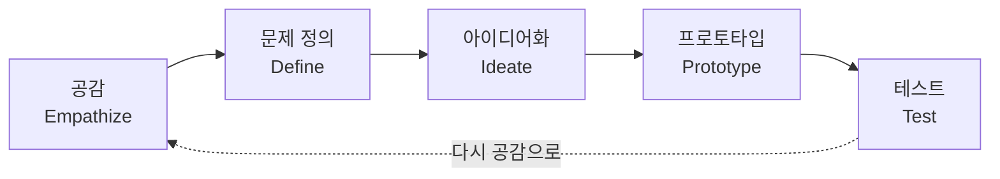

<Callout type="info">
  **이번 문서의 목표:** 서비스디자인(Service Design)과 경험디자인(Experience Design, UX디자인)의 정의와 차이를 근거를 들어 설명하고, 디자인씽킹(Design Thinking)의 5단계, UI(User Interface)와 사용성(Usability) 개념을 실기 답안 형태로 서술할 수 있게 됩니다.
</Callout>

## 왜 "서비스"까지 디자인의 대상이 되는가

디자인이라는 말을 들으면 대부분 의자의 곡선, 앱 화면의 색상처럼 **눈에 보이고 손에 잡히는 대상**을 떠올립니다. 그런데 병원 예약, 은행 창구, 카페 주문처럼 우리가 매일 이용하는 것들 중 상당수는 하나의 물건이 아니라 **여러 사람과 시스템이 얽힌 과정**입니다. 카페에서 커피 한 잔을 받기까지를 생각해 봅시다. 키오스크 화면에서 메뉴를 고르고, 결제를 하고, 진동벨을 받고, 기다리다가, 이름이나 번호가 불리면 받아 갑니다. 이 과정에는 화면 디자인 하나만으로는 설명할 수 없는 요소들, 즉 **바리스타의 동선**, **주문이 밀렸을 때의 대기 방식**, **원두가 떨어졌을 때의 안내** 같은 것들이 함께 얽혀 있습니다.

전통적인 제품 디자인이나 그래픽 디자인은 이런 "과정 전체"를 다루는 언어를 가지고 있지 않았습니다. 그래서 1990년대 이후 여러 접점(터치포인트, Touchpoint)에 걸쳐 일어나는 경험을 계획적으로 설계하는 새로운 분야가 필요해졌고, 이것이 **서비스디자인**(Service Design)과 **경험디자인**(Experience Design)입니다. 이 과목의 실기 시험은 바로 이 "과정을 설계하는 능력"을 산출물(제안서, 페르소나, 여정지도, 블루프린트 등)로 확인합니다.

> **쉽게 말하면:** 서비스디자인과 경험디자인은 물건의 겉모양이 아니라, **사람이 무언가를 이용하면서 겪는 흐름 전체**를 설계 대상으로 삼는 분야입니다.

## 서비스디자인과 경험디자인(UX디자인)의 정의와 차이

### 정의부터 정확히

**서비스디자인**(Service Design)은 서비스를 이용하는 사람(고객)과 그 서비스를 제공하는 사람·시스템(직원, 매장, 애플리케이션, 백오피스 프로세스)이 만나는 모든 접점을 계획적으로 조직해, 이용자와 제공자 양쪽 모두에게 가치 있는 경험을 만드는 활동입니다. 핵심은 "사람(people)·소품(props)·프로세스(process)"라는 세 가지 자원을 함께 설계한다는 점입니다. 여기서 소품이란 서비스 도중 사용자나 직원의 손에 거쳐 가는 물리적·디지털 증거물(영수증, 안내판, 앱 화면 등)을 뜻합니다.

**경험디자인**(Experience Design)은 흔히 **UX디자인**(UX Design, User eXperience Design, 사용자 경험 디자인)이라고도 부르며, 한 사용자가 제품이나 서비스를 접하면서 느끼는 인지적·감성적·감각적 반응 전체를 설계 대상으로 삼습니다. UX(User eXperience)를 글자 그대로 풀면 "사용자(User)가 겪는 경험(eXperience)"이며, 여기서 경험이란 화면을 보는 그 순간의 만족감부터 서비스를 다 이용하고 난 뒤의 기억까지 포함하는 넓은 개념입니다.

### 무엇이 다른가

두 분야는 "사람의 경험을 다룬다"는 점에서 겹치지만, 초점의 크기가 다릅니다.

| 구분 | 서비스디자인 | 경험디자인(UX디자인) |
|------|--------------|----------------------|
| 초점 | 고객과 직원, 여러 이해관계자(Stakeholder) 사이의 관계와 운영 프로세스 전체 | 한 사용자가 특정 제품·화면을 사용하는 순간의 경험 |
| 다루는 접점 | 사람이 만나는 접점과 사람이 만나지 않는 뒷단(백오피스) 프로세스까지 포함 | 주로 사용자가 직접 접촉하는 접점(화면, 앱, 기기) |
| 대표 산출물 | 서비스 블루프린트, 이해관계자 맵, 서비스 청사진 | 와이어프레임, 정보구조도, 사용성 평가 보고서 |
| 성공 판단 기준 | 고객 가치와 조직 운영 효율을 동시에 개선했는가 | 사용자가 목표를 쉽고 만족스럽게 달성했는가 |

**서비스디자인이 더 넓은 시스템 관점을 갖는다**고 정리할 수 있습니다. 경험디자인이 "사용자가 화면 앞에서 겪는 일"에 집중한다면, 서비스디자인은 그 화면 뒤에서 주문을 받는 직원의 동선, 재고 관리 시스템, 배달 기사의 경로까지 하나의 그림 안에 놓고 함께 설계합니다.

### 작은 예시로 구분해 보기

동네 카페 브랜드 "보통의 하루"를 예로 들어 보겠습니다.

- **UI디자인 영역**: 키오스크 화면에서 버튼 크기, 글자 색상, 메뉴 배치를 정하는 일
- **경험디자인(UX) 영역**: 손님이 키오스크 앞에 서서 메뉴를 고르고 결제하기까지, 헷갈리지 않고 매끄럽게 진행되는가를 설계하는 일
- **서비스디자인 영역**: 키오스크뿐 아니라 바리스타의 제조 동선, 원두 재고가 떨어졌을 때 안내하는 방식, 혼잡한 시간대의 대기열 관리, 포장·배달과의 연계까지 함께 설계하는 일

세 영역은 서로 배타적이지 않습니다. 서비스디자인이라는 큰 틀 안에 경험디자인이 있고, 경험디자인을 이루는 구체적 화면 요소 중 하나가 UI디자인입니다.

<Callout type="tip">
  **답안 예시 — "서비스디자인과 경험디자인(UX디자인)의 차이를 설명하시오"**

  실기 답안을 쓸 때는 "정의 → 차이 포인트 → 구체적 예시" 순서로 짧게 정리합니다.

  "서비스디자인은 고객과 제공자가 만나는 모든 접점을 사람·소품·프로세스 관점에서 조직해 양쪽 모두에게 가치를 만드는 활동이고, 경험디자인(UX디자인)은 한 사용자가 제품·서비스를 접하며 느끼는 인지적·감성적 반응을 설계하는 활동이다. 두 분야는 서로 겹치지만 서비스디자인이 직원 동선·백오피스 프로세스까지 포함하는 더 넓은 시스템 관점을 갖는다는 점에서 다르다. 예를 들어 카페 키오스크의 화면 만족도를 높이는 일은 경험디자인의 영역이지만, 그 화면과 바리스타의 제조 동선·재고 관리를 함께 설계하는 일은 서비스디자인의 영역이다."

  이렇게 **정의를 먼저 쓰고, 차이를 만드는 기준(초점의 범위)을 명시한 뒤, 구체적 예시로 마무리**하는 구성이 채점자가 근거를 확인하기 쉬운 답안입니다.
</Callout>

**자주 틀리는 점:** 서비스디자인과 UX디자인을 완전히 같은 말로 서술하거나, 반대로 아무 관련 없는 별개 분야로 서술하는 경우가 감점을 받습니다. 두 분야는 "범위가 다른 겹치는 개념"이라는 점을 답안에 명시해야 합니다. 또한 UX디자인을 "그래픽 디자인"이나 "예쁜 화면을 만드는 일"로 좁혀 쓰는 것도 흔한 오답입니다. UX는 감성적·기능적 만족을 모두 포함하는 개념입니다.

## 디자인씽킹(Design Thinking) 5단계

### 왜 필요한가

서비스디자인과 경험디자인 프로젝트는 "무엇을 만들어야 할지"조차 처음에는 불분명한 경우가 많습니다. 고객이 진짜 원하는 것이 설문 응답과 다를 때도 흔합니다. **디자인씽킹**(Design Thinking)은 이런 불확실한 문제를 사람 중심으로 풀어 가는 문제 해결 절차입니다.

> **쉽게 말하면:** 사람에게 공감해서 진짜 문제를 찾고, 여러 아이디어를 가볍게 시도해 보면서 답에 가까워지는 절차입니다.

### 다섯 단계

디자인씽킹은 스탠퍼드 d.school 모델을 기준으로 다섯 단계로 정리됩니다.

- **공감**(Empathize): 관찰조사·면접조사로 사용자의 행동과 속마음을 이해하는 단계입니다. 06~08편에서 다룰 데스크 리서치·관찰조사·면접조사가 여기에 해당합니다.
- **문제 정의**(Define): 공감 단계에서 모은 정보를 종합해 "누구의 어떤 문제를 풀 것인가"를 한 문장으로 좁히는 단계입니다.
- **아이디어화**(Ideate): 정의된 문제에 대해 판단을 미뤄 두고 최대한 많은 해결안을 떠올리는 단계입니다.
- **프로토타입**(Prototype): 아이디어를 손으로 만질 수 있는 형태(종이 스케치, 목업, 역할극)로 빠르게 구현하는 단계입니다.
- **테스트**(Test): 프로토타입을 실제 사용자에게 보여 주고 반응을 관찰해, 다시 공감 단계로 돌아갈지 다음 단계로 넘어갈지 판단하는 단계입니다.

**화살표가 순환하는 이유**: 다섯 단계는 한 방향으로만 흐르지 않습니다. 테스트 결과 원래 정의한 문제 자체가 틀렸다는 것이 드러나면 공감 단계로 돌아가 다시 시작합니다. 이 반복 구조를 **비선형적**(non-linear) 절차라고 부릅니다.

<Callout type="tip">
  **답안 예시 — "디자인씽킹의 5단계를 순서대로 설명하시오"**

  "디자인씽킹은 공감, 문제 정의, 아이디어화, 프로토타입, 테스트의 5단계로 진행된다. 공감 단계에서는 관찰·면접조사로 사용자의 행동과 필요를 이해하고, 문제 정의 단계에서는 이를 종합해 해결해야 할 문제를 한 문장으로 좁힌다. 아이디어화 단계에서는 판단을 유보하고 다양한 해결안을 발산하며, 프로토타입 단계에서는 아이디어를 손으로 만질 수 있는 형태로 빠르게 구현한다. 테스트 단계에서는 이를 사용자에게 검증받고, 필요하면 다시 공감 단계로 돌아가는 반복적 절차로 진행된다."
</Callout>

**자주 틀리는 점:** 다섯 단계를 한 번만 순서대로 거치면 끝나는 절차로 서술하는 경우가 많습니다. 디자인씽킹의 핵심은 **반복**(iteration)이며, 테스트 결과에 따라 앞 단계로 되돌아갈 수 있다는 점을 답안에 포함해야 감점을 피할 수 있습니다. 또한 "아이디어화"와 "프로토타입"을 같은 단계로 뭉뚱그려 쓰는 오류도 흔합니다. 아이디어화는 생각을 넓히는 발산 단계이고, 프로토타입은 그중 일부를 실제 형태로 좁혀 만드는 수렴 단계입니다.

## UI(User Interface)와 사용성(Usability)

### 정의

**UI**(User Interface, 사용자 인터페이스)는 사람과 시스템이 서로 마주해 상호작용하는 접점의 시각적·조작적 요소를 뜻합니다. 인터페이스(Interface)라는 단어 자체가 "사이(inter)"와 "마주하는 면(face)"이 합쳐진 말로, 사용자와 시스템이 마주 보는 면이라는 뜻을 그대로 담고 있습니다. 키오스크의 버튼, 앱의 글자 크기와 색상, 아이콘의 모양이 모두 UI에 속합니다.

**사용성**(Usability)은 특정 사용자가 특정 목표를, 특정 사용 맥락에서 얼마나 효과적·효율적·만족스럽게 달성할 수 있는가를 나타내는 품질 속성입니다. 사용성은 UI 하나만으로 결정되지 않고, 사용자의 사전 지식, 사용 환경, 목표의 난이도까지 함께 작용합니다.

### 사용성의 다섯 가지 구성 요소

| 구성 요소 | 의미 |
|-----------|------|
| 학습용이성(Learnability) | 처음 접했을 때 얼마나 쉽게 사용법을 익히는가 |
| 효율성(Efficiency) | 사용법을 익힌 뒤 얼마나 빠르게 과제를 완료하는가 |
| 기억용이성(Memorability) | 한동안 쓰지 않다가 다시 써도 사용법을 얼마나 잘 기억하는가 |
| 오류(Errors) | 사용자가 실수를 얼마나 적게 하고, 실수했을 때 얼마나 쉽게 회복하는가 |
| 만족도(Satisfaction) | 사용 과정이 얼마나 유쾌하고 만족스러운가 |

> **쉽게 말하면:** UI가 "눈에 보이는 조작 도구"라면, 사용성은 그 도구를 써서 "얼마나 쉽고 기분 좋게 목표를 이루었는가"를 재는 잣대입니다.

<Callout type="tip">
  **답안 예시 — "UI가 좋다고 해서 사용성이 항상 좋은 것은 아닌 이유를 예를 들어 설명하시오"**

  "UI는 사용자와 시스템이 마주하는 시각적·조작적 접점을 뜻하고, 사용성은 특정 사용자가 특정 목표를 특정 맥락에서 효과적·효율적·만족스럽게 달성하는 정도를 뜻한다. UI가 시각적으로 화려하더라도 버튼의 의미가 불명확하거나 오류 발생 시 되돌리기 어렵다면 사용성은 낮아진다. 예를 들어 키오스크 화면의 색상과 아이콘이 세련되어도, 결제 취소 버튼을 찾기 어렵다면 오류 회복성이 낮아 사용성이 떨어진다. 따라서 UI는 사용성을 구성하는 요소 중 하나일 뿐이며, UI의 심미성과 사용성은 별개로 평가해야 한다."
</Callout>

**자주 틀리는 점:** UI디자인과 사용성을 같은 개념으로 혼동해 "화면이 예쁘면 사용성이 좋다"고 서술하는 경우가 많습니다. 사용성은 학습용이성·효율성·기억용이성·오류·만족도라는 다섯 가지 기준으로 판단하는 별개의 품질 속성이며, 시각적 완성도가 높아도 오류 회복이 어렵거나 학습이 오래 걸리면 사용성은 낮게 평가됩니다.

## 핵심 정리

- **서비스디자인**은 고객과 제공자가 만나는 모든 접점을 사람·소품·프로세스 관점에서 조직하는 활동이고, **경험디자인**(UX디자인)은 한 사용자가 느끼는 인지적·감성적 경험을 설계하는 활동이다. 서비스디자인이 더 넓은 시스템 관점을 갖는다.
- **디자인씽킹**은 공감→문제 정의→아이디어화→프로토타입→테스트의 5단계로 진행되며, 테스트 결과에 따라 앞 단계로 되돌아가는 **반복적 절차**다.
- **UI**는 사용자와 시스템이 마주하는 시각적·조작적 접점이고, **사용성**은 학습용이성·효율성·기억용이성·오류·만족도의 다섯 기준으로 평가하는 별개의 품질 속성이다.
- 답안을 쓸 때는 항상 "정의 → 차이·기준 → 구체적 예시" 순서로 근거를 드러내는 것이 채점자에게 유리하다.

## 마무리 복습

<Quiz
  questionNumber={1}
  question="서비스디자인과 경험디자인(UX디자인)의 관계에 대한 설명으로 가장 적절한 것은?"
  options={['서비스디자인과 경험디자인은 완전히 동일한 개념이다', '경험디자인이 서비스디자인보다 항상 더 넓은 범위를 다룬다', '서비스디자인은 고객과 제공자의 접점을 사람·소품·프로세스 관점에서 조직하는 더 넓은 시스템 관점을 갖는다', '경험디자인은 백오피스 프로세스와 직원 동선만을 다루는 분야다']}
  correctAnswer={3}
  explanation="서비스디자인은 사람·소품·프로세스를 함께 설계하는 더 넓은 시스템 관점을 가지며, 경험디자인(UX디자인)은 한 사용자가 겪는 경험에 좀 더 초점을 둔다. 두 분야는 겹치지만 범위가 다르다."
  optionExplanations={['두 분야는 초점의 범위가 다른 별개의 개념이다.', '더 넓은 범위를 다루는 쪽은 경험디자인이 아니라 서비스디자인이다.', '사람·소품·프로세스를 함께 조직하는 시스템 관점이 서비스디자인의 특징이므로 정답이다.', '백오피스 프로세스까지 포함하는 쪽은 경험디자인이 아니라 서비스디자인이다.']}
/>

<Quiz
  questionNumber={2}
  question="카페 브랜드 보통의 하루에서 서비스디자인 영역에 해당하는 활동으로 가장 적절한 것은?"
  options={['키오스크 버튼의 글자 색상을 정하는 일', '키오스크와 바리스타 동선, 재고 안내 방식, 대기열 관리를 함께 설계하는 일', '앱 아이콘의 모양을 다듬는 일', '메뉴 이름의 폰트 크기를 조정하는 일']}
  correctAnswer={2}
  explanation="서비스디자인은 화면 요소 하나가 아니라 고객 접점과 직원 동선, 운영 프로세스를 함께 설계하는 활동이다. 나머지 보기는 UI디자인 수준의 화면 요소에 해당한다."
  optionExplanations={['화면의 시각 요소 하나를 정하는 것은 UI디자인 영역이다.', '접점과 뒷단 프로세스를 함께 조직하는 활동이므로 서비스디자인에 해당한다.', 'UI디자인 수준의 화면 요소다.', 'UI디자인 수준의 화면 요소다.']}
/>

<Quiz
  questionNumber={3}
  question="디자인씽킹의 5단계를 올바른 순서로 나열한 것은?"
  options={['프로토타입-공감-테스트-정의-아이디어화', '공감-문제 정의-아이디어화-프로토타입-테스트', '문제 정의-공감-프로토타입-아이디어화-테스트', '아이디어화-공감-문제 정의-테스트-프로토타입']}
  correctAnswer={2}
  explanation="디자인씽킹은 사용자에게 공감해 문제를 정의하고, 아이디어를 발산한 뒤 프로토타입으로 좁혀 테스트하는 순서로 진행된다."
  optionExplanations={['순서가 뒤섞여 있다.', '공감-문제 정의-아이디어화-프로토타입-테스트의 순서가 정확하다.', '공감이 문제 정의보다 먼저 와야 한다.', '공감과 문제 정의가 아이디어화보다 먼저 와야 한다.']}
/>

<Quiz
  questionNumber={4}
  question="디자인씽킹이 비선형적(반복적) 절차로 설명되는 이유로 가장 적절한 것은?"
  options={['다섯 단계를 동시에 병렬로 진행하기 때문이다', '테스트 결과에 따라 앞선 공감이나 문제 정의 단계로 되돌아갈 수 있기 때문이다', '단계마다 참여하는 사람이 매번 바뀌기 때문이다', '프로토타입 단계를 생략해도 되기 때문이다']}
  correctAnswer={2}
  explanation="테스트에서 얻은 피드백이 애초의 문제 정의 자체가 틀렸음을 보여줄 수 있으며, 이 경우 공감이나 문제 정의 단계로 되돌아가 다시 진행한다. 이 되돌아가는 구조가 비선형성의 근거다."
  optionExplanations={['병렬 진행이 아니라 순차적으로 진행하되 되돌아갈 수 있다는 점이 핵심이다.', '테스트 결과에 따라 앞 단계로 되돌아갈 수 있다는 점이 비선형성의 근거이므로 정답이다.', '참여자 변경은 비선형성의 근거가 아니다.', '프로토타입은 생략 대상이 아니라 핵심 단계다.']}
/>

<Quiz
  questionNumber={5}
  question="UI(User Interface)와 사용성(Usability)의 관계에 대한 설명으로 옳은 것은?"
  options={['UI가 시각적으로 화려하면 사용성도 항상 높아진다', 'UI는 사용성을 구성하는 요소 중 하나일 뿐이며 학습용이성·효율성·오류 등 다른 기준도 함께 평가된다', '사용성은 UI 없이도 존재할 수 없으므로 두 개념은 동일하다', 'UI가 나쁘면 사용성은 평가할 수 없다']}
  correctAnswer={2}
  explanation="사용성은 학습용이성, 효율성, 기억용이성, 오류, 만족도라는 다섯 가지 기준으로 평가되는 별개의 품질 속성이며, UI의 심미성만으로 결정되지 않는다."
  optionExplanations={['시각적 화려함과 사용성은 별개이며, 오류 회복이나 학습용이성이 낮으면 사용성이 낮아질 수 있다.', '사용성은 다섯 가지 기준으로 평가되는 별개의 속성이므로 정답이다.', '두 개념은 관련은 있지만 동일한 개념은 아니다.', 'UI가 나쁘더라도 사용성은 다섯 기준으로 측정할 수 있다.']}
/>

<Quiz
  questionNumber={6}
  question="사용성(Usability)의 다섯 가지 구성 요소에 해당하지 않는 것은?"
  options={['학습용이성', '효율성', '수익성', '만족도']}
  correctAnswer={3}
  explanation="사용성의 다섯 가지 구성 요소는 학습용이성, 효율성, 기억용이성, 오류, 만족도다. 수익성은 비즈니스 모델의 평가 기준이지 사용성의 구성 요소가 아니다."
  optionExplanations={['사용성의 다섯 요소 중 하나다.', '사용성의 다섯 요소 중 하나다.', '비즈니스 관점의 지표이며 사용성 다섯 요소에 속하지 않으므로 정답이다.', '사용성의 다섯 요소 중 하나다.']}
/>

## 참고 자료

- [한국디자인진흥원(KIDP) - 서비스·경험디자인기사 국가자격시험 공식 사이트](https://designq.kidp.or.kr/)
- [한국디자인진흥원(KIDP) - 서비스·경험디자인기사 국가기술자격 검정 안내](https://www.kidp.or.kr/?menuno=1377)
- [Nielsen Norman Group - Service Design 101](https://www.nngroup.com/articles/service-design-101/)
- [Nielsen Norman Group - Design Thinking 101](https://www.nngroup.com/articles/design-thinking/)
- [Nielsen Norman Group - Usability 101: Introduction to Usability](https://www.nngroup.com/articles/usability-101-introduction-to-usability/)
