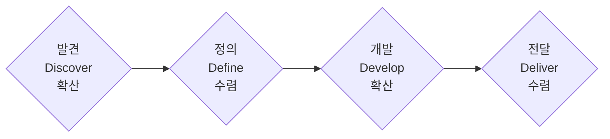

<Callout type="info">
  **이번 문서의 목표:** 더블 다이아몬드(Double Diamond)의 4단계와 확산·수렴 사고의 원리를 설명하고, 서비스디자인 프로젝트의 각 방법론(리서치, 페르소나, 여정지도, 블루프린트 등)이 이 지도 위 어디에 있는지, 이후 몇 편에서 자세히 다루는지 짚어낼 수 있게 됩니다.
</Callout>

## 왜 전체 지도가 먼저 필요한가

01편에서 서비스디자인이 "여러 접점에 걸친 경험을 설계하는 일"이라는 것을 확인했습니다. 그런데 실제 프로젝트에서는 리서치, 페르소나 작성, 아이디어 워크숍, 프로토타입 제작, 블루프린트 작성 같은 활동이 순서 없이 뒤섞여 등장하는 것처럼 느껴지기 쉽습니다. 실기 답안에서도 "이 활동이 프로젝트의 어느 단계에 해당하는가"를 묻는 문제, 또는 여러 산출물 사이의 순서를 판단해야 하는 문제가 나옵니다.

이 편은 이후 05편부터 24편까지 다룰 20개 본론 활동이 프로젝트 전체에서 **어느 시점에, 왜 그 순서로** 오는지 보여 주는 지도 역할을 합니다. 지도를 먼저 보고 출발하면, 개별 방법론을 배울 때마다 "이게 지금 왜 필요한 건지" 헤매지 않습니다.

> **쉽게 말하면:** 각 방법론을 낱개로 외우기 전에, 그것들이 놓인 전체 지형(더블 다이아몬드)을 먼저 봅니다.

## 더블 다이아몬드(Double Diamond) 4단계

### 정의

**더블 다이아몬드**(Double Diamond)는 영국디자인위원회(Design Council)가 2003년에 정리한 디자인 프로세스 모델로, 문제를 찾는 다이아몬드 하나와 답을 찾는 다이아몬드 하나, 총 두 개의 마름모(다이아몬드) 모양으로 프로세스를 표현합니다. 각 다이아몬드는 **확산**(생각을 넓히는 국면)과 **수렴**(넓힌 생각을 좁혀 하나로 모으는 국면)이 짝을 이루는 모양입니다.

- **발견**(Discover): 문제를 찾기 위해 시장·사용자·환경을 폭넓게 조사하며 생각을 넓히는 확산 단계입니다.
- **정의**(Define): 발견 단계에서 모은 정보를 종합해 "풀어야 할 문제가 무엇인가"를 하나로 좁히는 수렴 단계입니다.
- **개발**(Develop): 정의된 문제에 대한 해결안을 여러 방향으로 탐색하며 다시 생각을 넓히는 확산 단계입니다.
- **전달**(Deliver): 개발 단계에서 나온 여러 해결안 중 최종안을 다듬어 실행 가능한 형태로 좁히는 수렴 단계입니다.

### 확산과 수렴이라는 두 가지 사고방식

| 사고방식 | 목적 | 이 단계에서 하는 일 | 흔한 오해 |
|----------|------|----------------------|-----------|
| 확산(Divergent) | 가능성을 최대한 넓히기 | 많은 정보·아이디어를 판단 없이 모으기 | "빨리 좋은 답 하나를 골라야 한다"는 조급함 |
| 수렴(Convergent) | 넓힌 것을 기준에 따라 좁히기 | 우선순위·기준으로 선택하고 정리하기 | 확산 없이 곧바로 수렴부터 시작하는 것 |

**왜 확산을 먼저 해야 하는가:** 충분히 넓혀 보지 않고 곧바로 하나를 고르면, 처음 떠오른 익숙한 답에 갇히기 쉽습니다. 예를 들어 "카페 대기 시간이 길다"는 문제에 곧장 "키오스크를 늘리자"고 결론 내리면, 원두 공급 지연이나 좌석 회전율처럼 더 근본적인 원인을 놓칠 수 있습니다. 발견 단계에서 충분히 넓게 조사한 뒤에야 진짜 문제를 정의할 수 있습니다.

<Callout type="tip">
  **답안 예시 — "더블 다이아몬드에서 확산과 수렴이 반복되는 이유를 설명하시오"**

  "더블 다이아몬드는 발견-정의-개발-전달의 4단계로 이루어지며, 발견과 개발은 가능성을 넓히는 확산 단계, 정의와 전달은 넓힌 것을 기준에 따라 좁히는 수렴 단계다. 확산 없이 곧바로 좁히면 익숙한 답에 갇혀 진짜 문제나 더 나은 해결안을 놓칠 위험이 있다. 따라서 문제를 찾을 때(발견→정의)와 답을 찾을 때(개발→전달) 각각 확산과 수렴을 한 번씩 거치도록 설계되어 있다."
</Callout>

**자주 틀리는 점:** 더블 다이아몬드를 "발견→정의→개발→전달"이 한 번 흘러가면 끝나는 일방향 절차로 서술하는 경우가 많습니다. 실제로는 정의 단계에서 문제가 잘못 좁혀졌다는 것이 드러나면 발견 단계로 되돌아가고, 전달 단계에서 테스트 결과가 나쁘면 개발 단계로 되돌아가는 **반복**이 자연스럽습니다. 01편에서 본 디자인씽킹의 반복 구조와 같은 원리입니다.

## 카페 사례로 4단계 구분해 보기

카페 브랜드 "보통의 하루"가 "주말 오후 대기 시간이 길다"는 문제로 프로젝트를 시작했다고 가정합니다.

| 단계 | 이 프로젝트에서의 활동 |
|------|------------------------|
| 발견 | 매장 방문객 관찰조사, 바리스타 면접조사, 경쟁 카페 데스크 리서치로 대기 시간 문제의 원인 후보를 폭넓게 수집 |
| 정의 | 수집한 자료를 어피니티 다이어그램으로 종합해 "혼잡 시간대의 결제 대기가 핵심 병목"이라고 문제를 좁힘 |
| 개발 | 키오스크 추가, 사전 주문 앱, 대기열 안내 화면 등 여러 해결안을 아이디어 워크숍으로 탐색하고 프로토타입 제작 |
| 전달 | 최종안(사전 주문 앱 연동)을 서비스 블루프린트로 정리하고 완료보고서로 문서화 |

**해석:** 하나의 문제(대기 시간)가 넓게 조사되었다가(발견) 좁혀지고(정의), 다시 여러 해결안으로 넓혀졌다가(개발) 하나로 좁혀지는(전달) 흐름을 보면, 왜 "다이아몬드가 두 개"인지 이해할 수 있습니다.

## 서비스디자인 방법론 전체 지형도

### 13개 주요항목이 더블 다이아몬드 위 어디에 있는가

실기 출제기준의 13개 주요항목(요구사항 파악부터 사후관리까지)은 05편부터 24편까지 20개 편으로 나뉘어 다뤄집니다. 이 표는 각 편이 더블 다이아몬드의 어느 단계에 해당하는지 보여 주는 지도입니다.

| 더블 다이아몬드 단계 | 다루는 활동 | 해당 편 |
|----------------------|-------------|---------|
| 발견 (확산) | 요구사항 파악·제안서, 데스크 리서치, 관찰조사, 면접조사 | 05, 06, 07, 08 |
| 발견→정의 사이 (수렴 시작) | 리서치 자료 종합과 어피니티 다이어그램 | 09 |
| 정의 (수렴) | 페르소나 개발, 고객 여정 지도, 이해관계자 분석·맵, 핵심 사용자·디자인 콘셉트 | 10, 11, 12, 13 |
| 개발 (확산→수렴) | 아이디어 워크숍, 아이디어 구체화·평가, 서비스 구조화·터치포인트, 프로토타입 기획·제작, 시나리오·스토리보드, 서비스 블루프린트, 비즈니스 모델, 사용성 평가 | 14, 15, 16, 17, 18, 19, 20, 22, 23 |
| 전달 (수렴) | 모델 문서화·로드맵·포트폴리오, 완료보고서·자료화·사후관리·지식재산권 | 21, 24 |

**왜 개발 단계에 이렇게 많은 편이 몰려 있는가:** 개발 단계는 "여러 해결안을 탐색하며 넓혔다가(아이디어 워크숍, 프로토타입 기획), 실제로 만들어 검증하고(프로토타입 제작, 사용성 평가), 최종 형태로 문서화하는(블루프린트)" 과정을 모두 포함하기 때문에 자연히 활동 수가 많습니다. 실기 시험에서도 이 구간의 산출물(블루프린트, 프로토타입 기획서, 시나리오)이 자주 출제되는 이유이기도 합니다.

### 주요 산출물·용어 찾아가기 색인

다음 편들을 학습하다가 "이 용어가 정확히 어느 편에서 자세히 다뤄지는가"를 빠르게 찾을 수 있도록 정리했습니다.

| 산출물·방법론 | 자세히 다루는 편 |
|---------------|-------------------|
| 어피니티 다이어그램 | 09편 |
| 페르소나 | 10편 |
| 고객 여정 지도 | 11편 |
| 이해관계자 맵 | 12편 |
| 디자인 콘셉트 | 13편 |
| 서비스 프로토타입 | 17, 18편 |
| 서비스 시나리오·스토리보드 | 19편 |
| 서비스 블루프린트 | 20편 |
| 비즈니스 모델 캔버스 | 22편 |

<Callout type="tip">
  **답안 예시 — "다음 활동 목록을 더블 다이아몬드 4단계에 맞게 분류하시오: (1) 경쟁 서비스 데스크 리서치 (2) 서비스 블루프린트 작성 (3) 어피니티 다이어그램으로 리서치 종합 (4) 완료보고서 작성"**

  "(1) 경쟁 서비스 데스크 리서치는 문제 후보를 폭넓게 조사하는 활동이므로 발견 단계에 해당한다. (3) 어피니티 다이어그램으로 리서치 종합은 발견 단계에서 모은 자료를 하나의 문제로 좁히는 정의 단계의 활동이다. (2) 서비스 블루프린트 작성은 정의된 문제에 대한 해결안을 구체적 실행 형태로 만드는 개발 단계의 활동이다. (4) 완료보고서 작성은 최종 결과물을 정리해 전달하는 전달 단계의 활동이다. 따라서 순서는 발견(1)-정의(3)-개발(2)-전달(4)이다."
</Callout>

**자주 틀리는 점:** 리서치 자료 종합(어피니티 다이어그램)을 발견 단계의 활동으로 착각하는 경우가 많습니다. 자료를 "모으는" 행위는 발견이지만, 모은 자료를 정리해 하나의 문제로 **좁히는** 행위는 정의 단계의 성격을 갖습니다. 또한 프로토타입 제작을 전달 단계로 착각하기 쉬운데, 프로토타입은 아직 검증 전이므로 여러 해결안을 시도하는 개발 단계에 속하고, 검증을 마친 최종안을 문서화하는 것이 전달 단계입니다.

## 핵심 정리

- **더블 다이아몬드**는 발견(확산)-정의(수렴)-개발(확산)-전달(수렴)의 4단계로, 문제를 찾는 다이아몬드와 답을 찾는 다이아몬드 두 개로 이루어진다.
- **확산**은 판단을 미루고 가능성을 넓히는 사고, **수렴**은 기준에 따라 좁히는 사고이며, 두 사고방식이 각 다이아몬드 안에서 짝을 이룬다.
- 실기 출제기준 13개 주요항목은 05~24편으로 나뉘며, 발견(05~08)-정의(09~13)-개발(14~20, 22, 23)-전달(21, 24) 단계에 대응한다.
- 활동을 단계에 배치할 때는 "정보를 모으는가(확산) 아니면 좁혀 결정하는가(수렴)"를 기준으로 판단한다.

## 마무리 복습

<Quiz
  questionNumber={1}
  question="더블 다이아몬드(Double Diamond)의 4단계를 순서대로 나열한 것은?"
  options={['정의-발견-전달-개발', '발견-정의-개발-전달', '개발-전달-발견-정의', '발견-개발-정의-전달']}
  correctAnswer={2}
  explanation="더블 다이아몬드는 발견(확산)-정의(수렴)-개발(확산)-전달(수렴)의 순서로 진행되는 두 개의 다이아몬드 구조다."
  optionExplanations={['발견이 정의보다 먼저 와야 한다.', '발견-정의-개발-전달의 순서가 정확하다.', '발견과 정의가 개발과 전달보다 먼저 와야 한다.', '정의가 개발보다 먼저 와야 문제가 좁혀진 뒤 해결안을 탐색할 수 있다.']}
/>

<Quiz
  questionNumber={2}
  question="확산적 사고(Divergent thinking)에 대한 설명으로 가장 적절한 것은?"
  options={['판단을 먼저 내려 하나의 답으로 빠르게 좁히는 사고', '기준을 세워 여러 후보 중 최선을 선택하는 사고', '판단을 미루고 가능한 한 많은 정보나 아이디어를 넓게 모으는 사고', '이미 정해진 결론을 검증만 하는 사고']}
  correctAnswer={3}
  explanation="확산적 사고는 발견·개발 단계에서 판단을 유보한 채 가능성을 최대한 넓히는 사고방식이며, 좁히는 역할은 수렴적 사고가 맡는다."
  optionExplanations={['빠르게 좁히는 것은 수렴적 사고의 특징이다.', '기준에 따라 선택하는 것은 수렴적 사고의 특징이다.', '판단을 미루고 넓게 모으는 것이 확산적 사고의 정의이므로 정답이다.', '검증은 확산이 아니라 전달 단계의 수렴적 활동에 가깝다.']}
/>

<Quiz
  questionNumber={3}
  question="다음 중 더블 다이아몬드의 정의(Define) 단계에 해당하는 활동으로 가장 적절한 것은?"
  options={['경쟁 서비스에 대한 데스크 리서치를 폭넓게 진행한다', '리서치 자료를 어피니티 다이어그램으로 종합해 핵심 문제를 좁힌다', '여러 해결 아이디어를 워크숍으로 발산한다', '최종 서비스 모델을 완료보고서로 문서화한다']}
  correctAnswer={2}
  explanation="정의 단계는 발견 단계에서 모은 자료를 종합해 풀어야 할 문제를 하나로 좁히는 수렴 단계이며, 어피니티 다이어그램 작성이 대표적인 활동이다."
  optionExplanations={['정보를 폭넓게 모으는 활동은 발견 단계다.', '자료를 종합해 문제를 좁히는 활동이므로 정의 단계에 해당한다.', '아이디어를 발산하는 활동은 개발 단계다.', '최종 문서화는 전달 단계다.']}
/>

<Quiz
  questionNumber={4}
  question="서비스 블루프린트 작성이 더블 다이아몬드의 개발(Develop) 단계에 속하는 이유로 가장 적절한 것은?"
  options={['아직 검증 전인 해결안을 구체적인 실행 형태로 만들어 보는 활동이기 때문이다', '프로젝트를 완전히 종료하는 활동이기 때문이다', '고객 요구사항을 처음 수집하는 활동이기 때문이다', '이해관계자를 처음 식별하는 활동이기 때문이다']}
  correctAnswer={1}
  explanation="블루프린트는 정의된 문제에 대한 해결안을 구체적인 실행 절차로 만들어 검증해 보는 개발 단계의 산출물이다. 아직 최종 확정 전이므로 전달 단계와 구분된다."
  optionExplanations={['해결안을 구체적 형태로 만들어 보는 활동이므로 개발 단계에 해당해 정답이다.', '프로젝트 종료는 전달 단계의 완료보고서·사후관리에 해당한다.', '요구사항 수집은 발견 단계다.', '이해관계자 식별은 정의 단계다.']}
/>

<Quiz
  questionNumber={5}
  question="더블 다이아몬드가 일방향이 아니라 반복적(비선형적) 구조로 이해되어야 하는 이유는?"
  options={['네 단계를 항상 동시에 진행해야 하므로', '정의 단계에서 문제가 잘못 좁혀졌음이 드러나면 발견 단계로 되돌아갈 수 있으므로', '전달 단계가 가장 먼저 진행되기 때문에', '개발 단계는 생략해도 무방하기 때문에']}
  correctAnswer={2}
  explanation="정의나 전달 단계에서 얻은 피드백이 이전 판단이 틀렸음을 보여주면 발견이나 개발 단계로 되돌아가 다시 진행할 수 있다. 이 되돌아가는 구조가 비선형성의 근거다."
  optionExplanations={['동시 진행이 아니라 순차 진행 중 되돌아갈 수 있다는 점이 핵심이다.', '되돌아갈 수 있는 구조가 비선형성의 근거이므로 정답이다.', '전달 단계는 마지막 단계다.', '개발 단계는 해결안을 만드는 핵심 단계로 생략할 수 없다.']}
/>

## 참고 자료

- [Design Council - The Double Diamond](https://www.designcouncil.org.uk/our-resources/the-double-diamond/)
- [한국산업인력공단(브런치 경유 원문) - 서비스·경험디자인 기사 출제기준(필기·실기)](https://t1.daumcdn.net/brunch/service/user/13ur/file/tayw3sSk4ib3un2lLq5U249xKUg.pdf)
- [한국디자인진흥원(KIDP) - 서비스·경험디자인기사 국가자격시험 공식 사이트](https://designq.kidp.or.kr/)
