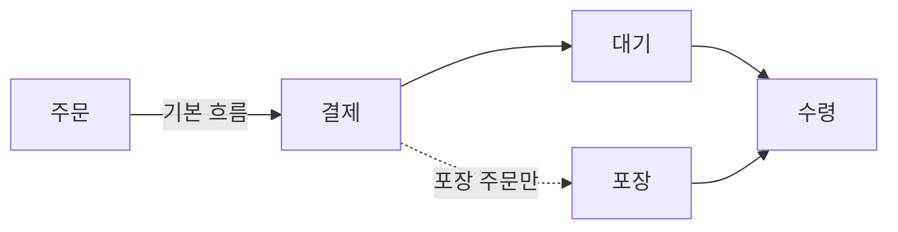

<Callout type="info">
  **이번 문서의 목표:** 여정지도·블루프린트 같은 다이어그램형 답안을 칸·화살표·범례로 정확히 표기하고, 서술형 답안을 배경-목적-방법-결과 순서로 구성하며, 요구된 산출물을 빠짐없이 채웠는지 스스로 점검할 수 있게 됩니다.
</Callout>

## 왜 "쓰는 법" 자체를 따로 배우는가

이 자격의 실기는 **필답식**(정해진 종이나 답안지에 글과 그림으로 직접 답을 작성하는 방식)으로 치러집니다. 즉 그래픽 프로그램으로 그리는 것이 아니라, 손으로 표와 다이어그램을 그리고 문장으로 서술해야 합니다. 그런데 05편부터 다룰 페르소나·여정지도·블루프린트 같은 산출물은 원래 디자인 실무에서 큰 종이나 화면 위에 자유롭게 그리는 도구입니다. 이것을 좁은 답안지 안에서 채점자가 알아볼 수 있게 표현하려면, 실무의 도구와는 별개로 **답안 작성 자체의 표기 규칙**이 필요합니다.

이 편에서는 앞으로 모든 본론 편에서 반복해 쓰게 될 세 가지 기술, 즉 다이어그램 표기 규칙, 서술형 문단 구성, 빠짐없이 완성하는 점검 순서를 미리 정리합니다.

> **쉽게 말하면:** 무엇을 그릴지(05편부터)를 배우기 전에, **어떻게 그리고 어떻게 써야 채점자가 알아보는지**를 먼저 정합니다.

## 손으로 그리는 맵·다이어그램의 기본 표기 규칙

### 왜 표기 규칙이 필요한가

여정지도나 블루프린트는 자유 형식의 그림이 아니라, 정해진 요소(단계, 행동, 감정, 접점 등)를 정해진 틀에 채워 넣는 **구조화된 다이어그램**입니다. 표기 규칙이 없으면 같은 내용을 그려도 채점자가 "이 칸이 무엇을 나타내는지" 알아보기 어렵습니다.

> **쉽게 말하면:** 다이어그램은 자유화가 아니라, **정해진 칸과 화살표 안에 정보를 정확히 배치하는 표 그리기**에 가깝습니다.

### 세 가지 기본 요소

| 요소 | 의미 | 사용 예 |
|------|------|---------|
| 칸(Box) | 하나의 단계·요소·항목을 나타내는 단위 | 여정지도의 각 단계, 블루프린트의 각 행동 |
| 화살표(Arrow) | 단계 사이의 순서나 흐름을 나타냄 | 단계 1에서 단계 2로 넘어가는 순서 |
| 범례(Legend) | 색상·선 모양 등 그림 안에서 약속한 기호의 뜻을 설명하는 작은 표 | 실선은 정상 흐름, 점선은 조건부 흐름이라는 설명 |

**칸을 채울 때의 원칙:** 칸 안에는 완결된 문장이 아니라 **짧은 명사구나 핵심 동작**으로 씁니다. "고객이 키오스크 앞에 줄을 서서 한참을 기다리다가 짜증이 난 상태로 주문한다"처럼 길게 쓰지 않고, "대기 후 주문(불만)"처럼 압축합니다. 답안지의 좁은 칸 안에 넣을 수 있는 정보량에는 한계가 있고, 채점자도 핵심 키워드를 빨리 확인하는 것을 선호합니다.

**화살표를 구분해서 쓰는 경우:** 모든 흐름이 항상 같은 순서로 일어나지 않을 때는 화살표 종류를 구분합니다. 예를 들어 실선 화살표는 대부분의 고객이 거치는 기본 흐름, 점선 화살표는 일부 고객만 거치는 예외 흐름(예: 포장 주문 고객만 거치는 경로)을 나타낼 수 있습니다. 이렇게 기호를 다르게 쓸 때는 반드시 **범례를 함께 그려** 그 뜻을 밝혀야 합니다.

- 위 다이어그램에서 실선 화살표는 매장 이용 고객의 기본 흐름이고, 점선 화살표는 포장 주문 고객만 거치는 예외 흐름입니다. 답안지에 그릴 때는 이 그림 아래에 "실선: 기본 흐름, 점선: 포장 주문 고객 전용 흐름"이라는 범례를 한 줄 덧붙입니다.

### 그리드(표) 형태로 그리는 다이어그램

여정지도나 블루프린트처럼 여러 항목(행동, 감정, 접점 등)을 여러 단계에 걸쳐 동시에 보여줘야 하는 다이어그램은, 화살표로 이어진 흐름도보다 **행과 열로 이루어진 표**로 그리는 것이 일반적입니다. 행에는 "단계, 고객 행동, 감정, 접점" 같은 항목을, 열에는 시간 순서에 따른 단계를 배치합니다.

| 항목 | 1단계: 입장 | 2단계: 주문 | 3단계: 수령 |
|------|-------------|-------------|-------------|
| 고객 행동 | 매장을 둘러본다 | 메뉴를 고르고 결제한다 | 진동벨을 받고 기다린다 |
| 감정 | 기대 | 망설임 | 지루함 |
| 접점 | 매장 입구 | 키오스크 | 진동벨, 픽업대 |

**이 표 형식이 왜 편리한가:** 여러 항목을 같은 단계 축(열)에 나란히 놓고 비교할 수 있어서, "3단계에서 감정이 나빠지는 이유가 어떤 접점 때문인가" 같은 해석을 한눈에 할 수 있습니다. 11편(고객 여정 지도)과 20편(서비스 블루프린트)에서 이 그리드 형식을 그대로 확장해 사용합니다.

<Callout type="tip">
  **답안 예시 — "여정지도를 그릴 때 지켜야 할 표기 원칙을 서술하시오"**

  "여정지도는 단계를 열로, 행동·감정·접점 같은 항목을 행으로 배치하는 그리드 형태로 그린다. 각 칸에는 완결된 문장이 아니라 핵심 키워드나 짧은 명사구로 압축해 적어야 좁은 답안지 안에서도 채점자가 내용을 빠르게 확인할 수 있다. 흐름에 예외 경로가 있을 경우 실선과 점선처럼 화살표 종류를 구분하고, 그 뜻을 범례로 반드시 함께 표기해야 한다."
</Callout>

**자주 틀리는 점:** 칸 안에 문장을 그대로 옮겨 적어 칸이 넘치거나 알아보기 어려워지는 경우가 가장 흔합니다. 또한 점선·색상 등 특수 기호를 쓰고도 범례를 빠뜨리면, 채점자 입장에서는 그 기호가 의도된 것인지 실수인지 구분할 수 없어 감점될 수 있습니다.

## 서술형 답안의 문단 구성

### 왜 순서가 중요한가

"관찰조사를 실시하는 이유를 서술하시오" 같은 서술형 문제에 생각나는 대로 문장을 늘어놓으면, 근거가 빠지거나 같은 말이 반복되기 쉽습니다. 채점자는 정해진 채점 기준에 따라 "이 요소가 답안에 포함되어 있는가"를 확인하므로, **정해진 순서로 요소를 빠짐없이 담는 것**이 좋은 점수로 이어집니다.

> **쉽게 말하면:** 서술형 답안은 즉흥적인 글쓰기가 아니라, **정해진 네 칸(배경-목적-방법-결과)을 순서대로 채우는 일**입니다.

### 배경-목적-방법-결과 구성

<Steps>

1. **배경**: 이 활동이 필요해진 상황이나 전제를 한두 문장으로 밝힙니다. (예: "고객 응대 만족도가 낮다는 설문 결과가 나왔다")
2. **목적**: 그 배경에서 이 활동이 무엇을 알아내거나 해결하려는지 씁니다. (예: "불만족의 원인이 되는 구체적 접점을 파악하기 위해")
3. **방법**: 목적을 이루기 위해 구체적으로 무엇을, 어떤 기준으로 수행했는지 씁니다. (예: "매장 방문 고객 10명을 대상으로 반구조화 면접을 실시했다")
4. **결과**: 그 방법을 통해 얻은 것, 또는 다음 단계로 이어지는 인사이트를 씁니다. (예: "결제 대기 구간에서 반복적으로 불만이 확인되었다")

</Steps>

**왜 이 네 요소인가:** 이 순서는 "왜 했는가(배경·목적)"와 "어떻게 했고 무엇을 얻었는가(방법·결과)"를 짝지어, 활동의 필요성과 실행 근거를 모두 답안에 드러내게 합니다. 방법만 나열하고 목적이 빠지면 "이걸 왜 했는지"에 대한 근거가 없는 답안이 되고, 결과 없이 방법만 쓰면 활동이 실제로 무엇을 산출했는지 확인할 수 없습니다.

<Callout type="tip">
  **답안 예시 — "카페 매장에서 관찰조사를 실시한 과정을 서술하시오"**

  "**배경**: 카페 브랜드 보통의 하루는 주말 오후 대기 시간에 대한 불만이 반복적으로 접수되었다. **목적**: 설문만으로는 드러나지 않는 실제 행동 패턴과 병목 지점을 파악하기 위해 관찰조사를 실시했다. **방법**: 주말 오후 혼잡 시간대에 매장 입구부터 픽업대까지 고객의 동선과 대기 행동을 30분 단위로 기록했다. **결과**: 결제 대기 구간에서 평균 대기 인원이 가장 많고, 상당수 고객이 대기 중 이탈하는 행동이 확인되어, 이후 페르소나와 여정지도 작성의 근거 자료로 활용했다."

  이처럼 **네 요소를 각각 한두 문장으로 짧게 채우는 것**이, 한 요소를 길게 쓰고 다른 요소를 빠뜨리는 것보다 채점 기준을 고르게 충족시킵니다.
</Callout>

**자주 틀리는 점:** 목적과 방법을 뒤섞어 "왜"와 "어떻게"가 한 문장에 섞이는 경우, 또는 결과 없이 방법 설명으로 답안을 끝내는 경우가 흔합니다. 네 요소를 머릿속으로 미리 구분한 뒤 문장을 배치하면 이런 혼동을 줄일 수 있습니다.

## 산출물을 빠짐없이 완성하는 점검 순서

### 왜 점검 순서가 필요한가

실기 문제는 대부분 "구성 요소를 모두 쓰시오", "빈칸을 채우시오"처럼 **요구하는 항목의 개수가 정해져** 있습니다. 급하게 답안을 쓰다 보면 요구된 항목 중 일부를 빠뜨리거나, 그리다 만 다이어그램을 그대로 제출하는 경우가 생깁니다. 이런 누락은 실력과 무관하게 감점으로 이어지므로, 답안을 쓰기 전과 쓴 후에 확인하는 습관이 필요합니다.

> **쉽게 말하면:** 다 썼다고 끝난 게 아니라, **문제가 요구한 항목을 전부 채웠는지 스스로 확인하는 단계**가 하나 더 있습니다.

### 점검 순서

<Steps>

1. **문제가 요구하는 산출물 유형을 먼저 확인합니다.** 다이어그램형(빈칸 채우기, 맵 그리기)인지 서술형(설명하시오, 서술하시오)인지에 따라 접근 방식이 달라집니다.
2. **다이어그램형이면 칸과 화살표의 틀을 먼저 잡고, 그 안을 채웁니다.** 틀을 먼저 그려 두면 나중에 항목이 몇 개 필요한지 놓치지 않습니다.
3. **서술형이면 배경-목적-방법-결과 개요를 먼저 짧게 적어 두고, 그 개요를 문장으로 풀어씁니다.** 개요 없이 바로 문장을 쓰면 한 요소가 빠지기 쉽습니다.
4. **문제 지문에서 요구한 항목의 개수를 표시해 가며, 답안에 그 개수만큼 채웠는지 대조합니다.** 예를 들어 "구성요소 4가지를 쓰시오"라면 답안에 네 개가 실제로 구분되어 있는지 확인합니다.
5. **완성 후 용어가 정확한 공식 용어인지 다시 확인합니다.** "고객 여정 지도"를 "사용자 흐름도"로, "서비스 블루프린트"를 "서비스 설계도"로 바꿔 쓰는 것처럼 의미는 통하지만 공식 용어가 아닌 표현은 채점 기준과 어긋날 수 있습니다.

</Steps>

<Callout type="tip">
  **답안 예시 — "서비스 블루프린트의 구성요소 4가지를 쓰고 각각을 한 줄로 설명하시오"라는 문제를 받았을 때**

  먼저 "4가지"라는 숫자에 표시를 해 둡니다. 답안지 여백에 "① ② ③ ④" 틀을 먼저 그려 놓고, 20편에서 배울 고객 행동·프런트스테이지 직원 행동·백스테이지 직원 행동·지원 프로세스라는 네 요소를 하나씩 채웁니다. 다 쓴 뒤에는 번호가 네 개 모두 채워져 있는지, 각 항목이 서로 다른 요소를 가리키는지(같은 내용을 두 번 쓰지 않았는지) 다시 확인합니다.
</Callout>

**자주 틀리는 점:** 문제에서 요구한 개수보다 적게 쓰거나, 반대로 요구하지 않은 내용까지 길게 써서 정작 요구된 항목이 눈에 띄지 않게 묻히는 경우가 있습니다. 요구된 개수만큼 **번호를 매겨 구분**해 쓰는 것이 채점자가 항목을 세기에도, 스스로 점검하기에도 유리합니다.

## 핵심 정리

- 다이어그램은 **칸·화살표·범례**로 구성하며, 칸에는 짧은 키워드로, 예외 흐름에는 다른 기호와 범례를 함께 쓴다.
- 여러 항목을 여러 단계에 걸쳐 보여줘야 할 때는 화살표 흐름도 대신 **행과 열로 이루어진 그리드(표)** 형태가 더 적합하다.
- 서술형 답안은 **배경-목적-방법-결과** 순서로 구성해, 활동의 필요성과 실행 근거를 모두 드러낸다.
- 답안을 쓰기 전 요구된 항목의 **개수를 표시**해 두고, 쓴 뒤에는 그 개수만큼 채웠는지·공식 용어를 정확히 썼는지 다시 점검한다.

## 마무리 복습

<Quiz
  questionNumber={1}
  question="여정지도나 블루프린트처럼 여러 항목을 여러 단계에 걸쳐 보여줘야 할 때 가장 적합한 표현 방식은?"
  options={['하나의 화살표로 이어지는 단선 흐름도', '행과 열로 이루어진 그리드(표) 형태', '범례 없이 색깔만으로 구분한 자유화', '문장을 나열한 단락형 서술']}
  correctAnswer={2}
  explanation="여러 항목(행동, 감정, 접점 등)을 여러 단계에 걸쳐 동시에 비교해야 하므로, 행과 열로 이루어진 그리드 형태가 흐름도나 단락형 서술보다 적합하다."
  optionExplanations={['여러 항목을 동시에 비교하기 어렵다.', '행과 열로 여러 항목과 단계를 동시에 배치할 수 있으므로 정답이다.', '범례 없는 자유화는 채점자가 의미를 확인하기 어렵다.', '단락형 서술로는 단계별 비교가 한눈에 드러나지 않는다.']}
/>

<Quiz
  questionNumber={2}
  question="다이어그램에서 실선과 점선 화살표로 흐름을 구분해 그렸을 때 반드시 함께 그려야 하는 것은?"
  options={['색연필로 칠한 배경색', '범례(각 기호의 뜻을 설명하는 표시)', '완결된 문장으로 쓴 설명', '문제 지문 전체를 옮겨 적은 제목']}
  correctAnswer={2}
  explanation="다른 종류의 기호를 사용했을 때는 그 뜻을 밝히는 범례를 함께 표기해야 채점자가 의도된 구분인지 확인할 수 있다."
  optionExplanations={['배경색은 표기 규칙의 필수 요소가 아니다.', '범례가 없으면 기호의 의미를 채점자가 확인할 수 없으므로 정답이다.', '칸 안의 설명은 짧은 키워드로 압축하는 것이 원칙이다.', '문제 지문을 그대로 옮겨 적는 것은 불필요하다.']}
/>

<Quiz
  questionNumber={3}
  question="서술형 답안의 배경-목적-방법-결과 구성에서 목적에 해당하는 내용으로 가장 적절한 것은?"
  options={['조사에 참여한 인원 수와 조사 기간', '이 활동을 통해 알아내거나 해결하려는 것', '조사 결과 확인된 구체적 수치나 인사이트', '조사가 필요해진 상황이나 전제']}
  correctAnswer={2}
  explanation="목적은 배경에서 드러난 상황을 바탕으로 이 활동이 무엇을 알아내거나 해결하려는지를 밝히는 부분이다."
  optionExplanations={['인원 수·기간 같은 세부 내용은 방법에 해당한다.', '알아내거나 해결하려는 바를 밝히는 것이 목적이므로 정답이다.', '확인된 인사이트는 결과에 해당한다.', '상황이나 전제는 배경에 해당한다.']}
/>

<Quiz
  questionNumber={4}
  question="배경-목적-방법-결과 구성으로 서술형 답안을 쓸 때 가장 주의해야 할 점은?"
  options={['네 요소를 최대한 길게 서술해야 한다', '방법만 상세히 쓰고 결과는 생략해도 무방하다', '목적과 방법을 뒤섞지 않고 왜와 어떻게를 구분해서 쓴다', '배경은 생략하고 목적부터 바로 서술한다']}
  correctAnswer={3}
  explanation="목적(왜 했는가)과 방법(어떻게 했는가)을 뒤섞으면 활동의 필요성과 실행 근거가 명확히 구분되지 않으므로, 두 요소를 구분해서 쓰는 것이 중요하다."
  optionExplanations={['각 요소는 한두 문장으로 짧게 쓰는 것이 좁은 답안지에 적합하다.', '결과가 빠지면 활동이 무엇을 산출했는지 확인할 수 없다.', '왜와 어떻게를 구분하는 것이 핵심이므로 정답이다.', '배경이 빠지면 활동의 필요성을 뒷받침할 근거가 사라진다.']}
/>

<Quiz
  questionNumber={5}
  question="문제에서 구성요소를 4가지 쓰라고 요구했을 때 가장 바람직한 답안 작성 태도는?"
  options={['4가지 중 가장 자신 있는 1가지만 매우 상세히 쓴다', '번호를 매겨 4가지를 구분해 쓰고 개수를 다 채웠는지 재확인한다', '구성요소 없이 전체 개념을 한 문단으로 요약한다', '4가지보다 많은 요소를 나열해 최대한 길게 쓴다']}
  correctAnswer={2}
  explanation="요구된 개수만큼 번호를 매겨 구분해 쓰면 채점자가 항목을 확인하기 쉽고, 작성자도 개수가 채워졌는지 스스로 점검할 수 있다."
  optionExplanations={['요구된 개수를 채우지 못하면 나머지 항목에서 감점된다.', '번호로 구분해 개수를 채우는 것이 채점 기준에 부합하므로 정답이다.', '개별 구성요소가 구분되지 않으면 채점 기준을 충족하기 어렵다.', '요구되지 않은 내용을 늘리면 정작 필요한 항목이 묻힐 수 있다.']}
/>

## 참고 자료

- [한국디자인진흥원(KIDP) - 서비스·경험디자인기사 국가자격시험 공식 사이트](https://designq.kidp.or.kr/)
- [위키백과 - 서비스경험디자인기사](https://ko.wikipedia.org/wiki/서비스경험디자인기사)
- [나무위키 - 서비스·경험디자인기사](https://namu.wiki/w/서비스·경험디자인기사)
