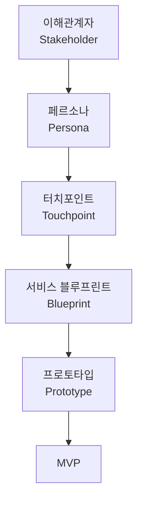

<Callout type="info">
  **이번 문서의 목표:** 터치포인트(Touchpoint), 이해관계자(Stakeholder), 페르소나(Persona), 서비스 블루프린트(Blueprint), 프로토타입(Prototype), MVP(Minimum Viable Product) 여섯 용어의 정의와 관계를 근거를 들어 설명하고, 각 용어를 서로 헷갈리지 않고 답안에 정확히 구분해 쓸 수 있게 됩니다.
</Callout>

## 왜 용어부터 지도로 정리하는가

05편부터는 요구사항 파악, 리서치, 페르소나, 여정지도, 블루프린트, 프로토타입 같은 산출물을 하나씩 깊게 다룹니다. 그런데 이 산출물들은 서로 완전히 독립된 것이 아니라, 몇 가지 핵심 용어를 공통으로 주고받으며 이어집니다. 예를 들어 페르소나를 설명하려면 그 페르소나가 서비스를 이용하며 마주치는 "터치포인트"를 알아야 하고, 블루프린트를 설명하려면 그 블루프린트에 관여하는 "이해관계자"의 역할을 구분할 수 있어야 합니다.

이 편은 앞으로 반복해서 쓰일 여섯 개 용어, 즉 **터치포인트·이해관계자·페르소나·블루프린트·프로토타입·MVP**를 미리 한 장에 정리합니다. 05편 이후로는 이 용어들을 매번 처음부터 다시 정의하지 않고, 필요할 때 "04편에서 정의한 그 개념"이라는 전제로 바로 사용합니다.

> **쉽게 말하면:** 앞으로 자주 등장할 여섯 개 단어의 뜻을 미리 사전처럼 정리해 두는 편입니다.

## 터치포인트(Touchpoint)

**터치포인트**(Touchpoint)는 고객이 서비스를 이용하는 과정에서 그 서비스와 직접 접촉하는 모든 지점을 뜻합니다. 사람(직원), 사물(간판, 영수증), 디지털 화면(앱, 키오스크) 중 어떤 형태든 고객이 서비스의 존재를 느끼고 상호작용하는 순간이면 모두 터치포인트입니다.

**왜 필요한가:** 서비스는 하나의 장소나 화면에서 끝나지 않고 여러 접점에 걸쳐 일어납니다. 카페 브랜드 "보통의 하루"를 예로 들면, 손님은 간판(접점 1)을 보고 들어와 키오스크(접점 2)에서 주문하고, 진동벨(접점 3)을 받아 기다리다 픽업대 직원(접점 4)에게서 음료를 받습니다. 이 네 개의 접점 중 하나라도 불편하면 전체 경험이 나빠지므로, 서비스디자인은 접점을 빠짐없이 나열하는 데서 출발합니다.

> **쉽게 말하면:** 고객이 서비스와 "만나는 모든 순간"입니다.

**자주 틀리는 점:** 터치포인트를 디지털 화면(앱, 웹사이트)에만 한정해 생각하는 경우가 많습니다. 매장의 간판, 직원의 응대, 영수증처럼 물리적이고 인적인 접점도 모두 터치포인트에 포함됩니다. 16편(서비스 구조화와 터치포인트 설계)에서 접점별 매체 설정을 더 깊게 다룹니다.

## 이해관계자(Stakeholder)

**이해관계자**(Stakeholder)는 서비스가 만들어지고 운영되는 과정에 영향을 주거나 영향을 받는 모든 사람·조직을 뜻합니다. 여기에는 서비스를 이용하는 고객뿐 아니라, 서비스를 제공하는 직원, 투자자, 협력업체, 규제 기관까지 포함됩니다.

**왜 필요한가:** 서비스디자인은 고객 한 사람만 만족시키면 되는 일이 아닙니다. 카페의 새로운 사전 주문 앱을 설계할 때, 고객은 편리해지지만 바리스타는 주문이 한꺼번에 몰려 업무 부담이 늘 수 있습니다. 이해관계자를 미리 파악하지 않으면 한쪽의 문제를 해결하다가 다른 쪽에서 새로운 문제를 만들 수 있습니다.

> **쉽게 말하면:** 고객만이 아니라, 서비스와 얽힌 **모든 사람의 이해관계**를 살피는 개념입니다.

**자주 틀리는 점:** 이해관계자를 "고객"과 동의어로 쓰는 경우가 많은데, 고객은 이해관계자의 한 유형일 뿐입니다. 직원, 경영진, 협력업체, 지역 사회처럼 서비스에 관여하는 모든 주체가 이해관계자에 포함됩니다. 12편(이해관계자 분석과 이해관계자 맵)에서 역할별 우선순위 판단까지 자세히 다룹니다.

## 페르소나(Persona)

**페르소나**(Persona)는 실제 사용자 조사 데이터를 바탕으로 만든, 특정 사용자 집단을 대표하는 가상의 인물입니다. 이름, 나이, 직업 같은 기본 정보뿐 아니라 목표, 불편함, 행동 패턴까지 구체적으로 설정해, 서비스를 설계하는 팀 전체가 "이 사람이라면 어떻게 느낄까"를 함께 상상할 수 있게 합니다.

**왜 필요한가:** "20~30대 직장인"처럼 추상적인 집단을 대상으로 설계 논의를 하면, 팀원마다 머릿속에 떠올리는 사람이 제각각이라 논의가 겉돕니다. 페르소나는 관찰조사·면접조사에서 얻은 실제 행동 데이터를 하나의 구체적 인물로 압축해, 이런 혼선을 줄입니다.

<Callout type="tip">
  **답안 예시 — "페르소나가 실제 개인 정보와 다른 이유를 서술하시오"**

  "페르소나는 특정 개인의 신상을 그대로 옮긴 것이 아니라, 여러 사용자 조사 응답에서 공통으로 나타나는 목표와 행동 패턴을 종합해 만든 대표 인물이다. 실존 인물 하나를 기준으로 삼으면 그 사람의 특이한 취향까지 서비스 전체의 기준으로 삼는 오류가 생길 수 있으므로, 여러 사례의 공통점을 추출해 하나의 가상 인물로 재구성한다."
</Callout>

**자주 틀리는 점:** 페르소나를 실제 인터뷰에 응한 한 사람의 신상명세로 착각하는 경우가 있습니다. 페르소나는 여러 사용자의 공통된 행동 패턴을 종합해 만든 **대표성 있는 가상 인물**입니다. 10편(페르소나 개발)에서 유형 설정 절차와 실기 기출 접근법까지 깊게 다룹니다.

## 서비스 블루프린트(Blueprint)

**서비스 블루프린트**(Service Blueprint)는 고객의 행동과 그 뒤에서 진행되는 직원·시스템의 활동을 한 장의 표로 함께 배치해, 서비스가 어떻게 운영되는지 전체를 보여 주는 다이어그램입니다. 블루프린트(Blueprint)라는 단어는 원래 건축 설계도를 인쇄하던 파란색 도면을 가리키던 말로, 서비스디자인에서는 "서비스의 설계도"라는 뜻으로 쓰입니다.

**왜 필요한가:** 고객 여정 지도는 고객이 겪는 경험만 보여 주지만, 실제로 그 경험을 만들어 내는 것은 눈에 보이지 않는 직원의 업무와 시스템입니다. 블루프린트는 고객에게 보이는 부분(프런트스테이지)과 보이지 않는 뒷단(백스테이지)을 함께 그려서, 어느 뒷단 프로세스가 고객 경험에 문제를 일으키는지 찾아낼 수 있게 합니다.

> **쉽게 말하면:** 여정지도가 "고객이 겪는 이야기"라면, 블루프린트는 그 이야기 뒤에서 **누가 무엇을 하고 있는지까지 함께 그린 설계도**입니다.

**자주 틀리는 점:** 블루프린트를 여정지도와 같은 것으로 혼동하는 경우가 많습니다. 여정지도는 고객의 행동과 감정에 집중하고, 블루프린트는 거기에 더해 직원의 뒷단 업무와 지원 프로세스까지 포함하는 더 넓은 다이어그램입니다. 20편(서비스 블루프린트)에서 구성요소와 실패 지점 표시법까지 깊게 다룹니다.

## 프로토타입(Prototype)

**프로토타입**(Prototype)은 아이디어를 실제로 확인해 보기 위해 만드는 시험용 모형입니다. 완성된 서비스가 아니라, 핵심 아이디어가 실제로 작동하는지 빠르고 저렴하게 검증하기 위한 임시 형태입니다. 종이에 그린 화면 스케치, 역할극으로 재현한 응대 시나리오도 모두 프로토타입에 해당합니다.

**왜 필요한가:** 완성된 서비스를 다 만든 뒤에 문제를 발견하면 되돌리는 비용이 매우 큽니다. 저충실도(Low-fidelity, 완성도가 낮은) 프로토타입으로 미리 반응을 확인하면, 큰 비용을 들이기 전에 방향을 수정할 수 있습니다.

> **쉽게 말하면:** 진짜로 다 만들기 전에, **작동 여부만 빠르게 확인해 보는 시험용 모형**입니다.

**자주 틀리는 점:** 프로토타입을 "완성도가 높아야 의미 있다"고 생각하는 경우가 있는데, 오히려 서비스디자인에서는 초반에 종이나 역할극 같은 저충실도 프로토타입으로 빠르게 검증하는 것을 권장합니다. 17~18편(서비스 프로토타입 기획과 제작)에서 자세히 다룹니다.

## MVP(Minimum Viable Product)

**MVP**(Minimum Viable Product, 최소 기능 제품)는 고객에게 실제로 가치를 전달할 수 있는 최소한의 기능만 담아 빠르게 내놓는 버전을 뜻합니다. 세 단어를 풀면 "최소한(Minimum)의, 생존 가능한(Viable, 실제로 쓸모 있는), 제품(Product)"이라는 의미입니다.

**왜 필요한가:** 모든 기능을 다 갖춘 뒤에 서비스를 내놓으려 하면 시간과 비용이 크게 들고, 정작 그 기능들이 고객에게 필요한지도 확신할 수 없습니다. MVP는 핵심 가치를 담은 최소 버전을 먼저 내놓아 실제 반응을 확인하고, 그 반응에 따라 다음에 무엇을 더할지 결정합니다.

> **쉽게 말하면:** 이것저것 다 갖춘 완제품이 아니라, **핵심만 담아 먼저 내놓고 반응을 보는 버전**입니다.

<Callout type="tip">
  **답안 예시 — "프로토타입과 MVP의 차이를 설명하시오"**

  "프로토타입은 아이디어가 작동하는지 확인하기 위한 시험용 모형으로, 실제 고객에게 서비스를 제공하지 않는 내부 검증용인 경우가 많다. 반면 MVP는 최소한의 기능이지만 실제로 고객에게 가치를 전달하며 운영되는 제품이다. 예를 들어 종이에 그린 앱 화면으로 사용자 반응을 확인하는 것은 프로토타입이고, 핵심 기능만 담아 실제로 출시해 고객이 쓰게 하는 것은 MVP다."
</Callout>

**자주 틀리는 점:** 프로토타입과 MVP를 같은 개념으로 혼동하는 경우가 흔합니다. 프로토타입은 아직 고객에게 정식으로 제공되지 않는 검증용 모형이고, MVP는 기능은 최소지만 실제로 고객에게 가치를 전달하며 운영된다는 점에서 다릅니다.

## 여섯 용어의 관계 지도

여섯 용어는 프로젝트가 진행되는 순서를 따라 자연스럽게 이어집니다.

- **이해관계자**를 먼저 파악해야 그중 누구를 대표하는 **페르소나**를 만들지 정할 수 있습니다.
- 페르소나가 서비스를 이용하며 지나가는 **터치포인트**들을 나열하면, 그 터치포인트를 포함한 **블루프린트**를 그릴 수 있습니다.
- 블루프린트로 드러난 개선 지점을 바탕으로 **프로토타입**을 만들어 검증하고, 검증을 마친 핵심 기능을 추려 **MVP**로 내놓습니다.

**해석:** 이 순서는 절대적인 것이 아니라, 각 개념이 논리적으로 어느 개념 위에서 만들어지는지를 보여 주는 지도입니다. 예를 들어 프로토타입을 테스트하다가 새로운 이해관계자(예: 배달 플랫폼 담당자)가 드러나면 다시 앞 단계로 돌아가 이해관계자 목록을 갱신하기도 합니다. 이는 02편에서 본 더블 다이아몬드의 반복 구조와 같은 원리입니다.

<Callout type="tip">
  **답안 예시 — "이해관계자, 페르소나, 터치포인트 세 용어의 관계를 설명하시오"**

  "이해관계자는 서비스에 영향을 주거나 받는 모든 사람과 조직을 뜻하며, 이 중 서비스를 이용하는 고객 집단의 조사 데이터를 종합해 대표 인물인 페르소나를 만든다. 페르소나가 서비스를 이용하는 과정에서 실제로 접촉하는 지점들이 터치포인트이며, 페르소나의 목표와 행동을 알아야 그 페르소나에게 중요한 터치포인트가 무엇인지 판단할 수 있다. 따라서 세 개념은 이해관계자 파악에서 페르소나 설정으로, 다시 터치포인트 식별로 이어지는 순서를 갖는다."
</Callout>

**자주 틀리는 점:** 여섯 용어를 서로 완전히 독립된 개념으로 암기해 관계를 놓치는 경우가 많습니다. 실기 답안에서 두 용어의 관계를 묻는 문제(예: 페르소나와 이해관계자의 관계)가 나올 수 있으므로, 각 용어를 단독 정의뿐 아니라 이 관계 지도 안에서 설명할 수 있어야 합니다.

## 핵심 정리

- **터치포인트**는 고객이 서비스와 접촉하는 모든 지점이며, 디지털 화면뿐 아니라 인적·물리적 접점도 포함한다.
- **이해관계자**는 고객을 포함해 서비스에 영향을 주거나 받는 모든 사람·조직이며, 고객은 이해관계자의 한 유형일 뿐이다.
- **페르소나**는 실제 사용자 데이터를 종합한 대표 가상 인물이며, 특정 개인의 신상명세가 아니다.
- **서비스 블루프린트**는 고객의 행동(프런트스테이지)과 뒷단 업무(백스테이지)를 함께 그려, 여정지도보다 넓은 범위를 다룬다.
- **프로토타입**은 아이디어를 빠르게 검증하는 시험용 모형이고, **MVP**는 최소 기능으로 실제 고객에게 가치를 전달하는 제품이라는 점에서 다르다.
- 여섯 용어는 이해관계자→페르소나→터치포인트→블루프린트→프로토타입→MVP의 순서로 논리적으로 이어지지만, 검증 결과에 따라 앞 단계로 되돌아갈 수 있다.

## 마무리 복습

<Quiz
  questionNumber={1}
  question="터치포인트(Touchpoint)에 대한 설명으로 가장 적절한 것은?"
  options={['앱이나 웹사이트 같은 디지털 화면만을 가리킨다', '고객이 서비스와 직접 접촉하는 모든 지점으로 인적·물리적 접점도 포함한다', '서비스를 만드는 내부 직원들만을 가리킨다', '서비스 이용 요금을 결제하는 화면만을 가리킨다']}
  correctAnswer={2}
  explanation="터치포인트는 사람, 사물, 디지털 화면을 가리지 않고 고객이 서비스와 상호작용하는 모든 접점을 뜻한다."
  optionExplanations={['디지털 화면은 터치포인트의 일부일 뿐이다.', '인적·물리적·디지털 접점을 모두 포함하므로 정답이다.', '직원 자체가 아니라 고객과 직원이 만나는 접점을 가리킨다.', '결제 화면은 여러 터치포인트 중 하나일 뿐이다.']}
/>

<Quiz
  questionNumber={2}
  question="이해관계자(Stakeholder)와 고객의 관계에 대한 설명으로 옳은 것은?"
  options={['이해관계자와 고객은 동의어이므로 구분할 필요가 없다', '고객은 이해관계자에 포함되지 않는 별도의 개념이다', '고객은 이해관계자의 한 유형이며, 직원·협력업체 등도 이해관계자에 포함된다', '이해관계자는 서비스 외부의 규제 기관만을 뜻한다']}
  correctAnswer={3}
  explanation="이해관계자는 고객을 포함해 서비스에 영향을 주거나 받는 모든 사람과 조직을 아우르는 더 넓은 개념이다."
  optionExplanations={['고객은 이해관계자의 여러 유형 중 하나일 뿐이므로 동의어로 볼 수 없다.', '고객도 이해관계자에 포함되는 대표적 유형이다.', '고객을 포함한 여러 유형을 아우르는 개념이므로 정답이다.', '규제 기관 외에도 고객, 직원, 협력업체가 모두 포함된다.']}
/>

<Quiz
  questionNumber={3}
  question="페르소나(Persona)에 대한 설명으로 가장 적절한 것은?"
  options={['실제 인터뷰에 응한 한 사람의 신상명세를 그대로 옮긴 것이다', '여러 사용자 조사에서 나타난 공통 행동 패턴을 종합한 대표 가상 인물이다', '서비스를 이용하는 모든 고객의 평균 나이만을 나타낸 수치다', '서비스 제공자 측 직원을 대표하는 인물이다']}
  correctAnswer={2}
  explanation="페르소나는 특정 개인이 아니라 여러 사용자의 공통된 목표와 행동을 종합해 만든 대표성 있는 가상 인물이다."
  optionExplanations={['한 사람의 신상 그대로가 아니라 여러 사례를 종합한 결과물이다.', '여러 사례의 공통점을 종합한 대표 인물이므로 정답이다.', '평균 나이 같은 단일 수치가 아니라 목표와 행동까지 포함한 인물상이다.', '페르소나는 일반적으로 서비스 이용 고객을 대표한다.']}
/>

<Quiz
  questionNumber={4}
  question="고객 여정 지도와 서비스 블루프린트의 차이로 가장 적절한 것은?"
  options={['둘은 완전히 동일한 다이어그램이며 이름만 다르다', '여정 지도는 고객 행동과 감정에 집중하고, 블루프린트는 여기에 더해 뒷단 직원 업무와 지원 프로세스까지 포함한다', '블루프린트는 고객 행동을 다루지 않는다', '여정 지도가 블루프린트보다 더 많은 요소를 포함한다']}
  correctAnswer={2}
  explanation="블루프린트는 여정 지도가 다루는 고객 행동·감정에 더해, 프런트스테이지·백스테이지 직원 행동과 지원 프로세스까지 포함하는 더 넓은 범위의 다이어그램이다."
  optionExplanations={['범위가 서로 다른 별개의 다이어그램이다.', '블루프린트가 더 넓은 범위를 다룬다는 설명이 정확하므로 정답이다.', '블루프린트도 고객 행동을 상단 행에 포함한다.', '더 많은 요소를 포함하는 쪽은 블루프린트다.']}
/>

<Quiz
  questionNumber={5}
  question="프로토타입(Prototype)과 MVP(Minimum Viable Product)의 차이로 가장 적절한 것은?"
  options={['프로토타입은 실제 고객에게 정식으로 제공되는 완제품이다', '프로토타입은 아이디어 검증용 시험 모형이고, MVP는 최소 기능이지만 실제로 고객에게 가치를 전달하며 운영되는 제품이다', 'MVP는 완성도가 가장 높은 최종 버전을 뜻한다', '둘은 동일한 개념이며 순서만 다르게 부르는 것이다']}
  correctAnswer={2}
  explanation="프로토타입은 내부 검증을 위한 시험용 모형인 경우가 많고, MVP는 기능은 최소지만 실제로 고객에게 서비스되는 제품이라는 점에서 다르다."
  optionExplanations={['정식 제공 여부에서 프로토타입과 MVP는 차이가 있다.', '검증용 모형과 실제 운영 제품이라는 구분이 정확하므로 정답이다.', 'MVP는 최종 완성 버전이 아니라 최소 기능 버전이다.', '검증 목적과 실제 운영 여부에서 서로 다른 개념이다.']}
/>

<Quiz
  questionNumber={6}
  question="이해관계자, 페르소나, 터치포인트 세 용어가 이어지는 논리적 순서로 가장 적절한 것은?"
  options={['터치포인트 식별 후 이해관계자를 파악하고 마지막에 페르소나를 만든다', '이해관계자를 파악해 대표 인물인 페르소나를 만들고, 그 페르소나가 접촉하는 터치포인트를 식별한다', '페르소나를 먼저 만들고 나서 이해관계자 개념을 폐기한다', '세 용어는 순서 없이 완전히 독립적으로 존재한다']}
  correctAnswer={2}
  explanation="이해관계자 중 고객 집단의 데이터를 종합해 페르소나를 만들고, 그 페르소나의 행동을 바탕으로 터치포인트를 식별하는 순서로 개념이 이어진다."
  optionExplanations={['이해관계자 파악이 페르소나 설정보다 먼저 이루어져야 한다.', '이해관계자에서 페르소나로, 다시 터치포인트로 이어지는 순서이므로 정답이다.', '이해관계자 개념은 이후에도 계속 참조되며 폐기되지 않는다.', '세 용어는 서로 이어지는 관계를 가지므로 완전히 독립적이지 않다.']}
/>

## 참고 자료

- [Nielsen Norman Group - Personas Make Users Memorable](https://www.nngroup.com/articles/persona/)
- [Nielsen Norman Group - Service Blueprints: Definition](https://www.nngroup.com/articles/service-blueprints-definition/)
- [Nielsen Norman Group - Journey Mapping 101](https://www.nngroup.com/articles/journey-mapping-101/)
- [Interaction Design Foundation - Minimum Viable Products (MVP)](https://ixdf.org/literature/topics/minimum-viable-product-mvp)
