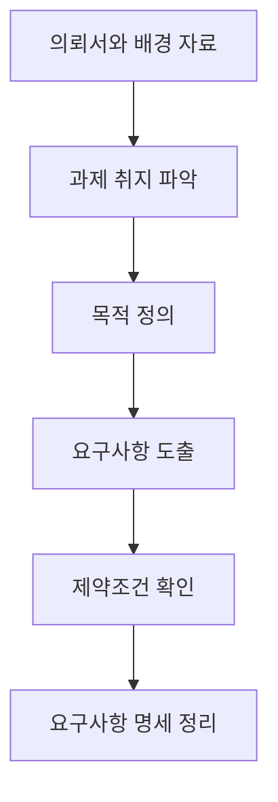

<Callout type="info">
  **이번 문서의 목표:** 프로젝트 관련 자료에서 요구사항을 뽑아내 명시적 요구와 암묵적 요구로 구분하고, 견적 산출 근거를 표로 정리하며, 배경부터 기대효과까지 갖춘 제안서를 서술형 답안 형식으로 완성할 수 있게 된다.
</Callout>

## 이 편에서 쓸 가상 프로젝트

앞으로 05편부터 08편까지는 하나의 가상 프로젝트를 계속 이어서 씁니다. 답안을 쓸 때 매번 새로운 상황을 상상하는 대신, 같은 사례로 리서치가 쌓여 가는 과정을 그대로 따라가면 실기 서술형 답안의 흐름이 몸에 붙습니다.

**의뢰 배경.** 지역 반찬가게 세 곳이 모인 소상공인 협동조합 "맛있는하루"가 디자인팀에 의뢰서를 보냈습니다. 의뢰서에는 이렇게 적혀 있습니다. "1인 가구가 늘어나는데 저녁 반찬을 사러 매번 가게에 오는 손님이 줄고 있다. 정기적으로 반찬을 받아볼 수 있는 구독 서비스를 만들고 싶다. 앱이든 뭐든 좋으니 방법을 제안해 달라." 이 한 문단짜리 의뢰서에서 실제로 만들어야 할 것을 뽑아내는 일이 이번 편의 과제입니다.

## 왜 요구사항부터 정확히 파악해야 하는가

의뢰서 한 문단만 보고 바로 화면을 그리기 시작하면, 나중에 "이게 아니라 저걸 원했다"는 말을 듣고 처음부터 다시 시작하게 됩니다. 실기 답안에서도 마찬가지입니다. 문제 지문이 던지는 상황을 잘못 해석하면 이어지는 페르소나·여정지도·블루프린트까지 전부 방향이 틀어집니다.

> **쉽게 말하면:** 집을 짓기 전에 건축주가 정말 원하는 집이 무엇인지 도면 없이 먼저 대화로 확인하는 단계입니다.

**요구사항**(requirement)은 프로젝트의 결과물이 반드시 만족해야 하는 조건을 말합니다. "1인 가구를 위한 반찬 구독 서비스"라는 한 문장 안에도 실은 여러 겹의 요구사항이 숨어 있습니다. 이 겹을 펼쳐서 목록으로 만드는 작업이 이번 편의 핵심입니다.

## 1. 프로젝트 관련 자료로 사용자 요구 파악하기

### 어떤 자료부터 봐야 하는가

의뢰서 한 장으로는 절대 부족합니다. 실무에서나 실기 답안에서나 다음 순서로 자료를 넓혀 갑니다.

| 자료 구분 | 예시 | 확인할 내용 |
|-----------|------|-------------|
| 의뢰 자료(1차) | 의뢰서, 제안요청서, 발주자와의 회의록 | 의뢰인이 명시적으로 밝힌 목적과 범위 |
| 내부 운영 자료 | 매출 장부, 단골 고객 명단, 기존 배달 앱 후기 | 실제 운영에서 드러난 문제와 강점 |
| 외부 2차 자료 | 통계청 1인 가구 통계, 유사 서비스 뉴스 기사 | 시장 규모와 트렌드 (자세한 방법은 06편) |
| 이해관계자 구술 | 조합 대표·가게 사장님과의 사전 미팅 | 말로는 하지 않았지만 걱정하는 부분 |

**여기서 자주 놓치는 지점:** 의뢰서만 읽고 조사를 끝내는 경우가 많습니다. 하지만 의뢰서는 의뢰인이 **이미 자신의 언어로 정리한 결론**입니다. 그 결론이 나온 배경 자료(장부, 후기, 회의록)를 직접 봐야, 의뢰인조차 미처 말로 표현하지 못한 진짜 문제를 발견할 수 있습니다.

### 사례 적용

"맛있는하루" 사례에서는 다음 세 가지를 먼저 확인합니다.

- 세 가게의 최근 1년 매출 장부에서 요일별·시간대별 판매량 변화
- 가게에 붙은 손님 후기 메모와 조합 대표가 언급한 "요즘 손님들이 그러는데" 류의 구술 정보
- 조합이 이미 시도했다가 실패한 방법(전단지 배포, 지역 카페 게시글)이 있었는지 여부

이 세 가지를 확인하면 "구독 서비스를 만들고 싶다"는 한 줄 뒤에, 사실은 "오프라인 매장 방문이 줄고 있다"는 더 근본적인 문제가 있다는 것이 보입니다.

## 2. 과제 취지·목적·성격·요구사항 도출

### 목적과 요구사항은 다른 층위다

> **쉽게 말하면:** 목적은 "왜 이 일을 하는가"이고 요구사항은 "그 결과물이 갖춰야 할 구체적인 조건"입니다.

**목적**(purpose)은 이 프로젝트를 왜 하는지 설명하는 상위 문장입니다. "맛있는하루" 사례의 목적은 "오프라인 매장 방문 감소를 만회할 새로운 매출 경로를 확보한다"입니다. **요구사항**(requirement)은 그 목적을 이루기 위해 결과물이 갖춰야 할 조건들입니다. "정기 배송 주기를 설정할 수 있어야 한다", "세 가게의 재고 현황을 반영해야 한다" 같은 문장이 요구사항입니다.

**자주 틀리는 점:** 목적과 요구사항을 같은 층위로 나열하는 답안이 많습니다. "목적은 매출 증대이고 요구사항도 매출 증대다"라는 식의 서술은 감점 대상입니다. 목적은 하나의 큰 방향이고, 요구사항은 그 방향 아래 여러 개가 나열되는 구체적 조건이어야 합니다.

### 명시적 요구와 암묵적 요구

의뢰인의 말은 두 종류로 나뉩니다.

| 구분 | 정의 | 사례 |
|------|------|------|
| 명시적 요구 | 의뢰인이 문장으로 직접 말한 요구 | "구독 서비스를 만들고 싶다", "앱이든 뭐든 좋다" |
| 암묵적 요구 | 말하지 않았지만 당연히 전제하는 요구 | "세 가게 모두 참여해야 공평하다", "노년층 사장님도 다룰 수 있을 만큼 운영이 단순해야 한다" |

**암묵적 요구를 놓치면 벌어지는 일:** 앱 화면은 근사하게 만들었는데 정작 가게 사장님이 매일 재고를 입력하는 방법을 몰라 운영이 멈추는 경우가 실제로 자주 생깁니다. 이런 요구는 의뢰서에 절대 문장으로 등장하지 않습니다. 이해관계자 구술과 현장 관찰(07편에서 다룹니다)을 통해서만 드러납니다.

### 요구사항과 제약조건 구분

**제약조건**(constraint)은 요구사항과 헷갈리기 쉽지만 정반대의 성격을 갖습니다. 요구사항이 "결과물이 해야 하는 일"이라면, 제약조건은 "결과물이 넘을 수 없는 한계"입니다. "예산은 500만 원을 넘지 않는다", "가게마다 인터넷 환경이 다르므로 별도 서버 구축은 불가능하다" 같은 문장이 제약조건입니다.

### 서술형 답안 예시 — 요구사항 명세

실기에서 "다음 의뢰 상황을 읽고 요구사항을 도출하시오" 유형이 나오면 아래처럼 목적·요구사항·제약조건을 나눠 서술합니다.

**목적:** 오프라인 매장 방문 감소를 만회할 정기 매출 경로를 확보한다.

**요구사항(명시적):**
- 손님이 반찬 종류와 배송 주기를 스스로 선택할 수 있어야 한다
- 특정 애플리케이션 형태에 얽매이지 않고 실현 가능한 수단을 제안한다

**요구사항(암묵적):**
- 세 가게가 동등하게 주문을 배정받는 구조여야 한다
- 디지털 기기 사용이 익숙하지 않은 사장님도 매일 운영할 수 있어야 한다

**제약조건:**
- 예산 500만 원 이내
- 자체 배송 인력 없이 기존 동네 배달 대행을 활용

## 3. 견적서 산출 근거 정리

### 왜 근거 없는 견적은 통과되지 않는가

의뢰인 입장에서 "총 500만 원입니다"라는 한 줄만 보면 그 금액이 적정한지 판단할 수 없습니다. 견적서는 금액이 아니라 **그 금액이 어떻게 계산되었는지 보여 주는 문서**입니다.

> **쉽게 말하면:** 영수증 없는 청구서는 아무도 믿지 않습니다.

### 견적 구성요소

| 구성요소 | 내용 | 산정 방식 |
|----------|------|-----------|
| 인건비 | 리서치·기획·디자인 인력의 투입 비용 | 투입 기간(맨먼스, Man-Month) × 직급별 단가 |
| 재료비·경비 | 인터뷰 사례비, 프로토타입 제작 재료 | 항목별 실제 소요 예상액 합산 |
| 관리비 | 프로젝트 관리·의사소통에 드는 간접비 | 인건비의 일정 비율(예: 10퍼센트)로 계상 |
| 이윤 | 수행 조직의 적정 이익 | 위 항목 합계의 일정 비율 |

**맨먼스**(Man-Month)란 한 사람이 한 달 동안 투입되는 작업량을 1로 놓는 단위입니다. 두 사람이 보름씩 투입되면 1맨먼스, 한 사람이 두 달 투입되면 2맨먼스입니다.

### 손으로 계산해 보기

"맛있는하루" 프로젝트에 기획자 1명이 0.5개월, 디자이너 1명이 1개월 투입된다고 가정합니다. 기획자 단가는 월 300만 원, 디자이너 단가는 월 250만 원입니다.

$$
\text{기획 인건비} = 0.5 \times 3,000,000 = 1,500,000
$$

$$
\text{디자인 인건비} = 1 \times 2,500,000 = 2,500,000
$$

$$
\text{인건비 합계} = 1,500,000 + 2,500,000 = 4,000,000
$$

여기에 인터뷰 사례비 등 경비 30만 원을 더하면 직접비는 430만 원이 됩니다. 관리비를 직접비의 10퍼센트로 잡으면 43만 원이 더해져 총 473만 원이 됩니다.

**해석:** 이렇게 단계를 나눠 적어 두면, 의뢰인이 "디자이너 투입을 0.5개월로 줄이면 얼마가 되나요"라고 물었을 때 즉시 재계산해 보여줄 수 있습니다. 총액만 있었다면 이 질문에 답할 수 없습니다.

**자주 틀리는 점:** 견적서에 총액과 항목명만 나열하고 산정 방식(단가 × 투입량)을 생략하는 경우가 가장 흔한 감점 사유입니다. 반드시 단가와 투입 기간을 곱하는 계산 과정을 함께 적습니다.

## 4. 문서작성 소프트웨어로 기획안(제안서) 작성하기

### 제안서에 반드시 들어가는 항목

<Steps>

1. **표지와 개요** — 과제명, 의뢰 기관, 작성일
2. **배경** — 왜 이 과제가 필요해졌는지(자료 1절에서 파악한 내용)
3. **목적** — 이 과제로 달성하려는 상위 방향
4. **요구사항 요약** — 2절에서 도출한 명시적·암묵적 요구, 제약조건
5. **추진 방안** — 어떤 절차(리서치 → 분석 → 콘셉트 → 프로토타입)로 진행할지
6. **일정** — 단계별 기간
7. **견적** — 3절에서 정리한 산출 근거 포함
8. **기대효과** — 완료 시 의뢰인이 얻는 것

</Steps>

**작성 소프트웨어에 관한 원칙:** 실기 답안에서는 특정 소프트웨어 이름을 쓰는 것이 중요하지 않습니다. 워드프로세서든 프레젠테이션 도구든, 위 여덟 항목이 **읽는 사람이 앞에서부터 순서대로 이해할 수 있게 배치**되어 있는지가 채점 포인트입니다. 배경 없이 추진 방안부터 등장하면 읽는 사람은 "왜 이렇게 하는지" 알 수 없습니다.

### 서술형 답안 예시 — 제안서 요약본

**배경:** 최근 1년간 세 가게의 저녁 시간대 매장 방문 매출이 감소했고, 조합 회의에서 1인 가구 손님의 방문 빈도가 특히 줄었다는 의견이 확인되었다.

**목적:** 오프라인 매장 방문 감소를 만회할 정기 매출 경로를 확보한다.

**추진 방안:** 데스크 리서치로 1인 가구의 저녁 식사 실태와 유사 서비스를 조사하고(06편), 관찰조사와 면접조사로 실제 저녁 준비 행동과 구독 의향을 확인한 뒤(07편·08편), 그 결과를 종합해 페르소나와 여정지도를 만들어 서비스 콘셉트를 도출한다.

**일정:** 리서치 3주, 분석과 콘셉트 도출 2주, 프로토타입 제작과 검증 2주, 총 7주.

**기대효과:** 세 가게가 공동으로 운영 가능한 저비용 구독 서비스 콘셉트를 확보하고, 매장 방문에 의존하지 않는 예측 가능한 정기 매출을 만든다.

## 핵심 정리

- **요구사항**은 결과물이 갖춰야 할 구체적 조건이고, **목적**은 그 위에 있는 상위 방향이다. 둘을 같은 층위로 나열하면 안 된다.
- 의뢰인의 말은 **명시적 요구**와 **암묵적 요구**로 나뉜다. 암묵적 요구는 구술과 현장 관찰로만 드러난다.
- **제약조건**은 요구사항과 반대로 "넘을 수 없는 한계"를 뜻한다.
- 견적서는 총액이 아니라 **단가 × 투입량**의 계산 근거를 함께 제시해야 신뢰를 얻는다.
- 제안서는 배경부터 기대효과까지 **읽는 순서대로** 배치된 문서이며, 소프트웨어 종류보다 항목의 순서와 논리적 연결이 채점 포인트다.

## 마무리 복습

<Quiz
  questionNumber={1}
  question="의뢰서 한 문단만 보고 조사를 끝내지 않고 매출 장부, 손님 후기, 조합 대표의 구술을 추가로 확인하는 이유로 가장 적절한 것은?"
  options={['의뢰인의 신뢰를 얻기 위한 형식적 절차이기 때문이다', '의뢰서는 의뢰인이 이미 정리한 결론이라 그 배경까지 봐야 진짜 문제가 드러나기 때문이다', '견적서 금액을 부풀리기 위한 근거 자료가 필요하기 때문이다', '의뢰서 내용이 대체로 거짓이기 때문이다']}
  correctAnswer={2}
  explanation="의뢰서는 의뢰인이 자신의 언어로 이미 요약한 결론이므로, 그 결론이 나온 배경 자료를 직접 봐야 의뢰인조차 말로 표현하지 못한 근본 문제를 발견할 수 있다."
  optionExplanations={['형식적 절차가 아니라 근본 문제를 발견하기 위한 실질적 조사다.', '배경 자료를 통해 의뢰서 이면의 진짜 문제를 발견하는 것이 핵심 이유다.', '견적 근거와는 무관한 목적이다.', '의뢰서가 거짓이라서가 아니라 정보가 압축되어 있기 때문이다.']}
/>

<Quiz
  questionNumber={2}
  question="목적과 요구사항의 관계를 가장 올바르게 설명한 것은?"
  options={['목적과 요구사항은 같은 층위에서 나열되는 동등한 개념이다', '목적은 상위 방향이고 요구사항은 그 목적을 이루기 위한 구체적 조건들이다', '요구사항이 정해져야만 목적을 세울 수 있다', '목적은 예산과 일정만을 가리키는 말이다']}
  correctAnswer={2}
  explanation="목적은 프로젝트를 왜 하는지 설명하는 상위 문장이고, 요구사항은 그 목적을 이루기 위해 결과물이 갖춰야 할 구체적 조건들로, 서로 다른 층위에 있다."
  optionExplanations={['같은 층위로 나열하면 감점 대상이 되는 흔한 오류다.', '상위 방향과 구체적 조건의 관계를 정확히 서술했다.', '실제로는 목적이 먼저 정의되고 요구사항이 그 아래에서 도출된다.', '예산과 일정은 제약조건이나 일정 항목이지 목적의 정의가 아니다.']}
/>

<Quiz
  questionNumber={3}
  question="다음 중 암묵적 요구의 예로 가장 적절한 것은?"
  options={['손님이 배송 주기를 스스로 선택할 수 있어야 한다는 의뢰인의 문장', '예산이 500만 원을 넘지 않는다는 의뢰인의 문장', '디지털 기기 사용이 익숙하지 않은 사장님도 매일 운영할 수 있어야 한다는, 문장으로 언급되지 않은 전제', '앱이든 뭐든 좋다는 의뢰인의 문장']}
  correctAnswer={3}
  explanation="암묵적 요구는 의뢰인이 문장으로 말하지 않았지만 당연히 전제하는 요구다. 사장님의 운영 편의성은 의뢰서에 등장하지 않지만 현장 관찰과 구술을 통해 드러나는 전제 조건이다."
  optionExplanations={['의뢰인이 직접 말한 명시적 요구다.', '한계를 나타내는 제약조건이다.', '문장으로 언급되지 않았지만 당연히 전제되는 요구이므로 암묵적 요구다.', '의뢰인이 직접 말한 명시적 요구다.']}
/>

<Quiz
  questionNumber={4}
  question="기획자 1명이 0.5개월(월 단가 300만 원), 디자이너 1명이 1개월(월 단가 250만 원) 투입될 때 인건비 합계는 얼마인가?"
  options={['400만 원', '430만 원', '550만 원', '300만 원']}
  correctAnswer={1}
  explanation="기획 인건비는 0.5×300만 원=150만 원, 디자인 인건비는 1×250만 원=250만 원이며 합계는 150만 원+250만 원=400만 원이다."
  optionExplanations={['150만 원+250만 원=400만 원으로 계산이 정확하다.', '경비 30만 원까지 더한 직접비 총액이며 인건비 자체와는 다르다.', '단가를 투입 기간과 반대로 곱한 값이다.', '디자이너 인건비만 반영한 값이다.']}
/>

<Quiz
  questionNumber={5}
  question="견적서 작성에서 가장 자주 지적되는 감점 사유는 무엇인가?"
  options={['항목을 지나치게 세분화하는 것', '총액과 항목명만 나열하고 단가와 투입량 같은 산정 근거를 생략하는 것', '관리비를 직접비의 일정 비율로 계상하는 것', '이윤 항목을 포함하는 것']}
  correctAnswer={2}
  explanation="견적서는 금액 자체보다 그 금액이 어떻게 계산되었는지 보여 주는 문서이므로, 단가와 투입량 같은 산정 근거 없이 총액만 제시하면 신뢰를 얻지 못하고 감점된다."
  optionExplanations={['세분화는 오히려 신뢰를 높이는 요소다.', '산정 근거 생략이 견적서에서 가장 흔한 감점 사유다.', '관리비를 비율로 계상하는 것은 일반적인 정상 관행이다.', '이윤 포함은 견적 구성의 정상 항목이다.']}
/>

<Quiz
  questionNumber={6}
  question="제안서의 여덟 항목 중 배경과 목적을 먼저 배치하고 추진 방안을 그 뒤에 두는 이유로 가장 적절한 것은?"
  options={['글자 수를 맞추기 위한 관행이기 때문이다', '읽는 사람이 왜 이렇게 진행하는지 이해하려면 배경과 목적을 먼저 알아야 하기 때문이다', '특정 문서작성 소프트웨어의 기본 서식이기 때문이다', '배경과 목적이 없으면 견적을 계산할 수 없기 때문이다']}
  correctAnswer={2}
  explanation="제안서는 읽는 사람이 앞에서부터 순서대로 이해할 수 있게 배치된 문서다. 배경과 목적 없이 추진 방안부터 나오면 읽는 사람은 왜 그런 방식을 택했는지 알 수 없다."
  optionExplanations={['관행이 아니라 독자의 이해 순서를 고려한 논리적 배치다.', '읽는 사람의 이해 순서를 고려한 배치라는 설명이 정확하다.', '소프트웨어 서식이 아니라 문서 논리 구조의 문제다.', '견적 계산과 항목 배치 순서는 직접적 인과관계가 없다.']}
/>

<Quiz
  questionNumber={7}
  question="요구사항과 제약조건의 차이를 가장 올바르게 설명한 것은?"
  options={['요구사항은 결과물이 해야 하는 일이고, 제약조건은 결과물이 넘을 수 없는 한계다', '요구사항과 제약조건은 서로 바꿔 써도 되는 같은 개념이다', '제약조건은 의뢰인이 아니라 디자이너가 임의로 정하는 것이다', '요구사항은 예산에 관한 것이고 제약조건은 일정에 관한 것이다']}
  correctAnswer={1}
  explanation="요구사항은 결과물이 반드시 해야 하는 일을 규정하고, 제약조건은 그 결과물이 넘을 수 없는 한계(예산, 기술, 인력 등)를 규정하는 반대 성격의 개념이다."
  optionExplanations={['해야 하는 일과 넘을 수 없는 한계라는 반대 성격을 정확히 구분했다.', '두 개념은 성격이 반대이므로 바꿔 쓸 수 없다.', '제약조건도 의뢰인의 상황(예산, 환경)에서 비롯되는 경우가 대부분이다.', '예산과 일정 모두 제약조건에 해당할 수 있으며 요구사항과의 구분 기준이 아니다.']}
/>

## 참고 자료

- [한국산업인력공단(브런치 경유 원문) - 서비스·경험디자인 기사 출제기준(필기·실기)](https://t1.daumcdn.net/brunch/service/user/13ur/file/tayw3sSk4ib3un2lLq5U249xKUg.pdf)
- [Nielsen Norman Group - Stakeholder Interviews 101](https://www.nngroup.com/articles/stakeholder-interviews/)
