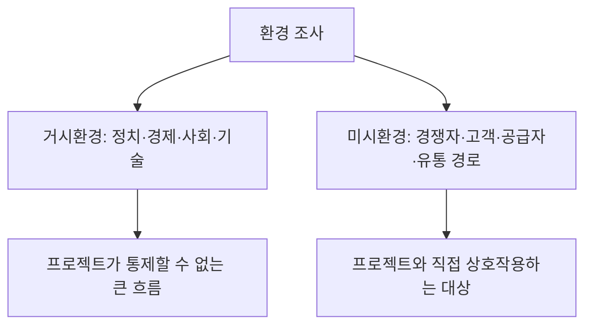

<Callout type="info">
  **이번 문서의 목표:** 데스크 리서치의 절차를 순서대로 밟아 자료를 수집·정리하고, 거시환경과 미시환경을 구분해 분석하며, 유사·경쟁 서비스를 비교표로 정리해 서술형 답안을 완성할 수 있게 된다.
</Callout>

## 지난 편 요약과 이번 편의 위치

05편에서 "맛있는하루" 조합의 의뢰서를 분석해 목적·요구사항·제약조건을 정리했습니다. 이제 그 요구사항이 실제 시장 상황에서 타당한지 확인할 차례입니다. 현장에 나가 사람을 만나기 전에(관찰조사·면접조사는 07편·08편), 책상에서 먼저 조사할 수 있는 것부터 조사합니다.

## 왜 현장에 나가기 전에 책상에서 먼저 조사하는가

관찰조사와 면접조사는 시간과 비용이 많이 듭니다. 이미 공개된 통계나 기존 자료로 답할 수 있는 질문까지 사람을 만나서 물어보면 비효율적입니다.

> **쉽게 말하면:** 남에게 묻기 전에 인터넷과 서류에 이미 나와 있는 답부터 찾아보는 단계입니다.

**데스크 리서치**(desk research)는 새로운 자료를 만들어 내지 않고, 이미 존재하는 자료를 책상에서 수집·분석하는 조사 방법입니다. 이렇게 이미 누군가 만들어 둔 자료를 **2차 자료**(secondary data)라고 부릅니다. 반대로 이번 프로젝트를 위해 직접 관찰하거나 인터뷰해서 새로 만드는 자료는 **1차 자료**(primary data)입니다.

| 구분 | 정의 | 사례 |
|------|------|------|
| 1차 자료 | 이번 프로젝트를 위해 직접 수집한 자료 | 07편의 관찰 기록, 08편의 인터뷰 녹취 |
| 2차 자료 | 다른 목적으로 이미 만들어진, 가져다 쓰는 자료 | 통계청 인구 통계, 경쟁 서비스의 언론 보도, 논문 |

**데스크 리서치의 자리:** 2차 자료만 다룹니다. 1차 자료를 만드는 관찰조사·면접조사보다 항상 먼저 수행합니다. 2차 자료로 이미 알려진 사실을 파악해 두면, 뒤이은 관찰조사·면접조사의 질문을 훨씬 날카롭게 설계할 수 있기 때문입니다.

## 1. 데스크 리서치의 절차

<Steps>

1. **조사 목표 설정** — 이번 리서치로 무엇을 확인할지 질문 형태로 적는다
2. **자료 출처 목록화** — 통계 기관, 관련 기사, 유사 서비스 홈페이지, 논문·보고서
3. **자료 수집** — 출처별로 필요한 항목만 발췌해 정리한다
4. **자료 분석** — 수집한 조각들을 목표 질문에 맞춰 종합한다
5. **시사점 도출** — 분석 결과가 프로젝트에 주는 의미를 문장으로 정리한다

</Steps>

**여기서 자주 틀리는 지점:** 목표 질문 없이 자료부터 모으기 시작하는 경우가 많습니다. "1인 가구에 대해 찾아보자"처럼 막연하게 시작하면 방대한 자료 속에서 무엇이 중요한지 판단할 기준이 없습니다. 반드시 "1인 가구의 저녁 식사 준비 방식은 어떻게 변하고 있는가"처럼 답할 수 있는 질문 형태로 목표를 세운 뒤 자료를 찾습니다.

### 사례 적용 — 조사 목표

"맛있는하루" 사례에서는 다음 세 질문을 조사 목표로 세웁니다.

- 1인 가구는 최근 몇 년간 얼마나 늘었고, 저녁 식사를 어떻게 해결하는가
- 반찬·밀키트 정기구독 시장에는 어떤 서비스가 있고 각각 어떻게 운영되는가
- 조합이 속한 지역의 배달 인프라(배달 대행 업체 유무)는 어떤 상황인가

## 2. 대상 지역·문화·시장 현황 조사

### 지역과 문화까지 봐야 하는 이유

전국 평균 통계만 보고 서비스를 설계하면, 정작 조합이 있는 지역의 특성을 놓칠 수 있습니다. 지역마다 1인 가구의 연령대 구성, 배달 서비스 보급 정도, 반찬가게에 대한 인식이 다릅니다.

> **쉽게 말하면:** 전국 평균이 아니라 우리 동네 사정을 따로 확인하는 것입니다.

| 조사 항목 | 확인할 것 | 정보 출처 예시 |
|-----------|-----------|----------------|
| 인구 구조 | 지역 내 1인 가구 비율과 연령대 | 통계청 인구총조사, 지자체 통계 |
| 생활 문화 | 반찬가게·전통시장에 대한 지역 정서 | 지역 신문 기사, 지자체 소식지 |
| 소비 여건 | 지역의 배달 대행 서비스 보급 정도 | 배달 대행 업체 서비스 지역 안내 |

## 3. 거시환경과 미시환경 분석

### 두 층위를 나누는 이유

환경 조사를 뭉뚱그려 하면 "요즘 배달앱이 많이 쓰인다"처럼 막연한 서술로 끝나기 쉽습니다. 환경을 프로젝트가 직접 통제할 수 없는 **거시환경**(macro environment)과, 프로젝트를 둘러싸고 직접 상호작용하는 **미시환경**(micro environment)으로 나누면 서술이 구체적으로 정리됩니다.

### 거시환경 — PEST 관점

**PEST**는 정치(Political), 경제(Economic), 사회(Social), 기술(Technological)의 앞 글자를 딴 분석 틀로, 프로젝트가 속한 큰 흐름을 네 갈래로 나눠 살펴봅니다.

| 관점 | 사례 적용 |
|------|-----------|
| 정치(Political) | 소상공인 협동조합 지원 정책, 지역화폐 연계 가능성 |
| 경제(Economic) | 외식 물가 상승으로 집밥·반찬 수요가 늘어나는 흐름 |
| 사회(Social) | 1인 가구 증가, 혼자 밥을 챙겨 먹기 번거롭다는 인식 확산 |
| 기술(Technological) | 소상공인이 쉽게 쓸 수 있는 간편 주문·결제 도구의 등장 |

**해석:** 이 네 갈래를 다 채우고 나면, "1인 가구 증가"라는 한 문장짜리 배경이 정치·경제·기술 흐름과 어떻게 맞물려 있는지 입체적으로 보입니다. 실기 답안에서 배경을 서술할 때 이 네 갈래 중 최소 두 갈래 이상을 근거로 들면 서술의 설득력이 올라갑니다.

### 미시환경 — 프로젝트를 둘러싼 직접 상대

미시환경은 프로젝트와 직접 부딪히는 대상들입니다. 경쟁자, 고객, 공급자(원재료·용기 업체), 유통 경로(배달 대행)가 여기 속합니다. 이해관계자를 역할과 우선순위 관점에서 더 깊이 분석하는 방법은 12편에서 다룹니다. 이번 편에서는 그중 **경쟁자**, 즉 유사·경쟁 서비스 분석에 집중합니다.

## 4. 유사·경쟁 서비스 장단점 분석

### 벤치마킹의 목적

경쟁 서비스를 조사하는 목적은 그대로 베끼기 위해서가 아니라, 이미 시장에서 검증된 것과 실패한 것을 구분해 우리 프로젝트의 위치를 정하기 위해서입니다.

> **쉽게 말하면:** 남들이 이미 넘어진 자리를 미리 알아 두고 피해 가는 것입니다.

### 손으로 비교표 채워 보기

"맛있는하루" 사례에서 조사한 두 유사 서비스를 비교합니다.

| 항목 | 대형 밀키트 정기구독 A | 동네 반찬 배달 카페 B |
|------|------------------------|------------------------|
| 배송 주기 | 주 1회 고정 | 손님이 매번 개별 주문 |
| 최소 주문 단위 | 4인분 세트만 가능 | 1인분 소량 가능 |
| 가격대 | 1인분 환산 시 상대적으로 저렴 | 소량 구성이라 단가 높음 |
| 강점 | 안정적 대량 생산으로 가격 경쟁력 확보 | 동네 밀착, 맛의 신뢰도 |
| 약점 | 1인 가구에는 양이 많고 주기가 고정적 | 매번 주문해야 해서 번거로움 |

**분석에서 끌어낼 시사점:** 두 서비스 모두 1인 가구가 원하는 "소량+정기성"을 동시에 만족하지 못합니다. A는 정기성은 있지만 양이 맞지 않고, B는 양은 맞지만 정기성이 없습니다. 이 빈틈이 "맛있는하루" 프로젝트가 채울 수 있는 자리입니다.

**자주 틀리는 점:** 경쟁 서비스를 나열만 하고 시사점 문장 없이 끝내는 답안이 많습니다. 표는 근거이고, 실제 답안 점수는 표에서 시장의 빈틈을 문장으로 짚어내는 마지막 해석에서 결정됩니다.

### 서술형 답안 예시 — 환경조사 요약

**거시환경:** 외식 물가 상승과 1인 가구 증가가 맞물려 집에서 간편하게 끼니를 해결하려는 수요가 커지고 있으며, 소상공인이 쉽게 도입할 수 있는 간편 주문 도구가 늘어나 기술적 장벽도 낮아졌다.

**미시환경(경쟁 서비스):** 대형 밀키트 정기구독은 가격 경쟁력은 있으나 1인 가구에는 세트 단위가 과도하고, 동네 반찬 배달은 소량 구매는 가능하나 정기성이 없어 매번 번거롭다.

**시사점:** 소량과 정기성을 동시에 만족하는 서비스가 시장에 없으므로, "맛있는하루"는 이 빈틈을 겨냥한 소량 정기 구독 모델로 차별화할 수 있다.

## 핵심 정리

- **데스크 리서치**는 2차 자료만을 책상에서 수집·분석하는 조사이며, 목표 질문을 먼저 세운 뒤 자료를 찾아야 한다.
- **1차 자료**는 이번 프로젝트를 위해 직접 만든 자료, **2차 자료**는 다른 목적으로 이미 존재하는 자료다.
- 환경은 통제할 수 없는 **거시환경**(정치·경제·사회·기술)과 직접 상호작용하는 **미시환경**(경쟁자·고객·공급자·유통 경로)으로 나눠 분석한다.
- 경쟁 서비스 비교는 표로 나열하는 데서 끝나지 않고, 시장의 **빈틈을 짚는 시사점 문장**으로 마무리해야 한다.
- 데스크 리서치의 결과는 이후 관찰조사·면접조사(07편·08편)의 질문을 날카롭게 설계하는 밑거름이 된다.

## 마무리 복습

<Quiz
  questionNumber={1}
  question="데스크 리서치가 관찰조사·면접조사보다 먼저 수행되어야 하는 이유로 가장 적절한 것은?"
  options={['비용이 전혀 들지 않기 때문이다', '이미 공개된 자료로 답할 수 있는 질문을 먼저 걸러내 후속 조사의 질문을 날카롭게 설계할 수 있기 때문이다', '데스크 리서치만으로 모든 답을 얻을 수 있기 때문이다', '관찰조사와 면접조사는 법적으로 데스크 리서치 이후에만 가능하기 때문이다']}
  correctAnswer={2}
  explanation="데스크 리서치로 이미 알려진 사실을 먼저 파악해 두면 이후 관찰조사·면접조사에서 무엇을 새롭게 확인해야 하는지 질문을 더 정교하게 설계할 수 있다."
  optionExplanations={['비용이 적게 들 수는 있지만 전혀 들지 않는다고 단정할 수 없다.', '후속 조사의 질문 설계를 정교화한다는 점이 핵심 이유다.', '2차 자료만으로는 현장의 실제 행동과 감정을 알 수 없다.', '법적 순서 규정이 아니라 효율성에 근거한 절차상 순서다.']}
/>

<Quiz
  questionNumber={2}
  question="1차 자료와 2차 자료의 구분으로 가장 올바른 것은?"
  options={['1차 자료는 통계청 자료이고 2차 자료는 인터뷰 녹취다', '1차 자료는 이번 프로젝트를 위해 직접 수집한 자료이고, 2차 자료는 다른 목적으로 이미 존재하는 자료다', '1차 자료가 2차 자료보다 항상 신뢰도가 낮다', '데스크 리서치는 1차 자료만을 다룬다']}
  correctAnswer={2}
  explanation="1차 자료는 이번 프로젝트를 위해 직접 관찰하거나 인터뷰해 새로 만든 자료이고, 2차 자료는 다른 목적으로 이미 만들어진 자료를 가져다 쓰는 것이다."
  optionExplanations={['통계청 자료가 오히려 2차 자료의 대표 사례다.', '수집 주체와 목적을 기준으로 한 정확한 구분이다.', '신뢰도의 높고 낮음은 자료 구분 기준이 아니다.', '데스크 리서치는 2차 자료만을 다룬다.']}
/>

<Quiz
  questionNumber={3}
  question="PEST 분석에서 소상공인이 쉽게 쓸 수 있는 간편 주문 도구가 새로 등장했다는 사실은 어떤 관점에 해당하는가?"
  options={['정치(Political)', '경제(Economic)', '사회(Social)', '기술(Technological)']}
  correctAnswer={4}
  explanation="새로운 도구나 시스템의 등장은 기술적 환경 변화에 해당하므로 기술(Technological) 관점으로 분류한다."
  optionExplanations={['정책이나 제도 변화가 아니므로 정치 관점이 아니다.', '가격이나 물가 변화가 아니므로 경제 관점이 아니다.', '인식이나 생활방식 변화가 아니므로 사회 관점이 아니다.', '도구·시스템의 등장은 기술 환경 변화이므로 정확한 분류다.']}
/>

<Quiz
  questionNumber={4}
  question="거시환경과 미시환경을 구분하는 기준으로 가장 적절한 것은?"
  options={['거시환경은 국내, 미시환경은 해외를 가리킨다', '거시환경은 프로젝트가 통제할 수 없는 큰 흐름이고, 미시환경은 프로젝트와 직접 상호작용하는 대상이다', '거시환경은 비용이 크고 미시환경은 비용이 작은 조사를 가리킨다', '거시환경과 미시환경은 같은 대상을 가리키는 동의어다']}
  correctAnswer={2}
  explanation="거시환경은 정치·경제·사회·기술처럼 프로젝트가 직접 통제할 수 없는 큰 흐름이고, 미시환경은 경쟁자·고객·공급자처럼 프로젝트와 직접 상호작용하는 대상이다."
  optionExplanations={['국내외 구분과는 무관한 개념이다.', '통제 가능 여부와 상호작용 여부를 기준으로 한 정확한 구분이다.', '비용 크기가 구분 기준이 아니다.', '서로 다른 층위를 가리키는 별개의 개념이다.']}
/>

<Quiz
  questionNumber={5}
  question="유사·경쟁 서비스를 비교표로 정리한 뒤 반드시 이어서 작성해야 하는 것은?"
  options={['표를 그대로 반복해 서술하는 문단', '경쟁 서비스의 로고와 디자인 설명', '표에서 드러난 시장의 빈틈을 짚는 시사점 문장', '경쟁 서비스의 창업자 이력']}
  correctAnswer={3}
  explanation="비교표는 근거 자료이며, 실제 답안의 완성도는 표를 바탕으로 시장에서 아직 채워지지 않은 빈틈을 문장으로 짚어내는 시사점 서술에서 결정된다."
  optionExplanations={['표를 반복 서술하는 것은 새로운 정보를 주지 않는다.', '디자인 설명은 벤치마킹 분석의 핵심 목적과 무관하다.', '표를 근거로 시장의 빈틈을 짚는 해석이 핵심 요구사항이다.', '창업자 이력은 서비스 경험 분석과 직접 관련이 없다.']}
/>

<Quiz
  questionNumber={6}
  question="대형 밀키트 정기구독 A와 동네 반찬 배달 카페 B를 비교했을 때, 두 서비스 모두 충족하지 못하는 1인 가구의 요구는 무엇인가?"
  options={['저렴한 가격', '소량 구매와 정기성을 동시에 갖추는 것', '다양한 메뉴 구성', '빠른 배송 속도']}
  correctAnswer={2}
  explanation="A는 정기성은 있지만 세트 단위가 커서 소량 구매가 어렵고, B는 소량 구매는 가능하지만 매번 개별 주문해야 해 정기성이 없다. 두 요구를 동시에 만족하는 서비스가 시장에 없다는 것이 이번 사례의 핵심 시사점이다."
  optionExplanations={['가격 경쟁력은 A가 이미 갖추고 있다.', '소량 구매와 정기성의 동시 충족이 비어 있는 지점이라는 것이 핵심 시사점이다.', '메뉴 구성 비교는 이번 사례에서 다루지 않았다.', '배송 속도는 이번 비교표의 항목이 아니다.']}
/>

<Quiz
  questionNumber={7}
  question="데스크 리서치 절차에서 자료 수집보다 먼저 이루어져야 하는 단계는 무엇인가?"
  options={['시사점 도출', '자료 분석', '조사 목표를 질문 형태로 설정하는 것', '경쟁사 인터뷰 진행']}
  correctAnswer={3}
  explanation="조사 목표를 답할 수 있는 질문 형태로 먼저 설정해야 방대한 자료 중 무엇이 중요한지 판단할 기준이 생긴다. 목표 없이 자료부터 모으면 방향을 잃기 쉽다."
  optionExplanations={['시사점 도출은 분석 이후의 마지막 단계다.', '분석은 자료 수집 이후에 이루어진다.', '목표 질문 설정이 자료 수집보다 먼저 이루어져야 하는 첫 단계다.', '인터뷰는 1차 자료 수집이므로 데스크 리서치의 절차가 아니다.']}
/>

## 참고 자료

- [한국산업인력공단(브런치 경유 원문) - 서비스·경험디자인 기사 출제기준(필기·실기)](https://t1.daumcdn.net/brunch/service/user/13ur/file/tayw3sSk4ib3un2lLq5U249xKUg.pdf)
- [Nielsen Norman Group - Secondary Research in UX](https://www.nngroup.com/articles/secondary-research-in-ux/)
- [Nielsen Norman Group - Competitive Usability Evaluations: Definition](https://www.nngroup.com/articles/competitive-usability-evaluations/)
