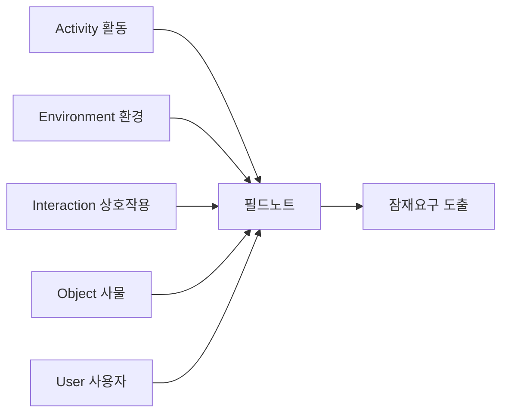

<Callout type="info">
  **이번 문서의 목표:** 사용자 유형을 라이프스타일 관점에서 나누고, 관찰조사의 목적·대상·장소·방법을 계획서 형태로 설계하며, 현장 필드노트에서 잠재요구를 뽑아내는 서술형 답안을 작성할 수 있게 된다.
</Callout>

## 지난 편 요약과 이번 편의 위치

06편에서 책상 위 2차 자료로 시장의 빈틈(소량과 정기성을 동시에 만족하는 서비스가 없다)을 확인했습니다. 하지만 통계와 기사만으로는 "1인 가구가 실제로 저녁을 어떻게 준비하는지" 구체적인 장면은 알 수 없습니다. 이번 편부터는 현장에 나가 1차 자료를 직접 만듭니다.

## 왜 물어보지 않고 지켜보는가

사람들은 자신의 행동을 정확히 기억하거나 정직하게 말하지 못하는 경우가 많습니다. "저녁을 직접 요리해서 먹는다"고 답한 사람이 실제로는 일주일에 한 번도 요리하지 않는 경우가 흔합니다. 말과 행동 사이의 이 차이를 **Say-Do 갭**(Say-Do gap)이라 부릅니다.

> **쉽게 말하면:** 사람들은 자신이 하고 싶은 대로 산다고 "말"하지만, 실제로 몸이 움직이는 방식은 다를 때가 많습니다. 그래서 말보다 행동을 직접 지켜봅니다.

**에스노그라피**(ethnography)는 원래 인류학에서 낯선 사회의 생활 방식을 현지에 머물며 있는 그대로 기록하던 연구 방법입니다. 서비스디자인에서는 이 방법을 빌려와, 사용자가 실제 생활 공간에서 서비스와 관련된 행동을 어떻게 하는지 직접 관찰하고 기록합니다. **관찰조사**(observation research)는 이 에스노그라피적 접근을 실무 프로젝트 규모에 맞게 적용한 조사 방법입니다.

## 1. 사용자 유형 이해와 라이프스타일 조사

### 왜 유형부터 나누는가

"1인 가구"라는 말은 사실 매우 다양한 사람을 하나로 묶습니다. 자취하는 대학생과 은퇴한 독거 어르신은 저녁을 준비하는 방식이 전혀 다릅니다. 관찰 대상을 정하기 전에 먼저 이 다양성을 라이프스타일 관점에서 나눠 봐야, 누구를 왜 관찰할지 근거를 세울 수 있습니다.

| 유형 | 특징 | 저녁 식사 관련 행동 가설 |
|------|------|--------------------------|
| 사회초년생형 | 20대 후반–30대 초반, 퇴근이 늦음 | 배달·편의점 의존, 요리 시간 부족 |
| 재택근무형 | 집에서 일하며 시간 유연성 있음 | 직접 요리하지만 매번 장보기가 번거로움 |
| 고령 독거형 | 은퇴 후 혼자 거주 | 적은 양을 조리하기 어려워 반찬가게 이용 |

**표에서 끌어내는 시사점:** 세 유형 모두 "혼자 요리하기 번거롭다"는 공통점은 있지만, 그 이유(시간 부족, 장보기 번거로움, 조리량 조절 어려움)는 서로 다릅니다. 이 차이를 미리 가설로 세워 두면, 관찰조사에서 어떤 유형을 우선 관찰할지 근거 있게 선택할 수 있습니다. "맛있는하루" 사례에서는 조합의 기존 단골 분포를 참고해 고령 독거형과 사회초년생형을 우선 관찰 대상으로 선정합니다.

## 2. 관찰조사 계획 수립

### 계획서에 반드시 담을 항목

관찰조사는 무작정 현장에 나가는 것이 아니라, 사전에 계획서 형태로 설계해야 합니다.

<Steps>

1. **목적** — 이 관찰로 확인하려는 잠재요구를 질문 형태로 적는다
2. **대상** — 앞서 나눈 유형 중 누구를, 몇 명을 관찰할지
3. **장소** — 실제 행동이 일어나는 현장(자택 주방, 장보는 동선 등)
4. **기간과 시점** — 저녁 준비처럼 특정 시간대에 일어나는 행동이면 그 시간대에 맞춘다
5. **방법** — 참여관찰인지 비참여관찰인지(아래에서 설명)
6. **기록 도구** — 필드노트 양식, 사진·영상 촬영 동의 여부

</Steps>

### 참여관찰과 비참여관찰

| 구분 | 정의 | 장점 | 단점 |
|------|------|------|------|
| 참여관찰 | 관찰자가 대상자의 활동에 함께 참여하며 관찰 | 대상자의 맥락을 몸으로 이해할 수 있음 | 관찰자의 존재가 행동에 영향을 줄 수 있음 |
| 비참여관찰 | 관찰자가 거리를 두고 지켜보기만 함 | 자연스러운 행동을 방해하지 않음 | 맥락을 깊이 이해하기 어려움 |

**사례 적용:** 고령 독거형 대상자의 저녁 준비 과정은 참여관찰로, 재료 손질을 함께 도우며 왜 특정 방식으로 조리하는지 그 자리에서 자연스럽게 확인합니다. 반면 사회초년생형 대상자가 퇴근길에 무엇을 사는지는 비참여관찰로, 실제 매장 안 동선을 방해하지 않고 지켜봅니다.

**자주 틀리는 점:** 참여관찰과 비참여관찰을 "직접 만나는지 여부"로 잘못 구분하는 경우가 많습니다. 둘 다 대상자를 직접 만나는 현장 조사입니다. 구분 기준은 관찰자가 대상자의 활동에 **함께 참여하느냐, 거리를 두고 지켜만 보느냐**입니다.

## 3. 현장에서 관찰해 잠재요구 도출하기

### 관찰 결과를 정리하는 틀 — AEIOU

현장에서는 정보가 한꺼번에 쏟아집니다. 무엇을 기록해야 할지 모르면 중요한 장면을 놓치기 쉽습니다. **AEIOU**는 활동(Activity), 환경(Environment), 상호작용(Interaction), 사물(Object), 사용자(User)의 앞 글자를 딴 필드노트 분류 틀입니다.

| 항목 | 의미 | 사례 기록 |
|------|------|-----------|
| 활동(Activity) | 무엇을 하고 있는가 | 냉장고를 열어 반찬통을 확인한다 |
| 환경(Environment) | 어떤 공간에서 일어나는가 | 좁은 원룸 주방, 화구 하나 |
| 상호작용(Interaction) | 사람과 도구, 사람과 사람의 관계 | 반찬통 뚜껑을 열기 힘들어 손목을 여러 번 튼다 |
| 사물(Object) | 사용하는 도구와 물건 | 플라스틱 밀폐 용기, 전자레인지 |
| 사용자(User) | 관찰 대상자의 특성 | 손아귀 힘이 약한 고령 독거 어르신 |

### 필드노트에서 잠재요구로

관찰 기록은 그 자체로 끝나지 않습니다. 기록된 사실에서 아직 말로 표현되지 않은 요구, 즉 **잠재요구**(latent need)를 뽑아내야 합니다.

> **쉽게 말하면:** 눈에 보인 행동 뒤에 숨은, 본인도 아직 의식하지 못한 불편함을 찾아내는 것입니다.

**사례 적용 — 관찰 기록에서 잠재요구 도출:**

- **관찰 사실:** 반찬통 뚜껑을 열기 힘들어 손목을 여러 번 튼다
- **잠재요구:** 힘을 많이 쓰지 않고도 여닫을 수 있는 용기 형태가 필요하다

- **관찰 사실:** 냉장고 안에 언제 산 반찬인지 표시가 없어 유통기한이 지난 것을 뒤늦게 발견한다
- **잠재요구:** 포장에 소비 권장일이 한눈에 보이도록 표시할 필요가 있다

**자주 틀리는 점:** 관찰 사실을 그대로 요구사항처럼 적는 답안이 많습니다. "뚜껑을 열기 힘들어했다"는 관찰 사실이지 요구가 아닙니다. 그 사실 뒤에 숨은 원인과 필요를 한 단계 더 해석해야 잠재요구가 됩니다.

## 4. 행동패턴 조사와 현장 의사소통 기술

### 라포 형성이 먼저다

낯선 사람이 갑자기 집에 들어와 관찰하겠다고 하면 누구나 긴장합니다. 긴장한 상태의 행동은 평소 행동과 다릅니다. 관찰에 앞서 **라포**(rapport, 신뢰 관계)를 먼저 쌓아야 자연스러운 행동을 관찰할 수 있습니다.

- 관찰 목적을 짧고 부담 없는 말로 먼저 설명한다
- 처음 10분 정도는 기록하지 않고 가벼운 대화만 나눈다
- 질문은 최소화하고, 꼭 필요하면 "지금 무엇을 하고 계신가요" 정도의 열린 질문만 던진다

**질문을 최소화하는 이유:** 관찰 중에 계속 질문하면 대상자가 관찰자를 의식해 평소와 다르게 행동하거나, 행동을 멈추고 설명하려 듭니다. 궁금한 점은 관찰이 끝난 뒤 짧은 면접(08편에서 다루는 심층인터뷰)으로 확인합니다.

### 행동패턴 조사

여러 명을 관찰하면 개별 장면 사이에서 반복되는 패턴이 보이기 시작합니다. "맛있는하루" 사례에서 고령 독거형 세 명을 관찰한 결과, 세 명 모두 저녁 7시 이전에 조리를 마친다는 공통 패턴이 나타났습니다. 이런 패턴은 이후 페르소나(10편)의 "하루 일과" 항목을 채우는 근거 자료가 됩니다.

### 서술형 답안 예시 — 관찰조사 계획서와 결과 요약

**목적:** 고령 독거 1인 가구가 저녁 반찬을 준비·보관하는 과정에서 겪는 잠재요구를 확인한다.

**대상:** 조합 단골 고객 중 고령 독거형 3명

**장소·시점:** 대상자 자택 주방, 평소 저녁 준비 시간대(오후 5시~7시)

**방법:** 참여관찰(재료 손질을 함께 도우며 관찰)

**주요 관찰 결과:** 세 대상자 모두 반찬통 뚜껑을 여닫는 데 어려움을 겪었고, 유통기한 표시가 없어 오래된 반찬을 뒤늦게 발견하는 장면이 공통으로 나타났다.

**잠재요구:** 여닫기 쉬운 용기 형태와, 포장에 소비 권장일을 표시하는 방식이 필요하다.

## 핵심 정리

- 사람은 말과 행동이 다를 수 있으므로(**Say-Do 갭**), 관찰조사는 말로 묻는 대신 실제 행동을 직접 지켜본다.
- 관찰 대상은 라이프스타일 유형으로 먼저 나눠, 유형별로 다른 행동 가설을 세운 뒤 우선순위를 정한다.
- **참여관찰**은 관찰자가 활동에 함께 참여하고, **비참여관찰**은 거리를 두고 지켜본다. 둘 다 현장에서 직접 만나는 조사라는 점은 같다.
- **AEIOU**(활동·환경·상호작용·사물·사용자) 틀로 필드노트를 정리하면 현장 정보를 놓치지 않는다.
- 관찰 사실은 그 자체로 끝나지 않고, 한 단계 더 해석해 **잠재요구**로 연결해야 답안이 완성된다.
- 라포 형성과 질문 최소화로 대상자가 평소처럼 행동하도록 돕고, 궁금한 점은 관찰 이후 면접으로 확인한다.

## 마무리 복습

<Quiz
  questionNumber={1}
  question="관찰조사에서 사람들의 말이 아니라 행동을 직접 지켜보는 가장 근본적인 이유는 무엇인가?"
  options={['행동을 지켜보는 것이 말을 듣는 것보다 항상 시간이 적게 들기 때문이다', '사람들의 말과 실제 행동 사이에 차이(Say-Do 갭)가 있을 수 있기 때문이다', '면접조사는 법적으로 제한되어 있기 때문이다', '행동 관찰은 비용이 전혀 들지 않기 때문이다']}
  correctAnswer={2}
  explanation="사람들은 자신의 행동을 정확히 기억하거나 정직하게 말하지 못하는 경우가 많아 말과 실제 행동 사이에 차이(Say-Do 갭)가 생기며, 관찰조사는 이 갭을 넘어 실제 행동을 직접 확인하기 위한 방법이다."
  optionExplanations={['시간 측면의 장점이 근본 이유는 아니다.', '말과 행동의 차이를 직접 확인하기 위함이 근본 이유다.', '면접조사에 법적 제한이 있다는 서술은 사실이 아니다.', '비용은 관찰 방식에 따라 달라지며 핵심 이유가 아니다.']}
/>

<Quiz
  questionNumber={2}
  question="참여관찰과 비참여관찰을 구분하는 기준으로 가장 올바른 것은?"
  options={['대상자를 직접 만나는지 여부', '관찰자가 대상자의 활동에 함께 참여하는지, 거리를 두고 지켜보기만 하는지 여부', '관찰 시간이 긴지 짧은지 여부', '사진 촬영 여부']}
  correctAnswer={2}
  explanation="참여관찰과 비참여관찰 모두 대상자를 직접 만나는 현장 조사이며, 구분 기준은 관찰자가 활동에 함께 참여하느냐 아니면 거리를 두고 지켜보기만 하느냐다."
  optionExplanations={['둘 다 현장에서 직접 만나는 조사이므로 이는 구분 기준이 아니다.', '참여 여부와 거리 두기 여부가 정확한 구분 기준이다.', '관찰 시간의 길이는 구분 기준이 아니다.', '촬영 여부는 기록 도구의 문제이지 관찰 방식의 구분 기준이 아니다.']}
/>

<Quiz
  questionNumber={3}
  question="AEIOU 필드노트 틀에서 좁은 원룸 주방에 화구가 하나뿐이라는 기록은 어느 항목에 해당하는가?"
  options={['활동(Activity)', '환경(Environment)', '사물(Object)', '사용자(User)']}
  correctAnswer={2}
  explanation="주방의 공간적 특성은 관찰이 일어나는 공간 자체를 설명하는 것이므로 환경(Environment) 항목에 해당한다."
  optionExplanations={['공간이 아니라 사람이 하는 행동을 기록하는 항목이다.', '관찰이 일어나는 공간의 특성을 기록하는 항목이므로 정확하다.', '사용하는 도구나 물건을 기록하는 항목이다.', '대상자 개인의 특성을 기록하는 항목이다.']}
/>

<Quiz
  questionNumber={4}
  question="관찰 사실 반찬통 뚜껑을 열기 힘들어 손목을 여러 번 튼다에서 잠재요구를 도출한 것으로 가장 적절한 것은?"
  options={['반찬통을 더 크게 만들어야 한다', '힘을 많이 쓰지 않고도 여닫을 수 있는 용기 형태가 필요하다', '손목 운동을 권장해야 한다', '반찬통을 유리 재질로 바꿔야 한다']}
  correctAnswer={2}
  explanation="관찰된 행동(뚜껑을 열기 힘들어함)의 원인을 해석하면, 적은 힘으로도 쉽게 여닫을 수 있는 용기 형태가 필요하다는 잠재요구로 연결된다."
  optionExplanations={['크기 문제가 아니라 여닫는 힘의 문제이므로 관찰 사실과 어긋난다.', '관찰된 어려움의 원인을 정확히 해석해 도출한 잠재요구다.', '사용자의 신체를 바꾸는 것은 서비스 디자인의 해결 방향이 아니다.', '재질 변경이 여닫는 힘의 문제를 해결한다는 근거가 관찰 기록에 없다.']}
/>

<Quiz
  questionNumber={5}
  question="관찰 대상자를 라이프스타일 유형으로 먼저 나누는 이유로 가장 적절한 것은?"
  options={['유형을 나눠야 견적서를 작성할 수 있기 때문이다', '1인 가구라는 표현이 실제로는 매우 다양한 생활 방식을 하나로 묶고 있어 유형별로 다른 행동 가설을 세워야 하기 때문이다', '유형 구분 없이는 관찰 장소를 정할 수 없기 때문이다', '유형을 나누면 관찰 시간을 줄일 수 있기 때문이다']}
  correctAnswer={2}
  explanation="1인 가구라는 하나의 이름 아래 사회초년생, 재택근무자, 고령 독거자 등 서로 다른 생활 방식이 섞여 있으므로, 유형별로 다른 행동 가설을 세워야 관찰 대상과 우선순위를 근거 있게 정할 수 있다."
  optionExplanations={['견적서 작성은 05편의 내용이며 유형 구분의 목적이 아니다.', '다양한 생활 방식을 구분해 근거 있는 가설을 세우기 위함이 핵심 이유다.', '장소는 유형이 아니라 관찰 목적에 따라 정해진다.', '시간 단축이 유형 구분의 목적이 아니다.']}
/>

<Quiz
  questionNumber={6}
  question="관찰 중에 대상자에게 질문을 최소화해야 하는 이유로 가장 적절한 것은?"
  options={['질문을 하면 관찰자의 체력이 소모되기 때문이다', '계속 질문하면 대상자가 관찰자를 의식해 평소와 다르게 행동하거나 행동을 멈추게 되기 때문이다', '질문은 면접조사에서만 허용되는 방법이기 때문이다', '질문을 하면 기록할 시간이 부족해지기 때문이다']}
  correctAnswer={2}
  explanation="관찰 중 계속 질문하면 대상자가 관찰자를 의식해 자연스러운 행동을 멈추거나 설명하려 들게 되므로, 궁금한 점은 관찰 이후의 면접으로 확인하는 것이 원칙이다."
  optionExplanations={['체력 소모는 질문 최소화의 이유가 아니다.', '자연스러운 행동을 방해하지 않기 위함이 핵심 이유다.', '관찰조사에서도 최소한의 열린 질문은 허용된다.', '기록 시간 부족은 부차적인 문제이며 핵심 이유가 아니다.']}
/>

<Quiz
  questionNumber={7}
  question="세 명의 고령 독거형 대상자를 관찰한 결과 모두 저녁 7시 이전에 조리를 마친다는 공통점이 나타났다. 이 결과가 이후 어떤 산출물의 근거로 가장 적절하게 이어지는가?"
  options={['견적서의 인건비 산정', '페르소나의 하루 일과 항목', '경쟁 서비스 비교표', '제안서의 표지 문구']}
  correctAnswer={2}
  explanation="여러 대상자에게서 반복 확인된 행동패턴은 특정 유형을 대표하는 가상 인물인 페르소나의 하루 일과를 채우는 근거 자료로 쓰인다."
  optionExplanations={['조리 시간 패턴은 인건비 산정과 관련이 없다.', '반복되는 행동패턴은 페르소나의 하루 일과를 채우는 근거로 이어진다.', '경쟁 서비스 비교는 06편의 2차 자료 기반 분석이다.', '표지 문구와 행동패턴 관찰은 직접 관련이 없다.']}
/>

## 참고 자료

- [한국산업인력공단(브런치 경유 원문) - 서비스·경험디자인 기사 출제기준(필기·실기)](https://t1.daumcdn.net/brunch/service/user/13ur/file/tayw3sSk4ib3un2lLq5U249xKUg.pdf)
- [Nielsen Norman Group - Field Studies](https://www.nngroup.com/articles/field-studies/)
- [Nielsen Norman Group - Contextual Inquiry: Inspire Design by Observing and Interviewing Users in Their Context](https://www.nngroup.com/articles/contextual-inquiry/)
