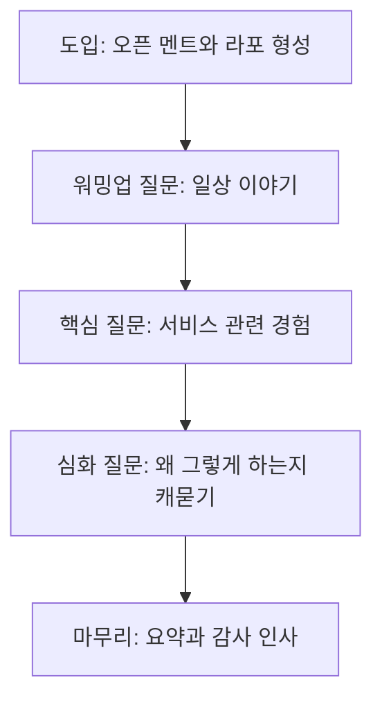

<Callout type="info">
  **이번 문서의 목표:** 개별면접과 FGI(Focus Group Interview) 중 상황에 맞는 방법을 고르고, 연구윤리를 지키는 인터뷰 가이드를 설계하며, 인터뷰 내용을 전사·분류해 서술형 답안으로 정리할 수 있게 된다.
</Callout>

## 지난 편 요약과 이번 편의 위치

07편의 관찰조사로 "반찬통을 여닫기 힘들다", "유통기한 표시가 없다" 같은 잠재요구를 확인했습니다. 하지만 관찰만으로는 "왜 그런 행동을 하는지", "구독 서비스라면 실제로 돈을 낼 의향이 있는지" 같은 생각과 이유는 알 수 없습니다. 이번 편에서는 대상자에게 직접 말로 물어보는 면접조사를 설계합니다.

## 왜 관찰 다음에 면접을 하는가

관찰은 행동을 보여 주지만 그 행동의 이유는 말해 주지 않습니다. 07편에서 본 "손목을 여러 번 트는" 장면은 사실이지만, 그 대상자가 이미 불편함을 알고 다른 방법을 찾아본 적이 있는지, 가격을 얼마까지 지불할 의향이 있는지는 물어봐야 알 수 있습니다.

> **쉽게 말하면:** 관찰이 눈으로 본 것이라면, 면접은 그 사람의 머릿속 생각과 이유를 직접 듣는 것입니다.

**면접조사**(interview research)는 대상자와 직접 대화하며 생각, 이유, 경험을 구술로 수집하는 조사 방법입니다. 관찰과 면접은 경쟁 관계가 아니라 서로의 빈틈을 메우는 짝입니다.

## 1. 개별면접과 집단면접(FGI) 방법 설정

### 두 방법의 차이

| 구분 | 개별면접 | 집단면접(FGI) |
|------|----------|----------------|
| 정의 | 진행자와 대상자 한 명이 1대1로 대화 | 진행자가 여러 명(보통 6–8명)을 동시에 진행 |
| 장점 | 개인의 깊은 사정과 민감한 이야기를 편하게 꺼냄 | 참여자들의 의견 교환에서 새로운 발상이 나옴 |
| 단점 | 시간과 비용이 인원수만큼 늘어남 | 목소리 큰 참여자에게 분위기가 쏠릴 수 있음 |
| 적합한 상황 | 개인차가 큰 주제, 민감한 경험 | 여러 사람의 공통 반응이나 아이디어가 필요한 주제 |

**FGI**(Focus Group Interview, 집단면접)는 여러 참여자를 한자리에 모아 특정 주제에 대한 반응과 의견을 관찰하는 방법입니다. 한 사람의 답이 다른 사람의 생각을 자극해 개별면접에서는 나오지 않던 의견이 나오기도 합니다.

### 사례 적용 — 어떤 방법을 선택할까

"맛있는하루" 사례에서는 두 방법을 목적에 맞게 나눠 씁니다.

- **개별면접:** 고령 독거형 대상자의 반찬 구매·보관 습관처럼 개인 생활에 밀접하고 민감할 수 있는 주제
- **FGI:** 사회초년생형 대상자 여러 명을 모아 "정기구독이라면 어떤 조건에서 가입하겠는가"라는, 서로 의견을 나누며 아이디어가 확장될 수 있는 주제

**자주 틀리는 점:** FGI를 "여러 명에게 개별 질문을 순서대로 돌려가며 묻는 것"으로 오해하는 경우가 많습니다. FGI의 핵심은 참여자 간 **의견 교환과 상호 자극**입니다. 한 사람씩 순서대로 답하고 끝나면 그것은 여러 번의 개별면접을 한자리에서 했을 뿐, FGI의 목적을 살리지 못한 것입니다.

### 대상자 섭외

면접 대상자는 07편에서 나눈 라이프스타일 유형을 기준으로 섭외합니다. 한 유형에 치우치지 않도록 유형별 최소 인원을 정해 두고, 조합의 기존 고객 명단과 지역 커뮤니티를 통해 모집합니다.

## 2. 심층인터뷰 설계와 연구윤리

### 심층인터뷰의 구조

**심층인터뷰**(in-depth interview)는 정해진 질문지를 그대로 읽는 것이 아니라, 대상자의 답변에 따라 "왜 그렇게 생각하셨어요"처럼 점점 깊이 파고드는 질문을 이어가는 면접 방식입니다.

### 연구윤리(IRB)의 기본

**연구윤리**는 조사 대상자의 권리와 안전을 보호하기 위한 원칙입니다. **IRB**(Institutional Review Board, 기관생명윤리위원회)는 사람을 대상으로 하는 연구가 이 원칙을 지키는지 사전에 심사하는 기구입니다. 대규모 학술 연구가 아닌 실무 프로젝트에서도 다음 원칙만큼은 반드시 지킵니다.

| 원칙 | 실천 방법 |
|------|-----------|
| 사전 동의 | 조사 목적과 활용 범위를 설명하고 참여 동의를 구한다 |
| 자발적 참여 | 언제든 중단하거나 답변을 거부할 수 있음을 알린다 |
| 개인정보 보호 | 이름 대신 참여자 번호로 기록하고 결과 보고서에는 특정할 수 없게 처리한다 |
| 최소한의 피해 | 답변이 곤란한 질문은 강요하지 않는다 |

**자주 틀리는 점:** 사전 동의를 "인터뷰가 끝난 뒤 사례비를 지급하며 안내하는 것"으로 착각하는 경우가 있습니다. 동의는 인터뷰를 **시작하기 전에** 구해야 하며, 사례비 지급 여부와 별개의 절차입니다.

## 3. 시범면접·오픈 멘트로 라포 형성하기

### 시범면접(파일럿 인터뷰)

본 조사에 들어가기 전, 질문지가 실제로 잘 작동하는지 한두 명을 대상으로 미리 진행해 보는 것을 **시범면접**(pilot interview)이라 합니다. 질문이 너무 어렵거나 중복되지는 않는지, 예상 소요 시간이 맞는지 이 단계에서 점검합니다.

> **쉽게 말하면:** 본 경기 전에 미리 한 번 연습 경기를 뛰어 보는 것입니다.

### 오픈 멘트

인터뷰를 시작할 때 던지는 첫 문장을 **오픈 멘트**라 합니다. 오픈 멘트의 목적은 정보를 얻는 것이 아니라 대상자의 긴장을 풀어 라포를 형성하는 것입니다.

**오픈 멘트 예시(사례 적용):** "오늘 시간 내주셔서 감사합니다. 오늘은 정답을 맞히는 자리가 아니라, 평소 저녁을 어떻게 챙겨 드시는지 있는 그대로의 이야기를 듣고 싶어서 왔습니다. 편하게 말씀해 주세요."

**해석:** "정답을 맞히는 자리가 아니다"라는 문장이 중요합니다. 대상자가 무의식적으로 "그럴듯한 답"을 준비하려는 압박을 미리 풀어 주기 때문입니다.

## 4. 인터뷰 내용 기록·정리·분류

### 기록의 원칙

인터뷰는 녹음과 동시에 진행자가 핵심 어구를 메모합니다. 인터뷰가 끝나면 녹음을 그대로 글로 옮기는 **전사**(transcription) 작업을 합니다.

### 전사 내용을 분류하는 방법

전사한 텍스트를 그대로 나열하면 여러 사람의 답이 뒤섞여 패턴이 보이지 않습니다. 발언을 의미 단위로 잘라 비슷한 내용끼리 묶는 과정이 필요하며, 이 과정은 09편에서 다루는 **어피니티 다이어그램**(affinity diagram)으로 이어집니다. 이번 편에서는 그 준비 단계로, 발언을 사실·의견·감정 세 갈래로 나눠 태그를 붙이는 방법을 씁니다.

| 발언 예시 | 분류 | 의미 |
|-----------|------|------|
| "일주일에 반찬을 두세 번 사요" | 사실 | 실제 행동 빈도 |
| "매번 사러 가는 게 귀찮아요" | 의견 | 현재 방식에 대한 평가 |
| "정기적으로 온다면 안심이 될 것 같아요" | 감정 | 새로운 방식에 대한 기대 |

**손으로 정리해 보기 — 사례 적용:** 고령 독거형 대상자 A의 인터뷰에서 다음 발언이 나왔다고 가정합니다. "요즘은 반찬 사러 가는 것도 무릎이 아파서 힘들어요. 그래서 한 번 갈 때 며칠치를 사 두는데, 그러다 보니 냉장고에서 상하는 것도 있어요. 정해진 날짜에 가져다주면 저는 훨씬 편할 것 같아요."

- **사실:** 한 번에 며칠치를 구매해 보관한다
- **의견:** 이동이 힘들어 외출 자체가 부담스럽다
- **감정:** 정기 배송에 대한 기대와 안도감

**해석:** 이 세 갈래로 나누면, 07편 관찰조사에서 확인한 "유통기한을 놓친다"는 관찰 사실이 왜 벌어지는지(무릎 통증으로 인한 대량 구매) 원인까지 설명할 수 있게 됩니다. 관찰(행동)과 면접(이유)이 서로를 뒷받침하는 순간입니다.

**자주 틀리는 점:** 발언을 사실과 의견을 구분하지 않고 하나로 뭉뚱그려 인용하는 답안이 많습니다. "무릎이 아파서 힘들다"는 대상자의 주관적 의견이고, "한 번에 며칠치를 산다"는 확인 가능한 행동 사실입니다. 둘을 구분해야 이후 분석의 신뢰도가 올라갑니다.

### 서술형 답안 예시 — 인터뷰 가이드와 결과 요약

**대상:** 고령 독거형 3명(개별면접), 사회초년생형 6명(FGI 1회)

**오픈 멘트:** "정답을 맞히는 자리가 아니라 평소 이야기를 편하게 듣고 싶은 자리입니다."

**핵심 질문:** 최근 일주일 동안 저녁 반찬을 어떻게 마련하셨나요, 반찬을 구매·보관하면서 불편했던 순간이 있었나요, 정기적으로 반찬이 배송된다면 어떤 점이 걱정되시나요.

**주요 결과(사실·의견·감정 분류):** 고령 독거형 대상자들은 이동 부담으로 한 번에 많은 양을 구매해 보관 중 일부를 상하게 하는 사실이 공통으로 확인되었고, 정기 배송에 대해서는 안도감이라는 감정이 우세했다. 사회초년생형 FGI에서는 "가격보다 배송 요일을 스스로 정할 수 있는지가 더 중요하다"는 의견이 참여자 간 토론을 거쳐 다수 의견으로 모아졌다.

**시사점:** 두 유형 모두 정기성에는 긍정적이나, 고령 독거형은 이동 부담 해소를, 사회초년생형은 일정 유연성을 각각 다른 이유로 원한다. 이 차이는 10편 페르소나 작성에서 두 페르소나를 분리하는 근거가 된다.

## 핵심 정리

- 관찰은 행동을, 면접은 그 행동의 **이유와 생각**을 확인하는 조사이며 서로 짝을 이룬다.
- **개별면접**은 민감하고 개인차가 큰 주제에, **FGI**는 참여자 간 의견 교환으로 아이디어를 넓히는 주제에 적합하다.
- FGI의 핵심은 순서대로 묻는 것이 아니라 참여자 간 **의견 교환과 상호 자극**이다.
- 연구윤리 원칙(사전 동의, 자발적 참여, 개인정보 보호, 최소한의 피해)은 실무 프로젝트에서도 반드시 지킨다.
- **시범면접**으로 질문지를 미리 점검하고, **오픈 멘트**로 라포를 형성해 대상자의 긴장을 푼다.
- 전사한 발언은 **사실·의견·감정**으로 나눠 분류해야 관찰 결과와 연결되는 원인 해석이 가능해진다.

## 마무리 복습

<Quiz
  questionNumber={1}
  question="관찰조사 다음에 면접조사를 진행하는 근본적인 이유로 가장 적절한 것은?"
  options={['면접조사가 관찰조사보다 항상 비용이 적게 들기 때문이다', '관찰은 행동을 보여 주지만 그 행동의 이유와 생각은 말해 주지 않기 때문이다', '면접조사만으로 모든 잠재요구를 확인할 수 있기 때문이다', '관찰조사는 법적으로 면접조사 이후에만 가능하기 때문이다']}
  correctAnswer={2}
  explanation="관찰은 대상자의 실제 행동을 보여 주지만 그 행동을 하는 이유나 생각까지는 알려 주지 않으므로, 면접을 통해 구술로 그 이유와 생각을 확인해 관찰 결과를 보완한다."
  optionExplanations={['비용 비교는 순서를 정하는 근본 이유가 아니다.', '행동의 이유를 구술로 확인한다는 점이 핵심 이유다.', '면접만으로는 실제 행동을 확인할 수 없어 관찰과 상호 보완이 필요하다.', '법적 순서 규정이 아니라 조사 설계상의 논리적 순서다.']}
/>

<Quiz
  questionNumber={2}
  question="FGI(집단면접)의 핵심 목적을 가장 올바르게 설명한 것은?"
  options={['여러 참여자에게 같은 질문을 순서대로 돌려가며 개별 답변을 모으는 것', '참여자 간 의견 교환과 상호 자극을 통해 개별면접에서 나오기 어려운 반응을 얻는 것', '한 명의 진행자가 최대한 많은 인원을 짧은 시간에 조사해 비용을 아끼는 것', '민감한 개인 경험을 편안하게 털어놓게 하는 것']}
  correctAnswer={2}
  explanation="FGI의 핵심은 참여자들이 서로의 답변에 자극받아 개별면접에서는 나오기 어려운 의견과 아이디어를 이끌어 내는 것이다."
  optionExplanations={['순서대로 개별 답변만 모으면 여러 번의 개별면접과 다르지 않아 FGI의 목적을 살리지 못한다.', '의견 교환과 상호 자극이 FGI의 정의에 정확히 부합한다.', '비용 절감은 부수적 효과일 뿐 핵심 목적이 아니다.', '민감한 개인 경험은 오히려 개별면접에 더 적합한 주제다.']}
/>

<Quiz
  questionNumber={3}
  question="연구윤리에서 사전 동의에 대한 설명으로 가장 올바른 것은?"
  options={['인터뷰가 끝난 뒤 사례비를 지급하며 안내하면 된다', '인터뷰를 시작하기 전에 조사 목적과 활용 범위를 설명하고 참여 동의를 구해야 한다', '동의 절차는 학술 연구에서만 필요하고 실무 프로젝트에서는 생략해도 된다', '동의는 구두로만 하면 되고 활용 범위는 설명하지 않아도 된다']}
  correctAnswer={2}
  explanation="사전 동의는 말 그대로 인터뷰를 시작하기 전에 조사 목적과 활용 범위를 설명하고 참여자의 동의를 구하는 절차이며, 사례비 지급 여부와는 별개다."
  optionExplanations={['동의는 인터뷰 시작 전에 구해야 하며 사례비 지급 시점과는 무관하다.', '시작 전 목적과 활용 범위 설명 및 동의 확보라는 정의가 정확하다.', '실무 프로젝트에서도 대상자 보호를 위해 반드시 지켜야 하는 원칙이다.', '활용 범위를 설명하지 않으면 진정한 사전 동의라 볼 수 없다.']}
/>

<Quiz
  questionNumber={4}
  question="본 조사에 앞서 질문지가 실제로 잘 작동하는지 한두 명을 대상으로 미리 진행해 보는 것을 무엇이라 하는가?"
  options={['오픈 멘트', '시범면접(파일럿 인터뷰)', 'FGI', '전사']}
  correctAnswer={2}
  explanation="본 조사 전에 질문지의 난이도와 소요 시간 등을 점검하기 위해 소수를 대상으로 미리 진행하는 절차를 시범면접(파일럿 인터뷰)이라 한다."
  optionExplanations={['오픈 멘트는 인터뷰 시작 시 긴장을 푸는 첫 문장이다.', '본 조사 전 사전 점검이라는 정의에 정확히 해당한다.', 'FGI는 여러 명을 동시에 진행하는 집단면접 방식이다.', '전사는 녹음 내용을 글로 옮기는 작업이다.']}
/>

<Quiz
  questionNumber={5}
  question="고령 독거형 대상자의 발언 요즘은 반찬 사러 가는 것도 무릎이 아파서 힘들어요를 사실·의견·감정 중 어디로 분류하는 것이 가장 적절한가?"
  options={['사실', '의견', '감정', '분류할 수 없는 발언']}
  correctAnswer={2}
  explanation="이동이 힘들다는 진술은 확인 가능한 객관적 수치나 행동이 아니라 대상자가 느끼는 어려움에 대한 주관적 평가이므로 의견으로 분류하는 것이 적절하다."
  optionExplanations={['확인 가능한 행동 자체가 아니라 주관적 평가이므로 사실이 아니다.', '이동의 어려움에 대한 주관적 평가이므로 의견으로 분류하는 것이 적절하다.', '감정은 정기 배송에 대한 기대나 안도감처럼 정서적 반응에 가깝다.', '사실·의견·감정 중 하나로 분류 가능한 발언이다.']}
/>

<Quiz
  questionNumber={6}
  question="오픈 멘트에서 정답을 맞히는 자리가 아니다라는 문장을 넣는 이유로 가장 적절한 것은?"
  options={['인터뷰 시간을 단축하기 위해서다', '대상자가 그럴듯한 답을 준비하려는 압박을 미리 풀어 라포를 형성하기 위해서다', '질문의 난이도를 대상자에게 미리 알리기 위해서다', '연구윤리 절차를 대신하기 위해서다']}
  correctAnswer={2}
  explanation="정답이 없다는 안내는 대상자가 모범 답안을 준비하려는 무의식적 압박을 풀어 주어, 있는 그대로의 경험을 편하게 말하게 하는 라포 형성 효과가 있다."
  optionExplanations={['시간 단축이 목적이 아니라 심리적 부담 해소가 목적이다.', '압박을 풀어 라포를 형성한다는 설명이 정확하다.', '질문 난이도 안내와는 무관한 문장이다.', '연구윤리 절차인 사전 동의와는 별개의 문장이다.']}
/>

<Quiz
  questionNumber={7}
  question="개별면접이 FGI보다 더 적합한 상황으로 가장 적절한 것은?"
  options={['참여자들의 의견 교환에서 새로운 아이디어를 얻고 싶을 때', '여러 사람의 공통 반응을 짧은 시간에 확인하고 싶을 때', '개인차가 크고 민감할 수 있는 개인 경험을 편하게 듣고 싶을 때', '진행 비용을 최소화하고 싶을 때']}
  correctAnswer={3}
  explanation="개인차가 크고 민감할 수 있는 주제는 다른 사람 앞에서 말하기 어려우므로, 1대1로 편하게 이야기할 수 있는 개별면접이 더 적합하다."
  optionExplanations={['의견 교환과 아이디어 확장은 FGI의 강점이다.', '여러 사람의 공통 반응을 짧은 시간에 보는 것은 FGI의 강점이다.', '민감한 개인 경험은 1대1 환경에서 더 편하게 이야기할 수 있다.', '비용 최소화 측면에서는 오히려 FGI가 인원당 비용이 낮다.']}
/>

## 참고 자료

- [한국산업인력공단(브런치 경유 원문) - 서비스·경험디자인 기사 출제기준(필기·실기)](https://t1.daumcdn.net/brunch/service/user/13ur/file/tayw3sSk4ib3un2lLq5U249xKUg.pdf)
- [Nielsen Norman Group - User Interviews 101](https://www.nngroup.com/articles/user-interviews/)
- [Nielsen Norman Group - Writing an Effective Guide for a UX Interview](https://www.nngroup.com/articles/interview-guide/)
- [Nielsen Norman Group - Focus Groups 101](https://www.nngroup.com/articles/focus-groups-definition/)
