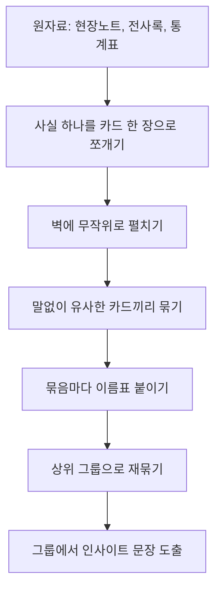

## 왜 자료를 다시 종합해야 하는가

06편(데스크 리서치)부터 08편(면접조사·FGI)까지 세 갈래의 조사를 마쳤습니다. 손에 남은 것은 현장 관찰 기록, 인터뷰 전사, 통계 자료가 뒤섞인 방대한 원자료(raw data)입니다.

**리서치 종합**(synthesis)은 서로 다른 조사에서 나온 개별 사실들을 한자리에 모아 비교하고, 그 안에서 반복되는 패턴을 찾아 "우리가 무엇을 알아냈는가"라는 문장으로 압축하는 작업입니다.

실기에서는 이 과정을 관찰·인터뷰 기록 몇 줄을 주고 어피니티 다이어그램으로 묶어 인사이트를 서술하라는 문제로 냅니다. 손으로 그리는 능력보다 **분류의 근거를 문장으로 설명하는 능력**을 봅니다.

## 통합 정리의 흐름

원자료를 인사이트로 바꾸는 과정은 자료의 단위가 점점 작아졌다가 다시 커지는 모래시계 모양을 띱니다.

```mermaid
graph TD
  A[원자료: 현장노트, 전사록, 통계표] --> B[사실 하나를 카드 한 장으로 쪼개기]
  B --> C[벽에 무작위로 펼치기]
  C --> D[말없이 유사한 카드끼리 묶기]
  D --> E[묶음마다 이름표 붙이기]
  E --> F[상위 그룹으로 재묶기]
  F --> G[그룹에서 인사이트 문장 도출]
```

이 흐름에서 핵심은 D단계(묶기)까지는 **판단을 미루고 사실만 다룬다**는 점입니다. 카드를 묶으면서 "이건 이래서 문제야"라고 해석부터 시작하면, 조사자 자신의 선입견에 맞는 카드만 눈에 들어옵니다. 분류가 끝난 뒤에야 해석을 시작해야 편향을 줄일 수 있습니다.

## 어피니티 다이어그램 작성 절차

**어피니티 다이어그램**(affinity diagram, 친화도 맵)은 낱개의 관찰·발언 카드를 유사성에 따라 아래에서 위로 묶어 올리는 상향식(bottom-up) 분류 도구입니다. 사전에 정해둔 분류 기준이 없다는 점이 핵심입니다.

**사실 카드와 해석 카드는 반드시 구분해야 합니다.** "예약 전화가 계속 통화중이었다"는 사실 카드이고, "이 병원은 예약 시스템이 형편없다"는 이미 해석이 섞인 카드입니다. 1~4단계에는 사실 카드만 올리고, 해석은 6단계 인사이트 문장에서 다룹니다.

## 요구사항의 세 층위로 분류하기

카드를 묶을 때 참고할 수 있는 보조 기준 중 하나가 요구의 성격입니다. 사용자의 발언과 행동은 대부분 아래 세 층위 중 하나 이상에 걸쳐 있습니다.

| 요구 층위 | 정의 | 이 편 사례에서의 예 |
|-----------|------|----------------------|
| 기능적 요구 | 서비스가 물리적·절차적으로 해결해 줘야 하는 것 | 예약이 원하는 시간에 확정되어야 한다 |
| 정서적 요구 | 이용 과정에서 느끼고 싶은 감정 | 대기하는 동안 불안하지 않고 싶다 |
| 사회적 요구 | 타인과의 관계 속에서 지키고 싶은 자존감과 역할 | 자녀에게 의존하지 않고 스스로 해내고 싶다 |

**함정:** 기능적 요구만 카드로 옮기고 정서적·사회적 요구를 놓치는 경우가 많습니다. "키오스크 사용법을 몰라 헤맸다"는 기능적 요구처럼 보이지만, 그 아래에는 "자녀에게 매번 의지하고 싶지 않다"는 사회적 요구가 깔려 있을 수 있습니다.

## 사례로 확인하기 — 새길종합병원 외래 예약 서비스

06~08편에서 다음과 같은 원자료를 모았다고 가정합니다. 이 케이스는 10~12편에서도 이어서 사용합니다.

| 출처 | 원자료 |
|------|--------|
| 데스크 리서치 | 인근 3개 병원 가운데 온라인 예약을 24시간 지원하는 곳은 1곳뿐이었다 |
| 관찰조사 | 60대 이상 환자 다수가 접수 키오스크 앞에서 화면을 오래 쳐다보다 직원을 불렀다 |
| 관찰조사 | 예약 시간보다 20분 이상 대기하던 환자가 접수처에 언제 들어가는지 재차 물었다 |
| 관찰조사 | 보호자로 보이는 젊은 여성이 옆에서 대신 스마트폰으로 접수 화면을 조작했다 |
| 면접조사 | "점심시간에만 전화할 시간이 나는데 계속 통화중이라 결국 오후 반차를 냈어요" (30대 회사원) |
| 면접조사 | "저는 그런 거 할 줄 몰라서 딸이 다 해줘요. 저 혼자면 그냥 병원에 일찍 와서 줄 서요" (68세 환자) |
| 면접조사 | "예약했는데 왜 이렇게 오래 기다리나 싶은데, 얼마나 걸린다는 안내라도 있으면 좋겠어요" (40대 환자) |

이 일곱 장의 카드를 4단계까지 진행하면 아래와 같이 묶입니다.

| 헤더 카드(그룹) | 묶인 카드 | 인사이트 문장 |
|-----------------|-----------|----------------|
| 예약 채널이 근무 시간과 충돌한다 | 데스크 리서치 1건, 회사원 인터뷰 1건 | 예약 채널이 전화와 평일 주간 위주로만 열려 있어, 근무 중인 잠재 이용자가 예약 단계에서부터 이탈한다 |
| 디지털 기기 이용에 보호자가 필요하다 | 관찰조사 2건, 고령 환자 인터뷰 1건 | 고령 이용자는 보호자의 도움 없이는 온라인 예약과 키오스크 접수를 끝까지 완료하지 못해, 혼자 병원을 찾는 날은 예약 없이 대기줄에 의존한다 |
| 대기시간 정보가 제공되지 않는다 | 관찰조사 1건, 환자 인터뷰 1건 | 예약을 했음에도 실제 대기시간을 알려주는 장치가 없어, 예약이 지켜지지 않는다는 불신으로 이어진다 |

**서술형 답안 예시 — "위 원자료를 어피니티 다이어그램으로 종합하고 도출한 인사이트 두 가지를 서술하시오"라는 문제라면:**

> 위 일곱 개의 관찰·인터뷰 기록을 사실 단위로 나누어 카드화한 뒤, 유사성에 따라 묶은 결과 세 개의 그룹을 얻었다. 첫째 그룹은 예약 채널의 운영 시간이 평일 주간에 한정되어 있다는 사실들로, 근무 중인 이용자가 예약 단계에서부터 서비스를 이용하지 못하고 이탈한다는 인사이트로 이어진다. 둘째 그룹은 고령 이용자의 디지털 기기 이용 관찰과 진술로, 보호자의 도움 없이는 예약과 접수 과정을 완주하지 못한다는 인사이트를 보여준다. 이 두 인사이트는 각각 예약 채널의 시간대 확장과, 비대면 절차에 의존하지 않는 대안 접수 경로 마련이라는 개선 방향으로 이어진다.

이 답안의 구조를 눈여겨봐야 합니다. **분류 방법 서술 → 그룹별 근거 요약 → 인사이트 문장 → 개선 방향 시사**의 순서로, 그림으로 그리지 못하는 필답형 답안에서도 어피니티 다이어그램의 논리 구조를 문장으로 재현하고 있습니다.

## 자주 틀리는 점

- **사실과 해석을 카드 단계에서 섞는다.** "직원이 불친절했다"처럼 이미 평가가 담긴 카드는 다른 조사자가 봐도 같은 결론에 이르기 어렵습니다. "환자가 세 번 질문했으나 직원이 한 단어로만 답했다"처럼 관찰 가능한 사실로 적어야 합니다
- **그룹 이름을 너무 추상적으로 짓는다.** "불편함", "문제점" 같은 이름은 그 아래 어떤 카드가 있어도 다 들어맞아 분류의 의미가 없습니다. 그룹 이름에는 반드시 누가, 무엇을 할 때, 어떤 일이 벌어지는지가 드러나야 합니다
- **카드 개수가 많은 그룹을 무조건 가장 중요한 인사이트로 삼는다.** 관찰하기 쉬운 행동일수록 카드가 많이 쌓일 뿐, 카드 수와 문제의 심각성은 별개입니다. 카드가 하나뿐이어도 서비스 전체를 좌우하는 인사이트일 수 있습니다
- **상위 그룹과 하위 그룹을 뒤섞는다.** "디지털 기기 이용의 어려움"이라는 상위 주제 아래 "키오스크 조작 어려움", "온라인 예약 조작 어려움"이라는 하위 그룹이 있어야 하는데, 이를 나란히 같은 층위에 놓으면 이후 우선순위 판단이 흐트러집니다

## 핵심 정리

- 리서치 종합은 원자료를 카드 단위로 쪼갠 뒤 유사성으로 묶고, 묶음에 이름을 붙여 인사이트 문장으로 압축하는 과정이다
- 어피니티 다이어그램은 사전 분류 기준 없이 카드가 스스로 모이게 하는 상향식 방법이며, 사실 카드와 해석 카드를 구분해야 한다
- 사용자의 요구는 기능적·정서적·사회적 요구의 세 층위로 겹쳐 있으므로, 겉으로 드러난 기능적 불편 아래 숨은 정서적·사회적 요구까지 살펴야 한다
- 필답형 답안은 그림 대신 분류 근거, 그룹별 요약, 인사이트, 개선 방향의 순서로 서술해 다이어그램의 논리를 문장으로 재현한다

## 마무리 복습

<Quiz
  questionNumber={1}
  question={"어피니티 다이어그램의 특징으로 가장 적절한 것은?"}
  options={["사전에 정해둔 분류 기준에 맞춰 카드를 나눈다","조사자의 가설을 먼저 세우고 그 가설에 맞는 카드만 남긴다","사전 기준 없이 카드가 스스로 유사한 자리로 모이게 하는 상향식 방법이다","통계적으로 유의한 카드만 골라 분류한다"]}
  correctAnswer={3}
  explanation={"어피니티 다이어그램은 미리 정한 분류 틀 없이 카드를 자유롭게 옮기며 자연스럽게 모이는 자리를 찾는 상향식 방법이다. 이렇게 해야 조사자가 예상하지 못한 패턴이 드러난다."}
/>

<Quiz
  questionNumber={2}
  question={"다음 중 어피니티 다이어그램의 카드로 적절한 사실 카드는 무엇인가?"}
  options={["이 병원은 예약 시스템이 형편없다","직원이 불친절해서 기분이 나빴다","환자가 접수처에 대기시간을 세 번 물었으나 안내받지 못했다","이 서비스는 전반적으로 개선이 시급하다"]}
  correctAnswer={3}
  explanation={"사실 카드는 관찰 가능한 행동이나 발언 그대로를 담아야 하며 조사자의 평가나 결론을 포함하지 않는다. 세 번째 보기는 구체적 행동과 결과만을 담고 있어 사실 카드로 적절하다."}
/>

<Quiz
  questionNumber={3}
  question={"60대 환자가 접수 키오스크 조작을 어려워하면서도 자녀에게 도움을 요청하지 않고 스스로 해보려 애쓰는 행동은 어떤 요구 층위와 가장 관련이 깊은가?"}
  options={["기능적 요구","정서적 요구와 사회적 요구","경제적 요구","기술적 요구"]}
  correctAnswer={2}
  explanation={"스스로 해내려는 행동에는 불안을 줄이고 싶은 정서적 요구와, 자녀에게 의존하지 않고 자립하려는 사회적 요구가 함께 깔려 있다. 겉으로 드러난 조작의 어려움만 기능적 요구로 보면 이 층위를 놓친다."}
/>

## 참고 자료

- [한국산업인력공단 - 서비스·경험디자인 기사 출제기준(필기·실기)](https://t1.daumcdn.net/brunch/service/user/13ur/file/tayw3sSk4ib3un2lLq5U249xKUg.pdf)
