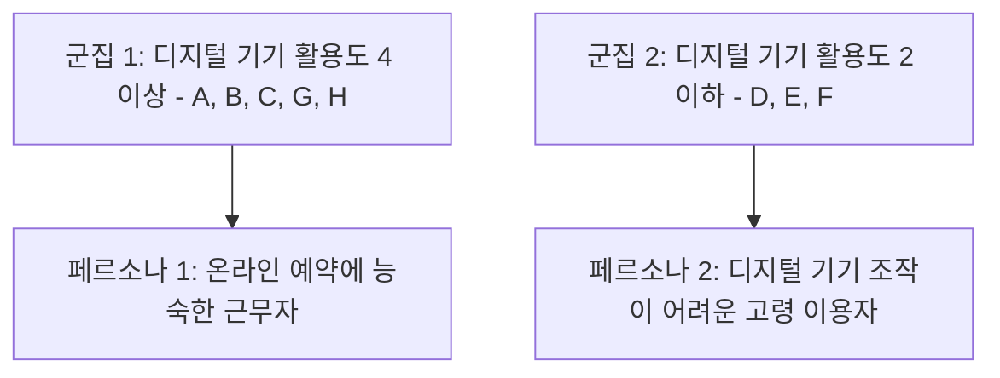

<Callout type="info">
  **이번 문서의 목표:** 행동 패턴 그래프에서 사용자 군집을 찾아 페르소나 후보를 도출하고, 항목이 빠짐없이 채워진 페르소나 표와 경험 시나리오를 실기 답안 형식으로 작성할 수 있게 된다.
</Callout>

## 왜 대표 인물이 필요한가

09편에서 어피니티 다이어그램으로 인사이트를 뽑았지만, 인사이트는 여전히 "고령 이용자는", "근무 중인 이용자는"처럼 추상적인 집단을 가리킵니다. 팀 전체가 회의 때마다 "우리 사용자"를 서로 다르게 상상하면, 디자인 결정도 매번 어긋납니다.

**페르소나**(persona)는 조사에서 반복적으로 나타난 행동·목표·좌절 패턴을 하나로 묶어, 이름과 얼굴을 가진 가상의 대표 인물로 구체화한 것입니다.

> **쉽게 말하면:** 실제로 만난 여러 사용자의 공통된 습관과 고민을 한 사람에게 모아, 팀이 같은 사람을 떠올리며 이야기할 수 있게 만든 가상의 인물입니다.

페르소나는 실존 인물 한 명을 그대로 옮긴 것이 아닙니다. 특정 참가자 한 명을 페르소나로 삼으면 그 사람만의 특이한 사정까지 대표성으로 오인하게 됩니다. 여러 참가자에게서 반복된 패턴만 남기고 나머지는 덜어내야 합니다.

## 페르소나와 이웃 개념 구분하기

| 개념 | 정의 | 페르소나와의 차이 |
|------|------|--------------------|
| 사용자 그룹(user segment) | 나이, 직업 등 인구통계로 나눈 집단 | 인구통계만 있고 목표·좌절 같은 맥락이 없다 |
| 원형(archetype) | 특정 역할의 전형적 특징만 요약한 상 | 이름, 하루 일과 같은 구체적 서사가 없다 |
| 페르소나 | 행동 패턴과 목표, 좌절, 서사를 갖춘 가상 인물 | 팀이 감정을 이입해 의사결정 기준으로 쓸 수 있다 |

## 개발 절차

<Steps>

1. **09편 어피니티 다이어그램에서 행동 축을 추출한다** — 인사이트 그룹에서 사용자마다 정도가 다르게 나타난 행동 변수를 찾습니다
2. **두 개의 행동 변수로 축을 그린다** — 서로 다른 두 변수를 가로축·세로축으로 삼아 행동 패턴 그래프를 만듭니다
3. **실제 조사 참가자를 축 위에 배치한다** — 인터뷰·관찰 기록을 근거로 각 참가자가 두 축에서 어디쯤에 해당하는지 표시합니다
4. **군집이 뭉치는 지점을 페르소나 후보로 정한다** — 뚜렷하게 뭉친 자리가 하나의 페르소나가 되며, 보통 2~4명 선에서 페르소나 수를 정합니다
5. **각 후보에 인구통계·목표·좌절·인용문을 채운다** — 표 형식으로 항목을 완성합니다
6. **대표성을 검증한다** — 이 페르소나가 실제로 서비스를 이용할 다수를 대표하는지, 극히 예외적인 소수의 이야기는 아닌지 되짚습니다

</Steps>

## "행동 패턴 그래프로 페르소나 도출" 문제 접근법

실기에는 인터뷰 참가자 여러 명의 행동 점수를 표나 그래프로 주고, 이를 바탕으로 몇 개의 페르소나로 묶을 수 있는지 서술하라는 유형이 나옵니다. 09편 케이스의 인터뷰 참가자 8명을 두 개의 행동 변수로 배치하면 다음과 같습니다.

| 참가자 | 디지털 기기 활용도(1–5) | 예약 계획성(1–5) |
|--------|--------------------------|--------------------|
| A | 5 | 4 |
| B | 4 | 4 |
| C | 4 | 3 |
| D | 2 | 2 |
| E | 1 | 2 |
| F | 2 | 1 |
| G | 5 | 3 |
| H | 4 | 5 |

**표 읽는 법:** 디지털 기기 활용도는 온라인 예약·키오스크 조작에 얼마나 익숙한지를, 예약 계획성은 방문 며칠 전부터 미리 일정을 잡는 성향인지 당일 즉흥으로 병원을 찾는 성향인지를 나타냅니다.

숫자를 좌표로 옮겨 보면 A·B·C·G·H는 디지털 기기 활용도 4 이상에 몰려 있고, D·E·F는 2 이하에 몰려 있습니다. 두 뭉치 사이에 값 3에 걸치는 참가자가 없어 빈 공간이 뚜렷하므로 **두 개의 군집**, 곧 두 개의 페르소나 후보로 나눌 수 있습니다.

**서술형 답안 예시 — "위 표를 바탕으로 몇 개의 페르소나로 묶을 수 있는지 근거를 들어 서술하시오"라는 문제라면:**

> 여덟 명의 참가자를 디지털 기기 활용도와 예약 계획성 두 축에 배치하면, A·B·C·G·H는 디지털 기기 활용도 4 이상의 영역에, D·E·F는 2 이하의 영역에 뚜렷한 간격을 두고 모인다. 두 영역 사이에 값이 3에 걸치는 참가자가 거의 없어 군집의 경계가 분명하므로, 두 개의 페르소나로 나누는 것이 타당하다. 첫 번째 군집은 온라인 예약과 키오스크 조작에 능숙하고 사전 계획적으로 병원을 찾는 이용자를, 두 번째 군집은 디지털 기기 조작에 어려움을 겪고 즉흥적으로 병원을 찾는 이용자를 대표한다.

**함정:** 참가자 수가 8명이라고 해서 페르소나도 여러 개 만들 필요는 없습니다. 군집이 두 개로 갈리면 페르소나도 둘이면 충분하며, 억지로 셋 이상으로 쪼개면 오히려 각 페르소나의 대표성이 흐려집니다.

## 페르소나 구성요소

| 항목 | 설명 |
|------|------|
| 이름과 대표 이미지 | 팀이 실존 인물처럼 부를 수 있는 이름 |
| 인구통계 | 나이, 직업, 가족 구성 등 기본 정보 |
| 대표 인용문 | 그 사람의 태도를 한 문장으로 드러내는 말 |
| 목표(goal) | 서비스를 이용해 이루고 싶은 것 |
| 좌절(pain point) | 현재 서비스에서 겪는 불편 |
| 행동 특성 | 관련 행동 변수에서 나타나는 습관 |
| 기술 숙련도 | 디지털 기기·서비스 이용 능력 수준 |
| 대표 시나리오 | 서비스를 이용하는 하루의 흐름 |

## 케이스로 실습하기 — 새길종합병원 외래 예약 서비스 페르소나

앞의 두 군집을 각각 완성된 페르소나로 확장하면 다음과 같습니다.

| 항목 | 페르소나 1 | 페르소나 2 |
|------|-----------|-----------|
| 이름 | 김지훈 | 박영순 |
| 나이·직업 | 35세, 회사원 | 68세, 무직(정형외과 정기통원) |
| 대표 인용문 | 예약 하나 잡으려고 반차까지 낼 순 없어요 | 저는 그런 거 할 줄 몰라서 딸이 다 해줘요 |
| 목표 | 근무 중 짧은 시간에 원하는 진료 시간을 확정하고 싶다 | 자녀에게 의존하지 않고 스스로 병원 일정을 처리하고 싶다 |
| 좌절 | 점심시간에만 전화가 가능한데 계속 통화중이라 예약을 놓친다 | 온라인 예약과 키오스크 조작 방법을 몰라 결국 딸을 부르거나 그냥 일찍 나와 줄을 선다 |
| 행동 특성 | 디지털 기기 활용도 5, 예약 계획성 4. 이동 중 스마트폰으로 여러 병원 앱을 비교한다 | 디지털 기기 활용도 1, 예약 계획성 2. 정해진 통원일 외에는 즉흥적으로 병원을 찾는다 |
| 기술 숙련도 | 상 | 하 |

**경험 시나리오 서술 예시(김지훈):** 점심시간 12시 10분, 김지훈은 회의 사이 짬을 내 병원 예약 전화를 걸지만 세 번 연속 통화중 신호를 듣는다. 결국 스마트폰으로 병원 홈페이지를 찾아보지만 온라인 예약 메뉴가 없어 오후 반차를 내고 직접 방문하기로 한다. 이 시나리오는 그의 목표(짧은 시간 안에 예약 확정)와 좌절(전화 채널 의존)이 실제 행동으로 어떻게 이어지는지 보여줍니다.

## 자주 틀리는 점

- **페르소나를 실존 인물 한 명 그대로 베낀다.** 인터뷰이 한 명의 특이한 사정(예: 특정 요일에만 시간이 나는 개인 사정)까지 그대로 담으면 다수를 대표하지 못하는 페르소나가 됩니다
- **극단적 소수 의견을 대표로 착각한다.** 8명 중 1명만 보인 매우 예외적인 행동을 페르소나의 핵심 특징으로 삼으면 안 됩니다. 군집을 이룬 다수의 패턴을 따라야 합니다
- **인구통계 항목만 채우고 목표·좌절을 비운다.** 나이와 직업만 있는 페르소나는 사용자 그룹과 다르지 않습니다. 목표와 좌절이 있어야 디자인 결정의 기준이 됩니다
- **페르소나 여러 개를 서로 구별되지 않게 만든다.** 두 페르소나의 행동 특성이 비슷하면 애초에 하나의 페르소나로 합쳐야 합니다. 각 페르소나는 서로 다른 디자인 대응이 필요할 만큼 뚜렷하게 달라야 합니다

## 핵심 정리

- 페르소나는 인구통계만 있는 사용자 그룹이나 전형만 요약한 원형과 달리, 목표·좌절·서사를 갖춘 가상의 대표 인물이다
- 행동 패턴 그래프 문제는 두 개의 행동 변수 축에 참가자를 배치해, 뚜렷하게 뭉친 군집의 개수만큼 페르소나 후보를 정하는 방식으로 접근한다
- 완성된 페르소나 표에는 이름, 인구통계, 인용문, 목표, 좌절, 행동 특성, 기술 숙련도가 빠짐없이 채워져야 한다
- 특정 참가자를 그대로 옮기거나 극단적 소수 의견을 대표로 삼지 말고, 반복된 패턴만 남겨 대표성을 검증해야 한다

## 마무리 복습

<Quiz
  questionNumber={1}
  question="페르소나에 대한 설명으로 가장 적절한 것은?"
  options={['나이와 직업 등 인구통계로만 구성된 집단이다', '특정 역할의 전형적 특징만 요약한 상이다', '반복된 행동 패턴과 목표, 좌절, 서사를 갖춘 가상의 대표 인물이다', '조사에 참여한 특정 인물 한 명을 그대로 옮긴 것이다']}
  correctAnswer={3}
  explanation="페르소나는 여러 참가자에게서 반복적으로 나타난 행동과 목표, 좌절을 하나로 묶어 이름과 서사를 가진 가상 인물로 구체화한 것이다."
  optionExplanations={['인구통계만 있는 것은 사용자 그룹이며 페르소나가 아니다.', '전형적 특징만 요약한 것은 원형이며 구체적 서사가 없다.', '반복된 패턴을 하나로 묶은 가상 인물이라는 정의가 정확하다.', '특정 인물 그대로는 대표성이 없어 페르소나로 부적절하다.']}
/>

<Quiz
  questionNumber={2}
  question="8명의 참가자를 디지털 기기 활용도와 예약 계획성 두 축에 배치했을 때, 값 4 이상에 다섯 명이 값 2 이하에 세 명이 뚜렷한 간격을 두고 모여 있다면 몇 개의 페르소나로 나누는 것이 타당한가?"
  options={['1개', '2개', '4개', '8개']}
  correctAnswer={2}
  explanation="두 개의 뚜렷한 군집이 확인되었으므로 페르소나도 두 개로 나누는 것이 타당하다. 참가자 수만큼 쪼개거나 군집이 없는데 억지로 여러 개로 나누면 대표성이 흐려진다."
  optionExplanations={['서로 다른 두 군집이 뚜렷이 구분되므로 하나로 합치면 차이가 사라진다.', '두 영역 사이에 뚜렷한 간격이 있는 두 군집이 확인된다.', '군집은 두 개뿐이므로 넷으로 나누면 근거 없는 세분화가 된다.', '참가자 수와 페르소나 수를 일치시킬 필요는 없다.']}
/>

<Quiz
  questionNumber={3}
  question="페르소나 개발 과정에서 대표성을 해치는 사례로 가장 적절한 것은?"
  options={['여러 참가자에게서 반복된 행동만 남기고 개인적 사정은 덜어낸다', '군집이 뭉친 지점을 기준으로 페르소나 후보를 정한다', '8명 중 1명에게서만 나타난 예외적 행동을 페르소나의 핵심 특징으로 삼는다', '목표와 좌절 항목을 표에 구체적으로 채운다']}
  correctAnswer={3}
  explanation="한 명에게서만 나타난 예외적 행동을 핵심 특징으로 삼으면 다수를 대표하지 못하는 페르소나가 만들어진다. 군집을 이룬 다수의 패턴을 따라야 대표성이 유지된다."
  optionExplanations={['개인적 사정을 덜어내는 것은 대표성을 높이는 올바른 방법이다.', '군집 지점을 기준으로 삼는 것은 표준적인 도출 절차다.', '소수 예외를 핵심 특징으로 삼으면 대표성이 무너진다.', '목표와 좌절을 채우는 것은 페르소나 완성에 필요한 절차다.']}
/>

<Quiz
  questionNumber={4}
  question="페르소나와 사용자 그룹(user segment)의 차이로 가장 적절한 것은?"
  options={['페르소나는 인구통계만 있고 사용자 그룹은 서사를 포함한다', '사용자 그룹은 목표와 좌절이 명시되고 페르소나는 그렇지 않다', '페르소나는 목표와 좌절, 서사를 포함해 팀의 의사결정 기준으로 쓸 수 있다', '두 개념은 완전히 동일하다']}
  correctAnswer={3}
  explanation="사용자 그룹은 인구통계 기준의 분류에 그치지만, 페르소나는 목표와 좌절, 하루 일과 같은 구체적 서사를 갖추고 있어 팀이 감정을 이입해 결정을 내리는 기준으로 쓸 수 있다."
  optionExplanations={['설명이 반대로 서술되어 있다.', '설명이 반대로 서술되어 있다.', '서사와 맥락을 갖춘다는 점이 사용자 그룹과의 핵심 차이다.', '인구통계만 있는지 서사까지 있는지에서 분명한 차이가 있다.']}
/>

<Quiz
  questionNumber={5}
  question="페르소나의 경험 시나리오를 작성할 때 반드시 반영해야 하는 것은?"
  options={['시나리오는 목표나 좌절과 무관하게 자유롭게 작성한다', '페르소나의 목표와 좌절이 실제 행동으로 어떻게 이어지는지를 보여준다', '가능한 한 짧게 한 문장으로만 서술한다', '경쟁 서비스의 시나리오를 그대로 인용한다']}
  correctAnswer={2}
  explanation="경험 시나리오는 그 페르소나의 목표와 좌절이 구체적인 상황 속에서 어떤 행동으로 나타나는지 보여주는 서사여야 하며, 그래야 표에 적힌 항목들이 실제 디자인 근거로 연결된다."
  optionExplanations={['목표와 좌절이 반영되지 않은 시나리오는 그 페르소나만의 의미를 잃는다.', '목표와 좌절이 행동으로 이어지는 과정을 보여주는 것이 시나리오의 역할이다.', '지나치게 짧으면 상황 속 행동의 맥락을 전달하기 어렵다.', '다른 서비스의 시나리오는 이 페르소나의 실제 조사 근거가 아니다.']}
/>

<Quiz
  questionNumber={6}
  question="서로 다른 두 페르소나를 만들었는데 행동 특성, 목표, 좌절이 거의 동일하게 나타났다면 가장 적절한 조치는?"
  options={['두 페르소나를 그대로 유지하고 이름만 다르게 둔다', '둘 중 하나를 무작위로 삭제한다', '두 페르소나를 하나로 합친다', '행동 변수를 하나 더 추가해 억지로 구분한다']}
  correctAnswer={3}
  explanation="서로 다른 디자인 대응이 필요할 만큼 구별되지 않는 두 페르소나는 사실상 같은 사용자를 가리키므로 하나로 합쳐야 한다. 무리하게 구분을 유지하면 오히려 팀의 의사결정에 혼란을 준다."
  optionExplanations={['구별되지 않는 페르소나를 유지하면 팀이 두 인물을 혼동하게 된다.', '무작위 삭제는 근거 없는 처리이며 조사 결과를 왜곡한다.', '차이가 없다면 합쳐서 하나의 명확한 페르소나로 만드는 것이 타당하다.', '변수를 추가해 억지로 구분하면 실제 조사 근거와 무관한 인위적 구분이 된다.']}
/>

## 참고 자료

- [한국산업인력공단 - 서비스·경험디자인 기사 출제기준(필기·실기)](https://t1.daumcdn.net/brunch/service/user/13ur/file/tayw3sSk4ib3un2lLq5U249xKUg.pdf)
