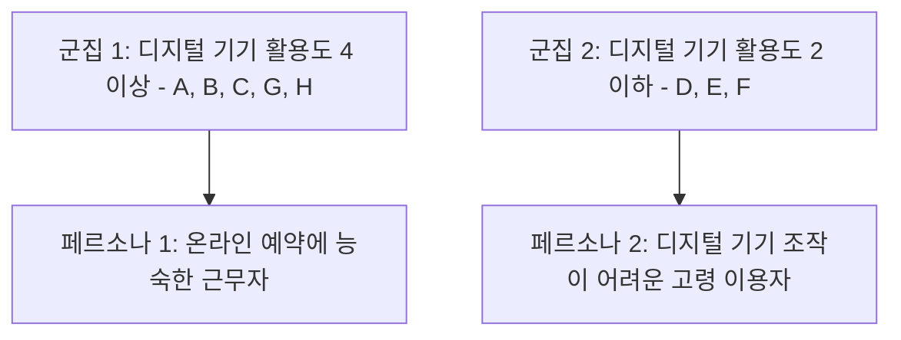

## 왜 대표 인물이 필요한가

09편에서 어피니티 다이어그램으로 인사이트를 뽑았지만, 인사이트는 여전히 "고령 이용자는", "근무 중인 이용자는"처럼 추상적인 집단을 가리킵니다. 팀 전체가 회의 때마다 "우리 사용자"를 서로 다르게 상상하면, 디자인 결정도 매번 어긋납니다.

**페르소나**(persona)는 조사에서 반복적으로 나타난 행동·목표·좌절 패턴을 하나로 묶어, 이름과 얼굴을 가진 가상의 대표 인물로 구체화한 것입니다.

페르소나는 실존 인물 한 명을 그대로 옮긴 것이 아닙니다. 특정 참가자 한 명을 페르소나로 삼으면 그 사람만의 특이한 사정까지 대표성으로 오인하게 됩니다. 여러 참가자에게서 반복된 패턴만 남기고 나머지는 덜어내야 합니다.

## 페르소나와 이웃 개념 구분하기

| 개념 | 정의 | 페르소나와의 차이 |
|------|------|--------------------|
| 사용자 그룹(user segment) | 나이, 직업 등 인구통계로 나눈 집단 | 인구통계만 있고 목표·좌절 같은 맥락이 없다 |
| 원형(archetype) | 특정 역할의 전형적 특징만 요약한 상 | 이름, 하루 일과 같은 구체적 서사가 없다 |
| 페르소나 | 행동 패턴과 목표, 좌절, 서사를 갖춘 가상 인물 | 팀이 감정을 이입해 의사결정 기준으로 쓸 수 있다 |

## 개발 절차

## "행동 패턴 그래프로 페르소나 도출" 문제 접근법

실기에는 인터뷰 참가자 여러 명의 행동 점수를 표나 그래프로 주고, 이를 바탕으로 몇 개의 페르소나로 묶을 수 있는지 서술하라는 유형이 나옵니다. 09편 케이스의 인터뷰 참가자 8명을 두 개의 행동 변수로 배치하면 다음과 같습니다.

| 참가자 | 디지털 기기 활용도(1–5) | 예약 계획성(1–5) |
|--------|--------------------------|--------------------|
| A | 5 | 4 |
| B | 4 | 4 |
| C | 4 | 3 |
| D | 2 | 2 |
| E | 1 | 2 |
| F | 2 | 1 |
| G | 5 | 3 |
| H | 4 | 5 |

**표 읽는 법:** 디지털 기기 활용도는 온라인 예약·키오스크 조작에 얼마나 익숙한지를, 예약 계획성은 방문 며칠 전부터 미리 일정을 잡는 성향인지 당일 즉흥으로 병원을 찾는 성향인지를 나타냅니다.

숫자를 좌표로 옮겨 보면 A·B·C·G·H는 디지털 기기 활용도 4 이상에 몰려 있고, D·E·F는 2 이하에 몰려 있습니다. 두 뭉치 사이에 값 3에 걸치는 참가자가 없어 빈 공간이 뚜렷하므로 **두 개의 군집**, 곧 두 개의 페르소나 후보로 나눌 수 있습니다.

```mermaid
graph TD
  A1[군집 1: 디지털 기기 활용도 4 이상 - A, B, C, G, H] --> P1[페르소나 1: 온라인 예약에 능숙한 근무자]
  A2[군집 2: 디지털 기기 활용도 2 이하 - D, E, F] --> P2[페르소나 2: 디지털 기기 조작이 어려운 고령 이용자]
```

**서술형 답안 예시 — "위 표를 바탕으로 몇 개의 페르소나로 묶을 수 있는지 근거를 들어 서술하시오"라는 문제라면:**

> 여덟 명의 참가자를 디지털 기기 활용도와 예약 계획성 두 축에 배치하면, A·B·C·G·H는 디지털 기기 활용도 4 이상의 영역에, D·E·F는 2 이하의 영역에 뚜렷한 간격을 두고 모인다. 두 영역 사이에 값이 3에 걸치는 참가자가 거의 없어 군집의 경계가 분명하므로, 두 개의 페르소나로 나누는 것이 타당하다. 첫 번째 군집은 온라인 예약과 키오스크 조작에 능숙하고 사전 계획적으로 병원을 찾는 이용자를, 두 번째 군집은 디지털 기기 조작에 어려움을 겪고 즉흥적으로 병원을 찾는 이용자를 대표한다.

**함정:** 참가자 수가 8명이라고 해서 페르소나도 여러 개 만들 필요는 없습니다. 군집이 두 개로 갈리면 페르소나도 둘이면 충분하며, 억지로 셋 이상으로 쪼개면 오히려 각 페르소나의 대표성이 흐려집니다.

## 페르소나 구성요소

| 항목 | 설명 |
|------|------|
| 이름과 대표 이미지 | 팀이 실존 인물처럼 부를 수 있는 이름 |
| 인구통계 | 나이, 직업, 가족 구성 등 기본 정보 |
| 대표 인용문 | 그 사람의 태도를 한 문장으로 드러내는 말 |
| 목표(goal) | 서비스를 이용해 이루고 싶은 것 |
| 좌절(pain point) | 현재 서비스에서 겪는 불편 |
| 행동 특성 | 관련 행동 변수에서 나타나는 습관 |
| 기술 숙련도 | 디지털 기기·서비스 이용 능력 수준 |
| 대표 시나리오 | 서비스를 이용하는 하루의 흐름 |

## 사례로 확인하기 — 새길종합병원 외래 예약 서비스 페르소나

앞의 두 군집을 각각 완성된 페르소나로 확장하면 다음과 같습니다.

| 항목 | 페르소나 1 | 페르소나 2 |
|------|-----------|-----------|
| 이름 | 김지훈 | 박영순 |
| 나이·직업 | 35세, 회사원 | 68세, 무직(정형외과 정기통원) |
| 대표 인용문 | 예약 하나 잡으려고 반차까지 낼 순 없어요 | 저는 그런 거 할 줄 몰라서 딸이 다 해줘요 |
| 목표 | 근무 중 짧은 시간에 원하는 진료 시간을 확정하고 싶다 | 자녀에게 의존하지 않고 스스로 병원 일정을 처리하고 싶다 |
| 좌절 | 점심시간에만 전화가 가능한데 계속 통화중이라 예약을 놓친다 | 온라인 예약과 키오스크 조작 방법을 몰라 결국 딸을 부르거나 그냥 일찍 나와 줄을 선다 |
| 행동 특성 | 디지털 기기 활용도 5, 예약 계획성 4. 이동 중 스마트폰으로 여러 병원 앱을 비교한다 | 디지털 기기 활용도 1, 예약 계획성 2. 정해진 통원일 외에는 즉흥적으로 병원을 찾는다 |
| 기술 숙련도 | 상 | 하 |

**경험 시나리오 서술 예시(김지훈):** 점심시간 12시 10분, 김지훈은 회의 사이 짬을 내 병원 예약 전화를 걸지만 세 번 연속 통화중 신호를 듣는다. 결국 스마트폰으로 병원 홈페이지를 찾아보지만 온라인 예약 메뉴가 없어 오후 반차를 내고 직접 방문하기로 한다.

## 자주 틀리는 점

- **페르소나를 실존 인물 한 명 그대로 베낀다.** 인터뷰이 한 명의 특이한 사정(예: 특정 요일에만 시간이 나는 개인 사정)까지 그대로 담으면 다수를 대표하지 못하는 페르소나가 됩니다
- **극단적 소수 의견을 대표로 착각한다.** 8명 중 1명만 보인 매우 예외적인 행동을 페르소나의 핵심 특징으로 삼으면 안 됩니다. 군집을 이룬 다수의 패턴을 따라야 합니다
- **인구통계 항목만 채우고 목표·좌절을 비운다.** 나이와 직업만 있는 페르소나는 사용자 그룹과 다르지 않습니다. 목표와 좌절이 있어야 디자인 결정의 기준이 됩니다
- **페르소나 여러 개를 서로 구별되지 않게 만든다.** 두 페르소나의 행동 특성이 비슷하면 애초에 하나의 페르소나로 합쳐야 합니다. 각 페르소나는 서로 다른 디자인 대응이 필요할 만큼 뚜렷하게 달라야 합니다

## 핵심 정리

- 페르소나는 인구통계만 있는 사용자 그룹이나 전형만 요약한 원형과 달리, 목표·좌절·서사를 갖춘 가상의 대표 인물이다
- 행동 패턴 그래프 문제는 두 개의 행동 변수 축에 참가자를 배치해, 뚜렷하게 뭉친 군집의 개수만큼 페르소나 후보를 정하는 방식으로 접근한다
- 완성된 페르소나 표에는 이름, 인구통계, 인용문, 목표, 좌절, 행동 특성, 기술 숙련도가 빠짐없이 채워져야 한다
- 특정 참가자를 그대로 옮기거나 극단적 소수 의견을 대표로 삼지 말고, 반복된 패턴만 남겨 대표성을 검증해야 한다

## 마무리 복습

<Quiz
  questionNumber={1}
  question={"페르소나에 대한 설명으로 가장 적절한 것은?"}
  options={["나이와 직업 등 인구통계로만 구성된 집단이다","특정 역할의 전형적 특징만 요약한 상이다","반복된 행동 패턴과 목표, 좌절, 서사를 갖춘 가상의 대표 인물이다","조사에 참여한 특정 인물 한 명을 그대로 옮긴 것이다"]}
  correctAnswer={3}
  explanation={"페르소나는 여러 참가자에게서 반복적으로 나타난 행동과 목표, 좌절을 하나로 묶어 이름과 서사를 가진 가상 인물로 구체화한 것이다."}
/>

<Quiz
  questionNumber={2}
  question={"8명의 참가자를 디지털 기기 활용도와 예약 계획성 두 축에 배치했을 때, 값 4 이상에 다섯 명이 값 2 이하에 세 명이 뚜렷한 간격을 두고 모여 있다면 몇 개의 페르소나로 나누는 것이 타당한가?"}
  options={["1개","2개","4개","8개"]}
  correctAnswer={2}
  explanation={"두 개의 뚜렷한 군집이 확인되었으므로 페르소나도 두 개로 나누는 것이 타당하다. 참가자 수만큼 쪼개거나 군집이 없는데 억지로 여러 개로 나누면 대표성이 흐려진다."}
/>

<Quiz
  questionNumber={3}
  question={"페르소나 개발 과정에서 대표성을 해치는 사례로 가장 적절한 것은?"}
  options={["여러 참가자에게서 반복된 행동만 남기고 개인적 사정은 덜어낸다","군집이 뭉친 지점을 기준으로 페르소나 후보를 정한다","8명 중 1명에게서만 나타난 예외적 행동을 페르소나의 핵심 특징으로 삼는다","목표와 좌절 항목을 표에 구체적으로 채운다"]}
  correctAnswer={3}
  explanation={"한 명에게서만 나타난 예외적 행동을 핵심 특징으로 삼으면 다수를 대표하지 못하는 페르소나가 만들어진다. 군집을 이룬 다수의 패턴을 따라야 대표성이 유지된다."}
/>

## 참고 자료

- [한국산업인력공단 - 서비스·경험디자인 기사 출제기준(필기·실기)](https://t1.daumcdn.net/brunch/service/user/13ur/file/tayw3sSk4ib3un2lLq5U249xKUg.pdf)
