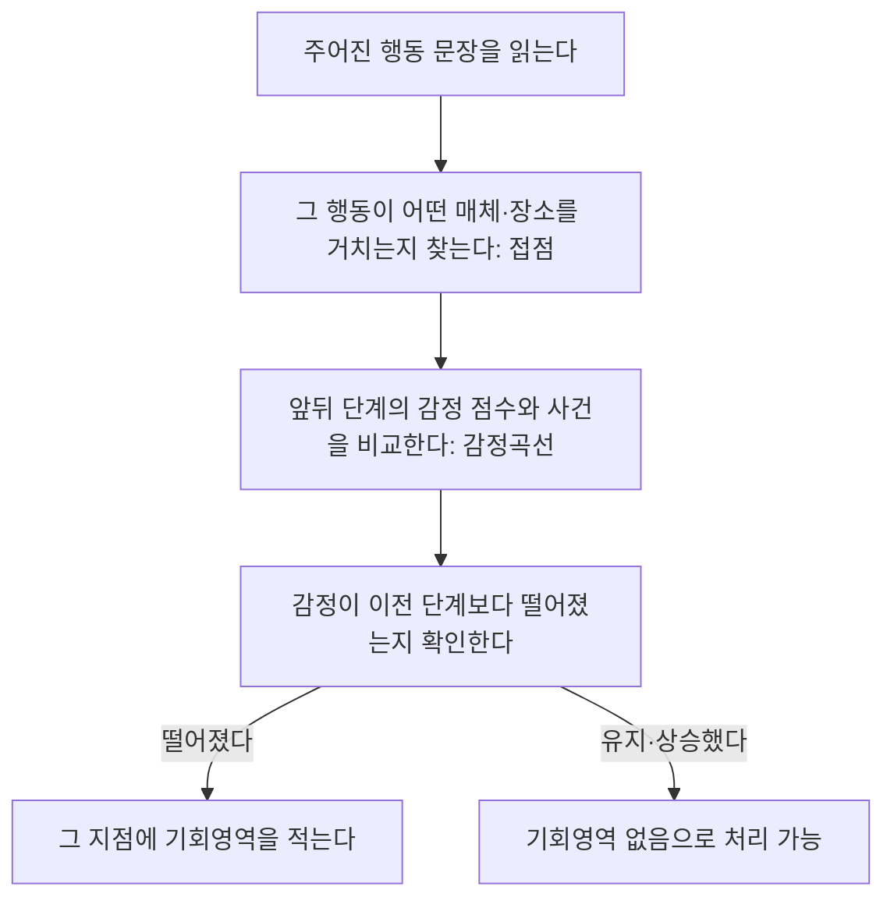

<Callout type="info">
  **이번 문서의 목표:** 페르소나의 서비스 이용 과정을 단계별로 나누어 행동·접점·감정곡선·기회영역이 빠짐없이 채워진 여정 지도를 완성하고, 빈칸으로 주어진 여정맵 문제를 추론해 채울 수 있게 된다.
</Callout>

## 왜 여정 전체를 봐야 하는가

10편에서 만든 페르소나는 "누가" 이 서비스를 쓰는지 보여줍니다. 하지만 그 사람이 서비스를 이용하는 **한 시점**만 개선해서는 부족합니다. 예약은 편해졌는데 대기실에서 불안하고, 진료는 만족스러운데 수납 창구에서 다시 짜증이 난다면, 서비스 전체 경험은 여전히 나쁩니다.

**고객 여정 지도**(customer journey map)는 사용자가 서비스를 인지하는 순간부터 이용을 마치고 다시 떠올리는 순간까지, 시간 흐름에 따라 행동과 감정이 어떻게 변하는지 한 장의 지도로 그린 것입니다.

> **쉽게 말하면:** 사용자가 서비스를 이용하는 시작부터 끝까지의 길을 지도처럼 펼쳐, 어디에서 기분이 좋아지고 어디에서 나빠지는지 한눈에 보여주는 도구입니다.

한 접점만 따로 떼어 보면 사소해 보이는 불편도, 여정 전체에 놓고 보면 앞 단계의 짜증이 다음 단계까지 이어지는 것을 알 수 있습니다. 실기에서는 단계·접점·감정곡선 일부를 비워 두고 채우게 하는 문제가 자주 나옵니다.

## 여정 지도의 구성요소

| 구성요소 | 정의 |
|----------|------|
| 단계(phase) | 여정을 사용자 관점의 큰 국면으로 나눈 구간 |
| 행동(action) | 그 단계에서 사용자가 실제로 하는 일 |
| 접점(touchpoint) | 사용자가 서비스와 만나는 구체적인 매체나 장소 |
| 생각과 감정(thought/emotion) | 그 행동을 할 때 사용자의 머릿속 생각과 느낀 감정 |
| 감정곡선(emotional curve) | 단계별 감정을 점수로 매겨 이은 선. 오르내림으로 만족·불만 지점을 보여준다 |
| 기회영역(opportunity) | 감정이 낮아진 지점에서 개선할 수 있는 지점 |

**접점과 감정곡선을 혼동하면 안 됩니다.** 접점은 "무엇을 통해 만났는가"라는 매체·장소이고, 감정곡선은 "그 순간 기분이 어땠는가"라는 심리 상태입니다. 같은 접점(예: 대기실 전광판)이라도 안내가 정확하면 감정이 오르고 부정확하면 감정이 내려갈 수 있으므로, 둘은 서로 다른 질문에 답하는 별개의 칸입니다.

## 작성 절차

<Steps>

1. **여정의 시작과 끝 범위를 정한다** — 필요를 느끼는 순간부터 시작할지, 서비스를 다 쓰고 재이용을 고민하는 순간까지 포함할지 범위를 명확히 합니다
2. **단계를 사용자 관점으로 나눈다** — 조직의 내부 업무 단계가 아니라 사용자가 체감하는 국면으로 나눕니다
3. **단계별 행동을 나열한다** — 10편 페르소나의 목표와 좌절을 바탕으로 실제로 무엇을 하는지 적습니다
4. **각 행동의 접점을 식별한다** — 그 행동이 어떤 매체·장소·사람을 통해 일어나는지 적습니다
5. **감정 점수를 매긴다** — 보통 1(매우 나쁨)에서 5(매우 좋음) 사이로, 왜 그 점수인지 근거를 함께 적습니다
6. **감정곡선을 그린다** — 단계를 가로축, 감정 점수를 세로축으로 이어 오르내림을 시각화합니다
7. **저점에서 기회영역을 도출한다** — 감정이 낮아진 지점마다 개선 아이디어를 붙입니다

</Steps>

## 빈칸 채우기 문제 접근법

실기 문제는 단계와 일부 행동만 주고 접점·감정·기회영역 칸을 비워 두는 경우가 많습니다. 이때는 다음 순서로 추론합니다.

**감정 점수를 추론하는 근거는 항상 주어진 문장 안에 있습니다.** "20분 이상 기다렸다"처럼 부정적 사건이 명시되면 감정은 낮게, "원하는 답을 들었다"처럼 목표 달성이 명시되면 감정은 높게 매깁니다. 근거 문장 없이 임의로 점수를 매기면 감점 대상이 됩니다.

## 케이스로 실습하기 — 김지훈의 외래 진료 여정

10편의 페르소나 김지훈(35세 회사원)이 손목 통증으로 새길종합병원을 찾는 여정을 완성하면 다음과 같습니다.

| 단계 | 행동 | 접점 | 감정 점수 | 감정 상태 | 기회영역 |
|------|------|------|-----------|-----------|----------|
| 인지 | 손목 통증이 며칠째 이어져 병원 진료가 필요하다고 느낀다 | 자신의 신체 감각 | 3 | 아직 큰 불편은 없지만 진료를 미루면 안 되겠다고 생각한다 | - |
| 예약 | 점심시간에 전화를 걸지만 계속 통화중이라 홈페이지를 확인하나 온라인 예약 메뉴가 없다 | 전화, 병원 홈페이지 | 2 | 예약 하나로 시간을 허비해 짜증이 난다 | 근무시간과 겹치지 않는 온라인 예약 채널 확대 |
| 방문과 접수 | 오후 반차를 내고 병원에 도착해 접수 키오스크로 접수를 마친다 | 접수 키오스크 | 3 | 조작에는 익숙해 특별한 어려움이 없다 | - |
| 대기 | 예약 시간보다 20분 넘게 기다리지만 대기 순번이나 예상 시간 안내가 없다 | 대기실 | 2 | 예약이 지켜지지 않는다는 불신이 쌓인다 | 실시간 대기 순번과 예상 대기시간 안내 화면 |
| 진료 | 의사에게 통증 부위를 설명하고 원하는 답과 처방을 받는다 | 진료실 | 5 | 진료 자체에는 만족한다 | - |
| 수납과 처방 | 수납 창구에서 다시 줄을 서고 처방전만 받은 채 나온다 | 수납 창구, 종이 처방전 | 3 | 진료 만족감이 대기로 다시 옅어진다 | 진료 종료와 동시에 모바일로 처방전과 인근 약국 재고를 안내 |
| 사후관리 | 복약 안내나 다음 통원 안내 문자를 받지 못해 다음에도 같은 예약 과정을 반복할 것을 걱정한다 | 문자 안내(부재) | 2 | 서비스가 여기서 끝난 느낌이라 다음 방문이 걱정된다 | 복약 알림과 재예약 링크를 포함한 사후 안내 문자 |

**감정곡선 시각화:**

<DataBarChart
  title="김지훈의 단계별 감정 점수(1~5)"
  data={[
    { label: '인지', value: 3 },
    { label: '예약', value: 2 },
    { label: '접수', value: 3 },
    { label: '대기', value: 2 },
    { label: '진료', value: 5 },
    { label: '수납', value: 3 },
    { label: '사후', value: 2 },
  ]}
/>

**해석:** 감정곡선은 예약과 대기, 사후관리 세 지점에서 뚜렷하게 내려앉습니다. 진료라는 서비스의 핵심 가치는 5점으로 가장 높지만, 그 앞뒤로 감정이 낮은 구간이 반복되면서 전체 인상은 좋지 못한 방향으로 남습니다. 이것이 여정 지도가 알려주는 가장 중요한 사실입니다. **핵심 가치 하나만 잘한다고 좋은 경험이 되지 않으며, 앞뒤 접점의 관리가 함께 필요합니다.**

**서술형 답안 예시 — "위 여정 지도에서 가장 우선적으로 개선해야 할 지점과 그 이유를 서술하시오"라는 문제라면:**

> 감정곡선에서 가장 먼저 개선해야 할 지점은 예약 단계다. 예약 단계는 감정 점수가 2점으로 낮을 뿐 아니라, 여정의 첫 접점이라는 점에서 이후 모든 단계에 대한 신뢰에 영향을 준다. 전화 채널이 근무시간과 맞지 않고 대체 채널인 온라인 예약마저 없어, 사용자가 서비스 전체에 대한 부정적 인상을 갖고 다음 단계로 넘어가게 된다. 반면 대기 단계는 예약 단계에서 이미 낮아진 신뢰를 다시 한번 확인시키는 역할을 하므로, 예약 채널을 먼저 개선하면 대기 단계의 부정적 영향도 상당 부분 완화될 것으로 예상된다.

## 자주 틀리는 점

- **접점과 감정을 같은 칸에 섞어 적는다.** "짜증나는 전화 예약"처럼 접점과 감정을 한 칸에 합치면 채점 기준에서 요구하는 두 항목을 분리해 답하지 못한 것으로 처리됩니다. 접점 칸에는 매체·장소만, 감정 칸에는 심리 상태만 적어야 합니다
- **단계를 조직의 내부 업무 순서로 나눈다.** "접수 처리", "차트 작성"처럼 병원 내부 업무 절차로 단계를 나누면 사용자가 체감하는 흐름과 어긋납니다. 단계는 항상 사용자가 무엇을 겪는지를 기준으로 나눠야 합니다
- **감정 점수의 근거를 생략한다.** 점수만 적고 왜 그 점수인지 서술하지 않으면, 채점자가 추론의 타당성을 확인할 수 없습니다. 감정 점수 옆에는 항상 그 점수를 매긴 사건이나 발언을 근거로 남깁니다
- **기회영역을 모든 칸에 억지로 채운다.** 감정이 유지되거나 상승한 단계에는 기회영역이 없을 수 있습니다. 근거 없이 모든 칸을 채우면 오히려 우선순위를 흐립니다

## 핵심 정리

- 여정 지도는 단계, 행동, 접점, 감정곡선, 기회영역으로 구성되며, 접점(매체·장소)과 감정곡선(심리 상태)은 서로 다른 질문에 답하는 별개의 항목이다
- 단계는 조직의 내부 업무가 아니라 사용자가 체감하는 국면을 기준으로 나눈다
- 빈칸 채우기 문제는 주어진 행동 문장에서 접점을 찾고, 앞뒤 단계와 비교해 감정 점수와 기회영역을 추론하는 순서로 접근한다
- 감정곡선이 낮아진 지점마다 근거를 들어 기회영역을 도출하며, 핵심 가치를 제공하는 단계 하나가 높은 점수를 받아도 앞뒤 단계가 낮으면 전체 경험은 좋지 않다

## 마무리 복습

<Quiz
  questionNumber={1}
  question="고객 여정 지도의 접점(touchpoint)과 감정곡선(emotional curve)의 관계에 대한 설명으로 가장 적절한 것은?"
  options={['접점과 감정곡선은 같은 개념이므로 한 칸에 함께 적어도 된다', '접점은 매체와 장소를, 감정곡선은 그 순간의 심리 상태를 나타내는 별개의 항목이다', '감정곡선은 접점이 있는 단계에만 존재한다', '접점이 같으면 감정 점수도 항상 같다']}
  correctAnswer={2}
  explanation="접점은 사용자가 서비스와 만나는 매체나 장소를 가리키고, 감정곡선은 그 순간 사용자가 느끼는 심리 상태를 점수로 나타낸 것이다. 같은 접점이라도 상황에 따라 감정 점수는 달라질 수 있다."
  optionExplanations={['둘을 한 칸에 섞으면 채점 기준의 별도 항목을 답하지 못한 것이 된다.', '매체·장소와 심리 상태를 각각 나타내는 서로 다른 항목이라는 설명이 정확하다.', '감정곡선은 접점 유무와 무관하게 모든 단계에서 매겨진다.', '같은 접점이라도 안내의 정확성 등에 따라 감정 점수가 달라질 수 있다.']}
/>

<Quiz
  questionNumber={2}
  question="여정 지도의 단계(phase)를 나누는 기준으로 가장 적절한 것은?"
  options={['병원 내부의 업무 처리 순서', '사용자가 체감하는 경험의 국면', '직원의 근무 교대 시간', '서비스 시스템의 데이터베이스 구조']}
  correctAnswer={2}
  explanation="여정 지도는 사용자 중심의 도구이므로 단계는 조직 내부의 업무나 시스템 구조가 아니라 사용자가 실제로 체감하는 경험의 국면을 기준으로 나눠야 한다."
  optionExplanations={['내부 업무 순서로 나누면 사용자가 체감하는 흐름과 어긋난다.', '사용자가 겪는 경험의 국면을 기준으로 나누는 것이 여정 지도의 원칙이다.', '근무 교대는 사용자가 인지하지 못하는 조직 내부 요인이다.', '데이터베이스 구조는 사용자 경험과 직접 관련이 없다.']}
/>

<Quiz
  questionNumber={3}
  question="김지훈의 여정 지도에서 예약 단계의 감정 점수를 2점으로 매긴 근거로 가장 적절한 것은?"
  options={['진료실에서 원하는 답을 들었기 때문이다', '전화가 계속 통화중이었고 온라인 예약 메뉴도 없어 시간을 허비했기 때문이다', '접수 키오스크 조작에 익숙했기 때문이다', '수납 창구에서 다시 줄을 섰기 때문이다']}
  correctAnswer={2}
  explanation="감정 점수는 해당 단계에서 실제로 일어난 사건을 근거로 매겨야 한다. 예약 단계에서는 전화 연결 실패와 온라인 예약 부재가 낮은 점수의 근거다."
  optionExplanations={['이는 진료 단계의 사건이며 예약 단계와 무관하다.', '전화 연결 실패와 온라인 채널 부재가 예약 단계의 낮은 감정 점수의 근거다.', '이는 접수 단계의 사건이며 오히려 감정을 낮추지 않는 요인이다.', '이는 수납 단계의 사건이며 예약 단계의 근거로 쓸 수 없다.']}
/>

<Quiz
  questionNumber={4}
  question="여정 지도의 빈칸 채우기 문제를 풀 때 접점을 추론하는 방법으로 가장 적절한 것은?"
  options={['주어진 행동 문장이 어떤 매체나 장소를 거쳐 일어나는지 확인한다', '감정 점수를 먼저 임의로 정한 뒤 그에 맞는 접점을 지어낸다', '다른 단계의 접점을 그대로 복사한다', '문제에 제시되지 않은 정보는 채우지 않고 비워 둔다']}
  correctAnswer={1}
  explanation="접점은 주어진 행동 문장 안에서 그 행동이 실제로 어떤 매체나 장소를 통해 일어나는지를 근거로 찾아야 한다."
  optionExplanations={['행동 문장에서 매체·장소를 찾는 것이 올바른 추론 순서다.', '감정을 먼저 임의로 정하면 근거 없는 답안이 된다.', '단계마다 접점은 다를 수 있으므로 복사는 부적절하다.', '문제 문장 안에 접점을 추론할 단서가 주어지는 것이 일반적이다.']}
/>

<Quiz
  questionNumber={5}
  question="여정 지도에서 기회영역(opportunity)을 도출하는 기준으로 가장 적절한 것은?"
  options={['모든 단계에 예외 없이 기회영역을 하나씩 적는다', '감정곡선이 이전 단계보다 낮아진 지점을 근거로 도출한다', '단계 순서와 무관하게 무작위로 선택한다', '접점의 개수가 가장 많은 단계에서만 도출한다']}
  correctAnswer={2}
  explanation="기회영역은 감정곡선이 낮아진 지점, 즉 사용자가 부정적 경험을 겪은 구간을 근거로 도출한다. 감정이 유지되거나 상승한 단계에는 기회영역이 없을 수 있다."
  optionExplanations={['감정이 좋은 단계까지 억지로 채우면 우선순위가 흐려진다.', '감정이 낮아진 지점을 근거로 삼는 것이 올바른 기준이다.', '무작위 선택은 근거 없는 도출 방식이다.', '접점 개수와 개선 필요성은 직접적인 관련이 없다.']}
/>

<Quiz
  questionNumber={6}
  question="김지훈의 여정 지도에서 진료 단계가 5점으로 가장 높은데도 서비스 전체 경험이 좋지 않다고 평가되는 이유는?"
  options={['진료 단계의 점수가 실제보다 과장되었기 때문이다', '예약, 대기, 사후관리 등 앞뒤 단계의 감정이 낮아 전체 인상에 영향을 주기 때문이다', '진료 단계는 여정 지도에서 제외해야 하기 때문이다', '감정 점수는 마지막 단계만 중요하기 때문이다']}
  correctAnswer={2}
  explanation="여정 지도는 한 접점의 점수만으로 평가하지 않는다. 핵심 가치를 제공하는 단계가 높은 점수를 받아도 앞뒤 접점에서 반복적으로 감정이 낮아지면 서비스 전체에 대한 인상은 좋지 않게 남는다."
  optionExplanations={['점수는 진료실에서의 실제 사건을 근거로 매긴 것이며 과장이 아니다.', '앞뒤 단계의 누적된 부정적 경험이 전체 인상을 좌우한다는 설명이 정확하다.', '핵심 접점이라도 전체 여정의 일부로 반드시 포함해야 한다.', '여정 전체의 감정곡선을 종합해서 판단해야 한다.']}
/>

## 참고 자료

- [한국산업인력공단 - 서비스·경험디자인 기사 출제기준(필기·실기)](https://t1.daumcdn.net/brunch/service/user/13ur/file/tayw3sSk4ib3un2lLq5U249xKUg.pdf)
