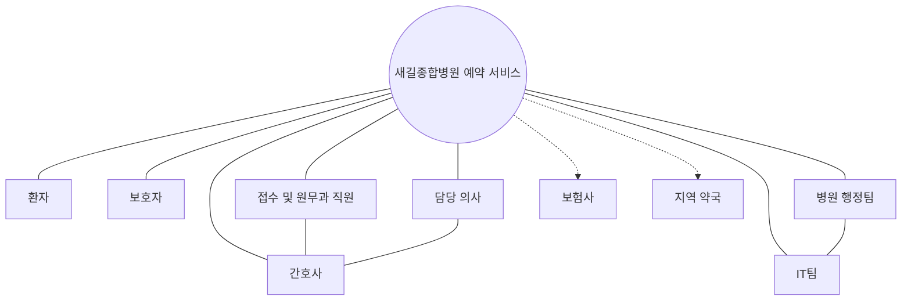

<Callout type="info">
  **이번 문서의 목표:** 서비스의 가치사슬에서 이해관계자를 빠짐없이 선별하고, 영향력과 관심도 기준으로 우선순위를 매겨 완성된 이해관계자 맵과 서술 답안을 작성할 수 있게 된다.
</Callout>

## 왜 사용자 말고 다른 사람들까지 봐야 하는가

10편의 페르소나와 11편의 여정 지도는 서비스를 **이용하는** 사람에게 집중했습니다. 그런데 서비스는 이용자 혼자 만들어 내는 것이 아닙니다. 새길종합병원의 예약 서비스를 개선하려면 접수 직원의 업무 방식, 간호사의 안내 절차, 병원 IT팀의 시스템 여력, 심지어 보험사의 청구 연동 방식까지 함께 바뀌어야 실제로 작동합니다. 사용자 경험만 그리고 이 사람들을 고려하지 않으면, 아무리 좋은 콘셉트도 현장에서 실행되지 못합니다.

**이해관계자**(stakeholder)는 서비스가 만들어지고 운영되는 과정에서 영향을 주거나 받는 모든 개인과 조직입니다.

> **쉽게 말하면:** 서비스 하나를 둘러싸고 이해관계가 얽혀 있는 사람들을 전부 찾아, 누가 중요하고 누구와 먼저 협의해야 하는지 지도로 그리는 작업입니다.

## 이해관계자의 종류

| 구분 | 정의 | 이 편 사례에서의 예 |
|------|------|----------------------|
| 1차(직접) 이해관계자 | 서비스를 직접 이용하거나 제공하는 당사자 | 환자, 보호자, 접수 직원, 간호사, 담당 의사 |
| 2차(간접) 이해관계자 | 서비스에 영향을 주지만 직접 이용·제공하지는 않는 당사자 | 병원 행정팀, IT팀, 보험사, 지역 약국 |

**가치사슬**(value chain)은 서비스가 기획되고 만들어져 사용자에게 전달되기까지 참여하는 활동과 참여자의 연쇄입니다. 이해관계자를 빠짐없이 찾으려면, 사용자 눈에 보이는 접점 뒤에서 그 접점을 가능하게 만드는 활동까지 가치사슬을 따라 거슬러 올라가야 합니다. 예를 들어 사용자에게는 접수 키오스크 화면만 보이지만, 그 뒤에는 화면을 운영하는 IT팀과 예약 정보를 실제로 입력하는 접수 직원이 있습니다.

## 분석 절차

<Steps>

1. **서비스 가치사슬을 정의한다** — 서비스가 기획부터 이용 이후까지 거치는 활동을 순서대로 나열합니다
2. **이해관계자를 브레인스토밍한다** — 가치사슬의 각 활동마다 누가 관여하는지 빠짐없이 적습니다
3. **직접·간접, 내부·외부로 분류한다** — 서비스를 직접 이용·제공하는지, 조직 내부인지 외부 기관인지 나눕니다
4. **영향력과 관심도로 매트릭스에 배치한다** — 이 서비스의 성패에 얼마나 큰 영향력을 행사할 수 있는지, 이 서비스에 얼마나 관심이 있는지 두 기준으로 위치를 정합니다
5. **관계선을 그려 맵으로 시각화한다** — 이해관계자 사이의 정보·자원 흐름을 선으로 연결합니다
6. **우선순위를 판단한다** — 매트릭스 위치에 따라 어떤 이해관계자와 먼저, 어떻게 협의할지 정합니다

</Steps>

## 영향력-관심도 매트릭스

이해관계자 분석에서 가장 널리 쓰이는 도구는 영향력(power)과 관심도(interest)를 두 축으로 하는 2x2 매트릭스입니다.

| 구분 | 관심도 낮음 | 관심도 높음 |
|------|-------------|-------------|
| 영향력 높음 | 만족 유지 대상 — 정기적으로 상황을 공유하되 과도하게 개입시키지 않는다 | 핵심 관리 대상 — 프로젝트 전 과정에 적극적으로 참여시킨다 |
| 영향력 낮음 | 최소 관리 대상 — 큰 변화가 있을 때만 알린다 | 정보 제공 대상 — 의견을 듣되 의사결정 권한은 제한적으로 준다 |

**함정:** 영향력을 조직 내 직급으로만 판단하면 안 됩니다. 병원장의 영향력이 크더라도 예약 시스템 자체에는 관심이 낮을 수 있고, 반대로 직급이 낮은 접수 직원이 실제 시스템 운영에는 결정적인 영향력을 가질 수 있습니다. 영향력은 **이 서비스의 성패를 좌우할 수 있는 실질적인 힘**을 기준으로 판단합니다.

## 케이스로 실습하기 — 새길종합병원 예약 서비스 이해관계자

09~11편 케이스에 등장한 인물과 배경으로 가치사슬을 따라가며 이해관계자를 찾으면 다음과 같습니다.

| 이해관계자 | 구분 | 역할 | 영향력 | 관심도 | 니즈 |
|------------|------|------|--------|--------|------|
| 환자(김지훈, 박영순 등) | 1차·직접 | 서비스를 이용해 진료를 예약하고 받는다 | 낮음 | 높음 | 원하는 시간에 예약을 확정하고 대기 없이 진료받고 싶다 |
| 보호자 | 1차·직접 | 고령 환자의 예약과 접수를 대신 처리한다 | 낮음 | 높음 | 자신이 곁에 없어도 환자가 예약을 완료할 수 있길 바란다 |
| 접수·원무과 직원 | 1차·직접 | 예약 접수와 현장 접수를 처리한다 | 높음 | 높음 | 문의 전화와 현장 문의가 줄어들어 업무 부담이 낮아지길 바란다 |
| 간호사 | 1차·직접 | 진료 순서를 안내하고 대기 상황을 관리한다 | 중간 | 중간 | 대기 환자의 불만 응대에 드는 시간을 줄이고 싶다 |
| 담당 의사 | 1차·직접 | 예약된 시간에 맞춰 진료를 제공한다 | 높음 | 낮음 | 진료 외 시간에 예약 시스템 이슈로 방해받고 싶지 않다 |
| 병원 행정팀 | 2차·간접(내부) | 예약 시스템 도입과 운영 정책을 결정한다 | 높음 | 높음 | 예약 시스템 개선이 병원 평판과 효율에 기여하길 바란다 |
| IT팀 | 2차·간접(내부) | 예약 시스템과 키오스크를 운영·유지보수한다 | 높음 | 중간 | 새 기능이 기존 시스템 안정성을 해치지 않길 바란다 |
| 보험사 | 2차·간접(외부) | 진료 후 실손보험 청구 절차와 연동된다 | 중간 | 낮음 | 청구 절차에 필요한 정보가 정확히 전달되길 바란다 |
| 지역 약국 | 2차·간접(외부) | 처방전을 받아 조제한다 | 낮음 | 낮음 | 처방 정보가 미리 공유되면 조제 대기시간을 줄일 수 있다 |

**매트릭스 배치:** 접수·원무과 직원과 병원 행정팀은 영향력과 관심도가 모두 높아 **핵심 관리 대상**입니다. 담당 의사와 IT팀은 영향력은 높지만 관심도가 상대적으로 낮아 **만족 유지 대상**으로, 정기적으로 진행 상황을 공유하되 과도하게 회의에 끌어들이지 않는 편이 효율적입니다. 환자와 보호자는 영향력은 낮지만 관심도가 매우 높아 **정보 제공 대상**으로, 의견은 적극적으로 듣되 시스템 설계 의사결정은 병원 측이 주도합니다. 지역 약국은 영향력과 관심도가 모두 낮아 **최소 관리 대상**입니다.

## 이해관계자 맵 시각화

**맵을 읽는 법:** 실선은 서비스와 직접 맞닿은 1차 이해관계자를, 점선은 서비스에 간접적으로 연결된 2차 이해관계자를 나타냅니다. 행정팀과 IT팀처럼 서로 협의가 필요한 이해관계자끼리는 별도의 선으로 연결해, 누구와 누구 사이에 조율이 필요한지도 함께 보여줍니다.

**서술형 답안 예시 — "위 서비스의 이해관계자를 영향력-관심도 매트릭스로 분류하고, 핵심 관리 대상을 선정한 근거를 서술하시오"라는 문제라면:**

> 새길종합병원 예약 서비스의 이해관계자 가운데 접수 및 원무과 직원과 병원 행정팀은 영향력과 관심도가 모두 높아 핵심 관리 대상으로 선정했다. 접수 직원은 예약 시스템 변경이 실제 업무 방식에 직접 반영되는 당사자이며, 시스템에 대한 이해와 협조 없이는 어떤 개선안도 현장에서 실행되지 못한다. 병원 행정팀은 시스템 도입과 예산을 결정할 권한을 가지고 있으면서, 예약 서비스 개선이 병원 평판과 운영 효율에 미치는 영향에 높은 관심을 두고 있다. 두 이해관계자는 프로젝트 초기 기획 단계부터 지속적으로 참여시켜야 하며, 이들의 동의 없이 진행된 개선안은 실행 단계에서 좌초될 위험이 크다.

## 자주 틀리는 점

- **이해관계자와 사용자(고객)를 혼동한다.** 환자만 이해관계자로 적고 접수 직원, IT팀, 보험사를 빠뜨리면 가치사슬의 절반만 본 것입니다. 서비스를 실제로 만들고 운영하는 사람들까지 포함해야 합니다
- **영향력을 조직 내 직급으로만 판단한다.** 직급이 높다고 이 서비스에 실질적인 영향력을 갖는 것은 아닙니다. 이 서비스의 성패를 좌우할 수 있는 실질적인 힘을 기준으로 판단해야 합니다
- **간접 이해관계자를 누락한다.** 보험사나 지역 약국처럼 눈에 잘 띄지 않는 2차 이해관계자를 빠뜨리기 쉽습니다. 가치사슬을 사용자 접점 뒤까지 따라가야 이런 이해관계자를 찾을 수 있습니다
- **우선순위 판단 없이 이해관계자를 나열만 한다.** 이해관계자를 모두 찾았다고 끝이 아닙니다. 매트릭스로 우선순위를 매기지 않으면, 한정된 시간에 누구와 먼저 협의해야 하는지 알 수 없습니다

## 핵심 정리

- 이해관계자는 서비스를 직접 이용·제공하는 1차(직접) 이해관계자와, 서비스에 영향을 주고받지만 직접 관여하지 않는 2차(간접) 이해관계자로 나뉜다
- 이해관계자는 서비스의 가치사슬을 사용자 접점 뒤까지 따라가며 빠짐없이 찾아야 하며, 조직 내부와 외부 기관을 모두 포함한다
- 영향력-관심도 매트릭스는 영향력과 관심도가 모두 높은 이해관계자를 핵심 관리 대상으로, 나머지는 만족 유지·정보 제공·최소 관리 대상으로 나눠 우선순위를 정한다
- 영향력은 조직 내 직급이 아니라 이 서비스의 성패를 좌우할 수 있는 실질적인 힘을 기준으로 판단해야 한다

## 마무리 복습

<Quiz
  questionNumber={1}
  question="이해관계자(stakeholder)에 대한 정의로 가장 적절한 것은?"
  options={['서비스를 이용하는 고객만을 가리킨다', '서비스가 만들어지고 운영되는 과정에서 영향을 주거나 받는 모든 개인과 조직이다', '병원 내부 직원만을 가리킨다', '서비스와 무관한 일반 대중을 가리킨다']}
  correctAnswer={2}
  explanation="이해관계자는 서비스를 이용하는 사용자뿐 아니라, 서비스를 제공하고 운영하며 영향을 주고받는 모든 개인과 조직을 포괄하는 개념이다."
  optionExplanations={['고객만으로 한정하면 서비스 제공자 측의 이해관계자를 놓친다.', '이용자와 제공자, 내부와 외부를 모두 포괄하는 정의가 정확하다.', '내부 직원만으로 한정하면 외부 이해관계자를 놓친다.', '서비스와 관련이 없으면 이해관계자로 볼 수 없다.']}
/>

<Quiz
  questionNumber={2}
  question="다음 중 2차(간접) 이해관계자로 가장 적절한 것은?"
  options={['서비스를 이용하는 환자', '예약 접수를 처리하는 원무과 직원', '진료 후 실손보험 청구와 연동되는 보험사', '진료를 제공하는 담당 의사']}
  correctAnswer={3}
  explanation="보험사는 서비스를 직접 이용하거나 제공하지 않지만 진료 후 청구 절차를 통해 영향을 주고받는 2차(간접) 이해관계자다. 나머지는 서비스를 직접 이용·제공하는 1차(직접) 이해관계자다."
  optionExplanations={['환자는 서비스를 직접 이용하는 1차 이해관계자다.', '원무과 직원은 서비스를 직접 제공하는 1차 이해관계자다.', '직접 이용·제공하지 않고 간접적으로 영향을 주고받는 이해관계자다.', '담당 의사는 서비스를 직접 제공하는 1차 이해관계자다.']}
/>

<Quiz
  questionNumber={3}
  question="영향력-관심도 매트릭스에서 영향력과 관심도가 모두 높은 이해관계자에게 취해야 할 대응으로 가장 적절한 것은?"
  options={['큰 변화가 있을 때만 알린다', '정기적으로 상황만 공유하고 개입은 최소화한다', '프로젝트 전 과정에 적극적으로 참여시킨다', '의사결정 권한을 주지 않고 의견만 듣는다']}
  correctAnswer={3}
  explanation="영향력과 관심도가 모두 높은 이해관계자는 핵심 관리 대상으로, 프로젝트 기획부터 실행까지 전 과정에 적극적으로 참여시켜야 실행 단계에서 좌초될 위험을 줄일 수 있다."
  optionExplanations={['이는 영향력과 관심도가 모두 낮은 최소 관리 대상에 대한 대응이다.', '이는 영향력은 높지만 관심도가 낮은 만족 유지 대상에 대한 대응이다.', '핵심 관리 대상에게는 실질적인 참여와 의사결정 관여가 필요하다.', '이는 영향력은 낮지만 관심도가 높은 정보 제공 대상에 대한 대응이다.']}
/>

<Quiz
  questionNumber={4}
  question="이해관계자의 영향력을 판단하는 기준으로 가장 적절한 것은?"
  options={['조직 내 직급이 높을수록 영향력도 항상 높다', '이 서비스의 성패를 좌우할 수 있는 실질적인 힘을 기준으로 판단한다', '이해관계자의 나이가 많을수록 영향력이 높다', '서비스를 이용하는 빈도가 높을수록 영향력이 높다']}
  correctAnswer={2}
  explanation="영향력은 조직 내 지위가 아니라 이 서비스가 성공하거나 실패하는 데 실질적으로 얼마나 힘을 행사할 수 있는지를 기준으로 판단해야 한다. 직급이 높아도 이 서비스에 실질적 영향력이 없을 수 있다."
  optionExplanations={['직급과 이 서비스에 대한 실질적 영향력은 반드시 일치하지 않는다.', '실질적인 힘을 기준으로 판단하는 것이 올바른 방법이다.', '나이는 영향력 판단의 기준이 될 수 없다.', '이용 빈도는 관심도와 관련이 있을 뿐 영향력의 직접적인 기준은 아니다.']}
/>

<Quiz
  questionNumber={5}
  question="이해관계자 분석 시 가장 흔히 저지르는 실수로 가장 적절한 것은?"
  options={['이해관계자를 가치사슬 전체에서 찾는다', '보험사나 약국처럼 눈에 띄지 않는 간접 이해관계자를 누락한다', '영향력과 관심도로 우선순위를 매긴다', '내부와 외부 이해관계자를 모두 고려한다']}
  correctAnswer={2}
  explanation="사용자 접점에 직접 드러나지 않는 2차 이해관계자는 놓치기 쉽다. 가치사슬을 사용자 접점 뒤까지 따라가지 않으면 이런 이해관계자를 빠뜨리게 된다."
  optionExplanations={['가치사슬 전체에서 찾는 것은 올바른 접근 방식이다.', '눈에 띄지 않는 간접 이해관계자를 누락하는 것이 흔한 실수다.', '우선순위를 매기는 것은 필요한 절차다.', '내부와 외부를 모두 고려하는 것은 올바른 접근 방식이다.']}
/>

<Quiz
  questionNumber={6}
  question="이해관계자 맵에서 실선과 점선을 구분해 사용하는 이유로 가장 적절한 것은?"
  options={['그림을 화려하게 꾸미기 위해서다', '1차(직접) 이해관계자와 2차(간접) 이해관계자의 연결 성격을 구분해 보여주기 위해서다', '영향력이 높은 이해관계자만 표시하기 위해서다', '이해관계자의 인원 수를 나타내기 위해서다']}
  correctAnswer={2}
  explanation="실선과 점선처럼 선의 종류를 다르게 표시하면, 서비스와 직접 맞닿은 1차 이해관계자와 간접적으로 연결된 2차 이해관계자를 한눈에 구분해 볼 수 있다."
  optionExplanations={['시각적 장식이 아니라 관계의 성격을 구분하는 정보 전달 목적이다.', '연결의 직접성 여부를 구분해 보여주는 것이 목적이라는 설명이 정확하다.', '영향력의 높낮이는 매트릭스에서 다루며 맵의 선 종류와는 별개다.', '선의 종류는 인원 수가 아니라 관계의 성격을 나타낸다.']}
/>

## 참고 자료

- [한국산업인력공단 - 서비스·경험디자인 기사 출제기준(필기·실기)](https://t1.daumcdn.net/brunch/service/user/13ur/file/tayw3sSk4ib3un2lLq5U249xKUg.pdf)
