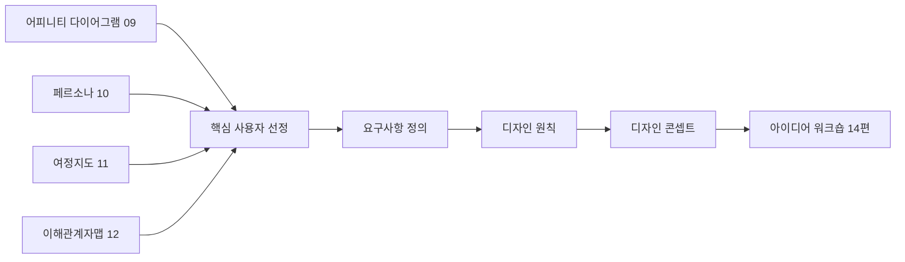
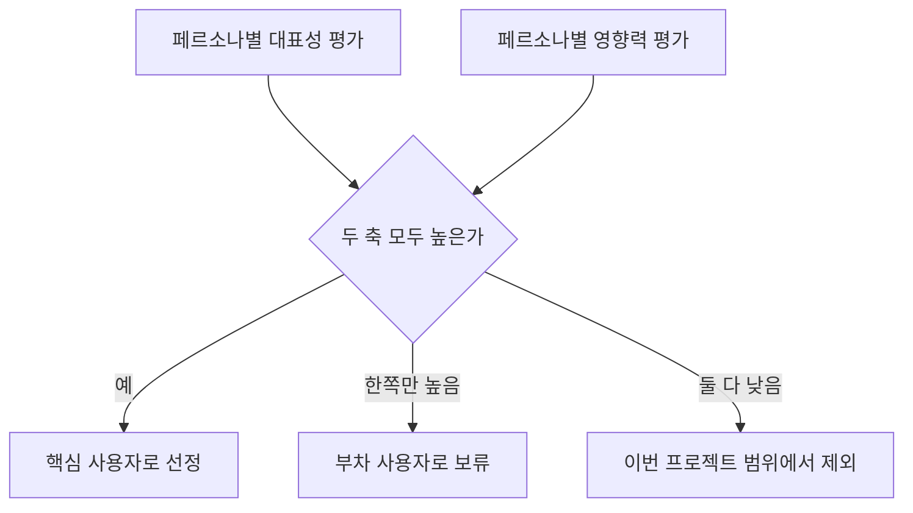

<Callout type="info">
  **이번 문서의 목표:** 여러 리서치 산출물 중 하나의 핵심 사용자를 근거를 들어 선정하고, 그 사용자를 위한 디자인 원칙과 디자인 콘셉트를 실기 답안 양식에 맞춰 서술할 수 있게 된다.
</Callout>

## 왜 지금 이 단계가 필요한가

09편의 어피니티 다이어그램, 10편의 페르소나, 11편의 고객 여정 지도, 12편의 이해관계자 맵까지 만들면 책상 위에는 산출물이 네 종류나 쌓입니다. 문제는 이 네 산출물이 **서로 다른 각도에서 같은 서비스를 바라본 조각**이라는 점입니다. 어피니티 다이어그램은 문제의 유형을, 페르소나는 사람을, 여정지도는 시간의 흐름을, 이해관계자맵은 관계를 보여줍니다. 이대로 아이디어 워크숍(14편)에 들어가면 참가자마다 서로 다른 조각을 붙잡고 이야기해 논의가 겉돕니다.

**핵심 사용자 정의와 디자인 콘셉트 도출**은 이 네 조각을 하나의 문장, 즉 "**누구를 위해, 어떤 상황에서, 무엇을 해결하는 서비스를 만들 것인가**"로 수렴시키는 단계입니다. 실기 출제기준의 13개 주요항목 중 **원칙수립**에 해당하며, 대상분석(10~12편)과 아이데이션(14~16편) 사이의 다리 역할을 합니다.

> **쉽게 말하면:** 지금까지 모은 조사 결과를 "그래서 결국 누구를, 어떻게 도울 것인가" 한 문장으로 좁히는 단계입니다.

이 편에서 다루는 네 산출물, 즉 **요구사항 정의서**, **핵심 사용자 선정 근거표**, **디자인 원칙표**, **디자인 콘셉트 제안서**는 실제 실기 시험에서 서술형 문제로 그대로 출제되는 형식입니다.

## 1. 서비스 요구사항 정의 — 문제해결 목표 수립

### 왜 필요한가

리서치 자료는 "사용자가 무엇을 겪고 있는가"를 보여주지만, "그래서 이 프로젝트가 무엇을 해결해야 하는가"는 저절로 나오지 않습니다. 요구사항 정의는 관찰된 현상을 **해결해야 할 문제 목표**로 바꾸는 작업입니다.

> **쉽게 말하면:** "사람들이 불편해한다"를 "이 서비스는 이 불편을 이렇게 줄인다"로 바꿔 쓰는 일입니다.

### 정의와 서술 구조

**요구사항 정의**(requirement definition)는 리서치에서 확인한 사용자 불편·기회를 **문제-원인-목표**의 3단 구조로 정리한 문장입니다. 09편 어피니티 다이어그램에서 묶인 문제 유형이 이 단계의 원재료입니다.

| 구성 요소 | 내용 | 예시 |
|-----------|------|------|
| 문제 | 관찰된 사용자의 불편·미충족 요구 | 저녁 준비 시간이 없어 배달·즉석식품에 의존한다 |
| 원인 | 그 문제가 발생하는 이유 | 퇴근 후 조리부터 시작하면 30분 이상 걸린다 |
| 목표 | 서비스가 달성해야 할 상태 | 퇴근 후 10분 안에 데우기만 하면 되는 식사를 준비할 수 있게 한다 |

### 서술 답안 예시 — 요구사항 정의서 양식

실기 답안에서는 아래와 같은 표 형식으로 요구사항을 정리하도록 요구합니다.

<Steps>

1. **문제 문장을 관찰 사실 그대로 적는다** — 해석이나 해결책을 섞지 않는다
2. **원인을 리서치 근거와 함께 한 줄로 밝힌다** — 근거 없는 추측 금지
3. **목표를 측정 가능한 상태 문장으로 바꾼다** — "편리하게 한다"가 아니라 "몇 분 안에 무엇을 할 수 있게 한다"
4. **우선순위를 매긴다** — 여정지도(11편)에서 감정곡선이 가장 낮았던 접점의 문제를 최우선에 둔다

</Steps>

**자주 틀리는 점:** 문제 문장에 해결책을 미리 넣는 실수가 많습니다. "반찬 정기구독이 필요하다"는 요구사항이 아니라 이미 아이디어입니다. 요구사항 단계에서는 "무엇이 해결되어야 하는가"만 쓰고, "어떻게 해결할까"는 다음 단계인 아이데이션(14편)으로 미룹니다.

## 2. 핵심 사용자 유형과 요구 분석

### 왜 하나를 골라야 하는가

10편에서 만든 페르소나가 서너 명이라면, 그 모두를 동시에 만족시키는 서비스는 결국 아무도 만족시키지 못하는 경우가 많습니다. 실기 답안과 실무 모두 **핵심 사용자**(primary user)를 먼저 정하고, 나머지는 부차 사용자로 남겨 우선순위를 분명히 하도록 요구합니다.

> **쉽게 말하면:** 여러 손님 중 이번 서비스가 가장 먼저 만족시켜야 할 손님 한 명을 고르는 일입니다.

### 선정 기준 — 영향력×대표성 매트릭스

두 축으로 페르소나를 평가합니다.

- **대표성**: 실제 목표 시장에서 이 페르소나와 비슷한 사람이 얼마나 많은가
- **영향력**: 이 페르소나의 문제를 해결했을 때 서비스 전체의 가치가 얼마나 커지는가

### 서술 답안 예시 — 핵심 사용자 선정 근거표

가상 서비스 **오늘의밥상**(1인 가구 대상 신선 반찬 정기구독 서비스)을 예로 들어 봅시다. 10편에서 아래 두 페르소나가 도출되었다고 가정합니다.

| 항목 | 페르소나 A — 자취 3년차 직장인 김도윤(28세) | 페르소나 B — 육아 중인 직장맘 이수진(35세) |
|------|------------------------------------------|------------------------------------------|
| 핵심 불편 | 퇴근 후 조리할 시간과 의지가 없다 | 아이 반찬과 본인 반찬을 따로 준비하기 벅차다 |
| 대표성 | 1인 가구 통계상 비중이 크다 | 맞벌이 가구 중 일부에 한정된다 |
| 영향력 | 배달 의존 문제를 정면으로 해결한다 | 반찬 구성이 복잡해져 서비스 난이도가 높아진다 |
| 판정 | **핵심 사용자로 선정** | 2차 확장 시 고려할 부차 사용자로 보류 |

**작성 순서:** 표를 채운 뒤, 마지막 줄에 반드시 **선정 이유를 서술형 한두 문장으로** 덧붙입니다. "페르소나 A는 대표성과 영향력이 모두 높고, 여정지도(11편)에서 확인한 감정곡선의 최저점(퇴근 직후 저녁 메뉴 결정 순간)과 직접 연결되므로 핵심 사용자로 선정한다"처럼 근거를 명시해야 채점자가 판단 과정을 확인할 수 있습니다.

**자주 틀리는 점:** 두 페르소나를 모두 "핵심 사용자"로 답안에 적는 경우가 많습니다. 핵심 사용자는 원칙적으로 하나(많아야 둘)로 좁혀야 이후 콘셉트가 흐려지지 않습니다.

## 3. 디자인 원칙 수립

### 왜 필요한가

아이디어 워크숍(14편)에서는 짧은 시간에 수십 개의 아이디어가 쏟아집니다. 그 자리에서 "이 아이디어를 채택할지 버릴지"를 매번 처음부터 논쟁하면 시간이 부족합니다. **디자인 원칙**(design principle)은 이런 판단을 빠르게 내리게 해주는 미리 합의된 기준입니다.

> **쉽게 말하면:** 나중에 의견이 갈릴 때마다 다시 꺼내 보는 "우리 프로젝트의 판단 기준" 목록입니다.

### 좋은 디자인 원칙의 조건

| 조건 | 설명 | 나쁜 예 | 좋은 예 |
|------|------|---------|---------|
| 구체성 | 무엇을 하고 무엇을 하지 않을지 판단 가능해야 함 | 사용자를 위한다 | 조리 단계는 데우기 1단계를 넘지 않는다 |
| 근거 연결 | 리서치 결과와 연결되어야 함 | 예쁘게 만든다 | 퇴근 직후 의사결정 피로를 줄인다(여정지도 근거) |
| 우선순위 제공 | 상충하는 두 가치 중 무엇을 먼저 둘지 알려줘야 함 | 다양하면서도 간단하게 | 다양성보다 간단함을 우선한다 |
| 검증 가능성 | 아이디어가 원칙을 지켰는지 확인 가능해야 함 | 혁신적이어야 한다 | 주문부터 수령까지 3단계를 넘지 않는다 |

**자주 틀리는 점:** "사용자 중심으로 설계한다", "혁신적인 경험을 제공한다"처럼 어느 프로젝트에나 붙일 수 있는 원칙은 채점에서 감점됩니다. 디자인 원칙은 **이 프로젝트만의** 구체적 기준이어야 합니다.

### 서술 답안 예시 — 디자인 원칙표

<Steps>

1. **요구사항 정의서에서 목표 문장을 가져온다**
2. **핵심 사용자의 가장 큰 불편 하나를 다시 확인한다**
3. **원칙을 "무엇을 우선하고 무엇을 포기하는가" 형태의 짧은 문장으로 쓴다**
4. **원칙마다 근거가 된 리서치 산출물(어느 편, 어떤 항목)을 괄호로 표시한다**

</Steps>

오늘의밥상 예시로 작성한 디자인 원칙표는 다음과 같습니다.

| 번호 | 디자인 원칙 | 근거 |
|------|-------------|------|
| 1 | 조리 과정은 데우기 한 단계를 넘지 않는다 | 요구사항 정의 — 퇴근 후 10분 안에 식사 가능해야 함 |
| 2 | 메뉴 선택은 매주 3개 이하로 제한한다 | 여정지도 — 저녁 메뉴 결정 순간의 피로도가 가장 높음 |
| 3 | 다양성보다 반복 구매의 간편함을 우선한다 | 페르소나 A — 매번 새로운 것보다 익숙한 루틴을 선호 |

## 4. 디자인 콘셉트 제안과 시각화

### 왜 필요한가

디자인 원칙이 판단 기준이라면, **디자인 콘셉트**(design concept)는 그 기준을 하나의 서비스 아이디어 방향으로 압축한 결과물입니다. 콘셉트가 명확해야 14편 워크숍에서 참가자들이 "무엇을 구체화할지" 같은 그림을 보게 됩니다.

> **쉽게 말하면:** 지금까지의 분석을 한 문장짜리 서비스 슬로건으로 압축하는 일입니다.

### 콘셉트 문장 만드는 공식

$$
\text{콘셉트} = [\text{핵심 사용자}] \text{가} [\text{상황}] \text{에서} [\text{핵심 가치}] \text{를 경험하도록}
$$

- 핵심 사용자: 2번 단계에서 선정한 그 사람
- 상황: 여정지도에서 확인한 가장 힘든 순간
- 핵심 가치: 디자인 원칙이 가리키는 방향

이 공식에 오늘의밥상 사례를 넣으면 다음과 같은 콘셉트 문장이 나옵니다.

> "퇴근 후 지친 1인 가구 직장인이, 저녁 메뉴를 고민하는 순간에, 고민 없이 데우기만 하면 되는 안심을 경험하도록"

### 시각화 — 콘셉트보드

서술만으로는 채점자와 이해관계자에게 이미지가 잘 전달되지 않으므로, 실기 답안에서는 콘셉트를 뒷받침하는 **콘셉트보드**(concept board) 구성 요소를 함께 서술하도록 요구하는 경우가 많습니다.

| 구성 요소 | 내용 |
|-----------|------|
| 콘셉트 문장 | 위 공식으로 만든 한 문장 |
| 핵심 장면 스케치 | 사용자가 서비스를 이용하는 대표 장면 1컷 |
| 핵심 가치 키워드 | 안심, 간편함, 루틴 같은 짧은 단어 3개 내외 |
| 차별점 | 기존 배달·즉석식품과 다른 지점 한 줄 |

### 서술 답안 예시 — 디자인 콘셉트 제안서 양식

<Steps>

1. **콘셉트 문장을 공식대로 완성한다**
2. **이 콘셉트가 디자인 원칙 각 항목을 어떻게 충족하는지 한 줄씩 대응시킨다**
3. **핵심 장면을 간단한 스케치 설명(글로 묘사)으로 덧붙인다**
4. **기존 대안(경쟁 서비스)과 다른 점을 한 문장으로 밝힌다**

</Steps>

**자주 틀리는 점:** 콘셉트 문장에 이미 구체적인 기능(앱 알림, 포인트 적립 등)을 넣는 경우가 있습니다. 콘셉트 단계는 아직 **방향**을 정하는 단계이고, 구체적 기능은 15편 아이디어 구체화에서 다룹니다. 방향과 기능을 섞으면 워크숍에서 오히려 발상의 폭이 좁아집니다.

## 직접 해보기 — 케이스로 채워보는 요구사항·원칙·콘셉트

가상 서비스 **오늘의밥상**을 계속 사용합니다. 아래 표를 채우는 연습을 통해 답안 작성 감각을 익힙니다.

| 단계 | 빈칸 |
|------|------|
| 문제 | 1인 가구가 ( )하지 못해 배달에 의존한다 |
| 목표 | 퇴근 후 ( )분 안에 식사를 준비할 수 있게 한다 |
| 핵심 사용자 | 대표성과 영향력이 모두 높은 페르소나 ( ) |
| 디자인 원칙 1 | 조리 과정은 ( ) 단계를 넘지 않는다 |
| 콘셉트 문장 | ( )가 ( )에서 ( )를 경험하도록 |

빈칸을 채운 뒤, 각 답이 어느 리서치 산출물(09~12편 중 어느 것)에서 나온 근거인지 괄호로 표시해 보면 실제 답안 채점 기준인 "근거 제시"까지 연습할 수 있습니다.

## 핵심 정리

- 요구사항 정의는 **문제-원인-목표** 3단 구조로 쓰며, 해결책을 미리 섞지 않는다.
- 핵심 사용자는 **대표성과 영향력**이 모두 높은 페르소나 하나로 좁히고, 선정 이유를 근거와 함께 서술한다.
- 디자인 원칙은 **구체성·근거 연결·우선순위 제공·검증 가능성**을 모두 갖춰야 하며, 만능 문구는 감점 대상이다.
- 디자인 콘셉트는 "[핵심 사용자]가 [상황]에서 [핵심 가치]를 경험하도록"의 공식으로 만들고, 구체적 기능은 아직 넣지 않는다.
- 이 편의 네 산출물(요구사항 정의서·핵심 사용자 선정 근거표·디자인 원칙표·디자인 콘셉트 제안서)은 14편 아이디어 워크숍의 출발점이 된다.

## 마무리 복습

<Quiz
  questionNumber={1}
  question="서비스 요구사항 정의 문장으로 가장 적절한 것은?"
  options={['1인 가구 대상 반찬 정기구독 서비스를 만든다', '퇴근 후 10분 안에 식사를 준비할 수 있게 한다', '앱에 반찬 사진을 예쁘게 보여준다', '경쟁사보다 저렴한 가격을 제시한다']}
  correctAnswer={2}
  explanation="요구사항 정의는 해결책이 아니라 달성해야 할 목표 상태를 문제-원인-목표 구조로 서술해야 한다. 반찬 정기구독은 이미 해결책이고, 나머지 둘은 목표가 아닌 부가 조건이다."
  optionExplanations={['정기구독이라는 해결책을 요구사항 단계에 앞당겨 적은 오류다.', '측정 가능한 목표 상태를 담고 있어 요구사항 정의로 적절하다.', '시각적 요소는 요구사항이 아니라 이후 단계의 세부 결정이다.', '가격 정책은 요구사항이 아니라 비즈니스 모델 단계에서 다룬다.']}
/>

<Quiz
  questionNumber={2}
  question="핵심 사용자 선정 기준으로 사용하는 두 축으로 옳은 것은?"
  options={['나이와 소득', '대표성과 영향력', '친숙함과 호감도', '방문 빈도와 체류 시간']}
  correctAnswer={2}
  explanation="핵심 사용자는 목표 시장에서 비슷한 사람이 얼마나 많은지를 뜻하는 대표성과, 문제 해결 시 서비스 가치가 얼마나 커지는지를 뜻하는 영향력, 두 축으로 평가한다."
  optionExplanations={['인구통계 항목만으로는 서비스 가치와의 연결을 판단할 수 없다.', '대표성과 영향력이 모두 높은 페르소나를 핵심 사용자로 선정한다.', '호감도는 선정 기준으로 사용되지 않는다.', '방문 빈도·체류 시간은 다른 산출물에서 다루는 지표다.']}
/>

<Quiz
  questionNumber={3}
  question="다음 중 디자인 원칙으로 가장 부적절한 것은?"
  options={['조리 과정은 데우기 한 단계를 넘지 않는다', '메뉴 선택은 매주 3개 이하로 제한한다', '사용자 중심으로 혁신적인 경험을 제공한다', '다양성보다 반복 구매의 간편함을 우선한다']}
  correctAnswer={3}
  explanation="사용자 중심, 혁신적 경험 같은 문구는 구체성과 검증 가능성이 없어 어느 프로젝트에나 붙일 수 있는 만능 문구이므로 디자인 원칙으로 부적절하다. 나머지는 구체적 행동 기준과 우선순위를 제시한다."
  optionExplanations={['조리 단계 수라는 구체적 기준을 제시하므로 적절하다.', '선택지 개수라는 검증 가능한 기준을 제시하므로 적절하다.', '구체성과 우선순위가 없어 판단 기준으로 기능하지 못한다.', '두 가치 중 하나를 우선한다는 명확한 판단 기준을 제시한다.']}
/>

<Quiz
  questionNumber={4}
  question="디자인 콘셉트 문장을 만드는 공식에 들어가지 않는 요소는?"
  options={['핵심 사용자', '상황', '핵심 가치', '구체적 기능 목록']}
  correctAnswer={4}
  explanation="콘셉트 문장은 핵심 사용자·상황·핵심 가치 세 요소로 방향을 압축하는 단계이며, 구체적 기능은 아직 넣지 않는다. 기능은 아이디어 구체화 단계에서 다룬다."
  optionExplanations={['콘셉트 공식의 첫 요소다.', '여정지도에서 확인한 가장 힘든 순간을 가리킨다.', '디자인 원칙이 가리키는 방향을 담는 요소다.', '방향이 아닌 세부 실행이므로 콘셉트 단계에서는 넣지 않는다.']}
/>

<Quiz
  questionNumber={5}
  question="핵심 사용자 선정 근거표 작성 시 반드시 포함해야 할 항목은?"
  options={['페르소나의 취미 목록', '선정 이유를 근거와 함께 밝힌 서술', '페르소나의 이름 글자 수', '경쟁사 로고 이미지']}
  correctAnswer={2}
  explanation="근거표는 대표성·영향력 평가 결과만으로 끝나지 않고, 왜 그 페르소나를 선정했는지 리서치 산출물과 연결한 서술형 근거를 반드시 덧붙여야 채점자가 판단 과정을 확인할 수 있다."
  optionExplanations={['취미는 선정 판단과 직접 관련이 없다.', '근거를 명시한 서술이 채점 기준의 핵심이다.', '이름 글자 수는 아무 의미가 없는 항목이다.', '경쟁사 로고는 이 산출물의 목적과 무관하다.']}
/>

<Quiz
  questionNumber={6}
  question="요구사항 정의의 문제-원인-목표 구조에서 원인에 해당하는 서술로 옳은 것은?"
  options={['퇴근 후 조리할 시간과 의지가 없다', '퇴근 후 조리부터 시작하면 30분 이상 걸린다', '10분 안에 식사를 준비할 수 있게 한다', '반찬 정기구독 서비스를 제공한다']}
  correctAnswer={2}
  explanation="원인은 문제가 발생하는 이유를 구체적으로 밝히는 문장이다. 조리에 30분 이상 걸린다는 사실이 시간 부족 문제의 직접적인 원인이다."
  optionExplanations={['이것은 원인이 아니라 문제 자체에 해당하는 서술이다.', '문제가 발생하는 구체적 이유를 밝히므로 원인에 해당한다.', '이것은 목표 문장이며 원인이 아니다.', '이것은 해결책이며 요구사항 정의 어느 항목에도 해당하지 않는다.']}
/>

## 참고 자료

- [한국산업인력공단(브런치 경유 원문) - 서비스·경험디자인 기사 출제기준(필기·실기)](https://t1.daumcdn.net/brunch/service/user/13ur/file/tayw3sSk4ib3un2lLq5U249xKUg.pdf)
