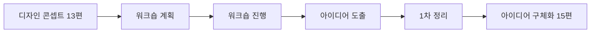

<Callout type="info">
  **이번 문서의 목표:** 디자인 콘셉트를 실제 아이디어로 확장하는 워크숍을 기획서 양식에 맞춰 서술하고, 퍼실리테이션 기법을 상황에 맞게 선택하며, 워크숍 결과를 정리된 아이디어 목록으로 완성할 수 있게 된다.
</Callout>

## 왜 지금 워크숍이 필요한가

13편에서 만든 디자인 콘셉트는 아직 방향일 뿐입니다. "퇴근 후 지친 직장인이 고민 없이 데우기만 하면 되는 안심을 경험하도록"이라는 문장 하나로는 실제로 어떤 서비스 요소를 만들지 알 수 없습니다. 이 방향을 **구체적인 아이디어 여러 개**로 펼치는 작업이 필요한데, 혼자 생각하는 것보다 다양한 사람의 관점을 모을 때 더 풍부한 아이디어가 나옵니다.

**아이디어 워크숍**(ideation workshop)은 디자이너뿐 아니라 12편에서 정리한 이해관계자, 그리고 필요하면 실제 사용자까지 한자리에 모아 짧은 시간 안에 많은 아이디어를 만들어내는 구조화된 회의입니다. 실기 출제기준의 **아이데이션** 항목 중 첫 번째 세부항목이며, 여기서 만든 아이디어를 15편에서 구체화하고 평가합니다.

> **쉽게 말하면:** 콘셉트라는 방향에 여러 사람의 머리를 모아 실제로 걸어갈 수 있는 여러 갈래 길을 만드는 자리입니다.

## 1. 아이디어 워크숍 계획 — 누구를, 어떻게 모을 것인가

### 왜 필요한가

준비 없이 사람만 모으면 회의는 산만해지고 시간만 흐릅니다. 워크숍도 하나의 산출물처럼 **목적, 참여자, 순서, 규칙**을 미리 설계해야 합니다.

> **쉽게 말하면:** 워크숍은 즉흥 회의가 아니라 미리 짜인 진행표가 있는 하나의 이벤트입니다.

### 참여자 구성

12편의 이해관계자 맵에서 확인한 인물 중 이 서비스에 직접 영향을 주고받는 사람들을 고릅니다.

| 참여자 유형 | 역할 | 오늘의밥상 예시 |
|-------------|------|------------------|
| 핵심 사용자 대표 | 실제 불편을 대변 | 자취 3년차 직장인 |
| 서비스 제공 측 실무자 | 실현 가능성 검토 | 조리·물류 담당자 |
| 의사결정권자 | 예산·범위 승인 | 서비스 기획 책임자 |
| 외부 전문가(선택) | 새로운 관점 투입 | 영양사, 배송 전문가 |

**자주 틀리는 점:** 디자이너와 기획자끼리만 워크숍을 진행하는 경우가 많습니다. 실무자와 의사결정권자가 빠지면 나온 아이디어가 나중에 "현실적으로 불가능하다"는 이유로 전부 폐기될 위험이 큽니다. 처음부터 실현 가능성을 판단할 수 있는 사람을 포함해야 합니다.

### 서술 답안 예시 — 워크숍 기획서 양식

<Steps>

1. **워크숍 목적을 한 문장으로 쓴다** — 예: 오늘의밥상 콘셉트를 구체적 서비스 요소 10개 이상으로 확장한다
2. **참여자 명단과 역할을 표로 정리한다**
3. **진행 순서를 시간 단위로 배치한다** — 아이스브레이킹, 콘셉트 리마인드, 브레인스토밍, 아이디어 정리
4. **각 단계에서 사용할 기법을 명시한다** — 브레인스토밍, 브레인라이팅, HMW(How Might We) 질문법 등
5. **필요한 준비물을 나열한다** — 포스트잇, 화이트보드, 타이머

</Steps>

| 시간 | 순서 | 기법 | 진행자 역할 |
|------|------|------|--------------|
| 0–10분 | 아이스브레이킹 | 간단한 자기소개 게임 | 긴장 완화, 발언 문턱 낮추기 |
| 10–20분 | 콘셉트 공유 | 13편 콘셉트보드 발표 | 목표 정렬 |
| 20–50분 | 아이디어 발산 | 브레인스토밍·HMW 질문법 | 발언 촉진, 비판 차단 |
| 50–70분 | 아이디어 수렴 | 스티커 투표 | 우선순위 1차 정리 |
| 70–80분 | 마무리 | 다음 단계(15편) 안내 | 회고와 감사 인사 |

## 2. 퍼실리테이션 기술과 진행자 준비

### 왜 필요한가

같은 워크숍 진행표라도 진행자에 따라 결과가 완전히 달라집니다. **퍼실리테이션**(facilitation)은 회의를 원활하게 이끌어 참여자 모두의 생각을 끌어내는 기술입니다. 진행자 자신이 아이디어를 내는 사람이 아니라, **다른 사람들이 아이디어를 잘 내도록 돕는 사람**이라는 점이 핵심입니다.

> **쉽게 말하면:** 퍼실리테이터는 답을 주는 사람이 아니라 모두가 답을 잘 꺼낼 수 있게 판을 짜는 사람입니다.

### HMW(How Might We) 질문법

요구사항 정의(13편)의 목표 문장을 그대로 던지면 참여자가 막막해합니다. **HMW 질문법**은 목표를 "우리는 어떻게 하면 ~할 수 있을까"라는 열린 질문으로 바꿔 발상을 유도하는 기법입니다.

$$
\text{HMW 질문} = \text{"우리는 어떻게 하면"} + [\text{요구사항 목표}] + \text{"할 수 있을까?"}
$$

예를 들어 요구사항 정의서의 목표가 "퇴근 후 10분 안에 식사를 준비할 수 있게 한다"라면, HMW 질문은 "**우리는 어떻게 하면** 퇴근 후 10분 안에 만족스러운 저녁을 차릴 수 있을까?"가 됩니다. 질문이 열려 있을수록(너무 좁지도, 너무 넓지도 않게) 다양한 답이 나옵니다.

| HMW 질문의 문제 | 예시 | 결과 |
|------------------|------|------|
| 너무 좁음 | 어떻게 하면 반찬을 냉장고에 더 빨리 넣을 수 있을까 | 아이디어가 포장 방식에만 갇힘 |
| 적절함 | 어떻게 하면 퇴근 직후 저녁 고민을 없앨 수 있을까 | 메뉴·배송·알림 등 다양한 아이디어 등장 |
| 너무 넓음 | 어떻게 하면 사람들을 더 행복하게 만들 수 있을까 | 서비스와 무관한 답이 쏟아짐 |

### 진행자가 지켜야 할 규칙

<Steps>

1. **비판 유예** — 발산 단계에서는 어떤 아이디어도 그 자리에서 부정하지 않는다
2. **양을 우선** — 질보다 개수를 먼저 채운다. 아이디어가 많아야 좋은 것이 섞여 나온다
3. **결합과 확장 장려** — 다른 사람의 아이디어에 덧붙이는 발언을 적극 유도한다
4. **침묵하는 참여자에게 순서를 돌린다** — 목소리 큰 사람에게 발언이 몰리지 않도록 라운드로빈 방식을 섞는다

</Steps>

**자주 틀리는 점:** 진행자가 "그건 예산상 어렵겠는데요"처럼 발산 단계에서 실현 가능성을 바로 지적하는 경우가 많습니다. 실현 가능성 판단은 15편의 평가 단계로 미뤄야 하며, 발산 단계에서 비판이 나오면 참여자들이 입을 닫습니다.

## 3. 워크숍을 통한 서비스 아이디어 도출

### 브레인스토밍과 브레인라이팅

| 기법 | 방식 | 장점 | 단점 |
|------|------|------|------|
| 브레인스토밍 | 말로 자유롭게 발언하며 기록 | 즉흥적 결합이 활발함 | 목소리 큰 사람이 주도하기 쉬움 |
| 브레인라이팅 | 각자 포스트잇에 조용히 적은 뒤 공유 | 내향적 참여자도 균등하게 참여 | 즉흥적 상호작용이 줄어듦 |

두 기법을 순서대로 섞으면 단점을 서로 보완할 수 있습니다. 먼저 브레인라이팅으로 개인 아이디어를 모두 꺼내게 한 뒤, 그 포스트잇을 벽에 붙이고 브레인스토밍으로 서로 결합·확장하는 방식이 실기 답안에서도 자주 언급되는 순서입니다.

### 서술 답안 예시 — 아이디어 도출 결과 정리표

워크숍이 끝나면 흩어진 포스트잇을 그대로 제출하지 않고, 아래처럼 유형별로 정리합니다.

| 유형 | 아이디어 | 관련 디자인 원칙 |
|------|----------|-------------------|
| 메뉴 구성 | 매주 3개 메뉴 중 택1, 매번 같은 메뉴 반복 선택 가능 | 다양성보다 간편함 우선 |
| 조리 방식 | 전자레인지 데우기 전용 포장 | 조리 한 단계 원칙 |
| 알림 방식 | 배송 전날 저녁 메뉴 알림 문자 | 의사결정 피로 감소 |
| 구독 관리 | 한 주 건너뛰기 버튼 | 유연한 구독 유지 |

**작성 순서:** 아이디어를 그대로 나열하지 않고, 반드시 **13편에서 세운 디자인 원칙과 연결**해 정리합니다. 원칙과 연결되지 않는 아이디어는 방향이 어긋났을 가능성이 크므로 따로 표시해 15편 평가 단계에서 재검토합니다.

## 4. 아이디어 평가와 결과 정리

### 왜 이 단계에서 가볍게만 평가하는가

본격적인 평가와 우선순위 매기기는 15편의 몫이지만, 워크숍 자리에서도 참여자들이 스스로 어떤 아이디어에 공감하는지 확인하는 **1차 필터링**이 필요합니다. 그래야 다음 단계로 넘길 아이디어의 수를 관리 가능한 수준으로 좁힐 수 있습니다.

> **쉽게 말하면:** 워크숍장을 떠나기 전에 "오늘 나온 것 중 무엇이 유망해 보이는가"만 가볍게 표시해두는 일입니다.

### 스티커 투표

참여자마다 스티커(또는 점) 서너 개를 나눠주고, 마음에 드는 아이디어에 붙이게 하는 간단한 방법입니다. 스티커 수가 많은 순으로 정렬하면 별도의 복잡한 계산 없이도 참여자들의 공감대를 눈으로 확인할 수 있습니다.

### 서술 답안 예시 — 워크숍 결과 보고서 마무리 문단

<Steps>

1. **워크숍 개요를 요약한다** — 일시, 참여자 수와 구성, 사용한 기법
2. **도출된 아이디어 총 개수와 유형별 분포를 서술한다**
3. **스티커 투표 상위 아이디어 3~5개를 근거와 함께 나열한다**
4. **다음 단계(15편 구체화·평가)에서 다룰 아이디어 범위를 명시한다**

</Steps>

**자주 틀리는 점:** 워크숍 결과 보고서에 나온 아이디어를 전부 같은 비중으로 나열하는 경우가 많습니다. 실기 답안은 "무엇이 유망했고 왜인지"까지 서술해야 완성도를 인정받습니다. 단순 목록 나열은 정리이지 결과 보고가 아닙니다.

## 핵심 정리

- 워크숍은 즉흥 회의가 아니라 **목적·참여자·순서·기법**을 미리 설계한 이벤트로 기획서 형태로 서술한다.
- 참여자는 사용자 대표뿐 아니라 **실무자·의사결정권자**까지 포함해야 아이디어가 나중에 폐기되지 않는다.
- HMW 질문법은 요구사항 목표를 열린 질문으로 바꿔 발상을 유도하며, 너무 좁거나 넓지 않게 설계해야 한다.
- 발산 단계에서는 **비판 유예·양 우선**을 지키고, 실현 가능성 판단은 다음 단계로 미룬다.
- 브레인라이팅으로 개인 아이디어를 모은 뒤 브레인스토밍으로 결합하면 서로의 단점을 보완한다.
- 워크숍 결과는 **디자인 원칙과 연결한 유형별 정리표**와 스티커 투표 근거를 담은 결과 보고서로 마무리한다.

## 마무리 복습

<Quiz
  questionNumber={1}
  question="아이디어 워크숍 참여자 구성으로 가장 바람직한 것은?"
  options={['디자이너와 기획자로만 구성한다', '사용자 대표·실무자·의사결정권자를 함께 포함한다', '외부 전문가만 초청한다', '의사결정권자는 배제하고 실무자만 참여시킨다']}
  correctAnswer={2}
  explanation="실무자와 의사결정권자가 빠지면 나온 아이디어가 실현 가능성 문제로 나중에 전부 폐기될 위험이 크므로, 사용자 대표와 실무자, 의사결정권자를 함께 포함해야 한다."
  optionExplanations={['실무자와 의사결정권자가 빠져 실현 가능성 검토가 늦어진다.', '세 유형을 모두 포함해야 아이디어가 이후 단계에서 폐기되지 않는다.', '사용자의 실제 불편이 반영되지 않을 위험이 크다.', '예산과 범위를 승인할 사람이 없으면 아이디어가 채택되기 어렵다.']}
/>

<Quiz
  questionNumber={2}
  question="HMW(How Might We) 질문으로 가장 적절한 것은?"
  options={['어떻게 하면 사람들을 더 행복하게 만들 수 있을까', '어떻게 하면 반찬을 냉장고에 더 빨리 넣을 수 있을까', '어떻게 하면 퇴근 직후 저녁 고민을 없앨 수 있을까', '반찬 정기구독 서비스를 만들어야 한다']}
  correctAnswer={3}
  explanation="적절한 HMW 질문은 너무 좁지도 넓지도 않아야 한다. 저녁 고민을 없앤다는 질문은 메뉴·배송·알림 등 다양한 아이디어를 유도할 만큼 열려 있으면서도 목표와 직접 연결된다."
  optionExplanations={['범위가 너무 넓어 서비스와 무관한 답까지 나올 수 있다.', '범위가 너무 좁아 포장 방식 외의 아이디어가 나오기 어렵다.', '목표와 직접 연결되면서도 다양한 발상을 유도할 만큼 열려 있다.', '이것은 질문이 아니라 이미 정해진 해결책 문장이다.']}
/>

<Quiz
  questionNumber={3}
  question="브레인스토밍과 브레인라이팅에 대한 설명으로 옳은 것은?"
  options={['브레인라이팅은 말로 자유롭게 발언하는 방식이다', '브레인스토밍은 내향적 참여자의 균등한 참여를 보장한다', '브레인라이팅은 각자 조용히 적은 뒤 공유해 균등한 참여를 유도한다', '두 기법은 함께 사용할 수 없다']}
  correctAnswer={3}
  explanation="브레인라이팅은 참여자가 각자 포스트잇에 조용히 아이디어를 적은 뒤 공유하는 방식으로, 목소리 큰 사람이 주도하는 문제를 줄이고 균등한 참여를 유도한다."
  optionExplanations={['말로 자유롭게 발언하는 것은 브레인스토밍의 방식이다.', '브레인스토밍은 오히려 목소리 큰 사람이 주도하기 쉬운 방식이다.', '조용히 적은 뒤 공유하므로 균등한 참여를 유도하는 방식이 맞다.', '브레인라이팅으로 개인 아이디어를 모은 뒤 브레인스토밍으로 결합하는 방식이 흔히 쓰인다.']}
/>

<Quiz
  questionNumber={4}
  question="퍼실리테이터가 발산 단계에서 지켜야 할 태도로 가장 적절한 것은?"
  options={['실현 가능성이 낮아 보이는 아이디어를 그 자리에서 지적한다', '목소리 큰 참여자의 발언 기회를 늘려 효율을 높인다', '어떤 아이디어도 그 자리에서 비판하지 않고 양을 우선한다', '진행자 스스로 가장 좋은 아이디어를 제시해 방향을 잡는다']}
  correctAnswer={3}
  explanation="발산 단계에서는 비판을 유예하고 질보다 양을 우선해야 다양한 아이디어와 결합이 활발히 일어난다. 실현 가능성 판단은 다음 평가 단계로 미룬다."
  optionExplanations={['발산 단계에서 비판이 나오면 참여자들이 입을 닫는다.', '목소리 큰 사람에게 발언이 몰리지 않도록 순서를 고르게 돌려야 한다.', '비판 유예와 양 우선이 발산 단계의 핵심 원칙이다.', '퍼실리테이터는 답을 주는 사람이 아니라 참여자가 답을 꺼내도록 돕는 사람이다.']}
/>

<Quiz
  questionNumber={5}
  question="워크숍에서 나온 아이디어를 정리할 때 반드시 함께 연결해야 하는 산출물은?"
  options={['이해관계자 맵의 인물 사진', '13편에서 세운 디자인 원칙', '경쟁사의 가격표', '참여자의 근무 부서명']}
  correctAnswer={2}
  explanation="아이디어를 디자인 원칙과 연결해 정리해야 방향이 어긋난 아이디어를 식별할 수 있고, 이후 15편의 평가 단계에서 근거를 가지고 우선순위를 매길 수 있다."
  optionExplanations={['인물 사진은 아이디어 정리와 직접 관련이 없다.', '디자인 원칙과 연결해야 방향이 어긋난 아이디어를 가려낼 수 있다.', '가격표는 이 단계의 정리 기준이 아니다.', '부서명은 아이디어의 방향성 판단과 무관하다.']}
/>

<Quiz
  questionNumber={6}
  question="워크숍 결과 보고서 작성에서 자주 지적되는 부족한 점은?"
  options={['워크숍 일시와 참여자 구성을 생략한 것', '나온 아이디어를 근거 없이 동일한 비중으로 나열만 한 것', '다음 단계에서 다룰 범위를 명시한 것', '스티커 투표 상위 아이디어를 근거와 함께 제시한 것']}
  correctAnswer={2}
  explanation="워크숍 결과 보고서는 단순히 아이디어를 나열하는 데 그치지 않고 무엇이 유망했고 왜인지까지 서술해야 완성도를 인정받는다. 근거 없는 나열은 정리에 불과하다."
  optionExplanations={['개요 생략은 지적되는 문제이지만 가장 흔한 부족한 점은 근거 없는 나열이다.', '근거 없이 나열만 하면 무엇이 유망한지 알 수 없어 보고서로서 미흡하다.', '이 항목은 잘 작성된 보고서의 요건이지 부족한 점이 아니다.', '이 항목 역시 잘 작성된 보고서의 요건이다.']}
/>

## 참고 자료

- [한국산업인력공단(브런치 경유 원문) - 서비스·경험디자인 기사 출제기준(필기·실기)](https://t1.daumcdn.net/brunch/service/user/13ur/file/tayw3sSk4ib3un2lLq5U249xKUg.pdf)
