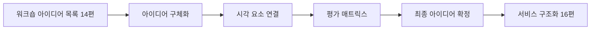
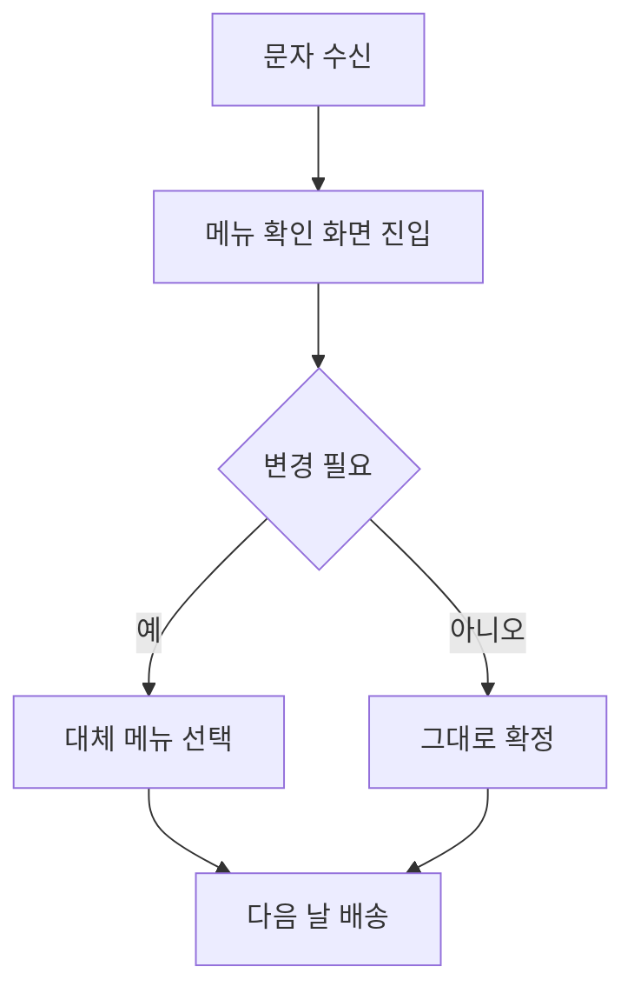
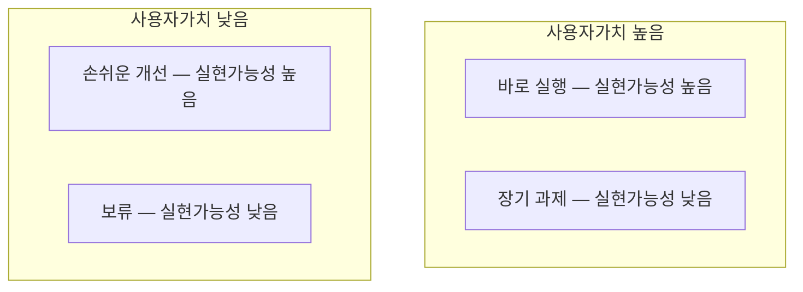

<Callout type="info">
  **이번 문서의 목표:** 워크숍에서 나온 여러 아이디어를 아이디어 설명 카드로 구체화하고, 실현가능성과 사용자 가치 두 축으로 평가해 근거를 갖춘 최종 아이디어 확정 답안을 작성할 수 있게 된다.
</Callout>

## 왜 지금 구체화와 평가가 필요한가

14편 워크숍이 끝나면 손에는 아이디어 목록이 여러 개 남습니다. 하지만 "전자레인지 데우기 전용 포장"이나 "한 주 건너뛰기 버튼" 같은 짧은 문구만으로는 이 아이디어가 정확히 무엇을 뜻하는지, 실제로 만들 수 있는지 판단하기 어렵습니다. **아이디어 구체화**(idea elaboration)는 짧은 문구를 "누가, 언제, 무엇을, 왜"까지 담은 설명으로 부풀리는 작업이고, **아이디어 평가**(idea evaluation)는 그렇게 부풀린 아이디어 중 실제로 진행할 것을 근거를 갖춰 골라내는 작업입니다.

이 편은 실기 출제기준 **아이데이션** 항목의 두 번째 세부항목에 해당하며, 여기서 확정한 아이디어가 16편 서비스 구조화와 17편 프로토타입 기획의 재료가 됩니다.

> **쉽게 말하면:** 워크숍에서 나온 한 줄짜리 아이디어를 자세히 설명한 뒤, 그중 진짜로 만들 것을 골라내는 단계입니다.

## 1. 핵심 가치·디자인 원칙 기반 아이디어 설명

### 왜 필요한가

같은 아이디어라도 어떤 디자인 원칙을 근거로 삼았는지 설명하지 않으면, 나중에 평가할 때 "이게 왜 필요한 아이디어였는지" 기억이 흐려집니다. 아이디어 하나하나를 13편에서 세운 디자인 원칙과 다시 연결해 설명해야 합니다.

> **쉽게 말하면:** "이 아이디어가 왜 우리 원칙에 맞는가"를 한 번 더 짚어주는 일입니다.

### 서술 답안 예시 — 아이디어 설명 카드

<Steps>

1. **아이디어 이름을 짧고 명확하게 붙인다**
2. **이 아이디어가 해결하는 상황을 한 문장으로 쓴다** — 여정지도(11편)의 어느 접점인지 명시
3. **관련 디자인 원칙을 밝힌다**
4. **작동 방식을 3~4단계로 서술한다**

</Steps>

오늘의밥상 사례에서 "배송 전날 저녁 메뉴 알림 문자" 아이디어를 카드로 만들면 다음과 같습니다.

| 항목 | 내용 |
|------|------|
| 아이디어 이름 | 저녁 메뉴 사전 알림 |
| 해결하는 상황 | 여정지도 접점 3 — 퇴근 직후 저녁 메뉴 결정 순간의 피로 |
| 관련 디자인 원칙 | 메뉴 선택은 매주 3개 이하로 제한한다 |
| 작동 방식 | 배송 전날 오후 문자 발송 → 다음 날 도착 메뉴 안내 → 조리법 한 줄 첨부 → 필요 시 변경 링크 제공 |

**자주 틀리는 점:** 아이디어 이름만 적고 작동 방식을 생략하는 경우가 많습니다. 실기 채점자는 "이 아이디어가 실제로 어떻게 작동하는지" 문장으로 확인해야 하므로, 최소 3단계 이상의 흐름을 서술해야 합니다.

## 2. 아이디어를 구체적인 시각 요소로 연결하기

### 왜 필요한가

문장만으로는 아이디어의 경험이 잘 그려지지 않습니다. **시각 요소**(visual element)로 연결하면 이해관계자와 채점자 모두 아이디어를 빠르게 이해할 수 있습니다. 실기 실제 시험에서도 서술과 함께 간단한 스케치나 화면 배치를 그리도록 요구하는 문항이 나옵니다.

> **쉽게 말하면:** 말로 설명한 것을 그림 한 장으로 다시 보여주는 일입니다.

### 시각화 방법의 선택

| 아이디어 성격 | 적합한 시각화 |
|----------------|------------------|
| 화면·앱 기능 | 저충실도 와이어프레임(네모 상자와 텍스트 배치) |
| 물리적 제품·포장 | 손그림 스케치와 치수 메모 |
| 서비스 흐름·절차 | 순서도(플로 다이어그램) |
| 공간·환경 | 평면도나 동선 화살표 |

### 서술 답안 예시 — 시각 요소 설명 문단

시각 자료를 그린 뒤에는 반드시 아래처럼 **그림이 전달하지 못하는 맥락**을 문장으로 보충합니다.

**설명 문단 예시:** "위 순서도는 저녁 메뉴 사전 알림 아이디어의 사용자 흐름을 나타낸다. 문자를 받은 사용자는 메뉴 확인 화면에서 변경 여부만 선택하면 되므로, 디자인 원칙에서 정한 '조리 과정은 데우기 한 단계를 넘지 않는다'는 기준과 별개로 '의사결정 단계도 한 번을 넘지 않는다'는 기준을 함께 만족한다."

**자주 틀리는 점:** 시각 자료만 그리고 설명 문단을 생략하는 경우가 있습니다. 실기는 필답형이므로 그림이 정답을 대신하지 않으며, 그림과 서술이 함께 있어야 완전한 답안입니다.

## 3. 우선순위·타당성 기준으로 아이디어 평가하기

### 왜 두 축으로 평가하는가

아이디어가 많을수록 "다 좋아 보인다"는 함정에 빠지기 쉽습니다. 객관적인 기준 없이 감으로 고르면 나중에 이해관계자에게 선정 이유를 설명하기 어렵습니다. **평가 매트릭스**는 아이디어를 두 축 위에 놓아 한눈에 비교하게 해주는 도구입니다.

> **쉽게 말하면:** 아이디어를 좌표 위에 점으로 찍어서 어느 것을 먼저 할지 눈으로 확인하는 방법입니다.

### 실현가능성×사용자 가치 매트릭스

- **실현가능성**(feasibility): 현재 기술·인력·예산으로 만들 수 있는 정도
- **사용자 가치**(user value): 핵심 사용자의 요구사항 목표(13편)를 얼마나 크게 충족하는가

| 사분면 | 의미 | 처리 방침 |
|--------|------|-----------|
| 사용자 가치 높음 · 실현가능성 높음 | 바로 실행 | 최우선으로 확정, 다음 편 구조화 대상 |
| 사용자 가치 높음 · 실현가능성 낮음 | 장기 과제 | 기술·예산 확보 후 재검토 |
| 사용자 가치 낮음 · 실현가능성 높음 | 손쉬운 개선 | 여유가 있을 때 추가 |
| 사용자 가치 낮음 · 실현가능성 낮음 | 보류 | 이번 프로젝트에서 제외 |

### 서술 답안 예시 — 평가 매트릭스 표

| 아이디어 | 사용자 가치 | 실현가능성 | 사분면 | 판정 |
|----------|-------------|------------|--------|------|
| 저녁 메뉴 사전 알림 | 높음 | 높음 | 바로 실행 | 최종 확정 |
| 전자레인지 데우기 전용 포장 | 높음 | 높음 | 바로 실행 | 최종 확정 |
| 한 주 건너뛰기 버튼 | 중간 | 높음 | 손쉬운 개선 | 2차 반영 |
| 개인 맞춤 영양 분석 리포트 | 높음 | 낮음 | 장기 과제 | 보류 후 재검토 |

**작성 순서:** 표만 채우고 끝내지 않고, 각 판정 옆에 **근거를 한 줄씩** 덧붙입니다. 예: "개인 맞춤 영양 분석 리포트는 사용자 가치는 높지만 영양 데이터베이스 구축에 시간이 걸려 이번 단계에서는 보류한다." 근거 없는 사분면 배치는 감으로 매긴 것과 다르지 않다는 지적을 받습니다.

**자주 틀리는 점:** 평가 매트릭스에 아이디어를 배치할 때 워크숍 참여자 다수의 선호(14편 스티커 투표 결과)만 반영하고 실현가능성 검토를 생략하는 경우가 많습니다. 스티커 투표는 참고 자료일 뿐, 최종 판정은 반드시 실현가능성까지 함께 고려해야 합니다.

## 4. 최종 아이디어 확정

### 왜 필요한가

평가 매트릭스로 사분면을 나눴다면, 이제 "이번 프로젝트에서 실제로 진행할 아이디어"를 명확한 목록으로 확정해야 합니다. 확정하지 않고 넘어가면 16편 서비스 구조화 단계에서 다시 범위를 두고 논쟁하게 됩니다.

> **쉽게 말하면:** 여러 후보 중 이번에 실제로 만들 것만 최종 명단으로 정리하는 일입니다.

### 서술 답안 예시 — 최종 아이디어 확정 문단

<Steps>

1. **바로 실행 사분면의 아이디어를 최종 목록으로 옮긴다**
2. **각 아이디어가 어떤 디자인 원칙과 요구사항을 충족하는지 한 번 더 요약한다**
3. **장기 과제·보류 항목은 삭제하지 않고 별도 표로 남겨 사후관리(24편)에서 참고할 수 있게 한다**
4. **확정된 아이디어 전체가 13편 디자인 콘셉트와 상충하지 않는지 마지막으로 검토한다**

</Steps>

**최종 확정 문단 예시:** "이번 프로젝트에서는 저녁 메뉴 사전 알림과 전자레인지 데우기 전용 포장 두 아이디어를 최종 확정한다. 두 아이디어 모두 사용자 가치와 실현가능성이 모두 높고, 디자인 원칙 1(조리 한 단계)과 2(메뉴 선택 3개 이하)를 각각 충족한다. 한 주 건너뛰기 버튼은 2차 반영 과제로, 개인 맞춤 영양 분석 리포트는 장기 과제로 별도 관리한다."

**자주 틀리는 점:** 확정 문단 없이 매트릭스 표만 제출하고 끝내는 경우가 많습니다. 실기 답안은 표와 서술 두 가지 형식이 모두 요구되므로, 표 다음에는 반드시 확정 근거를 문장으로 정리해야 합니다.

## 핵심 정리

- 아이디어 구체화는 짧은 문구를 **누가·언제·무엇을·왜·어떻게**까지 담은 설명 카드로 부풀리는 작업이다.
- 시각 요소는 아이디어 성격(화면·제품·흐름·공간)에 맞춰 고르고, 그림만으로 끝내지 않고 맥락을 설명하는 문단을 함께 쓴다.
- 평가는 **사용자 가치**와 **실현가능성** 두 축의 매트릭스로 하며, 각 판정에는 반드시 근거를 한 줄씩 붙인다.
- 워크숍의 스티커 투표 결과는 참고 자료일 뿐, 최종 판정에는 실현가능성 검토가 반드시 포함되어야 한다.
- 최종 확정 단계에서는 실행 목록뿐 아니라 보류·장기 과제 목록도 별도로 남겨 이후 편에서 참고하게 한다.
- 확정된 아이디어 전체가 13편의 디자인 콘셉트와 상충하지 않는지 마지막으로 검토해야 한다.

## 마무리 복습

<Quiz
  questionNumber={1}
  question="아이디어 설명 카드에 반드시 포함해야 할 항목으로 가장 거리가 먼 것은?"
  options={['이 아이디어가 해결하는 상황', '관련 디자인 원칙', '작동 방식을 담은 3~4단계 서술', '참여자의 워크숍 출석률']}
  correctAnswer={4}
  explanation="아이디어 설명 카드는 해결 상황, 관련 원칙, 작동 방식을 담아야 채점자가 아이디어의 실체를 확인할 수 있다. 출석률은 아이디어의 내용과 무관한 정보다."
  optionExplanations={['여정지도의 어느 접점을 해결하는지 밝혀야 하므로 필수 항목이다.', '13편 디자인 원칙과의 연결을 보여주는 필수 항목이다.', '실제 작동 흐름을 확인시키는 필수 항목이다.', '아이디어 내용과 무관한 정보이므로 포함할 필요가 없다.']}
/>

<Quiz
  questionNumber={2}
  question="아이디어를 시각 요소로 표현할 때 필수적으로 함께 있어야 하는 것은?"
  options={['경쟁사 화면 캡처', '그림이 전달하지 못하는 맥락을 보충하는 설명 문단', '워크숍 참여자 전원의 서명', '색상 코드 값']}
  correctAnswer={2}
  explanation="시각 자료는 그 자체로 정답을 대신하지 않으므로, 그림이 전달하지 못하는 맥락을 문장으로 보충하는 설명 문단이 함께 있어야 완전한 답안이 된다."
  optionExplanations={['경쟁사 화면은 이 산출물의 필수 요소가 아니다.', '그림과 서술이 함께 있어야 완전한 답안으로 인정된다.', '서명은 산출물의 내용과 무관하다.', '색상 코드는 저충실도 스케치 단계에서 필수 요소가 아니다.']}
/>

<Quiz
  questionNumber={3}
  question="실현가능성×사용자 가치 매트릭스에서 사용자 가치는 높지만 실현가능성이 낮은 아이디어의 처리 방침은?"
  options={['즉시 폐기한다', '최우선으로 바로 실행한다', '기술·예산 확보 후 재검토할 장기 과제로 남긴다', '워크숍 참여자 투표로만 판단한다']}
  correctAnswer={3}
  explanation="사용자 가치가 높지만 실현가능성이 낮은 아이디어는 폐기하지 않고, 기술이나 예산이 확보된 이후 재검토할 장기 과제로 별도 관리한다."
  optionExplanations={['가치가 높은 아이디어를 폐기하면 기회를 잃는다.', '실현가능성이 낮으므로 바로 실행하기 어렵다.', '장기 과제로 남겨 이후 재검토하는 것이 올바른 처리 방침이다.', '투표만으로는 실현가능성을 판단할 수 없다.']}
/>

<Quiz
  questionNumber={4}
  question="아이디어 평가 매트릭스 작성에서 자주 지적되는 오류는?"
  options={['판정마다 근거를 한 줄씩 덧붙인 것', '스티커 투표 결과만으로 최종 판정을 내리고 실현가능성 검토를 생략한 것', '사분면별로 처리 방침을 다르게 정한 것', '보류 항목을 삭제하지 않고 별도로 남긴 것']}
  correctAnswer={2}
  explanation="스티커 투표는 참고 자료일 뿐이며, 최종 판정에는 실현가능성 검토가 반드시 포함되어야 한다. 투표 결과만으로 판정하면 실행 불가능한 아이디어가 확정될 위험이 있다."
  optionExplanations={['근거를 붙이는 것은 올바른 작성법이지 오류가 아니다.', '투표 결과에만 의존하면 실현 불가능한 아이디어가 확정될 수 있어 오류로 지적된다.', '사분면별로 처리 방침을 다르게 정하는 것은 매트릭스의 정상적인 활용이다.', '보류 항목을 남겨두는 것은 이후 편에서 참고하기 위한 올바른 관리 방식이다.']}
/>

<Quiz
  questionNumber={5}
  question="최종 아이디어 확정 단계에서 반드시 검토해야 하는 것은?"
  options={['확정된 아이디어가 13편의 디자인 콘셉트와 상충하지 않는지 여부', '경쟁사의 최근 신제품 출시 여부', '워크숍 장소의 대여 비용', '참여자의 개인 취향']}
  correctAnswer={1}
  explanation="확정 단계의 마지막 검토는 확정된 아이디어 전체가 앞서 세운 디자인 콘셉트와 방향이 어긋나지 않는지 확인하는 것이다. 이를 생략하면 개별 아이디어는 좋아도 전체 서비스의 일관성이 깨질 수 있다."
  optionExplanations={['콘셉트와의 상충 여부를 확인하는 것이 마지막 검토의 핵심이다.', '경쟁사 신제품은 이 단계의 검토 대상이 아니다.', '장소 대여 비용은 이 산출물과 무관하다.', '개인 취향은 확정의 근거가 될 수 없다.']}
/>

<Quiz
  questionNumber={6}
  question="아이디어 구체화와 평가를 마친 뒤 다음으로 이어지는 편의 작업으로 옳은 것은?"
  options={['페르소나 재작성', '이해관계자 맵 재작성', '확정된 아이디어를 바탕으로 한 서비스 구조화와 터치포인트 설계', '데스크 리서치 재수행']}
  correctAnswer={3}
  explanation="15편에서 확정한 최종 아이디어는 16편의 서비스 구조화와 터치포인트 설계 단계로 이어져, 아이디어를 실제 서비스 접점과 흐름으로 배치하는 작업의 재료가 된다."
  optionExplanations={['페르소나는 앞선 대상분석 단계에서 이미 완료된 산출물이다.', '이해관계자 맵 역시 앞선 대상분석 단계에서 이미 완료된 산출물이다.', '확정된 아이디어를 서비스 접점과 흐름으로 배치하는 것이 다음 단계다.', '데스크 리서치는 훨씬 앞선 단계이며 이 시점에서 재수행하지 않는다.']}
/>

## 참고 자료

- [한국산업인력공단(브런치 경유 원문) - 서비스·경험디자인 기사 출제기준(필기·실기)](https://t1.daumcdn.net/brunch/service/user/13ur/file/tayw3sSk4ib3un2lLq5U249xKUg.pdf)
