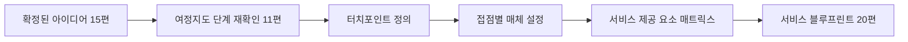
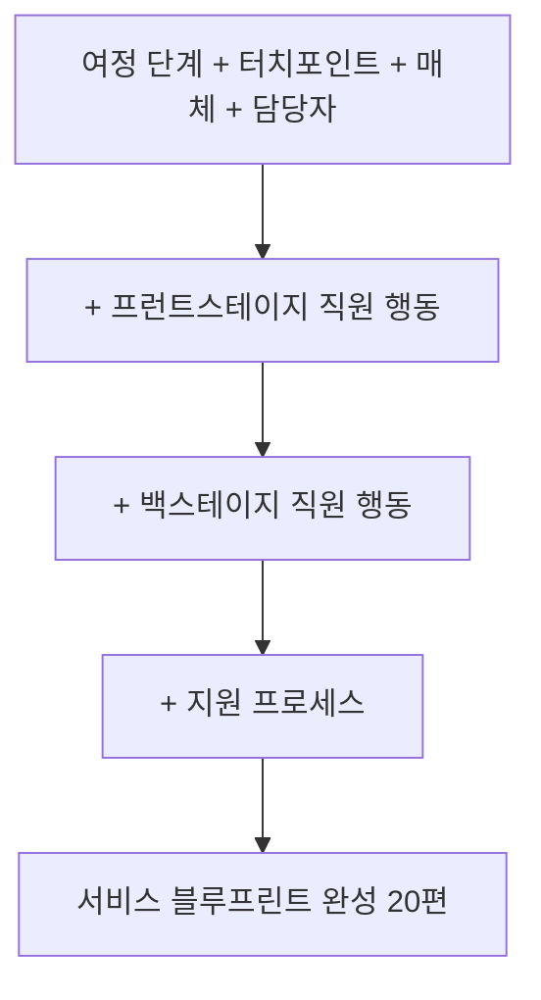

<Callout type="info">
  **이번 문서의 목표:** 15편에서 확정한 아이디어를 여정지도의 단계 위에 터치포인트로 배치하고, 각 접점의 매체를 정하며, 서비스 제공 요소 매트릭스를 작성해 서비스 블루프린트(20편)로 넘어갈 준비를 마칠 수 있게 된다.
</Callout>

## 왜 지금 구조화가 필요한가

15편에서 확정한 아이디어는 "저녁 메뉴 사전 알림", "전자레인지 데우기 전용 포장"처럼 낱개로 존재합니다. 하지만 실제 사용자는 이 아이디어들을 하나씩 따로 겪지 않고, 서비스를 이용하는 **하나의 연속된 흐름**으로 겪습니다. **서비스 구조화**(service structuring)는 낱개의 아이디어를 사용자의 이용 흐름 위에 순서대로 배치해, 서비스 전체가 하나로 맞물리게 만드는 작업입니다.

이 편은 실기 출제기준 **아이데이션** 항목의 세 번째 세부항목이며, 여기서 만든 터치포인트 배치와 매트릭스가 20편 서비스 블루프린트의 뼈대가 됩니다. 순서상 11편 고객 여정 지도와 다시 만나는 지점이기도 합니다.

> **쉽게 말하면:** 확정된 아이디어들을 사용자가 서비스를 이용하는 순서대로 줄 세우는 작업입니다.

## 1. 단계별 서비스 접점(터치포인트) 정의

### 왜 필요한가

**터치포인트**(touchpoint)는 사용자가 서비스와 직접 만나는 모든 순간을 말합니다. 04편 용어 지도에서 이미 정의를 짚었지만, 이 편에서는 그 정의를 실제로 나열하고 배치하는 실습을 합니다. 터치포인트를 빠짐없이 나열하지 못하면, 사용자가 실제로 겪는 순간 중 일부가 설계에서 통째로 빠지게 됩니다.

> **쉽게 말하면:** 사용자가 서비스와 마주치는 모든 순간을 하나도 빠뜨리지 않고 찾아 적는 일입니다.

### 터치포인트 나열 방법

11편 고객 여정 지도의 단계(인지-고려-구매-이용-사후)를 그대로 가져와, 각 단계마다 사용자가 실제로 서비스와 접촉하는 순간을 모두 적습니다.

| 여정 단계 | 터치포인트 |
|-----------|------------|
| 인지 | SNS 광고, 지인 추천 |
| 고려 | 홈페이지 메뉴 소개, 첫 주 할인 배너 |
| 구매 | 구독 신청 화면, 결제 확인 문자 |
| 이용 | 배송 전날 메뉴 알림 문자, 배송 상자 수령, 조리 후 식사 |
| 사후 | 다음 주 메뉴 변경 알림, 만족도 평가 요청 |

**자주 틀리는 점:** 앱 화면처럼 눈에 보이는 디지털 접점만 나열하고, 배송 상자를 열거나 포장을 뜯는 것 같은 **물리적 순간**을 빠뜨리는 경우가 많습니다. 터치포인트는 디지털과 물리적 접점을 모두 포함해야 합니다.

## 2. 사용자 접점별 매체 설정

### 왜 필요한가

터치포인트를 나열했다면, 이제 각 접점에서 사용자가 **무엇을 통해** 서비스를 접하는지 매체를 정해야 합니다. 같은 정보라도 문자로 보낼지, 앱 알림으로 보낼지, 종이 카드로 동봉할지에 따라 사용자 경험이 완전히 달라집니다.

> **쉽게 말하면:** 각 접점에서 어떤 도구로 사용자와 소통할지 정하는 일입니다.

### 매체 선택 기준

| 매체 | 적합한 상황 | 오늘의밥상 적용 예 |
|------|--------------|----------------------|
| 문자(SMS) | 즉시 확인이 필요하고 앱 설치 부담을 줄이고 싶을 때 | 배송 전날 메뉴 알림 |
| 앱 알림 | 이미 앱을 상시 사용하는 접점일 때 | 구독 관리, 메뉴 변경 |
| 이메일 | 정보량이 많고 즉시성이 낮을 때 | 월간 이용 내역 요약 |
| 실물 인쇄물 | 배송 상자처럼 물리적 접점일 때 | 조리법 카드 동봉 |

### 서술 답안 예시 — 접점별 매체 설정표

<Steps>

1. **1번에서 나열한 터치포인트를 그대로 가져온다**
2. **각 접점에 필요한 정보의 성격(긴급성, 정보량)을 판단한다**
3. **매체를 선택하고 이유를 한 줄로 밝힌다**
4. **디자인 원칙(13편)과 충돌하는 매체는 없는지 확인한다** — 예: 알림이 많아 의사결정 피로를 늘리면 원칙 위반

</Steps>

| 터치포인트 | 매체 | 선택 이유 |
|------------|------|-----------|
| 배송 전날 메뉴 알림 | 문자(SMS) | 앱 설치 없이도 즉시 확인 가능해야 함 |
| 조리법 안내 | 실물 인쇄물(카드) | 조리 순간에는 화면보다 손에 든 카드가 더 빠르게 확인됨 |
| 만족도 평가 요청 | 앱 알림 | 이미 구독 관리를 위해 앱을 열어야 하는 시점과 겹침 |

**자주 틀리는 점:** 모든 접점에 같은 매체(예: 전부 앱 알림)를 쓰는 경우가 많습니다. 접점마다 상황이 다르므로 매체도 상황에 맞춰 다양화해야 하며, 답안에서도 이 다양화 근거를 요구합니다.

## 3. 서비스 제공 요소를 총체적으로 파악하는 매트릭스

### 왜 필요한가

터치포인트와 매체를 따로따로 정리하면 서비스 전체를 한눈에 보기 어렵습니다. **서비스 제공 요소 매트릭스**는 여정 단계, 터치포인트, 매체, 그리고 그 접점을 실제로 담당하는 주체(12편 이해관계자)까지 한 표에 모아 서비스 전체를 총체적으로 파악하게 해주는 도구입니다.

> **쉽게 말하면:** 지금까지 따로 만든 표들을 한 장으로 합쳐 서비스 전체를 한눈에 보는 일입니다.

### 서술 답안 예시 — 서비스 제공 요소 매트릭스

| 여정 단계 | 터치포인트 | 매체 | 담당 이해관계자 | 관련 아이디어 |
|-----------|------------|------|------------------|-----------------|
| 이용 | 배송 전날 메뉴 알림 | 문자(SMS) | 마케팅팀 | 저녁 메뉴 사전 알림 |
| 이용 | 배송 상자 수령 | 실물 상자·인쇄물 | 물류팀 | 전자레인지 데우기 전용 포장 |
| 사후 | 다음 주 메뉴 변경 알림 | 앱 알림 | 서비스 운영팀 | 한 주 건너뛰기 버튼 |

**작성 순서:** 매트릭스를 채운 뒤, 아래처럼 **총체적 관점의 서술**을 한 문단 덧붙입니다. "이용 단계에 두 개의 접점(문자, 실물 상자)이 몰려 있어 마케팅팀과 물류팀의 협업이 필요하다. 사후 단계는 앱 알림 하나로 단순하지만, 이는 디자인 원칙에서 정한 의사결정 피로 최소화와도 맞닿아 있다."

**자주 틀리는 점:** 매트릭스를 표로만 제출하고 서술을 생략하는 경우가 많습니다. 매트릭스의 목적은 "총체적으로 파악"하는 것이므로, 표에서 드러나는 패턴(접점이 몰린 단계, 담당이 겹치는 부서 등)을 문장으로 짚어야 완전한 답안이 됩니다.

## 4. 접점 설계와 서비스 블루프린트의 연결고리

### 왜 미리 알아야 하는가

이 편에서 만든 매트릭스는 그 자체로 끝나지 않고, 20편 **서비스 블루프린트**(service blueprint)의 뼈대로 그대로 옮겨집니다. 블루프린트는 이 매트릭스에 "프런트스테이지 직원 행동", "백스테이지 직원 행동", "지원 프로세스"라는 세 줄을 더 추가해 완성하는 문서입니다. 지금 매트릭스를 정확히 만들어 두면 20편에서 다시 처음부터 조사할 필요가 없습니다.

> **쉽게 말하면:** 지금 만든 표는 나중에 만들 더 큰 표(블루프린트)의 뼈대입니다.

### 서술 답안 예시 — 블루프린트 연결 서술

<Steps>

1. **매트릭스의 각 터치포인트가 블루프린트의 어느 줄(고객 행동)에 해당하는지 표시한다**
2. **담당 이해관계자가 블루프린트의 프런트스테이지인지 백스테이지인지 미리 구분해둔다** — 예: 물류팀은 대부분 백스테이지
3. **접점 사이에 시간 지연이 예상되는 구간을 미리 표시한다** — 배송 대기 시간처럼, 20편의 대기 시간(wait line) 표시에 그대로 쓰인다

</Steps>

**자주 틀리는 점:** 이 편에서 담당자를 프런트스테이지·백스테이지 구분 없이 그냥 "담당 부서"로만 적는 경우가 많습니다. 20편에서 다시 구분하는 수고를 덜려면, 이 시점에 이미 사용자와 직접 접촉하는지(프런트스테이지) 아닌지(백스테이지)를 함께 표시해두는 것이 좋은 답안 습관입니다.

## 직접 해보기 — 케이스로 매트릭스 완성하기

오늘의밥상 사례에서 "만족도 평가 요청" 터치포인트의 매트릭스 한 줄을 직접 채워봅니다.

| 여정 단계 | 터치포인트 | 매체 | 담당 이해관계자 | 프런트/백스테이지 |
|-----------|------------|------|------------------|----------------------|
| 사후 | 만족도 평가 요청 | ( ) | ( ) | ( ) |

빈칸을 채운 뒤, 왜 그 매체와 담당자를 선택했는지 한 문장으로 근거를 적어보면 이 편의 서술 답안 형식을 그대로 연습할 수 있습니다.

## 핵심 정리

- 터치포인트는 11편 여정지도의 단계 위에서, **디지털과 물리적 접점을 모두 빠짐없이** 나열한다.
- 매체는 접점마다 긴급성과 정보량에 맞춰 다양화하고, 디자인 원칙과 충돌하지 않는지 확인한다.
- 서비스 제공 요소 매트릭스는 여정 단계·터치포인트·매체·담당 이해관계자·관련 아이디어를 한 표에 모으고, 반드시 총체적 관점의 서술을 덧붙인다.
- 이 편의 매트릭스는 20편 서비스 블루프린트의 뼈대이므로, 담당자의 프런트스테이지·백스테이지 여부와 지연 구간을 미리 표시해두면 이후 작업이 수월하다.
- 매트릭스에서 드러나는 패턴(접점이 몰린 단계, 담당이 겹치는 부서)을 짚는 것이 표만 채우는 것보다 채점에서 더 중요하다.

## 마무리 복습

<Quiz
  questionNumber={1}
  question="터치포인트 나열에서 가장 흔히 빠뜨리는 항목은?"
  options={['앱 알림 화면', '홈페이지 배너', '배송 상자를 열고 포장을 뜯는 물리적 순간', 'SNS 광고']}
  correctAnswer={3}
  explanation="터치포인트는 디지털 접점뿐 아니라 물리적 접점도 포함해야 하는데, 앱 화면 같은 디지털 접점만 나열하다 보면 배송 상자를 열거나 포장을 뜯는 물리적 순간을 빠뜨리기 쉽다."
  optionExplanations={['디지털 접점으로 비교적 쉽게 나열되는 항목이다.', '디지털 접점으로 비교적 쉽게 나열되는 항목이다.', '물리적 접점이라 디지털 접점 나열에만 집중하면 빠뜨리기 쉽다.', '디지털 접점으로 비교적 쉽게 나열되는 항목이다.']}
/>

<Quiz
  questionNumber={2}
  question="접점별 매체 설정에서 실물 인쇄물이 가장 적합한 상황은?"
  options={['즉시성이 낮고 정보량이 많은 월간 요약', '조리 순간처럼 화면보다 손에 든 자료가 더 빠르게 확인되는 상황', '앱을 상시 사용하는 구독 관리 화면', '긴급하게 즉시 확인이 필요한 결제 확인']}
  correctAnswer={2}
  explanation="조리 순간에는 스마트폰 화면을 다시 켜기보다 손에 든 인쇄물을 바로 확인하는 것이 더 빠르므로, 실물 인쇄물이 적합한 상황이다."
  optionExplanations={['이런 상황에는 정보량을 담기 좋은 이메일이 더 적합하다.', '조리 순간에는 손에 든 자료가 화면보다 빠르게 확인되므로 인쇄물이 적합하다.', '이미 앱을 사용하는 접점이므로 앱 알림이 더 적합하다.', '즉시 확인이 필요하면 문자가 더 적합하다.']}
/>

<Quiz
  questionNumber={3}
  question="서비스 제공 요소 매트릭스에 포함되지 않아도 되는 항목은?"
  options={['여정 단계', '터치포인트', '경쟁사의 재무제표', '담당 이해관계자']}
  correctAnswer={3}
  explanation="서비스 제공 요소 매트릭스는 여정 단계, 터치포인트, 매체, 담당 이해관계자, 관련 아이디어로 서비스 전체를 총체적으로 파악하는 표이며, 경쟁사 재무제표는 이 산출물의 목적과 무관하다."
  optionExplanations={['매트릭스의 기본 축이 되는 필수 항목이다.', '매트릭스의 기본 축이 되는 필수 항목이다.', '이 산출물의 목적과 무관한 항목이다.', '접점을 실제로 담당하는 주체를 밝히는 필수 항목이다.']}
/>

<Quiz
  questionNumber={4}
  question="매트릭스를 표로만 제출했을 때 지적받는 이유로 가장 적절한 것은?"
  options={['표는 실기 답안에 사용할 수 없기 때문이다', '표에서 드러나는 패턴을 짚는 서술이 빠졌기 때문이다', '표에 색상을 넣지 않았기 때문이다', '표의 행 수가 너무 많기 때문이다']}
  correctAnswer={2}
  explanation="매트릭스의 목적은 서비스를 총체적으로 파악하는 것이므로, 표에서 드러나는 접점 집중이나 담당 중복 같은 패턴을 문장으로 짚어야 완전한 답안이 된다. 표만 제출하면 이 서술이 빠진다."
  optionExplanations={['표는 실기 답안에서 널리 사용되는 형식이다.', '패턴을 짚는 서술이 빠지는 것이 지적받는 실제 이유다.', '색상 여부는 채점 기준과 무관하다.', '행 수는 서비스 규모에 따라 달라질 수 있어 문제가 아니다.']}
/>

<Quiz
  questionNumber={5}
  question="이 편에서 만든 매트릭스가 20편 서비스 블루프린트로 이어질 때 추가되는 요소가 아닌 것은?"
  options={['프런트스테이지 직원 행동', '백스테이지 직원 행동', '지원 프로세스', '핵심 사용자의 취미']}
  correctAnswer={4}
  explanation="블루프린트는 이 편의 매트릭스에 프런트스테이지 직원 행동, 백스테이지 직원 행동, 지원 프로세스 세 줄을 더해 완성한다. 취미는 블루프린트 구성 요소가 아니다."
  optionExplanations={['블루프린트에서 새로 추가되는 구성 요소다.', '블루프린트에서 새로 추가되는 구성 요소다.', '블루프린트에서 새로 추가되는 구성 요소다.', '블루프린트 구성 요소에 해당하지 않는다.']}
/>

<Quiz
  questionNumber={6}
  question="담당 이해관계자를 정리할 때 미리 표시해두면 좋은 것으로 옳은 것은?"
  options={['담당자의 근속 연수', '프런트스테이지인지 백스테이지인지 여부', '담당자의 취미', '담당자의 출퇴근 시간']}
  correctAnswer={2}
  explanation="사용자와 직접 접촉하는 프런트스테이지인지 아닌지를 미리 구분해두면 20편에서 서비스 블루프린트를 작성할 때 다시 구분하는 수고를 덜 수 있다."
  optionExplanations={['근속 연수는 블루프린트 작성에 필요한 정보가 아니다.', '프런트스테이지·백스테이지 구분이 이후 블루프린트 작성을 수월하게 한다.', '취미는 이 산출물과 무관하다.', '출퇴근 시간은 이 산출물의 목적과 무관하다.']}
/>

## 참고 자료

- [한국산업인력공단(브런치 경유 원문) - 서비스·경험디자인 기사 출제기준(필기·실기)](https://t1.daumcdn.net/brunch/service/user/13ur/file/tayw3sSk4ib3un2lLq5U249xKUg.pdf)
