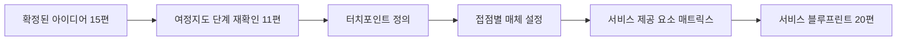
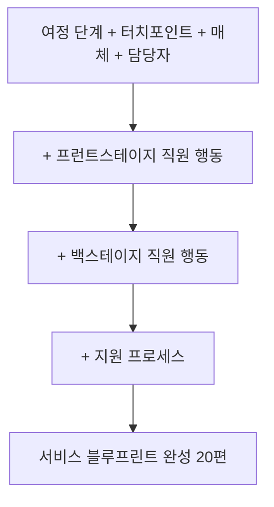

## 왜 지금 구조화가 필요한가

15편에서 확정한 아이디어는 "저녁 메뉴 사전 알림", "전자레인지 데우기 전용 포장"처럼 낱개로 존재합니다. 하지만 실제 사용자는 이 아이디어들을 하나씩 따로 겪지 않고, 서비스를 이용하는 **하나의 연속된 흐름**으로 겪습니다.

이 편은 실기 출제기준 **아이데이션** 항목의 세 번째 세부항목이며, 여기서 만든 터치포인트 배치와 매트릭스가 20편 서비스 블루프린트의 뼈대가 됩니다. 순서상 11편 고객 여정 지도와 다시 만나는 지점이기도 합니다.

```mermaid
graph LR
  A[확정된 아이디어 15편] --> B[여정지도 단계 재확인 11편]
  B --> C[터치포인트 정의]
  C --> D[접점별 매체 설정]
  D --> E[서비스 제공 요소 매트릭스]
  E --> F[서비스 블루프린트 20편]
```

## 1. 단계별 서비스 접점(터치포인트) 정의

### 터치포인트 나열 방법

11편 고객 여정 지도의 단계(인지-고려-구매-이용-사후)를 그대로 가져와, 각 단계마다 사용자가 실제로 서비스와 접촉하는 순간을 모두 적습니다.

| 여정 단계 | 터치포인트 |
|-----------|------------|
| 인지 | SNS 광고, 지인 추천 |
| 고려 | 홈페이지 메뉴 소개, 첫 주 할인 배너 |
| 구매 | 구독 신청 화면, 결제 확인 문자 |
| 이용 | 배송 전날 메뉴 알림 문자, 배송 상자 수령, 조리 후 식사 |
| 사후 | 다음 주 메뉴 변경 알림, 만족도 평가 요청 |

**자주 틀리는 점:** 앱 화면처럼 눈에 보이는 디지털 접점만 나열하고, 배송 상자를 열거나 포장을 뜯는 것 같은 **물리적 순간**을 빠뜨리는 경우가 많습니다. 터치포인트는 디지털과 물리적 접점을 모두 포함해야 합니다.

## 2. 사용자 접점별 매체 설정

### 매체 선택 기준

| 매체 | 적합한 상황 | 오늘의밥상 적용 예 |
|------|--------------|----------------------|
| 문자(SMS) | 즉시 확인이 필요하고 앱 설치 부담을 줄이고 싶을 때 | 배송 전날 메뉴 알림 |
| 앱 알림 | 이미 앱을 상시 사용하는 접점일 때 | 구독 관리, 메뉴 변경 |
| 이메일 | 정보량이 많고 즉시성이 낮을 때 | 월간 이용 내역 요약 |
| 실물 인쇄물 | 배송 상자처럼 물리적 접점일 때 | 조리법 카드 동봉 |

### 서술 답안 예시 — 접점별 매체 설정표

| 터치포인트 | 매체 | 선택 이유 |
|------------|------|-----------|
| 배송 전날 메뉴 알림 | 문자(SMS) | 앱 설치 없이도 즉시 확인 가능해야 함 |
| 조리법 안내 | 실물 인쇄물(카드) | 조리 순간에는 화면보다 손에 든 카드가 더 빠르게 확인됨 |
| 만족도 평가 요청 | 앱 알림 | 이미 구독 관리를 위해 앱을 열어야 하는 시점과 겹침 |

**자주 틀리는 점:** 모든 접점에 같은 매체(예: 전부 앱 알림)를 쓰는 경우가 많습니다. 접점마다 상황이 다르므로 매체도 상황에 맞춰 다양화해야 하며, 답안에서도 이 다양화 근거를 요구합니다.

## 3. 서비스 제공 요소를 총체적으로 파악하는 매트릭스

### 서술 답안 예시 — 서비스 제공 요소 매트릭스

| 여정 단계 | 터치포인트 | 매체 | 담당 이해관계자 | 관련 아이디어 |
|-----------|------------|------|------------------|-----------------|
| 이용 | 배송 전날 메뉴 알림 | 문자(SMS) | 마케팅팀 | 저녁 메뉴 사전 알림 |
| 이용 | 배송 상자 수령 | 실물 상자·인쇄물 | 물류팀 | 전자레인지 데우기 전용 포장 |
| 사후 | 다음 주 메뉴 변경 알림 | 앱 알림 | 서비스 운영팀 | 한 주 건너뛰기 버튼 |

**작성 순서:** 매트릭스를 채운 뒤, 아래처럼 **총체적 관점의 서술**을 한 문단 덧붙입니다. "이용 단계에 두 개의 접점(문자, 실물 상자)이 몰려 있어 마케팅팀과 물류팀의 협업이 필요하다. 사후 단계는 앱 알림 하나로 단순하지만, 이는 디자인 원칙에서 정한 의사결정 피로 최소화와도 맞닿아 있다."

**자주 틀리는 점:** 매트릭스를 표로만 제출하고 서술을 생략하는 경우가 많습니다. 매트릭스의 목적은 "총체적으로 파악"하는 것이므로, 표에서 드러나는 패턴(접점이 몰린 단계, 담당이 겹치는 부서 등)을 문장으로 짚어야 완전한 답안이 됩니다.

## 4. 접점 설계와 서비스 블루프린트의 연결고리

### 왜 미리 알아야 하는가

이 편에서 만든 매트릭스는 그 자체로 끝나지 않고, 20편 **서비스 블루프린트**(service blueprint)의 뼈대로 그대로 옮겨집니다. 지금 매트릭스를 정확히 만들어 두면 20편에서 다시 처음부터 조사할 필요가 없습니다.

```mermaid
graph TD
  A[여정 단계 + 터치포인트 + 매체 + 담당자] --> B[+ 프런트스테이지 직원 행동]
  B --> C[+ 백스테이지 직원 행동]
  C --> D[+ 지원 프로세스]
  D --> E[서비스 블루프린트 완성 20편]
```

### 서술 답안 예시 — 블루프린트 연결 서술

**자주 틀리는 점:** 이 편에서 담당자를 프런트스테이지·백스테이지 구분 없이 그냥 "담당 부서"로만 적는 경우가 많습니다. 20편에서 다시 구분하는 수고를 덜려면, 이 시점에 이미 사용자와 직접 접촉하는지(프런트스테이지) 아닌지(백스테이지)를 함께 표시해두는 것이 좋은 답안 습관입니다.

## 핵심 정리

- 터치포인트는 11편 여정지도의 단계 위에서, **디지털과 물리적 접점을 모두 빠짐없이** 나열한다.
- 매체는 접점마다 긴급성과 정보량에 맞춰 다양화하고, 디자인 원칙과 충돌하지 않는지 확인한다.
- 서비스 제공 요소 매트릭스는 여정 단계·터치포인트·매체·담당 이해관계자·관련 아이디어를 한 표에 모으고, 반드시 총체적 관점의 서술을 덧붙인다.
- 이 편의 매트릭스는 20편 서비스 블루프린트의 뼈대이므로, 담당자의 프런트스테이지·백스테이지 여부와 지연 구간을 미리 표시해두면 이후 작업이 수월하다.
- 매트릭스에서 드러나는 패턴(접점이 몰린 단계, 담당이 겹치는 부서)을 짚는 것이 표만 채우는 것보다 채점에서 더 중요하다.

## 마무리 복습

<Quiz
  questionNumber={1}
  question={"터치포인트 나열에서 가장 흔히 빠뜨리는 항목은?"}
  options={["앱 알림 화면","홈페이지 배너","배송 상자를 열고 포장을 뜯는 물리적 순간","SNS 광고"]}
  correctAnswer={3}
  explanation={"터치포인트는 디지털 접점뿐 아니라 물리적 접점도 포함해야 하는데, 앱 화면 같은 디지털 접점만 나열하다 보면 배송 상자를 열거나 포장을 뜯는 물리적 순간을 빠뜨리기 쉽다."}
/>

<Quiz
  questionNumber={2}
  question={"접점별 매체 설정에서 실물 인쇄물이 가장 적합한 상황은?"}
  options={["즉시성이 낮고 정보량이 많은 월간 요약","조리 순간처럼 화면보다 손에 든 자료가 더 빠르게 확인되는 상황","앱을 상시 사용하는 구독 관리 화면","긴급하게 즉시 확인이 필요한 결제 확인"]}
  correctAnswer={2}
  explanation={"조리 순간에는 스마트폰 화면을 다시 켜기보다 손에 든 인쇄물을 바로 확인하는 것이 더 빠르므로, 실물 인쇄물이 적합한 상황이다."}
/>

<Quiz
  questionNumber={3}
  question={"서비스 제공 요소 매트릭스에 포함되지 않아도 되는 항목은?"}
  options={["여정 단계","터치포인트","경쟁사의 재무제표","담당 이해관계자"]}
  correctAnswer={3}
  explanation={"서비스 제공 요소 매트릭스는 여정 단계, 터치포인트, 매체, 담당 이해관계자, 관련 아이디어로 서비스 전체를 총체적으로 파악하는 표이며, 경쟁사 재무제표는 이 산출물의 목적과 무관하다."}
/>

## 참고 자료

- [한국산업인력공단(브런치 경유 원문) - 서비스·경험디자인 기사 출제기준(필기·실기)](https://t1.daumcdn.net/brunch/service/user/13ur/file/tayw3sSk4ib3un2lLq5U249xKUg.pdf)
