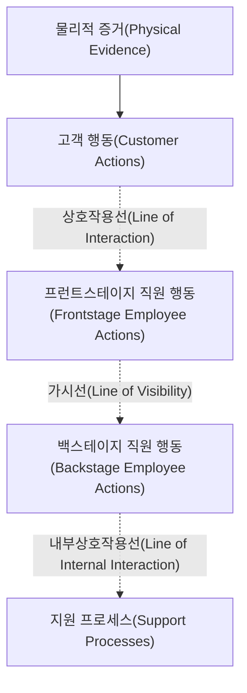

<Callout type="info">
  **이번 문서의 목표:** 서비스 블루프린트의 구성요소와 경계선을 정확히 구분하고, 여정지도·터치포인트를 블루프린트로 확장해 완성된 표를 작성하며, 실기의 빈칸 채우기 문제에 답할 수 있게 된다.
</Callout>

## 왜 여정지도만으로는 부족한가

11편에서 만든 고객 여정지도(customer journey map)는 고객의 눈에 보이는 행동과 감정만 보여줍니다. 19편의 시나리오도 마찬가지로 고객 관점이 중심입니다. 그런데 18편의 시뮬레이션에서 확인했듯이, 고객이 겪는 문제의 원인은 종종 고객 눈에 보이지 않는 곳(수거 담당자가 태그 부착 절차를 안내받지 못한 것, 물류센터의 배차 시스템 등)에 있습니다.

**서비스 블루프린트**(service blueprint)는 고객이 보는 앞무대와 고객이 보지 못하는 뒷무대를 하나의 표에 함께 담아, 문제의 진짜 원인이 어디에 있는지 찾아내는 도구입니다.

> **쉽게 말하면:** 연극으로 치면 무대 위에서 관객이 보는 배우의 연기(고객이 보는 부분)와 무대 뒤에서 분주하게 움직이는 스태프(고객이 못 보는 부분)를 한 장의 설계도에 함께 그린 것입니다.

## 서비스 블루프린트의 구성요소

블루프린트는 가로축이 시간(서비스 진행 단계)이고, 세로축은 아래 다섯 개 층(layer)과 그 사이를 나누는 세 개의 경계선으로 이루어집니다.

**층(layer) — 무엇을 채우는 칸인가**

- **물리적 증거**(physical evidence): 고객이 각 단계에서 실제로 보거나 만지는 유형의 사물. 앱 화면, 영수증, 세탁물 태그, 배송 상자 등
- **고객 행동**(customer actions): 고객이 서비스를 이용하며 직접 하는 행동. 신청, 결제, 물건 내놓기, 물건 받기 등
- **프런트스테이지 직원 행동**(frontstage employee actions, 온스테이지onstage 행동이라고도 함): 고객 눈에 보이는 직원의 행동. 응대, 인사, 방문 등
- **백스테이지 직원 행동**(backstage employee actions, 오프스테이지offstage 행동이라고도 함): 고객 눈에 보이지 않는 직원의 행동. 분류, 세탁, 검수, 배차 등
- **지원 프로세스**(support processes): 직원의 업무를 가능하게 하는 내부 시스템·설비. 서버, 결제 시스템, 재고 관리 시스템 등

**경계선(line) — 층과 층을 나누는 기준**

- **상호작용선**(line of interaction): 고객 행동과 프런트스테이지 직원 행동 사이의 선. 이 선을 가로지르는 화살표가 바로 고객과 직원이 직접 마주치는 순간입니다
- **가시선**(line of visibility): 프런트스테이지와 백스테이지 사이의 선. **이 선이 블루프린트의 핵심입니다** — 고객이 볼 수 있는 것과 볼 수 없는 것을 가르는 경계이기 때문입니다
- **내부상호작용선**(line of internal interaction): 백스테이지 직원 행동과 지원 프로세스 사이의 선. 사람의 업무와 시스템·설비의 역할을 가릅니다

> **쉽게 말하면:** 상호작용선은 "고객과 직원이 만나는 순간", 가시선은 "보이는 것과 안 보이는 것의 경계", 내부상호작용선은 "사람이 하는 일과 기계·시스템이 하는 일의 경계"입니다.

**왜 가시선 구분이 중요한가:** 18편에서 발견한 "태그 부착 중 고객이 어색하게 서 있었다"는 문제는, 가시선 위(프런트스테이지)의 직원 행동에 안내 멘트가 빠져 있었기 때문입니다. 만약 이 문제의 원인이 가시선 아래(백스테이지)에 있었다면 — 예를 들어 물류센터의 배차가 늦어 수거 자체가 지연됐다면 — 해결 방법은 완전히 달라집니다. 가시선을 기준으로 원인의 위치를 정확히 짚어야 올바른 개선방향이 나옵니다.

## 여정지도·터치포인트를 블루프린트로 확장하는 절차

<Steps>

1. **여정지도의 단계를 가로축으로 가져온다** — 11편에서 만든 단계 구분을 그대로 사용한다
2. **각 단계의 물리적 증거를 나열한다** — 16편에서 설계한 접점(터치포인트)에서 고객이 보는 사물을 뽑는다
3. **고객 행동을 정리한다** — 여정지도의 행동 칸을 그대로 옮기되, 더 구체적으로 쪼갠다
4. **상호작용선을 긋고 프런트스테이지 행동을 채운다** — 고객과 직접 마주치는 직원의 행동만 적는다
5. **가시선을 긋고 백스테이지 행동을 채운다** — 고객 눈에 보이지 않는 직원의 업무를 적는다
6. **내부상호작용선을 긋고 지원 프로세스를 채운다** — 그 업무를 가능하게 하는 시스템·설비를 적는다
7. **실패 지점과 대기 시간을 표시한다** — 아래 표기법을 참고해 문제 발생 가능 지점을 별도로 마킹한다

</Steps>

## 실패 지점과 대기 시간 표시법

- **실패 지점**(fail point, 보통 기호 X로 표시): 서비스가 실패하거나 오류가 발생할 가능성이 있는 지점. 예: 세탁 지연으로 전체 배송이 늦어지는 지점
- **대기 시간**(wait line, 물결 모양이나 시계 기호로 표시): 고객이 기다려야 하는 구간. 예: 태그 부착이 끝날 때까지 고객이 기다리는 구간

두 표기 모두 **블루프린트를 다 그린 뒤 마지막에 얹는 분석 레이어**입니다. 먼저 다섯 개 층과 세 개 경계선으로 표를 완성한 다음, 어느 칸에서 문제가 생길 수 있는지를 다시 훑어보며 표시합니다.

## 사례로 적용하기 — 런드리핏 서비스 블루프린트 완성 표

17~19편에서 이어온 런드리핏 사례를 완전한 블루프린트로 확장합니다. 아래 표가 이 편의 핵심 산출물입니다.

| 구성요소 | 1. 픽업 신청 | 2. 수거 | 3. 세탁 처리 | 4. 품질 확인 | 5. 배송 |
|---|---|---|---|---|---|
| 물리적 증거 | 앱 화면·알림 문자 | 세탁물 가방·태그 | 해당 없음(비가시 영역) | 해당 없음(비가시 영역) | 배송 상자·완료 알림 문자 |
| 고객 행동 | 픽업 시간을 선택하고 신청을 완료한다 | 가방을 문 앞에 내놓는다 | 대기한다 | 대기한다 | 상자를 받아 확인한다 |
| 상호작용선 | 이 지점부터 고객과 직원이 직접 마주치는 행동이 시작된다(단계 공통 경계) | | | | |
| 프런트스테이지 직원 행동 | 자동화 처리, 직원 개입 없음 | 수거 담당자가 방문해 태그를 붙이고 인사한다 | 해당 없음 | 해당 없음 | 배송 담당자가 방문해 상자를 전달한다 |
| 가시선 | 이 지점부터 고객 눈에 보이지 않는 업무가 시작된다(단계 공통 경계) | | | | |
| 백스테이지 직원 행동 | 신청 접수를 확인한다 | 수거물을 물류센터로 이송한다 | 세탁 담당자가 분류·세탁·건조한다 | 검수 담당자가 얼룩·손상을 확인한다 | 배송 담당자가 경로를 배정받는다 |
| 내부상호작용선 | 이 지점부터 사람이 아닌 시스템·설비가 지원하는 영역이 시작된다(단계 공통 경계) | | | | |
| 지원 프로세스 | 앱 서버·결제 시스템 | 수거 일정 배차 시스템 | 세탁 장비·세제 재고 관리 시스템 | 검수 체크리스트 시스템 | 배송 경로 최적화 시스템 |
| 실패 지점·대기 시간 | 시간대 표시 혼동(실패 지점) | 태그 부착 중 고객 대기(대기 시간) | 세탁 지연 시 전체 일정 지연(실패 지점) | 손상 발견 시 재세탁 필요(실패 지점) | 배송 지연(대기 시간) |

**해석:** 표를 완성하고 나니 문제의 위치가 명확해집니다.

- 1단계의 문제(시간대 혼동)는 **고객 행동 칸 자체의 정보 설계 문제**이므로, 프런트스테이지나 백스테이지를 고칠 필요 없이 화면 디자인만 개선하면 됩니다
- 2단계의 문제(대기 시간)는 **상호작용선 바로 위에서 발생**하므로, 담당자의 안내 멘트라는 프런트스테이지 행동을 보완하면 해결됩니다
- 3, 4단계의 실패 지점은 **가시선 아래**, 즉 고객이 전혀 보지 못하는 백스테이지·지원 프로세스에 있습니다. 고객에게는 "배송이 늦다"는 결과만 보이지만, 진짜 원인은 세탁 장비 가동률이나 검수 체크리스트 시스템에 있을 수 있습니다

**이것이 여정지도만으로는 얻을 수 없는 통찰입니다.** 여정지도는 "배송이 늦었다"는 결과(고객 행동·감정)까지만 보여주지만, 블루프린트는 그 원인이 가시선 위인지 아래인지, 사람의 문제인지 시스템의 문제인지까지 짚어줍니다.

## 빈칸 채우기 답안 작성법

실기에는 블루프린트 일부 칸을 비워두고 채우게 하는 문제가 자주 나옵니다. 이때는 다음 순서로 접근합니다.

<Steps>

1. **빈칸이 어느 층에 있는지 먼저 확인한다** — 경계선(상호작용선·가시선·내부상호작용선) 중 어느 두 선 사이에 있는지로 층을 판정한다
2. **같은 열(같은 시간 단계)의 위아래 칸을 본다** — 물리적 증거가 "태그"라면 고객 행동은 그 태그와 관련된 행동일 가능성이 높다
3. **같은 행(같은 층)의 좌우 칸을 본다** — 앞뒤 단계의 서술 톤과 문장 형식을 맞춘다(예: 모두 "~한다"체로 통일)
4. **인과관계로 검증한다** — 백스테이지 칸을 채웠다면, 그 결과가 프런트스테이지나 물리적 증거 칸에 어떻게 드러나는지 앞뒤로 맞춰본다

</Steps>

**예시:** "3. 세탁 처리" 열의 백스테이지 칸이 비어 있고 물리적 증거·고객 행동 칸이 모두 "해당 없음"으로 채워져 있다면, 이 열은 고객이 관여하지 않는 순수 백스테이지 단계라는 뜻입니다. 위 표를 참고하면 "세탁 담당자가 분류·세탁·건조한다"처럼 **주어(담당자)와 동작(분류·세탁·건조)이 분명한 문장**으로 채우는 것이 올바른 접근입니다.

## 서술 답안 예시 — 블루프린트 해설 작성 순서

블루프린트를 완성한 뒤 "이 블루프린트에서 발견한 문제와 개선방향을 서술하시오" 같은 문제가 이어서 나오면, 아래처럼 씁니다.

> **배경:** 런드리핏 서비스의 픽업 신청부터 배송까지 전 과정을 서비스 블루프린트로 작성한 결과, 가시선 위와 아래에서 각각 다른 성격의 문제가 발견되었다.

> **목적:** 각 문제의 원인이 고객과 직접 마주치는 프런트스테이지에 있는지, 고객이 보지 못하는 백스테이지나 지원 프로세스에 있는지 구분하여 적절한 개선방향을 제시한다.

> **방법:** 상호작용선과 가시선을 기준으로 실패 지점과 대기 시간이 표시된 칸의 위치를 확인하고, 각 칸의 상위·하위 층 내용을 함께 검토한다.

> **결과:** 픽업 신청 단계의 시간대 혼동은 물리적 증거(화면 설계) 개선으로, 수거 단계의 대기 시간은 프런트스테이지 안내 멘트 추가로, 세탁·품질 확인 단계의 실패 지점은 백스테이지 인력 배치와 지원 프로세스(장비·검수 시스템) 점검으로 각각 다르게 대응해야 한다.

## 자주 틀리는 점

- **프런트스테이지와 백스테이지를 반대로 표시하는 실수.** 고객 눈에 보이면 프런트스테이지, 보이지 않으면 백스테이지입니다. "직급이 높은 직원"이 아니라 "고객에게 보이는가"가 유일한 기준입니다.
- **가시선의 위치를 착각하는 실수.** 가시선은 프런트스테이지와 백스테이지 사이에 있습니다. 상호작용선(고객 행동과 프런트스테이지 사이)과 혼동해 고객 행동 바로 아래에 가시선을 긋는 실수가 많습니다.
- **실패 지점과 대기 시간을 같은 것으로 혼동하는 실수.** 실패 지점은 서비스가 아예 잘못될 위험이 있는 지점이고, 대기 시간은 서비스는 정상 진행되지만 고객이 기다려야 하는 구간입니다. 태그 부착 중 기다리는 것은 대기 시간이지 실패 지점이 아닙니다.
- **물리적 증거를 고객의 감정으로 착각하는 실수.** 물리적 증거는 눈에 보이는 사물(화면, 영수증, 상자)이지, "만족감" 같은 감정이 아닙니다. 감정은 11편의 여정지도에서 다루는 요소입니다.
- **모든 단계에 다섯 층을 억지로 다 채우는 실수.** 위 표의 3, 4단계처럼 고객이 전혀 관여하지 않는 단계는 물리적 증거와 고객 행동 칸에 "해당 없음"으로 정확히 표시하는 것이 맞는 답안입니다. 빈칸을 채우려고 억지로 고객 행동을 지어내면 오히려 틀린 답안이 됩니다.

## 핵심 정리

- 서비스 블루프린트는 물리적 증거·고객 행동·프런트스테이지·백스테이지·지원 프로세스 다섯 층과, 상호작용선·가시선·내부상호작용선 세 경계선으로 구성된다
- 가시선은 고객이 보는 것과 못 보는 것을 가르는 핵심 경계선이며, 문제 원인이 그 위인지 아래인지에 따라 개선방향이 달라진다
- 여정지도의 단계를 가로축으로 가져와 층을 하나씩 채우고, 마지막에 실패 지점·대기 시간을 얹어 완성한다
- 빈칸 채우기 문제는 층 판정 → 같은 열 확인 → 같은 행 확인 → 인과관계 검증 순서로 접근한다
- 서술 답안은 배경–목적–방법–결과 순서로, 문제의 층 위치에 따라 다른 개선방향을 제시한다

## 마무리 복습

<Quiz
  questionNumber={1}
  question="서비스 블루프린트에서 가시선(line of visibility)이 가르는 두 층으로 옳은 것은?"
  options={['고객 행동과 물리적 증거', '프런트스테이지 직원 행동과 백스테이지 직원 행동', '백스테이지 직원 행동과 지원 프로세스', '고객 행동과 프런트스테이지 직원 행동']}
  correctAnswer={2}
  explanation="가시선은 고객 눈에 보이는 프런트스테이지와 보이지 않는 백스테이지 사이의 경계선입니다."
  optionExplanations={['가시선의 위치가 아닙니다', '정답입니다', '이는 내부상호작용선의 위치입니다', '이는 상호작용선의 위치입니다']}
/>

<Quiz
  questionNumber={2}
  question="상호작용선(line of interaction)이 위치하는 곳으로 옳은 것은?"
  options={['물리적 증거와 고객 행동 사이', '고객 행동과 프런트스테이지 직원 행동 사이', '백스테이지 직원 행동과 지원 프로세스 사이', '지원 프로세스 아래']}
  correctAnswer={2}
  explanation="상호작용선은 고객이 직접 마주치는 프런트스테이지 직원 행동과 고객 행동 사이의 경계선입니다."
  optionExplanations={['상호작용선의 위치가 아닙니다', '정답입니다', '이는 내부상호작용선의 위치입니다', '해당 위치에 선이 없습니다']}
/>

<Quiz
  questionNumber={3}
  question="런드리핏 사례에서 세탁 처리 단계(3단계)의 물리적 증거와 고객 행동 칸을 (해당 없음)으로 채운 이유로 가장 적절한 것은?"
  options={['해당 단계 정보를 조사하지 못했기 때문에', '고객이 전혀 관여하지 않는 순수 백스테이지 단계이기 때문에', '표의 칸 수를 맞추기 위해 임의로 채웠기 때문에', '세탁 처리 단계에는 지원 프로세스가 없기 때문에']}
  correctAnswer={2}
  explanation="세탁 처리 단계는 고객이 직접 관여하지 않는 순수 백스테이지 단계이므로 물리적 증거와 고객 행동이 해당 없음으로 표시됩니다."
  optionExplanations={['조사 미비가 아니라 실제로 고객이 관여하지 않는 단계입니다', '정답입니다', '임의 채움이 아니라 실제 특성을 반영한 것입니다', '지원 프로세스는 별도로 존재합니다']}
/>

<Quiz
  questionNumber={4}
  question="실패 지점(fail point)과 대기 시간(wait line)의 차이로 가장 적절한 것은?"
  options={['둘은 완전히 같은 개념이다', '실패 지점은 서비스가 잘못될 위험이 있는 지점이고, 대기 시간은 서비스는 정상 진행되지만 고객이 기다려야 하는 구간이다', '실패 지점은 백스테이지에만 존재하고 대기 시간은 프런트스테이지에만 존재한다', '대기 시간은 물리적 증거 층에서만 표시한다']}
  correctAnswer={2}
  explanation="실패 지점은 서비스 실패 위험 지점, 대기 시간은 정상 진행 중 고객이 기다리는 구간이라는 점에서 성격이 다릅니다."
  optionExplanations={['같은 개념이 아닙니다', '정답입니다', '두 표시 모두 여러 층에 나타날 수 있습니다', '특정 층에만 국한되지 않습니다']}
/>

<Quiz
  questionNumber={5}
  question="블루프린트에서 프런트스테이지와 백스테이지를 구분하는 유일한 기준은?"
  options={['직원의 직급', '고객에게 보이는지 여부', '직원의 근무 연차', '업무의 난이도']}
  correctAnswer={2}
  explanation="프런트스테이지와 백스테이지 구분은 오직 고객 눈에 보이는지 여부로 결정됩니다."
  optionExplanations={['직급과는 무관합니다', '정답입니다', '연차와는 무관합니다', '난이도와는 무관합니다']}
/>

<Quiz
  questionNumber={6}
  question="빈칸 채우기 문제에서 (같은 열의 위아래 칸을 본다)는 접근법이 유효한 이유로 가장 적절한 것은?"
  options={['같은 시간 단계 안의 층들은 서로 관련된 사물과 행동을 담고 있기 때문에', '위아래 칸은 항상 똑같은 내용을 반복하기 때문에', '채점자가 위아래 칸만 확인하기 때문에', '같은 열에는 실패 지점만 표시되기 때문에']}
  correctAnswer={1}
  explanation="같은 시간 단계(열) 안의 물리적 증거·고객 행동·직원 행동은 서로 인과적으로 연결되어 있으므로 위아래를 참고해 빈칸을 추론할 수 있습니다."
  optionExplanations={['정답입니다', '내용이 반복되는 것이 아니라 관련되어 있는 것입니다', '채점 방식과는 무관한 설명입니다', '실패 지점은 별도의 행에 표시됩니다']}
/>

<Quiz
  questionNumber={7}
  question="블루프린트가 여정지도보다 더 제공하는 통찰로 가장 적절한 것은?"
  options={['고객의 감정 변화를 곡선으로 보여준다', '문제의 원인이 고객이 보는 영역에 있는지 보지 못하는 영역에 있는지 구분해 준다', '경쟁 서비스와의 가격 비교를 보여준다', '시장 규모를 추정해 준다']}
  correctAnswer={2}
  explanation="블루프린트는 가시선을 통해 문제 원인이 프런트스테이지인지 백스테이지·지원 프로세스인지 구분해 주는 것이 여정지도에는 없는 통찰입니다."
  optionExplanations={['감정 곡선은 11편 여정지도의 역할입니다', '정답입니다', '가격 비교는 블루프린트의 목적이 아닙니다', '시장 규모 추정과는 무관합니다']}
/>

<Quiz
  questionNumber={8}
  question="지원 프로세스(support processes) 층에 들어갈 내용으로 가장 적절한 것은?"
  options={['고객이 화면에서 누르는 버튼', '수거 담당자의 인사말', '앱 서버와 결제 시스템 같은 내부 시스템·설비', '고객이 받는 배송 상자']}
  correctAnswer={3}
  explanation="지원 프로세스는 백스테이지 직원의 업무를 가능하게 하는 내부 시스템과 설비를 담는 층입니다."
  optionExplanations={['이는 물리적 증거 또는 고객 행동입니다', '이는 프런트스테이지 직원 행동입니다', '정답입니다', '이는 물리적 증거입니다']}
/>

## 참고 자료

- [한국산업인력공단 - 서비스·경험디자인 기사 출제기준(필기·실기)](https://t1.daumcdn.net/brunch/service/user/13ur/file/tayw3sSk4ib3un2lLq5U249xKUg.pdf)
