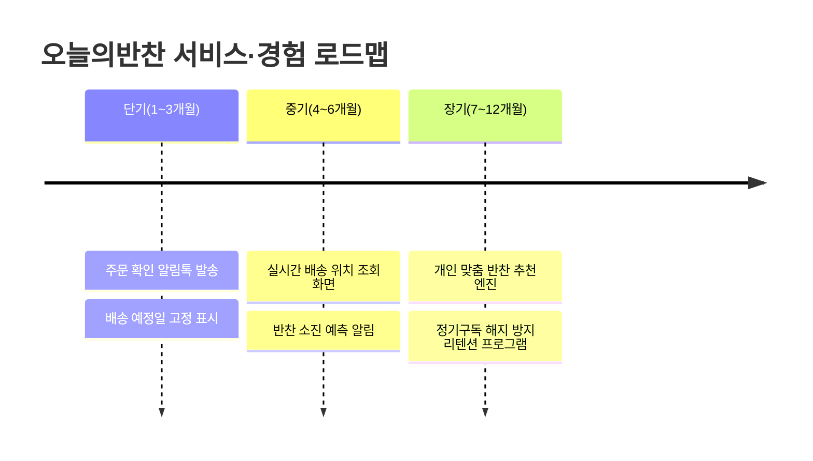
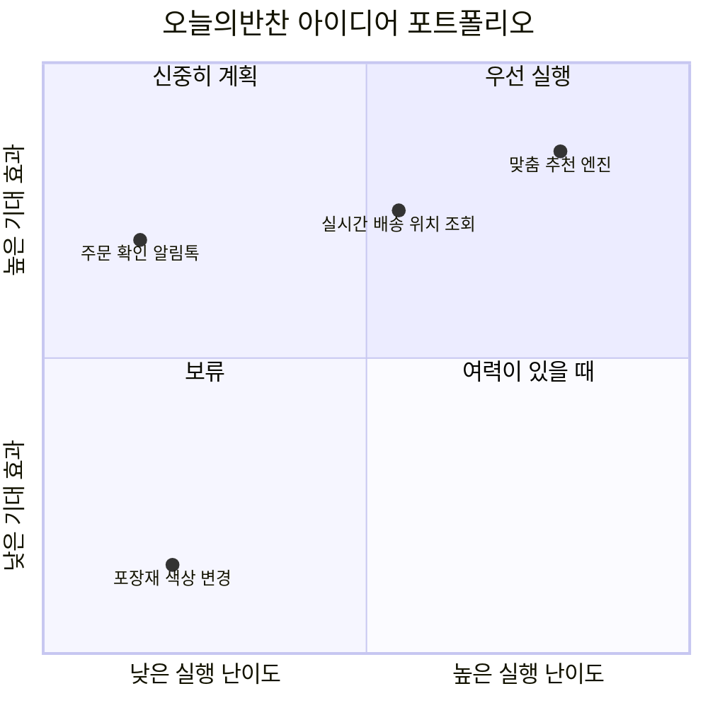

<Callout type="info">
  **이번 문서의 목표:** 지금까지 만든 리서치·페르소나·여정지도·블루프린트 같은 조각 산출물을 하나의 서비스·경험 모델 문서로 통합하고, 서비스·경험 로드맵과 아이디어 포트폴리오를 케이스에 맞춰 표로 직접 완성할 수 있게 된다.
</Callout>

## 1. 왜 산출물을 다시 하나로 묶어야 하는가

09편부터 20편까지 리서치 자료 종합, 페르소나, 고객 여정 지도, 이해관계자 맵, 디자인 콘셉트, 아이디어 워크숍 결과, 프로토타입, 시나리오, 서비스 블루프린트까지 여러 산출물을 각각 따로 만들었습니다. 문제는 여기서 생깁니다. 의사결정권자나 발주처는 이 조각들을 한 장씩 순서 없이 받으면 전체 그림을 이해하지 못합니다. 어떤 산출물이 먼저 나온 근거이고, 어떤 산출물이 그 결론인지 연결이 끊겨 보이기 때문입니다.

> **쉽게 말하면:** 지금까지 그린 여러 장의 조각 그림을 하나의 액자에 순서대로 넣어, 처음 보는 사람도 완성된 그림 전체를 이해하게 만드는 작업입니다.

**서비스·경험 모델 문서화**(service experience model documentation)는 프로젝트 전 과정에서 나온 산출물을 논리적 순서(문제 정의 → 근거 → 해법 → 검증)로 재배열해 하나의 보고서 또는 제안서 형태로 정리하는 작업입니다. 새로운 내용을 만드는 것이 아니라, 이미 만든 산출물을 **읽는 사람의 이해 순서**에 맞게 재구성하는 것이 핵심입니다.

### 통합 문서의 구성 순서

| 섹션 | 포함 산출물 | 이 섹션에서 전달하는 메시지 |
|------|-------------|------------------------------|
| 배경과 목표 | 제안서(05편) 요약 | 왜 이 프로젝트를 시작했는가 |
| 리서치 근거 | 데스크 리서치·관찰조사·면접조사·어피니티 다이어그램 요약(06–09편) | 무엇을 조사해서 무엇을 알아냈는가 |
| 사용자와 이해관계자 이해 | 페르소나·이해관계자 맵(10편, 12편) | 누구를 위한 서비스인가 |
| 경험의 전체 흐름 | 고객 여정 지도(11편) | 사용자가 지금 어떤 경험을 하는가 |
| 해법 | 디자인 콘셉트·아이디어·프로토타입(13–18편) | 무엇을 새로 만들었는가 |
| 실행 설계 | 시나리오·서비스 블루프린트(19–20편) | 그 해법이 실제로 어떻게 작동하는가 |
| 향후 계획 | 로드맵·포트폴리오(이 편) | 무엇을 언제 실행하는가 |

이 순서는 임의가 아닙니다. **왜(배경) → 근거(리서치) → 대상(사용자) → 현재 문제(여정) → 해법(콘셉트) → 작동 방식(블루프린트) → 실행 계획(로드맵)** 순서로, 읽는 사람이 앞 섹션의 결론을 다음 섹션의 전제로 자연스럽게 받아들이도록 배치했습니다.

**자주 틀리는 점:** 산출물을 만든 시간 순서 그대로 나열하는 경우가 많습니다. 워크숍에서 나온 아이디어 20개를 전부 문서에 옮기거나, 인터뷰 녹취를 그대로 붙여 넣는 식입니다. 통합 문서는 **작업 기록이 아니라 설득 문서**이므로, 각 섹션은 다음 섹션으로 이어지는 결론만 남기고 나머지는 부록으로 돌립니다.

## 2. 사용자 경험 변화 예측과 서비스·경험 로드맵

### 왜 필요한가

새 서비스는 한 번에 완성되지 않습니다. 예산과 인력은 한정되어 있고, 어떤 터치포인트는 당장 바꿀 수 있지만 어떤 터치포인트는 시스템 개편이 끝나야 손댈 수 있습니다. 우선순위 없이 아이디어를 나열하면 실행 단계에서 무엇부터 해야 할지 아무도 결정하지 못합니다.

> **쉽게 말하면:** 지금(as-is) 상태에서 목표(to-be) 상태까지 가는 길을, 시간 순서대로 표시한 지도입니다.

**서비스·경험 로드맵**(service experience roadmap)은 시간 축(단기·중기·장기)을 기준으로, 어떤 터치포인트와 기능을 언제 도입할지 배열한 계획표입니다. 20편의 서비스 블루프린트가 "어떻게 작동하는가"를 보여준다면, 로드맵은 "언제 순서대로 만드는가"를 보여줍니다.

### 케이스로 로드맵 채우기

가상 서비스 **오늘의반찬**(1인 가구 대상 반찬 정기구독 서비스)을 예로 듭니다. 리서치에서 확인한 현재 경험(as-is)의 문제는 "주문 후 배송까지 무슨 일이 일어나는지 알 수 없어 불안하다"였고, 목표 경험(to-be)은 "언제 어떤 상태인지 실시간으로 확인할 수 있다"입니다.

**서술 답안 예시 — 로드맵 표 양식과 작성 순서**

<Steps>

1. **현재 경험(as-is)과 목표 경험(to-be)을 한 문장씩 정리한다** — 11편 여정지도에서 확인한 감정 저점을 그대로 옮겨 온다
2. **후보 아이디어를 실행 난이도 기준으로 분류한다** — 기존 시스템 수정만으로 되는지, 새 기능 개발이 필요한지, 조직 개편까지 필요한지
3. **난이도가 낮고 사용자 불만이 큰 항목부터 단기에 배치한다**
4. **단기 항목이 완료되어야 가능한 항목을 중기·장기에 순서대로 배치한다** — 선행 조건이 있는 항목을 앞 단계에 두지 않는다
5. **각 단계마다 그 단계가 끝났을 때 사용자 경험이 어떻게 달라지는지 한 문장으로 적는다**

</Steps>

| 시기 | 실행 항목 | 선행 조건 | 이 단계 종료 후 달라지는 경험 |
|------|-----------|-----------|-------------------------------|
| 단기(1–3개월) | 주문 확인 알림톡, 배송 예정일 고정 표시 | 없음 | 주문 직후 불안감이 사라짐 |
| 중기(4–6개월) | 실시간 배송 위치 조회, 소진 예측 알림 | 알림 인프라 구축 완료 | 배송 중에도 상태를 스스로 확인함 |
| 장기(7–12개월) | 맞춤 추천 엔진, 해지 방지 리텐션 | 주문·소진 데이터 6개월 누적 | 서비스가 먼저 필요를 예측해 제안함 |

**자주 틀리는 점:** 시급성만 보고 배치하면, 데이터가 아직 쌓이지 않은 "맞춤 추천 엔진" 같은 항목을 단기에 넣는 실수가 나옵니다. 로드맵은 **선행 조건**, 곧 무엇이 갖춰져야 그 항목이 가능한지를 반드시 표에 함께 적어야 채점자가 논리적 순서를 확인할 수 있습니다.

## 3. 서비스·경험 아이디어 포트폴리오

### 정의와 목적

워크숍(14편)과 아이디어 구체화(15편)를 거치면 실행 후보 아이디어가 여러 개 남습니다. 모두 동시에 실행할 수는 없으므로, **기대 효과**와 **실행 난이도** 두 축으로 아이디어를 배치해 우선순위를 한눈에 보여주는 것이 **서비스·경험 아이디어 포트폴리오**(idea portfolio)입니다.

> **쉽게 말하면:** 아이디어들을 "효과는 큰데 하기 쉬운 것부터, 효과도 작고 하기도 어려운 것은 나중으로" 순서를 매겨 그림 하나로 보여주는 표입니다.

**해석:** 사분면 중 기대 효과와 실행 난이도가 모두 낮은 "포장재 색상 변경" 같은 항목은 보류합니다. 반대로 실행 난이도는 낮은데 기대 효과가 큰 "주문 확인 알림톡"이 우선 실행 대상이 되며, 이 결과는 앞서 만든 로드맵의 단기 항목과 서로 일치해야 합니다. 두 산출물이 어긋나 있으면(포트폴리오에서는 우선순위가 낮은데 로드맵 단기에 들어가 있는 경우) 답안 감점 요인입니다.

**자주 틀리는 점:** 기대 효과를 담당자의 주관적 선호로 판단하는 경우가 많습니다. 기대 효과는 반드시 09편 어피니티 다이어그램이나 11편 여정지도에서 확인한 **감정 저점의 크기**, 즉 실제로 몇 명의 사용자가 그 지점에서 불편을 겪었는지에 근거해야 합니다.

## 4. 통합 문서화 실습 — 케이스 전체 흐름 정리

<Steps>

1. **배경과 목표를 한 단락으로 요약한다** — "1인 가구 반찬 배송에서 주문 후 불안감을 해소한다"
2. **리서치에서 확인한 핵심 문제 3가지를 불릿으로 정리한다**
3. **대표 페르소나 1명과 여정지도의 감정 저점 1곳을 인용한다** — "자세한 내용은 10편, 11편 참고"라고 표기해 본문 재설명을 생략한다
4. **디자인 콘셉트와 서비스 블루프린트의 핵심 개선 지점을 한 문단으로 연결한다**
5. **로드맵 표와 포트폴리오 매트릭스를 함께 제시해 "무엇을, 왜 그 순서로" 실행하는지 근거를 남긴다**

</Steps>

이 다섯 단계를 하나의 답안지 안에서 순서대로 서술하면, 채점자는 산출물 하나하나가 아니라 **문제에서 해법까지 이어지는 논리**를 확인할 수 있습니다. 실기 답안에서 감점되는 가장 흔한 이유는 산출물을 개별적으로는 잘 만들었지만 서로 연결하지 못하는 경우입니다.

## 핵심 정리

- 서비스·경험 모델 문서화는 산출물을 시간 순서가 아니라 **배경 → 근거 → 대상 → 현재 문제 → 해법 → 작동 방식 → 실행 계획**의 논리 순서로 재배열하는 작업이다.
- 서비스·경험 로드맵은 단기·중기·장기 축으로 실행 항목을 배치하며, 각 항목의 **선행 조건**을 반드시 함께 표기해야 한다.
- 아이디어 포트폴리오는 **기대 효과 x 실행 난이도** 매트릭스이며, 기대 효과는 리서치에서 확인된 감정 저점의 크기에 근거해야 한다.
- 로드맵의 단기 항목과 포트폴리오의 우선 실행 항목은 서로 일치해야 하며, 어긋나면 근거 부족으로 감점된다.
- 통합 문서는 산출물의 나열이 아니라, 문제에서 해법까지 이어지는 논리를 보여주는 것이 목적이다.

## 마무리 복습

<Quiz
  questionNumber={1}
  question="서비스·경험 모델 문서화에서 산출물을 배열하는 기준으로 가장 적절한 것은?"
  options={['산출물을 만든 작업 시간 순서', '문제에서 해법으로 이어지는 논리 순서', '산출물의 분량이 많은 순서', '팀원별로 담당한 산출물 순서']}
  correctAnswer={2}
  explanation="통합 문서는 읽는 사람이 앞 섹션의 결론을 다음 섹션의 전제로 받아들이도록 배경-근거-대상-현재 문제-해법-작동 방식-실행 계획의 논리 순서로 구성해야 한다."
  optionExplanations={['작업한 순서와 읽는 사람이 이해해야 하는 순서는 다를 수 있다.', '문제에서 해법까지 이어지는 논리를 보여주는 것이 통합 문서의 목적이다.', '분량은 논리적 연결과 무관한 기준이다.', '담당자 기준은 읽는 사람의 이해와 무관하다.']}
/>

<Quiz
  questionNumber={2}
  question="서비스·경험 로드맵 표에 반드시 함께 표기해야 하는 항목으로 가장 적절한 것은?"
  options={['각 실행 항목의 예상 비용', '각 실행 항목의 선행 조건', '각 실행 항목을 제안한 팀원 이름', '각 실행 항목의 디자인 시안 색상']}
  correctAnswer={2}
  explanation="로드맵은 시간 순서대로 항목을 배치하는 것이 목적이므로, 무엇이 갖춰져야 그 항목이 가능한지를 나타내는 선행 조건을 함께 표기해야 채점자가 배치의 논리적 타당성을 확인할 수 있다."
  optionExplanations={['비용은 로드맵의 핵심 판단 근거가 아니다.', '선행 조건이 있어야 왜 그 시기에 배치했는지 근거가 성립한다.', '제안자 이름은 실행 순서와 무관하다.', '디자인 시안 색상은 로드맵의 판단 기준이 아니다.']}
/>

<Quiz
  questionNumber={3}
  question="아이디어 포트폴리오에서 기대 효과를 판단하는 근거로 가장 적절한 것은?"
  options={['담당자의 개인적 선호도', '리서치에서 확인된 감정 저점의 크기', '아이디어를 발표한 순서', '아이디어의 시각적 완성도']}
  correctAnswer={2}
  explanation="기대 효과는 어피니티 다이어그램이나 여정지도에서 확인한 실제 사용자 불편의 크기, 곧 감정 저점에 근거해야 하며 주관적 선호로 판단하면 안 된다."
  optionExplanations={['주관적 선호는 근거로 삼기 부적절하다.', '리서치에서 확인된 실제 데이터를 근거로 삼아야 한다.', '발표 순서는 효과와 무관하다.', '시각적 완성도는 기대 효과의 판단 기준이 아니다.']}
/>

<Quiz
  questionNumber={4}
  question="아이디어 포트폴리오와 서비스·경험 로드맵의 관계에 대한 설명으로 가장 적절한 것은?"
  options={['두 산출물은 서로 독립적이라 내용이 달라도 무방하다', '포트폴리오의 우선 실행 항목과 로드맵의 단기 항목은 서로 일치해야 한다', '로드맵이 먼저 확정되면 포트폴리오는 만들 필요가 없다', '포트폴리오는 장기 계획, 로드맵은 단기 계획만 다룬다']}
  correctAnswer={2}
  explanation="포트폴리오에서 우선 실행으로 분류된 항목이 로드맵의 단기 항목과 어긋나면 근거 부족으로 감점되므로, 두 산출물의 우선순위는 서로 일치해야 한다."
  optionExplanations={['두 산출물이 어긋나면 근거 부족으로 감점 요인이 된다.', '우선순위 판단이 일치해야 논리가 성립한다.', '로드맵의 배치 근거를 제공하는 것이 포트폴리오이므로 생략할 수 없다.', '로드맵은 단기부터 장기까지 모두 다루므로 옳지 않다.']}
/>

<Quiz
  questionNumber={5}
  question="통합 문서화 실습에서 이전 편(예: 페르소나, 여정지도)의 내용을 다룰 때 가장 적절한 방식은?"
  options={['해당 편의 전체 내용을 다시 완전히 재작성한다', '핵심 결론만 한두 문장으로 인용하고 해당 편을 참고하도록 표기한다', '해당 산출물은 통합 문서에서 완전히 제외한다', '산출물 제목만 나열하고 내용은 언급하지 않는다']}
  correctAnswer={2}
  explanation="이미 만든 산출물의 전체 내용을 다시 설명할 필요는 없다. 핵심 결론만 한두 문장으로 요약해 인용하고 자세한 내용은 해당 편을 참고하도록 안내하는 것이 통합 문서의 목적에 맞다."
  optionExplanations={['전체 재작성은 통합 문서의 목적과 맞지 않는 중복 작업이다.', '핵심만 인용하고 출처를 표기하는 것이 효율적이고 정확하다.', '핵심 근거이므로 완전히 제외하면 논리가 끊긴다.', '제목만으로는 논리적 연결을 보여줄 수 없다.']}
/>

<Quiz
  questionNumber={6}
  question="오늘의반찬 사례에서 맞춤 추천 엔진을 단기(1~3개월) 로드맵에 배치하지 않는 이유로 가장 적절한 것은?"
  options={['맞춤 추천 엔진은 기대 효과가 낮기 때문이다', '주문과 소진 데이터가 충분히 쌓여야 가능한 선행 조건이 있기 때문이다', '팀원들이 그 아이디어를 선호하지 않기 때문이다', '디자인 시안이 아직 완성되지 않았기 때문이다']}
  correctAnswer={2}
  explanation="맞춤 추천 엔진은 기대 효과가 낮은 것이 아니라, 데이터가 6개월 이상 누적되어야 작동할 수 있다는 선행 조건 때문에 장기로 배치된다."
  optionExplanations={['포트폴리오에서 기대 효과가 가장 큰 항목으로 분류되었다.', '데이터 누적이라는 선행 조건이 충족되어야 하므로 장기에 배치한다.', '선호도는 로드맵 배치의 판단 기준이 아니다.', '시안 완성 여부는 선행 조건으로 제시된 근거가 아니다.']}
/>

## 참고 자료

- [한국산업인력공단 - 서비스·경험디자인 기사 출제기준(필기·실기)](https://t1.daumcdn.net/brunch/service/user/13ur/file/tayw3sSk4ib3un2lLq5U249xKUg.pdf)
