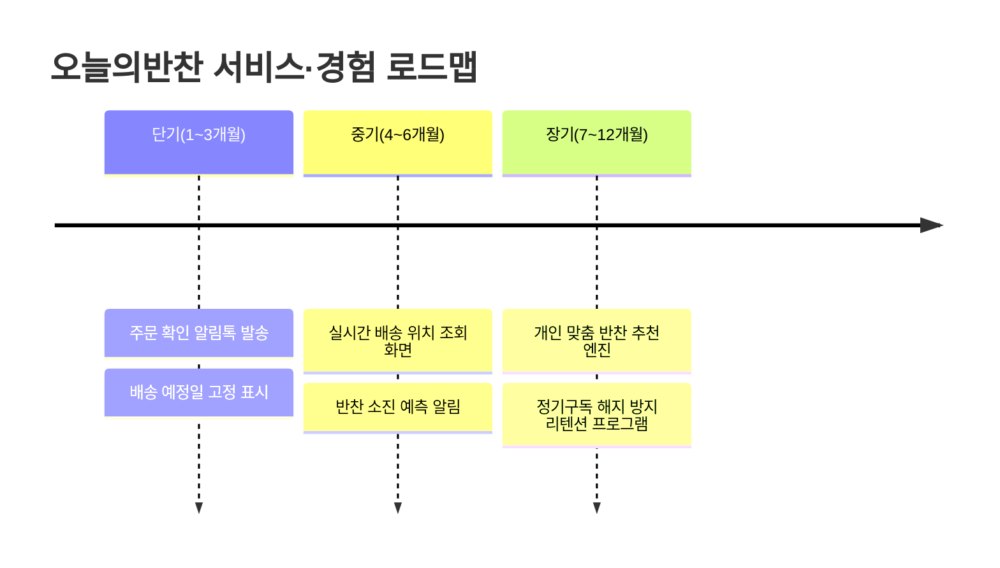
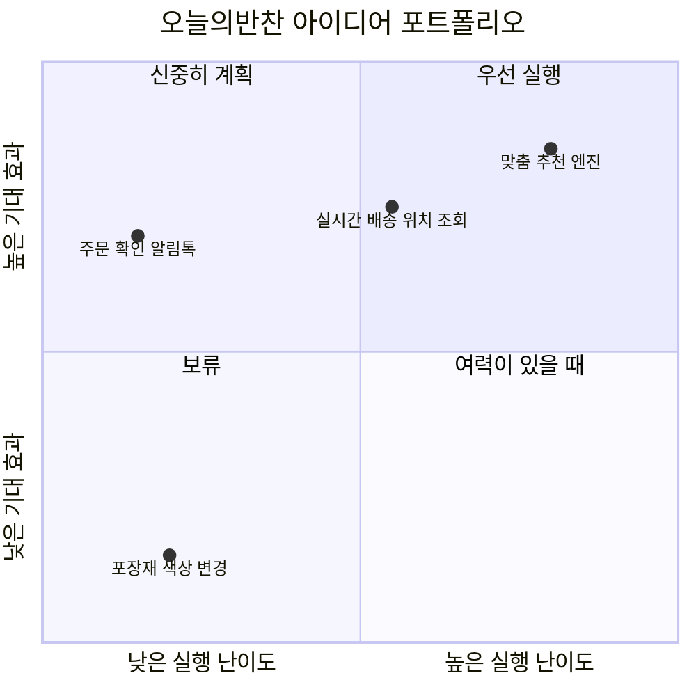

## 1. 왜 산출물을 다시 하나로 묶어야 하는가

09편부터 20편까지 리서치 자료 종합, 페르소나, 고객 여정 지도, 이해관계자 맵, 디자인 콘셉트, 아이디어 워크숍 결과, 프로토타입, 시나리오, 서비스 블루프린트까지 여러 산출물을 각각 따로 만들었습니다. 문제는 여기서 생깁니다.

**서비스·경험 모델 문서화**(service experience model documentation)는 프로젝트 전 과정에서 나온 산출물을 논리적 순서(문제 정의 → 근거 → 해법 → 검증)로 재배열해 하나의 보고서 또는 제안서 형태로 정리하는 작업입니다. 새로운 내용을 만드는 것이 아니라, 이미 만든 산출물을 **읽는 사람의 이해 순서**에 맞게 재구성하는 것이 핵심입니다.

### 통합 문서의 구성 순서

| 섹션 | 포함 산출물 | 이 섹션에서 전달하는 메시지 |
|------|-------------|------------------------------|
| 배경과 목표 | 제안서(05편) 요약 | 왜 이 프로젝트를 시작했는가 |
| 리서치 근거 | 데스크 리서치·관찰조사·면접조사·어피니티 다이어그램 요약(06–09편) | 무엇을 조사해서 무엇을 알아냈는가 |
| 사용자와 이해관계자 이해 | 페르소나·이해관계자 맵(10편, 12편) | 누구를 위한 서비스인가 |
| 경험의 전체 흐름 | 고객 여정 지도(11편) | 사용자가 지금 어떤 경험을 하는가 |
| 해법 | 디자인 콘셉트·아이디어·프로토타입(13–18편) | 무엇을 새로 만들었는가 |
| 실행 설계 | 시나리오·서비스 블루프린트(19–20편) | 그 해법이 실제로 어떻게 작동하는가 |
| 향후 계획 | 로드맵·포트폴리오(이 편) | 무엇을 언제 실행하는가 |

이 순서는 임의가 아닙니다. **왜(배경) → 근거(리서치) → 대상(사용자) → 현재 문제(여정) → 해법(콘셉트) → 작동 방식(블루프린트) → 실행 계획(로드맵)** 순서로, 읽는 사람이 앞 섹션의 결론을 다음 섹션의 전제로 자연스럽게 받아들이도록 배치했습니다.

**자주 틀리는 점:** 산출물을 만든 시간 순서 그대로 나열하는 경우가 많습니다. 워크숍에서 나온 아이디어 20개를 전부 문서에 옮기거나, 인터뷰 녹취를 그대로 붙여 넣는 식입니다. 통합 문서는 **작업 기록이 아니라 설득 문서**이므로, 각 섹션은 다음 섹션으로 이어지는 결론만 남기고 나머지는 부록으로 돌립니다.

## 2. 사용자 경험 변화 예측과 서비스·경험 로드맵

### 케이스로 로드맵 채우기

가상 서비스 **오늘의반찬**(1인 가구 대상 반찬 정기구독 서비스)을 예로 듭니다. 리서치에서 확인한 현재 경험(as-is)의 문제는 "주문 후 배송까지 무슨 일이 일어나는지 알 수 없어 불안하다"였고, 목표 경험(to-be)은 "언제 어떤 상태인지 실시간으로 확인할 수 있다"입니다.

```mermaid
timeline
    title 오늘의반찬 서비스·경험 로드맵
    단기(1~3개월) : 주문 확인 알림톡 발송
                  : 배송 예정일 고정 표시
    중기(4~6개월) : 실시간 배송 위치 조회 화면
                  : 반찬 소진 예측 알림
    장기(7~12개월) : 개인 맞춤 반찬 추천 엔진
                   : 정기구독 해지 방지 리텐션 프로그램
```

**서술 답안 예시 — 로드맵 표 양식과 작성 순서**

| 시기 | 실행 항목 | 선행 조건 | 이 단계 종료 후 달라지는 경험 |
|------|-----------|-----------|-------------------------------|
| 단기(1–3개월) | 주문 확인 알림톡, 배송 예정일 고정 표시 | 없음 | 주문 직후 불안감이 사라짐 |
| 중기(4–6개월) | 실시간 배송 위치 조회, 소진 예측 알림 | 알림 인프라 구축 완료 | 배송 중에도 상태를 스스로 확인함 |
| 장기(7–12개월) | 맞춤 추천 엔진, 해지 방지 리텐션 | 주문·소진 데이터 6개월 누적 | 서비스가 먼저 필요를 예측해 제안함 |

**자주 틀리는 점:** 시급성만 보고 배치하면, 데이터가 아직 쌓이지 않은 "맞춤 추천 엔진" 같은 항목을 단기에 넣는 실수가 나옵니다. 로드맵은 **선행 조건**, 곧 무엇이 갖춰져야 그 항목이 가능한지를 반드시 표에 함께 적어야 채점자가 논리적 순서를 확인할 수 있습니다.

## 3. 서비스·경험 아이디어 포트폴리오

### 정의와 목적

워크숍(14편)과 아이디어 구체화(15편)를 거치면 실행 후보 아이디어가 여러 개 남습니다. 모두 동시에 실행할 수는 없으므로, **기대 효과**와 **실행 난이도** 두 축으로 아이디어를 배치해 우선순위를 한눈에 보여주는 것이 **서비스·경험 아이디어 포트폴리오**(idea portfolio)입니다.

```mermaid
quadrantChart
    title 오늘의반찬 아이디어 포트폴리오
    x-axis 낮은 실행 난이도 --> 높은 실행 난이도
    y-axis 낮은 기대 효과 --> 높은 기대 효과
    quadrant-1 우선 실행
    quadrant-2 신중히 계획
    quadrant-3 보류
    quadrant-4 여력이 있을 때
    주문 확인 알림톡: [0.15, 0.7]
    실시간 배송 위치 조회: [0.55, 0.75]
    맞춤 추천 엔진: [0.8, 0.85]
    포장재 색상 변경: [0.2, 0.15]
```

**해석:** 사분면 중 기대 효과와 실행 난이도가 모두 낮은 "포장재 색상 변경" 같은 항목은 보류합니다. 반대로 실행 난이도는 낮은데 기대 효과가 큰 "주문 확인 알림톡"이 우선 실행 대상이 되며, 이 결과는 앞서 만든 로드맵의 단기 항목과 서로 일치해야 합니다.

**자주 틀리는 점:** 기대 효과를 담당자의 주관적 선호로 판단하는 경우가 많습니다. 기대 효과는 반드시 09편 어피니티 다이어그램이나 11편 여정지도에서 확인한 **감정 저점의 크기**, 즉 실제로 몇 명의 사용자가 그 지점에서 불편을 겪었는지에 근거해야 합니다.

## 핵심 정리

- 서비스·경험 모델 문서화는 산출물을 시간 순서가 아니라 **배경 → 근거 → 대상 → 현재 문제 → 해법 → 작동 방식 → 실행 계획**의 논리 순서로 재배열하는 작업이다.
- 서비스·경험 로드맵은 단기·중기·장기 축으로 실행 항목을 배치하며, 각 항목의 **선행 조건**을 반드시 함께 표기해야 한다.
- 아이디어 포트폴리오는 **기대 효과 x 실행 난이도** 매트릭스이며, 기대 효과는 리서치에서 확인된 감정 저점의 크기에 근거해야 한다.
- 로드맵의 단기 항목과 포트폴리오의 우선 실행 항목은 서로 일치해야 하며, 어긋나면 근거 부족으로 감점된다.
- 통합 문서는 산출물의 나열이 아니라, 문제에서 해법까지 이어지는 논리를 보여주는 것이 목적이다.

## 마무리 복습

<Quiz
  questionNumber={1}
  question={"서비스·경험 모델 문서화에서 산출물을 배열하는 기준으로 가장 적절한 것은?"}
  options={["산출물을 만든 작업 시간 순서","문제에서 해법으로 이어지는 논리 순서","산출물의 분량이 많은 순서","팀원별로 담당한 산출물 순서"]}
  correctAnswer={2}
  explanation={"통합 문서는 읽는 사람이 앞 섹션의 결론을 다음 섹션의 전제로 받아들이도록 배경-근거-대상-현재 문제-해법-작동 방식-실행 계획의 논리 순서로 구성해야 한다."}
/>

<Quiz
  questionNumber={2}
  question={"서비스·경험 로드맵 표에 반드시 함께 표기해야 하는 항목으로 가장 적절한 것은?"}
  options={["각 실행 항목의 예상 비용","각 실행 항목의 선행 조건","각 실행 항목을 제안한 팀원 이름","각 실행 항목의 디자인 시안 색상"]}
  correctAnswer={2}
  explanation={"로드맵은 시간 순서대로 항목을 배치하는 것이 목적이므로, 무엇이 갖춰져야 그 항목이 가능한지를 나타내는 선행 조건을 함께 표기해야 채점자가 배치의 논리적 타당성을 확인할 수 있다."}
/>

<Quiz
  questionNumber={3}
  question={"아이디어 포트폴리오에서 기대 효과를 판단하는 근거로 가장 적절한 것은?"}
  options={["담당자의 개인적 선호도","리서치에서 확인된 감정 저점의 크기","아이디어를 발표한 순서","아이디어의 시각적 완성도"]}
  correctAnswer={2}
  explanation={"기대 효과는 어피니티 다이어그램이나 여정지도에서 확인한 실제 사용자 불편의 크기, 곧 감정 저점에 근거해야 하며 주관적 선호로 판단하면 안 된다."}
/>

## 참고 자료

- [한국산업인력공단 - 서비스·경험디자인 기사 출제기준(필기·실기)](https://t1.daumcdn.net/brunch/service/user/13ur/file/tayw3sSk4ib3un2lLq5U249xKUg.pdf)
