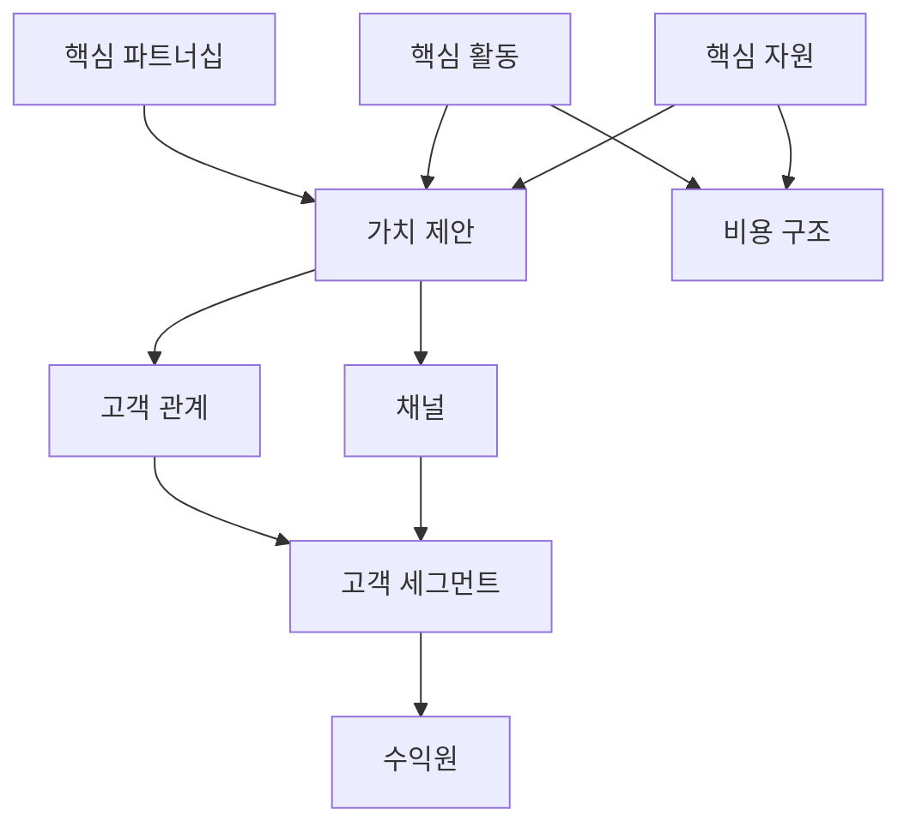

<Callout type="info">
  **이번 문서의 목표:** 비즈니스 모델 캔버스 9개 블록의 뜻을 정확히 구분하고, 케이스에 맞춰 표를 직접 완성하며, 디자인 콘셉트가 왜 지속 가능한 사업인지 서술형 답안으로 연결할 수 있게 된다.
</Callout>

## 1. 왜 디자인 콘셉트만으로는 부족한가

13편에서 다룬 디자인 콘셉트는 "사용자에게 무엇을 제공할 것인가"를 정합니다. 그런데 실무와 실기 답안 모두에서 이 질문만으로는 끝나지 않습니다. 그 서비스를 계속 운영할 돈이 어디서 나오는지, 누가 그 서비스를 계속 만들어 주는지가 함께 서술되지 않으면 "좋은 아이디어인데 사업으로는 성립하지 않는" 답안이 됩니다.

> **쉽게 말하면:** 디자인 콘셉트가 "무엇을 만들 것인가"라면, 비즈니스 모델은 "그것을 팔아서 어떻게 계속 굴러가게 할 것인가"입니다.

## 2. 비즈니스 모델 캔버스 9개 블록

**비즈니스 모델 캔버스**(Business Model Canvas, BMC)는 알렉스 오스터왈더가 제안한 도구로, 한 장의 표 위에 사업의 아홉 가지 구성 요소를 배치해 전체 구조를 한눈에 파악하게 합니다.

| 블록 | 정의 | 채워야 할 질문 |
|------|------|------------------|
| 고객 세그먼트(Customer Segments) | 서비스가 가치를 제공하려는 사용자 집단 | 누구를 위한 서비스인가 |
| 가치 제안(Value Proposition) | 고객의 문제를 해결하거나 필요를 채워 주는 제품·서비스의 핵심 | 왜 이 서비스를 선택하는가 |
| 채널(Channels) | 가치 제안을 고객에게 전달하는 경로 | 어떻게 알리고 전달하는가 |
| 고객 관계(Customer Relationships) | 고객과 맺는 관계의 형태 | 어떻게 관계를 유지하는가 |
| 수익원(Revenue Streams) | 고객이 지불하는 대가와 방식 | 무엇으로 돈을 버는가 |
| 핵심 자원(Key Resources) | 가치 제안을 만드는 데 필요한 자원 | 무엇을 갖추어야 하는가 |
| 핵심 활동(Key Activities) | 가치 제안을 만들기 위한 주요 활동 | 무엇을 해야 하는가 |
| 핵심 파트너십(Key Partnerships) | 외부에서 협력해야 하는 대상 | 누구와 협력하는가 |
| 비용 구조(Cost Structure) | 사업 운영에 드는 주요 비용 항목 | 무엇에 돈이 드는가 |

**자주 틀리는 점:** 고객 세그먼트와 가치 제안을 뒤바꿔 서술하는 경우가 많습니다. 고객 세그먼트는 "누구"를 답하고 가치 제안은 "무엇을 얻는가"를 답합니다. 예를 들어 "1인 가구"는 고객 세그먼트이고, "요리 시간을 줄여 준다"는 가치 제안입니다. 답안에서 이 둘을 같은 문장으로 뭉뚱그리면 감점됩니다.

### 아홉 블록의 배치 논리

**해석:** 왼쪽(파트너십·활동·자원)은 서비스를 **만드는 쪽**, 오른쪽(관계·채널·세그먼트)은 서비스를 **전달받는 쪽**입니다. 가치 제안이 그 둘을 잇는 다리 역할을 하고, 아래쪽의 비용 구조와 수익원은 각각 왼쪽 활동에서 나가는 돈과 오른쪽 세그먼트에서 들어오는 돈을 나타냅니다.

## 3. 서술 답안 예시 — 비즈니스 모델 캔버스를 표로 완성하기

가상 서비스 **오늘의반찬**(1인 가구 대상 반찬 정기구독 서비스)을 케이스로, 21편에서 정리한 페르소나·여정지도·디자인 콘셉트를 근거로 캔버스를 채웁니다.

<Steps>

1. **고객 세그먼트부터 채운다** — 10편 페르소나에서 정의한 핵심 사용자를 그대로 옮긴다
2. **가치 제안을 고객 세그먼트의 불편과 1대1로 연결해 적는다** — 11편 여정지도의 감정 저점을 근거로 삼는다
3. **가치 제안을 실제로 전달·유지하는 채널과 고객 관계를 적는다**
4. **가치 제안을 만드는 데 필요한 핵심 활동·자원·파트너십을 적는다** — 왼쪽 블록은 오른쪽 블록을 뒷받침해야 한다
5. **마지막으로 수익원과 비용 구조를 적는다** — 수익원은 고객 세그먼트가 지불하는 방식과 일치해야 하고, 비용 구조는 핵심 활동·자원에서 발생하는 항목과 일치해야 한다

</Steps>

| 블록 | 오늘의반찬 작성 예시 |
|------|------------------------|
| 고객 세그먼트 | 20–30대 1인 가구, 평일 저녁 요리에 쓸 시간이 부족한 직장인 |
| 가치 제안 | 매일 다른 반찬을 정기 배송해 요리 시간과 잔반 고민을 동시에 줄여 준다 |
| 채널 | 모바일 앱 정기구독 신청, SNS 시식 후기 광고, 첫 구독자 대상 앱 내 튜토리얼 |
| 고객 관계 | 개인 취향 기반 반찬 구성 추천, 배송 상태 실시간 알림을 통한 신뢰 유지 |
| 수익원 | 월 정기구독료, 1회성 단품 주문 추가 결제, 명절 특별 반찬 세트 판매 |
| 핵심 자원 | 반찬 제조 위탁 공장, 냉장 물류망, 구독 관리·추천 시스템 |
| 핵심 활동 | 매주 메뉴 기획, 품질 검수, 배송 스케줄 관리, 구독자 피드백 반영 |
| 핵심 파트너십 | 반찬 제조업체, 냉장 배송 전문업체, 지역 농산물 공급처 |
| 비용 구조 | 원재료·제조 위탁비, 냉장 물류비, 앱 유지·개발비, 마케팅비 |

**표를 완성한 뒤 반드시 확인할 것:** 가치 제안 행이 고객 세그먼트 행의 문제와 정확히 짝지어지는지, 수익원 행의 결제 방식이 채널 행에서 안내한 방식과 어긋나지 않는지 다시 읽어 봅니다. 아홉 칸을 각각 독립적으로 채우면 칸마다는 그럴듯해도 전체가 하나의 사업으로 이어지지 않는 답안이 됩니다.

## 4. 가치 제안과 핵심 사용자 요구 연결하기

### 가치 제안 캔버스로 짝짓기

가치 제안이 겉핥기로 끝나지 않으려면, 고객이 해결하려는 일(Job)과 그 과정에서 겪는 불편(Pain), 얻고 싶은 이득(Gain)을 먼저 정리하고 서비스가 그것에 어떻게 대응하는지 짝지어야 합니다.

| 고객 측 | 오늘의반찬 사례 | 서비스 측 대응 |
|---------|-------------------|-------------------|
| 해결하려는 일(Job) | 평일 저녁 식사를 스스로 준비해야 한다 | 매일 다른 반찬 정기 배송 |
| 겪는 불편(Pain) | 장보기·조리·설거지에 드는 시간이 부담스럽다 | 바로 데워 먹을 수 있는 조리 완료 반찬 |
| 얻고 싶은 이득(Gain) | 다양한 메뉴를 먹으면서도 잔반을 남기지 않고 싶다 | 1인분 소포장, 주간 메뉴 사전 확인 |

> **쉽게 말하면:** 고객이 겪는 문제 세 가지 각각에, 서비스가 어떻게 응답하는지 한 줄씩 짝지어 보여 주는 것이 가치 제안의 검증입니다.

**자주 틀리는 점:** 서비스 측 대응란에 "편리함을 제공한다"처럼 추상적인 문장만 적는 경우가 많습니다. 실기 답안에서는 **구체적으로 무엇을 어떻게 제공하는지**(1인분 소포장, 주간 메뉴 사전 확인)까지 써야 근거로 인정됩니다.

## 5. 수익 모델과 서비스 지속가능성

### 수익 모델의 유형

| 유형 | 정의 | 오늘의반찬 적용 예 |
|------|------|------------------------|
| 정기구독형 | 일정 주기로 고정 금액을 결제 | 월 정기구독료 |
| 종량형 | 사용한 만큼 결제 | 1회성 단품 주문 |
| 프리미엄형 | 기본 기능은 무료, 추가 기능은 유료 | 기본 추천은 무료, 맞춤 영양 상담은 유료 |
| 중개 수수료형 | 거래를 연결해 주고 수수료를 받음 | 지역 반찬가게 입점 시 판매 수수료 |

**왜 유형을 구분해 서술해야 하는가:** 수익 모델 유형에 따라 필요한 핵심 자원과 활동이 달라집니다. 정기구독형은 이탈 방지를 위한 고객 관계 관리가 중요하고, 중개 수수료형은 입점 업체 관리 활동이 추가로 필요합니다. 답안에서 수익 모델만 적고 그에 따라 캔버스의 다른 블록이 어떻게 바뀌는지 연결하지 않으면 서술이 얕다는 평가를 받습니다.

### 지속가능성 서술하기

서비스 지속가능성은 단순히 "돈을 번다"는 뜻이 아니라, 비용 구조와 수익원의 균형이 시간이 지나도 유지되는지를 뜻합니다.

> **쉽게 말하면:** 오늘 하루만 이익이 나는 게 아니라, 내년에도 같은 방식으로 운영해도 손해 보지 않는 구조인지 보는 것입니다.

**점검 질문 세 가지:**

- 고객 세그먼트가 늘어나도 핵심 자원(물류망, 제조 위탁)이 감당할 수 있는가
- 수익원이 하나의 결제 방식에만 의존하지 않고 여러 갈래로 나뉘어 있는가
- 핵심 파트너십이 끊어졌을 때 대체 가능한 파트너가 있는가

## 6. 디자인 콘셉트를 사업성으로 연결해 서술하는 법

실기 답안에서 "이 디자인 콘셉트가 왜 사업적으로 타당한가"를 묻는 문제는 다음 순서로 문단을 구성하면 논리가 끊기지 않습니다.

<Steps>

1. **디자인 콘셉트를 한 문장으로 요약한다** — 13편에서 도출한 콘셉트를 그대로 인용
2. **그 콘셉트가 대응하는 핵심 사용자 요구를 제시한다** — 가치 제안 캔버스의 Pain·Gain을 인용
3. **그 가치 제안이 어떤 수익원으로 이어지는지 설명한다**
4. **그 수익원을 유지하는 데 필요한 핵심 자원·활동·비용을 제시한다**
5. **마지막으로 지속가능성 점검 질문에 대한 답을 한 문장씩 덧붙인다**

</Steps>

이 다섯 단계를 순서대로 쓰면, 채점자는 디자인 콘셉트에서 시작해 실제 사업 구조까지 하나의 근거 사슬로 읽을 수 있습니다.

## 핵심 정리

- 비즈니스 모델 캔버스의 아홉 블록 중 왼쪽(파트너십·활동·자원)은 만드는 쪽, 오른쪽(관계·채널·세그먼트)은 전달받는 쪽이며 가치 제안이 그 둘을 잇는다.
- 고객 세그먼트는 "누구"를, 가치 제안은 "무엇을 얻는가"를 답하며 이 둘을 뒤바꿔 쓰면 감점된다.
- 가치 제안은 고객의 Job·Pain·Gain에 구체적인 서비스 대응을 1대1로 짝지어야 근거로 인정된다.
- 수익 모델 유형(정기구독형·종량형·프리미엄형·중개 수수료형)에 따라 필요한 핵심 자원·활동이 달라지므로 함께 서술해야 한다.
- 지속가능성은 세그먼트 확장 대응력, 수익원의 다각화, 파트너십 대체 가능성 세 가지로 점검한다.
- 디자인 콘셉트를 사업성으로 연결할 때는 콘셉트 → 사용자 요구 → 수익원 → 비용·자원 → 지속가능성 순서로 서술한다.

## 마무리 복습

<Quiz
  questionNumber={1}
  question="비즈니스 모델 캔버스에서 고객 세그먼트와 가치 제안의 차이를 가장 정확히 설명한 것은?"
  options={['고객 세그먼트는 수익원을, 가치 제안은 비용 구조를 뜻한다', '고객 세그먼트는 누구를 위한 서비스인지를, 가치 제안은 그 고객이 무엇을 얻는지를 뜻한다', '두 블록은 같은 내용을 서로 다른 말로 표현한 것이다', '고객 세그먼트는 채널을, 가치 제안은 고객 관계를 뜻한다']}
  correctAnswer={2}
  explanation="고객 세그먼트는 서비스가 가치를 제공하려는 사용자 집단, 즉 누구를 위한 것인지를 답하고 가치 제안은 그 고객의 문제를 어떻게 해결하는지, 즉 무엇을 얻는지를 답한다."
  optionExplanations={['수익원과 비용 구조는 별도의 블록이다.', '누구를 위한 것인가와 무엇을 얻는가로 명확히 구분된다.', '두 블록을 같은 내용으로 뭉뚱그리면 감점 요인이 된다.', '채널과 고객 관계는 별도의 블록으로 존재한다.']}
/>

<Quiz
  questionNumber={2}
  question="비즈니스 모델 캔버스에서 왼쪽 블록(핵심 파트너십, 핵심 활동, 핵심 자원)의 공통된 역할로 가장 적절한 것은?"
  options={['고객에게 서비스를 전달받는 쪽을 나타낸다', '가치 제안을 만들어 내는 쪽을 나타낸다', '고객이 지불하는 금액을 나타낸다', '고객과의 관계 유지 방식을 나타낸다']}
  correctAnswer={2}
  explanation="왼쪽 블록은 서비스를 만드는 쪽으로, 가치 제안을 실제로 구현하기 위해 필요한 협력 대상·활동·자원을 나타낸다."
  optionExplanations={['전달받는 쪽은 오른쪽 블록(고객 관계, 채널, 고객 세그먼트)이다.', '가치 제안을 만드는 데 필요한 요소를 나타낸다.', '지불 금액은 수익원 블록이 나타낸다.', '관계 유지 방식은 고객 관계 블록이 나타낸다.']}
/>

<Quiz
  questionNumber={3}
  question="가치 제안 캔버스에서 고객의 Pain에 대한 서비스 측 대응을 서술할 때 가장 적절한 방식은?"
  options={['편리함을 제공한다고 추상적으로 서술한다', '구체적으로 무엇을 어떻게 제공하는지 서술한다', '경쟁사와 비교한 가격만 서술한다', '디자인 시안의 색상만 서술한다']}
  correctAnswer={2}
  explanation="추상적인 서술은 근거로 인정되지 않으며, 1인분 소포장이나 주간 메뉴 사전 확인처럼 구체적으로 무엇을 어떻게 제공하는지 서술해야 근거로 인정된다."
  optionExplanations={['추상적 서술은 실기 답안에서 근거로 인정되지 않는다.', '구체적인 서비스 요소를 제시해야 근거가 성립한다.', '가격 비교만으로는 대응 방식을 설명할 수 없다.', '색상은 가치 제안 대응과 무관하다.']}
/>

<Quiz
  questionNumber={4}
  question="수익 모델 유형과 그에 따라 함께 서술해야 하는 내용의 연결로 가장 적절한 것은?"
  options={['정기구독형은 이탈 방지를 위한 고객 관계 관리와 함께 서술한다', '종량형은 반드시 무료로 제공해야 한다', '프리미엄형은 모든 기능을 유료로만 제공한다', '중개 수수료형은 입점 업체 관리 활동을 서술할 필요가 없다']}
  correctAnswer={1}
  explanation="정기구독형 수익 모델은 고객이 이탈하면 지속적인 수익이 끊기므로 이탈 방지를 위한 고객 관계 관리 활동을 함께 서술해야 논리가 완결된다."
  optionExplanations={['이탈 방지 관리가 정기구독형의 핵심 대응 활동이다.', '종량형은 사용한 만큼 유료로 결제하는 방식이다.', '프리미엄형은 기본은 무료, 추가 기능만 유료로 제공한다.', '중개 수수료형은 입점 업체 관리 활동이 핵심 자원·활동으로 함께 서술되어야 한다.']}
/>

<Quiz
  questionNumber={5}
  question="서비스 지속가능성을 점검하는 질문으로 가장 적절하지 않은 것은?"
  options={['고객 세그먼트가 늘어나도 핵심 자원이 감당할 수 있는가', '수익원이 여러 갈래로 나뉘어 있는가', '핵심 파트너십이 끊어졌을 때 대체 가능한 파트너가 있는가', '디자인 시안의 색상이 유행에 맞는가']}
  correctAnswer={4}
  explanation="지속가능성은 비용 구조와 수익원의 균형이 시간이 지나도 유지되는지를 뜻하며, 자원 확장성·수익원 다각화·파트너 대체 가능성으로 점검한다. 디자인 시안 색상 유행 여부는 관련 없는 기준이다."
  optionExplanations={['자원 확장성은 지속가능성의 핵심 점검 항목이다.', '수익원 다각화는 지속가능성의 핵심 점검 항목이다.', '파트너 대체 가능성은 지속가능성의 핵심 점검 항목이다.', '색상 유행 여부는 사업 지속가능성과 무관한 기준이다.']}
/>

<Quiz
  questionNumber={6}
  question="디자인 콘셉트를 사업성으로 연결해 서술하는 답안의 순서로 가장 적절한 것은?"
  options={['비용 구조, 콘셉트, 수익원, 사용자 요구 순서', '콘셉트, 사용자 요구, 수익원, 비용·자원, 지속가능성 순서', '지속가능성, 사용자 요구, 콘셉트 순서', '수익원, 비용, 콘셉트, 사용자 요구 순서']}
  correctAnswer={2}
  explanation="콘셉트를 요약한 뒤 그것이 대응하는 사용자 요구를 제시하고, 그 가치 제안이 이어지는 수익원과 이를 뒷받침하는 비용·자원을 설명한 다음 지속가능성을 점검하는 순서가 근거 사슬을 자연스럽게 연결한다."
  optionExplanations={['콘셉트가 먼저 제시되어야 이후 근거가 성립한다.', '콘셉트에서 시작해 사용자 요구, 수익원, 비용·자원, 지속가능성으로 이어지는 것이 자연스러운 근거 사슬이다.', '지속가능성 점검은 앞선 근거가 갖춰진 뒤 마지막에 이루어져야 한다.', '수익원 서술에 앞서 콘셉트와 사용자 요구가 먼저 제시되어야 한다.']}
/>

## 참고 자료

- [한국산업인력공단 - 서비스·경험디자인 기사 출제기준(필기·실기)](https://t1.daumcdn.net/brunch/service/user/13ur/file/tayw3sSk4ib3un2lLq5U249xKUg.pdf)
