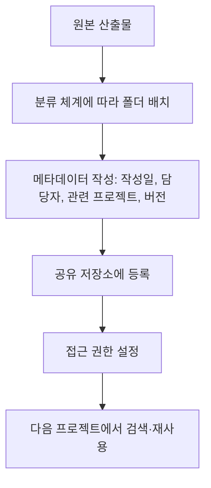

<Callout type="info">
  **이번 문서의 목표:** 프로젝트 종료 시점에 완료보고서를 정해진 순서로 작성하고, 산출물을 분류·보존하는 사후관리 계획을 세우며, 상표권·특허권·디자인 출원·저작권 네 가지 지식재산권을 구분해 서술할 수 있게 된다.
</Callout>

## 1. 왜 프로젝트가 끝나도 문서화가 끝나지 않는가

21편부터 23편까지 통합 문서, 비즈니스 모델, 사용성 평가까지 마쳤습니다. 여기서 프로젝트를 그대로 종료하면 두 가지 손실이 생깁니다. 첫째, 이 프로젝트에서 얻은 지식(어떤 리서치 방법이 효과적이었는지, 어떤 산출물 양식이 이해관계자 설득에 유리했는지)이 다음 프로젝트로 이어지지 않습니다. 둘째, 애써 만든 산출물이 담당자의 개인 컴퓨터에만 남아 있다가 조직 개편이나 담당자 교체와 함께 사라집니다.

> **쉽게 말하면:** 여행을 다녀온 뒤 사진과 기록을 정리해 앨범으로 남기지 않으면, 시간이 지나 무엇을 봤는지조차 기억나지 않는 것과 같습니다.

## 2. 완료보고서 작성

### 완료보고서의 구성 요소

| 구성 요소 | 담는 내용 |
|-----------|-----------|
| 프로젝트 개요 | 배경, 목표, 기간, 참여 인력 |
| 과정 요약 | 05편부터 23편까지 단계별로 무엇을 했는지 간략히 |
| 주요 산출물 목록 | 페르소나, 여정지도, 블루프린트, 프로토타입, 비즈니스 모델 캔버스 등 |
| 성과와 한계 | 검증된 가설, 검증하지 못한 가설, 시간·예산 제약으로 다루지 못한 부분 |
| 향후 제언 | 21편 로드맵과 23편 개선안을 근거로 한 다음 단계 제안 |

### 서술 답안 예시 — 완료보고서 목차 양식과 작성 순서

<Steps>

1. **프로젝트 개요를 한 단락으로 작성한다** — 05편 제안서의 배경·목적을 요약해 옮긴다
2. **단계별 과정을 요약한다** — 각 단계마다 "무엇을 확인했는가"를 한 줄씩만 남기고 세부 과정은 생략한다
3. **주요 산출물을 목록으로 정리하고, 각 산출물이 위치한 문서(편 번호나 첨부 자료명)를 표기한다**
4. **성과와 한계를 구분해 서술한다** — 잘된 점만 나열하지 않고, 검증하지 못한 가설이나 시간 부족으로 생략된 조사도 함께 기록한다
5. **향후 제언을 21편 로드맵, 23편 개선안과 연결해 제시한다**

</Steps>

| 항목 | 오늘의반찬 사례 작성 예시 |
|------|------------------------------|
| 프로젝트 개요 | 1인 가구 반찬 정기구독 서비스의 배송 불안감 해소를 목표로 3개월간 진행 |
| 과정 요약 | 리서치(관찰·면접)로 배송 불안 확인 → 페르소나·여정지도 작성 → 실시간 알림 콘셉트 도출 → 프로토타입 제작·평가 |
| 주요 산출물 | 페르소나 2종(10편), 고객 여정 지도(11편), 서비스 블루프린트(20편), 비즈니스 모델 캔버스(22편) |
| 성과와 한계 | 알림 기능의 사용성은 검증했으나 고령 사용자 대상 검증 인원이 부족했음 |
| 향후 제언 | 고령 사용자 대상 추가 평가를 단기 로드맵에 포함해 재검증 필요 |

**자주 틀리는 점:** 한계를 생략하고 성과만 나열하는 답안이 많습니다. 완료보고서는 다음 프로젝트에 지식을 넘기는 문서이므로, **무엇을 검증하지 못했는지**를 솔직히 남겨야 후속 담당자가 같은 실수를 반복하지 않습니다.

## 3. 최종 결과물 데이터베이스화

### 왜 데이터베이스화가 필요한가

산출물이 폴더 여기저기에 흩어져 있으면, 다음 프로젝트에서 유사한 서비스를 설계할 때 참고할 방법이 없습니다. **디자인 자료화**는 산출물을 일관된 분류 체계와 이름 규칙으로 정리해, 누구나 찾아 쓸 수 있게 만드는 작업입니다.

### 분류와 메타데이터

| 항목 | 예시 |
|------|------|
| 산출물 유형 | 리서치 자료 / 분석 산출물 / 콘셉트 자료 / 프로토타입 / 평가 자료 |
| 관련 프로젝트명 | 오늘의반찬 배송 경험 개선 프로젝트 |
| 작성일과 버전 | 2026-03-15, v2(1차 사용성 평가 반영) |
| 담당자 | 산출물을 만든 담당자와 검토자 |
| 공개 범위 | 사내 전체 공유 / 프로젝트 팀 내부만 |

**자주 틀리는 점:** 버전 표기 없이 최종 파일 하나만 남기는 경우가 많습니다. 이전 버전과 무엇이 달라졌는지 비교할 수 없으면, 왜 그런 결정을 내렸는지 근거가 사라집니다.

## 4. 사후관리 방안

**사후관리**는 프로젝트 종료 후에도 산출물의 가치를 유지하기 위한 활동입니다.

| 활동 | 내용 |
|------|------|
| 분류 유지보수 | 조직 개편이나 서비스 확장에 맞춰 분류 체계를 주기적으로 갱신 |
| 보존 기간 설정 | 법적 근거 자료(계약서, 동의서)와 참고용 자료(중간 산출물)의 보존 기간을 다르게 설정 |
| 담당자 지정 | 원 담당자가 퇴사·이동해도 자료를 관리할 후임 담당자를 명시 |
| 갱신 주기 | 서비스가 바뀌면 여정지도·블루프린트 같은 산출물도 함께 갱신되어야 함을 주기로 정함 |

> **쉽게 말하면:** 자료를 한 번 잘 정리했다고 끝이 아니라, 계속 최신 상태로 관리할 사람과 주기를 정해 두는 것입니다.

## 5. 지식재산권 기초

프로젝트 결과물은 조직의 자산이 되므로, 이를 보호하는 지식재산권의 네 가지 기본 유형을 구분해야 합니다.

| 유형 | 보호 대상 | 등록·발생 방식 |
|------|-----------|------------------|
| 저작권 | 산출물의 창작 표현 자체(문서, 다이어그램, 디자인 시안) | 창작한 순간 자동 발생, 별도 등록 불필요 |
| 디자인권(디자인 출원) | 물품의 형태·색채·모양 같은 심미적 디자인 | 특허청에 출원해 심사 후 등록 |
| 특허권(BM 특허 포함) | 새로운 기술적 아이디어, 서비스의 운영 방식(비즈니스 모델, BM 특허) | 특허청에 출원해 심사 후 등록 |
| 상표권 | 서비스명, 로고 같은 식별 표지 | 특허청에 출원해 심사 후 등록 |

**자주 틀리는 점:** 저작권도 등록해야 발생한다고 잘못 서술하는 경우가 많습니다. 저작권은 창작과 동시에 자동으로 발생하며, 등록은 분쟁 시 증거를 명확히 하기 위한 절차일 뿐입니다. 반면 디자인권·특허권·상표권은 출원과 심사를 거쳐야 권리가 발생합니다.

**BM 특허의 위치:** 22편에서 다룬 비즈니스 모델 캔버스 자체는 저작권으로 보호받지만, 그 비즈니스 모델을 구현하는 **새로운 정보처리 방식**(예: 특정 알고리즘으로 반찬 소진 시점을 예측해 자동 주문하는 방식)은 특허권, 그중에서도 BM 특허로 별도 보호받을 수 있습니다.

### 서술 답안 예시 — 지식재산권 체크리스트

<Steps>

1. **산출물을 유형별로 나눈다** — 문서·다이어그램(저작권), 서비스 외형 디자인(디자인권), 새로운 운영 방식(특허권), 서비스명·로고(상표권)
2. **각 유형에 맞는 보호 방법을 짝짓는다**
3. **등록이 필요한 유형(디자인권·특허권·상표권)은 출원 시점을 완료보고서의 향후 제언에 포함한다**
4. **저작권은 별도 출원 없이 이미 보호되고 있음을 명시해, 불필요한 절차를 반복하지 않게 한다**

</Steps>

| 오늘의반찬 산출물 | 지식재산권 유형 | 비고 |
|----------------------|-------------------|------|
| 페르소나·여정지도·블루프린트 문서 | 저작권 | 작성 시점에 자동 보호 |
| 반찬 포장 용기의 독창적 디자인 | 디자인권 | 특허청 출원 필요 |
| 소진 예측 자동 주문 알고리즘 | 특허권(BM 특허) | 특허청 출원 필요 |
| "오늘의반찬" 서비스명과 로고 | 상표권 | 특허청 출원 필요 |

## 핵심 정리

- 완료보고서는 개요-과정 요약-주요 산출물-성과와 한계-향후 제언 순서로 작성하며, 한계를 솔직히 남겨야 다음 프로젝트에 지식이 이어진다.
- 디자인 자료화는 산출물을 분류 체계와 메타데이터(작성일, 담당자, 버전, 공개 범위)로 정리해 재사용 가능하게 만드는 작업이다.
- 사후관리는 분류 유지보수, 보존 기간 설정, 담당자 지정, 갱신 주기 관리로 이루어진다.
- 지식재산권은 저작권(창작과 동시에 자동 발생), 디자인권·특허권·상표권(출원과 심사 후 발생)으로 구분된다.
- 서비스의 새로운 운영 방식은 BM 특허로, 서비스 외형 디자인은 디자인권으로, 서비스명·로고는 상표권으로 각각 보호 대상이 다르다.

## 마무리 복습

<Quiz
  questionNumber={1}
  question="완료보고서에서 한계와 검증하지 못한 부분을 반드시 기록해야 하는 이유로 가장 적절한 것은?"
  options={['보고서의 분량을 늘리기 위해서', '후속 담당자가 같은 시행착오를 반복하지 않게 지식을 넘기기 위해서', '평가자에게 좋은 인상을 주기 위해서', '법적 분쟁 발생 시 책임을 회피하기 위해서']}
  correctAnswer={2}
  explanation="완료보고서는 다음 프로젝트로 지식을 넘기는 문서이므로, 검증하지 못한 부분을 솔직히 남겨야 후속 담당자가 같은 실수를 반복하지 않는다."
  optionExplanations={['분량을 늘리는 것은 완료보고서의 목적이 아니다.', '지식 전달이 완료보고서의 핵심 목적이다.', '인상 관리는 완료보고서의 목적과 무관하다.', '책임 회피는 완료보고서의 목적이 아니다.']}
/>

<Quiz
  questionNumber={2}
  question="디자인 자료화 과정에서 산출물에 반드시 함께 기록해야 하는 메타데이터로 가장 적절하지 않은 것은?"
  options={['작성일과 버전', '담당자', '관련 프로젝트명', '작성에 사용한 컴퓨터의 사양']}
  correctAnswer={4}
  explanation="메타데이터는 산출물을 검색·재사용하고 변경 이력을 추적하는 데 필요한 정보이며, 작성 컴퓨터의 사양은 이와 무관한 정보다."
  optionExplanations={['버전 관리는 산출물의 변화 근거를 추적하는 데 필수적이다.', '담당자 정보는 후속 문의와 관리에 필요하다.', '관련 프로젝트명은 재사용 검색에 필요하다.', '컴퓨터 사양은 산출물의 재사용이나 이력 추적과 무관하다.']}
/>

<Quiz
  questionNumber={3}
  question="사후관리 활동으로 가장 적절하지 않은 것은?"
  options={['법적 근거 자료와 참고용 자료의 보존 기간을 다르게 설정한다', '원 담당자가 퇴사해도 자료를 관리할 후임 담당자를 지정한다', '서비스가 바뀌어도 기존 산출물은 처음 만든 상태 그대로 보존하고 절대 갱신하지 않는다', '조직 개편에 맞춰 분류 체계를 주기적으로 갱신한다']}
  correctAnswer={3}
  explanation="사후관리는 산출물의 가치를 계속 유지하는 활동이므로, 서비스가 바뀌면 여정지도·블루프린트 같은 산출물도 갱신 주기에 맞춰 최신 상태로 관리해야 한다. 그대로 방치하면 실제와 어긋난 자료가 남는다."
  optionExplanations={['보존 기간을 자료 성격에 따라 다르게 설정하는 것은 올바른 사후관리다.', '후임 담당자 지정은 지식 단절을 막는 올바른 사후관리다.', '갱신하지 않으면 실제 서비스와 어긋난 자료가 남아 사후관리의 목적에 어긋난다.', '분류 체계 갱신은 올바른 사후관리 활동이다.']}
/>

<Quiz
  questionNumber={4}
  question="지식재산권 중 별도의 출원·등록 절차 없이 창작과 동시에 자동으로 발생하는 권리는?"
  options={['디자인권', '특허권', '저작권', '상표권']}
  correctAnswer={3}
  explanation="저작권은 창작한 순간 자동으로 발생하며 별도 등록이 필요 없다. 등록은 분쟁 시 증거를 명확히 하기 위한 절차일 뿐이다. 디자인권, 특허권, 상표권은 모두 특허청 출원과 심사를 거쳐야 발생한다."
  optionExplanations={['디자인권은 출원과 심사를 거쳐야 발생한다.', '특허권은 출원과 심사를 거쳐야 발생한다.', '저작권은 창작과 동시에 자동으로 발생한다.', '상표권은 출원과 심사를 거쳐야 발생한다.']}
/>

<Quiz
  questionNumber={5}
  question="서비스의 새로운 운영 방식, 예를 들어 소진 예측 자동 주문 알고리즘을 보호하기에 가장 적절한 지식재산권 유형은?"
  options={['저작권', '상표권', '특허권(BM 특허)', '디자인권']}
  correctAnswer={3}
  explanation="새로운 정보처리 방식이나 서비스 운영 방식은 기술적 아이디어에 해당하므로 특허권, 그중에서도 비즈니스 모델을 구현하는 방식을 보호하는 BM 특허의 대상이다."
  optionExplanations={['저작권은 표현 자체를 보호하며 운영 방식의 아이디어는 보호 대상이 아니다.', '상표권은 식별 표지를 보호하는 권리다.', '새로운 운영 방식이라는 기술적 아이디어를 보호하는 것이 특허권이다.', '디자인권은 물품의 외형을 보호하는 권리다.']}
/>

<Quiz
  questionNumber={6}
  question="서비스명과 로고를 보호하기 위해 출원해야 하는 지식재산권 유형은?"
  options={['저작권', '상표권', '특허권', '실용신안권']}
  correctAnswer={2}
  explanation="서비스명과 로고 같은 식별 표지는 상표권의 보호 대상이며, 특허청에 출원해 심사를 거쳐야 권리가 발생한다."
  optionExplanations={['저작권은 로고의 디자인 표현 자체는 보호할 수 있으나 식별 표지로서의 독점 사용권은 상표권의 영역이다.', '식별 표지 보호는 상표권의 대상이다.', '특허권은 기술적 아이디어를 보호하는 권리다.', '실용신안권은 물품의 구조·형상에 관한 고안을 보호하는 권리로 서비스명과는 무관하다.']}
/>

## 참고 자료

- [한국산업인력공단 - 서비스·경험디자인 기사 출제기준(필기·실기)](https://t1.daumcdn.net/brunch/service/user/13ur/file/tayw3sSk4ib3un2lLq5U249xKUg.pdf)
