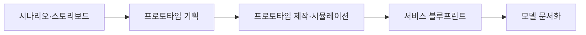

<Callout type="warning">
  **먼저 읽어 주세요.** 이 편의 문제는 실제 서비스·경험디자인기사 실기 기출 문제를 그대로 옮긴 것이 아니다. 실기 출제기준의 세부항목(프로토타입 개발, 시나리오 개발, 모델 개발)을 근거로 새로 재구성한 문항이며, 서비스의 종류·인물·수치는 모두 새로 만든 가상 사례다. 17~20편에서 배운 절차와 표기 규칙을 실제로 적용할 수 있는지 확인하는 용도다.
</Callout>

<Callout type="info">
  **이번 문서의 목표:** 서비스 블루프린트의 빈칸을 채우고, 프로토타입 기획서와 시나리오·스토리보드를 실제 산출물 양식으로 작성하는 실기형 문제를 직접 풀어 본다.
</Callout>

## 이 편을 이렇게 쓰세요

블루프린트·프로토타입·시나리오는 서로 독립된 산출물이 아니라 하나의 서비스 콘셉트를 서로 다른 해상도로 표현한 결과물이다. 이 편의 문제는 하나의 가상 서비스("무인 세탁물 픽업 서비스")를 공통 배경으로 삼아, 문제 1~7이 서로 이어지도록 구성했다. 앞 문제의 답이 뒤 문제의 전제가 되므로 순서대로 풀어야 한다.

## 서술형 문제

### 문제 1. 서비스 시나리오 작성

**문제 상황**: "아파트 단지 내 무인 세탁물 픽업 서비스"의 이용 시나리오를 작성하시오. 등장인물(페르소나), 상황 설정, 목표, 전체 흐름을 포함하시오.

**모범 답안**

| 항목 | 내용 |
|---|---|
| 등장인물 | 맞벌이 부부 이서연(35세), 평일 저녁에만 시간이 남음 |
| 상황 설정 | 세탁소 영업시간에 맞춰 방문할 시간이 없어 세탁물이 계속 쌓이는 상황 |
| 목표 | 세탁소 방문 없이 단지 내에서 세탁물을 맡기고 찾고 싶다 |
| 전체 흐름 | 퇴근길에 앱으로 픽업 예약 → 단지 내 무인함에 세탁물 투입 → 완료 알림 수신 → 다음 퇴근길에 무인함에서 수령 |

**채점 포인트**

- 등장인물의 상황(맞벌이, 시간 제약)이 서비스의 필요성과 논리적으로 연결되는지
- 목표가 등장인물의 좌절 요인에서 자연스럽게 도출되었는지
- 전체 흐름이 시간 순서대로 빠짐없이 서술되었는지(예약-투입-알림-수령 중 한 단계라도 빠지면 감점)

### 문제 2. 스토리보드 작성

**문제 상황**: 문제 1의 시나리오를 스토리보드(Storyboard)로 표현하시오. 최소 4개 프레임으로 나누고, 프레임별 상황·화면 설명·대사(또는 생각)를 포함하시오.

**모범 답안**

| 프레임 | 상황 | 화면·행동 설명 | 대사·생각 |
|---|---|---|---|
| 1 | 퇴근길 지하철 안 | 이서연이 스마트폰 앱에서 픽업 예약 버튼을 누름 | "이번 주말에 입을 옷이 없는데, 지금 예약해 두면 되겠다" |
| 2 | 단지 내 무인함 앞 | 세탁물 봉투를 무인함에 넣고 QR코드를 스캔함 | "생각보다 훨씬 간단하네" |
| 3 | 다음 날 오전 | 세탁 완료 알림을 스마트폰으로 받음 | "벌써 다 됐다는 알림이 왔네" |
| 4 | 퇴근길 무인함 앞 | 알림에 표시된 보관함 번호로 세탁물을 수령함 | "세탁소에 안 가도 되니 시간이 확실히 줄었다" |

**채점 포인트**

- 프레임이 4개 이상이며 시간 순서대로 서비스 이용의 시작부터 끝까지 이어지는지
- 각 프레임에 상황·행동·대사(생각)가 모두 포함되어 있는지(그림 설명만 있고 인물의 심리가 빠지면 감점)
- 문제 1 시나리오의 흐름(예약-투입-알림-수령)과 일치하는지

### 문제 3. 프로토타입 기획서 작성

**문제 상황**: 문제 1~2의 서비스 콘셉트를 검증하기 위한 저충실도(Low-fidelity) 프로토타입 기획서를 작성하시오. 목적, 충실도 수준, 제작 요소, 테스트 방법을 포함하시오.

**모범 답안**

| 항목 | 내용 |
|---|---|
| 목적 | 무인함 조작 흐름(투입-QR스캔-알림-수령)이 사용자에게 직관적인지 검증 |
| 충실도 수준 | 저충실도(종이 목업과 실물 크기 상자 모형으로 화면·투입구 배치만 시뮬레이션) |
| 제작 요소 | 앱 화면 종이 목업 3장(예약·투입 완료·수령 안내), 무인함 모형(투입구·화면 위치만 실물 크기로 재현) |
| 테스트 방법 | 참여자에게 시나리오만 구두로 제시하고 실제 조작 순서를 종이 목업으로 짚어 보게 한 뒤, 막히는 지점을 기록 |

**채점 포인트**

- 충실도 수준(저충실도/고충실도)을 명시하고 그에 맞는 제작 요소를 선택했는지(예를 들어 저충실도라고 하면서 완성된 앱을 요구하면 모순)
- 제작 요소가 문제 2의 스토리보드 프레임(투입, 알림, 수령)과 대응되는지
- 테스트 방법이 검증 목적(조작 흐름의 직관성)과 논리적으로 연결되는지

### 문제 4. 프로토타입 제작과 시뮬레이션

**문제 상황**: 문제 3의 프로토타입으로 서비스 워크스루(Service Walkthrough, 역할극 방식의 시뮬레이션)를 진행했다. 시뮬레이션 절차와 발견된 문제점을 서술하시오.

**모범 답안**

| 항목 | 내용 |
|---|---|
| 시뮬레이션 절차 | 진행자가 무인함 역할, 참여자가 이용자 역할을 맡아 시나리오대로 예약-투입-알림-수령 과정을 실제 동작으로 재연 |
| 발견된 문제점 | 참여자 3명 중 2명이 QR코드 스캔 위치를 화면 하단이 아니라 상단에서 찾으려 해 투입 단계에서 지연이 발생 |
| 개선 방향 | QR코드 스캔 안내를 화면 중앙에 크게 배치하고, 스캔 성공 시 즉각적인 소리·진동 피드백을 추가 |

**채점 포인트**

- 시뮬레이션 절차에 역할 분담(진행자와 참여자가 각각 어떤 역할을 맡는지)이 명시되어 있는지
- 문제점이 추상적("불편했다")이 아니라 구체적 지점(QR코드 스캔 위치)과 관찰된 참여자 수로 서술되었는지
- 개선 방향이 발견된 문제점과 직접 대응하는 해결책인지

### 문제 5. 서비스 블루프린트 빈칸 채우기

**문제 상황**: 문제 1~4의 서비스를 서비스 블루프린트(Service Blueprint)로 정리한 표의 일부다. 빈칸 A~D를 채우시오.

| 단계 | 고객 행동 | 프런트스테이지(가시선 위) | 백스테이지(가시선 아래) | 지원 프로세스 | 물리적 증거 |
|---|---|---|---|---|---|
| 예약 | 앱에서 픽업 예약 | ( A ) | - | 예약 서버가 요청을 접수 | 앱 화면 |
| 투입 | 무인함에 세탁물 투입 후 QR 스캔 | 무인함 화면이 투입 완료를 표시 | ( B ) | 재고 관리 시스템에 투입 기록 등록 | 무인함, QR코드 |
| 처리 | (관여하지 않음) | - | 세탁 기사가 무인함에서 세탁물을 수거해 세탁 진행 | ( C ) | 세탁 완료 알림 문자 |
| 수령 | 알림을 보고 무인함에서 수령 | 무인함이 보관함 번호를 안내 | 세탁 완료물을 지정 보관함에 배치 | 재고 시스템에서 수령 처리 | ( D ) |

**모범 답안**

| 빈칸 | 채운 내용 | 근거 |
|---|---|---|
| A | 앱이 예약 완료 화면을 표시 | 프런트스테이지는 고객이 직접 보고 상호작용하는 접점이므로, 예약 단계에서 고객 눈에 보이는 것은 앱 화면의 반응이다 |
| B | 무인함 내부 센서가 투입 여부를 감지해 관리 서버로 전송 | 백스테이지는 고객 눈에 보이지 않는 뒷단 처리이며, 투입 감지는 고객이 보지 못하는 내부 동작이다 |
| C | 세탁 진행 상황을 추적하고 완료 시 알림 문자를 발송하는 프로세스 | 지원 프로세스는 백스테이지 직원 행동을 가능하게 하는 내부 시스템·업무이며, 세탁 진행 추적과 알림 발송이 이에 해당한다 |
| D | 보관함, 안내 화면 | 물리적 증거는 고객이 서비스 품질을 판단하는 실체적 단서이며, 수령 단계에서는 보관함과 안내 화면이 그 역할을 한다 |

**채점 포인트**

- 프런트스테이지(고객이 직접 보는 접점)와 백스테이지(고객이 보지 못하는 뒷단)를 정확히 구분해 채웠는지(가장 흔한 실수는 이 둘을 뒤바꾸는 것)
- 지원 프로세스가 바로 위 칸의 백스테이지 직원 행동을 가능하게 하는 시스템·업무로 연결되는지
- 물리적 증거가 추상적 개념이 아니라 고객이 실제로 보고 만지는 실체(보관함, 문자, 화면)로 채워졌는지

### 문제 6. 실패 지점과 대기 시간 표시

**문제 상황**: 문제 5의 블루프린트에서 발생할 수 있는 실패 지점(Fail Point)과 대기 시간(Wait Line)을 각각 1개 이상 찾아 표시하고, 그 이유를 서술하시오.

**모범 답안**

| 구분 | 위치 | 이유 |
|---|---|---|
| 실패 지점 | 투입 단계의 QR 스캔 | 문제 4의 시뮬레이션에서 확인된 것처럼, 스캔 위치를 찾지 못해 투입이 완료되지 않고 중단될 위험이 있는 지점이다 |
| 대기 시간 | 처리 단계(세탁 기사의 수거–세탁 완료까지) | 고객이 직접 관여하지 않는 구간이지만, 실제로는 수거 주기에 따라 하루 이상 대기가 발생할 수 있는 구간이다 |

**채점 포인트**

- 실패 지점이 실제로 서비스가 멈추거나 실패할 수 있는 구체적 단계(추상적인 전체 서비스가 아니라 특정 접점)로 지정되었는지
- 대기 시간이 고객이 체감하는 지연 구간과 논리적으로 연결되는지
- 두 개념(실패 지점은 오류·중단 가능성, 대기 시간은 지연)을 혼동하지 않고 구분해 서술했는지

### 문제 7. 프로토타입 평가 결과 문서화

**문제 상황**: 문제 4의 시뮬레이션 평가 결과를 문서화하려 한다. 평가 참여자 구성, 평가 방법, 발견된 사용성 문제, 개선 방향을 정리하시오.

**모범 답안**

| 항목 | 내용 |
|---|---|
| 평가 참여자 구성 | 아파트 단지 실거주자 3명(세탁 서비스 이용 경험 유무를 섞어 구성) |
| 평가 방법 | 저충실도 프로토타입으로 서비스 워크스루 진행 후, 종료 직후 5점 척도 설문과 자유 코멘트 수집 |
| 발견된 사용성 문제 | QR 스캔 위치를 찾지 못해 평균 8초 이상 지연, 3명 중 2명이 같은 지점에서 혼란을 겪음 |
| 개선 방향 | QR 스캔 안내를 화면 중앙에 배치하고 스캔 성공 피드백(소리·진동)을 추가해 재검증 예정 |

**채점 포인트**

- 참여자 구성 기준(이용 경험 유무 등)이 명시되어 있는지
- 평가 방법에 정량(척도 설문)과 정성(자유 코멘트) 요소가 함께 포함되어 있는지
- 발견된 문제가 수치나 빈도로 구체화되어 있는지(몇 명 중 몇 명이 겪었는지)
- 개선 방향이 재검증 계획까지 포함해 순환적으로 마무리되는지

## 핵심 정리

- 시나리오·스토리보드·프로토타입·블루프린트는 하나의 서비스 콘셉트를 서로 다른 해상도로 표현한 연결된 산출물이다.
- 프로토타입 기획서는 충실도 수준과 제작 요소가 서로 모순되지 않아야 하며, 시뮬레이션은 역할 분담과 구체적 문제점 기록이 핵심이다.
- 서비스 블루프린트는 프런트스테이지(고객이 보는 접점)와 백스테이지(고객이 보지 못하는 뒷단)를 정확히 구분하는 것이 가장 흔한 채점 포인트다.
- 실패 지점은 오류·중단 가능성을, 대기 시간은 고객이 체감하는 지연을 가리키며 서로 다른 개념이다.
- 평가 결과 문서화는 참여자 구성, 정량·정성 방법, 구체적 문제 수치, 개선 방향까지 갖춰야 완전한 답안이 된다.

## 마무리 복습

<Quiz
  questionNumber={1}
  question="서비스 시나리오 작성에서 목표(Goal) 항목이 갖춰야 할 조건은?"
  options={['등장인물의 좌절 요인과 무관하게 임의로 설정한다', '등장인물의 상황과 좌절 요인에서 자연스럽게 도출되어야 한다', '항상 서비스 제공자의 매출 목표와 같아야 한다', '반드시 수치로만 표현해야 한다']}
  correctAnswer={2}
  explanation="시나리오의 목표는 등장인물이 처한 상황과 좌절 요인에서 논리적으로 이어져야 설득력 있는 답안이 된다."
  optionExplanations={['임의로 설정하면 시나리오의 개연성이 떨어진다', '정답이다', '목표는 사용자 관점이지 제공자의 매출 목표가 아니다', '목표를 반드시 수치로만 표현할 필요는 없다']}
/>

<Quiz
  questionNumber={2}
  question="스토리보드(Storyboard)의 각 프레임에 포함되어야 하는 요소로 가장 적절한 것은?"
  options={['프레임 번호만', '상황, 화면·행동 설명, 대사(또는 생각)', '개발팀의 코드 구조', '경쟁사의 유사 서비스 목록']}
  correctAnswer={2}
  explanation="스토리보드는 상황, 화면·행동, 인물의 대사나 생각까지 함께 표현해야 서비스 이용 흐름과 사용자 심리를 동시에 전달할 수 있다."
  optionExplanations={['번호만으로는 내용을 전달할 수 없다', '정답이다', '코드 구조는 스토리보드 요소가 아니다', '경쟁사 목록은 스토리보드 요소가 아니다']}
/>

<Quiz
  questionNumber={3}
  question="저충실도(Low-fidelity) 프로토타입의 특징으로 옳은 것은?"
  options={['실제 서비스와 동일한 완성도의 작동 화면을 제공한다', '종이 목업 등 간단한 형태로 핵심 흐름만 빠르게 검증한다', '반드시 실제 서버와 연동되어야 한다', '고충실도 프로토타입보다 제작 기간이 더 길다']}
  correctAnswer={2}
  explanation="저충실도 프로토타입은 종이 목업처럼 완성도는 낮지만 제작이 빠르고, 핵심 흐름과 콘셉트를 빠르게 검증하는 데 목적이 있다."
  optionExplanations={['그 정도 완성도는 고충실도 프로토타입에 해당한다', '정답이다', '서버 연동은 저충실도 프로토타입의 목적이 아니다', '저충실도는 오히려 제작 기간이 짧은 것이 특징이다']}
/>

<Quiz
  questionNumber={4}
  question="프로토타입 기획서에서 목적과 제작 요소가 서로 모순되는 경우로 옳은 것은?"
  options={['저충실도라고 하면서 종이 목업만 준비하는 경우', '저충실도라고 하면서 완성된 실제 작동 앱을 요구하는 경우', '고충실도라고 하면서 실제 작동 화면을 준비하는 경우', '검증 목적을 조작 흐름의 직관성으로 설정하는 경우']}
  correctAnswer={2}
  explanation="저충실도로 명시했는데 완성된 실제 작동 앱을 요구하면 충실도 수준과 제작 요소가 모순된다."
  optionExplanations={['저충실도에 맞는 제작 요소이므로 모순이 아니다', '정답이다', '고충실도에 맞는 제작 요소이므로 모순이 아니다', '검증 목적 설정 자체는 모순이 아니다']}
/>

<Quiz
  questionNumber={5}
  question="서비스 워크스루(Service Walkthrough)의 정의로 가장 적절한 것은?"
  options={['설문지를 이메일로 발송해 회수하는 방법', '역할극 방식으로 서비스 이용 과정을 재연하며 시뮬레이션하는 방법', '경쟁사 서비스를 벤치마킹하는 방법', '데스크 리서치 자료를 정리하는 방법']}
  correctAnswer={2}
  explanation="서비스 워크스루는 진행자와 참여자가 각각 역할을 맡아 서비스 이용 과정을 실제 행동으로 재연하며 문제점을 발견하는 시뮬레이션 방법이다."
  optionExplanations={['설문 발송은 워크스루와 무관하다', '정답이다', '벤치마킹은 06편의 데스크 리서치 영역이다', '데스크 리서치 정리와는 다른 활동이다']}
/>

<Quiz
  questionNumber={6}
  question="프로토타입 시뮬레이션에서 발견한 문제점을 서술할 때 가장 바람직한 방식은?"
  options={['불편했다는 감상만 적는다', '구체적 지점과 관찰된 참여자 수를 근거로 서술한다', '문제점은 생략하고 개선 방향만 적는다', '참여자의 개인정보를 상세히 나열한다']}
  correctAnswer={2}
  explanation="문제점은 어느 지점에서 몇 명이 어떤 어려움을 겪었는지 구체적으로 서술해야 개선 방향과 논리적으로 연결된다."
  optionExplanations={['감상만으로는 개선 방향을 도출하기 어렵다', '정답이다', '문제점 없이 개선 방향만 쓰면 근거가 없는 답안이 된다', '개인정보 나열은 사용성 평가와 무관하다']}
/>

<Quiz
  questionNumber={7}
  question="서비스 블루프린트에서 가시선(Line of Visibility) 위쪽에 위치하는 것은?"
  options={['백스테이지 직원 행동', '지원 프로세스', '프런트스테이지 직원 행동', '내부 재고 관리 시스템']}
  correctAnswer={3}
  explanation="가시선 위쪽은 고객이 직접 보고 상호작용하는 프런트스테이지 직원 행동이 위치하는 영역이다."
  optionExplanations={['백스테이지는 가시선 아래에 위치한다', '지원 프로세스도 가시선 아래에 위치한다', '정답이다', '내부 시스템은 가시선 아래에 위치한다']}
/>

<Quiz
  questionNumber={8}
  question="서비스 블루프린트에서 프런트스테이지와 백스테이지를 구분하는 기준은?"
  options={['업무의 난이도', '고객이 직접 볼 수 있는지 여부', '직원의 근무 시간', '서비스 제공 비용']}
  correctAnswer={2}
  explanation="프런트스테이지와 백스테이지는 고객이 그 행동을 직접 볼 수 있는지 여부(가시선)를 기준으로 구분한다."
  optionExplanations={['업무 난이도는 구분 기준이 아니다', '정답이다', '근무 시간은 구분 기준이 아니다', '제공 비용은 구분 기준이 아니다']}
/>

<Quiz
  questionNumber={9}
  question="서비스 블루프린트의 지원 프로세스(Support Process)가 의미하는 것은?"
  options={['고객이 직접 수행하는 행동', '백스테이지 직원 행동을 가능하게 하는 내부 시스템·업무', '경쟁사의 지원 정책', '고객이 서비스에 만족하는 정도를 나타내는 지표']}
  correctAnswer={2}
  explanation="지원 프로세스는 백스테이지 직원의 행동이 원활히 이루어지도록 뒷받침하는 내부 시스템이나 업무 절차를 가리킨다."
  optionExplanations={['고객 행동은 별도의 행 항목이다', '정답이다', '경쟁사 정책과는 무관하다', '만족도 지표는 별도의 평가 항목이다']}
/>

<Quiz
  questionNumber={10}
  question="서비스 블루프린트의 물리적 증거(Physical Evidence)로 가장 적절한 예는?"
  options={['내부 회의록', '고객이 실제로 보고 만지는 앱 화면, 보관함, 알림 문자', '직원 급여 체계', '서버의 데이터베이스 스키마']}
  correctAnswer={2}
  explanation="물리적 증거는 고객이 서비스 품질을 판단하는 데 사용하는 실체적 단서로, 앱 화면·보관함·알림 문자 등이 해당한다."
  optionExplanations={['내부 회의록은 고객이 접하지 않는다', '정답이다', '급여 체계는 고객이 접하지 않는다', 'DB 스키마는 고객이 접하지 않는다']}
/>

<Quiz
  questionNumber={11}
  question="서비스 블루프린트에서 실패 지점(Fail Point)의 정의로 옳은 것은?"
  options={['고객이 대기해야 하는 구간', '서비스가 오류를 일으키거나 중단될 수 있는 구체적 접점', '직원의 휴게 시간', '서비스의 총 매출 목표']}
  correctAnswer={2}
  explanation="실패 지점은 프로세스 중 오류나 실패가 발생할 가능성이 있는 구체적 접점을 표시하는 개념이다."
  optionExplanations={['대기 구간은 대기 시간(Wait Line)의 정의다', '정답이다', '휴게 시간은 실패 지점과 무관하다', '매출 목표는 실패 지점과 무관하다']}
/>

<Quiz
  questionNumber={12}
  question="서비스 블루프린트에서 대기 시간(Wait Line)의 정의로 옳은 것은?"
  options={['고객이 서비스 품질을 판단하는 실체적 단서', '고객이 다음 단계로 넘어가기까지 체감하는 지연 구간', '직원이 사용하는 내부 시스템', '경쟁사와의 가격 비교 구간']}
  correctAnswer={2}
  explanation="대기 시간은 고객이 서비스 이용 중 다음 단계로 넘어가기까지 체감하는 지연 구간을 표시하는 개념이다."
  optionExplanations={['그 정의는 물리적 증거에 해당한다', '정답이다', '내부 시스템은 지원 프로세스에 해당한다', '가격 비교는 대기 시간과 무관하다']}
/>

<Quiz
  questionNumber={13}
  question="실패 지점과 대기 시간을 혼동하는 대표적인 오답 패턴은?"
  options={['오류 가능성이 있는 접점을 대기 시간으로 표시하는 것', '두 개념을 완전히 동일한 것으로 서술하는 것', '지연이 발생하는 구간을 실패 지점으로 표시하는 것', 'A, B 모두 자주 나타나는 오답 패턴이다']}
  correctAnswer={4}
  explanation="실패 지점(오류·중단 가능성)과 대기 시간(체감 지연)을 서로 뒤바꿔 표시하는 것이 실기 답안에서 자주 나오는 대표적 오류다."
  optionExplanations={['이 경우도 오답 패턴에 해당한다', '두 개념을 동일하게 서술하는 것도 오답이지만 가장 흔한 형태는 아니다', '이 경우도 오답 패턴에 해당한다', '정답이다']}
/>

<Quiz
  questionNumber={14}
  question="서비스 블루프린트가 고객 여정 지도와 다른 점으로 가장 적절한 것은?"
  options={['고객 여정 지도는 고객 관점만 다루지만, 블루프린트는 백스테이지·지원 프로세스 등 조직 내부 관점까지 함께 다룬다', '두 산출물은 완전히 동일하다', '블루프린트는 감정 곡선을 절대 포함하지 않는다', '고객 여정 지도는 실기 시험에 출제되지 않는다']}
  correctAnswer={1}
  explanation="고객 여정 지도가 고객 경험 중심이라면, 블루프린트는 그 경험을 가능하게 하는 조직 내부의 백스테이지·지원 프로세스까지 확장해 보여 준다."
  optionExplanations={['정답이다', '두 산출물은 목적과 구성 요소가 다르다', '블루프린트에도 감정 관련 요소를 함께 표시하는 경우가 있다', '고객 여정 지도도 실기에서 다뤄지는 산출물이다']}
/>

<Quiz
  questionNumber={15}
  question="프로토타입 평가 결과 문서화에서 정량 평가 방법의 예로 적절한 것은?"
  options={['자유 코멘트만 수집하는 것', '5점 척도 설문으로 만족도를 수집하는 것', '참여자의 표정을 사진으로만 기록하는 것', '평가를 생략하고 개선안만 제시하는 것']}
  correctAnswer={2}
  explanation="정량 평가는 척도 설문처럼 수치로 집계할 수 있는 방법을 가리킨다."
  optionExplanations={['자유 코멘트는 정성 평가에 해당한다', '정답이다', '사진 기록만으로는 수치화된 평가가 되지 않는다', '평가 없이 개선안만 제시하면 근거가 없다']}
/>

<Quiz
  questionNumber={16}
  question="프로토타입 평가 결과 문서화에서 발견된 사용성 문제를 서술할 때 바람직한 방식은?"
  options={['참여자 수와 빈도를 포함해 구체적으로 서술한다', '문제가 있었다고만 간단히 적는다', '개선 방향과 무관하게 서술한다', '평가 참여자의 실명을 그대로 공개한다']}
  correctAnswer={1}
  explanation="발견된 문제는 몇 명 중 몇 명이 어떤 지점에서 겪었는지 구체적 수치와 함께 서술해야 개선 방향과 논리적으로 이어진다."
  optionExplanations={['정답이다', '간단한 서술만으로는 근거가 부족하다', '개선 방향과 연결되지 않으면 평가의 의미가 줄어든다', '실명 공개는 개인정보 보호 원칙에 어긋난다']}
/>

<Quiz
  questionNumber={17}
  question="프로토타입 평가에서 개선 방향을 서술한 뒤 마지막에 포함하면 좋은 내용은?"
  options={['평가를 다시는 진행하지 않겠다는 선언', '개선 후 재검증 계획', '평가 참여자에 대한 불만', '경쟁사와의 비교 우위 주장']}
  correctAnswer={2}
  explanation="개선 방향은 한 번의 수정으로 끝나지 않고, 개선 후 다시 검증하는 순환 과정으로 마무리하는 것이 완전한 답안이 된다."
  optionExplanations={['재검증을 포기하는 것은 바람직하지 않다', '정답이다', '참여자에 대한 불만은 평가 문서화에 포함될 내용이 아니다', '경쟁사 비교는 이 문제의 범위를 벗어난다']}
/>

<Quiz
  questionNumber={18}
  question="시나리오, 프로토타입, 블루프린트의 관계로 가장 적절한 설명은?"
  options={['서로 완전히 무관한 별개의 산출물이다', '하나의 서비스 콘셉트를 서로 다른 해상도로 표현한 연결된 산출물이다', '블루프린트만 실기 시험에 출제된다', '시나리오는 프로토타입보다 항상 나중에 작성된다']}
  correctAnswer={2}
  explanation="시나리오·프로토타입·블루프린트는 하나의 서비스 콘셉트를 문제 상황, 검증 도구, 운영 구조라는 서로 다른 해상도로 표현한 연결된 산출물이다."
  optionExplanations={['서로 연결된 산출물이므로 무관하지 않다', '정답이다', '세 산출물 모두 실기에서 다뤄질 수 있다', '일반적으로 시나리오가 프로토타입 제작보다 먼저 작성된다']}
/>

<Quiz
  questionNumber={19}
  question="스토리보드 프레임 수가 지나치게 적어(예: 1개) 서비스 흐름을 설명하지 못하는 경우 발생하는 문제는?"
  options={['오히려 채점에 유리하다', '이용 과정의 시작부터 끝까지를 보여 주지 못해 감점 대상이 된다', '프레임 수는 채점과 무관하다', '프레임이 적을수록 프로토타입 제작이 쉬워진다']}
  correctAnswer={2}
  explanation="스토리보드는 서비스 이용의 시작부터 끝까지 흐름을 보여 주어야 하므로, 프레임이 지나치게 적으면 흐름을 설명하지 못해 감점된다."
  optionExplanations={['프레임이 적으면 오히려 불리하다', '정답이다', '프레임 수는 흐름 전달 여부와 직결되므로 채점과 무관하지 않다', '프레임 수와 프로토타입 제작 난이도는 별개의 문제다']}
/>

<Quiz
  questionNumber={20}
  question="문제 상황에서 등장인물의 상황 설정 없이 곧바로 서비스 기능만 나열하는 시나리오 답안의 문제점은?"
  options={['채점 포인트인 개연성(상황-목표-흐름의 연결)을 충족하지 못한다', '오히려 더 높은 점수를 받는다', '시나리오는 원래 기능 나열로 작성하는 것이 맞다', '아무 문제가 없다']}
  correctAnswer={1}
  explanation="시나리오는 등장인물의 상황에서 목표가 도출되고 그 목표를 위해 흐름이 전개되어야 하며, 기능만 나열하면 개연성을 충족하지 못해 감점된다."
  optionExplanations={['정답이다', '개연성이 없는 답안은 오히려 감점된다', '기능 나열은 시나리오가 아니라 기능 명세서에 가깝다', '개연성 부족은 명백한 감점 요인이다']}
/>

## 참고 자료

- [한국산업인력공단(브런치 경유 원문) - 서비스·경험디자인 기사 출제기준(필기·실기)](https://t1.daumcdn.net/brunch/service/user/13ur/file/tayw3sSk4ib3un2lLq5U249xKUg.pdf)
- [한국디자인진흥원(designdb.com) - 서비스·경험디자인 기사 기출문제(핵심기출 및 해설)](https://www.designdb.com/usr/upload/board/zboardphotogallery176/20230102054445522_2647.0.pdf)
- [나무위키 - 서비스·경험디자인기사](https://namu.wiki/w/서비스·경험디자인기사)
