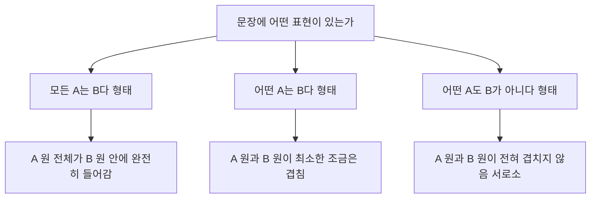

<Callout type="info">
  **이번 문서의 목표:** 문장을 논리 기호(∧·∨·¬·→)로 바꿔 쓰고, 두 집합의 관계를 벤다이어그램으로 직접 그리며, "모든·어떤·어떤 ~도 아닌"이라는 표현이 어떤 집합 관계를 뜻하는지 헷갈리지 않고 판단할 수 있게 된다.
</Callout>

## 왜 문장을 기호로 바꿔야 하는가

추리 유형의 문제는 대부분 여러 줄의 조건문으로 되어 있습니다. "비가 오면 우산을 챙긴다", "우산을 챙기지 않았다면 비가 오지 않은 것이다" 같은 문장을 그대로 눈으로만 따라가면 세 번째 조건, 네 번째 조건이 추가될 때마다 앞의 내용을 잊어버리기 쉽습니다.

**논리 기호**(logical symbol)는 이런 문장을 짧은 부호로 압축해, 종이 위에서 한눈에 비교하고 조작할 수 있게 해 주는 도구입니다. "비가 온다"를 $p$, "우산을 챙긴다"를 $q$라는 문자로 놓으면 첫 문장은 $p \to q$ 한 줄로 줄어듭니다. 문장이 길어질수록, 조건이 많아질수록 기호로 바꾸는 쪽이 압도적으로 빠르고 정확합니다.

> **쉽게 말하면:** 논리 기호는 "긴 문장을 줄여 쓰는 약속"입니다. 약속을 미리 익혀 두면 실제 문제를 풀 때는 그 약속을 적용하기만 하면 됩니다.

이 편에서 익히는 세 가지는 이후 15편(명제와 삼단논법), 16편(벤다이어그램과 집합추리), 17편(조건추리)에서 계속 쓰이는 **공통 도구**입니다. 여기서는 도구를 만드는 법만 다루고, 그 도구로 실제 문제를 푸는 법은 해당 편에서 다룹니다.

## 명제란 무엇인가

**명제**(proposition)는 참인지 거짓인지 **분명하게 판별할 수 있는 문장**입니다. "서울은 대한민국의 수도다"는 참·거짓을 가릴 수 있으므로 명제입니다. 반면 "오늘 날씨가 좋다"는 사람마다 판단 기준이 달라 참·거짓을 하나로 정할 수 없으므로 명제가 아닙니다.

명제를 기호로 다룰 때는 문장 하나를 통째로 $p$, $q$, $r$ 같은 알파벳 문자 하나로 놓습니다. 이렇게 하나의 문자로 치환된 명제를 **단순명제**라 부르고, 단순명제 여러 개를 논리 기호로 이어 붙인 것을 **복합명제**라 부릅니다. "비가 오면 우산을 챙긴다"는 "비가 온다"($p$)와 "우산을 챙긴다"($q$)라는 두 단순명제가 $\to$ 로 이어진 복합명제입니다.

## 논리 기호 넷: ∧, ∨, ¬, →

시험에 나오는 복합명제는 거의 전부 이 네 기호의 조합으로 만들어집니다. 하나씩 뜻을 정확히 잡아 둡니다.

### 그리고 — 논리곱 ∧

**논리곱**(conjunction, 기호 $\land$)은 "그리고", "~와 동시에"에 대응합니다. $p \land q$는 "$p$이고 $q$이다"라고 읽습니다.

> **쉽게 말하면:** 두 조건이 **둘 다** 참이어야만 전체가 참입니다.

| $p$ | $q$ | $p \land q$ |
|---|---|---|
| 참 | 참 | 참 |
| 참 | 거짓 | 거짓 |
| 거짓 | 참 | 거짓 |
| 거짓 | 거짓 | 거짓 |

**예시:** "민수는 국어 시험도 합격했고 수학 시험도 합격했다"는 두 시험 결과가 **모두** 합격이어야 참이 됩니다. 국어만 합격했다면 이 문장 전체는 거짓입니다.

### 또는 — 논리합 ∨

**논리합**(disjunction, 기호 $\lor$)은 "또는", "~이거나"에 대응합니다. $p \lor q$는 "$p$이거나 $q$이다"라고 읽습니다.

> **쉽게 말하면:** 두 조건 중 **하나라도** 참이면 전체가 참입니다. 둘 다 참이어도 여전히 참입니다.

| $p$ | $q$ | $p \lor q$ |
|---|---|---|
| 참 | 참 | 참 |
| 참 | 거짓 | 참 |
| 거짓 | 참 | 참 |
| 거짓 | 거짓 | 거짓 |

**자주 틀리는 점:** 일상 대화에서 "커피 또는 차를 준다"는 둘 중 하나만 준다는 뜻으로 쓰이지만, 논리학의 $\lor$는 **둘 다 받는 경우도 참**으로 봅니다. 시험 문제에서 $\lor$가 나오면 항상 이 넓은 의미로 해석해야 합니다.

### 아니다 — 부정 ¬

**부정**(negation, 기호 $\lnot$)은 명제의 참·거짓을 뒤집습니다. $\lnot p$는 "$p$가 아니다"라고 읽습니다.

| $p$ | $\lnot p$ |
|---|---|
| 참 | 거짓 |
| 거짓 | 참 |

**자주 틀리는 점 — 부정의 대상을 잘못 잡는 실수:** "모든 학생이 합격했다"의 부정은 "모든 학생이 불합격했다"가 **아닙니다.** 정확한 부정은 "합격하지 못한 학생이 적어도 한 명 있다"입니다. 이 함정은 뒤의 "모든·어떤·어떤 ~도 아닌" 절에서 다시 정확히 정리합니다.

### 이면 — 조건 →

**조건**(conditional, 기호 $\to$)은 "~이면 ~이다"에 대응합니다. $p \to q$는 "$p$이면 $q$이다"라고 읽고, $p$를 **전제**(가정, antecedent), $q$를 **결론**(consequent)이라 부릅니다.

| $p$ | $q$ | $p \to q$ |
|---|---|---|
| 참 | 참 | 참 |
| 참 | 거짓 | 거짓 |
| 거짓 | 참 | 참 |
| 거짓 | 거짓 | 참 |

**가장 헷갈리는 두 줄 — 전제가 거짓인 경우:** "비가 오면 우산을 챙긴다"($p \to q$)라는 약속을 했다고 합시다. 비가 오지 않은 날($p$가 거짓)에 우산을 챙기든 챙기지 않든, 애초에 약속이 적용될 상황 자체가 아니므로 이 약속을 어겼다고 말할 수 없습니다. 그래서 전제가 거짓이면 결론이 무엇이든 $p \to q$ 전체는 **참으로 처리**합니다. 이것을 **공허한 참**(vacuous truth)이라 부릅니다.

**틀린 줄은 딱 하나뿐입니다:** $p \to q$가 거짓이 되는 경우는 "전제는 참인데 결론이 거짓"인 두 번째 줄, 딱 한 가지뿐입니다. 약속을 실제로 어긴 상황이 이 경우뿐이기 때문입니다.

**동치 표현 — 자주 나오는 변형:** $p \to q$는 $\lnot p \lor q$와 논리적으로 완전히 같은 뜻입니다("$p$가 아니거나 $q$이다"). 두 표를 나란히 놓고 확인해 보면 네 줄 모두 값이 일치합니다. 조건문을 부정하거나 다른 형태로 바꿔야 하는 문제에서 이 동치 관계가 자주 쓰입니다.

## 집합과 벤다이어그램 그리는 법

### 집합, 원소, 부분집합

**집합**(set)은 어떤 기준으로 명확하게 구분되는 대상들의 모임입니다. "우리 반 학생 전체"는 집합이고, 그 안의 "민수"는 그 집합의 **원소**(element)입니다. 집합 A의 원소가 전부 집합 B에도 속하면, A를 B의 **부분집합**(subset)이라 하고 $A \subseteq B$로 씁니다.

집합끼리 조합하는 세 가지 기본 연산이 있습니다.

| 연산 | 이름 | 뜻 | 읽는 법 |
|------|------|------|---------|
| $A \cap B$ | 교집합 | A와 B에 동시에 속하는 원소들의 모임 | A 인터섹션 B |
| $A \cup B$ | 합집합 | A 또는 B에 속하는 원소 전체의 모임(중복 제거) | A 유니언 B |
| $A^{c}$ | 여집합 | 전체 집합 중 A에 속하지 않는 나머지 전체 | A 컴플리먼트 |

### 벤다이어그램 그리는 법 — 4단계

**벤다이어그램**(Venn diagram)은 집합 사이의 관계를 원으로 시각화한 그림입니다. 조건이 두세 개만 넘어가도 머릿속으로 따라가기 어려워지므로, 손으로 직접 그리는 습관이 실전 속도를 크게 좌우합니다.

<Steps>

1. **전체 집합을 사각형으로 그린다.** 이 사각형 밖에는 아무것도 없다고 약속합니다.
2. **각 조건에 해당하는 집합을 원으로 그린다.** 조건이 두 개면 원 두 개, 세 개면 원 세 개를 겹치게 배치합니다.
3. **원이 겹치는 자리를 먼저 표시한다.** 두 원이 겹치는 부분은 "두 조건을 동시에 만족하는 대상", 즉 교집합입니다.
4. **조건문을 원의 위치 관계로 옮긴다.** "모든 A는 B다"라면 A 원 전체가 B 원 안에 쏙 들어가도록, "A와 B가 전혀 관련 없다"라면 두 원이 서로 닿지 않도록 그립니다.

</Steps>

**포함·교차·서로소 — 세 가지 배치:**

| 상황 | 두 원의 배치 | 뜻 |
|------|--------------|------|
| 포함 | 작은 원이 큰 원 안에 완전히 들어감 | 작은 원의 원소는 전부 큰 원의 원소이기도 함 |
| 교차 | 두 원이 일부분만 겹침 | 두 집합에 공통으로 속하는 원소가 있음 |
| 서로소 | 두 원이 전혀 겹치지 않음 | 공통 원소가 하나도 없음(disjoint) |

## "모든·어떤·어떤 ~도 아닌" 표현의 논리적 의미

추리 문제에서는 명제가 기호식이 아니라 "모든", "어떤", "어떤 ~도 아닌" 같은 자연어로 나옵니다. 이 세 표현이 각각 어떤 집합 관계를 말하는지 정확히 구분하는 것이 이 편의 핵심입니다. 수학에서는 "모든"을 **전칭기호**(all, 기호 $\forall$)로, "어떤"을 **존재기호**(exists, 기호 $\exists$)로 줄여 씁니다.

### 모든 A는 B다 — 전칭긍정

"모든 학생은 성실하다"는 학생 집합이 성실한 사람 집합에 **완전히 포함**된다는 뜻입니다($\text{학생} \subseteq \text{성실한 사람}$). 벤다이어그램에서는 "학생" 원이 "성실한 사람" 원 안에 통째로 들어갑니다.

**정확한 부정 — 함정 지점:** "모든 A는 B다"의 부정은 "모든 A는 B가 아니다"가 아니라 "**B가 아닌 A가 적어도 하나 있다**", 곧 "**어떤 A는 B가 아니다**"입니다. "모든 학생이 성실하다"가 거짓이 되려면 성실하지 않은 학생이 딱 한 명만 있어도 충분하기 때문입니다. 전칭 명제를 부정하면 전칭이 특칭으로 바뀐다는 사실을 반드시 기억해야 합니다.

### 어떤 A는 B다 — 특칭긍정

"어떤 학생은 안경을 쓴다"는 학생 집합과 안경 쓴 사람 집합에 **공통으로 속하는 대상이 최소 하나 존재**한다는 뜻입니다. 벤다이어그램에서는 두 원이 일부라도 겹치기만 하면 참이 됩니다.

**자주 하는 오해:** "어떤"이라는 말 때문에 "일부만 그렇고 나머지는 아니다"라고 확대 해석하는 경우가 많습니다. 그러나 논리학의 "어떤"은 **최소 하나의 존재**만 주장할 뿐, 나머지 학생들이 안경을 쓰는지 안 쓰는지는 아무것도 말해 주지 않습니다. 극단적으로는 학생 전원이 안경을 써도 "어떤 학생은 안경을 쓴다"는 여전히 참입니다.

### 어떤 A도 B가 아니다 — 전칭부정

"어떤 학생도 지각하지 않는다"는 학생 집합과 지각하는 사람 집합에 **공통되는 대상이 단 하나도 없다**는 뜻입니다. 벤다이어그램에서는 두 원이 서로소, 즉 전혀 겹치지 않게 그립니다.

> **쉽게 말하면:** "모든 A는 B다"가 A 원을 B 원 **안에** 넣는 것이라면, "어떤 A도 B가 아니다"는 A 원과 B 원을 **완전히 떼어 놓는** 것입니다.

### 세 표현 한눈에 정리

| 표현 | 집합 관계 | 벤다이어그램 배치 | 부정하면 |
|------|-----------|-------------------|----------|
| 모든 A는 B다 | A ⊆ B | A 원이 B 원 안에 완전히 포함 | 어떤 A는 B가 아니다 |
| 어떤 A는 B다 | A와 B의 교집합이 존재 | 두 원이 일부라도 겹침 | 어떤 A도 B가 아니다 |
| 어떤 A도 B가 아니다 | A와 B가 서로소 | 두 원이 전혀 겹치지 않음 | 어떤 A는 B다 |

이 표는 16편(벤다이어그램과 집합추리)과 15편(명제와 삼단논법)에서 "역·이·대우"를 판단할 때 그대로 재사용되는 기준이므로, 표현과 원의 배치를 짝지어 감각적으로 익혀 둘 가치가 있습니다.

## 핵심 정리

- **논리곱 ∧**은 둘 다 참이어야 참, **논리합 ∨**는 하나만 참이어도 참(둘 다 참인 경우도 포함)이다.
- **조건 →**는 전제가 거짓이면 결론과 무관하게 항상 참이 되고("공허한 참"), 거짓이 되는 경우는 "전제 참, 결론 거짓" 단 한 줄뿐이다. $p \to q$는 $\lnot p \lor q$와 동치다.
- 집합의 세 기본 연산은 **교집합**(공통 원소), **합집합**(전체를 모으되 중복 제거), **여집합**(전체에서 뺀 나머지)이다.
- 벤다이어그램은 전체 집합(사각형) → 조건별 원 → 겹치는 자리 → 조건문 반영 순서로 그린다.
- "모든 A는 B다"는 포함 관계, "어떤 A는 B다"는 교차 관계, "어떤 A도 B가 아니다"는 서로소 관계다.
- 전칭 명제("모든")를 부정하면 특칭 명제("어떤 ~가 아니다")가 되고, 그 반대도 마찬가지다.

## 마무리 복습

<Quiz
  questionNumber={1}
  question="명제 p가 거짓, 명제 q가 참일 때 p∧q와 p∨q의 참·거짓을 순서대로 바르게 짝지은 것은?"
  options={['참, 참', '거짓, 참', '거짓, 거짓', '참, 거짓']}
  correctAnswer={2}
  explanation="논리곱은 둘 다 참이어야 참인데 p가 거짓이므로 p∧q는 거짓이다. 논리합은 하나만 참이어도 참인데 q가 참이므로 p∨q는 참이다."
  optionExplanations={['논리곱은 p가 거짓이면 무조건 거짓이 되므로 틀렸다.', 'p가 거짓이라 논리곱은 거짓, q가 참이라 논리합은 참이므로 옳다.', '논리합은 q가 참이므로 거짓이 될 수 없다.', '두 값의 결과가 서로 뒤바뀌었다.']}
/>

<Quiz
  questionNumber={2}
  question="조건 명제 p→q에 대한 설명으로 옳은 것은?"
  options={['p가 거짓이면 결론과 관계없이 항상 참이다', 'p와 q가 모두 거짓이면 명제 전체도 거짓이다', 'p가 참이고 q가 거짓일 때만 명제 전체가 거짓이다', 'p→q는 q→p와 항상 같은 값을 가진다']}
  correctAnswer={3}
  explanation="조건문이 거짓이 되는 경우는 전제가 참이고 결론이 거짓인 경우 단 한 줄뿐이다. 전제가 거짓이면 결론과 무관하게 공허한 참으로 처리한다."
  optionExplanations={['이 설명 자체는 맞는 내용이지만 이 문항에서 요구하는 유일한 정답은 아니다.', '전제와 결론이 모두 거짓이면 진리표상 명제 전체는 참이다.', '전제 참, 결론 거짓인 경우가 유일하게 거짓이 되는 경우이므로 정확한 설명이다.', '원래 조건문과 그 역은 일반적으로 값이 다르다.']}
/>

<Quiz
  questionNumber={3}
  question="'모든 직원은 정직하다'라는 명제를 정확하게 부정한 문장은?"
  options={['모든 직원은 정직하지 않다', '어떤 직원은 정직하지 않다', '어떤 직원도 정직하지 않다', '대부분의 직원은 정직하다']}
  correctAnswer={2}
  explanation="전칭긍정 명제의 부정은 전칭부정이 아니라 특칭부정이다. 정직하지 않은 직원이 단 한 명이라도 존재하면 원래 명제는 거짓이 되므로 '어떤 직원은 정직하지 않다'가 정확한 부정이다."
  optionExplanations={['전칭 전체를 뒤집은 표현으로, 실제 부정과 범위가 다르다.', '정직하지 않은 사람이 한 명이라도 있으면 원래 명제가 거짓이 되므로 이 표현이 정확한 부정이다.', '이는 원래 명제와 정반대의 전칭부정으로 부정보다 훨씬 강한 주장이다.', '이 문장은 참·거짓 판별이 애매한 일상적 표현이라 정확한 부정이 아니다.']}
/>

<Quiz
  questionNumber={4}
  question="'어떤 사원은 야근을 한다'라는 문장의 벤다이어그램 배치로 옳은 것은?"
  options={['사원 원과 야근하는 사람 원이 전혀 겹치지 않는다', '사원 원이 야근하는 사람 원 안에 완전히 포함된다', '사원 원과 야근하는 사람 원이 일부분만 겹친다', '두 원이 완전히 겹쳐 하나의 원처럼 된다']}
  correctAnswer={3}
  explanation="특칭긍정 명제인 '어떤 A는 B다'는 두 집합에 공통으로 속하는 대상이 최소 하나 존재한다는 뜻이므로, 벤다이어그램에서는 두 원이 일부라도 겹치기만 하면 충분하다."
  optionExplanations={['전혀 겹치지 않는 배치는 어떤 A도 B가 아니다에 해당한다.', '완전히 포함되는 배치는 모든 A는 B다에 해당한다.', '최소 하나의 공통 원소만 있으면 되므로 일부만 겹치는 배치가 정확하다.', '완전히 겹치는 것은 두 집합이 동일하다는 훨씬 강한 주장이다.']}
/>

<Quiz
  questionNumber={5}
  question="'어떤 학생도 규칙을 어기지 않는다'와 논리적으로 같은 뜻인 것은?"
  options={['학생 집합과 규칙을 어기는 사람 집합이 서로소다', '학생 집합이 규칙을 어기는 사람 집합에 완전히 포함된다', '학생 집합과 규칙을 어기는 사람 집합이 일부 겹친다', '규칙을 어기는 사람 집합이 학생 집합에 완전히 포함된다']}
  correctAnswer={1}
  explanation="전칭부정 명제 '어떤 A도 B가 아니다'는 두 집합에 공통 원소가 전혀 없다는 뜻이므로 두 집합이 서로소 관계에 있다는 것과 정확히 같은 뜻이다."
  optionExplanations={['공통 원소가 하나도 없다는 서로소 관계와 정확히 일치한다.', '완전 포함은 모든 A는 B다에 해당하는 전혀 다른 관계다.', '일부만 겹치는 것은 어떤 A는 B다에 해당하며 전칭부정과 반대되는 상황이다.', '방향이 반대로 설정된 포함 관계로 원래 문장과 다르다.']}
/>

<Quiz
  questionNumber={6}
  question="집합 A와 B에 대한 설명으로 옳은 것은?"
  options={['A∩B는 A 또는 B에 속하는 모든 원소의 모임이다', 'A∪B는 A와 B에 공통으로 속하는 원소만의 모임이다', 'A의 여집합은 전체 집합 중 A에 속하지 않는 나머지 전체다', 'A가 B의 부분집합이면 B의 원소는 모두 A에도 속한다']}
  correctAnswer={3}
  explanation="여집합은 전체 집합에서 해당 집합에 속하지 않는 나머지 원소 전체를 뜻한다. 교집합과 합집합의 정의가 서로 뒤바뀌어 있는 보기와 부분집합의 방향이 반대로 서술된 보기를 걸러내야 한다."
  optionExplanations={['이 설명은 합집합의 정의이며 교집합의 정의가 아니다.', '이 설명은 교집합의 정의이며 합집합의 정의가 아니다.', '전체 집합에서 A를 제외한 나머지 전체라는 여집합의 정의와 정확히 일치한다.', 'A가 B의 부분집합이면 반대로 A의 원소가 모두 B에 속해야 한다.']}
/>

<Quiz
  questionNumber={7}
  question="p→q(비가 오면 우산을 챙긴다)와 논리적으로 동치인 명제는?"
  options={['p∧q', 'p∨q', '¬p∨q', '¬p∧¬q']}
  correctAnswer={3}
  explanation="조건문 p→q는 전제가 거짓이면 항상 참, 전제가 참이고 결론이 거짓일 때만 거짓이 되는데, 이는 ¬p∨q의 진리표와 완전히 일치한다. p가 아니거나 q이면 참이라는 뜻이 조건문과 같은 의미이기 때문이다."
  optionExplanations={['논리곱은 둘 다 참이어야 하므로 전제가 거짓일 때 조건문과 값이 달라진다.', '논리합은 p가 참이고 q가 거짓이어도 참이 되어 조건문과 값이 달라진다.', 'p가 아니거나 q인 경우가 조건문이 참이 되는 경우와 정확히 일치한다.', '두 부정을 논리곱으로 묶은 식은 조건문과 값이 대부분 어긋난다.']}
/>

## 참고 자료

- [나무위키 - 삼단논법](https://namu.wiki/w/%EC%82%BC%EB%8B%A8%EB%85%BC%EB%B2%95)
- [나무위키 - 명제 논리](https://namu.wiki/w/%EB%AA%85%EC%A0%9C%20%EB%85%BC%EB%A6%AC)
