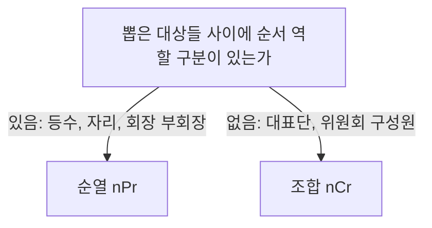

<Callout type="info">
  **이번 문서의 목표:** 비율·백분율·농도를 같은 구조로 이해하고, 문장제 문제를 방정식·부등식으로 정확히 세우며, 순열 nPr과 조합 nCr을 언제 쓰는지 구분해 계산할 수 있게 된다.
</Callout>

## 왜 이 편이 필요한가

응용수리 유형(10~14편)에서 실제로 시간을 잡아먹는 지점은 계산 자체가 아니라 **문장을 식으로 바꾸는 첫 단계**입니다. 계산기 없이 손으로 계산해야 하므로 공식과 절차가 몸에 배어 있지 않으면, 식은 세웠는데 계산에서 막히거나 반대로 계산 실수 없이도 식 자체를 잘못 세우는 일이 자주 벌어집니다. 이 편은 이후 모든 응용수리 편에서 당연하다는 듯이 쓰일 세 가지 도구, **비율·백분율·농도의 관계**, **방정식·부등식을 세우는 절차**, **순열·조합의 기호와 계산법**을 미리 정비해 둡니다.

## 비율·백분율·농도의 관계

### 비율과 백분율은 같은 구조다

**비율**(ratio)은 두 양을 나눈 값으로, "전체 중 어느 정도인가"를 나타냅니다. 학급 30명 중 18명이 여학생이면 여학생의 비율은 다음과 같습니다.

$$
\frac{18}{30} = 0.6
$$

**백분율**(percentage, 퍼센트)은 이 비율에 100을 곱해 "100명 중 몇 명꼴인가"로 바꾼 값입니다. 어원 그대로 퍼센트(percent)는 라틴어로 "100에 대하여"라는 뜻입니다.

$$
0.6 \times 100 = 60(\%)
$$

> **쉽게 말하면:** 비율은 "전체를 1로 봤을 때의 몫", 백분율은 "전체를 100으로 봤을 때의 몫"입니다. 숫자만 다를 뿐 같은 정보를 담고 있습니다.

**자주 틀리는 점:** "작년 대비 20퍼센트 증가"와 "20퍼센트포인트 증가"는 다른 말입니다. 20퍼센트 증가는 원래 값에 0.2를 곱해 더한다는 뜻이고, 20퍼센트포인트 증가는 두 백분율 값의 **차이 자체**가 20이라는 뜻입니다. 지지율이 30퍼센트에서 50퍼센트가 되었다면 이는 20퍼센트**포인트** 증가이지, 20퍼센트 증가(계산하면 36퍼센트가 되어야 함)가 아닙니다. 이 구분은 13편(자료해석 심화)에서 다시 등장합니다.

### 농도 — 비율에 상황을 입힌 것

**농도**(concentration)는 전체 용액 중에서 실제로 녹아 있는 물질(용질)이 차지하는 비율을 백분율로 나타낸 값입니다.

$$
\text{농도}(\%) = \frac{\text{용질의 양}}{\text{용액의 양}} \times 100
$$

- 용질: 물에 녹아 있는 물질(소금물 문제라면 소금)
- 용액: 용질이 녹아 있는 전체(소금물 문제라면 소금물 전체, 즉 소금과 물을 합친 양)

이 식을 거꾸로 풀면 용질의 양을 구하는 식이 나오고, 응용수리 문장제에서는 이 변형된 식을 훨씬 더 자주 씁니다.

$$
\text{용질의 양} = \text{농도}(\%) \times \text{용액의 양} \div 100
$$

**손계산.** 농도 8퍼센트인 소금물 200그램에 들어 있는 소금의 양을 구해 봅시다.

$$
8 \times 200 \div 100 = 16(\text{g})
$$

**해석:** 소금물 200그램 중 16그램이 순수한 소금이고, 나머지 184그램은 물입니다.

**두 소금물을 섞을 때 — 치명적인 함정:** 농도 4퍼센트인 소금물 100그램과 농도 10퍼센트인 소금물 100그램을 섞으면 농도가 몇 퍼센트가 될까요? "두 농도를 평균 내서 7퍼센트"라고 답하면 **함정에 걸린 것**입니다. 농도는 비율이므로 그냥 평균 내면 안 되고, 반드시 각 소금물의 **소금의 양**을 먼저 구해 더한 뒤, 그 합을 전체 소금물의 양으로 다시 나눠야 합니다.

$$
\text{소금의 양} = (4 \times 100 \div 100) + (10 \times 100 \div 100) = 4 + 10 = 14(\text{g})
$$

$$
\text{합친 농도} = 14 \div 200 \times 100 = 7(\%)
$$

이 경우는 두 소금물의 양이 같아서 우연히 단순 평균과 결과가 같았을 뿐입니다. 두 소금물의 양이 다르면 단순 평균과 실제 값이 크게 어긋나므로, **소금의 양을 거쳐 계산한다**는 절차 자체를 외워 둬야 합니다.

## 방정식·부등식 세우는 법

### 문장을 식으로 바꾸는 절차

문장제에서 가장 먼저 할 일은 구하려는 값을 미지수로 놓는 것입니다. 이후 절차는 다음과 같습니다.

<Steps>

1. **구하려는 값을 미지수 $x$로 놓는다.** 무엇을 $x$로 놓을지가 이후 식의 복잡도를 좌우한다.
2. **문제에 나오는 다른 값들을 $x$를 이용해 표현한다.** "형이 동생보다 5살 많다"면 동생이 $x$일 때 형은 $x + 5$다.
3. **문제에서 "같다", "합이 ~다" 같은 표현을 찾아 등식(또는 부등식)을 세운다.**
4. **식을 풀고, 답이 문제 상황에 맞는지 확인한다.** 사람 수나 나이가 음수나 소수로 나오면 어딘가 식을 잘못 세운 것이다.

</Steps>

**예시 — 나이 문제.** "현재 아버지 나이는 아들 나이의 3배이고, 10년 후에는 아버지 나이가 아들 나이의 2배가 된다. 현재 아들의 나이는?" 아들의 현재 나이를 $x$로 놓으면 아버지의 현재 나이는 $3x$입니다. 10년 후 아들은 $x+10$, 아버지는 $3x+10$이 되고, 이때 아버지가 아들의 2배라는 조건을 식으로 세웁니다.

$$
3x + 10 = 2(x + 10)
$$

이를 풀면 $3x + 10 = 2x + 20$이 되고, 다시 정리하면 다음과 같습니다.

$$
x = 10
$$

**해석:** 현재 아들은 10살, 아버지는 30살입니다. 10년 후에는 아들 20살, 아버지 40살이 되어 정확히 2배 관계가 성립합니다.

### 부등식 — 범위를 나타내는 식

문제에 "~ 이상", "~ 이하", "~보다 크다(초과)", "~보다 작다(미만)"라는 표현이 나오면 등식이 아니라 **부등식**(inequality)을 세워야 합니다.

| 표현 | 기호 | 경계값 포함 여부 |
|------|------|-------------------|
| 이상 | $\geq$ | 포함 |
| 이하 | $\leq$ | 포함 |
| 초과 | $>$ | 불포함 |
| 미만 | $<$ | 불포함 |

**자주 틀리는 점 — "이상·이하"와 "초과·미만"의 경계 포함 여부.** "정원이 30명 이하"라면 정확히 30명도 가능하지만, "정원이 30명 미만"이라면 30명은 안 되고 최대 29명까지만 가능합니다. 이 경계값 하나 때문에 정답이 갈리는 문제가 많으므로 지문의 단어를 정확히 읽어야 합니다.

**부등식을 풀 때 방향이 바뀌는 경우 — 함정 지점:** 부등식의 양변에 **음수를 곱하거나 음수로 나누면 부등호의 방향이 반드시 뒤집힙니다.** $-2x < 6$을 풀 때 양변을 $-2$로 나누면 $x > -3$이 되어야지, 부등호 방향을 그대로 둔 $x < -3$은 틀린 답입니다. 등식에는 없는, 부등식만의 규칙이므로 계산 막바지에 음수를 곱하고 방향을 안 바꾸는 실수가 흔합니다.

## 순열·조합 기호와 팩토리얼

### 팩토리얼 — 순서를 전부 나열하는 곱

**팩토리얼**(factorial, 기호 $!$)은 1부터 어떤 자연수 $n$까지의 모든 정수를 차례로 곱한 값입니다.

$$
n! = n \times (n-1) \times (n-2) \times \cdots \times 2 \times 1
$$

**손계산.** $4! = 4 \times 3 \times 2 \times 1 = 24$입니다. 팩토리얼은 $n$이 커질수록 매우 빠르게 커집니다.

**약속 — 0의 팩토리얼:** $0! = 1$로 **약속**합니다. "곱할 대상이 없다"는 뜻에서 자연스럽게 0이 되어야 할 것 같지만, 아무것도 곱하지 않은 상태를 수학에서는 곱셈의 항등원인 1로 둡니다. 이 약속은 뒤에 나오는 순열·조합 공식이 경계 상황(고를 대상을 0개 고르는 경우 등)에서도 깨지지 않고 성립하게 해 줍니다.

### 순열 — 순서가 다르면 다른 경우

**순열**(permutation, 기호 $_{n}P_{r}$)은 서로 다른 $n$개 중에서 $r$개를 골라 **순서를 구분해서** 줄 세우는 경우의 수입니다.

$$
_{n}P_{r} = \frac{n!}{(n-r)!}
$$

- $n$: 전체 대상의 개수
- $r$: 그중 뽑아서 순서를 정할 개수

**손계산.** 5명 중 3명을 뽑아 1등, 2등, 3등을 정하는 경우의 수는 다음과 같습니다.

$$
_{5}P_{3} = \frac{5!}{(5-3)!} = \frac{5!}{2!} = \frac{120}{2} = 60
$$

**해석:** 같은 세 명이 뽑혀도 등수가 다르게 배정되면 서로 다른 경우로 셉니다. "누가 뽑혔는가"뿐 아니라 "누가 몇 등인가"까지 구분하는 것이 순열의 핵심입니다.

### 조합 — 순서를 구분하지 않는 경우

**조합**(combination, 기호 $_{n}C_{r}$)은 서로 다른 $n$개 중에서 $r$개를 고르되 **순서를 구분하지 않는** 경우의 수입니다.

$$
_{n}C_{r} = \frac{n!}{r!(n-r)!}
$$

**손계산.** 5명 중 등수 없이 대표 3명을 뽑는 경우의 수는 다음과 같습니다.

$$
_{5}C_{3} = \frac{5!}{3! \times (5-3)!} = \frac{120}{6 \times 2} = 10
$$

**순열과 조합의 관계:** 조합 공식은 순열 공식을 뽑힌 $r$명을 줄 세우는 경우의 수인 $r!$로 한 번 더 나눈 것뿐입니다. 순열로 구한 60가지 중에서, 같은 세 사람이라도 등수만 다른 경우($3! = 6$가지)를 하나로 묶으면 $60 \div 6 = 10$이 되어 조합의 결과와 정확히 일치합니다.

### 순열인지 조합인지 구분하는 법

**판정 요령:** "회장 1명, 부회장 1명을 뽑는다"처럼 역할이 서로 다르면 뽑힌 두 사람의 자리를 바꾸면 다른 경우가 되므로 순열입니다. 반면 "회장단 2명을 뽑는다"처럼 역할 구분이 없으면 순열이 아니라 조합입니다. 같은 사람 두 명을 뽑더라도 **역할이 있는지 없는지**가 기준이지, 사람 수나 상황의 겉모습이 기준이 아닙니다.

## 핵심 정리

- 비율은 전체를 1로, 백분율은 전체를 100으로 놓은 같은 개념이며, "퍼센트 증가"와 "퍼센트포인트 증가"는 다른 말이다.
- 농도는 (용질의 양 ÷ 용액의 양) × 100이며, 소금물을 섞을 때는 농도를 바로 평균 내지 말고 반드시 소금의 양을 먼저 구해 더한 뒤 다시 나눠야 한다.
- 문장제는 미지수 설정 → 다른 값을 미지수로 표현 → 등식·부등식 세우기 → 검산 순서로 접근한다.
- 이상·이하는 경계값을 포함하고, 초과·미만은 경계값을 포함하지 않는다.
- 부등식의 양변에 음수를 곱하거나 나누면 부등호 방향이 뒤집힌다.
- $0! = 1$로 약속하며, 순열 $_{n}P_{r} = \dfrac{n!}{(n-r)!}$은 순서를 구분하고 조합 $_{n}C_{r} = \dfrac{n!}{r!(n-r)!}$은 순서를 구분하지 않는다.
- 뽑힌 대상에 역할·순서 구분이 있으면 순열, 없으면 조합이다.

## 마무리 복습

<Quiz
  questionNumber={1}
  question="어떤 값이 40에서 60으로 변했을 때의 설명으로 옳은 것은?"
  options={['50퍼센트 증가했고, 이는 20퍼센트포인트 증가와 같은 말이다', '50퍼센트 증가했으며, 20퍼센트포인트 증가와는 다른 의미다', '20퍼센트 증가했다', '20퍼센트포인트만 증가했으므로 값의 증가율은 알 수 없다']}
  correctAnswer={2}
  explanation="증가율은 (60-40)÷40×100=50퍼센트다. 반면 두 백분율 값의 차이인 퍼센트포인트 개념은 애초에 두 백분율을 비교할 때 쓰는 말이라 이 문제의 단순 수치 변화와는 별개의 개념이며, 두 표현은 계산 기준이 달라 같다고 볼 수 없다."
  optionExplanations={['증가율 계산은 맞지만 두 표현이 같은 말이라는 부분이 틀렸다.', '50퍼센트 증가라는 계산과 두 표현이 다른 의미라는 설명이 모두 정확하다.', '(60-40)÷40×100 계산 결과와 다른 값이다.', '퍼센트포인트는 두 백분율 사이의 차이를 말할 때 쓰는 개념으로 이 문제 상황과 맞지 않는다.']}
/>

<Quiz
  questionNumber={2}
  question="농도 6퍼센트인 소금물 150그램과 농도 12퍼센트인 소금물 50그램을 섞었을 때 합친 소금물의 농도는?"
  options={['9퍼센트', '7.5퍼센트', '18퍼센트', '6퍼센트']}
  correctAnswer={2}
  explanation="먼저 각 소금물의 소금 양을 구하면 6×150÷100=9그램과 12×50÷100=6그램이다. 두 소금의 양을 더하면 15그램이고 전체 소금물은 200그램이므로 농도는 15÷200×100=7.5퍼센트다."
  optionExplanations={['두 농도를 단순히 평균 낸 값으로, 소금물의 양이 다르므로 이 방법은 틀린 값을 준다.', '소금의 양을 각각 구해 더한 뒤 전체 양으로 나눈 정확한 계산 결과다.', '소금의 양 합계나 농도 계산과 맞지 않는 값이다.', '두 소금물을 섞었는데도 농도가 낮은 쪽 값 그대로인 것은 계산을 하지 않은 것과 같다.']}
/>

<Quiz
  questionNumber={3}
  question="'현재 형의 나이는 동생 나이의 2배이고, 5년 후에는 형의 나이가 동생 나이의 1.5배가 된다.' 현재 동생의 나이를 구하는 과정으로 옳은 식은?"
  options={['동생을 x로 놓으면 2x+5=1.5(x+5)', '동생을 x로 놓으면 2x=1.5x+5', '형을 x로 놓으면 x+5=1.5x', '동생을 x로 놓으면 2(x+5)=1.5x']}
  correctAnswer={1}
  explanation="동생의 현재 나이를 x로 놓으면 형은 2x다. 5년 후 동생은 x+5, 형은 2x+5가 되고 이때 형이 동생의 1.5배라는 조건을 그대로 식으로 옮기면 2x+5=1.5(x+5)가 된다."
  optionExplanations={['형과 동생 각각에 5년을 더하는 절차가 빠져 있어 조건을 정확히 반영하지 못했다.', '동생에게만 5년을 더해 조건을 잘못 옮긴 식이다.', '형의 나이를 기준으로 놓으면 동생의 나이 표현이 더 복잡해지고 이 식 자체도 조건과 맞지 않는다.', '형에게만 5년을 더하고 동생에는 더하지 않아 5년 후 상황을 정확히 표현하지 못했다.']}
/>

<Quiz
  questionNumber={4}
  question="부등식 -3x+2&gt;11을 풀이하는 과정에서 마지막 단계에 대한 설명으로 옳은 것은?"
  options={['양변을 -3으로 나누므로 부등호 방향을 그대로 유지해 x&gt;-3이다', '양변을 -3으로 나누므로 부등호 방향을 뒤집어 x&lt;-3이다', '양변에 3을 더하므로 부등호 방향을 뒤집어야 한다', '이 부등식은 방향과 상관없이 풀 수 없다']}
  correctAnswer={2}
  explanation="양변에서 2를 빼면 -3x&gt;9가 되고, 이때 음수인 -3으로 양변을 나누므로 부등호의 방향이 뒤집혀 x&lt;-3이 된다. 음수를 곱하거나 나눌 때만 방향이 바뀌며 덧셈·뺄셈에서는 방향이 바뀌지 않는다."
  optionExplanations={['음수로 나누는 단계이므로 방향을 그대로 두면 틀린 결과가 된다.', '음수로 나누는 단계에서 방향을 뒤집은 정확한 풀이다.', '덧셈·뺄셈 단계에서는 부등호 방향이 바뀌지 않는다.', '올바른 절차를 따르면 정상적으로 풀 수 있는 부등식이다.']}
/>

<Quiz
  questionNumber={5}
  question="5명의 후보 중 회장 1명과 총무 1명을 뽑는 경우의 수와, 대표단 2명을 역할 구분 없이 뽑는 경우의 수를 순서대로 구하면?"
  options={['10, 10', '20, 10', '20, 20', '10, 20']}
  correctAnswer={2}
  explanation="회장과 총무는 역할이 다르므로 순열로 계산해 5P2=5!/3!=20이다. 대표단은 역할 구분이 없으므로 조합으로 계산해 5C2=5!/(2!×3!)=10이다."
  optionExplanations={['첫 번째 값이 순열이 아니라 조합으로 계산된 값이다.', '순열 20과 조합 10을 순서대로 정확히 계산했다.', '두 번째 값에 순서를 구분하지 않아야 하는데 순열 값을 그대로 넣었다.', '두 값의 순서가 서로 뒤바뀌었다.']}
/>

<Quiz
  questionNumber={6}
  question="0!의 값과 그렇게 정의하는 이유로 옳은 것은?"
  options={['0!=0이며, 곱할 숫자가 없기 때문이다', '0!=1이며, 곱셈의 항등원으로 약속했기 때문이다', '0!은 정의되지 않는다', '0!=1이며, 실제로 1부터 1까지 곱했기 때문이다']}
  correctAnswer={2}
  explanation="0!은 곱셈의 항등원인 1로 약속한다. 이 약속 덕분에 순열·조합 공식에서 뽑는 개수가 0이거나 전체 개수와 같아지는 경계 상황에서도 공식이 자연스럽게 성립한다."
  optionExplanations={['곱할 대상이 없다는 이유만으로 0으로 두면 이후 순열·조합 공식이 깨진다.', '항등원 1로 약속했다는 설명과 값이 모두 정확하다.', '0!은 수학적으로 명확하게 정의되어 있는 값이다.', '1부터 1까지 곱한다는 것은 4!이나 5!과 같은 일반적인 경우의 설명 방식이며 0!의 정의 근거로는 맞지 않다.']}
/>

## 참고 자료

- [나무위키 - 순열](https://namu.wiki/w/%EC%88%9C%EC%97%B4)
- [나무위키 - 조합](https://namu.wiki/w/%EC%A1%B0%ED%95%A9)
- [나무위키 - 농도 문제](https://namu.wiki/w/%EB%86%8D%EB%8F%84%20%EB%AC%B8%EC%A0%9C)
