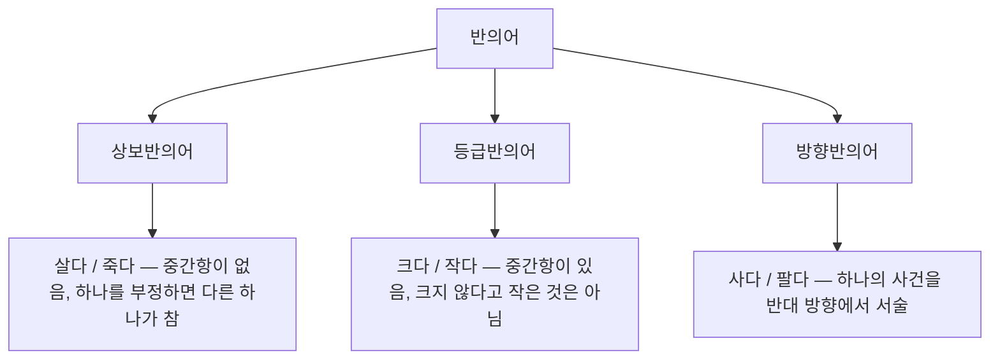
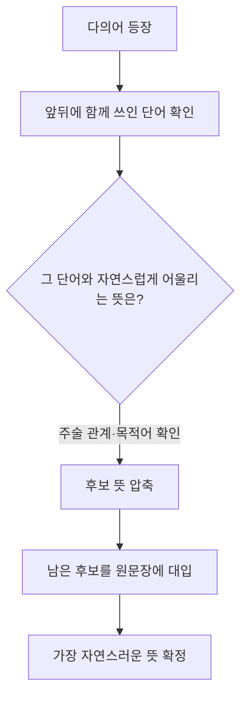

<Callout type="info">
  **이번 문서의 목표:** 유의어와 반의어를 감으로 고르지 않고 판정 기준으로 고르며, 다의어의 여러 뜻 중 문맥에 맞는 것을 골라내고, 한자성어·속담 문제에서 자주 나오는 함정 보기를 구조적으로 가려낼 수 있게 된다.
</Callout>

## 왜 어휘 문제가 나오는가

의사소통 능력을 평가할 때 가장 먼저 확인하는 것은 "정확한 단어를 골라 쓸 수 있는가"입니다. 보고서에서 "감소했다"와 "급감했다"를 구별하지 못하고 아무렇게나 쓰면 읽는 사람이 상황의 심각성을 잘못 판단합니다. 어휘 문제는 이런 미묘한 뜻 차이를 얼마나 정밀하게 구별하는지를 짧은 시간 안에 확인하는 유형입니다.

3편에서 한자성어의 음훈 구조를 읽는 법, 유의어·반의어·다의어의 정의, 문맥 단서를 찾는 기본기를 다뤘습니다. 이 편에서는 그 도구를 실제 문제에 적용해 정답을 판정하는 절차를 세웁니다.

## 1. 유의어 선택 문제

### 유의어란 무엇인가

**유의어**(類義語, synonym)는 소리와 형태는 다르지만 뜻이 서로 비슷한 단어입니다. "類"는 무리·비슷함을, "義"는 뜻을 가리켜, 글자 그대로 "뜻이 비슷한 무리의 말"이라는 의미입니다.

> **쉽게 말하면:** 서로 바꿔 써도 문장의 큰 의미가 크게 달라지지 않는 두 단어입니다.

문제는 여기서 시작됩니다. "크게 달라지지 않는다"는 것이지 "완전히 같다"는 것이 아닙니다. 이 차이를 무시하면 오답을 고릅니다.

### 완전유의어와 부분유의어

| 구분 | 정의 | 예시 |
|------|------|------|
| 완전유의어 | 모든 문맥에서 자유롭게 바꿔 쓸 수 있음 | 이름–성명, 어머니–모친 |
| 부분유의어 | 기본 뜻은 겹치지만 강도·격식·감정색채가 달라 일부 문맥에서만 교체 가능 | 가난하다–빈곤하다–청빈하다 |

실제로 완전유의어는 매우 드뭅니다. 대부분의 어휘 문제는 **부분유의어**를 다루며, 정답은 "가장 비슷한 것"이 아니라 "주어진 문맥에서 가장 자연스럽게 대체되는 것"입니다.

**작은 예시.** "가난하다" 계열 다섯 단어를 놓고 비교해 봅시다.

| 단어 | 공통 의미 | 추가되는 뜻 |
|------|-----------|-------------|
| 가난하다 | 재물이 넉넉하지 않다 | 중립적 서술 |
| 빈곤하다 | 재물이 넉넉하지 않다 | 정도가 심함, 다소 격식체 |
| 궁핍하다 | 재물이 넉넉하지 않다 | 당장 쓸 것이 없을 정도로 심각함 |
| 곤궁하다 | 재물이 넉넉하지 않다 | 처지가 딱하고 어려움에 방점 |
| 청빈하다 | 재물이 넉넉하지 않다 | 스스로 검소함을 택함, 긍정적 평가 |

**계산·적용 — 대입법.** "그는 평생 재물을 탐하지 않고 (  )한 생활을 했다"라는 문장이 있다고 합시다. 다섯 단어를 하나씩 넣어 자연스러움을 확인합니다.

- 가난하다: 넣을 수 있지만 문장의 앞부분(재물을 탐하지 않았다)과 어울리는 긍정적 뉘앙스가 부족합니다
- 빈곤·궁핍·곤궁: "재물을 탐하지 않았다"는 원인과 어울리지 않습니다. 이 세 단어는 형편이 어려워서 그런 것이지 스스로 택한 검소함이 아닙니다
- 청빈하다: "탐하지 않았다"는 원인과 정확히 맞물립니다

**결과 해석.** 정답은 청빈하다입니다. 다섯 단어가 모두 "재물이 넉넉하지 않다"는 공통 의미를 갖고 있어도, 문장이 요구하는 것은 그중에서도 **자발적으로 검소함을 택했다는 뉘앙스**입니다. 유의어 문제는 공통 의미가 아니라 이 미묘한 차이를 겨냥합니다.

### 자주 틀리는 점

- 가장 익숙한 단어를 무조건 정답으로 고르는 습관 — 일상에서 자주 쓰는 단어일수록 오답 보기로 자주 등장합니다
- 강도의 차이를 무시하는 것 — "줄다"와 "급감하다"는 유의 관계이지만 문장에 "서서히"라는 부사가 있으면 급감하다는 오답입니다
- 품사가 다른 보기를 유의어로 착각하는 것 — 형용사 자리에 부사·명사형 보기를 넣으면 문법적으로 이미 탈락입니다

## 2. 반의어 선택 문제

### 반의어의 세 유형

**반의어**(反義語, antonym)는 뜻이 서로 정반대인 단어입니다. 반의어는 모두 같은 성질이 아니라 아래 세 유형으로 나뉩니다.

- **상보반의어**: 두 단어 사이에 중간 단계가 없습니다. "살다"가 아니면 반드시 "죽다"입니다. "결혼했다"의 반의어인 "미혼이다"도 이 유형입니다
- **등급반의어**: 두 단어 사이에 중간 단계가 있습니다. "크지 않다"고 해서 자동으로 "작다"인 것은 아닙니다. "보통이다"라는 중간항이 있기 때문입니다. "덥다–춥다", "빠르다–느리다"가 이 유형입니다
- **방향반의어**: 하나의 사건이나 관계를 반대 방향에서 바라본 표현입니다. "사다"의 반대는 "팔다"이지만, 이 둘은 서로 다른 사건이 아니라 **같은 거래를 사는 쪽과 파는 쪽에서 각각 서술한 것**입니다. "위–아래", "부모–자식"도 이 유형입니다

**왜 유형 구분이 중요한가.** 등급반의어 문제에서 상보반의어처럼 "아니면 무조건 반대"라고 단정하면 함정에 걸립니다. "이 시험이 어렵지 않다"가 "이 시험은 쉽다"를 자동으로 뜻하지는 않습니다. "적당하다"라는 중간 판단이 남아 있기 때문입니다.

### 다의어의 반의어는 문맥마다 달라진다

**여기가 반의어 문제의 진짜 함정입니다.** 다의어는 뜻마다 반의어가 다릅니다.

**작은 예시.** "타다"라는 단어를 봅시다.

| 문맥 | "타다"의 뜻 | 반의어 |
|------|-------------|--------|
| 불에 타다 | 불에 의해 소실되다 | 꺼지다 · 식다(맥락에 따라) |
| 버스를 타다 | 탈것에 몸을 싣다 | 내리다 |
| 상을 타다 | 몫으로 받다 | 놓치다(문맥적) |
| 부끄러움을 타다 | 어떤 자극에 민감하게 반응하다 | 무디다(문맥적) |

**해석.** 반의어 문제에서 제시문의 "타다"가 어떤 뜻으로 쓰였는지 먼저 확정하지 않으면, 네 가지 반의어 후보 중 아무거나 골라 오답을 냅니다. 반의어를 찾기 전에 **원어의 뜻을 문맥 속에서 먼저 고정**하는 것이 순서입니다. 이 절차는 3절의 다의어 문맥 판단과 그대로 이어집니다.

### 자주 틀리는 점

- 등급반의어를 상보반의어처럼 다뤄 "아니다 = 반대다"로 성급하게 결론짓는 것
- 다의어의 한 가지 뜻만 생각하고 반의어를 고르는 것 — 제시문 속 뜻을 먼저 확정해야 합니다
- 유의어 보기를 반의어 문제에 섞어 놓은 경우, 뜻이 비슷한 단어를 무심코 고르는 것

## 3. 다의어 문맥 판단

### 다의어와 동음이의어 구별

**다의어**(多義語, polysemy)는 하나의 단어가 서로 관련된 여러 뜻을 갖는 경우입니다. "義"는 뜻이므로 "多義"는 "뜻이 많다"는 의미 그대로입니다. 반면 **동음이의어**(同音異義語, homonym)는 소리만 같을 뿐 어원과 뜻이 전혀 다른 별개의 단어입니다.

> **쉽게 말하면:** 다의어는 한 단어에서 뜻이 여러 갈래로 뻗어 나간 것이고, 동음이의어는 원래 남남인 단어 둘이 우연히 발음만 같아진 것입니다.

**구별하는 기준.** 사전을 찾아보면 다의어는 한 표제어 아래 1번, 2번, 3번 뜻으로 묶여 있고, 동음이의어는 아예 별도의 표제어(동음이의어 1, 동음이의어 2)로 분리되어 있습니다. 뜻 사이에 **역사적·의미적 연관성**이 있으면 다의어, 없으면 동음이의어입니다.

**작은 예시.**

| 단어 | 유형 | 뜻 갈래 |
|------|------|---------|
| 손 | 다의어 | 신체 부위 → 일하는 사람(일손) → 도움을 주는 관계(손을 빌리다) — 모두 신체 부위에서 파생 |
| 배 | 동음이의어 | 사람의 배(복부), 먹는 배(과일), 타는 배(선박) — 세 뜻 사이에 의미적 연관이 없음 |
| 다리 | 동음이의어 | 사람의 다리(신체), 강을 잇는 다리(교량) — 어원이 다른 별개의 단어 |

문제 풀이에서는 이 구별 자체보다 **문맥에 맞는 뜻을 정확히 골라내는 것**이 핵심입니다. 다의어든 동음이의어든 여러 뜻 중 하나를 문맥으로 고정하는 절차는 동일합니다.

### 문맥 단서로 뜻 고르기

핵심은 다의어 앞뒤에 놓인 단어, 곧 **공기 관계**(共起關係, collocation, 함께 나타나는 단어 관계)를 보는 것입니다. "손이 크다"에서 "크다"와 짝지어지면 "씀씀이가 후하다"는 뜻이 되고, "손이 맵다"에서 "맵다"와 짝지어지면 "일 처리가 야무지다"는 뜻이 됩니다. "손"이라는 단어 자체는 그대로인데, 함께 쓰인 서술어가 뜻을 결정합니다.

**작은 예시로 절차를 밟아 봅시다.** 다음 문장에서 "보다"의 뜻을 판단합니다.

"그는 이번 계약에서 손해를 볼 것으로 보았다."

- 1단계 — 공기 관계 확인: 앞의 "볼"은 "손해를"이라는 목적어와, 뒤의 "보았다"는 "~것으로"라는 인용 구조와 함께 쓰였습니다
- 2단계 — 후보 압축: "보다"에는 "눈으로 보다", "겪다·당하다"(손해를 보다), "판단하다"(~라고 보다) 등 여러 뜻이 있습니다. "손해를"과 짝지어진 첫 번째 "보다"는 "겪다"이고, "~것으로 보았다"의 두 번째 "보다"는 "판단하다"입니다
- 3단계 — 대입 검증: "손해를 겪을 것으로 판단했다"로 바꿔도 문장의 뜻이 그대로 유지됩니다

**결과 해석.** 한 문장 안에 같은 단어가 두 번 나와도 뜻이 다를 수 있습니다. 다의어 문제는 이렇게 **같은 형태·다른 뜻**을 정확히 분리하는 능력을 봅니다.

### 자주 틀리는 점

- 가장 먼저 떠오르는 뜻(사전에서 1번 뜻, 대개 가장 구체적이고 물리적인 뜻)을 무조건 정답으로 고르는 것 — 문맥이 다르면 후순위 뜻이 정답입니다
- 공기 관계를 무시하고 단어 하나만 보고 판단하는 것
- 다의어의 여러 뜻이 사전적으로 얼마나 떨어져 있는지와 무관하게, 오답 보기가 "완전히 틀린 뜻"이 아니라 "그럴듯하지만 문맥에 안 맞는 뜻"으로 나온다는 점을 간과하는 것

## 4. 한자성어·속담의 함정 보기

### 한자성어 음훈 구조 복습

3편에서 한자성어를 이루는 각 글자의 음(소리)과 훈(뜻)을 나눠 읽는 법을 다뤘습니다. 예를 들어 **동상이몽**(同床異夢)은 "같을 동, 평상 상, 다를 이, 꿈 몽"으로 쪼개져 "같은 잠자리에서 다른 꿈을 꾼다"는 축자적 의미가 나오고, 여기서 "겉으로는 함께하면서 속으로는 서로 다른 생각을 한다"는 비유적 의미로 확장됩니다. 이 편에서는 이 방식으로 자주 나오는 한자성어를 정리하고, 문제에서 실제로 어떻게 함정을 파는지를 봅니다.

### 자주 나오는 한자성어 지도

| 한자성어 | 음훈 풀이 | 뜻 | 헷갈리기 쉬운 짝 |
|----------|-----------|------|------------------|
| 각주구검 | 새길 각, 배 주, 구할 구, 칼 검 | 융통성 없이 낡은 방법을 고집함 | 수주대토(다른 이야기지만 같은 교훈으로 오인) |
| 수주대토 | 지킬 수, 그루터기 주, 기다릴 대, 토끼 토 | 우연한 요행을 계속 바람 | 각주구검(둘 다 어리석음을 뜻하지만 초점이 다름) |
| 조삼모사 | 아침 조, 셋 삼, 저물 모, 넷 사 | 눈앞의 차이만 다르게 느끼는 어리석음, 또는 잔꾀로 속임 | 조령모개(자주 혼동) |
| 조령모개 | 아침 조, 명령 령, 저물 모, 고칠 개 | 법령을 자주 바꿔 갈피를 잡을 수 없음 | 조삼모사(뜻이 다름에 주의) |
| 오비이락 | 까마귀 오, 날 비, 배 이, 떨어질 락 | 아무 관계 없는 두 일이 우연히 겹쳐 오해를 삼 | 결자해지(오답 보기로 자주 등장) |
| 결자해지 | 맺을 결, 사람 자, 풀 해, 갈 지 | 일을 저지른 사람이 그 일을 해결해야 함 | 오비이락과 무관, 자주 오답으로 섞임 |
| 자가당착 | 스스로 자, 창 과, 어조사 아니 당, 붙을 착 | 자기 말이나 행동이 앞뒤가 맞지 않음 | 모순(비슷한 뜻이지만 유래가 다름) |
| 견물생심 | 볼 견, 물건 물, 날 생, 마음 심 | 물건을 보면 갖고 싶은 마음이 생김 | 욕속부달(엉뚱하게 짝지어 오답으로 등장) |

**함정 유형 1 — 발음이나 구조가 비슷해 헷갈리는 짝.** 조삼모사와 조령모개는 "조"로 시작하는 넉 자 성어라는 점만 같을 뿐 뜻은 완전히 다릅니다. 이런 짝은 표에서 보듯 각 글자의 음훈을 분리해 읽으면 혼동이 사라집니다. "삼모사"는 숫자(셋, 넷)를 다루고 "령모개"는 명령과 고침을 다루므로, 글자만 봐도 주제가 다릅니다.

**함정 유형 2 — 뜻은 다른데 같은 상황에 쓸 수 있어 보이는 짝.** 오비이락과 결자해지는 둘 다 "일이 꼬였다"는 상황에 등장할 수 있어 문제에서 나란히 오답 보기로 놓입니다. 그러나 오비이락은 **우연의 일치로 인한 억울한 오해**를, 결자해지는 **책임의 소재**를 말합니다. 지문에 억울함이 강조되어 있는지 책임 소재가 강조되어 있는지를 봐야 합니다.

### 속담의 함정 유형

속담 문제의 함정은 크게 두 가지입니다.

<Steps>

1. **문자 그대로 해석하는 함정** — "소 잃고 외양간 고친다"를 "가축 관리 방법"으로 읽으면 안 됩니다. 실제 뜻은 "일이 이미 잘못된 뒤에야 대책을 세우는 것에 대한 비판"이라는 비유적 의미입니다
2. **비슷한 상황, 다른 교훈을 주는 속담을 혼동하는 함정** — "가는 말이 고와야 오는 말이 곱다"(내가 잘해야 상대도 잘한다, 상호성)와 "말 한마디에 천 냥 빚도 갚는다"(말의 힘이 크다, 언어의 영향력)는 둘 다 "말"을 다루지만 강조점이 다릅니다. 지문이 "상호작용"을 말하는지 "말의 위력"을 말하는지로 구별합니다

</Steps>

## 핵심 정리

- 유의어 문제는 "공통 의미"가 아니라 **문맥에서 요구하는 미묘한 뉘앙스**(강도·격식·감정색채)로 정답을 가른다
- 반의어는 상보반의어·등급반의어·방향반의어 세 유형으로 나뉘며, 등급반의어를 상보반의어처럼 "아니면 반대"로 단정하면 함정에 걸린다
- 다의어의 반의어는 뜻마다 다르므로, 반의어를 찾기 전에 **원어의 뜻을 문맥으로 먼저 고정**해야 한다
- 다의어와 동음이의어는 뜻 사이의 **의미적 연관성** 유무로 구별되지만, 문제 풀이에서는 공기 관계로 문맥에 맞는 뜻을 고르는 절차가 핵심이다
- 한자성어는 음훈 구조로 쪼개 읽으면 발음이 비슷한 짝(조삼모사–조령모개)이나 상황이 비슷한 짝(오비이락–결자해지)의 혼동을 피할 수 있다
- 속담은 문자 그대로 읽지 말고 비유적 의미로 해석하며, 비슷한 소재라도 강조점이 다른 속담을 구별해야 한다

## 마무리 복습

<Quiz
  questionNumber={1}
  question="다음 중 부분유의어 관계에 대한 설명으로 가장 적절한 것은?"
  options={['모든 문맥에서 예외 없이 서로 바꿔 쓸 수 있는 관계다', '기본 의미는 겹치지만 강도나 격식, 감정색채가 달라 일부 문맥에서만 교체할 수 있는 관계다', '소리는 같지만 뜻이 전혀 다른 별개의 단어 관계다', '한 단어에서 여러 뜻이 파생되어 나온 관계다']}
  correctAnswer={2}
  explanation="부분유의어는 가난하다와 청빈하다처럼 기본 의미는 겹치지만 강도나 격식, 감정색채 같은 세부 요소가 달라 모든 문맥에서 자유롭게 교체되지는 않는 관계다."
  optionExplanations={['그런 관계는 완전유의어이며 실제로는 매우 드물다.', '부분유의어의 정확한 정의다.', '이는 동음이의어에 대한 설명이다.', '이는 다의어에 대한 설명이다.']}
/>

<Quiz
  questionNumber={2}
  question="크다와 작다처럼 두 단어 사이에 보통이다 같은 중간 단계가 존재하는 반의어 유형은?"
  options={['상보반의어', '등급반의어', '방향반의어', '동음반의어']}
  correctAnswer={2}
  explanation="등급반의어는 두 단어 사이에 중간 단계가 있어 하나를 부정한다고 해서 자동으로 다른 하나가 되는 것은 아니다. 크지 않다고 해서 곧바로 작은 것은 아니며 보통이라는 중간 판단이 남아 있다."
  optionExplanations={['상보반의어는 살다와 죽다처럼 중간항이 없어 하나를 부정하면 다른 하나가 참이 된다.', '중간 단계가 존재한다는 설명과 정확히 일치한다.', '방향반의어는 사다와 팔다처럼 같은 사건을 반대 방향에서 서술한다.', '동음반의어라는 용어 자체가 존재하지 않는다.']}
/>

<Quiz
  questionNumber={3}
  question="타다라는 단어가 문맥에 따라 반의어가 달라지는 이유로 가장 적절한 것은?"
  options={['타다는 동음이의어이므로 반의어가 존재하지 않기 때문이다', '타다가 다의어여서 문맥마다 가리키는 뜻이 다르고, 그 뜻마다 반의어가 따로 정해지기 때문이다', '반의어는 원래 문맥과 무관하게 하나로 고정되기 때문이다', '한자성어와 혼동되기 쉬운 단어이기 때문이다']}
  correctAnswer={2}
  explanation="타다는 불에 타다, 버스를 타다, 상을 타다 등 여러 뜻을 가진 다의어이며, 각 뜻마다 어울리는 반의어가 따로 있다. 그래서 반의어를 찾기 전에 문맥 속 뜻을 먼저 확정해야 한다."
  optionExplanations={['타다는 여러 뜻이 서로 관련된 다의어에 해당한다.', '다의어이기 때문에 뜻마다 반의어가 달라진다는 설명이 정확하다.', '방향반의어를 제외하면 문맥에 따라 대응하는 반의어가 달라질 수 있다.', '한자성어 여부와는 관련이 없는 현상이다.']}
/>

<Quiz
  questionNumber={4}
  question="다의어와 동음이의어를 구별하는 기준으로 가장 적절한 것은?"
  options={['소리가 같은지 여부', '여러 뜻 사이에 역사적·의미적 연관성이 있는지 여부', '문장 성분으로 쓰이는 위치가 같은지 여부', '한자로 표기할 수 있는지 여부']}
  correctAnswer={2}
  explanation="손처럼 여러 뜻이 신체 부위라는 원래 의미에서 파생되어 서로 연관되어 있으면 다의어이고, 배처럼 뜻 사이에 아무 연관이 없으면 동음이의어다."
  optionExplanations={['소리가 같다는 점은 다의어와 동음이의어 모두에 해당하므로 구별 기준이 될 수 없다.', '의미적 연관성의 유무가 정확한 구별 기준이다.', '문장 성분 위치는 이 구별과 직접 관련이 없다.', '한자 표기 가능 여부는 이 구별의 기준이 아니다.']}
/>

<Quiz
  questionNumber={5}
  question="그는 이번 계약에서 손해를 볼 것으로 보았다 라는 문장에서 두 보다의 뜻을 바르게 짝지은 것은?"
  options={['둘 다 눈으로 본다는 뜻이다', '앞의 보다는 겪다, 뒤의 보다는 판단하다라는 뜻이다', '앞의 보다는 판단하다, 뒤의 보다는 겪다라는 뜻이다', '둘 다 판단하다라는 뜻으로 같다']}
  correctAnswer={2}
  explanation="손해를를 목적어로 취한 앞의 보다는 겪다라는 뜻이고, 것으로 보았다 구조의 뒤의 보다는 판단하다라는 뜻이다. 같은 단어라도 공기 관계에 따라 뜻이 갈린다."
  optionExplanations={['목적어가 손해를이라는 추상적 대상이므로 눈으로 본다는 뜻과는 맞지 않는다.', '공기 관계를 정확히 반영한 해석이다.', '두 보다의 뜻이 서로 뒤바뀐 설명이다.', '앞의 보다는 겪다라는 뜻이지 판단하다가 아니다.']}
/>

<Quiz
  questionNumber={6}
  question="조삼모사와 조령모개를 구별하는 방법으로 가장 적절한 것은?"
  options={['둘 다 같은 뜻이므로 구별할 필요가 없다', '앞 두 글자의 소리가 같으므로 뜻도 같다고 본다', '각 글자의 음과 뜻을 분리해 읽으면 숫자를 다루는지 명령과 고침을 다루는지가 드러나 구별된다', '두 성어 모두 사용 빈도가 낮아 시험에 나오지 않는다']}
  correctAnswer={3}
  explanation="조삼모사는 셋과 넷이라는 숫자를 다루어 눈앞의 차이에 속는 어리석음이나 잔꾀를 뜻하고, 조령모개는 명령과 고침을 다루어 법령이 자주 바뀜을 뜻한다. 음훈을 분리해 읽으면 이 차이가 분명해진다."
  optionExplanations={['두 성어는 다루는 주제가 서로 다르다.', '앞 두 글자의 소리가 같다고 뜻까지 같아지는 것은 아니다.', '음훈 분리 독해로 정확히 구별할 수 있다는 설명이다.', '실제로는 헷갈리는 짝으로 자주 출제된다.']}
/>

<Quiz
  questionNumber={7}
  question="소 잃고 외양간 고친다라는 속담에 대한 해석으로 가장 적절한 것은?"
  options={['가축을 안전하게 관리하는 구체적인 방법을 알려 주는 속담이다', '일이 이미 잘못된 뒤에야 뒤늦게 대책을 세우는 태도를 비판하는 속담이다', '외양간의 구조를 개선해야 한다는 건축상의 조언이다', '소를 잃어버리는 것은 어쩔 수 없는 일이라는 체념을 표현한다']}
  correctAnswer={2}
  explanation="이 속담은 문자 그대로의 가축 관리가 아니라, 일이 벌어진 뒤에야 대책을 세우는 늦은 대응을 비판하는 비유적 의미로 쓰인다."
  optionExplanations={['문자 그대로 해석하는 함정에 해당한다.', '속담의 핵심 교훈을 정확히 짚었다.', '속담의 비유적 의미와 무관한 해석이다.', '체념이 아니라 늦은 대응에 대한 비판이 핵심이다.']}
/>

## 참고 자료

- [NCS 국가직무능력표준 – 필기문항 예시문항](https://ncs.go.kr/blind/blp/bbs_lib_list.do?libDstinCd=55)
- [링커리어 – 인적성 검사 공부법 GSAT·SKCT·HMAT, 2026 최신 시험 구성 비교](https://community.linkareer.com/employment_data/6482010)
- [나무위키 – 적성검사](https://namu.wiki/w/%EC%A0%81%EC%84%B1%EA%B2%80%EC%82%AC)
