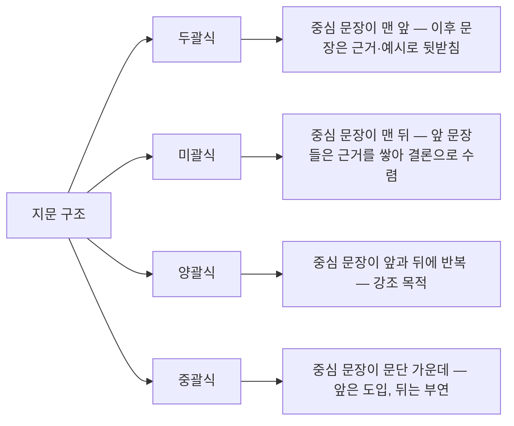

<Callout type="info">
  **이번 문서의 목표:** 지문을 처음부터 끝까지 다시 읽지 않고도 중심 문장과 주제를 짚어내고, 지문의 구조(두괄식·미괄식·양괄식·중괄식)를 읽어 결론이 어디에 있을지 예측하며, 세부정보 일치·불일치 문제에서 흔한 함정을 피할 수 있게 된다.
</Callout>

## 왜 독해 기초 유형이 나오는가

문서를 빠르고 정확하게 읽는 능력은 보고서를 검토하거나 규정을 확인하는 모든 업무의 기본입니다. 독해 기초 유형은 "이 글이 결국 무슨 말을 하는가"(주제)와 "이 글에 실제로 이렇게 쓰여 있는가"(세부정보)를 구별하는 능력을 확인합니다. 이 둘은 서로 다른 능력입니다. 주제를 잘 파악해도 세부 문장 하나를 놓치면 일치·불일치 문제를 틀리고, 세부 문장을 꼼꼼히 봐도 전체 글의 방향을 놓치면 주제 찾기 문제를 틀립니다.

## 1. 중심 문장과 주제 찾기

### 중심 문장이란

**중심 문장**은 한 문단에서 나머지 문장들이 뒷받침하는 하나의 핵심 주장을 담은 문장입니다. 나머지 문장은 **뒷받침 문장**으로, 중심 문장의 근거·예시·부연 설명 역할을 합니다.

> **쉽게 말하면:** 문단을 한 문장으로 요약하라고 하면 나오는 바로 그 문장이 중심 문장입니다.

**주제**는 여러 문단을 관통하는, 글 전체 수준의 중심 생각입니다. 중심 문장이 문단 단위의 요약이라면, 주제는 글 단위의 요약입니다.

### 절차 — 문단별 핵심어에서 주제로

<Steps>

1. **각 문단에서 반복되는 핵심어를 표시한다** — 같은 단어가 그대로 반복되지 않아도, 유의어나 대명사로 이어지는 경우도 같은 핵심어로 봅니다
2. **핵심어를 중심으로 그 문단의 중심 문장을 한 문장으로 정리한다**
3. **문단별 중심 문장을 모아 공통되는 주장을 찾는다** — 이것이 전체 지문의 주제입니다
4. **보기 중 주제보다 좁거나(문단 하나의 내용만 다룸) 넓은(지문에 없는 내용까지 포함) 것을 제외한다**

</Steps>

**작은 예시.** 다음 세 문단으로 이루어진 짧은 글이 있다고 합시다.

- 1문단: 전기차 배터리는 충전과 방전을 반복하면서 서서히 성능이 떨어진다. 이를 **열화**(劣化, 성능이 나빠짐)라 부른다
- 2문단: 열화를 늦추려면 완전 충전과 완전 방전을 자주 반복하지 않고, 20에서 80퍼센트 구간에서 충전하는 것이 유리하다
- 3문단: 배터리 제조사들은 이런 사용 습관을 반영해 배터리 관리 시스템이 자동으로 충전 상한을 조절하는 기능을 넣고 있다

**적용.** 1문단의 핵심어는 배터리·열화, 중심 문장은 "배터리는 반복 사용으로 성능이 떨어진다"입니다. 2문단의 핵심어는 열화·충전 습관, 중심 문장은 "충전 습관으로 열화 속도를 조절할 수 있다"입니다. 3문단의 핵심어는 배터리 관리 시스템, 중심 문장은 "제조사가 이 습관을 자동화 기능으로 반영한다"입니다.

**결과 해석.** 세 중심 문장을 모으면 "배터리는 사용 습관에 따라 열화 속도가 달라지며, 이를 반영해 관리 기술이 발전하고 있다"는 주제가 나옵니다. "전기차 배터리는 무조건 수명이 짧다"는 1문단만 본 좁은 요약이고, "전기차 산업의 미래"는 지문에 없는 내용까지 포함한 넓은 요약이라 둘 다 오답입니다.

### 자주 틀리는 점

- 가장 많이 등장한 단어를 곧바로 주제로 착각하는 것 — 반복 빈도가 아니라 **문단들이 공통으로 뒷받침하는 주장**이 주제입니다
- 첫 문단의 내용만으로 전체 주제를 단정하는 것 — 두괄식이 아닌 지문에서는 이 방법이 통하지 않습니다(다음 절 참고)
- 지문에 등장한 사실이지만 글의 중심이 아닌 지엽적인 정보를 주제로 고르는 것

## 2. 세부정보 일치·불일치 판단

### 판단 기준

세부정보 문제는 "지문에 이런 내용이 있는가"를 묻습니다. 정답 판단은 오직 **지문에 적힌 내용**을 기준으로 하며, 상식적으로 맞는 말이라도 지문에 없으면 "알 수 없음" 또는 "불일치"로 처리합니다.

> **쉽게 말하면:** 세부정보 문제는 논리 퀴즈가 아니라 대조 작업입니다. 맞는 말을 찾는 것이 아니라 **지문에 쓰인 말과 같은지**를 찾는 것입니다.

### 자주 나오는 함정 유형

| 함정 유형 | 설명 | 예시 |
|-----------|------|------|
| 부분 긍정을 전체 긍정으로 확대 | 지문은 "일부는 그렇다"인데 보기는 "모두 그렇다"로 확대 | 지문: 일부 배터리는 열화가 빠르다 / 보기: 모든 배터리는 열화가 빠르다 |
| 비교 대상 뒤바꾸기 | 지문의 비교 방향과 보기의 비교 방향이 반대 | 지문: A가 B보다 크다 / 보기: B가 A보다 크다 |
| 인과관계 뒤바꾸기 | 원인과 결과의 순서를 바꿔 서술 | 지문: 습관이 열화를 늦춘다 / 보기: 열화가 습관을 바꾼다 |
| 언급되지 않은 정보를 사실처럼 제시 | 지문에 없는 내용을 마치 있는 것처럼 서술 | 지문에 없는 특정 브랜드명을 보기에 등장시킴 |
| 시제·정도 부사 슬쩍 바꾸기 | 지문은 "점차"인데 보기는 "즉시"로 바꿈 | 지문: 서서히 떨어진다 / 보기: 즉시 떨어진다 |

**계산·적용.** 위 배터리 예시 지문을 기준으로 다음 네 보기를 판정해 봅시다.

- 보기 1 "모든 전기차 배터리는 완전 충전을 하면 즉시 고장 난다" → 지문에는 "즉시 고장"이라는 표현이 없고 "서서히 성능이 떨어진다"는 열화 개념만 있으므로 **불일치**(정도 부사 왜곡)
- 보기 2 "20에서 80퍼센트 구간 충전은 열화 속도를 늦추는 데 유리하다" → 2문단 내용과 그대로 일치하므로 **일치**
- 보기 3 "배터리 관리 시스템은 열화를 완전히 막아 배터리 수명을 무한히 늘린다" → 지문은 "충전 상한을 조절"한다고 했을 뿐 "완전히 막는다"거나 "무한히 늘린다"고 하지 않았으므로 **불일치**(부분 긍정의 확대)
- 보기 4 "특정 제조사가 이 기능을 세계 최초로 개발했다" → 지문에 언급되지 않은 정보이므로 **알 수 없음**(언급되지 않은 정보)

### 자주 틀리는 점

- "얼추 비슷하니 맞다"고 넘기는 것 — 세부정보 문제는 정도 부사 하나, 비교 방향 하나까지 정확히 대조해야 합니다
- 상식적으로 참이면 지문에 없어도 "일치"로 처리하는 것 — 반드시 지문 근거가 있어야 합니다
- "언급되지 않음"과 "불일치"를 구별하지 않는 것 — 지문과 정반대이면 불일치, 아예 언급이 없으면 알 수 없음으로 나뉘는 문제가 따로 출제됩니다

## 3. 지문 구조 읽기 — 두괄식과 미괄식

### 네 가지 구조

글의 중심 문장이 어디에 놓이는지에 따라 구조가 나뉩니다. 구조를 먼저 파악하면 중심 문장을 찾는 시간이 크게 줄어듭니다.

- **두괄식**(頭括式, 머리 두·묶을 괄): 문단 앞머리에서 결론부터 제시합니다. 이후 문장은 "왜냐하면", "예를 들어" 같은 표지어로 근거를 덧붙입니다
- **미괄식**(尾括式, 꼬리 미): 문단 끝에서 결론을 제시합니다. "따라서", "결국", "이처럼" 같은 표지어 다음에 중심 문장이 옵니다. 여러 근거를 먼저 쌓고 마지막에 결론으로 수렴하는 논증문에서 자주 씁니다
- **양괄식**(兩括式): 두괄식과 미괄식을 합쳐 중심 문장을 앞뒤에 한 번씩 반복합니다. 주장을 강조하고 싶을 때 씁니다
- **중괄식**(中括式): 중심 문장이 문단 중간에 있습니다. 앞부분은 화제를 꺼내는 도입이고 뒷부분은 사례나 부연입니다

### 판별 신호 — 접속어와 표지어

| 신호 위치 | 신호가 되는 표현 | 가리키는 구조 |
|-----------|------------------|----------------|
| 문단 첫머리 | 그런데, 하지만, 문제는 (반전 후 주장 제시) | 두괄식 가능성 높음 |
| 문단 끝부분 | 따라서, 결국, 요컨대, 이처럼 | 미괄식 가능성 높음 |
| 문단 중간 | 특히, 무엇보다 | 그 문장이 핵심일 가능성 |
| 두 군데 모두 유사한 문장 | 첫 문장과 끝 문장이 표현만 다르고 같은 주장 | 양괄식 |

**적용.** "따라서"로 시작하는 문장이 문단 맨 끝에 있다면, 그 앞 문장들은 전부 근거이고 정답의 핵심은 "따라서" 뒤 문장에 있습니다. 반대로 문단이 "그러나 실제로는"으로 시작하면, 그 문장이 이미 이 문단의 주장이고 뒤는 부연 설명일 가능성이 큽니다.

**결과 해석.** 구조를 먼저 알면 지문 전체를 같은 속도로 읽을 필요가 없습니다. 두괄식이면 첫 문장에 집중하고, 미괄식이면 마지막 문장까지 읽어야 정답 근거를 놓치지 않습니다.

### 자주 틀리는 점

- 모든 지문을 두괄식으로 가정하고 첫 문장만 보고 답을 정하는 것 — 미괄식 지문에서는 이 방법이 정반대의 오답을 만듭니다
- "따라서" 같은 표지어 앞의 근거 문장을 중심 문장으로 착각하는 것 — 표지어 **뒤** 문장이 결론입니다
- 양괄식 지문에서 앞뒤 문장의 표현이 달라 서로 다른 주장이라고 오해하는 것 — 표현이 달라도 같은 주장을 반복하는지 먼저 확인해야 합니다

## 핵심 정리

- 중심 문장은 문단 단위 요약, 주제는 지문 전체 단위 요약이며, 문단별 중심 문장을 모아야 주제가 나온다
- 세부정보 일치·불일치는 상식이 아니라 **지문에 적힌 내용과의 대조**로만 판단하며, 부분 긍정의 확대·비교 방향 뒤바꾸기·인과관계 뒤바꾸기·언급되지 않은 정보 삽입·정도 부사 왜곡이 대표 함정이다
- 불일치(정반대 서술)와 알 수 없음(언급 자체가 없음)은 서로 다른 판정이다
- 지문 구조는 두괄식·미괄식·양괄식·중괄식으로 나뉘며, "따라서" 등 표지어의 위치로 구조를 미리 파악하면 정답 근거를 빠르게 찾을 수 있다
- 표지어 앞은 근거, 표지어 뒤는 결론이라는 방향을 혼동하지 않아야 한다

## 마무리 복습

<Quiz
  questionNumber={1}
  question="중심 문장과 주제의 관계에 대한 설명으로 가장 적절한 것은?"
  options={['중심 문장은 지문 전체의 요약이고 주제는 한 문단의 요약이다', '중심 문장은 문단 단위의 요약이고 주제는 여러 문단을 관통하는 지문 전체 단위의 요약이다', '중심 문장과 주제는 항상 똑같은 문장으로 표현된다', '주제는 지문에서 가장 많이 반복된 단어 하나로 정해진다']}
  correctAnswer={2}
  explanation="중심 문장은 한 문단을 요약한 문장이고, 주제는 여러 문단의 중심 문장이 공통으로 가리키는 지문 전체 수준의 핵심 생각이다."
  optionExplanations={['중심 문장과 주제의 범위가 서로 뒤바뀐 설명이다.', '문단 단위와 지문 전체 단위라는 범위 차이를 정확히 짚었다.', '같은 문장으로 표현되는 경우도 있지만 항상 그런 것은 아니다.', '반복 빈도만으로 주제를 정하면 지엽적인 단어를 주제로 오인할 수 있다.']}
/>

<Quiz
  questionNumber={2}
  question="지문에 일부 배터리는 열화가 빠르다고 쓰여 있는데 보기에 모든 배터리는 열화가 빠르다라고 되어 있다면 이 보기는 어떤 함정 유형에 해당하는가?"
  options={['비교 대상 뒤바꾸기', '부분 긍정을 전체 긍정으로 확대', '인과관계 뒤바꾸기', '언급되지 않은 정보를 사실처럼 제시']}
  correctAnswer={2}
  explanation="지문은 일부에 대해서만 서술했는데 보기는 이를 전체로 확대했으므로 부분 긍정을 전체 긍정으로 확대하는 함정에 해당한다."
  optionExplanations={['비교 대상을 뒤바꾼 것이 아니라 범위를 확대한 경우다.', '일부를 전체로 확대한 전형적인 사례다.', '원인과 결과의 순서가 바뀐 것이 아니다.', '지문에 없는 새로운 정보를 추가한 경우가 아니라 기존 정보의 범위를 확대한 경우다.']}
/>

<Quiz
  questionNumber={3}
  question="지문에 언급되지 않은 내용을 보기에서 사실인 것처럼 제시했을 때의 올바른 판정은?"
  options={['지문과 반대되는 내용이므로 불일치로 판정한다', '지문에 없는 내용이므로 알 수 없음으로 판정한다', '상식적으로 그럴듯하면 일치로 판정한다', '지문의 주제와 관련 있으면 일치로 판정한다']}
  correctAnswer={2}
  explanation="세부정보 판단은 지문 근거로만 이루어지며, 지문에 아예 언급되지 않은 내용은 반대로 서술된 것이 아니라 근거 자체가 없는 것이므로 알 수 없음으로 판정한다."
  optionExplanations={['정반대로 서술된 경우에 해당하는 판정이며 이 경우와는 다르다.', '언급 자체가 없는 정보에 대한 정확한 판정이다.', '상식적 그럴듯함은 세부정보 판단의 기준이 될 수 없다.', '주제와의 관련성만으로 사실 여부를 판정할 수는 없다.']}
/>

<Quiz
  questionNumber={4}
  question="한 문단에서 결론에 해당하는 문장이 따라서와 같은 표지어 뒤, 문단의 맨 끝에 놓이는 구조는?"
  options={['두괄식', '미괄식', '양괄식', '중괄식']}
  correctAnswer={2}
  explanation="미괄식은 앞에서 여러 근거를 쌓고 마지막에 따라서 같은 표지어와 함께 결론을 제시하는 구조다."
  optionExplanations={['두괄식은 결론이 문단 맨 앞에 온다.', '결론이 문단 끝에 오는 구조에 대한 정확한 설명이다.', '양괄식은 결론이 앞뒤에 한 번씩 반복된다.', '중괄식은 결론이 문단 중간에 위치한다.']}
/>

<Quiz
  questionNumber={5}
  question="지문 구조를 먼저 파악하는 것이 독해에 도움이 되는 이유로 가장 적절한 것은?"
  options={['모든 지문을 처음부터 끝까지 같은 속도로 읽어야 하기 때문이다', '중심 문장이 놓일 위치를 예측해 정답 근거를 더 빠르게 찾을 수 있기 때문이다', '지문 구조를 알면 세부정보 문제를 풀지 않아도 되기 때문이다', '두괄식 지문만 시험에 출제되기 때문이다']}
  correctAnswer={2}
  explanation="지문 구조를 미리 파악하면 두괄식은 첫 문장, 미괄식은 마지막 문장에 집중하는 식으로 읽는 전략을 세울 수 있어 정답 근거를 빠르게 찾을 수 있다."
  optionExplanations={['구조를 파악하는 목적은 오히려 균일한 속도로 읽지 않아도 되게 하는 데 있다.', '정답 근거를 빠르게 찾을 수 있다는 설명이 정확하다.', '지문 구조 파악과 세부정보 문제 풀이는 별개의 과정이다.', '지문은 두괄식 외에도 미괄식, 양괄식, 중괄식으로 다양하게 출제된다.']}
/>

<Quiz
  questionNumber={6}
  question="양괄식 지문에서 첫 문장과 끝 문장의 표현이 서로 다를 때 가장 먼저 확인해야 할 것은?"
  options={['둘 중 어느 문장이 더 길게 쓰였는지', '표현은 달라도 같은 주장을 반복하고 있는지', '두 문장에 같은 단어가 몇 번 나오는지', '어느 문장이 먼저 나왔는지']}
  correctAnswer={2}
  explanation="양괄식은 표현이 다르더라도 같은 주장을 강조를 위해 반복하는 구조이므로, 서로 다른 주장으로 오해하기 전에 표현만 다를 뿐 같은 주장인지를 먼저 확인해야 한다."
  optionExplanations={['문장의 길이는 같은 주장인지 여부와 직접 관련이 없다.', '표현이 달라도 같은 주장인지 확인하는 것이 핵심이다.', '단어 반복 횟수만으로는 같은 주장인지 판단할 수 없다.', '문장이 나온 순서는 이미 알고 있는 정보이며 판단 기준이 아니다.']}
/>

## 참고 자료

- [NCS 국가직무능력표준 – 직업기초능력 (공식)](https://www.ncs.go.kr/th03/TH0302List.do?dirSeq=121)
- [NCS 국가직무능력표준 – 필기문항 예시문항 (공식)](https://ncs.go.kr/blind/blp/bbs_lib_list.do?libDstinCd=55)
- [링커리어 – NCS 기출문제 유형별 예시 및 풀이 전략](https://community.linkareer.com/employment_data/4182192)
