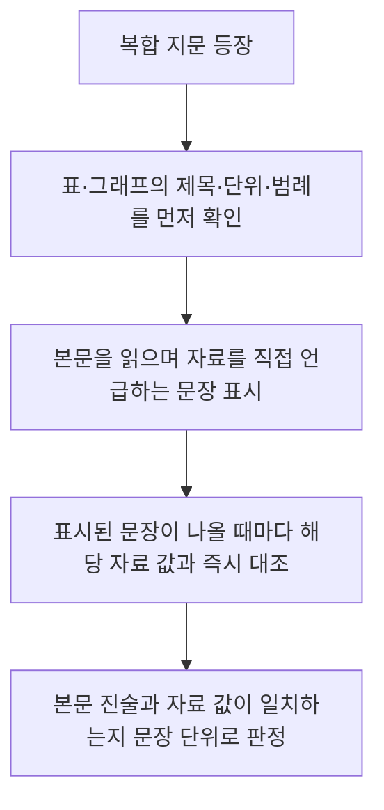

<Callout type="info">
  **이번 문서의 목표:** 지문에 적히지 않은 전제를 논증 구조로부터 찾아내고, 필자가 어떤 태도로 글을 썼는지 문장의 단서로 판단하며, 표·그래프가 섞인 복합 지문을 본문과 자료를 오가며 정확한 순서로 읽을 수 있게 된다.
</Callout>

## 왜 심화 독해가 나오는가

6편에서 다룬 세부정보 문제는 **지문에 쓰인 그대로**를 확인하는 작업이었습니다. 심화 독해는 한 걸음 더 나아가, **지문에 쓰이지 않았지만 논리적으로 반드시 있어야 하는 내용**(생략된 전제), **글쓴이가 명시하지 않았지만 문장의 뉘앙스로 드러내는 태도**(필자 의도), **본문과 자료를 오가며 종합해야 나오는 결론**(복합 지문)을 다룹니다. 셋 다 "지문에 그대로 있는가"를 넘어 "지문으로부터 무엇을 이끌어낼 수 있는가"를 묻는다는 공통점이 있습니다.

## 1. 생략된 전제 추론

### 논증의 구조 복습

하나의 논증은 **전제**(premise, 주장의 근거가 되는 문장)와 **결론**(conclusion, 전제로부터 이끌어낸 주장)으로 이루어집니다. 그런데 실제 글에서는 전제를 전부 적지 않습니다. 너무 당연하다고 생각하는 전제는 생략하기 때문입니다. 이렇게 생략된, 그러나 논증이 성립하려면 반드시 참이어야 하는 전제를 **숨은 전제**(implicit premise, 생략된 전제)라 부릅니다.

> **쉽게 말하면:** 지문이 "그러니까 결론은 이렇다"라고 말할 때, 그 사이에 말은 안 했지만 당연히 깔고 있는 문장을 찾는 것입니다.

### 절차 — 결론에서 거꾸로 필요조건 찾기

<Steps>

1. **지문에서 명시된 전제와 결론을 각각 한 문장으로 뽑는다**
2. **전제만으로 결론이 논리적으로 나오는지 확인한다** — 나오지 않는다면 그 간극을 메우는 문장이 숨은 전제다
3. **숨은 전제 후보를 만들어 전제 자리에 채워 넣고, 결론이 자연스럽게 도출되는지 검증한다**
4. **보기 중 이 후보와 일치하는 문장을 고른다** — 지나치게 강한 단정(항상, 모두, 반드시)이나 지나치게 약한 진술(가끔, 일부만)은 오답일 가능성이 높다

</Steps>

**작은 예시.** 다음 논증을 봅시다.

"재택근무를 도입한 회사는 사무실 임대 비용을 줄일 수 있다. 그러므로 이 회사는 재택근무를 도입해 이익을 늘려야 한다."

**적용.**

- 명시된 전제: 재택근무를 도입하면 임대 비용이 줄어든다
- 결론: 재택근무를 도입해 이익을 늘려야 한다
- 간극 확인: "임대 비용이 준다"는 것만으로는 "이익이 늘어난다"는 결론이 바로 나오지 않습니다. 비용을 줄이는 것과 이익이 느는 것 사이에는 "다른 조건이 그대로라면 비용 절감은 이익 증가로 이어진다" 또는 적어도 "임대 비용 절감분이 재택근무 도입에 따른 다른 손실(협업 효율 저하 등)보다 크다"는 전제가 필요합니다
- 숨은 전제 후보: "재택근무 도입으로 인한 다른 부수적 손실은 임대 비용 절감분보다 작다"
- 검증: 이 문장을 전제에 추가하면 "비용은 줄고, 그 절감분이 다른 손실보다 크므로 결국 이익이 늘어난다"는 결론이 자연스럽게 이어집니다

**결과 해석.** 숨은 전제는 결론과 전제 사이의 논리적 빈틈을 메우는 문장이며, 그 문장이 부정되면 논증 전체가 무너집니다. 위 예시에서 "재택근무로 협업 효율이 크게 떨어져 임대 비용 절감분보다 손실이 크다"는 반박이 성립하면 결론은 유지될 수 없습니다. 이 성질(부정하면 논증이 무너진다)이 숨은 전제를 찾는 최종 검증 기준입니다.

### 자주 틀리는 점

- 전제를 그대로 반복한 문장을 숨은 전제로 착각하는 것 — 숨은 전제는 **이미 적힌 전제와 다른, 추가로 필요한 문장**입니다
- 결론과 무관하게 지문 어딘가에 나온 사실을 숨은 전제로 고르는 것 — 반드시 전제와 결론 사이의 논리적 간극을 메우는 문장이어야 합니다
- 지나치게 강한 보기("항상", "모든 경우에")를 성급하게 고르는 것 — 논증이 성립하는 데 필요한 최소한의 전제보다 강한 단정은 대개 오답입니다

## 2. 필자 의도·태도 파악

### 사실 진술과 주장의 구분

지문의 모든 문장이 같은 무게를 갖지 않습니다. **사실 진술**은 검증 가능한 객관적 정보를 전달하고, **주장**은 필자의 판단·평가·해석을 담습니다.

> **쉽게 말하면:** "매출이 10퍼센트 늘었다"는 사실이고, "이 결과는 매우 고무적이다"는 주장입니다.

### 태도를 읽는 단서

| 단서 | 예시 표현 | 시사하는 태도 |
|------|-----------|----------------|
| 평가성 형용사·부사 | 다행히, 우려스럽게도, 안타깝게도 | 긍정적 또는 부정적 태도 명시 |
| 강조 부사 | 특히, 무엇보다, 결코 | 필자가 중요하게 여기는 지점 |
| 양보 접속어 뒤의 반전 | 물론 장점도 있지만, 그러나 | 접속어 뒤 문장이 필자의 실제 입장 |
| 수사적 질문 | 이것이 과연 최선일까 | 겉으로는 질문이지만 실제로는 부정적 답을 암시하는 주장 |
| 인용부호·거리두기 표현 | 이른바, 소위, `-라는` | 그 표현에 대한 필자의 유보적·비판적 태도 |

**작은 예시.** 다음 두 문장을 비교해 봅시다.

- 문장 A: "이 정책으로 대상 지역의 소득이 5퍼센트 상승했다."
- 문장 B: "이 정책으로 대상 지역의 소득이 5퍼센트 상승했다지만, 정작 체감 효과는 미미하다는 지적이 많다."

**적용.** 문장 A는 순수한 사실 진술로 필자의 태도가 드러나지 않습니다. 문장 B는 "~했다지만"이라는 양보 접속 표현 뒤에 "체감 효과는 미미하다"는 반전이 이어져, 필자가 이 정책의 성과에 **회의적** 태도를 갖고 있음을 드러냅니다. 앞의 "5퍼센트 상승"은 필자 자신의 결론이 아니라 반박하기 위해 인용한 남의 주장에 가깝습니다.

**결과 해석.** 태도 파악 문제에서는 지문에 등장한 수치나 사실 자체보다, 그 사실을 필자가 **어떤 접속어와 어떤 평가어로 감쌌는가**를 봐야 합니다. 양보 접속어("~하지만", "물론 ~지만") 뒤에 오는 문장이 필자의 진짜 입장일 확률이 높습니다.

### 자주 틀리는 점

- 지문에 인용된 타인의 주장을 필자 본인의 주장으로 착각하는 것
- 중립적 태도와 무관심을 혼동하는 것 — 중립은 양쪽 근거를 균형 있게 제시하는 것이지 판단을 회피하는 것이 아닙니다
- 수사적 질문을 문자 그대로 "정보를 몰라서 묻는 질문"으로 읽는 것 — 수사적 질문은 답이 이미 정해진 강한 주장입니다

## 3. 복합 지문 읽는 순서 — 본문과 자료(표·그래프) 오가기

### 왜 순서가 중요한가

표나 그래프가 섞인 지문을 처음부터 끝까지 순서대로 읽으면, 본문에서 언급한 수치를 표에서 다시 찾느라 같은 자료를 두 번 보게 됩니다. 순서를 정해 두면 이 낭비를 줄일 수 있습니다.

<Steps>

1. **표·그래프의 제목, 단위, 범례부터 확인한다** — "억 원"인지 "만 원"인지, "전년 대비"인지 "누적"인지를 놓치면 이후 모든 대조가 틀어집니다
2. **본문을 읽으며 자료를 직접 가리키는 문장("표에서 보듯", "그림과 같이")을 표시한다**
3. **표시된 문장이 나올 때마다 바로 그 자리에서 해당 자료 값과 대조한다** — 본문을 다 읽은 뒤 한꺼번에 대조하면 어떤 문장이 어떤 값을 가리켰는지 헷갈립니다
4. **본문에는 없지만 자료에만 있는 값, 자료에는 없지만 본문에만 있는 해석을 구분해 표시한다**

</Steps>

**작은 예시.** 다음은 짧은 복합 지문입니다.

본문: "지난 5년간 재생에너지 발전 비중은 꾸준히 상승했다. 특히 2024년에는 전년 대비 상승 폭이 가장 컸다."

| 연도 | 재생에너지 발전 비중(퍼센트) |
|------|------------------------------|
| 2021 | 12 |
| 2022 | 14 |
| 2023 | 15 |
| 2024 | 19 |
| 2025 | 21 |

**적용.** 1단계에서 표의 단위가 "퍼센트"이고 "재생에너지 발전 비중"이라는 항목임을 확인합니다. 2단계에서 "특히 2024년에는 전년 대비 상승 폭이 가장 컸다"는 문장이 표를 직접 가리키는 문장임을 표시합니다. 3단계에서 연도별 상승 폭을 계산합니다.

$$
2022년\ 상승폭 = 14 - 12 = 2
$$

$$
2023년\ 상승폭 = 15 - 14 = 1
$$

$$
2024년\ 상승폭 = 19 - 15 = 4
$$

$$
2025년\ 상승폭 = 21 - 19 = 2
$$

**결과 해석.** 상승 폭은 2022년 2퍼센트포인트, 2023년 1퍼센트포인트, 2024년 4퍼센트포인트, 2025년 2퍼센트포인트입니다. 2024년의 상승 폭 4퍼센트포인트가 가장 크므로 본문의 "2024년에 상승 폭이 가장 컸다"는 서술은 표와 **일치**합니다. 만약 본문이 "2025년에 상승 폭이 가장 컸다"고 서술했다면 표와 어긋나는 불일치 문장이 됩니다.

### 자주 틀리는 점

- 표의 단위를 확인하지 않고 숫자만 비교하는 것 — "퍼센트"(비중)와 "퍼센트포인트"(비중의 변화량)를 혼동하면 상승 폭 계산 자체가 틀어집니다
- 본문을 다 읽고 나서 표를 몰아서 보는 것 — 어떤 문장이 어떤 수치를 가리켰는지 기억이 뒤섞입니다
- 본문의 해석과 표의 원자료를 같은 층위로 취급하는 것 — 표는 원자료이고 본문은 그 자료에 대한 필자의 해석이므로, 해석이 자료를 과장하거나 축소하지 않았는지 항상 대조해야 합니다

## 핵심 정리

- 숨은 전제는 명시된 전제만으로 결론이 나오지 않을 때, 그 간극을 메우는 문장이며 "부정하면 논증이 무너지는가"로 검증한다
- 사실 진술과 주장을 구분하고, 평가성 부사·양보 접속어·수사적 질문 같은 단서로 필자의 태도를 읽는다
- 인용된 타인의 주장과 필자 본인의 입장을 혼동하지 않으며, 양보 접속어 뒤 문장이 필자의 실제 입장일 가능성이 높다
- 복합 지문은 표·그래프의 제목과 단위를 먼저 확인한 뒤, 본문에서 자료를 가리키는 문장이 나올 때마다 즉시 대조하는 순서로 읽는다
- 비중(퍼센트)과 비중의 변화량(퍼센트포인트)을 구분하지 못하면 자료 해석 자체가 틀어진다

## 마무리 복습

<Quiz
  questionNumber={1}
  question="숨은 전제를 찾는 방법으로 가장 적절한 것은?"
  options={['지문에 이미 적힌 전제를 그대로 다시 고르면 된다', '결론과 무관하게 지문에 등장한 아무 문장이나 고르면 된다', '전제만으로 결론이 논리적으로 나오지 않을 때 그 간극을 메워 결론을 성립시키는 문장을 찾는다', '가장 강하게 단정하는 문장을 항상 정답으로 고른다']}
  correctAnswer={3}
  explanation="숨은 전제는 명시된 전제와 결론 사이의 논리적 간극을 메워, 그것을 추가했을 때 결론이 자연스럽게 도출되도록 만드는 문장이다."
  optionExplanations={['이미 적힌 전제를 반복하는 것은 새로운 전제를 추가하는 것이 아니다.', '결론과의 논리적 연관이 없는 문장은 숨은 전제가 될 수 없다.', '전제와 결론 사이의 간극을 메운다는 설명이 정확하다.', '지나치게 강한 단정은 오히려 오답일 가능성이 높다.']}
/>

<Quiz
  questionNumber={2}
  question="재택근무를 도입한 회사는 사무실 임대 비용을 줄일 수 있다. 그러므로 이 회사는 재택근무를 도입해 이익을 늘려야 한다 라는 논증에서 숨은 전제로 가장 적절한 것은?"
  options={['재택근무를 도입한 모든 회사는 반드시 이익이 늘어난다', '재택근무 도입에 따른 다른 손실이 임대 비용 절감분보다 작다', '사무실 임대 비용은 회사 지출 중 가장 큰 항목이다', '재택근무는 직원 만족도를 반드시 높인다']}
  correctAnswer={2}
  explanation="비용 절감이 곧바로 이익 증가로 이어지려면, 재택근무로 발생하는 다른 손실이 절감된 비용보다 작아야 한다는 전제가 필요하다. 이 전제가 없으면 비용 절감과 이익 증가 사이의 논리적 간극이 메워지지 않는다."
  optionExplanations={['반드시라는 지나치게 강한 단정으로 실제 필요한 전제보다 과하다.', '결론이 성립하기 위해 반드시 필요한 최소한의 전제다.', '임대 비용이 가장 큰 항목인지는 이 논증의 성립 여부와 직접 관련이 없다.', '직원 만족도는 이 논증에서 다루는 이익과 직접 연결되지 않는다.']}
/>

<Quiz
  questionNumber={3}
  question="이 정책으로 대상 지역의 소득이 5퍼센트 상승했다지만 정작 체감 효과는 미미하다는 지적이 많다 라는 문장에서 필자의 태도로 가장 적절한 것은?"
  options={['정책의 성과를 전적으로 지지하는 태도', '정책의 성과에 회의적인 태도', '수치 자체에 관심이 없는 무관심한 태도', '중립적으로 양쪽 입장을 동등하게 소개하는 태도']}
  correctAnswer={2}
  explanation="하지만에 해당하는 양보 접속 표현 뒤에 체감 효과가 미미하다는 반전이 이어지므로, 앞의 수치는 반박을 위해 인용된 것이고 필자는 정책 성과에 회의적인 태도를 드러낸다."
  optionExplanations={['전적으로 지지한다면 뒤에 반박하는 지적을 덧붙이지 않았을 것이다.', '양보 접속어 뒤의 반전 문장이 필자의 실제 입장을 드러낸다는 설명과 일치한다.', '수치와 지적을 모두 제시한 것은 무관심이 아니라 판단을 전달하기 위함이다.', '뒤의 지적이 앞의 수치보다 강조되어 있어 완전한 중립으로 보기 어렵다.']}
/>

<Quiz
  questionNumber={4}
  question="수사적 질문에 대한 설명으로 가장 적절한 것은?"
  options={['필자가 정보를 몰라서 독자에게 답을 구하는 순수한 질문이다', '겉으로는 질문 형식이지만 실제로는 이미 정해진 답을 암시하는 강한 주장이다', '지문에서 사실 정보만을 전달하는 문장이다', '항상 긍정적인 평가를 담고 있는 문장이다']}
  correctAnswer={2}
  explanation="수사적 질문은 형식만 질문일 뿐 필자가 이미 결론을 갖고 있으며, 그 결론을 질문 형식으로 강조해서 전달하는 주장에 해당한다."
  optionExplanations={['정보를 몰라서 묻는 질문이라면 뒤이어 답을 찾는 서술이 이어져야 하지만 수사적 질문은 그렇지 않다.', '형식은 질문이지만 실질은 강한 주장이라는 설명이 정확하다.', '사실 정보 전달이 아니라 필자의 판단을 담은 주장에 해당한다.', '부정적 평가를 담는 수사적 질문도 흔하므로 항상 긍정적이라 할 수 없다.']}
/>

<Quiz
  questionNumber={5}
  question="표·그래프가 섞인 복합 지문을 읽을 때 가장 먼저 해야 할 일은?"
  options={['본문을 처음부터 끝까지 다 읽은 뒤 표를 한꺼번에 본다', '표·그래프의 제목과 단위, 범례를 먼저 확인한다', '보기를 먼저 읽고 본문에서 정답을 역으로 찾는다', '표의 숫자를 모두 암기한 뒤 본문을 읽는다']}
  correctAnswer={2}
  explanation="단위를 확인하지 않으면 이후 본문과 자료를 대조하는 모든 과정이 틀어질 수 있으므로 제목과 단위, 범례부터 확인하는 것이 첫 단계다."
  optionExplanations={['본문과 자료를 나눠서 몰아 읽으면 어떤 문장이 어떤 값을 가리켰는지 헷갈리기 쉽다.', '단위를 먼저 확인해야 이후 대조 과정에서 오류가 생기지 않는다.', '보기를 먼저 보는 것은 순서 전략과는 별개의 문제이며 단위 확인을 대체하지 않는다.', '숫자를 암기하는 것은 비효율적이며 필요할 때 대조하는 방식이 더 정확하다.']}
/>

<Quiz
  questionNumber={6}
  question="재생에너지 발전 비중이 2023년 15퍼센트에서 2024년 19퍼센트로 증가했을 때 이 증가분을 올바르게 표현한 것은?"
  options={['4퍼센트 증가했다', '4퍼센트포인트 증가했다', '19퍼센트포인트 증가했다', '약 27퍼센트포인트 증가했다']}
  correctAnswer={2}
  explanation="비중 자체의 차이인 19에서 15를 뺀 값 4는 비율의 변화량이므로 퍼센트포인트 단위로 표현해야 하며, 퍼센트라는 단위는 그 자체가 비율일 때 쓰인다."
  optionExplanations={['비중의 차이는 퍼센트가 아니라 퍼센트포인트로 표현해야 한다.', '비중의 변화량을 퍼센트포인트로 정확히 표현했다.', '19는 2024년의 비중 값이지 증가분이 아니다.', '증가율로 환산한 값이지만 이 문제에서 요구하는 표현 방식과 다르다.']}
/>

## 참고 자료

- [NCS 국가직무능력표준 – 직업기초능력 (공식)](https://www.ncs.go.kr/th03/TH0302List.do?dirSeq=121)
- [NCS 국가직무능력표준 – 필기문항 예시문항 (공식)](https://ncs.go.kr/blind/blp/bbs_lib_list.do?libDstinCd=55)
- [링커리어 – NCS 기출문제 유형별 예시 및 풀이 전략](https://community.linkareer.com/employment_data/4182192)
