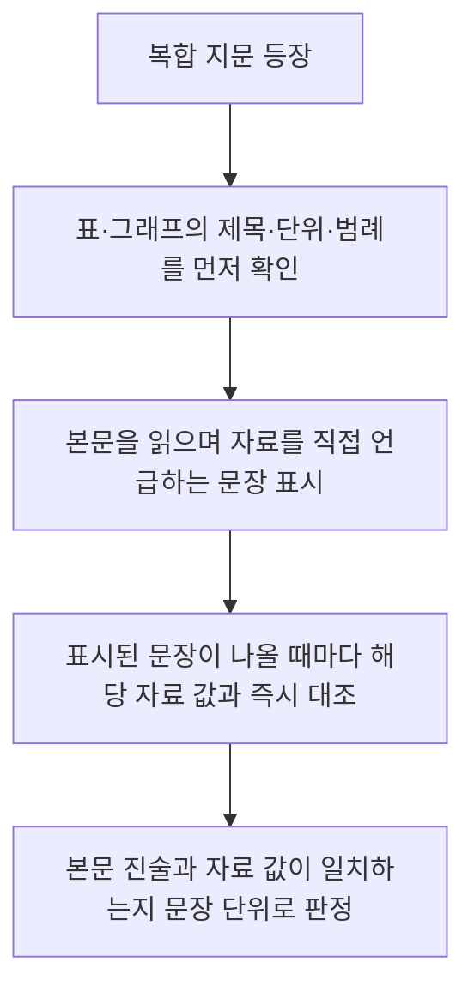

## 왜 심화 독해가 나오는가

6편에서 다룬 세부정보 문제는 **지문에 쓰인 그대로**를 확인하는 작업이었습니다. 심화 독해는 한 걸음 더 나아가, **지문에 쓰이지 않았지만 논리적으로 반드시 있어야 하는 내용**(생략된 전제), **글쓴이가 명시하지 않았지만 문장의 뉘앙스로 드러내는 태도**(필자 의도), **본문과 자료를 오가며 종합해야 나오는 결론**(복합 지문)을 다룹니다.

## 1. 생략된 전제 추론

### 논증의 구조 복습

하나의 논증은 **전제**(premise, 주장의 근거가 되는 문장)와 **결론**(conclusion, 전제로부터 이끌어낸 주장)으로 이루어집니다. 이렇게 생략된, 그러나 논증이 성립하려면 반드시 참이어야 하는 전제를 **숨은 전제**(implicit premise, 생략된 전제)라 부릅니다.

### 절차 — 결론에서 거꾸로 필요조건 찾기

**작은 예시.** 다음 논증을 봅시다.

"재택근무를 도입한 회사는 사무실 임대 비용을 줄일 수 있다. 그러므로 이 회사는 재택근무를 도입해 이익을 늘려야 한다."

**적용.**

- 명시된 전제: 재택근무를 도입하면 임대 비용이 줄어든다
- 결론: 재택근무를 도입해 이익을 늘려야 한다
- 간극 확인: "임대 비용이 준다"는 것만으로는 "이익이 늘어난다"는 결론이 바로 나오지 않습니다. 비용을 줄이는 것과 이익이 느는 것 사이에는 "다른 조건이 그대로라면 비용 절감은 이익 증가로 이어진다" 또는 적어도 "임대 비용 절감분이 재택근무 도입에 따른 다른 손실(협업 효율 저하 등)보다 크다"는 전제가 필요합니다
- 숨은 전제 후보: "재택근무 도입으로 인한 다른 부수적 손실은 임대 비용 절감분보다 작다"
- 검증: 이 문장을 전제에 추가하면 "비용은 줄고, 그 절감분이 다른 손실보다 크므로 결국 이익이 늘어난다"는 결론이 자연스럽게 이어집니다

**결과 해석.** 숨은 전제는 결론과 전제 사이의 논리적 빈틈을 메우는 문장이며, 그 문장이 부정되면 논증 전체가 무너집니다. 위 예시에서 "재택근무로 협업 효율이 크게 떨어져 임대 비용 절감분보다 손실이 크다"는 반박이 성립하면 결론은 유지될 수 없습니다.

### 자주 틀리는 점

- 전제를 그대로 반복한 문장을 숨은 전제로 착각하는 것 — 숨은 전제는 **이미 적힌 전제와 다른, 추가로 필요한 문장**입니다
- 결론과 무관하게 지문 어딘가에 나온 사실을 숨은 전제로 고르는 것 — 반드시 전제와 결론 사이의 논리적 간극을 메우는 문장이어야 합니다
- 지나치게 강한 보기("항상", "모든 경우에")를 성급하게 고르는 것 — 논증이 성립하는 데 필요한 최소한의 전제보다 강한 단정은 대개 오답입니다

## 2. 필자 의도·태도 파악

### 사실 진술과 주장의 구분

지문의 모든 문장이 같은 무게를 갖지 않습니다. **사실 진술**은 검증 가능한 객관적 정보를 전달하고, **주장**은 필자의 판단·평가·해석을 담습니다.

### 태도를 읽는 단서

| 단서 | 예시 표현 | 시사하는 태도 |
|------|-----------|----------------|
| 평가성 형용사·부사 | 다행히, 우려스럽게도, 안타깝게도 | 긍정적 또는 부정적 태도 명시 |
| 강조 부사 | 특히, 무엇보다, 결코 | 필자가 중요하게 여기는 지점 |
| 양보 접속어 뒤의 반전 | 물론 장점도 있지만, 그러나 | 접속어 뒤 문장이 필자의 실제 입장 |
| 수사적 질문 | 이것이 과연 최선일까 | 겉으로는 질문이지만 실제로는 부정적 답을 암시하는 주장 |
| 인용부호·거리두기 표현 | 이른바, 소위, `-라는` | 그 표현에 대한 필자의 유보적·비판적 태도 |

**작은 예시.** 다음 두 문장을 비교해 봅시다.

- 문장 A: "이 정책으로 대상 지역의 소득이 5퍼센트 상승했다."
- 문장 B: "이 정책으로 대상 지역의 소득이 5퍼센트 상승했다지만, 정작 체감 효과는 미미하다는 지적이 많다."

**적용.** 문장 A는 순수한 사실 진술로 필자의 태도가 드러나지 않습니다. 문장 B는 "~했다지만"이라는 양보 접속 표현 뒤에 "체감 효과는 미미하다"는 반전이 이어져, 필자가 이 정책의 성과에 **회의적** 태도를 갖고 있음을 드러냅니다.

**결과 해석.** 태도 파악 문제에서는 지문에 등장한 수치나 사실 자체보다, 그 사실을 필자가 **어떤 접속어와 어떤 평가어로 감쌌는가**를 봐야 합니다. 양보 접속어("~하지만", "물론 ~지만") 뒤에 오는 문장이 필자의 진짜 입장일 확률이 높습니다.

### 자주 틀리는 점

- 지문에 인용된 타인의 주장을 필자 본인의 주장으로 착각하는 것
- 중립적 태도와 무관심을 혼동하는 것 — 중립은 양쪽 근거를 균형 있게 제시하는 것이지 판단을 회피하는 것이 아닙니다
- 수사적 질문을 문자 그대로 "정보를 몰라서 묻는 질문"으로 읽는 것 — 수사적 질문은 답이 이미 정해진 강한 주장입니다

## 3. 복합 지문 읽는 순서 — 본문과 자료(표·그래프) 오가기

### 왜 순서가 중요한가

표나 그래프가 섞인 지문을 처음부터 끝까지 순서대로 읽으면, 본문에서 언급한 수치를 표에서 다시 찾느라 같은 자료를 두 번 보게 됩니다. 순서를 정해 두면 이 낭비를 줄일 수 있습니다.

```mermaid
graph TD
  A[복합 지문 등장] --> B[표·그래프의 제목·단위·범례를 먼저 확인]
  B --> C[본문을 읽으며 자료를 직접 언급하는 문장 표시]
  C --> D[표시된 문장이 나올 때마다 해당 자료 값과 즉시 대조]
  D --> E[본문 진술과 자료 값이 일치하는지 문장 단위로 판정]
```

**작은 예시.** 다음은 짧은 복합 지문입니다.

본문: "지난 5년간 재생에너지 발전 비중은 꾸준히 상승했다. 특히 2024년에는 전년 대비 상승 폭이 가장 컸다."

| 연도 | 재생에너지 발전 비중(퍼센트) |
|------|------------------------------|
| 2021 | 12 |
| 2022 | 14 |
| 2023 | 15 |
| 2024 | 19 |
| 2025 | 21 |

**적용.** 1단계에서 표의 단위가 "퍼센트"이고 "재생에너지 발전 비중"이라는 항목임을 확인합니다. 2단계에서 "특히 2024년에는 전년 대비 상승 폭이 가장 컸다"는 문장이 표를 직접 가리키는 문장임을 표시합니다. 3단계에서 연도별 상승 폭을 계산합니다.

$$
2022년\ 상승폭 = 14 - 12 = 2
$$

$$
2023년\ 상승폭 = 15 - 14 = 1
$$

$$
2024년\ 상승폭 = 19 - 15 = 4
$$

$$
2025년\ 상승폭 = 21 - 19 = 2
$$

**결과 해석.** 상승 폭은 2022년 2퍼센트포인트, 2023년 1퍼센트포인트, 2024년 4퍼센트포인트, 2025년 2퍼센트포인트입니다. 2024년의 상승 폭 4퍼센트포인트가 가장 크므로 본문의 "2024년에 상승 폭이 가장 컸다"는 서술은 표와 **일치**합니다.

### 자주 틀리는 점

- 표의 단위를 확인하지 않고 숫자만 비교하는 것 — "퍼센트"(비중)와 "퍼센트포인트"(비중의 변화량)를 혼동하면 상승 폭 계산 자체가 틀어집니다
- 본문을 다 읽고 나서 표를 몰아서 보는 것 — 어떤 문장이 어떤 수치를 가리켰는지 기억이 뒤섞입니다
- 본문의 해석과 표의 원자료를 같은 층위로 취급하는 것 — 표는 원자료이고 본문은 그 자료에 대한 필자의 해석이므로, 해석이 자료를 과장하거나 축소하지 않았는지 항상 대조해야 합니다

## 핵심 정리

- 숨은 전제는 명시된 전제만으로 결론이 나오지 않을 때, 그 간극을 메우는 문장이며 "부정하면 논증이 무너지는가"로 검증한다
- 사실 진술과 주장을 구분하고, 평가성 부사·양보 접속어·수사적 질문 같은 단서로 필자의 태도를 읽는다
- 인용된 타인의 주장과 필자 본인의 입장을 혼동하지 않으며, 양보 접속어 뒤 문장이 필자의 실제 입장일 가능성이 높다
- 복합 지문은 표·그래프의 제목과 단위를 먼저 확인한 뒤, 본문에서 자료를 가리키는 문장이 나올 때마다 즉시 대조하는 순서로 읽는다
- 비중(퍼센트)과 비중의 변화량(퍼센트포인트)을 구분하지 못하면 자료 해석 자체가 틀어진다

## 마무리 복습

<Quiz
  questionNumber={1}
  question={"숨은 전제를 찾는 방법으로 가장 적절한 것은?"}
  options={["지문에 이미 적힌 전제를 그대로 다시 고르면 된다","결론과 무관하게 지문에 등장한 아무 문장이나 고르면 된다","전제만으로 결론이 논리적으로 나오지 않을 때 그 간극을 메워 결론을 성립시키는 문장을 찾는다","가장 강하게 단정하는 문장을 항상 정답으로 고른다"]}
  correctAnswer={3}
  explanation={"숨은 전제는 명시된 전제와 결론 사이의 논리적 간극을 메워, 그것을 추가했을 때 결론이 자연스럽게 도출되도록 만드는 문장이다."}
/>

<Quiz
  questionNumber={2}
  question={"재택근무를 도입한 회사는 사무실 임대 비용을 줄일 수 있다. 그러므로 이 회사는 재택근무를 도입해 이익을 늘려야 한다 라는 논증에서 숨은 전제로 가장 적절한 것은?"}
  options={["재택근무를 도입한 모든 회사는 반드시 이익이 늘어난다","재택근무 도입에 따른 다른 손실이 임대 비용 절감분보다 작다","사무실 임대 비용은 회사 지출 중 가장 큰 항목이다","재택근무는 직원 만족도를 반드시 높인다"]}
  correctAnswer={2}
  explanation={"비용 절감이 곧바로 이익 증가로 이어지려면, 재택근무로 발생하는 다른 손실이 절감된 비용보다 작아야 한다는 전제가 필요하다."}
/>

<Quiz
  questionNumber={3}
  question={"이 정책으로 대상 지역의 소득이 5퍼센트 상승했다지만 정작 체감 효과는 미미하다는 지적이 많다 라는 문장에서 필자의 태도로 가장 적절한 것은?"}
  options={["정책의 성과를 전적으로 지지하는 태도","정책의 성과에 회의적인 태도","수치 자체에 관심이 없는 무관심한 태도","중립적으로 양쪽 입장을 동등하게 소개하는 태도"]}
  correctAnswer={2}
  explanation={"하지만에 해당하는 양보 접속 표현 뒤에 체감 효과가 미미하다는 반전이 이어지므로, 앞의 수치는 반박을 위해 인용된 것이고 필자는 정책 성과에 회의적인 태도를 드러낸다."}
/>

## 참고 자료

- [NCS 국가직무능력표준 – 직업기초능력 (공식)](https://www.ncs.go.kr/th03/TH0302List.do?dirSeq=121)
- [NCS 국가직무능력표준 – 필기문항 예시문항 (공식)](https://ncs.go.kr/blind/blp/bbs_lib_list.do?libDstinCd=55)
- [링커리어 – NCS 기출문제 유형별 예시 및 풀이 전략](https://community.linkareer.com/employment_data/4182192)
