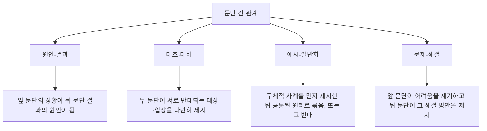

<Callout type="info">
  **이번 문서의 목표:** 뒤섞인 문장들을 접속어·지시어 단서로 원래 순서로 되돌리고, 문단과 문단 사이의 관계(원인-결과, 대조, 예시-일반화, 문제-해결)를 판별하며, 주어진 한 문장이 지문의 어느 자리에 들어가야 하는지 근거를 들어 찾을 수 있게 된다.
</Callout>

## 왜 이 유형이 나오는가

6편에서 지문 구조(두괄식·미괄식)를 읽어 결론의 위치를 예측하는 법을 다뤘습니다. 그 지문 구조는 문장들이 **이미 올바른 순서로 놓여 있다**는 전제 위에 있었습니다. 이 편은 그 전제를 뒤집어, 문장이나 문단이 뒤섞여 있을 때 원래 순서를 되찾는 능력을 다룹니다. 문서 작성·편집 과정에서 문단의 순서가 어색하면 논리 흐름이 끊기기 때문에, 올바른 순서를 알아보는 능력은 잘 쓰인 글과 그렇지 않은 글을 구별하는 기본 감각입니다.

## 1. 접속어와 지시어로 순서 찾기

### 접속어의 종류와 방향성

**접속어**는 문장과 문장 사이의 관계를 밝히는 말입니다. 접속어마다 앞 문장과 어떤 관계로 이어지는지가 정해져 있으므로, 접속어만 보고도 앞에 어떤 내용이 와야 하는지 예측할 수 있습니다.

| 접속어 유형 | 예시 표현 | 앞 문장과의 관계 |
|-------------|-----------|--------------------|
| 순접 | 그리고, 그래서, 그러면 | 앞 내용을 자연스럽게 이어받음 |
| 역접 | 그러나, 하지만, 반면에 | 앞 내용과 반대·대조되는 내용이 뒤따름 |
| 인과 | 따라서, 그러므로, 왜냐하면 | 앞은 원인(또는 근거), 뒤는 결과(또는 주장) — 왜냐하면은 방향이 반대임에 주의 |
| 예시 | 예를 들어, 가령 | 앞의 일반적 진술을 구체화하는 사례가 뒤따름 |
| 첨가 | 게다가, 또한, 아울러 | 앞과 같은 방향으로 내용을 추가함 |
| 요약 | 요컨대, 결국, 정리하면 | 앞의 여러 내용을 하나로 압축함 |

**"왜냐하면"의 방향에 특히 주의합니다.** "따라서"는 원인 문장 뒤에 결과 문장이 오지만, "왜냐하면"은 결과(또는 주장) 문장 뒤에 원인 문장이 옵니다. 두 접속어를 방향을 반대로 착각하면 순서를 거꾸로 배열하게 됩니다.

### 지시어의 역할

**지시어**(이, 그, 저 및 이것·그것·이러한·그러한 같은 지시대명사·지시관형사)는 앞에서 이미 언급된 대상을 다시 가리킵니다. 그래서 지시어가 포함된 문장은 **절대 첫 문장이 될 수 없습니다.** 가리킬 대상이 아직 등장하지 않았기 때문입니다.

> **쉽게 말하면:** "그것"이라는 말이 나오려면 그 앞에 "그것"이 무엇인지 먼저 나와 있어야 합니다.

### 첫 문장을 찾는 기준

<Steps>

1. **지시어로 시작하는 문장을 첫 문장 후보에서 제외한다**
2. **접속어(그리고, 그러나, 따라서 등)로 시작하는 문장도 첫 문장 후보에서 제외한다** — 접속어는 앞선 내용을 전제하기 때문이다
3. **남은 문장 중 가장 포괄적인 화제를 도입하는 문장을 첫 문장으로 정한다**
4. **첫 문장이 정해지면, 그 문장이 언급한 대상을 지시어로 받는 문장을 다음 순서로 연결한다**

</Steps>

**작은 예시.** 다음 네 문장을 순서대로 배열해 봅시다.

- (가) 그러나 이 기술에는 데이터 편향이라는 심각한 한계도 존재한다
- (나) 인공지능 기술은 최근 다양한 산업 분야에서 빠르게 활용되고 있다
- (다) 이러한 한계를 극복하기 위해 최근에는 편향을 자동으로 탐지하는 기법이 연구되고 있다
- (라) 예를 들어 의료 진단, 금융 심사, 채용 심사 등에서 인공지능의 판단이 활용된다

**적용.**

- 1단계·2단계: (가)는 "그러나"로, (다)는 "이러한"이라는 지시어로 시작하므로 첫 문장 후보에서 제외합니다. (라)는 "예를 들어"로 시작해 앞에 일반적 진술이 있어야 하므로 역시 제외합니다
- 3단계: 남은 (나)가 "인공지능 기술이 활용되고 있다"는 가장 포괄적인 화제를 도입하므로 첫 문장입니다
- 4단계: (나)의 "다양한 산업 분야에서 활용"을 구체화하는 문장을 찾으면 "예를 들어"로 시작하는 (라)가 이어집니다. (라)에서 언급한 활용 사례 다음에는 그 활용의 문제점을 지적하는 "그러나"의 (가)가 이어지고, (가)에서 말한 "심각한 한계"를 "이러한 한계"로 받는 (다)가 마지막입니다

**결과 해석.** 완성된 순서는 (나)-(라)-(가)-(다)입니다. 화제 도입 → 구체적 사례 → 반전(한계 지적) → 지시어로 받은 후속 대응이라는 흐름이 접속어와 지시어만으로 재구성됩니다.

### 자주 틀리는 점

- "그리고"나 "또한" 같은 순접 접속어가 있는 문장도 무조건 뒤에 놓아야 한다고 오해해, 정작 지시어가 없는 다른 문장을 잘못 첫 문장으로 고르는 것
- "왜냐하면"의 방향을 "따라서"와 같다고 착각해 원인과 결과 문장의 순서를 거꾸로 배열하는 것
- 지시어가 가리키는 대상을 정확히 확인하지 않고 그럴듯해 보이는 순서로 짜맞추는 것 — 지시어는 반드시 **바로 앞에 언급된 특정 대상**을 가리켜야 합니다

## 2. 문단 간 논리적 관계

문장 배열의 원리는 문단 단위로 확장됩니다. 문단과 문단 사이에도 아래와 같은 전형적인 관계가 있습니다.

**판별 방법.** 각 문단의 중심 문장(6편 참고)을 뽑은 뒤, 두 중심 문장 사이의 의미 관계를 봅니다.

- **원인-결과**: 앞 문단 중심 문장이 상황·조건을 설명하고, 뒤 문단 중심 문장이 그로 인해 벌어진 일을 설명하면 원인-결과입니다. "그 결과", "이로 인해" 같은 표지가 문단 첫머리에 오는 경우가 많습니다
- **대조**: 두 문단이 같은 대상의 서로 다른 두 측면, 또는 서로 다른 두 대상의 같은 기준에서의 차이를 다루면 대조입니다. "반면", "이와 달리"가 표지입니다
- **예시-일반화**: 한 문단이 구체적 사례 하나를, 다른 문단이 여러 사례를 아우르는 원리를 다루면 예시-일반화입니다. 순서는 사례가 먼저 오고 일반화가 나중에 오는 경우와, 일반적 원리를 먼저 제시하고 사례로 뒷받침하는 경우 둘 다 가능합니다
- **문제-해결**: 앞 문단이 어려움이나 한계를 지적하고, 뒤 문단이 그것을 극복하는 방안을 제시하면 문제-해결입니다

**작은 예시.** "1문단: 도심 지역의 주차 공간 부족으로 불법 주차가 급증하고 있다" 다음에 "2문단: 이를 해결하기 위해 일부 지방자치단체는 거주자 우선 주차 구역을 확대하고 있다"가 이어진다면, 1문단이 제기한 어려움을 2문단이 해결책으로 받는 **문제-해결** 관계입니다. "이를 해결하기 위해"라는 표지가 이 관계를 명확히 드러냅니다.

## 3. 주어진 문장의 삽입 위치 찾기

### 절차

주어진 한 문장을 지문의 특정 위치에 끼워 넣는 문제는 앞서 배운 접속어·지시어 판별과 문단 관계 판별을 동시에 적용합니다.

<Steps>

1. **삽입할 문장 안의 접속어와 지시어를 확인한다** — 이 문장이 앞 문장에 대해 어떤 관계(순접·역접·인과·예시)로 이어져야 하는지, 그리고 어떤 대상을 가리키는 지시어를 담고 있는지 파악한다
2. **지시어가 가리키는 대상이 무엇인지, 지문에서 그 대상이 처음 언급된 위치를 찾는다** — 삽입 문장은 반드시 그 위치 **뒤**에 들어가야 한다
3. **후보 위치 앞뒤 문장을 삽입 문장과 나란히 놓고 접속 관계가 자연스러운지 확인한다** — 앞 문장과의 관계뿐 아니라 뒤 문장과의 연결도 함께 검증해야 한다
4. **삽입 후 그 자리의 앞뒤 문장끼리 남겨진 연결이 어색해지지 않는지 확인한다** — 문장을 빼내는 바람에 원래 매끄럽던 앞뒤 연결이 끊어지지 않아야 정답이다

</Steps>

**작은 예시.** 다음 지문에 보기 문장 "하지만 이러한 편리함에는 개인정보 유출이라는 대가가 따른다"를 넣을 위치를 찾아봅시다.

지문: "(1) 최근 다양한 애플리케이션이 위치 정보를 활용해 맞춤형 서비스를 제공한다. (2) 사용자는 별도의 입력 없이도 근처 매장이나 교통 정보를 즉시 받아볼 수 있다. (3) 기업들은 이 편의성을 앞세워 서비스 이용자를 늘리고 있다. (4) 결국 위치 정보 제공에 동의하는 대신 얻는 편리함이 이 서비스들의 핵심 경쟁력이 되었다."

**적용.**

- 1단계: 보기 문장은 "하지만"이라는 역접 접속어로 시작하고, "이러한 편리함"이라는 지시어로 앞선 내용을 받습니다
- 2단계: "편리함"에 해당하는 내용은 (2)의 "편리함" 서술에서 처음 등장합니다. 따라서 보기 문장은 (2) 이후에 들어가야 합니다
- 3단계: (2)와 (3) 사이에 넣어 봅니다. (2)에서 편리함을 설명한 직후 "하지만 그 편리함에는 대가가 따른다"는 반전이 오고, 이어서 (3)의 "기업들은 이 편의성을 앞세워"라는 문장을 이어 붙이면 반전 이후 다시 원래 화제로 돌아가는 흐름이 어색해집니다
- (3)과 (4) 사이에 넣어 봅니다. (3)에서 기업이 편의성을 앞세운다고 말한 직후 "하지만 그 편리함에는 개인정보 유출이라는 대가가 따른다"는 반전이 오고, 이어서 (4)의 "결국 동의하는 대신 얻는 편리함이 핵심 경쟁력이 되었다"는 결론으로 이어지면 반전을 거쳐 결론에 도달하는 자연스러운 흐름이 만들어집니다

**결과 해석.** 정답은 (3)과 (4) 사이입니다. 지시어가 가리키는 대상의 첫 등장 위치를 확인하는 것만으로는 후보를 좁힐 뿐이고, 최종 확정은 **앞뒤 문장 모두와의 접속 관계**를 함께 검증해야 나옵니다.

### 자주 틀리는 점

- 지시어가 가리키는 대상이 처음 등장한 바로 다음 자리에 무조건 넣는 것 — 여러 후보 위치가 나올 수 있으므로 뒤 문장과의 연결까지 반드시 확인해야 합니다
- 삽입 문장을 넣고 앞과의 관계만 확인한 뒤 뒤 문장과의 연결은 확인하지 않는 것
- 삽입 문장을 빼낸 자리의 앞뒤 문장끼리 남은 연결이 이미 매끄러운데도 그 사이에 억지로 끼워 넣는 것

## 핵심 정리

- 접속어는 앞 문장과의 관계(순접·역접·인과·예시·첨가·요약)를 드러내며, "왜냐하면"은 "따라서"와 방향이 반대다
- 지시어를 포함한 문장과 접속어로 시작하는 문장은 첫 문장이 될 수 없다
- 문단 간 관계는 원인-결과, 대조, 예시-일반화, 문제-해결로 유형화되며 각 문단의 중심 문장을 비교해 판별한다
- 문장 삽입 문제는 삽입 문장의 접속어·지시어로 후보 위치를 좁힌 뒤, 앞뒤 문장 모두와의 접속 관계를 함께 검증해 최종 위치를 정한다
- 삽입 후 원래 자리의 앞뒤 연결이 오히려 끊어지지 않는지도 함께 확인해야 한다

## 마무리 복습

<Quiz
  questionNumber={1}
  question="지시어로 시작하는 문장이 첫 문장이 될 수 없는 이유로 가장 적절한 것은?"
  options={['지시어는 문법적으로 문장 맨 앞에 올 수 없기 때문이다', '지시어가 가리키는 대상이 아직 앞에서 언급되지 않았기 때문이다', '지시어가 있으면 문장의 길이가 너무 길어지기 때문이다', '지시어는 결론에서만 사용할 수 있기 때문이다']}
  correctAnswer={2}
  explanation="지시어는 앞서 언급된 대상을 다시 가리키는 말이므로, 가리킬 대상이 앞에 존재하지 않는 첫 문장에는 올 수 없다."
  optionExplanations={['문법적 제약이 아니라 의미상 가리킬 대상이 없다는 것이 이유다.', '가리킬 대상이 아직 등장하지 않았다는 설명이 정확하다.', '문장의 길이와는 관련이 없는 현상이다.', '지시어는 결론뿐 아니라 본문 어디에서나 앞선 내용을 받을 때 쓰인다.']}
/>

<Quiz
  questionNumber={2}
  question="따라서와 왜냐하면 두 접속어의 방향 차이에 대한 설명으로 가장 적절한 것은?"
  options={['두 접속어는 항상 같은 방향으로 원인 다음에 결과를 이어준다', '따라서는 원인 다음에 결과가 오지만 왜냐하면은 결과나 주장 다음에 원인이 온다', '왜냐하면은 원인 다음에 결과가 오지만 따라서는 결과 다음에 원인이 온다', '두 접속어 모두 대조 관계를 나타내는 표현이다']}
  correctAnswer={2}
  explanation="따라서는 원인이 되는 문장 뒤에 결과나 주장을 이어주지만, 왜냐하면은 반대로 주장이나 결과를 먼저 제시한 뒤 그 원인을 설명하는 문장을 이어준다."
  optionExplanations={['두 접속어의 방향은 서로 반대이므로 같다고 볼 수 없다.', '두 접속어의 방향 차이를 정확히 설명했다.', '따라서와 왜냐하면의 방향이 서로 뒤바뀐 설명이다.', '두 접속어는 인과 관계를 나타내며 대조와는 무관하다.']}
/>

<Quiz
  questionNumber={3}
  question="인공지능 기술은 최근 다양한 산업 분야에서 빠르게 활용되고 있다 라는 문장이 뒤섞인 네 문장 중 첫 문장으로 적절한 이유는?"
  options={['지시어로 시작하는 문장이기 때문이다', '접속어로 시작하며 앞선 내용을 전제하기 때문이다', '지시어나 접속어 없이 가장 포괄적인 화제를 도입하는 문장이기 때문이다', '가장 짧은 문장이기 때문이다']}
  correctAnswer={3}
  explanation="이 문장은 지시어나 접속어로 시작하지 않으면서 인공지능 기술의 활용이라는 가장 포괄적인 화제를 도입하므로 첫 문장의 조건을 만족한다."
  optionExplanations={['이 문장에는 지시어가 포함되어 있지 않다.', '이 문장은 접속어로 시작하지 않는다.', '포괄적 화제 도입이라는 조건을 정확히 짚었다.', '문장의 길이는 첫 문장 여부를 판단하는 기준이 아니다.']}
/>

<Quiz
  questionNumber={4}
  question="한 문단이 도심 주차 공간 부족 문제를 제기하고 다음 문단이 거주자 우선 주차 구역 확대 방안을 제시할 때 두 문단의 관계로 가장 적절한 것은?"
  options={['원인-결과', '대조', '예시-일반화', '문제-해결']}
  correctAnswer={4}
  explanation="앞 문단이 어려움을 제기하고 뒤 문단이 그것을 극복하는 구체적 방안을 제시하므로 문제-해결 관계에 해당한다."
  optionExplanations={['상황의 원인을 설명한 것이 아니라 문제 상황 자체를 제기한 것이다.', '두 문단이 반대되는 대상을 나란히 비교하고 있지 않다.', '일반적 원리와 구체적 사례의 관계가 아니다.', '문제 제기와 해결 방안 제시라는 관계를 정확히 짚었다.']}
/>

<Quiz
  questionNumber={5}
  question="주어진 문장을 지문에 삽입할 위치를 찾을 때 최종 확정을 위해 반드시 확인해야 하는 것은?"
  options={['삽입 문장의 길이가 앞뒤 문장과 비슷한지 여부', '삽입 문장과 앞 문장의 관계만 확인하면 충분하다', '삽입 문장과 앞 문장, 뒤 문장 모두와의 접속 관계가 자연스러운지 여부', '삽입 문장에 사용된 단어의 개수']}
  correctAnswer={3}
  explanation="지시어가 가리키는 대상의 첫 등장 위치는 후보를 좁힐 뿐이며, 최종 확정은 삽입 문장이 앞 문장 및 뒤 문장 모두와 자연스럽게 이어지는지를 함께 검증해야 한다."
  optionExplanations={['문장의 길이는 삽입 위치를 판단하는 근거가 되지 않는다.', '뒤 문장과의 연결도 함께 확인하지 않으면 오답을 고를 수 있다.', '앞뒤 문장 모두와의 접속 관계를 확인해야 한다는 설명이 정확하다.', '단어의 개수는 삽입 위치 판단과 무관하다.']}
/>

<Quiz
  questionNumber={6}
  question="삽입 문장을 특정 위치에 넣었을 때 확인해야 할 부작용으로 가장 적절한 것은?"
  options={['삽입 문장을 빼낸 자리의 앞뒤 문장끼리 남겨진 연결이 어색해지지 않는지 확인해야 한다', '삽입 문장의 접속어를 다른 접속어로 바꿀 수 있는지 확인해야 한다', '삽입 문장이 전체 지문에서 가장 긴 문장인지 확인해야 한다', '삽입 문장에 지시어가 몇 개 포함되어 있는지 세어야 한다']}
  correctAnswer={1}
  explanation="삽입 문장을 원래 이어져 있던 두 문장 사이에 끼워 넣으면 그 두 문장 사이의 매끄러운 연결이 오히려 끊어질 수 있으므로 이를 함께 점검해야 한다."
  optionExplanations={['빠진 자리의 앞뒤 연결이 끊어지지 않는지 확인해야 한다는 설명이 정확하다.', '접속어를 임의로 바꾸는 것은 삽입 위치 판단과 무관한 작업이다.', '문장의 길이는 삽입 위치의 적절성과 관련이 없다.', '지시어의 개수를 세는 것은 위치 판단에 직접적인 근거가 되지 않는다.']}
/>

## 참고 자료

- [NCS 국가직무능력표준 – 필기문항 예시문항 (공식)](https://ncs.go.kr/blind/blp/bbs_lib_list.do?libDstinCd=55)
- [링커리어 – NCS 기출문제 유형별 예시 및 풀이 전략](https://community.linkareer.com/employment_data/4182192)
