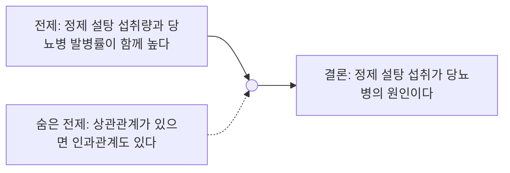

<Callout type="info">
  **이번 문서의 목표:** 어떤 논증을 보고 전제와 결론을 정확히 분리해 낼 수 있고, "이 진술이 결론을 강화하는가 약화하는가"를 근거 있게 판단하며, 빈칸추론 문제에서 앞뒤 문맥만으로 정답을 좁혀 나갈 수 있게 된다.
</Callout>

## 왜 논증의 구조부터 봐야 하는가

06편과 07편에서는 지문 하나를 읽고 그 안의 주제·세부정보·생략된 전제를 파악하는 법을 다뤘습니다. 09편은 지문 안에 들어 있는 **주장 하나**를 콕 집어, 그 주장이 얼마나 설득력 있는지를 평가하는 문제를 다룹니다. NCS 의사소통능력과 대기업 인적성 언어영역(SKCT 언어추리 등)에 공통으로 나오는 "다음 논증을 강화하는 것은?", "다음 논증을 약화하는 것은?", "빈칸에 들어갈 말로 가장 적절한 것은?" 유형이 그것입니다.

이 유형에서 가장 많이 하는 실수는 **개인적으로 동의하는지**를 기준으로 답을 고르는 것입니다. 하지만 시험이 요구하는 것은 "이 진술이 있으면 결론을 믿을 근거가 더 늘어나는가, 줄어드는가"라는 순수하게 논리적인 판단입니다. 내 생각이 아니라 **논증 자체의 구조**를 봐야 합니다.

> **쉽게 말하면:** 논증은 "증거 + 주장"의 짝이고, 강화·약화는 새로운 문장 하나가 그 증거를 더 든든하게 만드는지 흔드는지를 고르는 문제입니다.

## 논증의 전제와 결론 구조

**논증**(argument)이란 하나 이상의 **전제**(premise, 근거로 제시된 문장)를 통해 하나의 **결론**(conclusion, 최종적으로 주장하는 문장)을 뒷받침하려는 문장의 묶음입니다. 전제는 "왜냐하면"에 해당하는 자리이고, 결론은 "그러므로"에 해당하는 자리입니다.

문제는 전제와 결론 사이에 항상 **숨은 전제**(hidden premise, 글에 쓰여 있지 않지만 논증이 성립하려면 반드시 참이어야 하는 가정)가 끼어 있다는 점입니다. 이 숨은 전제를 찾아내는 것이 강화·약화 문제를 푸는 핵심 열쇠입니다.

예시 논증을 하나 보겠습니다.

> 정제 설탕 섭취량이 많은 지역일수록 당뇨병 발병률이 높게 나타났다. 따라서 정제 설탕 섭취는 당뇨병의 원인이다.

여기서 전제는 "함께 높게 나타났다"는 **상관관계**뿐입니다. 그런데 결론은 "원인이다"라는 **인과관계**를 주장합니다. 이 둘 사이의 간격을 메우는 숨은 전제가 "상관관계가 있으면 인과관계도 있다"인데, 이 가정은 실제로는 항상 참이 아닙니다. 다른 제3의 원인이 두 현상을 동시에 만들어 낼 수도 있기 때문입니다. 강화·약화 문제는 대부분 바로 이 지점, 곧 **상관관계와 인과관계 사이의 간격**을 공략합니다.

## 강화 판단 기준

**강화**(strengthen)란 새로운 진술을 하나 추가했을 때, 그 논증의 결론을 더 믿을 만하게 만드는 것을 말합니다. 강화하는 방식은 크게 네 가지입니다.

| 강화 방식 | 하는 일 | 위 예시에 적용 |
|-----------|---------|----------------|
| 숨은 전제 메우기 | 전제와 결론 사이의 간격을 직접 채움 | "정제 설탕 섭취량만 통제하고 나머지 조건을 동일하게 맞춘 실험에서도 발병률 차이가 재현됐다" |
| 대안설명 배제 | 결론 말고 다른 원인일 가능성을 없앰 | "운동량·소득 수준을 통제해도 같은 결과가 나왔다" |
| 유사 사례 추가 | 같은 패턴의 다른 사례를 덧붙임 | "다른 나라에서도 정제 설탕 섭취량과 당뇨병 발병률이 같은 관계를 보였다" |
| 전제의 신뢰성 강화 | 근거로 쓰인 자료·조사 방법이 믿을 만함을 보임 | "이 조사는 10만 명을 대상으로 한 장기 추적 연구다" |

**해석:** 네 가지 방식의 공통점은 모두 상관관계와 인과관계 사이의 간격을 좁혀 준다는 것입니다. 실험으로 다른 변수를 통제했다는 진술이 가장 강력한 강화인 이유는, 대안설명(제3의 원인) 가능성을 직접 배제하기 때문입니다.

## 약화 판단 기준

**약화**(weaken)는 강화의 반대로, 새로운 진술이 결론을 덜 믿게 만드는 것입니다. 약화도 같은 자리를 공략하되 반대 방향으로 작용합니다.

| 약화 방식 | 하는 일 | 위 예시에 적용 |
|-----------|---------|----------------|
| 대안설명 제시 | 결론이 아닌 다른 원인 가능성을 새로 제기 | "운동 부족이 정제 설탕 섭취 증가와 당뇨병 발병률 증가의 공통 원인일 수 있다" |
| 반례 제시 | 전제가 참이어도 결론이 거짓인 사례를 보여 줌 | "정제 설탕 섭취량이 매우 높은데도 당뇨병 발병률이 낮은 지역이 있다" |
| 전제 자체를 공격 | 근거 자료의 신뢰성을 문제 삼음 | "그 조사는 표본이 300명뿐이고 자기보고 방식이라 부정확하다" |
| 인과의 방향 뒤집기 | 원인과 결과가 뒤바뀌었을 가능성 제시 | "당뇨병 전 단계 환자들이 이미 단 음식을 더 찾게 됐을 수 있다" |

**자주 틀리는 함정 — 무관한 정보:** "정제 설탕은 충치의 원인이기도 하다"처럼 결론과 관련은 있어 보이지만 논증의 **전제·결론 연결 자체에는 아무 영향을 주지 않는** 진술이 선택지에 자주 섞여 나옵니다. 이런 진술은 강화도 약화도 아닌 **무관한 정보**이며, 이 유형에서 가장 많이 걸리는 오답 함정입니다. 판단 기준은 항상 "이 진술이 있고 없고에 따라 결론을 믿을 근거의 세기가 달라지는가"입니다.

## 빈칸추론

빈칸추론은 두 갈래로 나뉩니다.

- **문장 빈칸형**: 빈칸에 문장 하나가 통째로 들어가는 유형. 빈칸 앞뒤의 논리적 관계(원인-결과, 예시-일반화, 주장-반박)를 보고 빈칸 문장의 역할을 먼저 정한 뒤 선택지를 대입합니다.
- **연결어 빈칸형**: "그러나", "따라서", "게다가", "반면에" 같은 접속어가 빈칸에 들어가는 유형. 08편에서 다룬 접속어·지시어 단서 찾기와 같은 원리이지만, 여기서는 문장과 문장 사이의 논리적 관계(대조·인과·첨가·예시)를 정확히 짚어야 합니다.

<Steps>

1. **빈칸 앞 문장과 뒤 문장의 핵심 주장을 각각 한 줄로 요약한다** — 빈칸이 둘 사이에서 어떤 다리 역할을 해야 하는지 감을 잡습니다
2. **두 주장의 관계를 분류한다** — 같은 방향(첨가·부연)인지, 반대 방향(대조·반박)인지, 원인-결과인지 판단합니다
3. **관계에 맞는 선택지만 남긴다** — 관계가 대조인데 "게다가"가 붙은 선택지, 관계가 인과인데 흐름과 무관한 선택지를 먼저 지웁니다
4. **남은 선택지를 빈칸에 실제로 넣어 읽어 본다** — 앞뒤 문장과 자연스럽게 이어지는지 마지막으로 확인합니다

</Steps>

**자주 틀리는 점:**

- 지나치게 단정적인 표현(항상, 반드시, 모든, 유일하게)이 들어간 선택지는 지문의 논지보다 과하게 강한 주장을 담고 있는 경우가 많아 오답일 확률이 높습니다
- 지문에 없던 **새로운 정보**를 만들어 내는 선택지는, 아무리 그럴듯해도 빈칸추론의 정답이 될 수 없습니다. 빈칸은 지문의 논리 안에서 채워져야 합니다
- 연결어 빈칸형에서 "그러나"와 "그런데"처럼 비슷해 보이는 접속어라도, 앞뒤 문장이 완전히 반대되는 주장인지 부분적으로만 다른 각도인지에 따라 정답이 갈립니다

## 핵심 정리

- **논증**은 전제(근거)와 결론(주장)으로 이뤄지고, 그 사이에는 글에 쓰이지 않은 **숨은 전제**가 항상 존재한다.
- **강화**는 숨은 전제를 메우거나, 대안설명을 배제하거나, 유사 사례·전제의 신뢰성을 더하는 방식으로 결론을 더 믿게 만든다.
- **약화**는 대안설명을 제시하거나, 반례를 들거나, 전제 자체나 인과의 방향을 공격해 결론을 덜 믿게 만든다.
- 결론과 관련은 있어 보여도 전제-결론 연결의 세기를 바꾸지 않는 진술은 **무관한 정보**이며 가장 흔한 함정이다.
- 빈칸추론은 빈칸 앞뒤 주장의 **관계**(첨가·대조·인과)를 먼저 분류한 뒤 선택지를 좁혀 나간다.
- 단정적 표현과 지문에 없는 새 정보를 담은 선택지는 우선 의심한다.

## 마무리 복습

<Quiz
  questionNumber={1}
  question="논증에서 전제와 결론에 대한 설명으로 가장 적절한 것은?"
  options={['전제는 결론을 뒷받침하는 근거이고 결론은 논증이 최종적으로 주장하는 문장이다', '전제와 결론은 항상 지문에 명시적으로 쓰인 문장 두 개로만 이뤄진다', '결론이 없는 글은 전제도 존재할 수 없다', '전제가 많을수록 숨은 전제는 필요하지 않다']}
  correctAnswer={1}
  explanation="논증은 전제(근거)와 결론(주장)의 짝으로 이뤄지며, 전제가 아무리 많아도 결론과의 간격을 메우는 숨은 전제는 별도로 존재할 수 있다."
  optionExplanations={['전제와 결론의 역할을 정확히 설명했다.', '전제는 여러 개일 수 있고 숨은 전제처럼 명시되지 않는 경우도 있다.', '전제 없이 결론만 던지는 주장도 형식상 존재할 수 있으며 이 둘은 별개 조건이다.', '전제 개수와 숨은 전제의 필요 여부는 무관하다.']}
/>

<Quiz
  questionNumber={2}
  question="정제 설탕 섭취량과 당뇨병 발병률이 함께 높다는 전제로부터 정제 설탕이 당뇨병의 원인이라는 결론을 이끌어 낼 때, 이 논증에 숨어 있는 전제로 가장 적절한 것은?"
  options={['정제 설탕은 충치의 원인이기도 하다', '상관관계가 있으면 인과관계도 성립한다', '당뇨병은 유전적 요인의 영향을 받는다', '설탕 섭취량은 지역마다 측정 방식이 다르다']}
  correctAnswer={2}
  explanation="전제는 상관관계만 보여 주는데 결론은 인과관계를 주장하므로, 그 간격을 메우는 숨은 전제는 상관관계가 있으면 인과관계도 성립한다는 가정이다."
  optionExplanations={['결론의 인과 주장과 직접 연결되지 않는 별개 사실이다.', '상관관계와 인과관계 사이의 간격을 정확히 메우는 가정이다.', '논증의 전제-결론 구조와 직접 관련이 없는 배경 지식이다.', '측정 방식의 차이는 오히려 전제 자체를 흔드는 진술이지 숨은 전제가 아니다.']}
/>

<Quiz
  questionNumber={3}
  question="위 논증(정제 설탕 섭취와 당뇨병 발병률)을 가장 강하게 강화하는 진술은?"
  options={['정제 설탕은 열량이 높은 식품이다', '운동량과 소득 수준을 동일하게 통제한 실험에서도 같은 결과가 재현됐다', '이 조사는 지난달에 발표되었다', '당뇨병 환자는 병원 방문 횟수가 늘어난다']}
  correctAnswer={2}
  explanation="다른 변수를 통제한 실험에서도 같은 결과가 나왔다는 것은 대안설명(제3의 원인) 가능성을 직접 배제하므로 인과관계 주장을 가장 강하게 뒷받침한다."
  optionExplanations={['결론의 인과관계 주장과 직접 연결되지 않는 배경 정보다.', '대안설명을 배제해 인과관계를 가장 강하게 뒷받침한다.', '발표 시점은 논증의 논리적 강도와 무관하다.', '결론이 아니라 결과로 나타나는 별개의 현상을 서술할 뿐이다.']}
/>

<Quiz
  questionNumber={4}
  question="위 논증을 가장 강하게 약화하는 진술은?"
  options={['운동 부족이 정제 설탕 섭취 증가와 당뇨병 발병률 증가의 공통 원인일 수 있다', '정제 설탕은 다양한 가공식품에 사용된다', '당뇨병은 조기에 발견하면 관리할 수 있다', '해당 지역의 인구는 최근 늘어나는 추세다']}
  correctAnswer={1}
  explanation="제3의 공통 원인이 있다는 대안설명은 정제 설탕과 당뇨병 사이의 인과관계 주장을 직접 흔드는 가장 강한 약화다."
  optionExplanations={['대안설명을 제시해 인과관계 주장을 직접 흔든다.', '결론의 인과관계 주장과 무관한 배경 사실이다.', '치료·관리 가능성은 원인 주장의 참·거짓과 무관하다.', '인구 증가는 발병률 계산의 분모와 관련될 수는 있으나 이 논증의 인과 주장 자체를 흔들지 않는다.']}
/>

<Quiz
  questionNumber={5}
  question="강화·약화 문제에서 무관한 정보에 대한 설명으로 가장 적절한 것은?"
  options={['결론과 관련된 소재를 다루기만 하면 강화나 약화로 인정된다', '전제와 결론 사이의 논리적 연결 세기를 바꾸지 않는 진술이다', '무관한 정보는 항상 결론을 약화시키는 방향으로 작용한다', '무관한 정보가 포함된 선택지는 출제되지 않는다']}
  correctAnswer={2}
  explanation="무관한 정보는 결론과 소재상 관련이 있어 보여도 전제-결론의 논리적 연결 세기 자체를 바꾸지 않는 진술이며, 강화·약화 문제의 대표적 오답 함정이다."
  optionExplanations={['소재가 같다고 논리적 연결이 바뀌는 것은 아니다.', '연결 세기를 바꾸지 않는다는 것이 무관한 정보의 정의다.', '무관한 정보는 강화도 약화도 아니며 방향성 자체가 없다.', '오히려 가장 흔하게 출제되는 함정 유형이다.']}
/>

<Quiz
  questionNumber={6}
  question="빈칸추론 문제를 풀 때 가장 먼저 해야 할 일로 가장 적절한 것은?"
  options={['선택지 네 개를 순서대로 빈칸에 넣어 읽어 본다', '빈칸 앞뒤 문장의 핵심 주장을 요약하고 둘의 관계를 분류한다', '지문에서 가장 어려운 단어의 뜻부터 확인한다', '결론 문장을 먼저 지문에서 삭제한다']}
  correctAnswer={2}
  explanation="빈칸 앞뒤 문장의 핵심 주장을 먼저 요약해 관계(첨가·대조·인과)를 분류해야 그 관계에 맞지 않는 선택지를 효율적으로 걸러낼 수 있다."
  optionExplanations={['관계 분류 없이 무작정 대입하면 그럴듯해 보이는 오답에 흔들리기 쉽다.', '앞뒤 관계 분류가 선택지를 효율적으로 좁히는 첫 단계다.', '어휘 확인은 필요할 수 있으나 문제 풀이의 첫 단계는 아니다.', '결론 삭제는 풀이 절차에 해당하지 않는다.']}
/>

<Quiz
  questionNumber={7}
  question="빈칸추론에서 오답일 가능성이 가장 높은 선택지의 특징은?"
  options={['앞 문장의 주장을 한 문장으로 요약한 표현', '지문에 없던 새로운 정보를 추가로 만들어 내는 표현', '앞뒤 문맥의 논리적 관계와 일치하는 접속어', '지문 전체의 주제와 같은 방향을 가리키는 표현']}
  correctAnswer={2}
  explanation="빈칸은 지문의 논리 안에서 채워져야 하므로, 지문에 없던 새로운 정보를 만들어 내는 선택지는 아무리 그럴듯해도 정답이 될 수 없다."
  optionExplanations={['기존 논지의 요약은 자연스러운 정답 후보다.', '지문 논리를 벗어난 새 정보는 대표적인 오답 유형이다.', '문맥과 일치하는 접속어는 정답에 가깝다.', '주제와 같은 방향의 표현은 오히려 정답 후보로 적절하다.']}
/>

<Quiz
  questionNumber={8}
  question="연결어 빈칸을 풀 때 가장 중요한 판단 기준은?"
  options={['빈칸 앞뒤 문장 길이가 비슷한지 여부', '빈칸 앞뒤 문장이 같은 방향인지 반대 방향인지, 또는 원인-결과 관계인지 여부', '빈칸이 문단의 몇 번째 문장에 있는지 여부', '접속어가 몇 글자로 이뤄져 있는지 여부']}
  correctAnswer={2}
  explanation="연결어는 문장과 문장 사이의 논리적 관계(첨가·대조·인과)를 표시하는 장치이므로, 앞뒤 문장의 관계를 정확히 분류하는 것이 접속어를 고르는 핵심 기준이다."
  optionExplanations={['문장 길이는 논리적 관계와 무관하다.', '앞뒤 문장의 논리적 관계가 접속어 선택의 핵심 기준이다.', '문장의 위치는 접속어의 논리적 역할과 직접 관련이 없다.', '글자 수는 접속어의 의미와 무관한 요소다.']}
/>

## 참고 자료

- [NCS 국가직무능력표준 – 필기문항 예시문항](https://ncs.go.kr/blind/blp/bbs_lib_list.do?libDstinCd=55)
- [링커리어 – 인적성 검사 공부법 GSAT·SKCT·HMAT, 2026 최신 시험 구성 비교](https://community.linkareer.com/employment_data/6482010)
