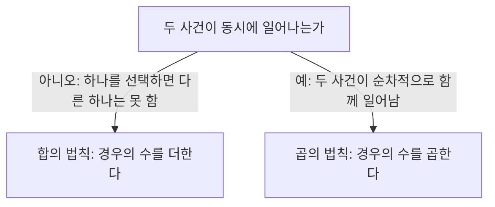

<Callout type="info">
  **이번 문서의 목표:** 어떤 상황을 보고 합의 법칙을 쓸지 곱의 법칙을 쓸지, 순열을 쓸지 조합을 쓸지 즉시 판단하고, 여사건과 조건부확률을 이용해 복잡해 보이는 확률 문제를 빠르게 계산할 수 있게 된다.
</Callout>

## 왜 경우의 수부터 정확히 세야 하는가

02편에서 순열과 조합을 나타내는 기호($_nP_r$, $_nC_r$)와 팩토리얼($n!$)의 표기를 다뤘고, 10편에서는 그 계산 감각을 방정식 세우기에 썼습니다. 이제 이 도구로 "경우의 수를 세는 문제"와 "확률을 구하는 문제"를 직접 풉니다.

이 영역에서 점수가 갈리는 지점은 계산 실수가 아니라 **상황 판단의 실수**입니다. 순서를 따지는 상황에 조합 공식을 쓰거나, 동시에 일어날 수 없는 사건에 곱의 법칙을 쓰는 식의 실수가 대부분입니다. 그래서 이 편은 공식을 외우는 것보다 **"이 상황이 어떤 규칙에 해당하는가"를 판단하는 기준**에 집중합니다.

> **쉽게 말하면:** 경우의 수·확률 문제는 계산기가 아니라 **분류 감각**을 테스트합니다. 상황을 정확히 분류하면 계산은 그다음입니다.

## 합의 법칙과 곱의 법칙

두 사건 A, B가 있을 때 경우의 수를 세는 규칙은 두 사건이 **동시에 일어날 수 있는가**에 따라 갈립니다.

**합의 법칙**(rule of sum)은 "A 또는 B" 상황에서 씁니다. 예를 들어 주사위를 한 번 던져 2 이하가 나오거나 5 이상이 나오는 경우의 수는, 2 이하(1, 2로 2가지)와 5 이상(5, 6으로 2가지)이 동시에 일어날 수 없으므로 더합니다.

$$
2 + 2 = 4 (\text{가지})
$$

**곱의 법칙**(rule of product)은 "A 그리고 B"처럼 한 사건이 일어난 뒤 다른 사건이 이어서 일어나는 상황에 씁니다. 예를 들어 상의 3벌과 하의 4벌 중 하나씩 골라 입는 조합의 수는, 상의를 고른 각각의 경우마다 하의를 고르는 4가지 경우가 함께 따라오므로 곱합니다.

$$
3 \times 4 = 12 (\text{가지})
$$

**해석:** "또는"으로 이어지면 후보들이 서로 배타적이라 그냥 더하면 되고, "그리고"로 이어지면 앞의 선택마다 뒤의 선택이 통째로 반복되므로 곱해야 합니다. 문제에서 "또는", "그리고" 같은 단어가 명시되지 않아도, **한 번의 시도로 둘 중 하나만 일어나는지 두 가지가 순차적으로 함께 일어나는지**를 스스로 따져 봐야 합니다.

## 순열과 조합의 구분 기준

가장 많이 틀리는 지점은 순열과 조합을 구분하는 기준입니다. 기준은 단 하나, **뽑은 것들 사이에 순서가 의미를 가지는가**입니다.

| 구분 | 순서가 중요한가 | 공식 | 예시 |
|------|------------------|------|------|
| 순열(permutation) | 중요함 | $_nP_r = \dfrac{n!}{(n-r)!}$ | 반장·부반장을 각각 정하는 경우 |
| 조합(combination) | 중요하지 않음 | $_nC_r = \dfrac{n!}{r!(n-r)!}$ | 대표 2명을 뽑는 경우(직책 구분 없음) |

$n!$ (n 팩토리얼)은 1부터 $n$ 까지의 모든 자연수를 곱한 값입니다. 예를 들어 $4! = 4 \times 3 \times 2 \times 1 = 24$ 입니다.

**손계산으로 비교해 봅시다.** 학생 5명 중 2명을 뽑는 상황을 두 가지로 나눠 계산합니다.

**경우 1 — 반장·부반장을 각각 정한다(순서가 중요함).**

$$
_5P_2 = \frac{5!}{(5-2)!} = \frac{5!}{3!} = 5 \times 4 = 20 (\text{가지})
$$

**경우 2 — 대표 2명을 직책 구분 없이 뽑는다(순서가 중요하지 않음).**

$$
_5C_2 = \frac{5!}{2! \times 3!} = \frac{5 \times 4}{2 \times 1} = 10 (\text{가지})
$$

**해석:** 순열의 결과(20가지)가 조합의 결과(10가지)의 정확히 2배($2! = 2$)인 이유는, 조합으로 뽑은 같은 2명이라도 "누가 반장이고 누가 부반장인가"에 따라 순열에서는 2가지로 갈라지기 때문입니다. 즉 **순열의 수 = 조합의 수 $\times$ 뽑은 것들을 줄 세우는 경우의 수**라는 관계가 항상 성립합니다.

**판정 요령:** 문제에 "뽑아서 한 줄로 세운다", "회장·부회장처럼 역할이 다르다", "번호를 붙인다"는 표현이 있으면 순열입니다. "그냥 뽑는다", "위원회를 구성한다", "짝을 짓는다"처럼 역할 구분 없이 묶기만 하면 조합입니다.

## 조건부확률

**조건부확률**(conditional probability)은 어떤 사건 B가 이미 일어났다는 조건 아래에서 사건 A가 일어날 확률입니다.

$$
P(A|B) = \frac{P(A \cap B)}{P(B)}
$$

- $P(A|B)$: B가 일어났다는 조건에서 A가 일어날 확률 (읽는 법: "B가 주어졌을 때 A의 확률")
- $P(A \cap B)$: A와 B가 동시에 일어날 확률
- $P(B)$: B가 일어날 확률

**손계산.** 어느 학급 학생 40명 중 남학생은 20명, 그중 안경을 쓴 학생은 8명입니다. 남학생 한 명을 골랐을 때 그 학생이 안경을 썼을 확률을 구합니다.

여기서 사건 B는 "남학생을 고른다", 사건 A는 "안경을 썼다"입니다. 전체 40명 중 남학생이면서 안경을 쓴 학생은 8명이므로 $P(A \cap B) = \frac{8}{40}$, 남학생일 확률은 $P(B) = \frac{20}{40}$ 입니다.

$$
P(A|B) = \frac{8/40}{20/40} = \frac{8}{20} = 0.4
$$

**해석:** 전체 40명을 기준으로 계산하지 않고, **조건으로 주어진 남학생 20명만을 새로운 전체로 놓고** 그 안에서 안경 쓴 8명의 비율을 구한 것과 같은 값입니다. 실전에서는 분수 계산 없이 "남학생 20명 중 안경 쓴 8명"으로 바로 $\frac{8}{20}$ 을 계산하는 것이 더 빠릅니다.

## 여사건을 이용한 확률 계산

**여사건**(complementary event)은 어떤 사건이 일어나지 않는 사건을 말하며, 사건 A의 여사건은 $A^c$ 로 씁니다. 한 사건과 그 여사건이 일어날 확률의 합은 항상 1입니다.

$$
P(A) = 1 - P(A^c)
$$

이 관계는 "적어도 하나는 특정 조건인 경우"를 구하는 문제에서 특히 강력합니다. "적어도 하나"의 반대는 "하나도 없음"이며, 이 반대 상황은 대개 훨씬 계산하기 쉽기 때문입니다.

**예제.** 동전을 4번 던질 때 앞면이 적어도 한 번 나올 확률을 구합니다.

직접 세면 앞면이 1번, 2번, 3번, 4번 나오는 경우를 각각 계산해 더해야 하지만, 여사건을 쓰면 훨씬 간단합니다. "적어도 한 번 앞면"의 여사건은 "4번 모두 뒷면"입니다.

$$
P(\text{4번 모두 뒷면}) = \left(\frac{1}{2}\right)^4 = \frac{1}{16}
$$

$$
P(\text{적어도 한 번 앞면}) = 1 - \frac{1}{16} = \frac{15}{16}
$$

**해석:** "적어도"라는 표현이 보이면 반사적으로 여사건부터 검토하는 것이 시간을 가장 크게 아끼는 전략입니다. 경우의 수가 여러 갈래로 나뉘는 상황일수록 여사건의 효과가 커집니다.

## 자주 틀리는 점

- **순열·조합 혼동:** "뽑는다"는 말만 보고 무조건 조합 공식을 쓰는 실수가 가장 흔합니다. 뽑은 뒤 순서(직책·순위·자리)가 의미를 가지는지 반드시 확인해야 합니다
- **곱의 법칙을 합의 법칙 자리에 쓰는 실수:** 두 사건이 동시에 일어날 수 없는데도(예: 주사위 눈이 2 이하이면서 동시에 5 이상일 수 없음) 곱해 버리는 경우가 있습니다. "동시에 가능한가"를 먼저 확인해야 합니다
- **조건부확률에서 분모를 전체 인원으로 잘못 쓰는 실수:** 조건이 주어진 순간 분모는 **조건에 해당하는 인원**으로 좁혀져야 합니다
- **"적어도" 문제를 직접 다 세는 비효율:** 여사건을 쓰면 한 번의 계산으로 끝나는데, 모든 경우를 나열하다가 시간을 소모하고 실수까지 늘어납니다

## 핵심 정리

- 두 사건이 **동시에 일어날 수 없으면 합의 법칙**(더하기), **순차적으로 함께 일어나면 곱의 법칙**(곱하기)을 쓴다.
- 순열과 조합을 가르는 유일한 기준은 **순서가 의미를 가지는가**이며, 순열의 수는 조합의 수에 줄 세우는 경우의 수를 곱한 값과 같다.
- **조건부확률**은 조건에 해당하는 대상만을 새로운 전체로 놓고 그 안에서의 비율을 구하는 것과 같다.
- **여사건**은 "적어도 하나"처럼 경우가 여러 갈래로 나뉘는 문제에서, 반대 상황("하나도 없음")의 확률을 구해 1에서 빼는 방식으로 계산을 크게 단축한다.
- "뽑는다"는 말만으로 조합을 단정하지 말고, 역할·순서·번호가 있는지 항상 확인한다.

## 마무리 복습

<Quiz
  questionNumber={1}
  question="주사위를 한 번 던져 2 이하이거나 5 이상인 눈이 나오는 경우의 수를 구할 때 사용해야 할 법칙은?"
  options={['곱의 법칙, 2×2=4가지', '합의 법칙, 2+2=4가지', '순열, 5P2를 계산', '조합, 5C2를 계산']}
  correctAnswer={2}
  explanation="한 번의 시행에서 2 이하와 5 이상은 동시에 일어날 수 없으므로 합의 법칙으로 각 경우의 수를 더해야 하며 2+2=4가지다."
  optionExplanations={['동시에 일어날 수 없는 사건에 곱의 법칙을 적용한 잘못된 식이다.', '동시에 일어날 수 없는 두 경우를 더한 값이 정확하다.', '이 상황은 순서를 정하는 문제가 아니므로 순열과 무관하다.', '이 상황은 대상을 뽑는 조합형 문제가 아니다.']}
/>

<Quiz
  questionNumber={2}
  question="상의 3벌과 하의 4벌 중 하나씩 골라 입는 조합의 수를 구하는 데 필요한 법칙과 값은?"
  options={['합의 법칙, 3+4=7가지', '곱의 법칙, 3×4=12가지', '순열, 4P3=24가지', '조합, 4C3=4가지']}
  correctAnswer={2}
  explanation="상의를 고른 각 경우마다 하의 4벌을 고르는 경우가 함께 따라오므로 곱의 법칙을 적용해 3×4=12가지가 된다."
  optionExplanations={['상의와 하의를 함께 갖춰 입어야 하므로 더하는 것이 아니라 곱해야 한다.', '상의를 고르는 경우마다 하의 선택이 함께 발생하므로 곱하는 것이 정확하다.', '이 상황은 순서를 정하는 문제가 아니라 조합을 곱하는 문제다.', '조합 공식만으로는 상의와 하의를 함께 고르는 경우의 수를 구할 수 없다.']}
/>

<Quiz
  questionNumber={3}
  question="학생 5명 중 반장과 부반장을 각각 한 명씩 정하는 경우의 수는?"
  options={['10가지', '20가지', '25가지', '120가지']}
  correctAnswer={2}
  explanation="반장과 부반장은 역할이 다르므로 순서가 의미를 가지는 순열이며, 5P2=5×4=20가지다."
  optionExplanations={['이 값은 조합 5C2의 결과이며 역할 구분이 없는 경우에 해당한다.', '5P2=5×4=20가지로 역할이 다른 두 자리를 정확히 반영한 값이다.', '5×5로 잘못 계산한 값이며 같은 사람이 두 역할을 겹쳐 맡는 경우까지 포함한 오류다.', '5!을 그대로 계산한 값으로 문제의 조건과 맞지 않는다.']}
/>

<Quiz
  questionNumber={4}
  question="학생 5명 중 직책 구분 없이 대표 2명을 뽑는 경우의 수는?"
  options={['5가지', '10가지', '20가지', '60가지']}
  correctAnswer={2}
  explanation="직책 구분이 없으므로 순서가 의미를 가지지 않는 조합이며, 5C2=(5×4)÷(2×1)=10가지다."
  optionExplanations={['조합 계산 과정에서 분모나 분자를 누락한 값이다.', '5C2=(5×4)÷2=10가지가 정확한 값이다.', '이 값은 순열 5P2의 결과이며 역할이 구분된 경우에 해당한다.', '이 값은 순열 5P3에 가까운 값으로 이 문제 조건과 맞지 않는다.']}
/>

<Quiz
  questionNumber={5}
  question="어느 학급 40명 중 남학생이 20명이고 그중 안경을 쓴 학생이 8명일 때, 임의로 고른 한 명이 남학생이라는 조건에서 그 학생이 안경을 썼을 조건부확률은?"
  options={['0.2', '0.4', '0.5', '0.8']}
  correctAnswer={2}
  explanation="조건부확률은 조건에 해당하는 남학생 20명을 새로운 전체로 놓고 그중 안경을 쓴 8명의 비율을 구하므로 8/20=0.4다."
  optionExplanations={['전체 40명을 기준으로 잘못 나눈 값에 가깝다.', '남학생 20명 중 안경 쓴 8명의 비율인 8/20=0.4가 정확하다.', '조건에 해당하는 인원을 절반으로 잘못 가정한 값이다.', '분자와 분모를 뒤바꾸거나 다른 값을 사용한 결과다.']}
/>

<Quiz
  questionNumber={6}
  question="조건부확률 P(A|B)를 계산할 때 분모로 사용해야 하는 값은?"
  options={['전체 표본의 확률인 1', '사건 A가 일어날 확률 P(A)', '사건 B가 일어날 확률 P(B)', '사건 A와 B가 동시에 일어나지 않을 확률']}
  correctAnswer={3}
  explanation="조건부확률의 정의에 따라 P(A|B)=P(A∩B)÷P(B)이므로 분모는 조건으로 주어진 사건 B가 일어날 확률이다."
  optionExplanations={['전체 확률 1로 나누면 조건이 반영되지 않은 결과가 된다.', '분모는 조건 사건 B의 확률이지 A의 확률이 아니다.', '조건부확률의 정의상 분모는 정확히 P(B)다.', '이는 조건부확률 정의에 사용되는 값이 아니다.']}
/>

<Quiz
  questionNumber={7}
  question="동전을 4번 던질 때 앞면이 적어도 한 번 나올 확률을 가장 빠르게 구하는 방법은?"
  options={['앞면이 1, 2, 3, 4번 나오는 경우를 각각 계산해 모두 더한다', '앞면이 정확히 1번 나올 확률만 구한다', '1에서 4번 모두 뒷면이 나올 확률을 뺀다', '앞면과 뒷면이 나올 확률을 곱한다']}
  correctAnswer={3}
  explanation="적어도 한 번 앞면의 여사건은 4번 모두 뒷면이며, 그 확률 (1/2)^4=1/16을 1에서 빼면 15/16으로 한 번에 계산된다."
  optionExplanations={['계산은 가능하지만 여러 경우를 나눠 더해야 해 시간이 오래 걸린다.', '적어도 한 번의 조건 중 일부만 반영하므로 답이 될 수 없다.', '여사건인 4번 모두 뒷면의 확률을 1에서 빼는 것이 가장 빠르고 정확하다.', '이 계산은 확률의 정의와 맞지 않는 임의의 연산이다.']}
/>

<Quiz
  questionNumber={8}
  question="경우의 수·확률 문제에서 순열과 조합을 혼동하지 않기 위해 가장 먼저 확인해야 할 것은?"
  options={['전체 대상의 개수가 몇 개인지', '뽑은 대상들 사이에 순서나 역할의 구분이 의미를 가지는지', '문제에 확률이라는 단어가 있는지', '계산 결과가 정수로 나오는지']}
  correctAnswer={2}
  explanation="순열과 조합을 가르는 유일한 기준은 뽑은 것들 사이에 순서나 역할의 구분이 의미를 가지는가이므로 이를 가장 먼저 확인해야 한다."
  optionExplanations={['전체 개수는 계산에 필요한 값이지 순열·조합을 구분하는 기준은 아니다.', '순서·역할 구분 여부가 순열과 조합을 가르는 핵심 기준이다.', '확률이라는 단어의 유무는 순열·조합 구분과 무관하다.', '정수 여부는 계산 결과의 검산 요소일 뿐 구분 기준이 아니다.']}
/>

## 참고 자료

- [NCS 국가직무능력표준 – 직업기초능력](https://www.ncs.go.kr/th03/TH0302List.do?dirSeq=121)
- [NCS 국가직무능력표준 – 필기문항 예시문항](https://ncs.go.kr/blind/blp/bbs_lib_list.do?libDstinCd=55)
