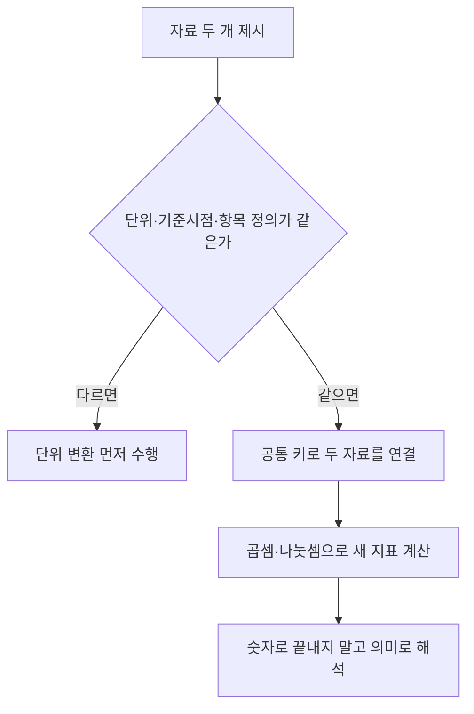

<Callout type="info">
  **이번 문서의 목표:** 서로 다른 두 자료를 하나의 기준으로 엮어서 읽고, 빈칸(추정치)을 논리적으로 채우며, 실전 제한시간 안에서 어림과 선택지 소거로 빠르게 답을 찾을 수 있게 된다.
</Callout>

## 왜 자료 하나로 끝나지 않는가

12편(자료해석 I)에서는 표 하나, 그래프 하나를 각각 읽는 법을 다뤘습니다. 필요한 값을 찾고, 구성비와 증감률을 계산하는 연습이었습니다. 그런데 실제 시험에서는 표 하나만 딱 주어지는 경우가 오히려 드뭅니다. **표 두 개, 표와 그래프 하나씩, 또는 세 개의 자료가 나란히 제시되고, 두 자료를 엮어야만 답이 나오는 문제**가 많이 출제됩니다.

왜 이런 방식으로 출제할까요. 실제 업무에서 필요한 자료해석 능력은 "표 하나를 읽는 것"이 아니라 "서로 다른 부서·서로 다른 시점에서 만들어진 자료를 엮어서 새로운 판단을 내리는 것"이기 때문입니다. 인구 통계표와 매출 통계표를 각각 받았을 때, 두 표를 엮어 "지역별 인구당 매출"이라는 새로운 지표를 만들어낼 수 있어야 실무에서 쓸모가 있습니다. 적성검사의 복합자료 문제는 이 능력을 시험합니다.

> **쉽게 말하면:** 복합자료 문제는 "자료 A의 값과 자료 B의 값을 곱하거나 나눠서, 어느 자료에도 직접 적혀 있지 않은 세 번째 값을 만들어내라"는 문제입니다.

## 1. 복합자료를 교차 확인하는 법

### 가장 먼저 확인할 것 — 기준이 같은가

두 자료를 곧바로 계산에 섞기 전에 반드시 확인해야 하는 세 가지가 있습니다.

- **단위**가 같은가 (원과 만 원, 명과 천 명처럼 자릿수 단위가 다르면 그대로 계산하면 안 됩니다)
- **기준 시점**이 같은가 (표1은 2022년 자료인데 표2는 2023년 자료라면 두 표를 그대로 엮는 것 자체가 의미 없는 비교가 됩니다)
- **항목의 정의**가 같은가 (표1의 "매출"이 세전 매출이고 표2의 "매출"이 세후 매출이면 같은 이름이어도 다른 값입니다)

이 확인을 건너뛰고 바로 계산부터 하면, 계산 자체는 맞아도 **비교 대상이 애초에 성립하지 않는** 오답을 만들게 됩니다. 실전에서 가장 흔한 실수입니다.

### 예시로 계산해보기 — 1인당 매출

아래 두 표를 봅시다.

| 지역 | 인구(만 명) |
|------|-------------|
| 갑 | 10 |
| 을 | 15 |
| 병 | 6 |

| 지역 | 총매출(억 원) |
|------|---------------|
| 갑 | 40 |
| 을 | 90 |
| 병 | 33 |

두 표의 **공통 키**는 지역입니다. 이제 "1인당 매출"이라는 새 지표를 만들어봅시다.

**계산의 실마리 — 단위를 맞추는 요령.** 매출은 억 원, 인구는 만 명 단위입니다. 억은 10의 8제곱, 만은 10의 4제곱이므로, 매출(억 원)을 인구(만 명)로 나누면 자동으로 10의 4제곱, 즉 **만 원 단위의 1인당 값**이 나옵니다. 자릿수를 일일이 환산하지 않아도 두 단위의 차이(10의 4제곱)가 정확히 "만 원"이라는 결과 단위를 만들어 준다는 뜻입니다.

$$
갑: \frac{40}{10} = 4
$$

$$
을: \frac{90}{15} = 6
$$

$$
병: \frac{33}{6} = 5.5
$$

**해석:** 세 지역의 1인당 매출은 갑 4만 원, 을 6만 원, 병 5.5만 원입니다. **총매출은 을이 90억 원으로 가장 크지만, 1인당 매출도 을이 가장 큽니다.** 하지만 이것이 항상 그런 것은 아닙니다.

### 자주 틀리는 점 — 총량과 비율의 혼동

만약 병의 인구가 6만 명이 아니라 33만 명이었다면 어떨까요. 1인당 매출은 33÷33=1만 원으로 뚝 떨어집니다. **총매출이 크다고 해서 1인당 매출(비율 지표)도 크다는 보장은 없습니다.** 인구가 많으면 총매출은 커 보여도 나눠 가지는 몫은 작아질 수 있기 때문입니다. "총매출 1위 지역이 어디인가"와 "1인당 매출 1위 지역이 어디인가"는 완전히 다른 질문이라는 것을 문제를 읽는 순간부터 구분해야 합니다.

## 2. 빈칸(추정치) 채우기

### 왜 빈칸을 채우는 문제가 나오는가

실제 통계 자료는 항상 완전하지 않습니다. 특정 연도 값이 누락되거나, 합계만 알고 개별 항목은 모르는 경우가 실무에서도 흔합니다. 적성검사는 이런 상황에서 **주어진 다른 정보(증감률, 합계, 구성비)를 거꾸로 이용해 빈칸을 논리적으로 역산**할 수 있는지를 봅니다.

### 증감률을 거꾸로 이용하기

다음 매출 자료에서 2022년 값이 빈칸입니다.

| 연도 | 매출(억 원) |
|------|-------------|
| 2021 | 80 |
| 2022 | ? |
| 2023 | 110 |

추가 조건: 2022년 대비 2023년 매출 증가율은 10퍼센트입니다.

**여기서 틀리는 지점:** "2023년이 110이고 증가율이 10퍼센트니까 110의 10퍼센트인 11을 빼서 99"라고 계산하는 실수가 매우 흔합니다. 이 계산은 **증가율의 기준(분모)을 2023년으로 잘못 잡은** 것입니다. 증가율의 정의를 다시 떠올려야 합니다.

$$
증가율 = \frac{2023년 값 - 2022년 값}{2022년 값}
$$

2022년 값을 $x$ 라 하면

$$
0.1 = \frac{110 - x}{x}
$$

$$
0.1x = 110 - x
$$

$$
1.1x = 110
$$

$$
x = 100
$$

**해석:** 2022년 매출은 100억 원입니다. 검산하면 100에서 10퍼센트가 증가한 값은 100×1.1=110으로 정확히 맞습니다. "**증가율의 분모는 항상 비교 기준이 되는 이전 시점의 값**"이라는 원칙을 지키면 방향을 헷갈리지 않습니다.

### 구성비의 합이 100퍼센트라는 성질 이용하기

빈칸을 채우는 또 다른 흔한 방식은 구성비(전체 대비 비중)의 합이 항상 100퍼센트라는 성질을 이용하는 것입니다.

| 항목 | 구성비 |
|------|--------|
| A | 22% |
| B | 35% |
| C | 25% |
| D | ? |

전체 항목의 구성비 합은 100퍼센트이므로

$$
D = 100 - 22 - 35 - 25 = 18
$$

D의 구성비는 18퍼센트입니다. 이 방식은 계산 자체는 단순한 뺄셈이지만, "구성비의 합은 100퍼센트"라는 **전제를 문제에서 명시하지 않아도 당연히 성립한다는 것을 알아차려야** 빨리 풀립니다.

## 3. 어림과 선택지 소거 전략

### 왜 정확히 계산하면 안 되는가

자료해석 문제 하나에 주어지는 시간은 보통 1분 안팎입니다. 소수점 셋째 자리까지 정확히 나눗셈을 하다가는 시간이 부족해집니다. **정답을 정확히 구하는 것이 목표가 아니라, 5개의 선택지 중 정답 하나를 골라내는 것이 목표**라는 점을 이용하면 계산량을 크게 줄일 수 있습니다.

### 선택지 간격을 먼저 본다

<Steps>

1. **선택지 4개의 값 간격을 먼저 확인한다** — 계산을 시작하기 전에 선택지부터 훑어봅니다
2. **간격이 넓으면(3퍼센트포인트 이상) 어림 계산으로 충분하다** — 소수점 이하는 반올림하고 정수 자리 위주로 암산합니다
3. **간격이 좁으면(1퍼센트포인트 이하) 핵심 자리만 정밀하게 계산한다** — 다만 앞부분의 큰 자릿수는 여전히 어림해도 됩니다
4. **명백히 범위를 벗어나는 선택지는 계산 없이 먼저 지운다** — 예를 들어 구성비 문제에서 이미 다른 항목의 합이 90퍼센트를 넘었다면 남은 항목이 20퍼센트라는 선택지는 계산 없이 제거할 수 있습니다

</Steps>

**예시.** "어느 지역의 1인당 매출로 가장 적절한 것은? ① 3.8만 원 ② 4.2만 원 ③ 5.9만 원 ④ 8.1만 원"처럼 선택지 사이 간격이 넓다면, 매출과 인구를 각각 반올림해서 나눈 값만으로도 ①~④ 중 하나를 바로 골라낼 수 있습니다. 반대로 "① 12.1퍼센트 ② 12.3퍼센트 ③ 12.5퍼센트 ④ 12.7퍼센트"처럼 촘촘하다면 어림으로는 구분이 안 되므로, 최소한 소수 첫째 자리까지는 정밀하게 계산해야 합니다.

### 선택지 소거의 논리적 근거

소거는 단순히 "귀찮은 계산 생략"이 아니라 **자료의 구조가 만드는 제약 조건**을 이용하는 것입니다. 구성비의 합이 100퍼센트를 넘을 수 없다는 것, 1인당 값은 총량보다 작을 수밖에 없는 상황이 있다는 것, 증가율이 양수로 명시되어 있는데 선택지에 이전 값보다 작은 수가 있다면 그 선택지는 답이 될 수 없다는 것처럼, **문제의 조건 자체가 이미 몇 개의 선택지를 배제하고 있는 경우가 많습니다.** 이 제약을 먼저 찾는 습관이 계산 시간을 가장 크게 줄여줍니다.

## 핵심 정리

- 복합자료를 엮기 전에 **단위·기준 시점·항목 정의**가 같은지 먼저 확인한다. 다르면 그대로 계산해도 의미가 없다.
- 억 원을 만 명으로 나누면 자동으로 만 원 단위의 1인당 값이 나오는 것처럼, **단위 사이의 자릿수 차이를 이용**하면 별도 환산 없이 계산할 수 있다.
- **총량(총매출 등)이 크다고 비율(1인당 값 등)도 크다는 보장은 없다.** 두 지표를 혼동하지 않는다.
- 증가율의 **분모는 항상 비교 기준이 되는 이전 시점의 값**이다. 나중 값을 분모로 놓으면 방향이 뒤집힌다.
- **구성비의 합은 언제나 100퍼센트**라는 성질을 이용하면 빈칸을 뺄셈만으로 채울 수 있다.
- 계산에 들어가기 전 **선택지 간격**부터 확인해, 넓으면 어림으로 빠르게 좁히고 좁으면 핵심 자리만 정밀하게 계산한다.
- 자료의 제약 조건(합계 초과 불가, 증가율의 부호 등)을 먼저 살피면 계산 없이 선택지를 소거할 수 있다.

## 마무리 복습

<Quiz
  questionNumber={1}
  question="지역별 인구(만 명)가 갑 10, 을 15, 병 6이고 총매출(억 원)이 갑 40, 을 90, 병 33일 때, 1인당 매출이 가장 큰 지역은?"
  options={['갑', '을', '병', '세 지역이 모두 같다']}
  correctAnswer={2}
  explanation="1인당 매출은 매출(억 원)을 인구(만 명)로 나누면 만 원 단위로 바로 얻어진다. 갑은 40÷10=4, 을은 90÷15=6, 병은 33÷6=5.5이므로 을이 6만 원으로 가장 크다."
  optionExplanations={['4만 원으로 세 지역 중 가장 작다.', '90÷15=6만 원으로 세 지역 중 가장 크다.', '33÷6=5.5만 원으로 갑보다는 크지만 을보다는 작다.', '세 값이 4, 6, 5.5로 서로 다르므로 같지 않다.']}
/>

<Quiz
  questionNumber={2}
  question="2021년 매출 80억 원, 2023년 매출 110억 원이며 2022년 대비 2023년 증가율이 10퍼센트일 때, 2022년 매출로 가장 적절한 것은?"
  options={['90억 원', '95억 원', '100억 원', '105억 원']}
  correctAnswer={3}
  explanation="증가율의 분모는 비교 기준이 되는 이전 시점, 즉 2022년 값이다. 2022년 값을 x라 하면 (110-x)/x=0.1이 되어 1.1x=110, x=100이다. 검산하면 100에서 10퍼센트 증가한 값이 정확히 110이 된다."
  optionExplanations={['1.1을 곱해도 110이 되지 않는 값이다.', '1.1을 곱하면 104.5로 110과 맞지 않는다.', '100에 1.1을 곱하면 정확히 110이 되어 조건을 만족한다.', '1.1을 곱하면 115.5로 110을 넘어선다.']}
/>

<Quiz
  questionNumber={3}
  question="어느 자료해석 문제에서 총매출이 가장 큰 지역이 1인당 매출도 가장 크다고 바로 결론짓는 것이 위험한 이유로 가장 적절한 것은?"
  options={['총매출은 항상 오차가 포함된 추정치이기 때문이다', '총매출이 큰 지역은 인구도 함께 많을 수 있어 나누면 1인당 값이 작아질 수 있기 때문이다', '1인당 매출은 애초에 계산할 수 없는 지표이기 때문이다', '적성검사에서는 총매출 자체를 절대 묻지 않기 때문이다']}
  correctAnswer={2}
  explanation="총량 지표(총매출)와 비율 지표(1인당 매출)는 서로 다른 정보를 담고 있다. 인구가 많으면 총매출이 커 보여도 나눠 가지는 몫인 1인당 값은 오히려 작아질 수 있으므로, 두 지표를 같은 것으로 취급하면 안 된다."
  optionExplanations={['오차 유무가 아니라 지표의 성격 차이가 핵심 이유다.', '인구가 함께 커지면 나눗셈 결과인 1인당 값은 작아질 수 있다는 것이 핵심 이유다.', '두 표의 값을 나누면 1인당 매출을 계산할 수 있다.', '총매출과 1인당 매출 모두 복합자료 문제에서 자주 다뤄지는 지표다.']}
/>

<Quiz
  questionNumber={4}
  question="선택지가 3.8만 원, 4.2만 원, 5.9만 원, 8.1만 원처럼 간격이 넓게 벌어져 있을 때 가장 효율적인 풀이 전략은?"
  options={['소수점 셋째 자리까지 정확히 나눗셈을 수행한다', '정수 자리 위주로 반올림해 어림 계산으로 대략적인 값만 구한다', '네 개의 선택지를 각각 원래 식에 대입해 역산으로 검증한다', '계산을 생략하고 가장 큰 값을 무조건 선택한다']}
  correctAnswer={2}
  explanation="선택지 간격이 넓을 때는 소수점 이하를 정밀하게 구하지 않아도 어느 구간에 속하는지만 알면 구분할 수 있다. 정수 자리 위주의 어림 계산으로 계산 시간을 크게 줄일 수 있다."
  optionExplanations={['간격이 넓은 상황에서는 시간 낭비가 큰 방법이다.', '어느 구간에 속하는지만 확인해도 충분히 구분되므로 효율적이다.', '네 번의 역산은 한 번의 정방향 계산보다 오래 걸린다.', '근거 없이 큰 값을 고르는 것은 계산이 아니라 추측이다.']}
/>

<Quiz
  questionNumber={5}
  question="네 항목 A, B, C, D의 구성비 합이 항상 100퍼센트인 자료에서 A가 22퍼센트, B가 35퍼센트, C가 25퍼센트로 확인되었다. D의 구성비로 옳은 것은?"
  options={['15%', '18%', '20%', '23%']}
  correctAnswer={2}
  explanation="구성비의 합은 항상 100퍼센트이므로 D=100-22-35-25=18이다."
  optionExplanations={['22+35+25+15=97로 100이 되지 않는다.', '22+35+25+18=100으로 정확히 맞는다.', '22+35+25+20=102로 100을 넘어선다.', '22+35+25+23=105로 100을 크게 넘어선다.']}
/>

<Quiz
  questionNumber={6}
  question="표1은 2022년 지역별 인구, 표2는 2023년 지역별 총매출 자료다. 두 표를 그대로 나눠 1인당 매출을 계산하는 것에 대한 설명으로 가장 적절한 것은?"
  options={['두 표 모두 지역별 자료이므로 그대로 나눠도 문제가 없다', '기준 시점이 서로 달라 인구와 매출이 같은 해의 상황을 반영하지 않으므로 그대로 나누면 안 된다', '인구는 매년 거의 변하지 않으므로 기준 연도 차이는 무시해도 된다', '매출 자료가 더 최신이므로 인구 자료 대신 매출 연도를 기준으로 삼으면 항상 정확하다']}
  correctAnswer={2}
  explanation="복합자료를 엮기 전에는 단위뿐 아니라 기준 시점이 같은지 반드시 확인해야 한다. 인구와 매출의 기준 연도가 다르면 계산 결과가 실제로는 어느 해의 상황도 정확히 나타내지 못하는 값이 된다."
  optionExplanations={['지역이라는 키가 같아도 기준 시점이 다르면 결합의 전제가 성립하지 않는다.', '기준 시점 불일치가 핵심 문제이므로 그대로 나누면 안 된다는 설명이 옳다.', '지역에 따라 인구 변동 폭이 클 수 있어 무시할 근거가 되지 않는다.', '연도를 임의로 통일한다고 해서 실제 정합성이 생기는 것은 아니다.']}
/>

<Quiz
  questionNumber={7}
  question="자료해석 문제를 풀 때 계산을 시작하기 전에 가장 먼저 확인해야 할 것으로 가장 적절한 것은?"
  options={['정답이 짝수인지 홀수인지', '선택지들의 값 간격이 넓은지 좁은지와 자료의 단위·기준 시점이 일치하는지', '문제의 배점이 몇 점인지', '그래프의 색상이 몇 가지인지']}
  correctAnswer={2}
  explanation="선택지 간격을 먼저 확인하면 어림으로 풀지 정밀 계산이 필요한지 전략을 정할 수 있고, 단위와 기준 시점 일치 여부를 먼저 확인하면 애초에 성립하지 않는 계산을 피할 수 있다. 두 확인 모두 계산에 들어가기 전에 끝내야 한다."
  optionExplanations={['정답의 홀짝 여부는 풀이 전략과 관계가 없다.', '두 확인 모두 실전에서 계산 시간과 정확도를 동시에 좌우하는 핵심 절차다.', '배점은 시험 자체에 대한 정보이며 이 편에서 다루는 풀이 전략과 무관하다.', '색상 구분은 그래프를 읽는 부차적 요소일 뿐 우선 확인 사항이 아니다.']}
/>

## 참고 자료

- [NCS 국가직무능력표준 – 직업기초능력 (공식)](https://www.ncs.go.kr/th03/TH0302List.do?dirSeq=121)
- [NCS 국가직무능력표준 – 필기문항 예시문항 (공식)](https://ncs.go.kr/blind/blp/bbs_lib_list.do?libDstinCd=55)
- [링커리어 – NCS 기출문제 유형별 예시 및 풀이 전략](https://community.linkareer.com/employment_data/4182192)
