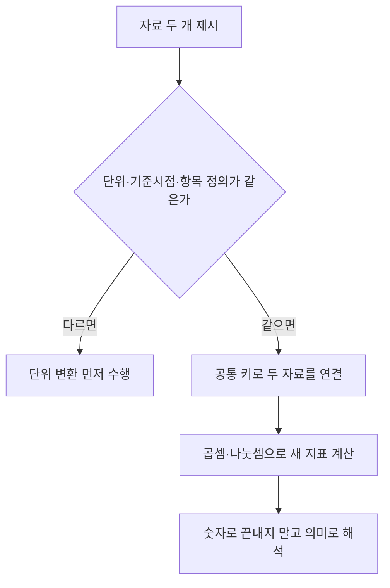

## 왜 자료 하나로 끝나지 않는가

12편(자료해석 I)에서는 표 하나, 그래프 하나를 각각 읽는 법을 다뤘습니다. **표 두 개, 표와 그래프 하나씩, 또는 세 개의 자료가 나란히 제시되고, 두 자료를 엮어야만 답이 나오는 문제**가 많이 출제됩니다.

왜 이런 방식으로 출제할까요. 실제 업무에서 필요한 자료해석 능력은 "표 하나를 읽는 것"이 아니라 "서로 다른 부서·서로 다른 시점에서 만들어진 자료를 엮어서 새로운 판단을 내리는 것"이기 때문입니다.

## 1. 복합자료를 교차 확인하는 법

### 가장 먼저 확인할 것 — 기준이 같은가

두 자료를 곧바로 계산에 섞기 전에 반드시 확인해야 하는 세 가지가 있습니다.

- **단위**가 같은가 (원과 만 원, 명과 천 명처럼 자릿수 단위가 다르면 그대로 계산하면 안 됩니다)
- **기준 시점**이 같은가 (표1은 2022년 자료인데 표2는 2023년 자료라면 두 표를 그대로 엮는 것 자체가 의미 없는 비교가 됩니다)
- **항목의 정의**가 같은가 (표1의 "매출"이 세전 매출이고 표2의 "매출"이 세후 매출이면 같은 이름이어도 다른 값입니다)

```mermaid
graph TD
  A[자료 두 개 제시] --> B{단위·기준시점·항목 정의가 같은가}
  B -->|다르면| C[단위 변환 먼저 수행]
  B -->|같으면| D[공통 키로 두 자료를 연결]
  D --> E[곱셈·나눗셈으로 새 지표 계산]
  E --> F[숫자로 끝내지 말고 의미로 해석]
```

이 확인을 건너뛰고 바로 계산부터 하면, 계산 자체는 맞아도 **비교 대상이 애초에 성립하지 않는** 오답을 만들게 됩니다. 실전에서 가장 흔한 실수입니다.

### 예시로 계산해보기 — 1인당 매출

아래 두 표를 봅시다.

| 지역 | 인구(만 명) |
|------|-------------|
| 갑 | 10 |
| 을 | 15 |
| 병 | 6 |

| 지역 | 총매출(억 원) |
|------|---------------|
| 갑 | 40 |
| 을 | 90 |
| 병 | 33 |

두 표의 **공통 키**는 지역입니다. 이제 "1인당 매출"이라는 새 지표를 만들어봅시다.

**계산의 실마리 — 단위를 맞추는 요령.** 매출은 억 원, 인구는 만 명 단위입니다. 억은 10의 8제곱, 만은 10의 4제곱이므로, 매출(억 원)을 인구(만 명)로 나누면 자동으로 10의 4제곱, 즉 **만 원 단위의 1인당 값**이 나옵니다.

$$
갑: \frac{40}{10} = 4
$$

$$
을: \frac{90}{15} = 6
$$

$$
병: \frac{33}{6} = 5.5
$$

**해석:** 세 지역의 1인당 매출은 갑 4만 원, 을 6만 원, 병 5.5만 원입니다. **총매출은 을이 90억 원으로 가장 크지만, 1인당 매출도 을이 가장 큽니다.** 하지만 이것이 항상 그런 것은 아닙니다.

### 자주 틀리는 점 — 총량과 비율의 혼동

만약 병의 인구가 6만 명이 아니라 33만 명이었다면 어떨까요. 1인당 매출은 33÷33=1만 원으로 뚝 떨어집니다.

## 2. 빈칸(추정치) 채우기

### 왜 빈칸을 채우는 문제가 나오는가

실제 통계 자료는 항상 완전하지 않습니다. 특정 연도 값이 누락되거나, 합계만 알고 개별 항목은 모르는 경우가 실무에서도 흔합니다. 적성검사는 이런 상황에서 **주어진 다른 정보(증감률, 합계, 구성비)를 거꾸로 이용해 빈칸을 논리적으로 역산**할 수 있는지를 봅니다.

### 증감률을 거꾸로 이용하기

다음 매출 자료에서 2022년 값이 빈칸입니다.

| 연도 | 매출(억 원) |
|------|-------------|
| 2021 | 80 |
| 2022 | ? |
| 2023 | 110 |

추가 조건: 2022년 대비 2023년 매출 증가율은 10퍼센트입니다.

**여기서 틀리는 지점:** "2023년이 110이고 증가율이 10퍼센트니까 110의 10퍼센트인 11을 빼서 99"라고 계산하는 실수가 매우 흔합니다. 이 계산은 **증가율의 기준(분모)을 2023년으로 잘못 잡은** 것입니다. 증가율의 정의를 다시 떠올려야 합니다.

$$
증가율 = \frac{2023년 값 - 2022년 값}{2022년 값}
$$

2022년 값을 $x$ 라 하면

$$
0.1 = \frac{110 - x}{x}
$$

$$
0.1x = 110 - x
$$

$$
1.1x = 110
$$

$$
x = 100
$$

**해석:** 2022년 매출은 100억 원입니다. 검산하면 100에서 10퍼센트가 증가한 값은 100×1.1=110으로 정확히 맞습니다. "**증가율의 분모는 항상 비교 기준이 되는 이전 시점의 값**"이라는 원칙을 지키면 방향을 헷갈리지 않습니다.

### 구성비의 합이 100퍼센트라는 성질 이용하기

빈칸을 채우는 또 다른 흔한 방식은 구성비(전체 대비 비중)의 합이 항상 100퍼센트라는 성질을 이용하는 것입니다.

| 항목 | 구성비 |
|------|--------|
| A | 22% |
| B | 35% |
| C | 25% |
| D | ? |

전체 항목의 구성비 합은 100퍼센트이므로

$$
D = 100 - 22 - 35 - 25 = 18
$$

D의 구성비는 18퍼센트입니다. 이 방식은 계산 자체는 단순한 뺄셈이지만, "구성비의 합은 100퍼센트"라는 **전제를 문제에서 명시하지 않아도 당연히 성립한다는 것을 알아차려야** 빨리 풀립니다.

## 3. 어림과 선택지 소거 전략

### 왜 정확히 계산하면 안 되는가

자료해석 문제 하나에 주어지는 시간은 보통 1분 안팎입니다. 소수점 셋째 자리까지 정확히 나눗셈을 하다가는 시간이 부족해집니다. **정답을 정확히 구하는 것이 목표가 아니라, 5개의 선택지 중 정답 하나를 골라내는 것이 목표**라는 점을 이용하면 계산량을 크게 줄일 수 있습니다.

### 선택지 간격을 먼저 본다

**예시.** "어느 지역의 1인당 매출로 가장 적절한 것은? ① 3.8만 원 ② 4.2만 원 ③ 5.9만 원 ④ 8.1만 원"처럼 선택지 사이 간격이 넓다면, 매출과 인구를 각각 반올림해서 나눈 값만으로도 ①~④ 중 하나를 바로 골라낼 수 있습니다.

### 선택지 소거의 논리적 근거

소거는 단순히 "귀찮은 계산 생략"이 아니라 **자료의 구조가 만드는 제약 조건**을 이용하는 것입니다. 구성비의 합이 100퍼센트를 넘을 수 없다는 것, 1인당 값은 총량보다 작을 수밖에 없는 상황이 있다는 것, 증가율이 양수로 명시되어 있는데 선택지에 이전 값보다 작은 수가 있다면 그 선택지는 답이 될 수 없다는 것처럼, **문제의 조건 자체가 이미 몇 개의 선택지를 배제하고 있는 경우가 많습니다.** 이 제약을 먼저 찾는 습관이 계산 시간을 가장 크게 줄여줍니다.

## 핵심 정리

- 복합자료를 엮기 전에 **단위·기준 시점·항목 정의**가 같은지 먼저 확인한다. 다르면 그대로 계산해도 의미가 없다.
- 억 원을 만 명으로 나누면 자동으로 만 원 단위의 1인당 값이 나오는 것처럼, **단위 사이의 자릿수 차이를 이용**하면 별도 환산 없이 계산할 수 있다.
- **총량(총매출 등)이 크다고 비율(1인당 값 등)도 크다는 보장은 없다.** 두 지표를 혼동하지 않는다.
- 증가율의 **분모는 항상 비교 기준이 되는 이전 시점의 값**이다. 나중 값을 분모로 놓으면 방향이 뒤집힌다.
- **구성비의 합은 언제나 100퍼센트**라는 성질을 이용하면 빈칸을 뺄셈만으로 채울 수 있다.
- 계산에 들어가기 전 **선택지 간격**부터 확인해, 넓으면 어림으로 빠르게 좁히고 좁으면 핵심 자리만 정밀하게 계산한다.
- 자료의 제약 조건(합계 초과 불가, 증가율의 부호 등)을 먼저 살피면 계산 없이 선택지를 소거할 수 있다.

## 마무리 복습

<Quiz
  questionNumber={1}
  question={"지역별 인구(만 명)가 갑 10, 을 15, 병 6이고 총매출(억 원)이 갑 40, 을 90, 병 33일 때, 1인당 매출이 가장 큰 지역은?"}
  options={["갑","을","병","세 지역이 모두 같다"]}
  correctAnswer={2}
  explanation={"1인당 매출은 매출(억 원)을 인구(만 명)로 나누면 만 원 단위로 바로 얻어진다. 갑은 40÷10=4, 을은 90÷15=6, 병은 33÷6=5.5이므로 을이 6만 원으로 가장 크다."}
/>

<Quiz
  questionNumber={2}
  question={"2021년 매출 80억 원, 2023년 매출 110억 원이며 2022년 대비 2023년 증가율이 10퍼센트일 때, 2022년 매출로 가장 적절한 것은?"}
  options={["90억 원","95억 원","100억 원","105억 원"]}
  correctAnswer={3}
  explanation={"증가율의 분모는 비교 기준이 되는 이전 시점, 즉 2022년 값이다. 2022년 값을 x라 하면 (110-x)/x=0.1이 되어 1.1x=110, x=100이다."}
/>

<Quiz
  questionNumber={3}
  question={"어느 자료해석 문제에서 총매출이 가장 큰 지역이 1인당 매출도 가장 크다고 바로 결론짓는 것이 위험한 이유로 가장 적절한 것은?"}
  options={["총매출은 항상 오차가 포함된 추정치이기 때문이다","총매출이 큰 지역은 인구도 함께 많을 수 있어 나누면 1인당 값이 작아질 수 있기 때문이다","1인당 매출은 애초에 계산할 수 없는 지표이기 때문이다","적성검사에서는 총매출 자체를 절대 묻지 않기 때문이다"]}
  correctAnswer={2}
  explanation={"총량 지표(총매출)와 비율 지표(1인당 매출)는 서로 다른 정보를 담고 있다. 인구가 많으면 총매출이 커 보여도 나눠 가지는 몫인 1인당 값은 오히려 작아질 수 있으므로, 두 지표를 같은 것으로 취급하면 안 된다."}
/>

## 참고 자료

- [NCS 국가직무능력표준 – 직업기초능력 (공식)](https://www.ncs.go.kr/th03/TH0302List.do?dirSeq=121)
- [NCS 국가직무능력표준 – 필기문항 예시문항 (공식)](https://ncs.go.kr/blind/blp/bbs_lib_list.do?libDstinCd=55)
- [링커리어 – NCS 기출문제 유형별 예시 및 풀이 전략](https://community.linkareer.com/employment_data/4182192)
