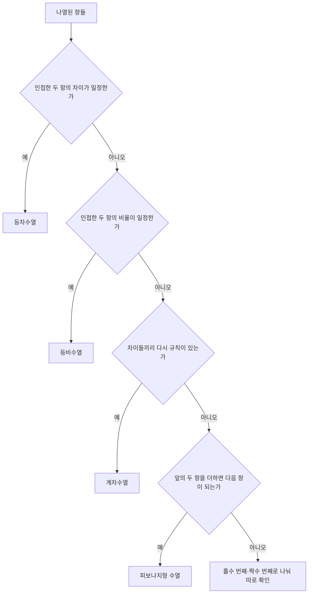

<Callout type="info">
  **이번 문서의 목표:** 나열된 숫자나 문자를 보고 어떤 종류의 규칙(등차·등비·계차·피보나치형)인지 순서대로 판별하고, 문자를 숫자로 바꿔 같은 방법으로 문자수열의 다음 항까지 예측할 수 있게 된다.
</Callout>

## 왜 수추리 문제가 나오는가

수추리·문자추리는 "몇 개의 숫자나 문자를 보여주고 다음에 올 것을 맞혀라"는 형태입니다. 언뜻 단순해 보이지만, 실제로 시험하는 능력은 **적은 정보로 숨은 규칙을 빠르게 찾아내는 패턴 인식 능력**입니다. 업무 현장에서 매출 추세나 데이터의 증가 패턴을 보고 다음 분기를 예측하는 것과 근본적으로 같은 사고 과정입니다.

> **쉽게 말하면:** 수추리는 "나열된 숫자들 사이에 어떤 계산 규칙이 숨어 있는지" 찾는 문제입니다.

02편에서 배운 방정식 세우는 법과 순열·조합 기호는 이 편의 계산에도 그대로 쓰입니다. 다만 수추리의 핵심은 계산 자체보다 **어떤 규칙을 먼저 의심해야 하는가, 즉 확인 순서**에 있습니다.

## 1. 규칙을 찾는 순서 — 무엇부터 의심할 것인가

수열의 규칙은 아래 순서대로 확인하면 놓치지 않습니다. 앞 단계에서 규칙이 보이지 않아야 다음 단계로 넘어갑니다.

이 순서를 몸에 익혀두면 어떤 수열을 봐도 당황하지 않고 기계적으로 접근할 수 있습니다.

## 2. 등차수열 — 일정하게 더해지는 수열

### 정의와 예시

**등차수열**(arithmetic sequence)은 이웃한 두 항의 차이(공차, common difference)가 항상 일정한 수열입니다.

$$
a_n = a_1 + (n-1)d
$$

- $a_n$: $n$번째 항
- $a_1$: 첫 번째 항
- $d$: 공차(이웃한 두 항의 차이)

**예시.** 3, 7, 11, 15, ... 인접한 두 항의 차이는 7−3=4, 11−7=4, 15−11=4로 모두 4입니다. 공차 $d=4$인 등차수열입니다.

**계산.** 이 수열의 6번째 항을 구해봅시다.

$$
a_6 = 3 + (6-1) \times 4 = 3 + 20 = 23
$$

**해석:** 첫 항에서 공차를 다섯 번(6번째 항이므로 항 사이 간격은 5개) 더한 값입니다. **몇 번째 항인지에서 1을 뺀 횟수만큼 공차를 더한다**는 점이 자주 틀리는 지점입니다. 6번째 항이라고 공차를 6번 더하면 27이라는 오답이 나옵니다.

## 3. 등비수열 — 일정하게 곱해지는 수열

### 정의와 예시

**등비수열**(geometric sequence)은 이웃한 두 항의 비율(공비, common ratio)이 항상 일정한 수열입니다.

$$
a_n = a_1 \times r^{n-1}
$$

- $r$: 공비(이웃한 두 항의 비율)

**예시.** 2, 6, 18, 54, ... 인접한 두 항의 비율은 6÷2=3, 18÷6=3, 54÷18=3으로 모두 3입니다. 공비 $r=3$인 등비수열입니다.

**계산.** 5번째 항을 구해봅시다.

$$
a_5 = 2 \times 3^{4} = 2 \times 81 = 162
$$

**해석:** 공비가 1보다 크면 값이 급격히 커지고, 공비가 1보다 작은 양수(예: 0.5)이면 값이 점점 작아지며 0에 가까워집니다. 100, 50, 25, 12.5처럼 계속 절반이 되는 수열도 공비 0.5의 등비수열입니다. **공비가 분수이거나 소수인 경우를 등차수열로 착각하지 않도록** 반드시 비율부터 확인하는 습관이 필요합니다.

## 4. 계차수열 — 차이가 다시 규칙을 이루는 수열

### 왜 필요한가

등차도 등비도 아닌데 규칙이 있어 보이는 수열이 있습니다. 이때는 **항들의 차이로 새로운 수열을 만들어 그 수열에서 규칙을 찾습니다.**

> **쉽게 말하면:** 원래 수열이 어려우면, 이웃한 항끼리 뺀 값들을 따로 늘어놓고 그 수열의 규칙을 먼저 찾는 방법입니다.

### 예시

1, 2, 4, 7, 11, 16, ...

인접한 항의 차이를 나열하면 1, 2, 3, 4, 5로 **공차 1인 등차수열**입니다. 원래 수열을 **계차수열**(sequence of differences)이라 부릅니다.

**계산.** 다음 항(7번째 항)을 구하려면, 차이 수열의 다음 값(6)을 마지막 항에 더합니다.

$$
a_7 = 16 + 6 = 22
$$

**일반항으로 검증.** 차이가 1부터 시작하는 등차수열이므로, $n$번째 항은 첫 항 1에 1부터 $(n-1)$까지의 합을 더한 값입니다.

$$
a_n = 1 + \frac{(n-1)n}{2}
$$

$n=7$을 대입하면

$$
a_7 = 1 + \frac{6 \times 7}{2} = 1 + 21 = 22
$$

두 방법의 결과가 22로 일치합니다. **자주 틀리는 점:** 계차수열 문제에서 "차이의 차이"까지 확인하지 않고 원래 수열만 보고 규칙이 없다고 포기하는 경우가 많습니다. 인접항의 차이를 별도로 적어보는 습관 자체가 계차수열을 알아보는 핵심 기술입니다.

## 5. 피보나치형 수열 — 앞의 두 항을 더하는 수열

### 정의와 예시

**피보나치형 수열**은 각 항이 바로 앞의 두 항을 더한 값인 수열입니다. 가장 널리 알려진 형태는 1, 1, 2, 3, 5, 8, 13, ...입니다.

$$
a_n = a_{n-1} + a_{n-2}
$$

**계산.** 다음 항은 13+8=21입니다.

### 변형된 형태 주의

시험에는 순수한 피보나치 수열보다 **변형된 형태**가 더 자주 나옵니다.

- 시작 값이 다른 경우: 2, 3, 5, 8, 13, 21, ... (같은 규칙이지만 시작 항만 다름)
- 상수가 더해지는 경우: 1, 2, 4, 7, 12, 20, ... 이 수열은 1+2+1=4, 2+4+1=7, 4+7+1=12처럼 **앞의 두 항의 합에 1을 더한** 규칙입니다

**해석:** "앞 두 항을 더하면 되는가"를 확인했는데 딱 맞지 않고 일정한 차이(예: 항상 1씩 부족하거나 남는다면), 상수를 더하거나 빼는 변형된 피보나치형을 의심해야 합니다.

## 6. 문자수열 — 문자를 숫자로 치환하기

### 왜 필요한가

문자수열은 알파벳이나 한글 자음이 나열된 문제입니다. **문자 자체는 규칙을 계산할 수 없으므로, 먼저 문자를 알파벳 순서(A=1, B=2, ... Z=26)의 숫자로 치환**해야 앞서 배운 등차·계차·피보나치형 판별법을 그대로 적용할 수 있습니다.

> **쉽게 말하면:** 문자수열은 숫자수열에 옷만 갈아입힌 것입니다. 알파벳 순서 번호로 바꾸면 지금까지 배운 방법이 그대로 통합니다.

### 예시 1 — 등차형 문자수열

B, D, F, H, ?

알파벳 순서로 치환하면 B=2, D=4, F=6, H=8입니다. 차이가 모두 2인 등차수열이므로 다음 값은 10입니다. 10번째 알파벳은 **J**입니다.

### 예시 2 — 계차형 문자수열

A, C, F, J, O, ?

알파벳 순서로 치환하면 A=1, C=3, F=6, J=10, O=15입니다. 인접한 값의 차이는 2, 3, 4, 5로 **공차 1인 등차수열**을 이룹니다(계차수열 구조). 다음 차이는 6이므로 15+6=21이고, 21번째 알파벳은 **U**입니다.

**해석:** 문자수열은 규칙 자체는 숫자수열과 똑같고, "알파벳 순서로 바꾸는 한 단계"만 추가됩니다. 이 한 단계를 건너뛰고 문자를 눈으로만 보며 규칙을 찾으려 하면 시간이 훨씬 오래 걸립니다.

### 자주 틀리는 점 — 26을 넘어가는 순환

알파벳은 Z(26) 다음에 다시 A(1)로 돌아갑니다. 예를 들어 계산 결과가 28이 나왔다면 28−26=2이므로 **B**가 정답입니다. 한글 자음(ㄱ, ㄴ, ㄷ, ...)을 쓰는 문제도 순서를 ㄱ=1부터 매겨 같은 방식으로 풉니다. 순환을 놓치고 "27번째, 28번째 알파벳"이라는 존재하지 않는 답을 내는 실수를 조심해야 합니다.

## 7. 유형 판별 한눈에 보기

| 유형 | 판별 기준 | 예시 |
|------|-----------|------|
| 등차수열 | 인접한 두 항의 차이가 일정 | 3, 7, 11, 15 |
| 등비수열 | 인접한 두 항의 비율이 일정 | 2, 6, 18, 54 |
| 계차수열 | 인접한 두 항의 차이들끼리 다시 규칙(주로 등차)을 이룸 | 1, 2, 4, 7, 11, 16 |
| 피보나치형 | 앞의 두 항을 더하면 다음 항(또는 상수를 더하거나 뺀 값)이 됨 | 1, 1, 2, 3, 5, 8 |
| 문자수열 | 문자를 알파벳 순서 번호로 치환한 뒤 위 네 가지 중 하나로 판별 | B, D, F, H |

## 핵심 정리

- 규칙 판별은 **차이가 일정한가(등차) → 비율이 일정한가(등비) → 차이의 차이에 규칙이 있는가(계차) → 앞 두 항의 합인가(피보나치형)** 순서로 확인한다.
- 등차수열은 $a_n = a_1 + (n-1)d$이며, 몇 번째 항인지에서 **1을 뺀 횟수만큼** 공차를 더한다.
- 등비수열은 $a_n = a_1 \times r^{n-1}$이며, 공비가 분수·소수일 수 있다는 점을 놓치지 않는다.
- 계차수열은 **차이들로 새 수열을 만들어** 그 수열의 규칙을 먼저 찾은 뒤 원래 수열에 적용한다.
- 피보나치형은 순수한 형태 외에 **상수가 더해지거나 빠지는 변형**이 자주 나온다.
- 문자수열은 **알파벳 순서 번호로 치환**한 뒤 위와 동일한 방법으로 풀고, **Z(26) 다음은 다시 A(1)로 순환**한다는 점을 기억한다.

## 마무리 복습

<Quiz
  questionNumber={1}
  question="수열 3, 7, 11, 15, ...의 6번째 항으로 옳은 것은?"
  options={['19', '23', '27', '31']}
  correctAnswer={2}
  explanation="공차가 4인 등차수열이므로 a6=3+(6-1)×4=3+20=23이다."
  optionExplanations={['공차를 4번만 더한 값으로 항 번호에서 1을 빼는 규칙을 잘못 적용한 경우다.', '3에 공차 4를 다섯 번 더한 값과 정확히 일치한다.', '공차를 6번 그대로 더해 항 번호를 그대로 곱한 오류다.', '공차를 7번 더한 값으로 항 번호를 잘못 키운 경우다.']}
/>

<Quiz
  questionNumber={2}
  question="수열 2, 6, 18, 54, ...의 5번째 항으로 옳은 것은?"
  options={['108', '150', '162', '216']}
  correctAnswer={3}
  explanation="공비가 3인 등비수열이므로 a5=2×3⁴=2×81=162이다."
  optionExplanations={['공비를 세 번만 곱한 값으로 지수 계산이 부족한 경우다.', '등차수열로 착각해 일정한 값을 더한 결과다.', '2에 3을 네 번 곱한 값과 정확히 일치한다.', '3의 거듭제곱을 잘못 계산해 값이 커진 경우다.']}
/>

<Quiz
  questionNumber={3}
  question="수열 1, 2, 4, 7, 11, 16, ...의 다음 항으로 옳은 것은?"
  options={['20', '21', '22', '23']}
  correctAnswer={3}
  explanation="인접한 항의 차이가 1, 2, 3, 4, 5로 공차 1인 등차수열을 이루는 계차수열이다. 다음 차이는 6이므로 16+6=22다."
  optionExplanations={['차이를 5로 계산해 한 단계 부족하게 더한 값이다.', '차이를 5.5로 어림해 더한 것과 비슷한 부정확한 값이다.', '다음 차이인 6을 마지막 항에 더한 값과 정확히 일치한다.', '차이를 7로 과대 계산해 더한 값이다.']}
/>

<Quiz
  questionNumber={4}
  question="수열 1, 1, 2, 3, 5, 8, 13, ...의 다음 항으로 옳은 것은?"
  options={['18', '19', '20', '21']}
  correctAnswer={4}
  explanation="각 항이 앞의 두 항을 더한 값인 피보나치형 수열이므로 다음 항은 13+8=21이다."
  optionExplanations={['앞 두 항의 합보다 3만큼 작은 값이다.', '앞 두 항의 합보다 2만큼 작은 값이다.', '앞 두 항의 합보다 1만큼 작은 값이다.', '13과 8을 더한 값과 정확히 일치한다.']}
/>

<Quiz
  questionNumber={5}
  question="문자수열 B, D, F, H, ?에서 물음표에 들어갈 문자로 옳은 것은?"
  options={['I', 'J', 'K', 'L']}
  correctAnswer={2}
  explanation="B=2, D=4, F=6, H=8로 치환하면 공차 2인 등차수열이다. 다음 값은 10이며 알파벳 순서 10번째는 J다."
  optionExplanations={['알파벳 순서 9번째로 공차 계산이 1만큼 부족하다.', '공차 2를 정확히 적용한 알파벳 순서 10번째 문자다.', '알파벳 순서 11번째로 공차가 과도하게 적용된 값이다.', '알파벳 순서 12번째로 공차를 두 번 더 적용한 값이다.']}
/>

<Quiz
  questionNumber={6}
  question="문자수열 A, C, F, J, O, ?에서 물음표에 들어갈 문자로 옳은 것은?"
  options={['Q', 'S', 'U', 'W']}
  correctAnswer={3}
  explanation="A=1, C=3, F=6, J=10, O=15로 치환하면 인접한 값의 차이가 2, 3, 4, 5로 커지는 계차수열이다. 다음 차이는 6이므로 15+6=21이며 21번째 알파벳은 U다."
  optionExplanations={['17번째 알파벳으로 차이를 2만큼 적게 더한 값이다.', '19번째 알파벳으로 차이를 4만큼 적게 더한 값이다.', '15에 다음 차이 6을 더한 21번째 알파벳과 정확히 일치한다.', '23번째 알파벳으로 차이를 8만큼 과도하게 더한 값이다.']}
/>

<Quiz
  questionNumber={7}
  question="수열 5, 5, 10, 15, 25, 40, ...의 다음 항으로 옳은 것은?"
  options={['55', '60', '65', '70']}
  correctAnswer={3}
  explanation="5+5=10, 5+10=15, 10+15=25, 15+25=40으로 앞의 두 항을 더하는 피보나치형 수열이다. 다음 항은 25+40=65다."
  optionExplanations={['앞 두 항의 합보다 10만큼 작은 값이다.', '앞 두 항의 합보다 5만큼 작은 값이다.', '25와 40을 더한 값과 정확히 일치한다.', '앞 두 항의 합보다 5만큼 큰 값이다.']}
/>

<Quiz
  questionNumber={8}
  question="처음 보는 수열의 규칙을 찾을 때 가장 먼저 확인해야 할 순서로 가장 적절한 것은?"
  options={['앞의 두 항을 더해 다음 항이 되는지부터 확인한다', '인접한 두 항의 차이가 일정한지부터 확인하고, 아니면 비율, 그다음 차이의 차이를 순서대로 확인한다', '문자든 숫자든 관계없이 곧바로 알파벳 순서 번호로 치환한 뒤 시작한다', '수열의 마지막 항과 첫 항의 차이만 계산해 규칙을 추정한다']}
  correctAnswer={2}
  explanation="등차인지(인접 차이 일정) 먼저 확인하고, 아니면 등비인지(인접 비율 일정), 그다음 계차수열인지(차이들끼리 규칙), 마지막으로 피보나치형인지 순서대로 확인하는 것이 가장 놓치지 않는 방법이다."
  optionExplanations={['가장 흔한 등차·등비를 건너뛰고 상대적으로 드문 피보나치형부터 확인하는 것은 비효율적이다.', '등차부터 시작해 단계적으로 확인해 나가는 순서가 가장 놓치지 않는 방법이다.', '숫자수열에는 치환 단계 자체가 필요 없으므로 항상 먼저 적용할 절차는 아니다.', '양 끝 항만으로는 중간 항들의 규칙을 알 수 없다.']}
/>

## 참고 자료

- [NCS 국가직무능력표준 – 필기문항 예시문항 (공식)](https://ncs.go.kr/blind/blp/bbs_lib_list.do?libDstinCd=55)
- [링커리어 – 인적성 검사 공부법 GSAT·SKCT·HMAT, 2026 최신 시험 구성 비교](https://community.linkareer.com/employment_data/6482010)
