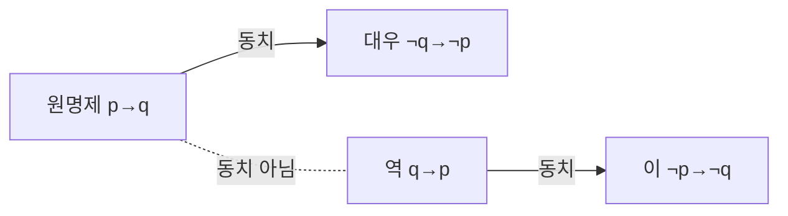

<Callout type="info">
  **이번 문서의 목표:** 조건문 형태의 명제에서 역·이·대우를 정확히 만들고, 두 전제로부터 이끌어낸 결론이 논리적으로 반드시 참인지(타당한지)를 반례를 찾는 방법으로 검증할 수 있게 된다.
</Callout>

## 왜 명제 논리 문제가 나오는가

NCS와 인적성의 추리 영역에는 "다음 명제가 모두 참일 때 반드시 참인 것은?"과 같은 문제가 자주 나옵니다. 이 문제는 문장의 내용을 아는지가 아니라, **주어진 전제만으로 결론이 논리적으로 확실히 도출되는지**를 판단하는 능력을 시험합니다. 내용은 몰라도 형식만 정확히 알면 풀 수 있다는 점이 이 유형의 특징입니다.

01편에서 명제를 참·거짓을 판별할 수 있는 문장으로 정의하고, 부정(¬)·그리고(∧)·또는(∨)·조건문(→) 기호를 읽는 법을 다뤘습니다. 이 편은 그중에서도 **조건문 "p이면 q이다"(p→q) 형태의 명제**를 중심으로, 그 명제를 변형한 역·이·대우의 관계와 두 개 이상의 명제를 엮는 삼단논법의 타당성 판단법을 다룹니다. "모든·어떤" 형태의 범주 명제와 벤다이어그램은 16편에서 이어서 다룹니다.

> **쉽게 말하면:** 명제 논리 문제는 내용이 아니라 "이 결론이 전제만으로 반드시 나오는가, 아니면 그럴듯해 보이지만 다른 가능성이 남아 있는가"를 가려내는 문제입니다.

## 1. 역·이·대우 — 조건문을 변형하는 세 가지 방법

### 정의

원래 명제 "p이면 q이다"($p \to q$)가 있을 때, p와 q의 위치를 바꾸거나 부정을 붙여 세 가지 새로운 명제를 만들 수 있습니다.

| 이름 | 형식 | 원래 명제와의 관계 |
|------|------|---------------------|
| 원명제 | $p \to q$ | 기준이 되는 명제 |
| 역 | $q \to p$ | p와 q의 위치를 바꿈 |
| 이 | $\lnot p \to \lnot q$ | p와 q를 각각 부정 |
| 대우 | $\lnot q \to \lnot p$ | 위치를 바꾸고 각각 부정 |

### 예시로 확인하기

"비가 오면 땅이 젖는다"를 원명제로 놓아봅시다. $p$는 "비가 온다", $q$는 "땅이 젖는다"입니다.

- **역**: 땅이 젖으면 비가 온다
- **이**: 비가 오지 않으면 땅이 젖지 않는다
- **대우**: 땅이 젖지 않으면 비가 오지 않는다

**해석 — 원명제가 참이어도 역과 이는 참이 아닐 수 있습니다.** 땅이 젖는 이유는 비 말고도 스프링클러, 수도관 파열 등 여러 가지가 있을 수 있습니다. 그래서 "땅이 젖으면 비가 온다"(역)는 원명제가 참이어도 거짓일 수 있습니다. 같은 이유로 "비가 오지 않으면 땅이 젖지 않는다"(이)도 스프링클러 때문에 거짓이 될 수 있습니다.

반면 **대우인 "땅이 젖지 않으면 비가 오지 않는다"는 원명제가 참이면 항상 참**입니다. 비가 왔는데 땅이 안 젖는 경우는 있을 수 없기 때문입니다.

### 핵심 성질 — 원명제와 대우는 항상 동치

**동치**(logically equivalent)란 두 명제의 참·거짓이 항상 똑같이 움직인다는 뜻입니다. 원명제와 대우는 언제나 동치이고, 역과 이도 서로 동치입니다(역의 대우가 이이기 때문입니다). 하지만 **원명제와 역, 원명제와 이는 서로 동치가 아닙니다.**

**자주 틀리는 점:** "원명제가 참이면 역도 당연히 참이다"라고 착각하는 경우가 가장 흔한 오답 패턴입니다. 참·거짓이 보장되는 쌍은 오직 **원명제와 대우** 뿐입니다.

## 2. 삼단논법 — 두 전제로 결론을 이끌어내기

### 정의

**삼단논법**(syllogism)은 두 개의 전제(premise)로부터 하나의 결론(conclusion)을 이끌어내는 추론 형식입니다. 이 편에서는 조건문(p→q)으로 이루어진 삼단논법을 다룹니다.

> **쉽게 말하면:** 삼단논법의 타당성 판단은 "이 결론이 전제만 가지고 100퍼센트 확실히 나오는가"를 확인하는 것입니다. 그럴듯해 보여도 예외가 하나라도 있으면 타당하지 않습니다.

### 타당한 형식 — 전건긍정과 후건부정

**전건긍정**(modus ponens): $p \to q$가 참이고 $p$가 참이면, $q$는 반드시 참입니다.

- 전제 1: 비가 오면 땅이 젖는다
- 전제 2: 비가 온다
- 결론: 그러므로 땅이 젖는다 — **타당**

**후건부정**(modus tollens): $p \to q$가 참이고 $q$가 거짓(¬q)이면, $p$도 반드시 거짓(¬p)입니다.

- 전제 1: 비가 오면 땅이 젖는다
- 전제 2: 땅이 젖지 않았다
- 결론: 그러므로 비가 오지 않았다 — **타당**

후건부정이 타당한 이유는 결론이 원명제의 **대우**와 정확히 같은 구조이기 때문입니다. 대우는 원명제와 항상 동치이므로, 이 추론은 반드시 참입니다.

### 오류 형식 — 전건부정과 후건긍정

**전건부정의 오류**(denying the antecedent): $p \to q$가 참이고 $p$가 거짓(¬p)이라고 해서, $q$가 거짓(¬q)이라고 결론지으면 **오류**입니다.

- 전제 1: 비가 오면 땅이 젖는다
- 전제 2: 비가 오지 않았다
- (오답) 결론: 그러므로 땅이 젖지 않았다 — **부당**

이 결론은 원명제의 **이**($\lnot p \to \lnot q$)와 같은 구조인데, 이는 원명제와 동치가 아니므로 반드시 참이라고 보장할 수 없습니다. 스프링클러가 작동했다면 비가 안 왔어도 땅은 젖을 수 있습니다.

**후건긍정의 오류**(affirming the consequent): $p \to q$가 참이고 $q$가 참이라고 해서, $p$도 참이라고 결론지으면 **오류**입니다.

- 전제 1: 비가 오면 땅이 젖는다
- 전제 2: 땅이 젖었다
- (오답) 결론: 그러므로 비가 왔다 — **부당**

이 결론은 원명제의 **역**($q \to p$)과 같은 구조이므로 마찬가지로 보장되지 않습니다.

### 네 가지 형식 정리

| 형식 | 전제 2 | 결론 | 대응 관계 | 타당성 |
|------|--------|------|-----------|--------|
| 전건긍정 | p (참) | q | 원명제 그대로 | 타당 |
| 후건부정 | ¬q (거짓) | ¬p | 대우와 동일 | 타당 |
| 전건부정 | ¬p (거짓) | ¬q | 이와 동일 | 부당(오류) |
| 후건긍정 | q (참) | p | 역과 동일 | 부당(오류) |

**암기 요령:** 타당한 두 형식은 각각 원명제·대우와 구조가 같고, 부당한 두 형식은 각각 이·역과 구조가 같습니다. 앞서 "원명제와 대우만 동치"라고 배운 성질이 그대로 삼단논법의 타당성 판단 기준이 됩니다.

### 가언삼단논법 — 조건문 두 개를 잇기

전제가 조건문 두 개이고 앞 명제의 결론(q)이 뒤 명제의 조건(p)과 같을 때는 두 조건문을 이어 붙일 수 있습니다.

$$
p \to q, \quad q \to r \quad \Rightarrow \quad p \to r
$$

- 전제 1: 시험에 합격하면 자격증을 받는다
- 전제 2: 자격증을 받으면 취업에 유리하다
- 결론: 그러므로 시험에 합격하면 취업에 유리하다 — **타당**

**주의할 점:** 이어 붙이려면 반드시 **앞 명제의 뒷부분(q)과 뒷 명제의 앞부분(q)이 정확히 같은 표현**이어야 합니다. "자격증을 받는다"와 "자격증이 있다"처럼 시제나 표현이 미묘하게 달라 보이면, 실제로 같은 의미인지 먼저 확인해야 합니다.

## 3. 전제가 참이면 결론도 참인가 — 반례로 검증하는 법

### 검증 절차

<Steps>

1. **전제를 모두 참으로 고정한다** — 주어진 전제 문장이 실제로 참이라고 가정합니다
2. **결론이 거짓이 되는 상황을 하나라도 만들 수 있는지 찾는다** — 이런 상황(반례, counterexample)이 단 하나라도 있으면 그 논증은 타당하지 않습니다
3. **반례가 전혀 만들어지지 않으면 타당하다고 판단한다** — 아무리 애써도 전제가 참이면서 결론이 거짓인 상황을 못 만든다면 타당한 논증입니다

</Steps>

### 반례 찾기 예시

"어떤 새는 날 수 없다. 펭귄은 새다. 그러므로 펭귄은 날 수 없다"라는 논증을 검증해봅시다.

**반례를 찾아봅니다.** "어떤 새는 날 수 없다"는 참입니다(타조, 펭귄 등). "펭귄은 새다"도 참입니다. 그런데 "어떤 새는 날 수 없다"라는 전제는 **날 수 없는 새가 최소 하나 있다는 뜻일 뿐, 그 새가 반드시 펭귄이라는 뜻은 아닙니다.** 날지 못하는 새가 타조뿐이고 펭귄은 날 수 있는 세계도 논리적으로는 가능합니다(실제 사실과 별개로, 전제만으로는 그 가능성을 막지 못한다는 뜻입니다). 따라서 이 논증은 **부당**합니다.

**해석:** 이 예시가 보여주는 것은, 삼단논법의 타당성은 **실제로 그 문장이 사실인지와 무관하게, 전제의 형식만으로 결론이 강제되는지**를 따진다는 점입니다. "어떤(적어도 하나의) A는 B이다"라는 전제는 "모든 A는 B이다"라는 전제보다 훨씬 약한 정보라서, 특정 개체(펭귄)에 그 성질을 그대로 적용할 수 없습니다.

## 핵심 정리

- **원명제**($p \to q$)와 **대우**($\lnot q \to \lnot p$)는 항상 동치이며, **역**($q \to p$)과 **이**($\lnot p \to \lnot q$)도 서로 동치다. 하지만 원명제와 역·이는 동치가 아니다.
- **전건긍정**(p 참 → q 결론)과 **후건부정**(¬q 참 → ¬p 결론)은 타당하다. 각각 원명제·대우와 구조가 같기 때문이다.
- **전건부정**(¬p 참 → ¬q 결론)과 **후건긍정**(q 참 → p 결론)은 부당하다. 각각 이·역과 구조가 같아서 동치가 보장되지 않기 때문이다.
- **가언삼단논법**은 $p \to q$와 $q \to r$을 이어 $p \to r$을 이끌어내며, 두 명제의 이어지는 부분이 정확히 같은 표현일 때만 성립한다.
- 타당성은 **전제를 참으로 두고 결론이 거짓이 되는 반례가 하나라도 있는지**로 검증한다. 반례가 있으면 부당, 전혀 없으면 타당하다.
- "어떤(최소 하나)"이라는 전제는 특정 개체에 그 성질을 확정적으로 적용할 근거가 되지 못한다.

## 마무리 복습

<Quiz
  questionNumber={1}
  question="명제 p→q의 대우로 옳은 것은?"
  options={['q→p', '¬p→¬q', '¬q→¬p', 'p→¬q']}
  correctAnswer={3}
  explanation="대우는 위치를 바꾸고 각각 부정한 형태이므로 ¬q→¬p다."
  optionExplanations={['위치만 바꾼 형태로 역에 해당한다.', '각각 부정만 한 형태로 이에 해당한다.', '위치를 바꾸고 각각 부정한 형태로 대우가 맞다.', '원명제의 뒷부분만 부정한 형태로 역·이·대우 어디에도 해당하지 않는다.']}
/>

<Quiz
  questionNumber={2}
  question="원명제 p→q가 참일 때 반드시 참이라고 보장되는 것은?"
  options={['역 q→p', '이 ¬p→¬q', '대우 ¬q→¬p', '원명제와 역을 모두 참으로 가정한 결합 명제']}
  correctAnswer={3}
  explanation="원명제와 대우는 항상 동치이므로 원명제가 참이면 대우도 반드시 참이다. 역과 이는 원명제와 동치가 아니므로 별도로 참임이 증명되지 않는 한 보장되지 않는다."
  optionExplanations={['역은 원명제와 동치가 아니므로 참임이 보장되지 않는다.', '이 역시 원명제와 동치가 아니므로 참임이 보장되지 않는다.', '대우는 원명제와 항상 동치이므로 참임이 보장된다.', '역이 참인지 별도로 확인되지 않았으므로 이 결합 명제도 보장되지 않는다.']}
/>

<Quiz
  questionNumber={3}
  question="시험에 합격하면 자격증을 받는다는 전제가 참이고 어떤 사람이 시험에 합격했다는 전제가 참일 때, 그러므로 그 사람은 자격증을 받는다는 결론에 대한 판단으로 옳은 것은?"
  options={['전건긍정 형식으로 타당하다', '후건긍정 형식으로 부당하다', '전건부정 형식으로 부당하다', '어떤 삼단논법 형식에도 해당하지 않는다']}
  correctAnswer={1}
  explanation="p가 참이라는 전제로부터 q라는 결론을 이끌어내는 전건긍정 형식이며, 원명제 구조와 동일하므로 타당하다."
  optionExplanations={['p가 참이라는 전제에서 q를 결론으로 이끌어내는 전형적인 전건긍정이다.', '후건긍정은 q가 참이라는 전제에서 p를 결론으로 이끌어낼 때 해당하는 형식이다.', '전건부정은 p가 거짓이라는 전제에서 시작하는 형식이며 이 문제와 다르다.', '전건긍정이라는 대표적인 삼단논법 형식에 정확히 해당한다.']}
/>

<Quiz
  questionNumber={4}
  question="비가 오면 땅이 젖는다는 전제가 참이고 비가 오지 않았다는 전제가 참일 때, 그러므로 땅이 젖지 않았다는 결론에 대한 판단으로 가장 적절한 것은?"
  options={['후건부정 형식으로 타당하다', '전건부정 형식으로 부당하다', '전건긍정 형식으로 타당하다', '가언삼단논법 형식으로 타당하다']}
  correctAnswer={2}
  explanation="p가 거짓이라는 전제에서 q가 거짓이라는 결론을 이끌어내는 전건부정의 오류다. 이 결론은 원명제의 이(¬p→¬q)와 같은 구조인데 이는 원명제와 동치가 아니므로 스프링클러 등 다른 이유로 땅이 젖을 가능성이 남아 부당하다."
  optionExplanations={['후건부정은 q가 거짓이라는 전제에서 시작해야 하는데 이 문제는 p가 거짓인 전제에서 시작한다.', '이와 같은 구조이며 원명제와 동치가 아니므로 정확히 전건부정의 오류에 해당한다.', '전건긍정은 p가 참인 전제에서 시작해야 하는데 이 문제는 p가 거짓이다.', '가언삼단논법은 조건문 두 개를 이어 붙이는 형식이며 이 문제에는 조건문이 하나뿐이다.']}
/>

<Quiz
  questionNumber={5}
  question="합격하면 자격증을 받는다는 전제와 자격증을 받으면 취업에 유리하다는 전제가 모두 참일 때 도출할 수 있는 타당한 결론은?"
  options={['취업에 유리하면 합격한 것이다', '합격하면 취업에 유리하다', '자격증을 받지 못하면 합격한 것이다', '취업에 유리하지 않으면 합격하지 못한 것이 아니다']}
  correctAnswer={2}
  explanation="p→q와 q→r이 모두 참이면 가언삼단논법에 따라 p→r, 즉 합격하면 취업에 유리하다는 결론이 타당하게 도출된다."
  optionExplanations={['r→p 형태로 원래 조건문의 역에 해당하며 보장되지 않는다.', 'p→r 형태로 가언삼단논법에 따라 정확히 도출되는 결론이다.', '¬q→p 형태로 어느 원명제로부터도 정당하게 도출되지 않는다.', '이중 부정이 섞여 뜻이 모호하며 원래 전제들로부터 보장되지 않는다.']}
/>

<Quiz
  questionNumber={6}
  question="비가 오면 땅이 젖는다는 전제가 참이고 땅이 젖었다는 전제가 참일 때, 그러므로 비가 왔다는 결론에 대한 판단으로 가장 적절한 것은?"
  options={['후건긍정 형식이며 스프링클러처럼 다른 원인이 있을 수 있어 부당하다', '전건긍정 형식이며 타당하다', '후건부정 형식이며 타당하다', '대우 관계를 이용한 것이므로 타당하다']}
  correctAnswer={1}
  explanation="q가 참이라는 전제에서 p를 결론으로 이끌어내는 후건긍정의 오류다. 이 결론은 원명제의 역(q→p)과 같은 구조인데 역은 원명제와 동치가 아니므로, 비가 아닌 다른 원인으로 땅이 젖었을 가능성이 남아 부당하다."
  optionExplanations={['역과 같은 구조이며 다른 원인의 가능성이 남으므로 정확히 후건긍정의 오류에 해당한다.', '전건긍정은 p가 참인 전제에서 시작해야 하는데 이 문제는 q가 참인 전제에서 시작한다.', '후건부정은 q가 거짓인 전제에서 시작해야 하는데 이 문제는 q가 참이다.', '이 결론은 대우가 아니라 역과 같은 구조이므로 동치가 보장되지 않는다.']}
/>

<Quiz
  questionNumber={7}
  question="어떤 새는 날 수 없다는 전제와 펭귄은 새다라는 전제로부터 그러므로 펭귄은 날 수 없다는 결론을 이끌어낸 논증에 대한 설명으로 가장 적절한 것은?"
  options={['모든 새에 대한 전제이므로 타당하다', '어떤이라는 전제는 최소 하나의 사례만 보장할 뿐 펭귄에게 그 성질이 적용된다고 확정하지 못하므로 부당하다', '펭귄이 실제로 날지 못하는 새이므로 이 논증은 타당하다', '전건긍정 형식이므로 타당하다']}
  correctAnswer={2}
  explanation="전제는 모든 새가 아니라 어떤(최소 하나의) 새가 날 수 없다는 뜻이다. 날지 못하는 새가 다른 종일 가능성이 논리적으로 남아 있으므로, 전제의 형식만으로는 펭귄이 그 새에 해당한다고 확정할 수 없어 부당하다."
  optionExplanations={['전제는 모든 새가 아니라 어떤 새에 대한 것이므로 이 설명은 전제 자체를 잘못 읽은 것이다.', '어떤이라는 약한 전제로는 특정 개체에 성질을 확정할 수 없다는 점을 정확히 짚은 설명이다.', '타당성은 실제 사실 여부가 아니라 전제의 형식만으로 결론이 강제되는지로 판단한다.', '이 논증에는 조건문 형태의 전건긍정 구조가 나타나 있지 않다.']}
/>

## 참고 자료

- [링커리어 – 인적성 검사 공부법 GSAT·SKCT·HMAT, 2026 최신 시험 구성 비교](https://community.linkareer.com/employment_data/6482010)
- [나무위키 – 적성검사](https://namu.wiki/w/%EC%A0%81%EC%84%B1%EA%B2%80%EC%82%AC)
- [나무위키 – 삼단논법](https://namu.wiki/w/%EC%82%BC%EB%8B%A8%EB%85%BC%EB%B2%95)
- [나무위키 – 명제 논리](https://namu.wiki/w/%EB%AA%85%EC%A0%9C%20%EB%85%BC%EB%A6%AC)
