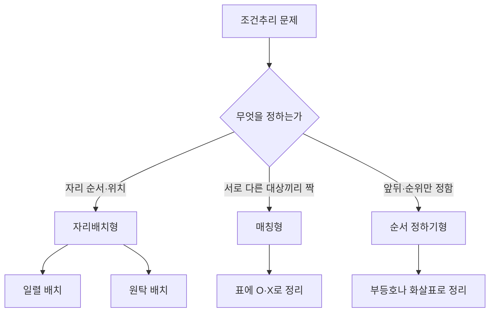

<Callout type="info">
  **이번 문서의 목표:** 자리배치·순서 정하기·매칭형 조건추리 문제를 표로 옮겨 적을 수 있고, 어떤 조건부터 먼저 적용해야 시간을 아끼는지 판단할 수 있게 된다.
</Callout>

## 왜 조건추리에서는 표가 필요한가

01편에서 명제 기호와 벤다이어그램을, 15~16편에서 명제·삼단논법·집합추리를 다뤘습니다. 조건추리는 이 도구들을 실제 "사람·물건을 어디에 놓을 것인가" 문제에 적용하는 유형입니다.

조건추리 문제는 보통 5~7개의 조건 문장을 한 번에 던져 줍니다. "A는 B보다 왼쪽에 앉는다", "C는 홍차를 마시지 않는다" 같은 문장을 머릿속으로만 조합하려 하면 세 번째 조건쯤에서 이미 앞의 조건을 잊어버립니다. 조건이 늘어날수록 머릿속 기억만으로 버티는 방법은 반드시 실패합니다.

> **쉽게 말하면:** 조건추리는 스도쿠와 같습니다. 빈칸(표)을 만들어 놓고, 조건을 하나씩 적용해 칸을 채우거나 지워 나가면 답이 저절로 좁혀집니다.

## 조건추리의 세 가지 형태

조건추리는 "무엇을 정하느냐"에 따라 아래 세 형태로 나뉩니다. 겉모습은 달라도 푸는 도구(표)는 같습니다.

- **자리배치형**: 사람이나 물건이 실제 공간(줄, 원탁, 층)의 어느 자리에 있는지를 정합니다.
- **매칭형(짝짓기)**: "누가 어떤 것을 가졌는가"처럼 자리 개념 없이 대상과 속성을 짝짓습니다.
- **순서 정하기형**: 자리 번호 없이 "누가 누구보다 먼저인가"만 정합니다. 부등호 사슬(`A > B > C`)로 표현하면 충분합니다.

## 일렬 배치형 — 좌석표로 채우기

### 정의와 표 만드는 법

**일렬 배치**는 대상들을 1번부터 n번까지 순서가 있는 자리에 놓는 문제입니다. 표는 자리 번호를 가로축으로 놓고, 그 아래에 확정된 이름을 적어 나가는 형태가 가장 간단합니다.

### 예시로 계산해 봅시다

A, B, C, D, E 다섯 명이 1번부터 5번까지 일렬로 된 자리(왼쪽이 1번, 오른쪽이 5번)에 앉습니다. 조건은 다음과 같습니다.

1. C는 정중앙(3번)에 앉는다.
2. A는 B보다 왼쪽에 앉는다.
3. D는 양 끝(1번 또는 5번) 중 한 곳에 앉는다.
4. E는 D와 이웃하지 않는다.

<Steps>

1. **가장 직접적인 조건부터 적용합니다.** 조건1은 다른 조건과 상관없이 바로 자리를 확정해 줍니다. 3번=C. 이렇게 위치를 곧바로 지정하는 조건이 항상 출발점입니다.
2. **범위를 좁히는 조건을 적용합니다.** 조건3은 D의 자리를 1번 또는 5번, 두 경우로만 좁힙니다. D=1인 경우와 D=5인 경우로 나누어 표를 두 벌 만듭니다.
3. **배제 조건으로 후보를 지웁니다.** 조건4에 따라 E는 D의 바로 옆자리에 올 수 없습니다. D=1이면 E는 2번이 될 수 없고, D=5이면 E는 4번이 될 수 없습니다.
4. **남은 자리에 남은 조건을 적용합니다.** 조건2(A가 B보다 왼쪽)로 마지막 두 자리를 결정합니다.

</Steps>

이 네 조건만으로는 아래처럼 네 가지 배치가 모두 가능하게 남습니다.

| 경우 | 1번 | 2번 | 3번 | 4번 | 5번 |
|------|-----|-----|-----|-----|-----|
| 1 | D | A | C | E | B |
| 2 | D | A | C | B | E |
| 3 | E | A | C | B | D |
| 4 | A | E | C | B | D |

**해석:** 조건이 네 개뿐이면 경우의 수가 하나로 좁혀지지 않을 수 있습니다. 실전 문제에서 "가능한 경우는 모두 몇 가지인가"를 묻는다면 이 표 자체가 답(4가지)입니다. 반면 "확정되는 자리는?"을 묻는다면, 표를 세로로 훑어 **모든 경우에서 값이 똑같은 칸**을 찾습니다. 위 표에서는 1번(3번 자리)만 항상 C이고, 나머지 칸은 경우에 따라 값이 달라집니다.

### 조건을 추가해 하나로 확정하기

여기에 조건을 두 개 더 붙여 봅시다.

5. B는 D보다 왼쪽에 앉는다.
6. A는 1번에 앉지 않는다.

조건5로 경우1, 2를 지웁니다(두 경우 모두 B가 D보다 오른쪽에 있음). 남은 경우3, 4 중에서 조건6이 경우4(1번=A)를 지웁니다. 최종적으로 경우3만 남습니다.

**최종 배치: 1번 E, 2번 A, 3번 C, 4번 B, 5번 D**

## 매칭형(짝짓기) — O·X 표로 정리

### 정의

**매칭형 조건추리**는 자리라는 공간 개념 없이, 서로 다른 두 집합(사람과 음료, 부서와 담당자 등)을 정확히 하나씩 짝짓는 문제입니다. 가장 강력한 도구는 대상을 세로축, 속성을 가로축에 놓고 O(맞음)·X(아님)를 채우는 **매칭표**입니다.

### 예시로 계산해 봅시다

갑, 을, 병, 정 네 명이 커피·홍차·주스·우유 중 서로 다른 음료를 하나씩 마십니다.

1. 갑은 커피를 마시지 않는다.
2. 을은 주스 또는 우유를 마신다.
3. 병은 홍차를 마신다.
4. 정은 우유를 마시지 않는다.

| | 커피 | 홍차 | 주스 | 우유 |
|---|------|------|------|------|
| 갑 | X (조건1) | | | |
| 을 | X (조건2) | X (조건2) | | |
| 병 | X | O (조건3) | X | X |
| 정 | | X | | X (조건4) |

**해석 순서:** 조건3에서 병=홍차가 확정되면, 홍차 열의 나머지 칸(갑·을·정)은 모두 자동으로 X가 됩니다. 이제 커피 열을 봅니다. 병(X)·을(조건2로 X)·갑(조건1로 X)이 모두 지워졌으므로, 커피 열에서 O가 될 수 있는 사람은 **정**뿐입니다. 한 사람에게 한 음료만 배정되므로 정=커피로 확정됩니다.

정=커피가 정해지면 정 행의 나머지(주스·우유)도 X가 됩니다. 남은 음료(주스, 우유)는 갑과 을에게 배정되는데, 조건2(을은 주스 또는 우유)는 이미 만족되어 있어 갑·을 사이의 배정은 아직 하나로 좁혀지지 않습니다. "갑은 우유를 마신다"라는 다섯 번째 조건이 추가되어야 갑=우유, 을=주스로 완전히 확정됩니다.

**여기서 배우는 핵심 요령:** 한 칸이 O로 확정되면, **그 줄과 그 칸의 다른 모든 칸이 자동으로 X**가 됩니다(한 사람은 음료 하나만, 한 음료는 한 사람만). 이 "O 하나 → 나머지 X"의 연쇄가 매칭형 풀이의 엔진입니다.

## 원탁(둥근 자리) 배치의 특성

원탁처럼 시작점이 없는 자리 배치에서는 일렬 배치와 다른 점이 하나 있습니다. **전체를 한 방향으로 통째로 돌려 앉은 배치는 서로 다른 경우로 세지 않습니다.** A-B-C-D-E-F가 시계 방향으로 앉은 순서라면, 모두 한 칸씩 돌아 B-C-D-E-F-A가 되어도 "누가 누구 옆에 앉았는가"라는 관계는 똑같기 때문입니다.

**풀이 요령:** 원탁 문제는 조건에 등장하는 인물 한 명을 임의로 한 자리에 고정한 뒤(예: "A는 12시 방향에 앉는다"고 가정), 나머지 사람들의 자리를 그 기준으로 상대적으로 채웁니다. 이렇게 하면 회전만 다른 중복 경우를 만들지 않습니다.

## 자주 틀리는 점

- **왼쪽·오른쪽의 기준을 혼동합니다.** 마주 보고 앉은 두 사람은 서로의 왼쪽·오른쪽이 반대로 느껴집니다. 조건추리에서 방향은 항상 **그 자리에 앉은 사람이 보는 방향**이 아니라, **문제를 푸는 사람이 배치도를 내려다보는 고정된 기준**으로 해석해야 합니다. 문제에 별도 언급이 없다면 "왼쪽에 앉는다"는 배치도 상의 왼쪽으로 통일해서 풉니다.
- **"이웃하다"와 "가깝다"를 같은 뜻으로 씁니다.** "이웃하다"는 바로 옆자리(자리 번호 차이 1)만을 뜻합니다. "두 자리 이내"처럼 범위를 넓힌 조건과 구분해야 합니다.
- **원탁에서 회전만 다른 배치를 별개의 경우로 중복해서 셉니다.** 한 사람을 고정하지 않고 모든 사람의 절대 위치를 따로 따지면 실제로는 같은 배치를 여러 번 세는 실수를 하게 됩니다.
- **조건 하나만 보고 성급하게 결론을 냅니다.** 표를 채우다가 그럴듯한 답이 하나 나오면 바로 멈추기 쉽습니다. 반드시 **남은 모든 조건에 대입해 모순이 없는지** 확인한 뒤 최종 답으로 삼아야 합니다.
- **배제 조건("~가 아니다")을 표에 표시하지 않고 넘어갑니다.** "정은 우유를 마시지 않는다"처럼 무엇을 정하는 대신 배제만 하는 조건은 존재감이 약해 보이지만, 위 예시처럼 다른 칸을 O로 확정시키는 결정적 단서가 되는 경우가 많습니다.

## 핵심 정리

- 조건추리는 자리배치형·매칭형·순서 정하기형으로 나뉘며, 모두 **표로 옮겨 적는 것**이 기본 전략이다.
- 풀이 순서는 항상 **바로 확정되는 조건 → 범위를 좁히는 조건 → 배제 조건 → 남은 조건으로 검증** 순이다.
- 매칭표에서는 한 칸이 O가 되는 순간 그 줄과 그 칸의 나머지가 모두 X가 되는 연쇄 반응을 이용한다.
- 원탁 배치는 회전 대칭이 있으므로 한 사람을 기준점으로 고정하고 상대 위치로 채운다.
- 방향 기준(왼쪽·오른쪽)은 배치도를 보는 사람 기준으로 통일해서 해석한다.

## 마무리 복습

<Quiz
  questionNumber={1}
  question="A~E 다섯 명이 1~5번 자리에 일렬로 앉는다. C는 3번에 앉고, A는 B보다 왼쪽에 앉으며, D는 1번 또는 5번에 앉고, E는 D와 이웃하지 않는다. 여기에 B는 D보다 왼쪽에 앉는다는 조건과 A는 1번에 앉지 않는다는 조건을 추가하면 확정되는 배치는?"
  options={['1번 D, 2번 A, 3번 C, 4번 E, 5번 B', '1번 D, 2번 A, 3번 C, 4번 B, 5번 E', '1번 E, 2번 A, 3번 C, 4번 B, 5번 D', '1번 A, 2번 E, 3번 C, 4번 B, 5번 D']}
  correctAnswer={3}
  explanation="B가 D보다 왼쪽이어야 하므로 D가 1번인 두 경우는 모두 제외된다. 남은 두 경우 중 A가 1번에 앉지 않는다는 조건으로 1번 A인 경우도 제외되어, 1번 E, 2번 A, 3번 C, 4번 B, 5번 D만 남는다."
  optionExplanations={['D가 1번이면 B가 D보다 왼쪽일 수 없어 추가 조건에 어긋난다.', 'D가 1번이면 B가 D보다 왼쪽일 수 없어 추가 조건에 어긋난다.', '두 추가 조건을 모두 만족하는 유일한 배치다.', 'A가 1번에 앉지 않는다는 조건에 어긋난다.']}
/>

<Quiz
  questionNumber={2}
  question="갑, 을, 병, 정이 커피, 홍차, 주스, 우유를 서로 다르게 하나씩 마신다. 갑은 커피를 마시지 않고, 을은 주스 또는 우유를 마시며, 병은 홍차를 마시고, 정은 우유를 마시지 않는다. 이 조건만으로 확실히 알 수 있는 것은?"
  options={['갑은 커피를 마신다', '정은 커피를 마신다', '을은 반드시 우유를 마신다', '병은 주스를 마신다']}
  correctAnswer={2}
  explanation="커피 열에서 병은 홍차가 확정되어 X, 을은 주스 또는 우유이므로 커피가 X, 갑도 조건에서 커피가 X다. 세 사람이 모두 지워지므로 남은 정이 커피로 확정된다."
  optionExplanations={['조건에서 갑은 커피를 마시지 않는다고 명시했으므로 모순이다.', '병과 을과 갑이 모두 커피에서 제외되어 정만 남으므로 옳다.', '을은 주스 또는 우유 중 하나이며 이 조건만으로는 어느 쪽인지 확정할 수 없다.', '조건에서 병은 홍차를 마신다고 이미 확정했으므로 모순이다.']}
/>

<Quiz
  questionNumber={3}
  question="6명이 원탁에 앉는 자리배치 문제에서, 서로 다른 배치처럼 보이지만 실제로는 같은 경우로 취급해야 하는 것은?"
  options={['전체를 시계 방향으로 한 자리씩 돌려 앉은 배치', '두 사람의 자리를 서로 맞바꾼 배치', '왼쪽과 오른쪽이 뒤바뀐 거울 배치', '한 사람만 다른 자리로 옮긴 배치']}
  correctAnswer={1}
  explanation="원탁은 시작점이 없으므로 전체를 같은 방향으로 통째로 돌려도 서로의 상대 위치(누가 누구 옆에 앉았는가)는 변하지 않는다. 따라서 회전만 다른 배치는 같은 경우로 센다."
  optionExplanations={['모든 사람의 상대 위치가 그대로 유지되므로 같은 배치로 취급한다.', '두 사람의 상대 위치가 바뀌므로 다른 배치다.', '좌우가 반전되면 이웃 관계의 방향이 달라지므로 보통 다른 배치로 본다.', '한 사람의 상대 위치만 바뀌어도 다른 배치다.']}
/>

<Quiz
  questionNumber={4}
  question="여러 조건이 한 번에 주어지는 조건추리 문제에서 가장 먼저 적용해야 할 조건으로 적절한 것은?"
  options={['특정 값으로 바로 확정되는 조건', '가능성을 여러 개로 나누기만 하는 조건', '다른 조건을 다 적용한 뒤에도 애매하게 남는 조건', '문제 지문에서 가장 마지막에 등장한 조건']}
  correctAnswer={1}
  explanation="'C는 정중앙에 앉는다'처럼 바로 하나의 값으로 확정해 주는 조건을 먼저 적용하면 표의 나머지 칸을 채우는 기준점이 생겨 이후 조건 적용이 훨씬 단순해진다."
  optionExplanations={['가장 먼저 표를 채워 기준점을 만들어 주므로 우선 적용한다.', '경우의 수를 나누는 조건은 확정 조건 이후, 배제 조건과 함께 적용하는 것이 효율적이다.', '마지막까지 애매한 조건은 보통 최종 확정 단계에서 쓰인다.', '조건의 등장 순서는 풀이 순서와 관계가 없다.']}
/>

<Quiz
  questionNumber={5}
  question="A와 B가 서로 마주 보고 앉아 있을 때, 방향(왼쪽·오른쪽) 조건의 해석에 대한 설명으로 가장 적절한 것은?"
  options={['조건추리에서 방향은 문제를 푸는 사람이 배치도를 보는 고정된 기준으로 해석한다', '마주 보고 앉으면 왼쪽·오른쪽 조건은 모두 무시해도 된다', '방향 기준은 항상 그 자리에 앉은 사람이 보는 시점으로 해석해야 한다', '마주 보고 앉아도 왼쪽·오른쪽의 의미는 모든 사람에게 항상 같다']}
  correctAnswer={1}
  explanation="마주 보고 앉으면 당사자가 느끼는 왼쪽·오른쪽이 서로 반대가 되므로 혼란이 생긴다. 별다른 언급이 없다면 배치도를 내려다보는 고정된 기준으로 통일해서 해석해야 모순 없이 풀 수 있다."
  optionExplanations={['배치도 기준으로 통일해야 모든 조건을 일관되게 적용할 수 있다.', '방향 조건은 자리를 확정하는 중요한 단서이므로 무시하면 안 된다.', '앉은 사람 시점으로 해석하면 마주 본 두 사람 사이에서 기준이 엇갈린다.', '마주 보고 앉으면 서로의 왼쪽·오른쪽이 반대로 느껴진다.']}
/>

<Quiz
  questionNumber={6}
  question="다음 중 매칭형(짝짓기) 조건추리 문제로 가장 적절한 것은?"
  options={['5명이 원탁에 앉는 순서를 정하는 문제', '4명이 각자 다른 부서에 배정되는 관계를 표로 정리하는 문제', '3개의 도형이 회전하는 규칙을 찾는 문제', '수열의 다음 항을 구하는 문제']}
  correctAnswer={2}
  explanation="매칭형은 자리라는 공간 개념 없이 서로 다른 두 집합(사람과 부서)을 하나씩 짝짓는 문제다. 4명과 부서를 O·X 표로 정리해 짝을 확정하는 문제가 이에 해당한다."
  optionExplanations={['자리라는 공간 위치를 정하는 문제이므로 자리배치형이다.', '사람과 부서를 짝짓는 전형적인 매칭형 문제다.', '도형·규칙추리 영역의 문제이며 18편에서 다룬다.', '수·문자추리 영역의 문제이며 14편에서 다뤘다.']}
/>

## 참고 자료

- [링커리어 - 인적성 검사 공부법 GSAT·SKCT·HMAT, 2026 최신 시험 구성 비교](https://community.linkareer.com/employment_data/6482010)
