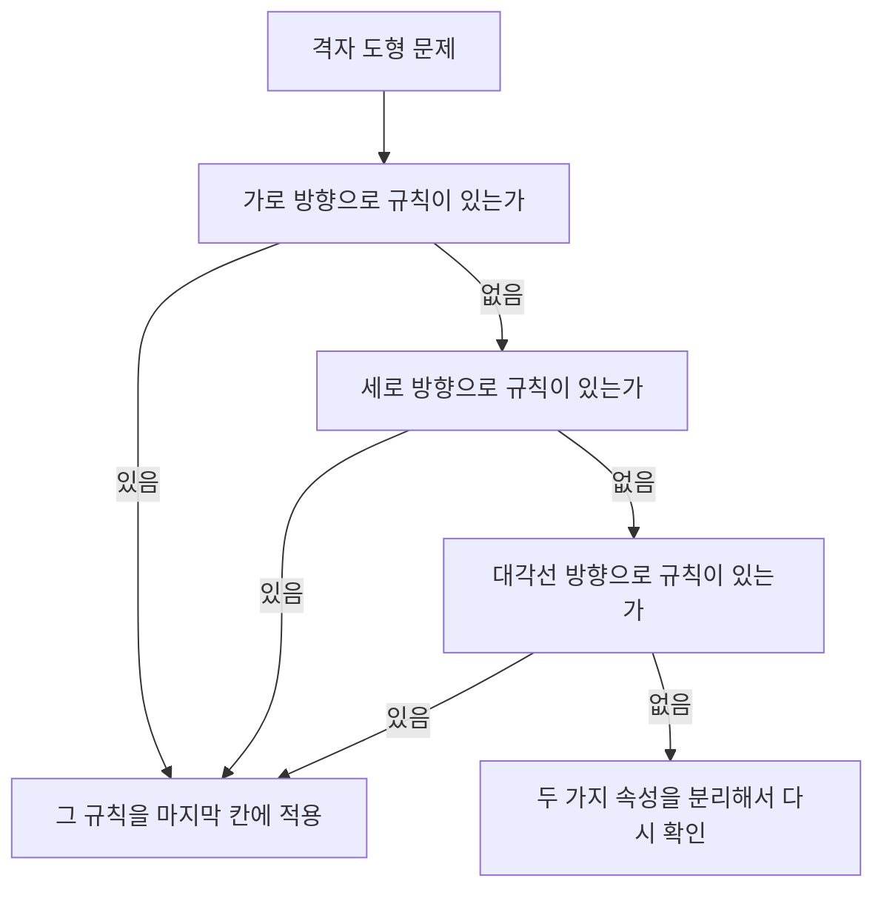

<Callout type="info">
  **이번 문서의 목표:** 도형이 나열된 문제에서 회전·대칭·색반전·개수 변화 규칙을 구분해 내고, 가로·세로·대각선을 순서대로 확인해 다음에 올 도형을 정확히 예측할 수 있게 된다.
</Callout>

## 왜 도형·규칙추리가 따로 다뤄지는가

04편에서 회전·대칭이라는 도형 감각의 기초 개념 자체를 익혔습니다. 도형·규칙추리는 그 개념을 실제로 나열된 여러 도형을 보고 "**이 도형들 사이에 어떤 규칙이 숨어 있는가**"를 찾아내는 데 적용하는 유형입니다.

이 유형이 어려운 이유는 문제 자체에 규칙이 문장으로 적혀 있지 않기 때문입니다. 언어논리(09편)는 글로 된 논증을 읽지만, 도형·규칙추리는 그림만 보고 규칙을 스스로 발견해야 합니다. 규칙을 잘못 짚으면 답이 아예 다른 방향으로 갑니다.

> **쉽게 말하면:** 도형·규칙추리는 "그림으로 된 수열 문제"입니다. 숫자 대신 도형이 일정한 패턴으로 바뀌어 가는 것을 보고, 다음 칸에 올 도형을 맞추는 것입니다.

## 규칙의 세 가지 기본 유형

도형이 칸마다 달라지는 방식은 크게 세 갈래로 나뉩니다. 실제 문제는 이 중 두세 가지가 동시에 섞여 나오는 경우가 많습니다.

| 규칙 유형 | 무엇이 바뀌는가 | 확인할 것 |
|-----------|------------------|-----------|
| 회전 | 도형의 방향이 시계 또는 반시계 방향으로 일정 각도씩 돈다 | 회전 방향(시계·반시계)과 회전 각도(45도, 90도 등)가 매번 같은가 |
| 대칭(반전) | 도형이 좌우 또는 상하로 뒤집힌다 | 회전과 겉모습이 비슷해 보일 수 있어 비대칭 요소로 구분해야 한다 |
| 색반전 | 도형 내부가 채워짐과 비워짐을 번갈아 바꾼다 | 색이 바뀌는 도형과 바뀌지 않는 도형을 나눠서 본다 |

**회전과 대칭을 헷갈리는 이유:** 정사각형이나 원처럼 좌우가 똑같이 생긴 도형은 90도 회전한 모습과 좌우로 뒤집은 모습이 똑같아 보입니다. 이때는 도형 안에 작게 표시된 점, 색칠된 한쪽 모서리처럼 **비대칭인 표식**을 기준으로 삼아야 회전인지 반전인지 구별할 수 있습니다.

## 규칙을 찾는 순서 — 가로, 세로, 그다음 대각선

여러 칸에 도형이 격자(그리드) 모양으로 배열된 문제(3행 3열이 가장 흔합니다)에서는 다음 순서로 규칙을 찾습니다.

가로부터 확인하는 이유는 단순합니다. 문제를 읽는 방향(왼쪽에서 오른쪽, 위에서 아래)과 같아서 가장 먼저 눈에 들어오고, 실제 시험 문제의 대다수가 가로 또는 세로 규칙만으로 풀리기 때문입니다. 대각선 규칙은 가로·세로 모두에서 뚜렷한 규칙이 안 보일 때 확인하는 마지막 수단입니다.

## 예시로 계산해 봅시다 — 회전과 개수의 이중 규칙

아래 3행 3열 표에서 마지막 칸(3행 3열)에 들어갈 도형을 구해 봅시다. 화살표는 방향을, 괄호 안 숫자는 점의 개수를 나타냅니다.

| | 1열 | 2열 | 3열 |
|---|------|------|------|
| 1행 | ↑ (점 1개) | → (점 1개) | ↓ (점 1개) |
| 2행 | → (점 2개) | ↓ (점 2개) | ← (점 2개) |
| 3행 | ↓ (점 3개) | ← (점 3개) | ? |

<Steps>

1. **가로(행) 방향부터 확인합니다.** 1행을 보면 화살표가 ↑ → ↓ 순서로 바뀝니다. ↑에서 →로는 시계 방향으로 90도, →에서 ↓로도 시계 방향으로 90도 돈 것입니다. 2행(→ ↓ ←)과 3행(↓ ← ?)도 각각 90도씩 시계 방향으로 도는 같은 규칙을 따릅니다.
2. **규칙을 적용해 마지막 칸의 화살표를 구합니다.** 3행의 마지막 화살표는 ←에서 시계 방향으로 90도 더 돈 방향이므로 **↑**입니다.
3. **세로(열) 방향도 확인해 규칙이 겹치는지 봅니다.** 1열은 ↑ → ↓, 2열은 → ↓ ←, 3열은 ↓ ← ?로, 역시 아래로 내려갈 때마다 시계 방향으로 90도씩 돕니다. 3열의 마지막 칸도 ←에서 90도 돈 **↑**로 같은 답이 나옵니다. 가로와 세로 규칙이 서로 다른 답을 준다면 둘 중 하나를 잘못 짚은 것이므로, 이렇게 교차 확인하면 실수를 줄일 수 있습니다.
4. **점의 개수라는 두 번째 속성을 따로 확인합니다.** 점 개수는 화살표와 별개로, **같은 행 안에서는 항상 같고 행이 바뀔 때마다 1개씩 늘어납니다**(1행 1개, 2행 2개, 3행 3개). 3행이므로 마지막 칸의 점 개수는 3개입니다.

</Steps>

**정답: ↑ (점 3개)**

**해석:** 이 문제는 화살표(회전 규칙)와 점 개수(행마다 증가하는 규칙)라는 **서로 독립된 두 가지 속성**이 한 칸 안에 동시에 들어 있습니다. 복합 규칙 문제를 풀 때는 이렇게 속성을 하나씩 분리해서 각각의 규칙을 따로 확인하는 것이 핵심입니다. 한 번에 전체를 보려 하면 오히려 규칙을 놓치기 쉽습니다.

## 색반전 규칙 확인하기

색반전은 세 규칙 중 가장 알아보기 쉽습니다. 채워짐(■)과 비워짐(□)이 번갈아 나타나는지만 보면 됩니다.

■ → □ → ■ → □ → **?**

바로 앞 도형이 □(비워짐)이므로 다음은 채워짐과 비워짐이 번갈아 나오는 규칙에 따라 **■**가 됩니다.

**복합 규칙에서 색반전을 먼저 분리하는 요령:** 회전과 색반전이 동시에 섞인 문제에서는 먼저 색만 따로 뽑아 "채워짐·비워짐이 몇 칸마다 바뀌는가"를 확인하고, 그다음 도형의 방향(회전)만 따로 봅니다. 두 속성을 한꺼번에 보려다 헷갈리는 경우가 가장 많은 실수 원인입니다.

## 대각선에서만 규칙이 보이는 경우

가로와 세로를 확인해도 뚜렷한 규칙이 안 보이면 대각선을 확인합니다. 예를 들어 아래처럼 가로줄과 세로줄의 도형이 제각각이라도, 왼쪽 위에서 오른쪽 아래로 이어지는 대각선(★ 표시 칸)의 도형만 서로 같다면, 그 대각선 규칙("이 대각선 위의 세 칸은 항상 같은 도형")을 이용해 빈칸을 채웁니다.

| | 1열 | 2열 | 3열 |
|---|------|------|------|
| 1행 | ★ | 다름 | 다름 |
| 2행 | 다름 | ★ | 다름 |
| 3행 | 다름 | 다름 | ★ |

**해석:** 가로·세로에는 각 칸이 제각각이라 규칙이 없어 보여도, 대각선 위의 세 칸만 놓고 보면 뚜렷한 공통점(동일한 도형)이 드러납니다. 실전에서는 이런 문제일수록 가로·세로만 보고 "규칙이 없다"고 성급히 포기하지 않는 것이 중요합니다.

## 자주 틀리는 점

- **회전과 반전을 구별하지 못합니다.** 좌우 대칭인 도형은 90도 회전과 좌우 반전이 똑같아 보입니다. 도형 안의 비대칭 표식(점, 색칠 부분, 화살표 머리 모양)을 기준으로 삼아야 정확히 구분됩니다.
- **회전 방향(시계·반시계)을 반대로 착각합니다.** 앞의 두 칸만 보고 방향을 정한 뒤 나머지 칸에서 검증하지 않으면, 실제로는 반시계 방향인데 시계 방향으로 잘못 이어가는 실수가 생깁니다. 최소 세 칸 이상에서 방향이 일관되는지 확인해야 합니다.
- **여러 규칙이 동시에 적용되는 것을 놓칩니다.** 회전만 확인하고 점 개수나 색 변화라는 두 번째 규칙을 놓치면, 화살표 방향은 맞아도 최종 답의 다른 속성(개수·색)이 틀립니다.
- **가로·세로에서 규칙을 찾자마자 대각선 확인을 생략합니다.** 가로와 세로가 서로 다른 답을 내놓는 경우도 있는데, 이때 대각선까지 확인하지 않으면 어느 쪽이 진짜 규칙인지 판단할 근거가 부족해집니다.
- **앞의 두세 칸만 보고 성급하게 규칙을 확정합니다.** 우연히 두 칸이 맞아떨어져도 전체 줄에서 일관되게 성립하는지 반드시 끝까지 확인해야 합니다.

## 핵심 정리

- 도형이 바뀌는 방식은 회전, 대칭(반전), 색반전 세 갈래로 나뉘며, 실전에서는 두세 가지가 함께 섞여 나온다.
- 좌우가 대칭인 도형은 회전과 반전이 같아 보이므로 비대칭 표식으로 구분한다.
- 규칙은 **가로 → 세로 → 대각선** 순서로 확인하며, 가로·세로가 서로 다른 답을 주면 어느 한쪽을 잘못 짚은 것이다.
- 화살표(방향)와 점 개수(수량)처럼 서로 다른 속성이 함께 있으면, 속성을 하나씩 분리해서 각각 규칙을 확인한다.
- 앞의 두세 칸만 보고 성급히 결론짓지 않고, 줄 전체에서 규칙이 일관되게 성립하는지 검증한다.

## 마무리 복습

<Quiz
  questionNumber={1}
  question="3행 3열 표에서 1행은 화살표가 순서대로 위쪽, 오른쪽, 아래쪽 방향으로 나타나고, 2행은 오른쪽, 아래쪽, 왼쪽 방향, 3행은 아래쪽, 왼쪽, 그리고 마지막 칸이 비어 있다. 각 행에서 화살표가 시계 방향으로 90도씩 회전한다는 규칙을 적용할 때 3행 마지막 칸의 방향은?"
  options={['위쪽', '오른쪽', '아래쪽', '왼쪽']}
  correctAnswer={1}
  explanation="3행은 아래쪽에서 시작해 왼쪽으로 시계 방향 90도 회전했으므로, 다음 칸은 왼쪽에서 시계 방향으로 90도 더 회전한 위쪽 방향이 된다."
  optionExplanations={['왼쪽에서 시계 방향으로 90도 회전하면 위쪽이 되므로 정답이다.', '오른쪽은 90도가 아니라 180도 더 회전한 방향이다.', '아래쪽은 이미 지나간 방향이며 한 바퀴를 다 돌아야 다시 나온다.', '왼쪽은 바로 앞 칸의 방향이지 다음 칸의 방향이 아니다.']}
/>

<Quiz
  questionNumber={2}
  question="어떤 도형 나열 문제에서 좌우가 완전히 대칭인 정사각형이 매 칸 90도씩 회전하는 것처럼 보인다. 이 도형이 실제로 회전한 것인지 좌우로 반전된 것인지 구별하는 가장 적절한 방법은?"
  options={['정사각형의 전체 윤곽이 매번 정사각형으로 유지되는지 확인한다', '정사각형 안에 있는 작은 점이나 색칠된 모서리 같은 비대칭 표식의 위치 변화를 확인한다', '정사각형의 한 변의 길이가 매번 같은지 확인한다', '앞뒤 두 칸의 정사각형 크기를 비교한다']}
  correctAnswer={2}
  explanation="정사각형처럼 좌우가 대칭인 도형은 회전과 반전의 겉모습이 같아 보일 수 있다. 이때는 도형 안의 비대칭 표식이 어느 방향으로 움직였는지를 보아야 회전인지 반전인지 정확히 구분할 수 있다."
  optionExplanations={['정사각형이라는 윤곽 자체는 회전해도 반전해도 그대로 유지되므로 구별 기준이 되지 못한다.', '비대칭 표식의 이동 방향으로 회전과 반전을 구분할 수 있으므로 옳다.', '변의 길이는 회전이나 반전 모두에서 변하지 않으므로 구별 기준이 아니다.', '크기는 회전·반전과 무관한 속성이다.']}
/>

<Quiz
  questionNumber={3}
  question="채워진 사각형과 빈 사각형이 순서대로 채워짐, 비워짐, 채워짐, 비워짐으로 나타난다. 다음에 올 도형로 가장 적절한 것은?"
  options={['채워진 사각형', '빈 사각형', '두 도형이 겹친 모양', '판단할 수 없음']}
  correctAnswer={1}
  explanation="채워짐과 비워짐이 한 칸씩 번갈아 나타나는 색반전 규칙이며, 바로 앞 칸이 비워짐이므로 다음 칸은 채워진 사각형이 된다."
  optionExplanations={['번갈아 나타나는 규칙에 따라 다음 칸이 채워진 사각형이 되므로 정답이다.', '바로 앞 칸이 이미 비워짐이므로 같은 상태가 반복되지 않는다.', '색반전 규칙에는 두 도형이 겹치는 상태가 없다.', '채워짐·비워짐이 한 칸씩 번갈아 나타나는 규칙이 뚜렷하므로 판단이 가능하다.']}
/>

<Quiz
  questionNumber={4}
  question="3행 3열 표에서 가로 방향과 세로 방향 모두 뚜렷한 규칙이 보이지 않을 때, 다음으로 확인해야 할 방향으로 가장 적절한 것은?"
  options={['도형의 크기 변화', '대각선 방향', '표 바깥의 여백', '문제 번호의 순서']}
  correctAnswer={2}
  explanation="가로와 세로를 모두 확인해도 규칙이 보이지 않으면 왼쪽 위에서 오른쪽 아래로, 또는 오른쪽 위에서 왼쪽 아래로 이어지는 대각선 방향의 공통점을 확인하는 것이 다음 순서다."
  optionExplanations={['크기 변화는 별도의 속성 확인이지 방향 확인의 대안이 아니다.', '가로·세로 다음으로 확인하는 방향이 대각선이므로 정답이다.', '표 바깥 여백은 규칙과 무관하다.', '문제 번호는 규칙 확인과 아무 관련이 없다.']}
/>

<Quiz
  questionNumber={5}
  question="어떤 칸에는 화살표의 방향이 매 칸 90도씩 회전하고, 동시에 점의 개수가 행이 바뀔 때마다 1개씩 늘어난다. 이런 복합 규칙 문제를 풀 때 가장 적절한 접근은?"
  options={['화살표와 점의 개수를 동시에 한 번에 살펴보고 바로 답을 정한다', '화살표 방향과 점의 개수라는 두 속성을 각각 따로 분리해서 규칙을 확인한다', '점의 개수만 확인하고 화살표는 무시한다', '화살표 방향만 확인하고 점의 개수는 무시한다']}
  correctAnswer={2}
  explanation="서로 독립된 두 속성이 함께 있을 때는 하나씩 분리해서 각각의 규칙을 확인하는 것이 실수를 줄이는 방법이다. 한 번에 전체를 보려 하면 오히려 규칙을 놓치기 쉽다."
  optionExplanations={['두 속성을 한꺼번에 보면 규칙을 놓치기 쉽다.', '속성을 분리해서 각각 확인하는 것이 정확도를 높이는 방법이므로 정답이다.', '화살표 방향이라는 속성 하나를 놓치면 답의 일부가 틀린다.', '점의 개수라는 속성 하나를 놓치면 답의 일부가 틀린다.']}
/>

<Quiz
  questionNumber={6}
  question="3행 3열 표에서 가로줄과 세로줄에 있는 도형들이 각 줄마다 제각각이지만, 왼쪽 위에서 오른쪽 아래로 이어지는 세 칸의 도형만 서로 같다. 이 표에 대한 설명으로 가장 적절한 것은?"
  options={['이 표에는 규칙이 전혀 존재하지 않는다', '가로·세로 규칙이 없으므로 무작위로 답을 골라야 한다', '대각선 위의 세 칸이 같다는 규칙이 성립하므로 이를 이용해 빈칸을 채울 수 있다', '점의 개수 규칙만 확인하면 충분하다']}
  correctAnswer={3}
  explanation="가로·세로에 뚜렷한 규칙이 없어도 대각선 위의 칸들에서 공통 규칙이 발견될 수 있다. 이 경우 대각선 규칙을 이용해 빈칸의 도형을 결정할 수 있다."
  optionExplanations={['가로·세로에 없을 뿐 대각선에는 뚜렷한 규칙이 존재한다.', '대각선 규칙이라는 근거가 있으므로 무작위로 고를 필요가 없다.', '대각선 위의 세 칸이 같다는 공통점이 규칙이 되므로 정답이다.', '이 문제에는 점의 개수에 대한 설명이 없으므로 관련이 없다.']}
/>

## 참고 자료

- [링커리어 - 인적성 검사 공부법 GSAT·SKCT·HMAT, 2026 최신 시험 구성 비교](https://community.linkareer.com/employment_data/6482010)
- [나무위키 - 적성검사](https://namu.wiki/w/%EC%A0%81%EC%84%B1%EA%B2%80%EC%82%AC)
